# 配置管理

<cite>
**本文引用的文件**
- [apps/cli/src/lib/storage/settings.ts](file://apps/cli/src/lib/storage/settings.ts)
- [apps/cli/src/lib/storage/credentials.ts](file://apps/cli/src/lib/storage/credentials.ts)
- [apps/cli/src/lib/storage/history.ts](file://apps/cli/src/lib/storage/history.ts)
- [src/utils/config.ts](file://src/utils/config.ts)
- [src/utils/migrateSettings.ts](file://src/utils/migrateSettings.ts)
- [src/core/config/ProviderSettingsManager.ts](file://src/core/config/ProviderSettingsManager.ts)
- [src/core/config/ContextProxy.ts](file://src/core/config/ContextProxy.ts)
- [src/services/mcp/McpHub.ts](file://src/services/mcp/McpHub.ts)
- [src/utils/__tests__/config.spec.ts](file://src/utils/__tests__/config.spec.ts)
- [src/__tests__/migrateSettings.spec.ts](file://src/__tests__/migrateSettings.spec.ts)
</cite>

## 目录
1. [简介](#简介)
2. [项目结构](#项目结构)
3. [核心组件](#核心组件)
4. [架构总览](#架构总览)
5. [详细组件分析](#详细组件分析)
6. [依赖关系分析](#依赖关系分析)
7. [性能考虑](#性能考虑)
8. [故障排除指南](#故障排除指南)
9. [结论](#结论)
10. [附录](#附录)

## 简介
本技术文档面向 CLI 配置管理，系统化阐述配置文件格式（JSON、YAML）、配置项定义与默认值、环境变量注入、命令行参数覆盖与优先级规则、配置验证与迁移、版本兼容性处理、认证与密钥管理、安全存储方案、配置热重载与动态更新、以及配置审计能力。文档以仓库中的实际实现为依据，提供可操作的最佳实践与可视化图示。

## 项目结构
配置管理相关代码主要分布在以下位置：
- CLI 存储层：CLI 设置、凭据、历史记录等本地持久化
- 核心配置管理层：VSCode 扩展上下文代理、提供者配置管理器
- 工具层：环境变量注入、设置迁移
- MCP 服务：配置变更监听与校验

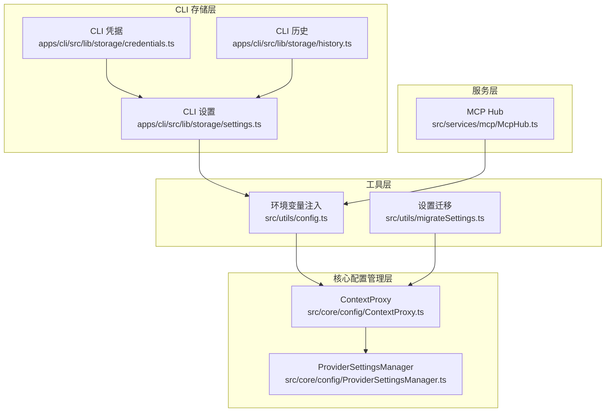

**图表来源**
- [apps/cli/src/lib/storage/settings.ts:1-41](file://apps/cli/src/lib/storage/settings.ts#L1-L41)
- [apps/cli/src/lib/storage/credentials.ts:1-53](file://apps/cli/src/lib/storage/credentials.ts#L1-L53)
- [apps/cli/src/lib/storage/history.ts:1-52](file://apps/cli/src/lib/storage/history.ts#L1-L52)
- [src/core/config/ContextProxy.ts:1-589](file://src/core/config/ContextProxy.ts#L1-L589)
- [src/core/config/ProviderSettingsManager.ts:1-882](file://src/core/config/ProviderSettingsManager.ts#L1-L882)
- [src/utils/config.ts:1-67](file://src/utils/config.ts#L1-L67)
- [src/utils/migrateSettings.ts:1-173](file://src/utils/migrateSettings.ts#L1-L173)
- [src/services/mcp/McpHub.ts:308-347](file://src/services/mcp/McpHub.ts#L308-L347)

**章节来源**
- [apps/cli/src/lib/storage/settings.ts:1-41](file://apps/cli/src/lib/storage/settings.ts#L1-L41)
- [apps/cli/src/lib/storage/credentials.ts:1-53](file://apps/cli/src/lib/storage/credentials.ts#L1-L53)
- [apps/cli/src/lib/storage/history.ts:1-52](file://apps/cli/src/lib/storage/history.ts#L1-L52)
- [src/core/config/ContextProxy.ts:1-589](file://src/core/config/ContextProxy.ts#L1-L589)
- [src/core/config/ProviderSettingsManager.ts:1-882](file://src/core/config/ProviderSettingsManager.ts#L1-L882)
- [src/utils/config.ts:1-67](file://src/utils/config.ts#L1-L67)
- [src/utils/migrateSettings.ts:1-173](file://src/utils/migrateSettings.ts#L1-L173)
- [src/services/mcp/McpHub.ts:308-347](file://src/services/mcp/McpHub.ts#L308-L347)

## 核心组件
- CLI 设置存储：负责 CLI 配置的读取、合并写入与重置引导流程
- CLI 凭据存储：负责令牌与用户组织信息的安全持久化
- CLI 历史存储：负责命令历史的版本化与清理
- 环境变量注入：深度替换配置中的占位符，支持嵌套变量与路径规范化
- 设置迁移：文件名迁移、内容转换（JSON→YAML）与安全修复
- 上下文代理（ContextProxy）：统一访问全局状态与机密，提供迁移与校验
- 提供者配置管理器（ProviderSettingsManager）：提供者配置的增删改查、激活、导出导入、模型迁移与安全存储
- MCP Hub：监听配置文件变更，进行解析与校验

**章节来源**
- [apps/cli/src/lib/storage/settings.ts:1-41](file://apps/cli/src/lib/storage/settings.ts#L1-L41)
- [apps/cli/src/lib/storage/credentials.ts:1-53](file://apps/cli/src/lib/storage/credentials.ts#L1-L53)
- [apps/cli/src/lib/storage/history.ts:1-52](file://apps/cli/src/lib/storage/history.ts#L1-L52)
- [src/utils/config.ts:1-67](file://src/utils/config.ts#L1-L67)
- [src/utils/migrateSettings.ts:1-173](file://src/utils/migrateSettings.ts#L1-L173)
- [src/core/config/ContextProxy.ts:1-589](file://src/core/config/ContextProxy.ts#L1-L589)
- [src/core/config/ProviderSettingsManager.ts:1-882](file://src/core/config/ProviderSettingsManager.ts#L1-L882)
- [src/services/mcp/McpHub.ts:308-347](file://src/services/mcp/McpHub.ts#L308-L347)

## 架构总览
配置管理采用“分层+代理+工具”的架构：
- 表现层（CLI）：读写本地 JSON 文件
- 应用层（VSCode 扩展）：使用 ContextProxy 统一访问全局状态与机密，并通过 ProviderSettingsManager 管理提供者配置
- 工具层：环境变量注入与设置迁移
- 服务层：MCP 配置变更监听与校验

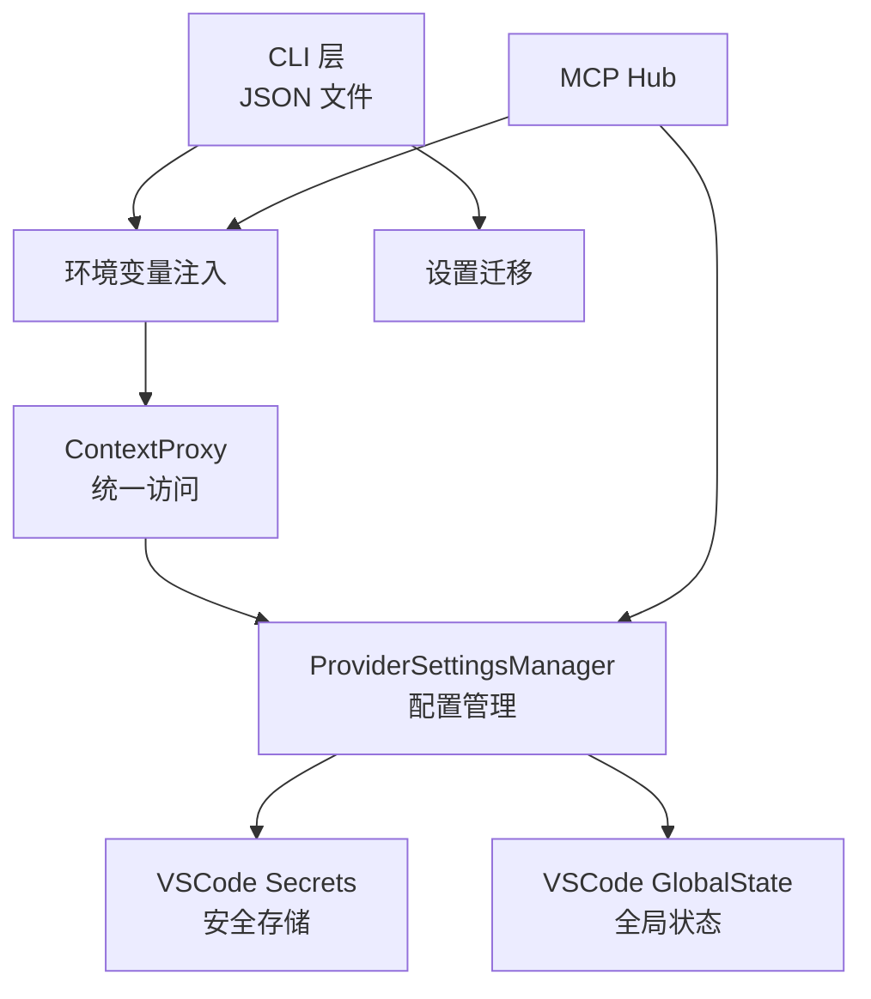

**图表来源**
- [apps/cli/src/lib/storage/settings.ts:1-41](file://apps/cli/src/lib/storage/settings.ts#L1-L41)
- [src/utils/config.ts:1-67](file://src/utils/config.ts#L1-L67)
- [src/core/config/ContextProxy.ts:1-589](file://src/core/config/ContextProxy.ts#L1-L589)
- [src/core/config/ProviderSettingsManager.ts:1-882](file://src/core/config/ProviderSettingsManager.ts#L1-L882)
- [src/utils/migrateSettings.ts:1-173](file://src/utils/migrateSettings.ts#L1-L173)
- [src/services/mcp/McpHub.ts:308-347](file://src/services/mcp/McpHub.ts#L308-L347)

## 详细组件分析

### CLI 设置存储（JSON）
- 文件位置：CLI 设置位于配置目录下的 JSON 文件，读取失败时返回空对象；写入时对现有配置进行浅合并，保留权限为仅所有者可读写
- 关键行为：加载、保存、重置引导流程（清除引导选择）

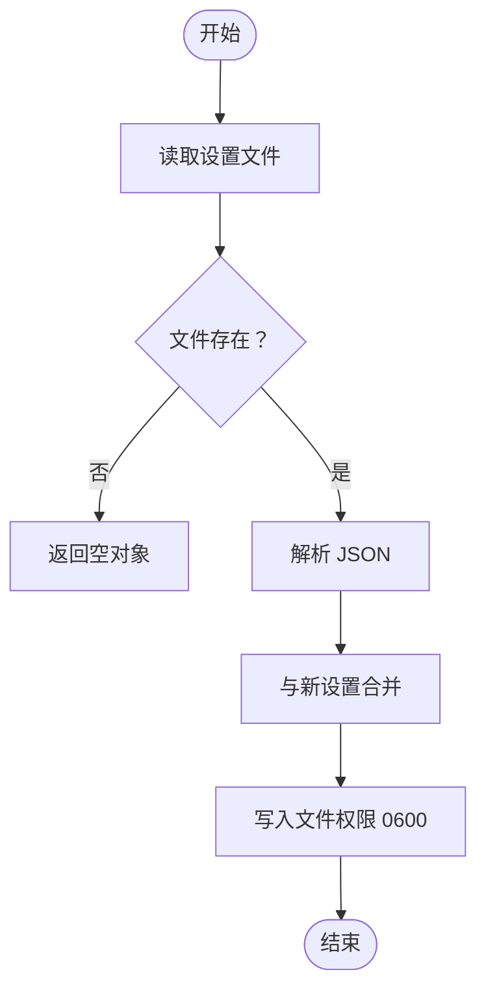

**图表来源**
- [apps/cli/src/lib/storage/settings.ts:12-36](file://apps/cli/src/lib/storage/settings.ts#L12-L36)

**章节来源**
- [apps/cli/src/lib/storage/settings.ts:1-41](file://apps/cli/src/lib/storage/settings.ts#L1-L41)

### CLI 凭据存储（JSON）
- 文件位置：凭据文件位于配置目录，包含令牌、创建时间与可选用户/组织标识
- 安全策略：写入时设置严格权限，读取失败返回空值或抛错

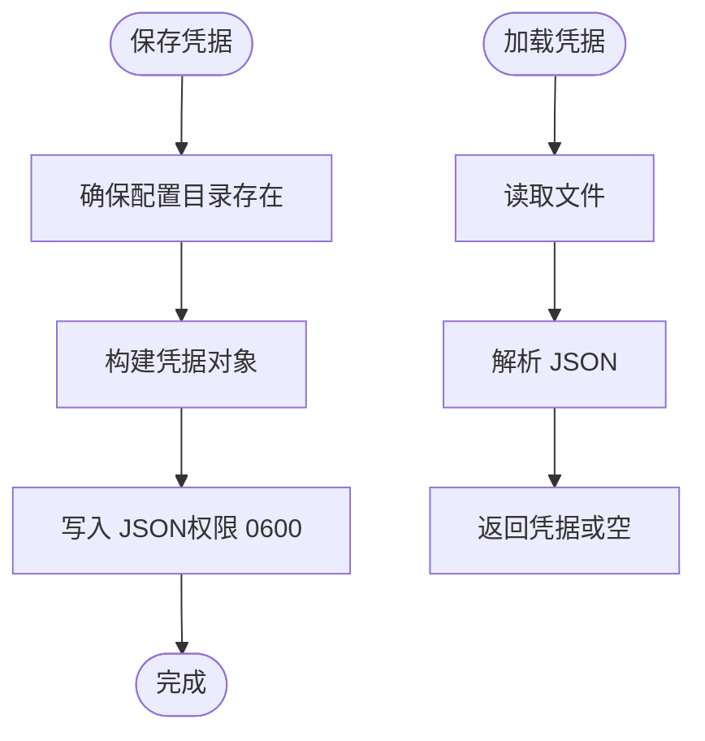

**图表来源**
- [apps/cli/src/lib/storage/credentials.ts:15-41](file://apps/cli/src/lib/storage/credentials.ts#L15-L41)

**章节来源**
- [apps/cli/src/lib/storage/credentials.ts:1-53](file://apps/cli/src/lib/storage/credentials.ts#L1-L53)

### CLI 历史存储（JSON）
- 结构：包含版本号与字符串数组条目
- 行为：加载时过滤无效条目，不存在时返回空数组

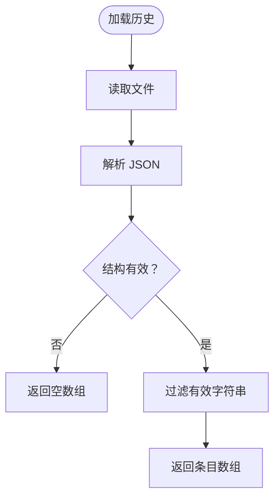

**图表来源**
- [apps/cli/src/lib/storage/history.ts:28-52](file://apps/cli/src/lib/storage/history.ts#L28-L52)

**章节来源**
- [apps/cli/src/lib/storage/history.ts:1-52](file://apps/cli/src/lib/storage/history.ts#L1-L52)

### 环境变量注入（深度变量替换）
- 支持 VSCode 变量语法：${var} 与 ${env:VAR}
- 特性：不修改原对象、路径规范化（跨平台正斜杠）、缺失键回退值、嵌套变量处理
- 测试覆盖：字符串、对象、数组、嵌套结构、路径规范化、缺失键告警

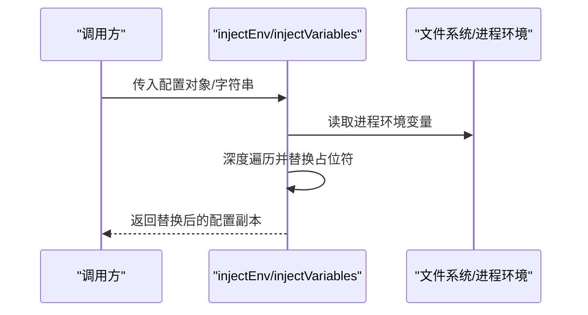

**图表来源**
- [src/utils/config.ts:20-66](file://src/utils/config.ts#L20-L66)
- [src/utils/__tests__/config.spec.ts:46-90](file://src/utils/__tests__/config.spec.ts#L46-L90)

**章节来源**
- [src/utils/config.ts:1-67](file://src/utils/config.ts#L1-L67)
- [src/utils/__tests__/config.spec.ts:46-90](file://src/utils/__tests__/config.spec.ts#L46-L90)

### 设置迁移（文件名与内容转换）
- 文件名迁移：将旧文件名重命名为新文件名
- 内容迁移：JSON→YAML 转换，保留原始 JSON 以便回滚
- 安全修复：移除旧默认命令列表中的高风险命令
- 输出通道日志：记录迁移过程与错误

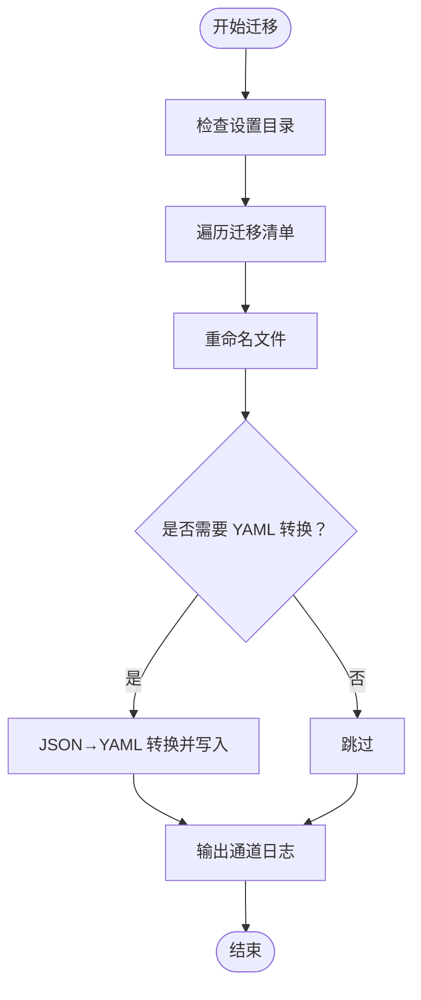

**图表来源**
- [src/utils/migrateSettings.ts:16-118](file://src/utils/migrateSettings.ts#L16-L118)

**章节来源**
- [src/utils/migrateSettings.ts:1-173](file://src/utils/migrateSettings.ts#L1-L173)
- [src/__tests__/migrateSettings.spec.ts:134-235](file://src/__tests__/migrateSettings.spec.ts#L134-L235)

### 上下文代理（ContextProxy）
- 统一访问 VSCode 全局状态与机密，维护内存缓存
- 初始化时批量加载并执行多项迁移：无效提供者清理、图像生成设置扁平化、旧默认提示迁移、旧 v1 默认提示清理
- 提供者设置与全局设置的解析与校验，支持导出与重置

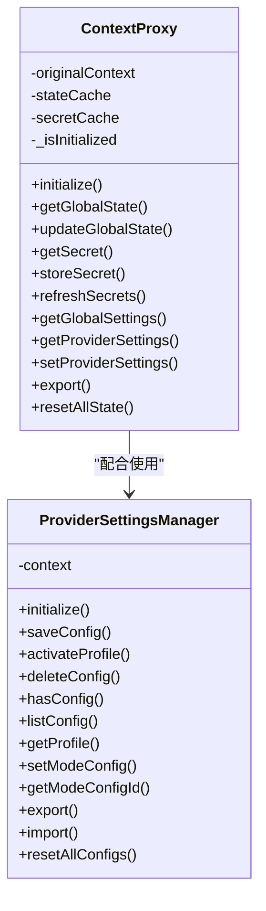

**图表来源**
- [src/core/config/ContextProxy.ts:40-589](file://src/core/config/ContextProxy.ts#L40-L589)
- [src/core/config/ProviderSettingsManager.ts:57-882](file://src/core/config/ProviderSettingsManager.ts#L57-L882)

**章节来源**
- [src/core/config/ContextProxy.ts:1-589](file://src/core/config/ContextProxy.ts#L1-L589)
- [src/core/config/ProviderSettingsManager.ts:1-882](file://src/core/config/ProviderSettingsManager.ts#L1-L882)

### 提供者配置管理器（ProviderSettingsManager）
- 默认配置与模式映射：初始化默认配置、为各模式分配默认配置 ID
- 配置持久化：使用 VSCode Secrets 存储，Zod 校验与过滤
- 迁移策略：速率限制秒数、OpenAI 头部、连续错误限制、待办启用、Claude 本地包装器遗留字段清理
- 模型迁移：按提供者映射表迁移模型 ID
- 同步云配置：与云端配置同步，处理名称冲突与机密保留

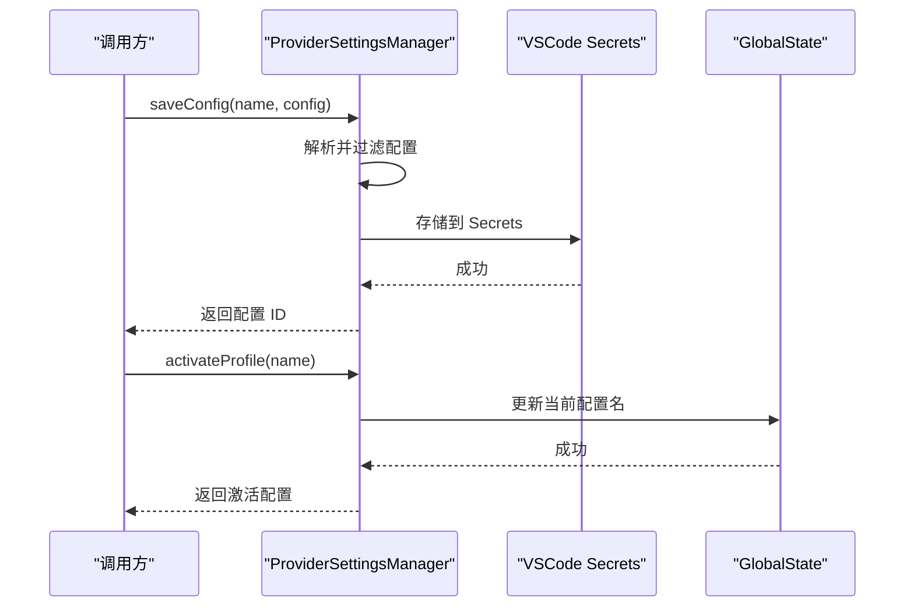

**图表来源**
- [src/core/config/ProviderSettingsManager.ts:355-437](file://src/core/config/ProviderSettingsManager.ts#L355-L437)

**章节来源**
- [src/core/config/ProviderSettingsManager.ts:1-882](file://src/core/config/ProviderSettingsManager.ts#L1-L882)

### MCP 配置变更监听与校验
- 监听配置文件变更，去抖动处理
- 解析 JSON 并使用 Zod Schema 校验
- 错误提示与用户反馈

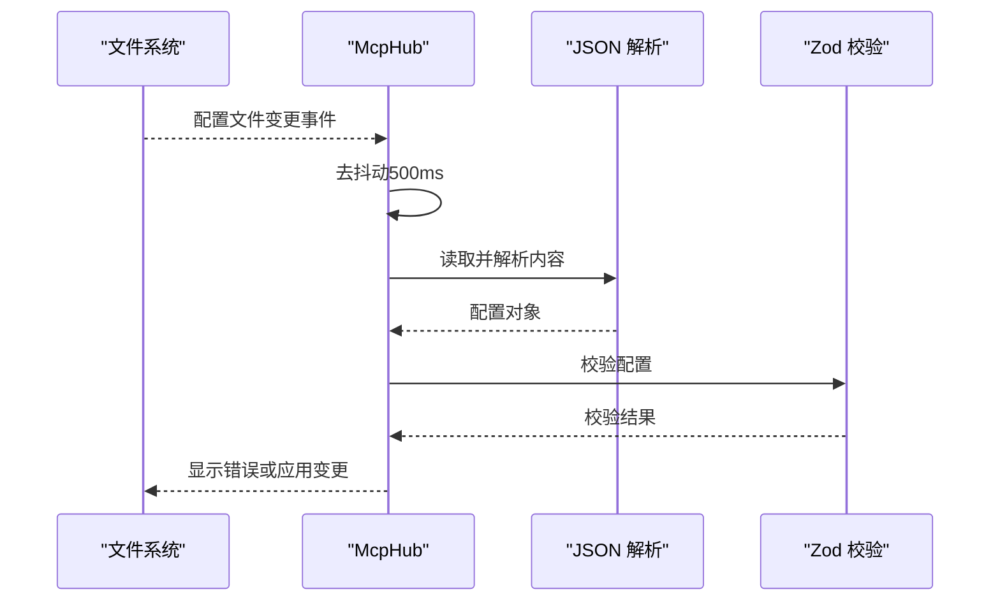

**图表来源**
- [src/services/mcp/McpHub.ts:308-347](file://src/services/mcp/McpHub.ts#L308-L347)

**章节来源**
- [src/services/mcp/McpHub.ts:308-347](file://src/services/mcp/McpHub.ts#L308-L347)

## 依赖关系分析
- CLI 存储层依赖文件系统与配置目录
- 环境变量注入依赖进程环境变量
- 上下文代理依赖 VSCode 扩展上下文（全局状态与机密）
- 提供者配置管理器依赖 VSCode Secrets 与 Zod 校验
- MCP Hub 依赖文件系统与 Zod Schema

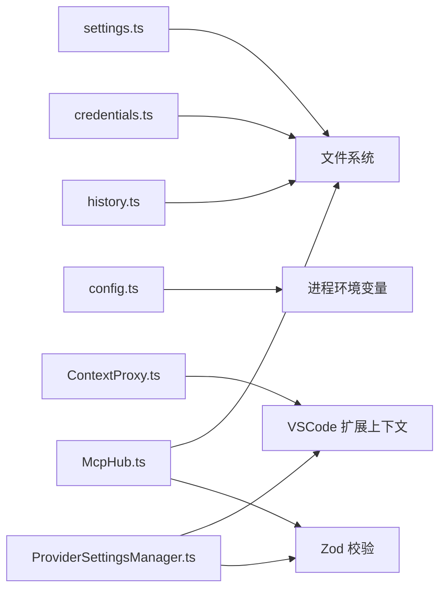

**图表来源**
- [apps/cli/src/lib/storage/settings.ts:1-41](file://apps/cli/src/lib/storage/settings.ts#L1-L41)
- [apps/cli/src/lib/storage/credentials.ts:1-53](file://apps/cli/src/lib/storage/credentials.ts#L1-L53)
- [apps/cli/src/lib/storage/history.ts:1-52](file://apps/cli/src/lib/storage/history.ts#L1-L52)
- [src/utils/config.ts:1-67](file://src/utils/config.ts#L1-L67)
- [src/core/config/ContextProxy.ts:1-589](file://src/core/config/ContextProxy.ts#L1-L589)
- [src/core/config/ProviderSettingsManager.ts:1-882](file://src/core/config/ProviderSettingsManager.ts#L1-L882)
- [src/services/mcp/McpHub.ts:308-347](file://src/services/mcp/McpHub.ts#L308-L347)

**章节来源**
- [apps/cli/src/lib/storage/settings.ts:1-41](file://apps/cli/src/lib/storage/settings.ts#L1-L41)
- [apps/cli/src/lib/storage/credentials.ts:1-53](file://apps/cli/src/lib/storage/credentials.ts#L1-L53)
- [apps/cli/src/lib/storage/history.ts:1-52](file://apps/cli/src/lib/storage/history.ts#L1-L52)
- [src/utils/config.ts:1-67](file://src/utils/config.ts#L1-L67)
- [src/core/config/ContextProxy.ts:1-589](file://src/core/config/ContextProxy.ts#L1-L589)
- [src/core/config/ProviderSettingsManager.ts:1-882](file://src/core/config/ProviderSettingsManager.ts#L1-L882)
- [src/services/mcp/McpHub.ts:308-347](file://src/services/mcp/McpHub.ts#L308-L347)

## 性能考虑
- 去抖动：MCP 配置变更监听使用 500ms 去抖动，避免频繁重载
- 并发控制：提供者配置管理器内部使用锁保证读写一致性
- 缓存：ContextProxy 在内存中缓存全局状态与机密，减少重复读取
- 路径规范化：环境变量注入对路径进行规范化，减少跨平台差异带来的额外处理成本

[本节为通用性能建议，无需特定文件引用]

## 故障排除指南
- 环境变量注入未生效
  - 检查变量名拼写与嵌套语法
  - 确认缺失变量时的回退值是否正确
  - 查看控制台警告日志
  - 参考测试用例定位问题
- 设置迁移失败
  - 查看输出通道日志
  - 确认目标文件是否存在且无写权限冲突
  - 检查 JSON 内容是否损坏
- MCP 配置无效
  - 检查 JSON 语法与 Zod 校验错误消息
  - 确认配置文件路径与监听范围
- 凭据读取异常
  - 检查文件权限与存在性
  - 确认 JSON 结构与字段完整性

**章节来源**
- [src/utils/config.ts:1-67](file://src/utils/config.ts#L1-L67)
- [src/utils/__tests__/config.spec.ts:78-90](file://src/utils/__tests__/config.spec.ts#L78-L90)
- [src/utils/migrateSettings.ts:61-66](file://src/utils/migrateSettings.ts#L61-L66)
- [src/services/mcp/McpHub.ts:332-347](file://src/services/mcp/McpHub.ts#L332-L347)
- [apps/cli/src/lib/storage/credentials.ts:30-53](file://apps/cli/src/lib/storage/credentials.ts#L30-L53)

## 结论
本配置管理体系通过 CLI 存储层、VSCode 上下文代理与提供者配置管理器形成闭环，结合环境变量注入与设置迁移，实现了从配置读写、校验、迁移、安全存储到动态更新的完整链路。MCP 配置变更监听进一步增强了配置的实时性与可靠性。建议在生产环境中遵循最小权限原则、定期备份配置文件，并利用迁移与校验机制保障版本演进的稳定性。

[本节为总结性内容，无需特定文件引用]

## 附录

### 配置文件格式与默认值
- CLI 设置：JSON，首次加载返回空对象，保存时与现有配置合并
- CLI 凭据：JSON，包含令牌、创建时间与可选用户/组织标识
- CLI 历史：JSON，包含版本号与条目数组
- 设置迁移：支持文件名迁移与 JSON→YAML 内容转换

**章节来源**
- [apps/cli/src/lib/storage/settings.ts:12-36](file://apps/cli/src/lib/storage/settings.ts#L12-L36)
- [apps/cli/src/lib/storage/credentials.ts:15-41](file://apps/cli/src/lib/storage/credentials.ts#L15-L41)
- [apps/cli/src/lib/storage/history.ts:12-52](file://apps/cli/src/lib/storage/history.ts#L12-L52)
- [src/utils/migrateSettings.ts:72-118](file://src/utils/migrateSettings.ts#L72-L118)

### 环境变量配置与命令行参数覆盖
- 环境变量注入：支持 ${var} 与 ${env:VAR}，路径规范化，缺失键回退
- 命令行参数覆盖：CLI 存储层未直接实现命令行解析，建议在上层应用中实现参数解析后注入环境变量

**章节来源**
- [src/utils/config.ts:20-66](file://src/utils/config.ts#L20-L66)
- [apps/cli/src/lib/storage/settings.ts:1-41](file://apps/cli/src/lib/storage/settings.ts#L1-L41)

### 配置验证、迁移与版本兼容
- Zod 校验：ProviderSettingsManager 与 ContextProxy 使用 Zod 对配置进行严格校验
- 迁移策略：速率限制、头部、连续错误限制、待办启用、模型迁移、Claude 本地包装器清理
- 版本兼容：历史文件包含版本号，便于未来迁移

**章节来源**
- [src/core/config/ProviderSettingsManager.ts:102-203](file://src/core/config/ProviderSettingsManager.ts#L102-L203)
- [src/core/config/ContextProxy.ts:58-104](file://src/core/config/ContextProxy.ts#L58-L104)
- [apps/cli/src/lib/storage/history.ts:9-15](file://apps/cli/src/lib/storage/history.ts#L9-L15)

### 认证配置、API 密钥管理与安全存储
- 安全存储：VSCode Secrets 用于存放机密，ContextProxy 提供统一存取接口
- 凭据管理：CLI 凭据文件使用严格权限，包含令牌与元数据
- 迁移：ContextProxy 将旧嵌套结构迁移至机密存储，避免泄露

**章节来源**
- [src/core/config/ContextProxy.ts:350-390](file://src/core/config/ContextProxy.ts#L350-L390)
- [apps/cli/src/lib/storage/credentials.ts:15-28](file://apps/cli/src/lib/storage/credentials.ts#L15-L28)

### 配置热重载、动态更新与审计
- 热重载：MCP Hub 监听配置文件变更并进行去抖动处理与校验
- 动态更新：ProviderSettingsManager 支持激活配置与模式映射更新
- 审计：Zod 校验错误会通过遥测服务上报，便于问题追踪

**章节来源**
- [src/services/mcp/McpHub.ts:308-347](file://src/services/mcp/McpHub.ts#L308-L347)
- [src/core/config/ProviderSettingsManager.ts:422-437](file://src/core/config/ProviderSettingsManager.ts#L422-L437)
- [src/core/config/ContextProxy.ts:409-414](file://src/core/config/ContextProxy.ts#L409-L414)