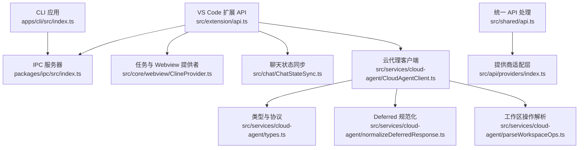
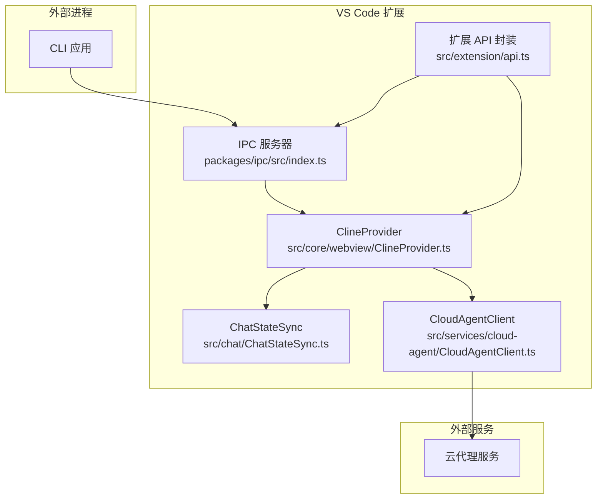
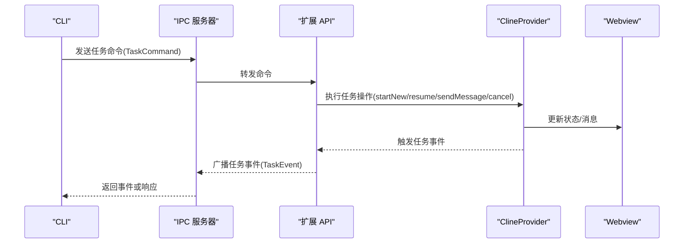
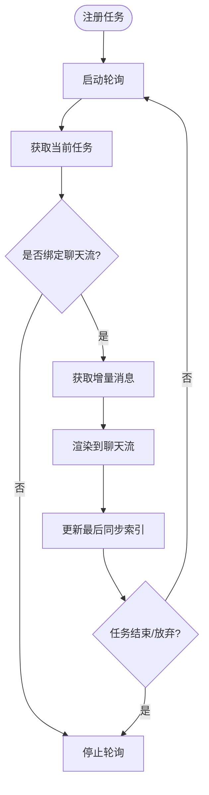
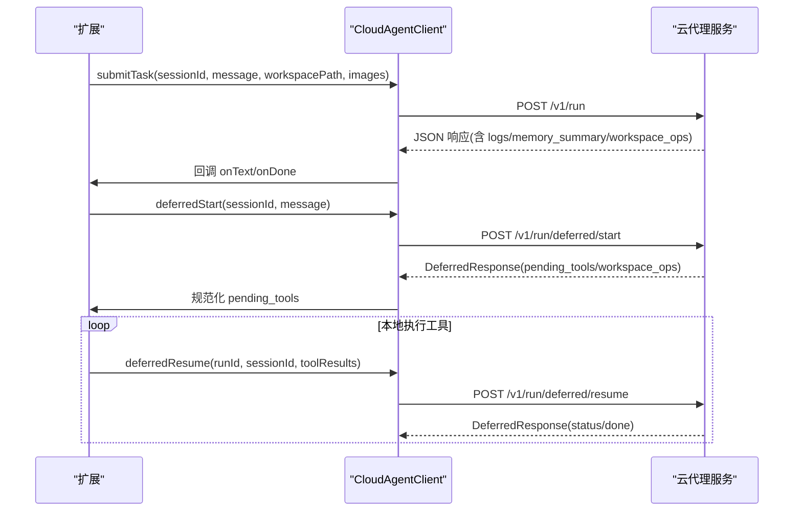
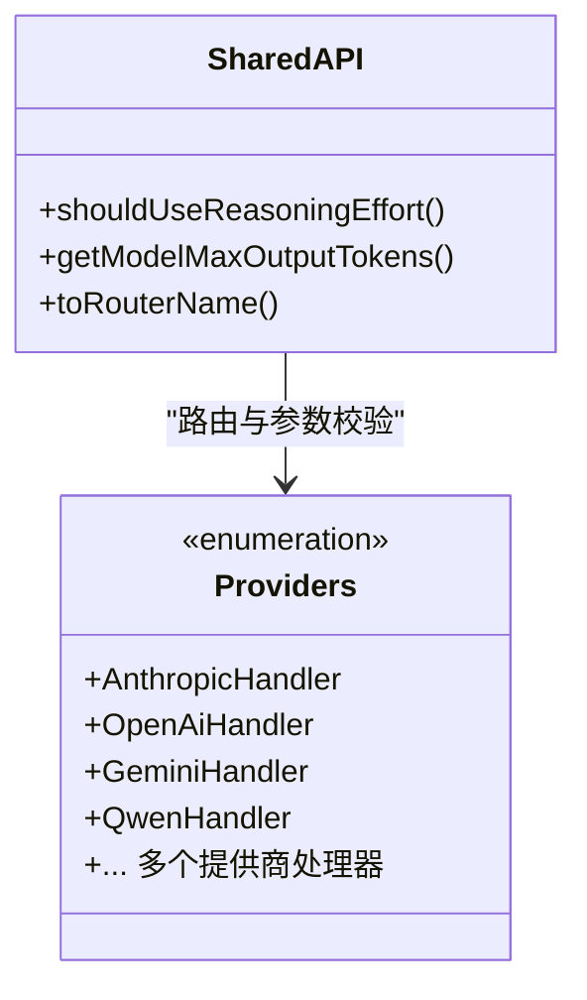
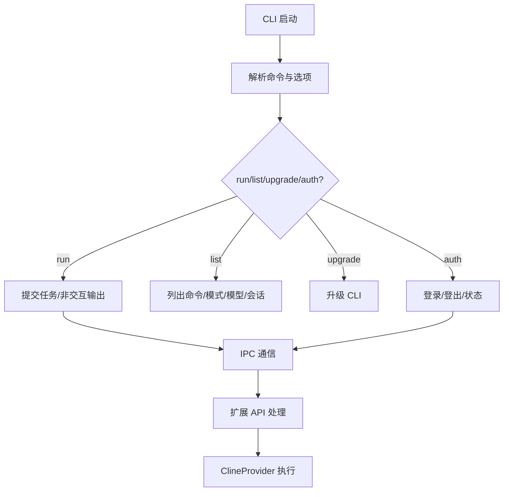
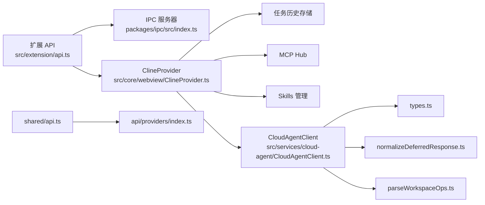

# 集成与同步

<cite>
**本文引用的文件**
- [apps/cli/src/index.ts](file://apps/cli/src/index.ts)
- [src/chat/ChatStateSync.ts](file://src/chat/ChatStateSync.ts)
- [src/services/cloud-agent/CloudAgentClient.ts](file://src/services/cloud-agent/CloudAgentClient.ts)
- [src/shared/api.ts](file://src/shared/api.ts)
- [src/extension/api.ts](file://src/extension/api.ts)
- [src/core/webview/ClineProvider.ts](file://src/core/webview/ClineProvider.ts)
- [src/services/cloud-agent/types.ts](file://src/services/cloud-agent/types.ts)
- [src/services/cloud-agent/normalizeDeferredResponse.ts](file://src/services/cloud-agent/normalizeDeferredResponse.ts)
- [src/services/cloud-agent/parseWorkspaceOps.ts](file://src/services/cloud-agent/parseWorkspaceOps.ts)
- [src/api/providers/index.ts](file://src/api/providers/index.ts)
- [packages/ipc/src/index.ts](file://packages/ipc/src/index.ts)
</cite>

## 目录
1. [简介](#简介)
2. [项目结构](#项目结构)
3. [核心组件](#核心组件)
4. [架构总览](#架构总览)
5. [详细组件分析](#详细组件分析)
6. [依赖关系分析](#依赖关系分析)
7. [性能考量](#性能考量)
8. [故障排查指南](#故障排查指南)
9. [结论](#结论)
10. [附录](#附录)

## 简介
本技术文档聚焦于 CLI 与 VS Code 扩展之间的集成与同步机制，涵盖数据同步、状态共享、事件通信、SDK 集成、API 调用与认证流程、任务状态同步与进度跟踪、结果获取、离线模式与缓存策略、冲突解决机制，以及与外部服务的集成方案与第三方工具适配方法。目标是帮助开发者在 CLI 与 VS Code 扩展之间建立稳定、可扩展且可观测的双向同步通道。

## 项目结构
该仓库采用多包工作区结构，核心与扩展相关的关键模块分布如下：
- CLI 入口与命令定义：apps/cli/src/index.ts
- VS Code 扩展 API 封装：src/extension/api.ts
- 任务与 Webview 提供者：src/core/webview/ClineProvider.ts
- 聊天面板与 Webview 的状态同步：src/chat/ChatStateSync.ts
- 云代理客户端（REST/Deferred）：src/services/cloud-agent/CloudAgentClient.ts 及其类型与解析工具
- 统一 API 处理与模型参数：src/shared/api.ts
- 提供商适配层：src/api/providers/index.ts
- 进程间通信（IPC）：packages/ipc/src/index.ts

**图表来源**
- [apps/cli/src/index.ts:1-169](file://apps/cli/src/index.ts#L1-L169)
- [src/extension/api.ts:1-567](file://src/extension/api.ts#L1-L567)
- [src/core/webview/ClineProvider.ts:1-800](file://src/core/webview/ClineProvider.ts#L1-L800)
- [src/chat/ChatStateSync.ts:1-159](file://src/chat/ChatStateSync.ts#L1-L159)
- [src/services/cloud-agent/CloudAgentClient.ts:1-339](file://src/services/cloud-agent/CloudAgentClient.ts#L1-L339)
- [src/services/cloud-agent/types.ts:1-102](file://src/services/cloud-agent/types.ts#L1-L102)
- [src/services/cloud-agent/normalizeDeferredResponse.ts:1-84](file://src/services/cloud-agent/normalizeDeferredResponse.ts#L1-L84)
- [src/services/cloud-agent/parseWorkspaceOps.ts:1-62](file://src/services/cloud-agent/parseWorkspaceOps.ts#L1-L62)
- [src/shared/api.ts:1-187](file://src/shared/api.ts#L1-L187)
- [src/api/providers/index.ts:1-33](file://src/api/providers/index.ts#L1-L33)
- [packages/ipc/src/index.ts:1-3](file://packages/ipc/src/index.ts#L1-L3)

**章节来源**
- [apps/cli/src/index.ts:1-169](file://apps/cli/src/index.ts#L1-L169)
- [src/extension/api.ts:1-567](file://src/extension/api.ts#L1-L567)
- [src/core/webview/ClineProvider.ts:1-800](file://src/core/webview/ClineProvider.ts#L1-L800)
- [src/chat/ChatStateSync.ts:1-159](file://src/chat/ChatStateSync.ts#L1-L159)
- [src/services/cloud-agent/CloudAgentClient.ts:1-339](file://src/services/cloud-agent/CloudAgentClient.ts#L1-L339)
- [src/services/cloud-agent/types.ts:1-102](file://src/services/cloud-agent/types.ts#L1-L102)
- [src/services/cloud-agent/normalizeDeferredResponse.ts:1-84](file://src/services/cloud-agent/normalizeDeferredResponse.ts#L1-L84)
- [src/services/cloud-agent/parseWorkspaceOps.ts:1-62](file://src/services/cloud-agent/parseWorkspaceOps.ts#L1-L62)
- [src/shared/api.ts:1-187](file://src/shared/api.ts#L1-L187)
- [src/api/providers/index.ts:1-33](file://src/api/providers/index.ts#L1-L33)
- [packages/ipc/src/index.ts:1-3](file://packages/ipc/src/index.ts#L1-L3)

## 核心组件
- CLI 命令行入口与选项解析：负责非交互输出、会话管理、模式切换、模型选择、调试与认证等。
- VS Code 扩展 API 封装：提供 IPC 服务器，接收来自外部进程（如 CLI）的任务命令，转发到 ClineProvider 并广播事件。
- ClineProvider 任务与 Webview 提供者：管理任务栈、历史、消息队列、事件监听、状态持久化与全局状态写入。
- 聊天状态同步：在 VS Code 聊天面板与 Webview 侧边栏之间同步任务状态与进度。
- 云代理客户端：通过 REST 接口提交任务、编译、执行 Deferred 协议，处理工作区操作与日志流。
- 统一 API 处理：封装推理预算、最大输出令牌、动态/本地提供商路由与参数校验。
- 提供商适配层：集中管理多种大模型提供商的适配器。
- IPC 通道：在扩展宿主与外部进程之间建立可靠的消息通道。

**章节来源**
- [apps/cli/src/index.ts:1-169](file://apps/cli/src/index.ts#L1-L169)
- [src/extension/api.ts:1-567](file://src/extension/api.ts#L1-L567)
- [src/core/webview/ClineProvider.ts:1-800](file://src/core/webview/ClineProvider.ts#L1-L800)
- [src/chat/ChatStateSync.ts:1-159](file://src/chat/ChatStateSync.ts#L1-L159)
- [src/services/cloud-agent/CloudAgentClient.ts:1-339](file://src/services/cloud-agent/CloudAgentClient.ts#L1-L339)
- [src/shared/api.ts:1-187](file://src/shared/api.ts#L1-L187)
- [src/api/providers/index.ts:1-33](file://src/api/providers/index.ts#L1-L33)
- [packages/ipc/src/index.ts:1-3](file://packages/ipc/src/index.ts#L1-L3)

## 架构总览
下图展示了 CLI、VS Code 扩展、IPC、任务提供者与云代理之间的交互关系与数据流向。

**图表来源**
- [apps/cli/src/index.ts:1-169](file://apps/cli/src/index.ts#L1-L169)
- [src/extension/api.ts:1-567](file://src/extension/api.ts#L1-L567)
- [src/core/webview/ClineProvider.ts:1-800](file://src/core/webview/ClineProvider.ts#L1-L800)
- [src/chat/ChatStateSync.ts:1-159](file://src/chat/ChatStateSync.ts#L1-L159)
- [src/services/cloud-agent/CloudAgentClient.ts:1-339](file://src/services/cloud-agent/CloudAgentClient.ts#L1-L339)
- [packages/ipc/src/index.ts:1-3](file://packages/ipc/src/index.ts#L1-L3)

## 详细组件分析

### CLI 与扩展的 IPC 同步
- CLI 通过 IPC 与 VS Code 扩展通信，发送任务命令（开始新任务、取消、恢复、发送消息、获取命令/模式/模型、删除排队消息等），扩展端由 API 类监听并调用 ClineProvider 执行相应操作。
- 扩展端通过广播机制将任务生命周期事件（创建、开始、完成、中止、焦点变化、工具使用统计等）回传给 CLI。

**图表来源**
- [src/extension/api.ts:70-161](file://src/extension/api.ts#L70-L161)
- [src/extension/api.ts:165-172](file://src/extension/api.ts#L165-L172)
- [src/core/webview/ClineProvider.ts:1-800](file://src/core/webview/ClineProvider.ts#L1-L800)
- [packages/ipc/src/index.ts:1-3](file://packages/ipc/src/index.ts#L1-L3)

**章节来源**
- [src/extension/api.ts:1-567](file://src/extension/api.ts#L1-L567)
- [src/core/webview/ClineProvider.ts:1-800](file://src/core/webview/ClineProvider.ts#L1-L800)
- [packages/ipc/src/index.ts:1-3](file://packages/ipc/src/index.ts#L1-L3)

### 聊天面板与 Webview 的状态同步
- ChatStateSync 在聊天面板与 Webview 之间注册任务，维护消息索引，轮询当前任务消息并渲染到聊天流，支持“查看到聊天”功能。
- 支持从聊天任务注册到 Webview 任务，或反向附加聊天流，确保跨界面一致的进度与结果展示。

**图表来源**
- [src/chat/ChatStateSync.ts:82-111](file://src/chat/ChatStateSync.ts#L82-L111)
- [src/chat/ChatStateSync.ts:121-145](file://src/chat/ChatStateSync.ts#L121-L145)

**章节来源**
- [src/chat/ChatStateSync.ts:1-159](file://src/chat/ChatStateSync.ts#L1-L159)

### 云代理客户端与 Deferred 协议
- CloudAgentClient 提供健康检查、任务提交、编译请求、Deferred 开始/恢复等能力，支持超时与中断信号合并、设备令牌与 API Key 头部注入、响应体解析与错误增强。
- Deferred 协议允许服务器返回需要本地执行的工具调用，客户端规范化后执行并回传结果，支持工作区操作解析与应用。

**图表来源**
- [src/services/cloud-agent/CloudAgentClient.ts:143-206](file://src/services/cloud-agent/CloudAgentClient.ts#L143-L206)
- [src/services/cloud-agent/CloudAgentClient.ts:306-333](file://src/services/cloud-agent/CloudAgentClient.ts#L306-L333)
- [src/services/cloud-agent/normalizeDeferredResponse.ts:67-83](file://src/services/cloud-agent/normalizeDeferredResponse.ts#L67-L83)
- [src/services/cloud-agent/parseWorkspaceOps.ts:41-61](file://src/services/cloud-agent/parseWorkspaceOps.ts#L41-L61)

**章节来源**
- [src/services/cloud-agent/CloudAgentClient.ts:1-339](file://src/services/cloud-agent/CloudAgentClient.ts#L1-L339)
- [src/services/cloud-agent/types.ts:1-102](file://src/services/cloud-agent/types.ts#L1-L102)
- [src/services/cloud-agent/normalizeDeferredResponse.ts:1-84](file://src/services/cloud-agent/normalizeDeferredResponse.ts#L1-L84)
- [src/services/cloud-agent/parseWorkspaceOps.ts:1-62](file://src/services/cloud-agent/parseWorkspaceOps.ts#L1-L62)

### 统一 API 处理与提供商适配
- shared/api.ts 提供推理预算判断、最大输出令牌计算、动态/本地提供商路由与参数校验，确保不同提供商的一致行为。
- api/providers/index.ts 汇总了多种提供商处理器，便于按需加载与替换。

**图表来源**
- [src/shared/api.ts:44-157](file://src/shared/api.ts#L44-L157)
- [src/api/providers/index.ts:1-33](file://src/api/providers/index.ts#L1-L33)

**章节来源**
- [src/shared/api.ts:1-187](file://src/shared/api.ts#L1-L187)
- [src/api/providers/index.ts:1-33](file://src/api/providers/index.ts#L1-L33)

### CLI 命令与认证流程
- CLI 提供 run/list/upgrade/auth 子命令，支持非交互输出、会话管理、模式与模型选择、调试开关、一次性任务、输出格式控制等。
- 认证子命令(login/logout/status)与扩展 API 的 IPC 交互，实现云端认证状态的查询与更新。

**图表来源**
- [apps/cli/src/index.ts:19-168](file://apps/cli/src/index.ts#L19-L168)
- [src/extension/api.ts:139-166](file://src/extension/api.ts#L139-L166)

**章节来源**
- [apps/cli/src/index.ts:1-169](file://apps/cli/src/index.ts#L1-L169)
- [src/extension/api.ts:139-166](file://src/extension/api.ts#L139-L166)

## 依赖关系分析
- 扩展 API 依赖 IPC 服务器进行外部通信；同时依赖 ClineProvider 进行任务生命周期管理。
- ClineProvider 依赖任务历史存储、全局状态写入、MCP Hub、Skills 管理、终端集成等子系统。
- 云代理客户端依赖统一 API 类型与解析工具，确保 Deferred 协议与工作区操作的安全性与一致性。
- 统一 API 处理依赖提供商适配层，形成可插拔的模型接入体系。

**图表来源**
- [src/extension/api.ts:1-567](file://src/extension/api.ts#L1-L567)
- [src/core/webview/ClineProvider.ts:1-800](file://src/core/webview/ClineProvider.ts#L1-L800)
- [src/services/cloud-agent/CloudAgentClient.ts:1-339](file://src/services/cloud-agent/CloudAgentClient.ts#L1-L339)
- [src/services/cloud-agent/types.ts:1-102](file://src/services/cloud-agent/types.ts#L1-L102)
- [src/services/cloud-agent/normalizeDeferredResponse.ts:1-84](file://src/services/cloud-agent/normalizeDeferredResponse.ts#L1-L84)
- [src/services/cloud-agent/parseWorkspaceOps.ts:1-62](file://src/services/cloud-agent/parseWorkspaceOps.ts#L1-L62)
- [src/shared/api.ts:1-187](file://src/shared/api.ts#L1-L187)
- [src/api/providers/index.ts:1-33](file://src/api/providers/index.ts#L1-L33)
- [packages/ipc/src/index.ts:1-3](file://packages/ipc/src/index.ts#L1-L3)

**章节来源**
- [src/extension/api.ts:1-567](file://src/extension/api.ts#L1-L567)
- [src/core/webview/ClineProvider.ts:1-800](file://src/core/webview/ClineProvider.ts#L1-L800)
- [src/services/cloud-agent/CloudAgentClient.ts:1-339](file://src/services/cloud-agent/CloudAgentClient.ts#L1-L339)
- [src/shared/api.ts:1-187](file://src/shared/api.ts#L1-L187)
- [src/api/providers/index.ts:1-33](file://src/api/providers/index.ts#L1-L33)
- [packages/ipc/src/index.ts:1-3](file://packages/ipc/src/index.ts#L1-L3)

## 性能考量
- 轮询与事件驱动：ChatStateSync 使用定时轮询增量消息，建议根据消息频率调整轮询间隔以平衡实时性与 CPU 占用。
- IPC 广播：大量任务事件广播可能带来网络与序列化开销，建议在高频场景下对事件进行聚合或去重。
- 云代理超时与中断：CloudAgentClient 支持请求超时与 AbortSignal 合并，避免长时间阻塞；合理设置超时值与信号源。
- 缓存与索引：ClineProvider 初始化时加载配置与索引，后台异步初始化可减少激活延迟；注意磁盘 I/O 与内存占用。
- Deferred 工具执行：本地工具调用应在独立线程或子进程中执行，避免阻塞主线程；对工具结果进行严格校验与超时控制。

## 故障排查指南
- 认证失败（401）：检查设备令牌与 API Key 设置，确认 VS Code 用户设置中的密钥与环境变量一致；参考错误提示中的键名与路径。
- 请求超时：调整 requestTimeoutMs 或中断信号，确保任务取消时能及时释放资源。
- Deferred 响应异常：核对服务器返回的 pending_tools/tool_calls 结构，确保被规范化；检查工具参数解析与调用 ID 对齐。
- 工作区操作无效：验证 workspace_ops 的 schema 与字段长度限制，确认路径与内容大小未超过阈值。
- 事件丢失或乱序：检查前端对 clineMessagesSeq 的使用，丢弃过期状态；确保 IPC 广播顺序与事件订阅正确。
- 任务历史迁移：首次运行时自动从全局状态迁移至文件式历史，若出现不一致，检查迁移标记与日志。

**章节来源**
- [src/services/cloud-agent/CloudAgentClient.ts:32-41](file://src/services/cloud-agent/CloudAgentClient.ts#L32-L41)
- [src/services/cloud-agent/CloudAgentClient.ts:61-94](file://src/services/cloud-agent/CloudAgentClient.ts#L61-L94)
- [src/services/cloud-agent/normalizeDeferredResponse.ts:67-83](file://src/services/cloud-agent/normalizeDeferredResponse.ts#L67-L83)
- [src/services/cloud-agent/parseWorkspaceOps.ts:41-61](file://src/services/cloud-agent/parseWorkspaceOps.ts#L41-L61)
- [src/core/webview/ClineProvider.ts:186-195](file://src/core/webview/ClineProvider.ts#L186-L195)

## 结论
通过 IPC 通道、统一 API 处理、任务提供者与聊天状态同步机制，CLI 与 VS Code 扩展实现了高效、可观测的双向集成。云代理客户端的 REST/Deferred 协议进一步增强了与外部服务的协作能力。结合合理的缓存策略、超时与中断控制、以及工作区操作的严格校验，系统在复杂任务场景下仍能保持稳定性与一致性。

## 附录
- 集成示例与配置方法
  - CLI 非交互输出：使用 --print 与 --output-format 控制输出格式，适合脚本化集成。
  - 会话管理：通过 --session-id 或 --create-with-session-id 管理任务会话，支持继续与恢复。
  - 模式与模型：使用 --mode 与 --model 切换默认行为，配合提供商适配层灵活接入。
  - 认证：使用 auth 子命令进行登录/登出/状态查询，扩展端通过 IPC 与云代理交互。
- 离线模式与缓存策略
  - 任务历史与全局状态写入采用文件优先、全局状态降级兼容的策略；可在无网络时继续浏览与编辑历史。
  - 云代理客户端支持超时与中断，避免长时间等待；Deferred 工具可在本地执行，减少对外部服务依赖。
- 冲突解决机制
  - 任务栈管理与委托修复：当子任务完成或移除时，自动修复父任务元数据，确保状态一致性。
  - 工作区操作解析：严格的 schema 校验与长度限制，防止异常操作导致的冲突。
- 外部服务集成与第三方工具适配
  - 通过提供商适配层统一接入多家大模型服务；统一 API 处理屏蔽差异。
  - Deferred 协议支持自定义工具执行，便于适配第三方工具链与本地脚本。