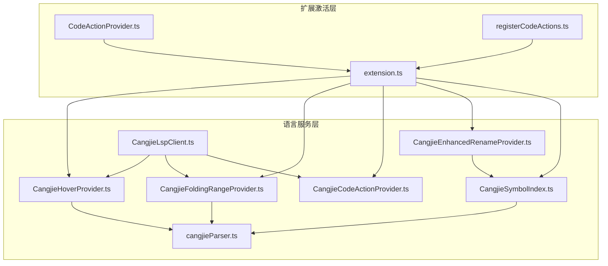
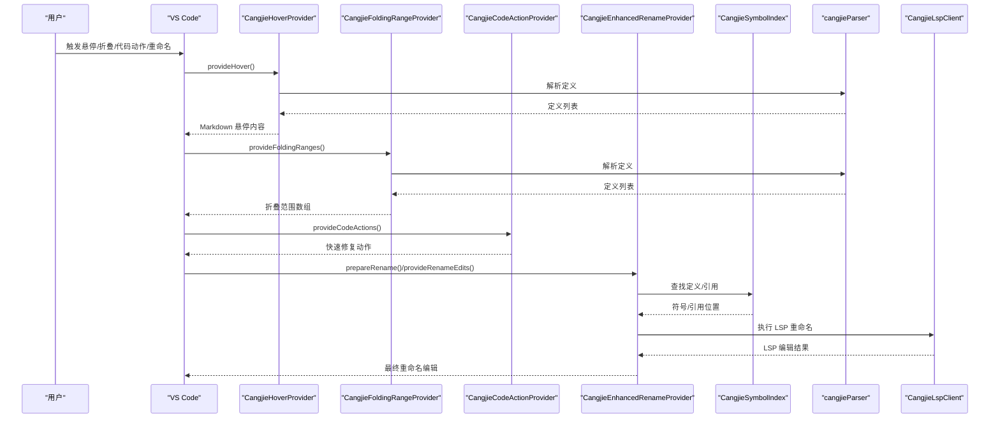
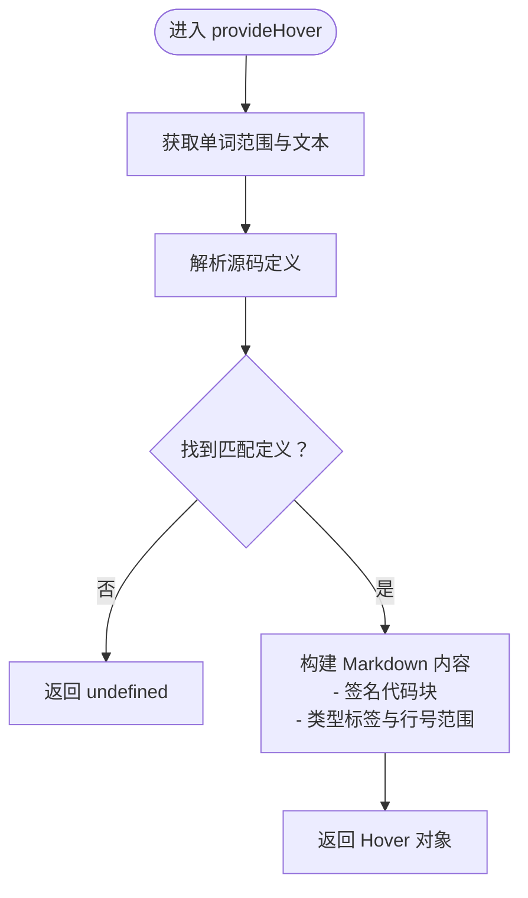
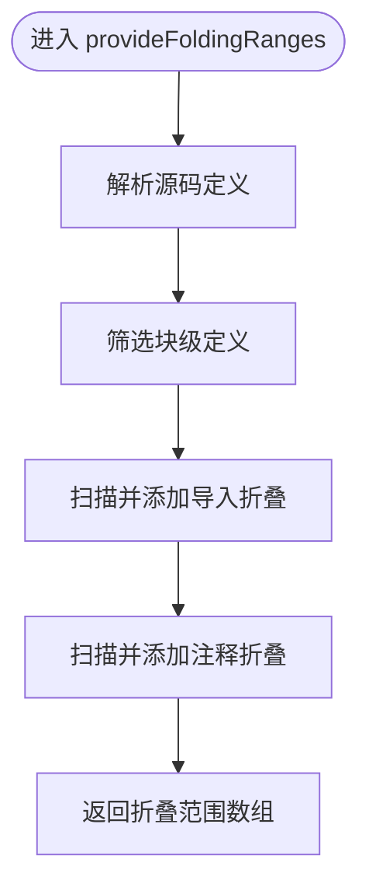
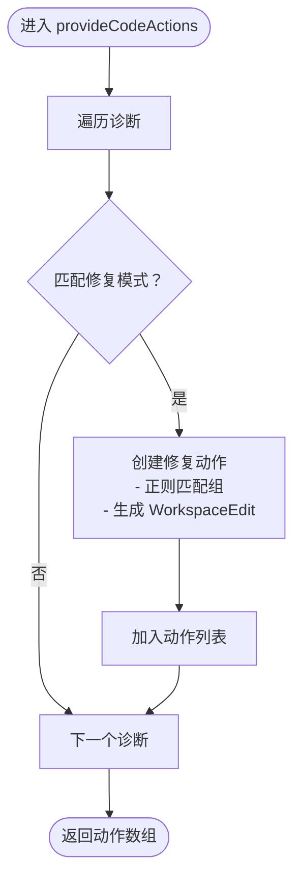
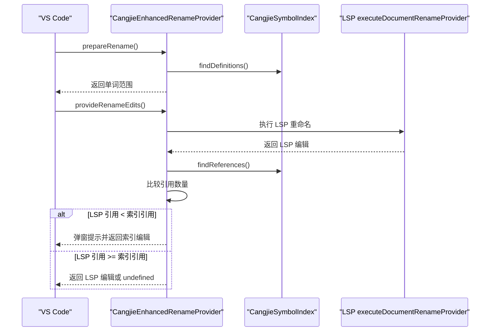
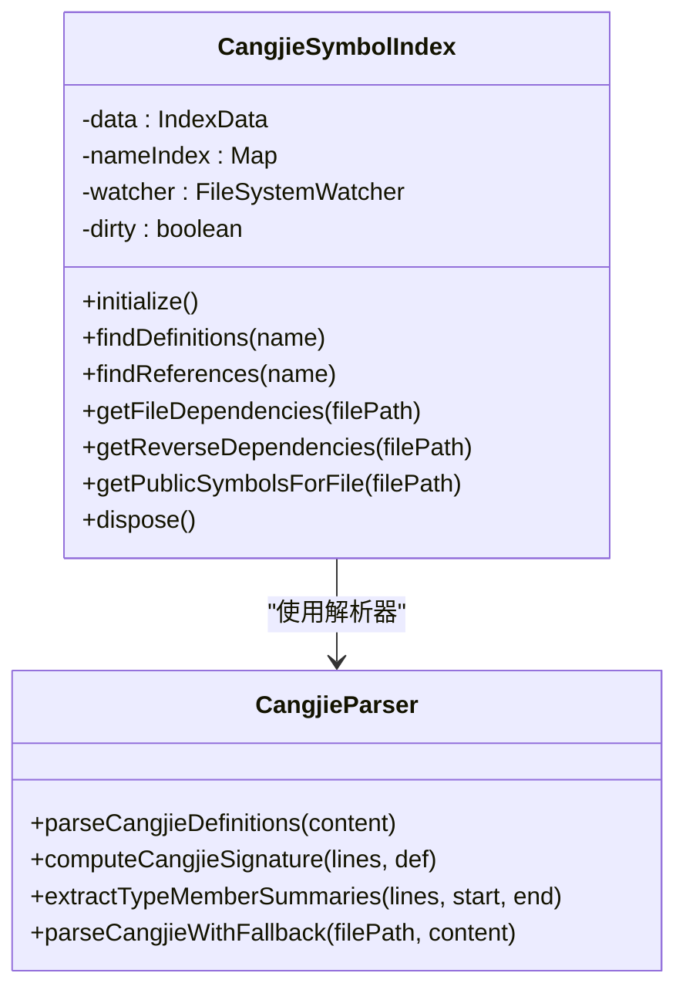
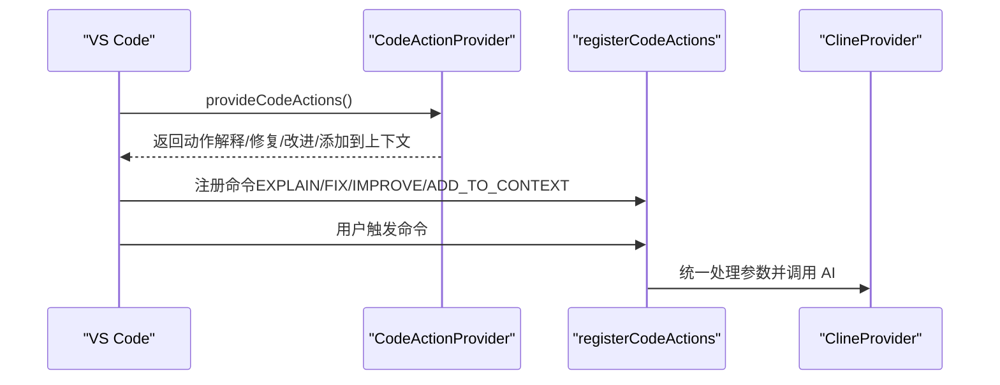
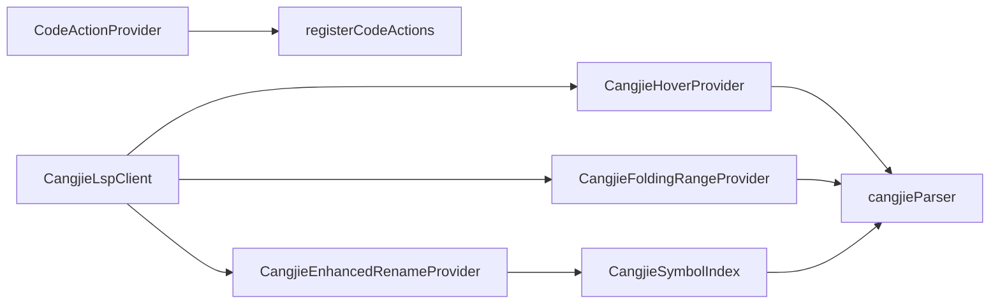

# 代码辅助功能

<cite>
**本文档引用的文件**
- [CangjieHoverProvider.ts](file://src/services/cangjie-lsp/CangjieHoverProvider.ts)
- [CangjieFoldingRangeProvider.ts](file://src/services/cangjie-lsp/CangjieFoldingRangeProvider.ts)
- [CangjieCodeActionProvider.ts](file://src/services/cangjie-lsp/CangjieCodeActionProvider.ts)
- [CangjieEnhancedRenameProvider.ts](file://src/services/cangjie-lsp/CangjieEnhancedRenameProvider.ts)
- [CangjieSymbolIndex.ts](file://src/services/cangjie-lsp/CangjieSymbolIndex.ts)
- [cangjieParser.ts](file://src/services/tree-sitter/cangjieParser.ts)
- [CangjieLspClient.ts](file://src/services/cangjie-lsp/CangjieLspClient.ts)
- [CodeActionProvider.ts](file://src/activate/CodeActionProvider.ts)
- [registerCodeActions.ts](file://src/activate/registerCodeActions.ts)
- [extension.ts](file://src/extension.ts)
</cite>

## 目录
1. [简介](#简介)
2. [项目结构](#项目结构)
3. [核心组件](#核心组件)
4. [架构总览](#架构总览)
5. [详细组件分析](#详细组件分析)
6. [依赖关系分析](#依赖关系分析)
7. [性能考虑](#性能考虑)
8. [故障排除指南](#故障排除指南)
9. [结论](#结论)
10. [附录](#附录)

## 简介
本文件面向 Cangjie 代码辅助功能的技术文档，重点阐述以下四大能力：
- 悬停提供器：类型信息显示、文档字符串解析与上下文帮助
- 折叠范围提供器：代码块折叠与展开
- 代码动作提供器：快速修复、重构建议与自动化代码生成
- 增强重命名提供器：符号重命名、作用域检查与批量更新

文档将从系统架构、组件关系、数据流、处理逻辑、集成点、错误处理与性能特征等维度进行深入分析，并提供使用示例与配置指南。

## 项目结构
围绕代码辅助功能的核心文件分布于以下模块：
- 语言服务层：悬停、折叠、代码动作、重命名、符号索引与解析器
- 扩展激活层：通用代码动作注册与命令桥接
- LSP 客户端：语言服务器启动、中间件与诊断过滤

**图表来源**
- [extension.ts:300-420](file://src/extension.ts#L300-L420)
- [CangjieHoverProvider.ts:1-63](file://src/services/cangjie-lsp/CangjieHoverProvider.ts#L1-L63)
- [CangjieFoldingRangeProvider.ts:1-74](file://src/services/cangjie-lsp/CangjieFoldingRangeProvider.ts#L1-L74)
- [CangjieCodeActionProvider.ts:1-210](file://src/services/cangjie-lsp/CangjieCodeActionProvider.ts#L1-L210)
- [CangjieEnhancedRenameProvider.ts:1-126](file://src/services/cangjie-lsp/CangjieEnhancedRenameProvider.ts#L1-L126)
- [CangjieSymbolIndex.ts:1-470](file://src/services/cangjie-lsp/CangjieSymbolIndex.ts#L1-L470)
- [cangjieParser.ts:1-538](file://src/services/tree-sitter/cangjieParser.ts#L1-L538)
- [CangjieLspClient.ts:1-660](file://src/services/cangjie-lsp/CangjieLspClient.ts#L1-L660)
- [CodeActionProvider.ts:1-130](file://src/activate/CodeActionProvider.ts#L1-L130)
- [registerCodeActions.ts:1-54](file://src/activate/registerCodeActions.ts#L1-L54)

**章节来源**
- [extension.ts:300-420](file://src/extension.ts#L300-L420)

## 核心组件
本节概述四大代码辅助组件的功能职责与交互关系：
- 悬停提供器：基于词法与结构解析，在无 LSP 结果时回退显示签名与类型标签
- 折叠范围提供器：识别代码块与注释，提供区域折叠与导入折叠
- 代码动作提供器：针对常见编译/诊断错误模式，自动生成修复操作
- 增强重命名提供器：对比 LSP 与本地符号索引结果，提供更全面的批量重命名

**章节来源**
- [CangjieHoverProvider.ts:9-36](file://src/services/cangjie-lsp/CangjieHoverProvider.ts#L9-L36)
- [CangjieFoldingRangeProvider.ts:8-28](file://src/services/cangjie-lsp/CangjieFoldingRangeProvider.ts#L8-L28)
- [CangjieCodeActionProvider.ts:185-209](file://src/services/cangjie-lsp/CangjieCodeActionProvider.ts#L185-L209)
- [CangjieEnhancedRenameProvider.ts:9-78](file://src/services/cangjie-lsp/CangjieEnhancedRenameProvider.ts#L9-L78)

## 架构总览
下图展示从用户触发到最终执行的完整流程，涵盖 VS Code 提供器、LSP 客户端与本地索引之间的协作。

**图表来源**
- [CangjieHoverProvider.ts:10-36](file://src/services/cangjie-lsp/CangjieHoverProvider.ts#L10-L36)
- [CangjieFoldingRangeProvider.ts:9-28](file://src/services/cangjie-lsp/CangjieFoldingRangeProvider.ts#L9-L28)
- [CangjieCodeActionProvider.ts:188-208](file://src/services/cangjie-lsp/CangjieCodeActionProvider.ts#L188-L208)
- [CangjieEnhancedRenameProvider.ts:31-78](file://src/services/cangjie-lsp/CangjieEnhancedRenameProvider.ts#L31-L78)
- [CangjieSymbolIndex.ts:269-290](file://src/services/cangjie-lsp/CangjieSymbolIndex.ts#L269-L290)
- [cangjieParser.ts:145-195](file://src/services/tree-sitter/cangjieParser.ts#L145-L195)
- [CangjieLspClient.ts:504-516](file://src/services/cangjie-lsp/CangjieLspClient.ts#L504-L516)

## 详细组件分析

### 悬停提供器（Hover Provider）
- 功能要点
  - 回退式悬停：仅当 LSP 未返回结果时生效，合并多个提供器的结果
  - 词法匹配：根据光标位置获取单词范围，匹配最近定义
  - 结构解析：通过正则解析器提取定义，计算签名行与类型标签
  - Markdown 展示：以代码块形式展示签名，附加行号范围与类型标签

- 关键算法
  - 定位最佳匹配：优先同名且同行，其次包含该行，最后按行距最近选择
  - 类型标签映射：将内部定义类型映射为中文标签

**图表来源**
- [CangjieHoverProvider.ts:10-36](file://src/services/cangjie-lsp/CangjieHoverProvider.ts#L10-L36)
- [cangjieParser.ts:145-195](file://src/services/tree-sitter/cangjieParser.ts#L145-L195)

**章节来源**
- [CangjieHoverProvider.ts:9-62](file://src/services/cangjie-lsp/CangjieHoverProvider.ts#L9-L62)
- [cangjieParser.ts:41-64](file://src/services/tree-sitter/cangjieParser.ts#L41-L64)

### 折叠范围提供器（Folding Range Provider）
- 功能要点
  - 代码块折叠：对 class/struct/interface/enum/func/extend/main/macro 等块级定义启用折叠
  - 导入折叠：识别连续 import 行并折叠为 Imports 区域
  - 注释折叠：支持多行注释块与连续单行注释段

- 实现策略
  - 定义扫描：基于解析器输出的定义范围，过滤非块级定义
  - 进一步补充：遍历行文本识别导入与注释区域

**图表来源**
- [CangjieFoldingRangeProvider.ts:9-28](file://src/services/cangjie-lsp/CangjieFoldingRangeProvider.ts#L9-L28)
- [cangjieParser.ts:145-195](file://src/services/tree-sitter/cangjieParser.ts#L145-L195)

**章节来源**
- [CangjieFoldingRangeProvider.ts:8-73](file://src/services/cangjie-lsp/CangjieFoldingRangeProvider.ts#L8-L73)
- [cangjieParser.ts:41-64](file://src/services/tree-sitter/cangjieParser.ts#L41-L64)

### 代码动作提供器（Code Action Provider）
- 功能要点
  - 快速修复：针对未声明符号、不可变赋值、匹配不穷尽、缺失 return、导入缺失等常见问题生成修复
  - 自动导入：根据标准库符号映射，插入 import 语句并定位插入位置
  - 位置策略：优先 import 之后、package 之后或文件开头

- 修复模式
  - 未找到符号：提示添加对应包的 import
  - 不可变赋值：将 let 替换为 var
  - 匹配不穷尽：在匹配块末尾添加通配 case 分支
  - 缺失 return：在函数末尾添加 return 语句
  - 缺失 import：自动插入 import 语句

**图表来源**
- [CangjieCodeActionProvider.ts:188-208](file://src/services/cangjie-lsp/CangjieCodeActionProvider.ts#L188-L208)
- [CangjieCodeActionProvider.ts:50-182](file://src/services/cangjie-lsp/CangjieCodeActionProvider.ts#L50-L182)

**章节来源**
- [CangjieCodeActionProvider.ts:1-210](file://src/services/cangjie-lsp/CangjieCodeActionProvider.ts#L1-L210)

### 增强重命名提供器（Enhanced Rename Provider）
- 功能要点
  - LSP 与索引对比：先尝试 LSP 重命名，再与本地符号索引引用对比
  - 冲突提示：若索引发现更多引用，弹窗提示用户选择使用索引还是 LSP 结果
  - 批量更新：基于索引引用位置批量生成 WorkspaceEdit

- 关键流程
  - 准备阶段：验证单词长度与存在性，准备重命名范围
  - 执行阶段：避免递归重入，调用 LSP 命令；统计 LSP 与索引引用数量
  - 决策阶段：根据数量差异提示用户；构建索引驱动的重命名编辑

**图表来源**
- [CangjieEnhancedRenameProvider.ts:31-78](file://src/services/cangjie-lsp/CangjieEnhancedRenameProvider.ts#L31-L78)
- [CangjieEnhancedRenameProvider.ts:80-99](file://src/services/cangjie-lsp/CangjieEnhancedRenameProvider.ts#L80-L99)
- [CangjieSymbolIndex.ts:269-290](file://src/services/cangjie-lsp/CangjieSymbolIndex.ts#L269-L290)

**章节来源**
- [CangjieEnhancedRenameProvider.ts:1-126](file://src/services/cangjie-lsp/CangjieEnhancedRenameProvider.ts#L1-L126)
- [CangjieSymbolIndex.ts:269-290](file://src/services/cangjie-lsp/CangjieSymbolIndex.ts#L269-L290)

### 符号索引与解析器
- 符号索引（CangjieSymbolIndex）
  - 全局缓存：内存中维护符号索引，文件系统监视增量更新
  - 查询接口：按名称、类型、前缀查询，查找引用位置，计算包围符号
  - 依赖分析：解析 import，映射到工作区文件，计算正向与反向依赖
  - 性能优化：文件行缓存、延迟保存、异步重建索引

- 解析器（cangjieParser）
  - 正则解析：高效提取定义，支持修饰符、多行签名拼接
  - AST 集成：可选使用 cjc --dump-ast 输出作为结构化来源
  - 成员摘要：提取类型成员概要，限制显示数量

**图表来源**
- [CangjieSymbolIndex.ts:43-83](file://src/services/cangjie-lsp/CangjieSymbolIndex.ts#L43-L83)
- [cangjieParser.ts:145-195](file://src/services/tree-sitter/cangjieParser.ts#L145-L195)
- [cangjieParser.ts:207-245](file://src/services/tree-sitter/cangjieParser.ts#L207-L245)
- [cangjieParser.ts:264-300](file://src/services/tree-sitter/cangjieParser.ts#L264-L300)
- [cangjieParser.ts:530-537](file://src/services/tree-sitter/cangjieParser.ts#L530-L537)

**章节来源**
- [CangjieSymbolIndex.ts:1-470](file://src/services/cangjie-lsp/CangjieSymbolIndex.ts#L1-L470)
- [cangjieParser.ts:1-538](file://src/services/tree-sitter/cangjieParser.ts#L1-L538)

### 通用代码动作与命令桥接
- 通用代码动作提供器（CodeActionProvider）
  - 作用：为所有语言提供“解释/修复/改进/添加到上下文”等代码动作
  - 诊断增强：针对 Cangjie 诊断消息注入修复建议
  - 参数传递：将选区文本与行号范围打包为命令参数

- 代码动作注册（registerCodeActions）
  - 将代码动作映射为扩展命令，统一处理来自菜单与快捷键的调用
  - 支持直接调用与从代码动作触发两种场景

**图表来源**
- [CodeActionProvider.ts:36-129](file://src/activate/CodeActionProvider.ts#L36-L129)
- [registerCodeActions.ts:9-54](file://src/activate/registerCodeActions.ts#L9-L54)

**章节来源**
- [CodeActionProvider.ts:1-130](file://src/activate/CodeActionProvider.ts#L1-L130)
- [registerCodeActions.ts:1-54](file://src/activate/registerCodeActions.ts#L1-L54)

## 依赖关系分析
- 组件耦合
  - 悬停/折叠提供器依赖解析器；重命名提供器依赖符号索引；符号索引依赖解析器
  - LSP 客户端为悬停/补全等提供去抖中间件，减少高频请求
  - 通用代码动作提供器与注册模块解耦，便于扩展其他语言

- 外部依赖
  - VS Code API：提供器注册、诊断、工作区编辑、命令系统
  - 语言服务器：提供 LSP 重命名与诊断过滤

**图表来源**
- [CangjieHoverProvider.ts:1-2](file://src/services/cangjie-lsp/CangjieHoverProvider.ts#L1-L2)
- [CangjieFoldingRangeProvider.ts:1-2](file://src/services/cangjie-lsp/CangjieFoldingRangeProvider.ts#L1-L2)
- [CangjieEnhancedRenameProvider.ts:1-2](file://src/services/cangjie-lsp/CangjieEnhancedRenameProvider.ts#L1-L2)
- [CangjieSymbolIndex.ts:1-11](file://src/services/cangjie-lsp/CangjieSymbolIndex.ts#L1-L11)
- [CangjieLspClient.ts:46-56](file://src/services/cangjie-lsp/CangjieLspClient.ts#L46-L56)
- [CodeActionProvider.ts:1-8](file://src/activate/CodeActionProvider.ts#L1-L8)
- [registerCodeActions.ts:1-8](file://src/activate/registerCodeActions.ts#L1-L8)

**章节来源**
- [extension.ts:300-420](file://src/extension.ts#L300-L420)
- [CangjieLspClient.ts:46-56](file://src/services/cangjie-lsp/CangjieLspClient.ts#L46-L56)

## 性能考虑
- 去抖中间件：对悬停与补全请求进行去抖，降低 LSP 服务器压力
- 解析策略：默认使用正则解析器，快速提取定义；可选 cjc AST 作为结构化来源
- 符号索引：文件行缓存、延迟保存、批量重建，避免频繁磁盘 IO
- 诊断过滤：过滤 LSP 的假阳性诊断，减少误报干扰

**章节来源**
- [CangjieLspClient.ts:20-56](file://src/services/cangjie-lsp/CangjieLspClient.ts#L20-L56)
- [cangjieParser.ts:530-537](file://src/services/tree-sitter/cangjieParser.ts#L530-L537)
- [CangjieSymbolIndex.ts:132-151](file://src/services/cangjie-lsp/CangjieSymbolIndex.ts#L132-L151)

## 故障排除指南
- LSP 服务器未启动
  - 症状：无法获得 LSP 诊断或重命名结果
  - 排查：检查 CANGJIE_HOME 环境变量与 serverPath 设置；查看输出通道日志
  - 参考：LSP 客户端状态监听与自动重启机制

- 重命名结果不完整
  - 症状：LSP 仅发现部分引用
  - 处理：增强重命名提供器会提示使用索引版本；确认索引已建立并刷新

- 代码动作未出现
  - 症状：没有快速修复选项
  - 排查：确认诊断消息匹配预设模式；检查 enableCodeActions 配置

**章节来源**
- [CangjieLspClient.ts:376-406](file://src/services/cangjie-lsp/CangjieLspClient.ts#L376-L406)
- [CangjieEnhancedRenameProvider.ts:54-69](file://src/services/cangjie-lsp/CangjieEnhancedRenameProvider.ts#L54-L69)
- [CodeActionProvider.ts:59-61](file://src/activate/CodeActionProvider.ts#L59-L61)

## 结论
本代码辅助功能通过“解析器 + 索引 + VS Code 提供器”的组合，实现了：
- 高效稳定的悬停与折叠体验
- 面向常见错误的快速修复
- 更全面的重命名与批量更新
- 与 LSP 的协同与降级回退

这些能力共同提升了 Cangjie 开发效率与一致性，适合在大型项目中推广使用。

## 附录

### 使用示例
- 悬停查看：将鼠标悬停在类、函数、变量等符号上，查看签名与类型标签
- 折叠展开：使用编辑器折叠控件折叠类/函数体或注释段
- 快速修复：在问题面板中选择“快速修复”，自动插入 import 或替换语句
- 重命名：右键选择“重命名符号”，或使用快捷键；若检测到更多引用，按提示选择索引版本

### 配置指南
- 启用/禁用 LSP：在设置中调整 cangjieLsp.enabled
- 日志与路径：可开启 LSP 日志与指定日志路径
- 禁用自动导入：在设置中关闭 disableAutoImport
- 启用通用代码动作：确保 enableCodeActions 为 true

**章节来源**
- [CangjieLspClient.ts:139-148](file://src/services/cangjie-lsp/CangjieLspClient.ts#L139-L148)
- [extension.ts:300-315](file://src/extension.ts#L300-L315)
- [CodeActionProvider.ts:59-61](file://src/activate/CodeActionProvider.ts#L59-L61)