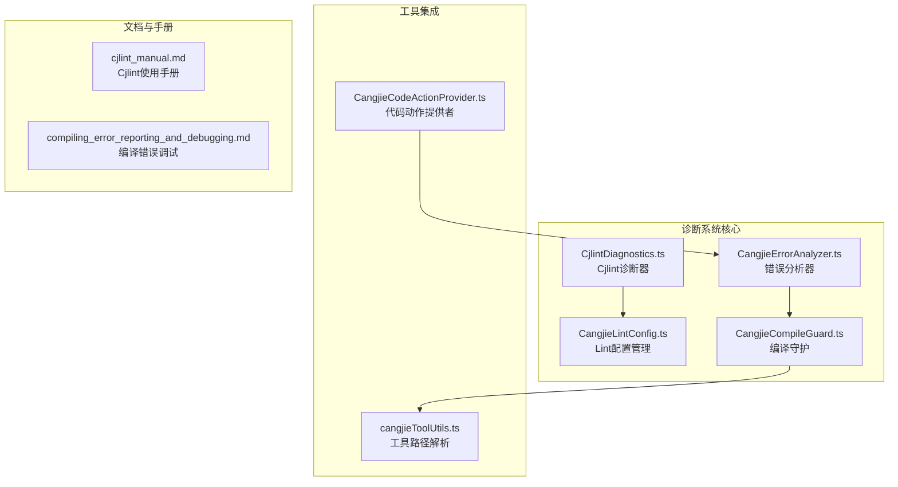
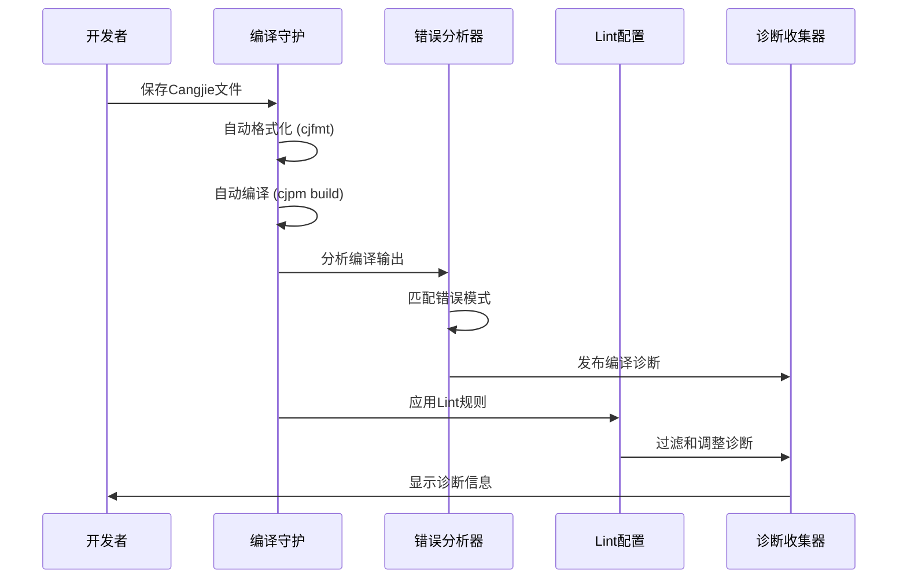
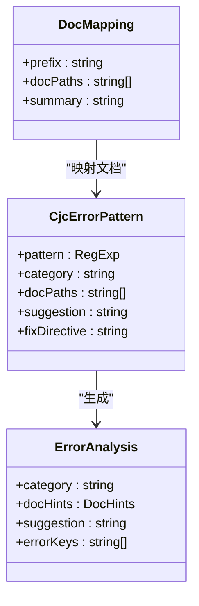
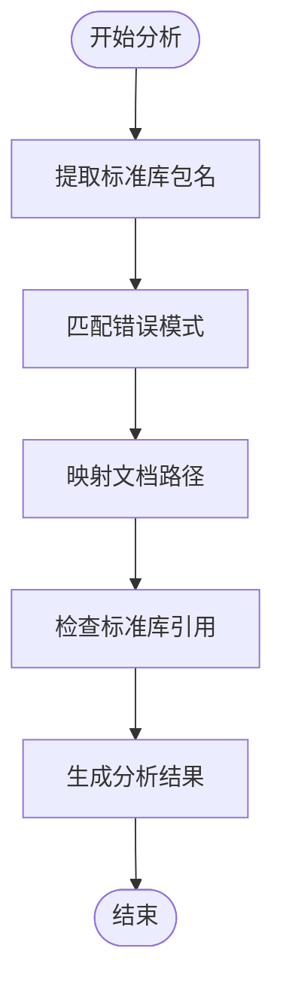
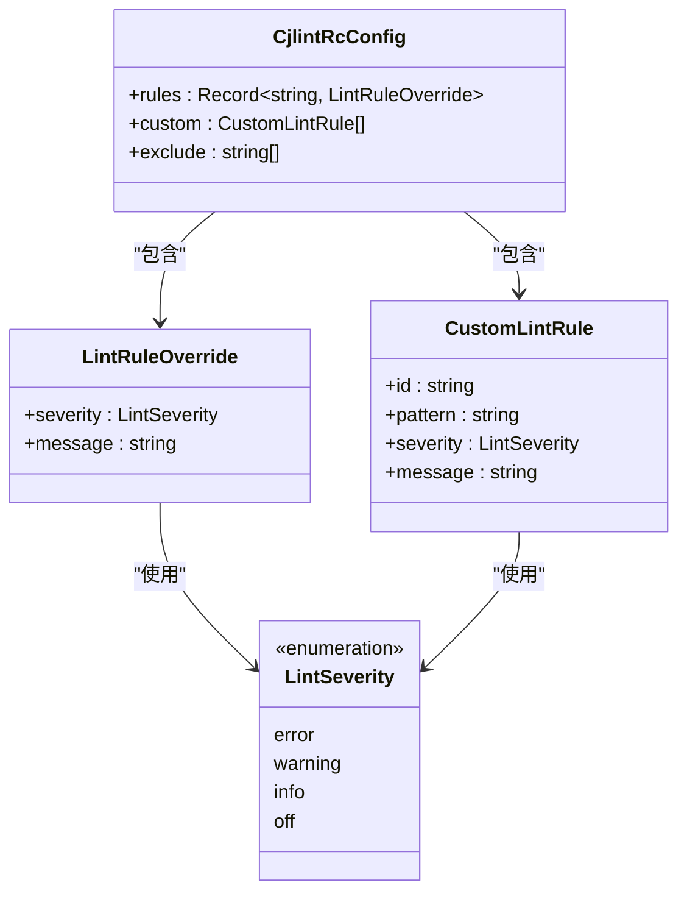
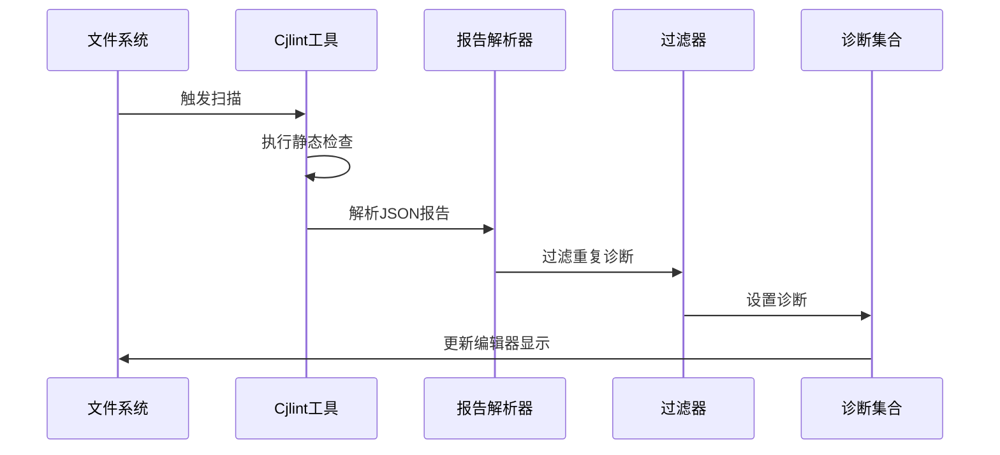
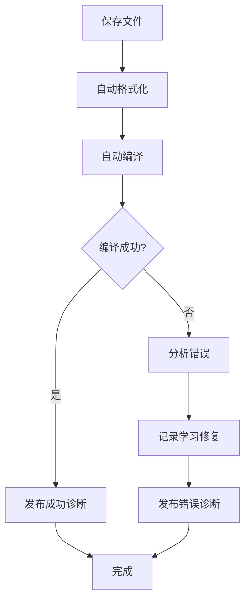
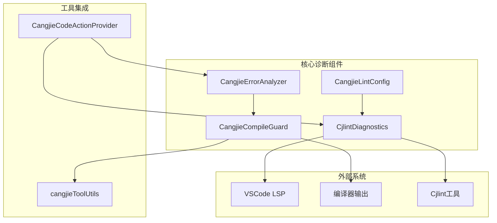

# 诊断与代码分析

<cite>
**本文档引用的文件**
- [CangjieErrorAnalyzer.ts](file://src/services/cangjie-lsp/CangjieErrorAnalyzer.ts)
- [CjlintDiagnostics.ts](file://src/services/cangjie-lsp/CjlintDiagnostics.ts)
- [CangjieLintConfig.ts](file://src/services/cangjie-lsp/CangjieLintConfig.ts)
- [CangjieCompileGuard.ts](file://src/services/cangjie-lsp/CangjieCompileGuard.ts)
- [cangjieToolUtils.ts](file://src/services/cangjie-lsp/cangjieToolUtils.ts)
- [CangjieCodeActionProvider.ts](file://src/services/cangjie-lsp/CangjieCodeActionProvider.ts)
- [cjlint_manual.md](file://CangjieCorpus-1.0.0/tools/source_zh_cn/tools/cjlint_manual.md)
- [compiling_error_reporting_and_debugging.md](file://CangjieCorpus-1.0.0/manual/source_zh_cn/Macro/compiling_error_reporting_and_debugging.md)
- [index.ts](file://src/integrations/diagnostics/index.ts)
</cite>

## 目录
1. [简介](#简介)
2. [项目结构](#项目结构)
3. [核心组件](#核心组件)
4. [架构概览](#架构概览)
5. [详细组件分析](#详细组件分析)
6. [依赖关系分析](#依赖关系分析)
7. [性能考虑](#性能考虑)
8. [故障排除指南](#故障排除指南)
9. [结论](#结论)

## 简介

本文档详细介绍了 Cangjie 诊断与代码分析功能的技术实现，包括错误分析器的工作原理、语法错误检测、语义分析和编译时错误报告机制。文档还涵盖了 Lint 配置系统的可定制性，包括规则定义、严重级别设置和忽略规则，并提供了 cjlint 诊断工具的使用方法和配置选项。

Cangjie 诊断系统通过多种工具和技术实现全面的代码质量保障，包括实时语法检查、语义分析、错误分类和智能修复建议。系统支持多种诊断来源，包括编译器错误、静态检查工具和自定义规则。

## 项目结构

Cangjie 诊断与代码分析功能主要分布在以下目录结构中：

**图表来源**
- [CangjieErrorAnalyzer.ts:1-370](file://src/services/cangjie-lsp/CangjieErrorAnalyzer.ts#L1-L370)
- [CjlintDiagnostics.ts:1-294](file://src/services/cangjie-lsp/CjlintDiagnostics.ts#L1-L294)
- [CangjieLintConfig.ts:1-244](file://src/services/cangjie-lsp/CangjieLintConfig.ts#L1-L244)

**章节来源**
- [CangjieErrorAnalyzer.ts:1-370](file://src/services/cangjie-lsp/CangjieErrorAnalyzer.ts#L1-L370)
- [CjlintDiagnostics.ts:1-294](file://src/services/cangjie-lsp/CjlintDiagnostics.ts#L1-L294)
- [CangjieLintConfig.ts:1-244](file://src/services/cangjie-lsp/CangjieLintConfig.ts#L1-L244)

## 核心组件

### 错误分析器 (CangjieErrorAnalyzer)

错误分析器是诊断系统的核心组件，负责分析编译器输出并提供结构化的错误分析结果。

**主要功能特性：**
- 编译错误模式匹配和分类
- 文档映射和建议生成
- 错误修复指令提取
- 错误模式标准化

**关键数据结构：**
- `CjcErrorPattern`: 错误模式定义，包含正则表达式、分类、文档路径和修复建议
- `ErrorAnalysis`: 结构化错误分析结果
- `DocMapping`: 文档映射配置

**章节来源**
- [CangjieErrorAnalyzer.ts:7-28](file://src/services/cangjie-lsp/CangjieErrorAnalyzer.ts#L7-L28)

### Lint 配置管理 (CangjieLintConfig)

Lint 配置管理系统提供项目级的代码检查配置，支持规则覆盖、自定义规则和文件排除。

**配置文件支持：**
- `.cjlintrc`: 主配置文件
- `.cjlintrc.json`: JSON 格式配置文件

**配置选项：**
- `rules`: 规则ID覆盖配置
- `custom`: 自定义正则规则
- `exclude`: 文件排除模式

**章节来源**
- [CangjieLintConfig.ts:23-30](file://src/services/cangjie-lsp/CangjieLintConfig.ts#L23-L30)

### Cjlint 诊断器 (CjlintDiagnostics)

Cjlint 诊断器负责集成外部静态检查工具，提供实时的代码质量检查。

**核心功能：**
- 自动文件和工作区扫描
- 诊断去重和过滤
- 性能优化和防抖机制
- 报告解析和格式化

**章节来源**
- [CjlintDiagnostics.ts:28-56](file://src/services/cangjie-lsp/CjlintDiagnostics.ts#L28-L56)

### 编译守护 (CangjieCompileGuard)

编译守护提供自动化的构建流程，包括格式化、编译和诊断发布。

**工作流程：**
1. 自动格式化 (cjfmt)
2. 自动编译 (cjpm build)
3. 诊断发布
4. 学习模式记录

**章节来源**
- [CangjieCompileGuard.ts:40-66](file://src/services/cangjie-lsp/CangjieCompileGuard.ts#L40-L66)

## 架构概览

Cangjie 诊断系统采用分层架构设计，各组件协同工作提供全面的代码分析能力：

**图表来源**
- [CangjieCompileGuard.ts:67-126](file://src/services/cangjie-lsp/CangjieCompileGuard.ts#L67-L126)
- [CangjieErrorAnalyzer.ts:248-297](file://src/services/cangjie-lsp/CangjieErrorAnalyzer.ts#L248-L297)
- [CangjieLintConfig.ts:158-174](file://src/services/cangjie-lsp/CangjieLintConfig.ts#L158-L174)

## 详细组件分析

### 错误分析器深度分析

错误分析器通过预定义的错误模式匹配编译器输出，提供智能的错误分类和修复建议。

#### 错误模式分类系统

系统支持 25+ 种错误分类，涵盖语法、语义、类型、并发等多个方面：

**图表来源**
- [CangjieErrorAnalyzer.ts:7-28](file://src/services/cangjie-lsp/CangjieErrorAnalyzer.ts#L7-L28)
- [CangjieErrorAnalyzer.ts:34-58](file://src/services/cangjie-lsp/CangjieErrorAnalyzer.ts#L34-L58)

#### 错误分析流程

**图表来源**
- [CangjieErrorAnalyzer.ts:248-297](file://src/services/cangjie-lsp/CangjieErrorAnalyzer.ts#L248-L297)

**章节来源**
- [CangjieErrorAnalyzer.ts:64-231](file://src/services/cangjie-lsp/CangjieErrorAnalyzer.ts#L64-L231)

### Lint 配置系统深度分析

Lint 配置系统提供灵活的规则定制能力，支持项目级和全局级配置。

#### 配置文件结构

**图表来源**
- [CangjieLintConfig.ts:23-30](file://src/services/cangjie-lsp/CangjieLintConfig.ts#L23-L30)
- [CangjieLintConfig.ts:9-21](file://src/services/cangjie-lsp/CangjieLintConfig.ts#L9-L21)

#### 文件排除机制

系统支持复杂的文件排除模式，包括通配符和正则表达式：

**章节来源**
- [CangjieLintConfig.ts:141-153](file://src/services/cangjie-lsp/CangjieLintConfig.ts#L141-L153)

### Cjlint 诊断器深度分析

Cjlint 诊断器提供实时的静态代码分析，支持单文件和工作区级别的扫描。

#### 诊断收集流程

**图表来源**
- [CjlintDiagnostics.ts:76-134](file://src/services/cangjie-lsp/CjlintDiagnostics.ts#L76-L134)
- [CjlintDiagnostics.ts:136-204](file://src/services/cangjie-lsp/CjlintDiagnostics.ts#L136-L204)

#### 诊断去重策略

系统采用智能去重机制，避免与 LSP 诊断重复显示：

**章节来源**
- [CjlintDiagnostics.ts:210-223](file://src/services/cangjie-lsp/CjlintDiagnostics.ts#L210-L223)

### 编译守护深度分析

编译守护提供自动化的构建流程，确保代码质量和开发效率。

#### 构建管道流程

**图表来源**
- [CangjieCompileGuard.ts:67-126](file://src/services/cangjie-lsp/CangjieCompileGuard.ts#L67-L126)

#### 增量编译优化

系统智能选择增量或全量编译模式：

**章节来源**
- [CangjieCompileGuard.ts:209-225](file://src/services/cangjie-lsp/CangjieCompileGuard.ts#L209-L225)

## 依赖关系分析

Cangjie 诊断系统各组件之间的依赖关系如下：

**图表来源**
- [CangjieErrorAnalyzer.ts:1-11](file://src/services/cangjie-lsp/CangjieErrorAnalyzer.ts#L1-L11)
- [CangjieLintConfig.ts:1-8](file://src/services/cangjie-lsp/CangjieLintConfig.ts#L1-L8)
- [CjlintDiagnostics.ts:1-8](file://src/services/cangjie-lsp/CjlintDiagnostics.ts#L1-L8)

**章节来源**
- [CangjieErrorAnalyzer.ts:1-11](file://src/services/cangjie-lsp/CangjieErrorAnalyzer.ts#L1-L11)
- [CangjieLintConfig.ts:1-8](file://src/services/cangjie-lsp/CangjieLintConfig.ts#L1-L8)

## 性能考虑

### 优化策略

1. **防抖机制**: Cjlint 诊断器使用 1500ms 防抖延迟，避免频繁触发
2. **增量编译**: 编译守护智能选择增量编译模式
3. **缓存机制**: 依赖树结果缓存 30秒
4. **异步处理**: 所有外部工具调用都是异步执行

### 内存管理

- 错误模式标准化使用 Map 数据结构存储
- 诊断集合按文件组织，便于清理
- 工具路径解析结果缓存

## 故障排除指南

### 常见问题及解决方案

#### Cjlint 工具未找到

**症状**: 诊断器输出 "cjlint not found"
**解决方案**: 
1. 检查 `cangjieTools.cjlintPath` 配置
2. 确认 cjlint 工具安装路径
3. 验证环境变量设置

#### 编译器错误解析失败

**症状**: 错误分析器无法识别编译器输出
**解决方案**:
1. 检查编译器版本兼容性
2. 验证错误输出格式
3. 更新错误模式匹配规则

#### 诊断重复显示

**症状**: 同一行出现多个诊断信息
**解决方案**:
1. 检查去重逻辑配置
2. 验证 LSP 和 Cjlint 诊断源
3. 清理诊断集合缓存

### 调试技巧

#### 开启详细日志

系统提供详细的输出通道日志，包括：
- 性能统计信息
- 工具执行状态
- 错误分析结果

#### 错误模式调试

使用 `normalizeErrorPattern` 函数标准化错误消息：
- 移除 ANSI 代码
- 去除文件路径前缀
- 压缩空白字符

**章节来源**
- [CangjieErrorAnalyzer.ts:340-353](file://src/services/cangjie-lsp/CangjieErrorAnalyzer.ts#L340-L353)

## 结论

Cangjie 诊断与代码分析系统通过多层次的设计实现了全面的代码质量保障。系统的核心优势包括：

1. **智能错误分析**: 基于 25+ 种错误模式的精准分类
2. **灵活配置管理**: 支持项目级和全局级的规则定制
3. **自动化流程**: 编译守护提供无缝的开发体验
4. **实时反馈**: Cjlint 诊断器提供即时的代码质量反馈
5. **学习能力**: 系统能够记录和学习错误修复模式

该系统为 Cangjie 开发者提供了强大的工具支持，显著提升了代码质量和开发效率。通过合理的配置和使用，开发者可以获得准确的错误诊断和实用的修复建议。