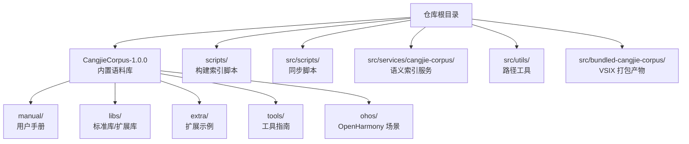
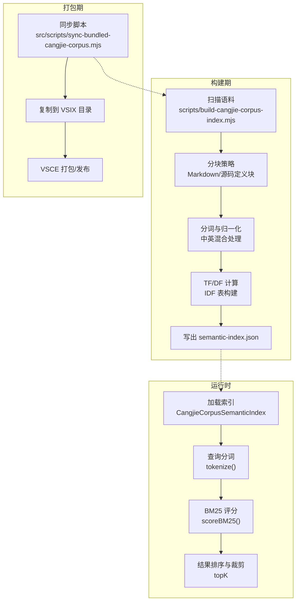
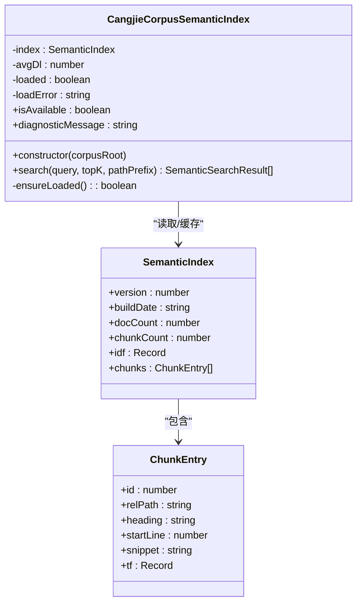
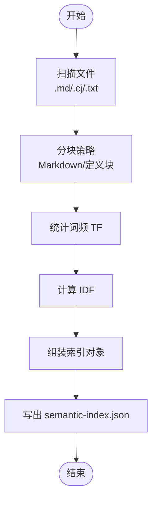
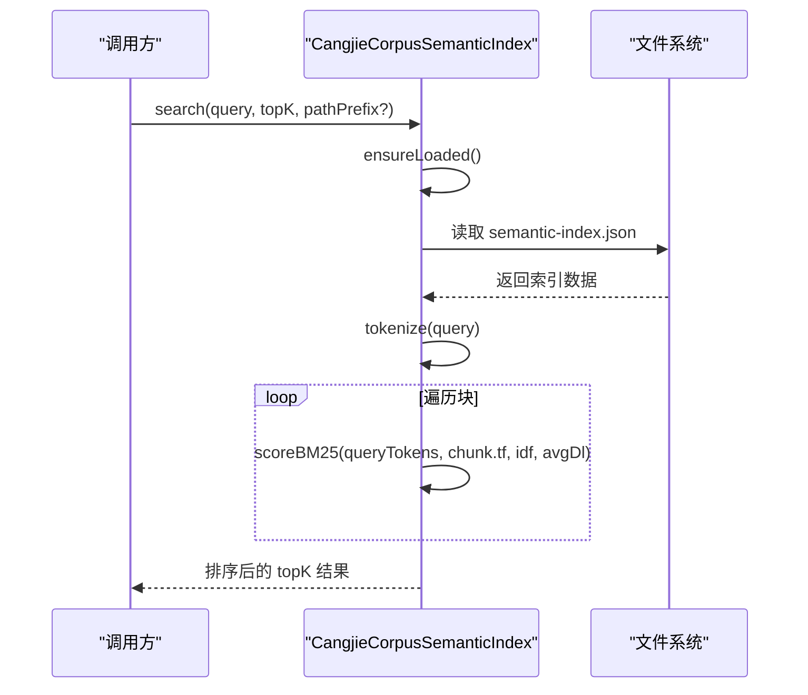
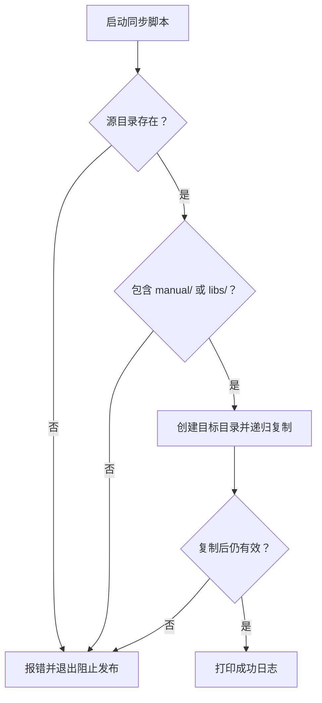
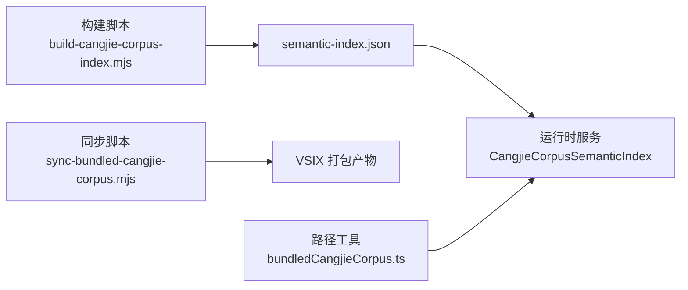

# 语料库集成

<cite>
**本文引用的文件**
- [CangjieCorpus-1.0.0/README.md](file://CangjieCorpus-1.0.0/README.md)
- [scripts/build-cangjie-corpus-index.mjs](file://scripts/build-cangjie-corpus-index.mjs)
- [src/scripts/sync-bundled-cangjie-corpus.mjs](file://src/scripts/sync-bundled-cangjie-corpus.mjs)
- [src/services/cangjie-corpus/CangjieCorpusSemanticIndex.ts](file://src/services/cangjie-corpus/CangjieCorpusSemanticIndex.ts)
- [src/utils/bundledCangjieCorpus.ts](file://src/utils/bundledCangjieCorpus.ts)
- [src/bundled-cangjie-corpus/README.md](file://src/bundled-cangjie-corpus/README.md)
- [CangjieCorpus-1.0.0/manual/source_zh_cn/basic_data_type/array.md](file://CangjieCorpus-1.0.0/manual/source_zh_cn/basic_data_type/array.md)
- [CangjieCorpus-1.0.0/extra/HashMap.md](file://CangjieCorpus-1.0.0/extra/HashMap.md)
</cite>

## 目录
1. [简介](#简介)
2. [项目结构](#项目结构)
3. [核心组件](#核心组件)
4. [架构总览](#架构总览)
5. [详细组件分析](#详细组件分析)
6. [依赖分析](#依赖分析)
7. [性能考虑](#性能考虑)
8. [故障排查指南](#故障排查指南)
9. [结论](#结论)
10. [附录](#附录)

## 简介
本文件面向 Cangjie 语料库集成功能，提供从语料库结构、向量检索索引、构建与同步脚本到与 AI 模型集成的完整技术文档。重点包括：
- 内置语料库的组织方式：标准库、扩展库、示例与手册的结构与内容边界
- 语义索引系统：分词策略、BM25 相似度评分、智能搜索能力
- 同步脚本：使用方法、配置选项与发布约束
- 与 AI 模型的集成：在 Cangjie Dev 模式下的应用场景与最佳实践
- 使用示例与性能优化建议

## 项目结构
语料库与相关工具分布在仓库的多个目录中：
- CangjieCorpus-1.0.0：官方与扩展内容的完整语料库
- scripts：构建语义索引的主脚本
- src/scripts：VSIX 打包前的语料库同步脚本
- src/services/cangjie-corpus：运行时语义检索服务
- src/utils：语料库路径解析与判定工具
- src/bundled-cangjie-corpus：VSIX 打包时复制的目标目录

图表来源
- [CangjieCorpus-1.0.0/README.md:10-54](file://CangjieCorpus-1.0.0/README.md#L10-L54)
- [scripts/build-cangjie-corpus-index.mjs:1-286](file://scripts/build-cangjie-corpus-index.mjs#L1-L286)
- [src/scripts/sync-bundled-cangjie-corpus.mjs:1-63](file://src/scripts/sync-bundled-cangjie-corpus.mjs#L1-L63)
- [src/services/cangjie-corpus/CangjieCorpusSemanticIndex.ts:1-205](file://src/services/cangjie-corpus/CangjieCorpusSemanticIndex.ts#L1-L205)
- [src/utils/bundledCangjieCorpus.ts:1-67](file://src/utils/bundledCangjieCorpus.ts#L1-L67)
- [src/bundled-cangjie-corpus/README.md:1-15](file://src/bundled-cangjie-corpus/README.md#L1-L15)

章节来源
- [CangjieCorpus-1.0.0/README.md:10-54](file://CangjieCorpus-1.0.0/README.md#L10-L54)
- [src/bundled-cangjie-corpus/README.md:1-15](file://src/bundled-cangjie-corpus/README.md#L1-L15)

## 核心组件
- 语料库结构与内容边界
  - manual：用户手册，覆盖语言基础、开发流程与最佳实践
  - libs：标准库与扩展库 API 文档
  - extra：扩展功能库与示例
  - tools：工具链使用指南
  - ohos：OpenHarmony 分布式开发场景
- 语义索引服务
  - 运行时加载预构建索引，支持 BM25 关键词匹配与路径过滤
- 构建与同步脚本
  - 构建索引：扫描语料、分块、分词、TF-IDF 计算、写出索引
  - 同步脚本：将仓库根的语料复制到 VSIX 打包目录，并进行有效性校验

章节来源
- [CangjieCorpus-1.0.0/README.md:10-54](file://CangjieCorpus-1.0.0/README.md#L10-L54)
- [src/services/cangjie-corpus/CangjieCorpusSemanticIndex.ts:116-205](file://src/services/cangjie-corpus/CangjieCorpusSemanticIndex.ts#L116-L205)
- [scripts/build-cangjie-corpus-index.mjs:1-286](file://scripts/build-cangjie-corpus-index.mjs#L1-L286)
- [src/scripts/sync-bundled-cangjie-corpus.mjs:1-63](file://src/scripts/sync-bundled-cangjie-corpus.mjs#L1-L63)

## 架构总览
下图展示从语料库到运行时检索的整体流程，包括构建索引与运行时查询两条主线。

图表来源
- [scripts/build-cangjie-corpus-index.mjs:1-286](file://scripts/build-cangjie-corpus-index.mjs#L1-L286)
- [src/services/cangjie-corpus/CangjieCorpusSemanticIndex.ts:116-205](file://src/services/cangjie-corpus/CangjieCorpusSemanticIndex.ts#L116-L205)
- [src/scripts/sync-bundled-cangjie-corpus.mjs:1-63](file://src/scripts/sync-bundled-cangjie-corpus.mjs#L1-L63)

## 详细组件分析

### 语料库结构与内容组织
- manual：用户手册，覆盖语言基础、多端开发、性能与调试等主题
- libs：标准库与扩展库 API 文档，映射官方 API
- extra：扩展功能库与示例，强调学习与研究用途
- tools：工具链使用指南，IDE 插件与命令行工具
- ohos：OpenHarmony 分布式开发场景，ArkUI、全栈 API 能力等

章节来源
- [CangjieCorpus-1.0.0/README.md:10-54](file://CangjieCorpus-1.0.0/README.md#L10-L54)

### 语义索引系统
- 数据模型
  - 索引版本、构建时间、文档计数、块计数、逆文档频率表、块条目集合
  - 块条目包含：相对路径、标题、起始行、片段、词频向量
- 分词策略
  - 中文：采用双字符滑窗与单字符回退，提升短语与词汇匹配能力
  - 英文：全词与驼峰/帕斯卡大小写拆分，统一转小写
- 相似度计算
  - 使用 BM25 算法，结合词频与逆文档频率，按平均文档长度归一
- 查询接口
  - 支持 topK 结果返回、可选路径前缀过滤

图表来源
- [src/services/cangjie-corpus/CangjieCorpusSemanticIndex.ts:8-32](file://src/services/cangjie-corpus/CangjieCorpusSemanticIndex.ts#L8-L32)
- [src/services/cangjie-corpus/CangjieCorpusSemanticIndex.ts:116-205](file://src/services/cangjie-corpus/CangjieCorpusSemanticIndex.ts#L116-L205)

章节来源
- [src/services/cangjie-corpus/CangjieCorpusSemanticIndex.ts:1-205](file://src/services/cangjie-corpus/CangjieCorpusSemanticIndex.ts#L1-L205)

### 构建索引流程（BM25 关键词索引）
- 输入：语料库目录（默认 bundled-cangjie-corpus/CangjieCorpus-1.0.0）
- 输出：semantic-index.json（包含块、TF 向量、IDF 表、元数据）
- 关键步骤
  - 文件扫描：限定 .md/.cj/.txt 扩展名，排除 node_modules/target
  - 分块策略：Markdown 按标题分块；Cangjie 源码按定义块分块；超长文本按最大字符数切分
  - 分词与 TF：中英混合分词，统计每块词频
  - IDF 计算：仅保留至少出现在两篇文档中的词
  - 写出索引：JSON 序列化并输出文件大小与块数统计

图表来源
- [scripts/build-cangjie-corpus-index.mjs:194-267](file://scripts/build-cangjie-corpus-index.mjs#L194-L267)

章节来源
- [scripts/build-cangjie-corpus-index.mjs:1-286](file://scripts/build-cangjie-corpus-index.mjs#L1-L286)

### 智能搜索调用序列

图表来源
- [src/services/cangjie-corpus/CangjieCorpusSemanticIndex.ts:171-203](file://src/services/cangjie-corpus/CangjieCorpusSemanticIndex.ts#L171-L203)

章节来源
- [src/services/cangjie-corpus/CangjieCorpusSemanticIndex.ts:116-205](file://src/services/cangjie-corpus/CangjieCorpusSemanticIndex.ts#L116-L205)

### 语料库同步脚本
- 功能：将仓库根的 CangjieCorpus-1.0.0 复制到 src/bundled-cangjie-corpus/CangjieCorpus-1.0.0，供 VSIX 打包
- 校验规则
  - 默认：若源目录不存在或不包含 manual/ 或 libs/，则失败并阻止发布
  - 可选：设置环境变量允许跳过校验（仅限本地实验）
- VSIX 打包：vscode:prepublish 阶段触发，复制完成后随扩展一起发布

图表来源
- [src/scripts/sync-bundled-cangjie-corpus.mjs:31-62](file://src/scripts/sync-bundled-cangjie-corpus.mjs#L31-L62)

章节来源
- [src/scripts/sync-bundled-cangjie-corpus.mjs:1-63](file://src/scripts/sync-bundled-cangjie-corpus.mjs#L1-L63)
- [src/bundled-cangjie-corpus/README.md:1-15](file://src/bundled-cangjie-corpus/README.md#L1-L15)

### 语料库路径解析与判定
- 提供绝对路径解析、是否位于语料库内判断、流式路径前缀匹配等工具
- 在 VSIX 打包后，通过扩展路径拼接定位语料库根

章节来源
- [src/utils/bundledCangjieCorpus.ts:1-67](file://src/utils/bundledCangjieCorpus.ts#L1-L67)

### 示例与使用场景
- 语料库示例文件
  - 手册示例：数组类型与访问修改
  - 扩展示例：HashMap 初始化、访问、迭代与基本操作
- 搜索示例（概念性）
  - 查询“数组初始化”可返回 manual 中数组相关片段
  - 查询“HashMap 键值对操作”可返回 extra 中 HashMap 示例

章节来源
- [CangjieCorpus-1.0.0/manual/source_zh_cn/basic_data_type/array.md:1-228](file://CangjieCorpus-1.0.0/manual/source_zh_cn/basic_data_type/array.md#L1-L228)
- [CangjieCorpus-1.0.0/extra/HashMap.md:1-89](file://CangjieCorpus-1.0.0/extra/HashMap.md#L1-L89)

## 依赖分析
- 组件耦合
  - 构建脚本与运行时服务共享分词与 BM25 计算逻辑（分词正则与英文拆分策略需保持一致）
  - 同步脚本决定 VSIX 是否包含完整语料库，直接影响运行时可用性
- 外部依赖
  - Node.js 文件系统与路径模块
  - JSON 序列化（索引文件）

图表来源
- [scripts/build-cangjie-corpus-index.mjs:273-285](file://scripts/build-cangjie-corpus-index.mjs#L273-L285)
- [src/scripts/sync-bundled-cangjie-corpus.mjs:19-55](file://src/scripts/sync-bundled-cangjie-corpus.mjs#L19-L55)
- [src/services/cangjie-corpus/CangjieCorpusSemanticIndex.ts:116-160](file://src/services/cangjie-corpus/CangjieCorpusSemanticIndex.ts#L116-L160)
- [src/utils/bundledCangjieCorpus.ts:10-14](file://src/utils/bundledCangjieCorpus.ts#L10-L14)

章节来源
- [scripts/build-cangjie-corpus-index.mjs:1-286](file://scripts/build-cangjie-corpus-index.mjs#L1-L286)
- [src/scripts/sync-bundled-cangjie-corpus.mjs:1-63](file://src/scripts/sync-bundled-cangjie-corpus.mjs#L1-L63)
- [src/services/cangjie-corpus/CangjieCorpusSemanticIndex.ts:1-205](file://src/services/cangjie-corpus/CangjieCorpusSemanticIndex.ts#L1-L205)
- [src/utils/bundledCangjieCorpus.ts:1-67](file://src/utils/bundledCangjieCorpus.ts#L1-L67)

## 性能考虑
- 索引规模控制
  - 通过 CHUNK_MAX_CHARS 控制块大小，避免单块过大导致检索与传输成本上升
- 分词与评分
  - 保持构建期与运行时分词策略一致，避免重复计算与不一致
  - BM25 参数（K1/B）影响检索偏向，可根据语料特点微调
- I/O 与缓存
  - 运行时懒加载索引，首次查询后常驻内存，减少重复 IO
- 打包与分发
  - 同步脚本强制校验，确保 VSIX 包含完整语料库，避免运行时二次下载带来的延迟

## 故障排查指南
- 索引缺失
  - 现象：运行时提示索引文件不存在
  - 排查：确认已执行构建脚本并生成 semantic-index.json
- 索引损坏
  - 现象：运行时报错“索引格式错误”
  - 排查：重新运行构建脚本，检查输出文件大小与块数
- 语料库未复制到 VSIX
  - 现象：发布后扩展无法检索
  - 排查：检查同步脚本是否执行、源目录是否存在、是否包含 manual/ 或 libs/
- 环境变量误用
  - 现象：本地允许跳过但发布流水线仍失败
  - 排查：确保发布阶段未设置允许跳过的环境变量

章节来源
- [src/services/cangjie-corpus/CangjieCorpusSemanticIndex.ts:128-160](file://src/services/cangjie-corpus/CangjieCorpusSemanticIndex.ts#L128-L160)
- [src/scripts/sync-bundled-cangjie-corpus.mjs:31-62](file://src/scripts/sync-bundled-cangjie-corpus.mjs#L31-L62)

## 结论
本方案通过标准化的语料库结构、严格的构建与同步流程，以及轻量高效的 BM25 语义检索服务，实现了对 Cangjie 语言知识体系的高质量检索增强。配合 VSIX 打包约束，确保扩展在分发时始终携带完整语料库，满足 Cangjie Dev 模式下的智能编码与学习辅助场景。

## 附录

### 使用示例与最佳实践
- 构建索引
  - 在仓库根执行构建脚本，默认输出到 bundled-cangjie-corpus/CangjieCorpus-1.0.0/semantic-index.json
- 同步到 VSIX
  - 在 src 目录执行同步脚本，将仓库根语料复制到打包目录
- 运行时检索
  - 通过扩展路径解析语料库根，实例化语义索引服务，调用 search(query, topK, pathPrefix?)

章节来源
- [scripts/build-cangjie-corpus-index.mjs:273-285](file://scripts/build-cangjie-corpus-index.mjs#L273-L285)
- [src/scripts/sync-bundled-cangjie-corpus.mjs:19-55](file://src/scripts/sync-bundled-cangjie-corpus.mjs#L19-L55)
- [src/services/cangjie-corpus/CangjieCorpusSemanticIndex.ts:171-203](file://src/services/cangjie-corpus/CangjieCorpusSemanticIndex.ts#L171-L203)