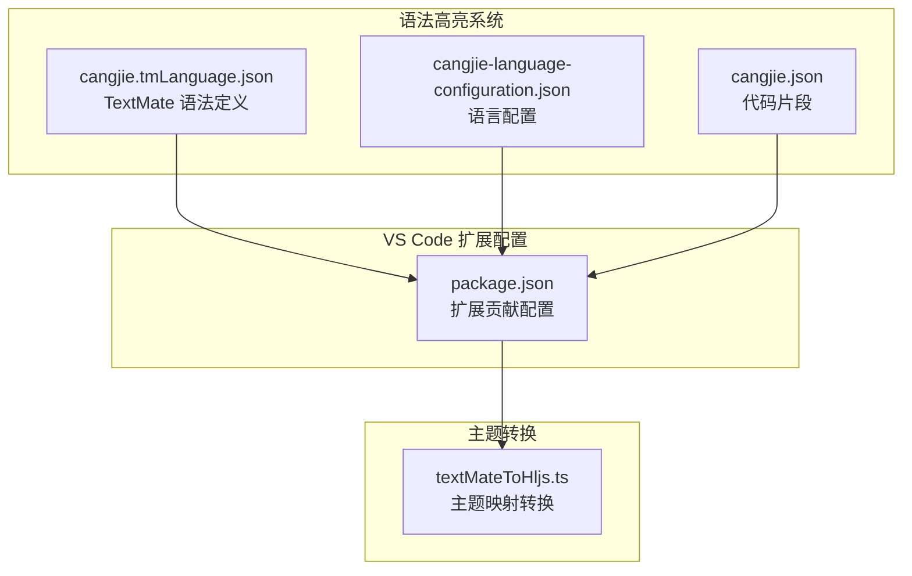
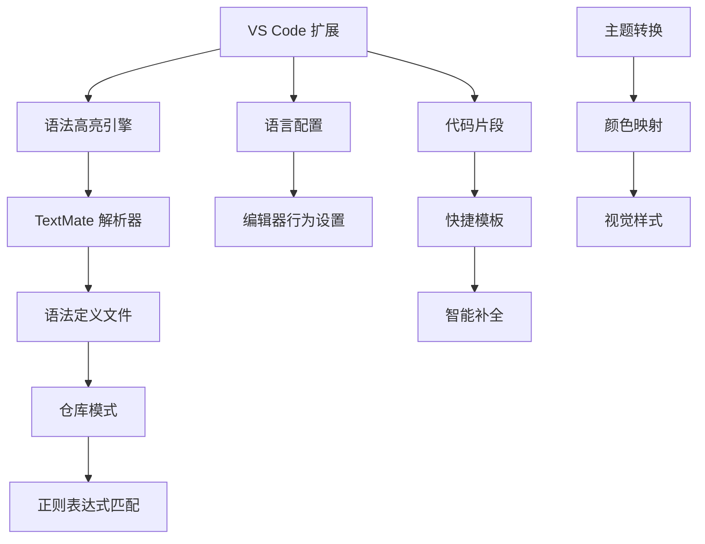
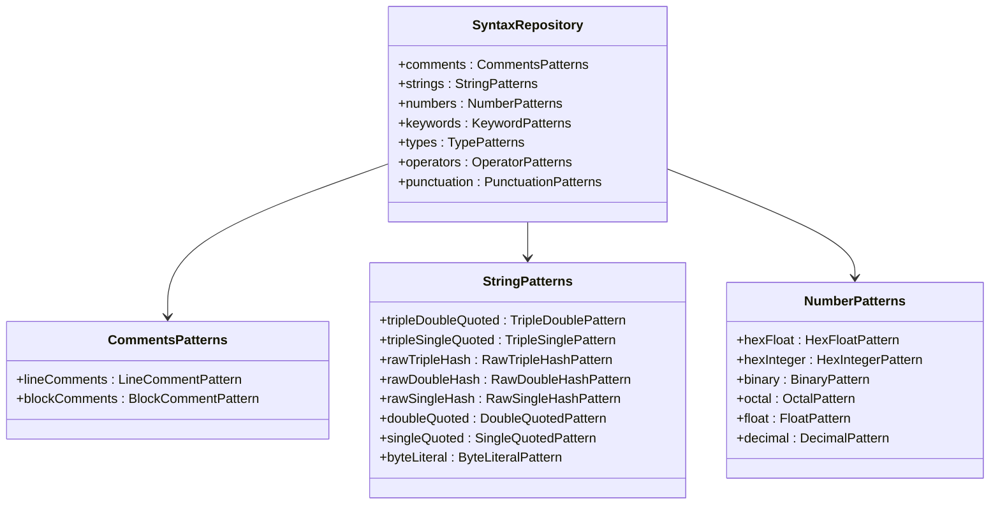
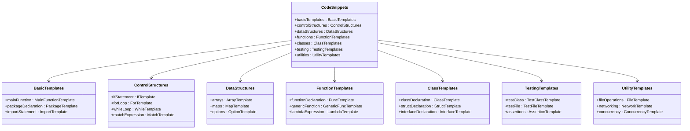
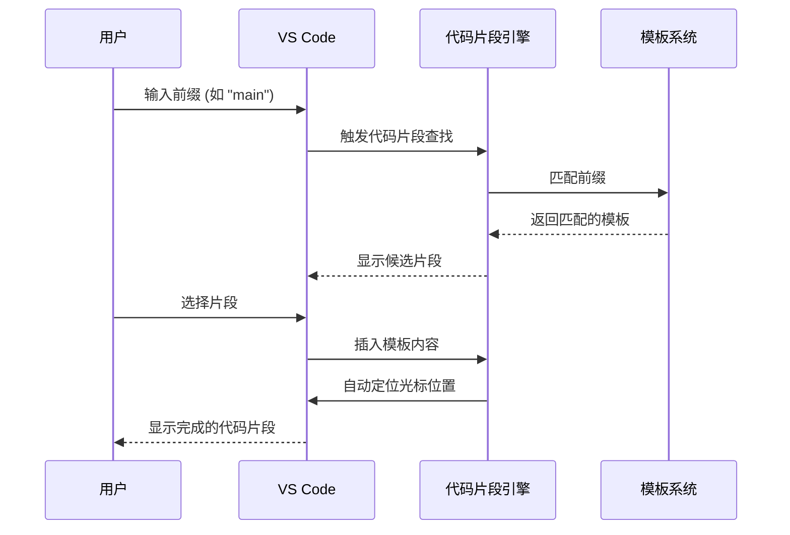
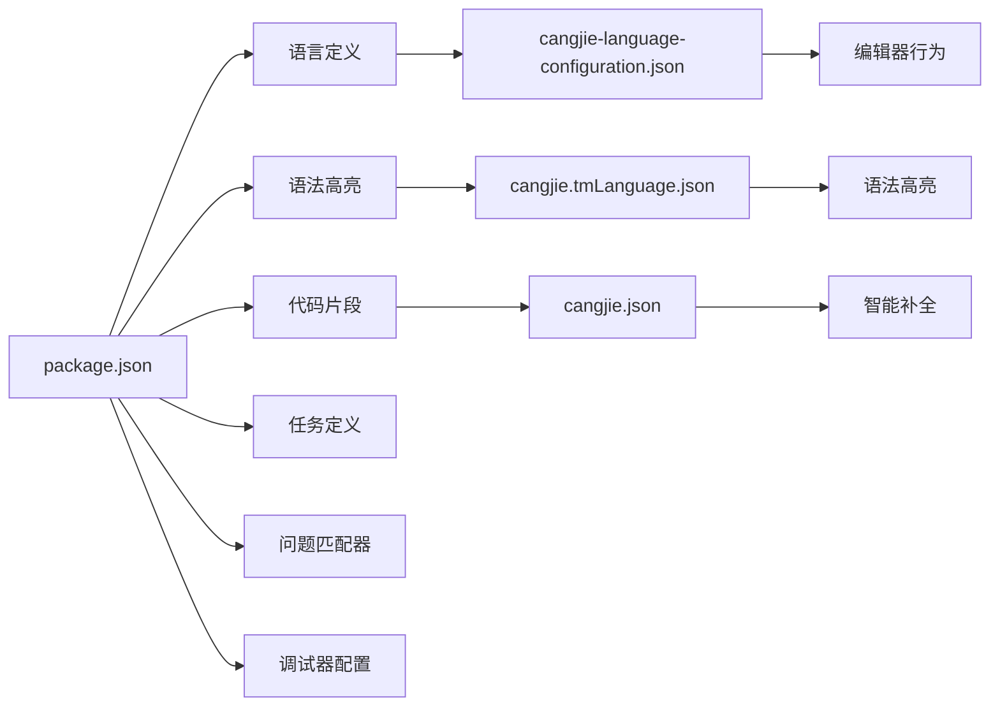

# 语法高亮与配置

<cite>
**本文档引用的文件**
- [cangjie.tmLanguage.json](file://src/syntaxes/cangjie.tmLanguage.json)
- [cangjie-language-configuration.json](file://src/languages/cangjie-language-configuration.json)
- [cangjie.json](file://src/snippets/cangjie.json)
- [package.json](file://src/package.json)
- [textMateToHljs.ts](file://webview-ui/src/utils/textMateToHljs.ts)
</cite>

## 目录
1. [简介](#简介)
2. [项目结构](#项目结构)
3. [核心组件](#核心组件)
4. [架构概览](#架构概览)
5. [详细组件分析](#详细组件分析)
6. [依赖关系分析](#依赖关系分析)
7. [性能考虑](#性能考虑)
8. [故障排除指南](#故障排除指南)
9. [结论](#结论)

## 简介

本文档详细介绍了 Cangjie 语言的语法高亮与配置系统。Cangjie 是一种现代编程语言，本项目为其提供了完整的 VS Code 扩展支持，包括语法高亮、语言配置、代码片段等功能。

该系统基于 TextMate 语法定义文件，通过正则表达式模式匹配实现精确的语法高亮效果。同时提供了丰富的代码片段模板，支持快速开发和智能补全功能。

## 项目结构

Cangjie 语法高亮与配置系统主要由以下核心文件组成：



**图表来源**
- [cangjie.tmLanguage.json:1-392](file://src/syntaxes/cangjie.tmLanguage.json#L1-L392)
- [cangjie-language-configuration.json:1-37](file://src/languages/cangjie-language-configuration.json#L1-L37)
- [cangjie.json:1-575](file://src/snippets/cangjie.json#L1-L575)
- [package.json:51-79](file://src/package.json#L51-L79)

**章节来源**
- [cangjie.tmLanguage.json:1-392](file://src/syntaxes/cangjie.tmLanguage.json#L1-L392)
- [cangjie-language-configuration.json:1-37](file://src/languages/cangjie-language-configuration.json#L1-L37)
- [cangjie.json:1-575](file://src/snippets/cangjie.json#L1-L575)
- [package.json:51-79](file://src/package.json#L51-L79)

## 核心组件

### TextMate 语法定义文件

语法定义文件采用标准的 TextMate 语法格式，通过正则表达式模式匹配实现精确的语法高亮。文件结构包含主模式和仓库模式两个主要部分。

**章节来源**
- [cangjie.tmLanguage.json:1-17](file://src/syntaxes/cangjie.tmLanguage.json#L1-L17)

### 语言配置文件

语言配置文件定义了编辑器的行为设置，包括注释规则、括号匹配、自动闭合、缩进规则等编辑器功能。

**章节来源**
- [cangjie-language-configuration.json:1-37](file://src/languages/cangjie-language-configuration.json#L1-L37)

### 代码片段系统

代码片段系统提供了丰富的快捷输入模板，支持函数声明、类定义、控制结构等多种编程模式的快速生成。

**章节来源**
- [cangjie.json:1-575](file://src/snippets/cangjie.json#L1-L575)

## 架构概览

Cangjie 语法高亮系统采用分层架构设计，确保语法高亮、语言配置和代码片段功能的独立性和可维护性：



**图表来源**
- [package.json:51-79](file://src/package.json#L51-L79)
- [textMateToHljs.ts:1-156](file://webview-ui/src/utils/textMateToHljs.ts#L1-L156)

## 详细组件分析

### TextMate 语法定义分析

#### 语法元素分类

语法定义文件将代码元素分为多个类别，每个类别都有特定的命名空间和样式：



**图表来源**
- [cangjie.tmLanguage.json:18-390](file://src/syntaxes/cangjie.tmLanguage.json#L18-L390)

#### 关键字匹配模式

关键字系统包含多种类型的保留字，每种都有特定的语法类别：

**章节来源**
- [cangjie.tmLanguage.json:208-239](file://src/syntaxes/cangjie.tmLanguage.json#L208-L239)

#### 类型系统匹配

类型系统支持基本数据类型和用户定义类型，包括整数、浮点数、布尔值、字符串等原语类型：

**章节来源**
- [cangjie.tmLanguage.json:241-252](file://src/syntaxes/cangjie.tmLanguage.json#L241-L252)

#### 操作符匹配系统

操作符系统覆盖了所有 Cangjie 语言的操作符，从算术运算到逻辑比较，从赋值到特殊符号：

**章节来源**
- [cangjie.tmLanguage.json:280-339](file://src/syntaxes/cangjie.tmLanguage.json#L280-L339)

### 语言配置系统

#### 编辑器行为设置

语言配置文件定义了编辑器的核心行为：

```mermaid
flowchart TD
A[语言配置] --> B[注释设置]
A --> C[括号匹配]
A --> D[自动闭合]
A --> E[缩进规则]
A --> F[折叠功能]
B --> G[行注释: //]
B --> H[块注释: /* ... */]
C --> I[{ }], [ ], ( )
D --> J[字符串自动闭合]
D --> K[括号自动闭合]
E --> L[增加缩进: {]
E --> M[减少缩进: }]
F --> N[区域折叠: #region/#endregion]
```

**图表来源**
- [cangjie-language-configuration.json:1-37](file://src/languages/cangjie-language-configuration.json#L1-L37)

**章节来源**
- [cangjie-language-configuration.json:1-37](file://src/languages/cangjie-language-configuration.json#L1-L37)

### 代码片段系统

#### 快捷模板分类

代码片段系统提供了超过 50 种预定义的快捷模板，涵盖各种编程场景：



**图表来源**
- [cangjie.json:1-575](file://src/snippets/cangjie.json#L1-L575)

**章节来源**
- [cangjie.json:1-575](file://src/snippets/cangjie.json#L1-L575)

#### 代码片段使用流程



**图表来源**
- [cangjie.json:1-575](file://src/snippets/cangjie.json#L1-L575)

## 依赖关系分析

### VS Code 扩展贡献关系

VS Code 扩展通过 package.json 文件贡献各种语言支持功能：



**图表来源**
- [package.json:51-79](file://src/package.json#L51-L79)

### 主题转换系统

系统还包括一个主题转换模块，用于将 TextMate 主题映射到其他格式：

**章节来源**
- [textMateToHljs.ts:1-156](file://webview-ui/src/utils/textMateToHljs.ts#L1-L156)

## 性能考虑

### 语法匹配优化

TextMate 语法定义采用了精心设计的正则表达式模式，确保高效的语法匹配性能：

1. **优先级排序**: 语法元素按照复杂度和匹配频率进行排序
2. **原子组使用**: 复杂模式使用原子组避免回溯
3. **边界检查**: 使用单词边界确保精确匹配
4. **嵌套处理**: 支持字符串插值和转义序列的嵌套解析

### 内存使用优化

1. **模式缓存**: VS Code 缓存编译后的正则表达式
2. **增量解析**: 支持增量语法分析减少全量重解析
3. **资源管理**: 合理的内存使用避免长时间编辑会话中的内存泄漏

## 故障排除指南

### 常见问题诊断

#### 语法高亮异常

**问题症状**:
- 特定关键字未正确高亮
- 字符串插值不被识别
- 注释样式异常

**解决方案**:
1. 检查正则表达式的边界条件
2. 验证转义序列的正确性
3. 确认模式的优先级顺序

#### 代码片段不工作

**问题症状**:
- 前缀无法触发代码片段
- 插入的代码位置不正确
- 占位符未正确激活

**解决方案**:
1. 验证前缀的唯一性和简洁性
2. 检查占位符的嵌套结构
3. 确认模板的缩进一致性

### 调试技巧

1. **使用 VS Code 开发者工具**观察语法解析过程
2. **检查扩展日志**获取详细的错误信息
3. **测试正则表达式**验证模式的正确性
4. **对比现有实现**参考相似语言的配置模式

## 结论

Cangjie 语法高亮与配置系统提供了完整的语言支持解决方案，具有以下特点：

1. **全面的语法覆盖**: 支持 Cangjie 语言的所有语法元素
2. **灵活的配置选项**: 可定制的编辑器行为设置
3. **丰富的开发体验**: 智能代码片段和快捷模板
4. **良好的性能表现**: 优化的正则表达式和增量解析
5. **易于扩展**: 清晰的架构便于添加新功能

该系统为 Cangjie 语言开发者提供了专业级的编辑器体验，支持从基础语法高亮到高级智能功能的完整开发流程。