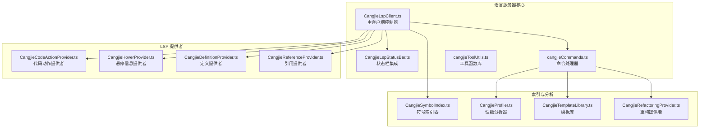
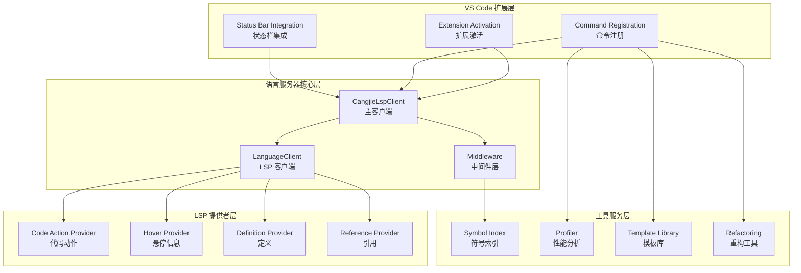
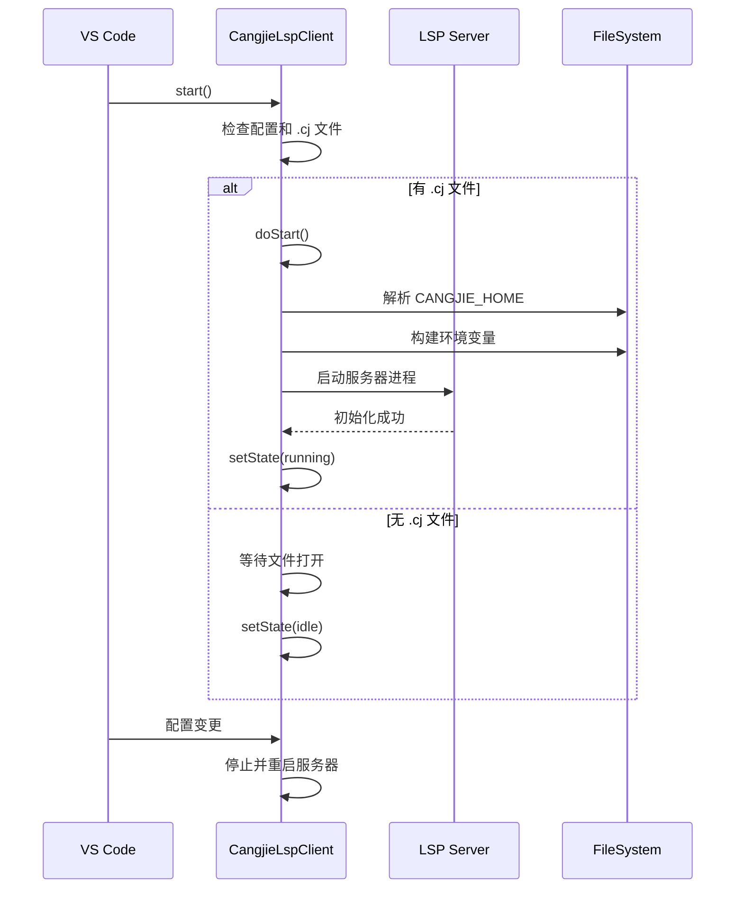
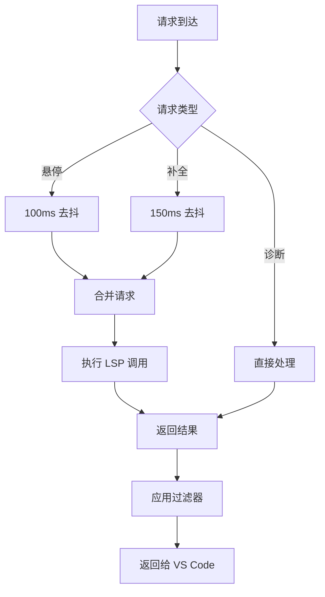
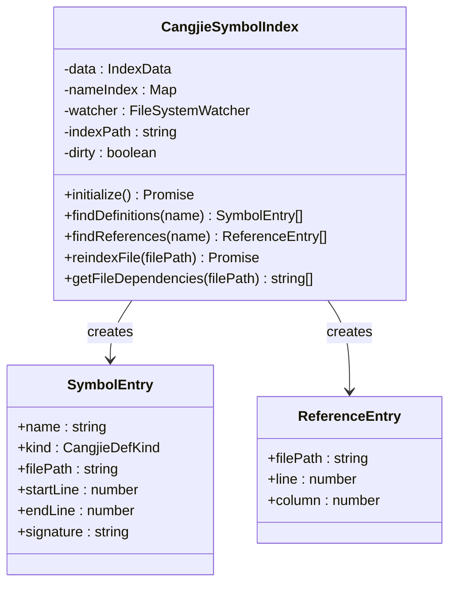
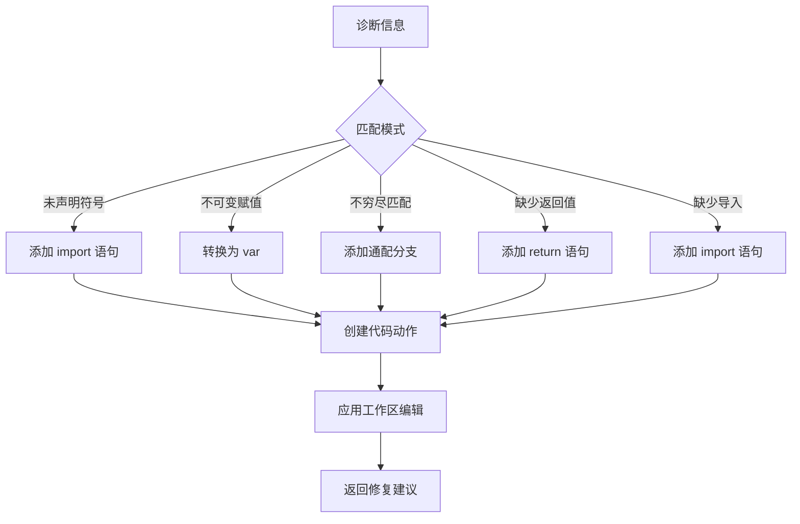
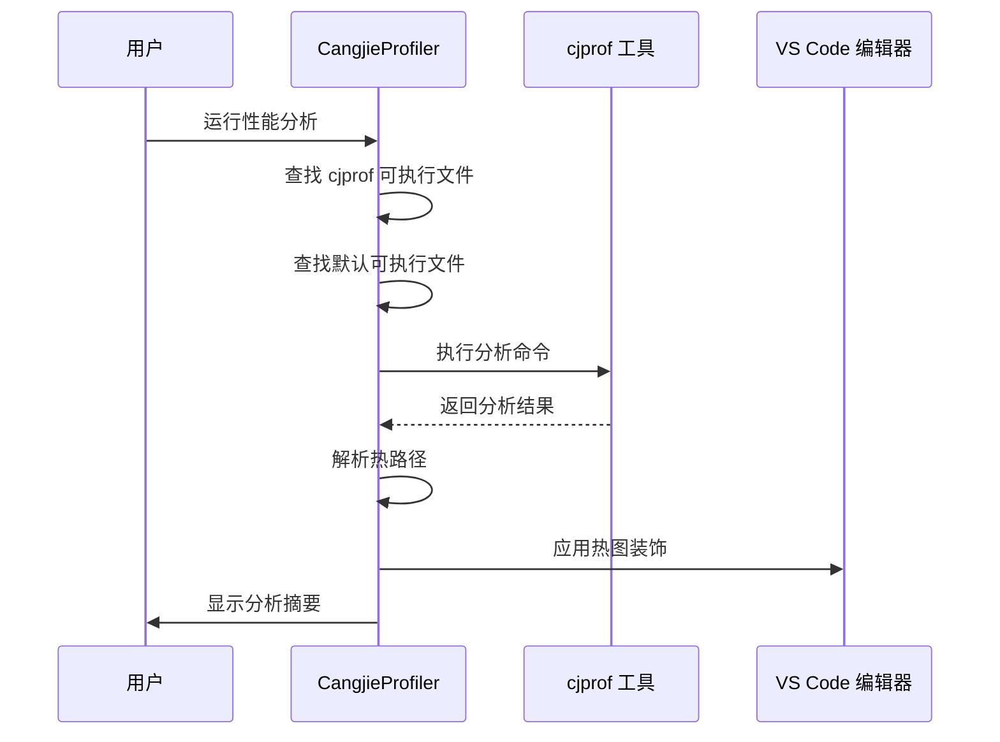
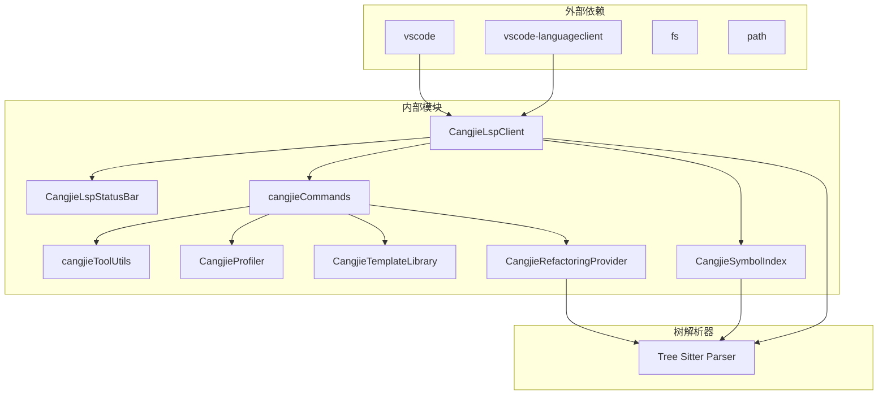

# 语言服务器实现

<cite>
**本文档引用的文件**
- [CangjieLspClient.ts](file://src/services/cangjie-lsp/CangjieLspClient.ts)
- [CangjieLspStatusBar.ts](file://src/services/cangjie-lsp/CangjieLspStatusBar.ts)
- [cangjieCommands.ts](file://src/services/cangjie-lsp/cangjieCommands.ts)
- [cangjieToolUtils.ts](file://src/services/cangjie-lsp/cangjieToolUtils.ts)
- [CangjieCodeActionProvider.ts](file://src/services/cangjie-lsp/CangjieCodeActionProvider.ts)
- [CangjieHoverProvider.ts](file://src/services/cangjie-lsp/CangjieHoverProvider.ts)
- [CangjieDefinitionProvider.ts](file://src/services/cangjie-lsp/CangjieDefinitionProvider.ts)
- [CangjieReferenceProvider.ts](file://src/services/cangjie-lsp/CangjieReferenceProvider.ts)
- [CangjieSymbolIndex.ts](file://src/services/cangjie-lsp/CangjieSymbolIndex.ts)
- [CangjieProfiler.ts](file://src/services/cangjie-lsp/CangjieProfiler.ts)
- [CangjieTemplateLibrary.ts](file://src/services/cangjie-lsp/CangjieTemplateLibrary.ts)
- [CangjieRefactoringProvider.ts](file://src/services/cangjie-lsp/CangjieRefactoringProvider.ts)
</cite>

## 目录
1. [简介](#简介)
2. [项目结构](#项目结构)
3. [核心组件](#核心组件)
4. [架构概览](#架构概览)
5. [详细组件分析](#详细组件分析)
6. [依赖关系分析](#依赖关系分析)
7. [性能考虑](#性能考虑)
8. [故障排除指南](#故障排除指南)
9. [结论](#结论)

## 简介

Cangjie 语言服务器实现是 VS Code 扩展中的核心组件，负责为 Cangjie 编程语言提供完整的语言服务支持。该实现基于 VS Code Language Server Protocol (LSP) 架构，集成了智能代码补全、悬停提示、语法诊断、重构工具等多种开发辅助功能。

本系统通过 CangjieLspClient 类作为主要入口点，协调多个 LSP 提供者和服务组件，为开发者提供流畅的 Cangjie 开发体验。系统支持懒加载启动、自动重启机制、状态栏集成等功能，确保在各种项目配置下都能稳定运行。

## 项目结构

Cangjie 语言服务器实现位于 `src/services/cangjie-lsp/` 目录下，采用模块化设计，每个功能领域都有独立的 TypeScript 文件：

**图表来源**
- [CangjieLspClient.ts:1-660](file://src/services/cangjie-lsp/CangjieLspClient.ts#L1-L660)
- [CangjieLspStatusBar.ts:1-113](file://src/services/cangjie-lsp/CangjieLspStatusBar.ts#L1-L113)
- [cangjieCommands.ts:1-141](file://src/services/cangjie-lsp/cangjieCommands.ts#L1-L141)

**章节来源**
- [CangjieLspClient.ts:1-660](file://src/services/cangjie-lsp/CangjieLspClient.ts#L1-L660)
- [CangjieLspStatusBar.ts:1-113](file://src/services/cangjie-lsp/CangjieLspStatusBar.ts#L1-L113)
- [cangjieCommands.ts:1-141](file://src/services/cangjie-lsp/cangjieCommands.ts#L1-L141)

## 核心组件

### CangjieLspClient - 主要客户端控制器

CangjieLspClient 是整个语言服务器实现的核心类，负责管理 LSP 连接生命周期、配置管理和错误处理。

**主要特性：**
- **懒加载启动**：仅在用户打开 .cj 文件时启动服务器
- **自动重启机制**：最多尝试 3 次自动重启
- **配置监听**：实时响应 VS Code 设置变更
- **性能监控**：记录首次完成和悬停响应时间

**状态管理：**
- idle：待命状态（等待 .cj 文件打开）
- starting：启动中
- running：正常运行
- warning：警告状态
- error：错误状态
- stopped：已停止

**章节来源**
- [CangjieLspClient.ts:270-660](file://src/services/cangjie-lsp/CangjieLspClient.ts#L270-L660)

### CangjieLspStatusBar - 状态栏集成

提供直观的状态栏反馈，显示语言服务器当前状态和 SDK 版本信息。

**功能特性：**
- 实时状态指示（圆形图标）
- 点击显示输出通道
- 自动检测 SDK 版本
- 条件显示（仅在 Cangjie 文件中）

**章节来源**
- [CangjieLspStatusBar.ts:1-113](file://src/services/cangjie-lsp/CangjieLspStatusBar.ts#L1-L113)

### cangjieCommands - 命令处理器

注册和管理所有 Cangjie 相关的 VS Code 命令。

**命令类别：**
- **cjpm 构建命令**：build、run、test、check、clean
- **服务器控制**：重启语言服务器
- **模板系统**：插入代码模板
- **性能分析**：运行性能分析器
- **重构工具**：提取函数、移动文件

**章节来源**
- [cangjieCommands.ts:1-141](file://src/services/cangjie-lsp/cangjieCommands.ts#L1-L141)

## 架构概览

Cangjie 语言服务器采用分层架构设计，各组件职责明确且松耦合：

**图表来源**
- [CangjieLspClient.ts:476-525](file://src/services/cangjie-lsp/CangjieLspClient.ts#L476-L525)
- [CangjieCodeActionProvider.ts:185-210](file://src/services/cangjie-lsp/CangjieCodeActionProvider.ts#L185-L210)
- [CangjieHoverProvider.ts:9-63](file://src/services/cangjie-lsp/CangjieHoverProvider.ts#L9-L63)

## 详细组件分析

### LSP 客户端架构

CangjieLspClient 实现了完整的 LSP 客户端生命周期管理：

**图表来源**
- [CangjieLspClient.ts:376-565](file://src/services/cangjie-lsp/CangjieLspClient.ts#L376-L565)

**章节来源**
- [CangjieLspClient.ts:376-565](file://src/services/cangjie-lsp/CangjieLspClient.ts#L376-L565)

### 中间件系统

系统实现了高性能的中间件层，用于处理高频 LSP 请求：

**图表来源**
- [CangjieLspClient.ts:46-56](file://src/services/cangjie-lsp/CangjieLspClient.ts#L46-L56)

**章节来源**
- [CangjieLspClient.ts:46-56](file://src/services/cangjie-lsp/CangjieLspClient.ts#L46-L56)

### 符号索引系统

CangjieSymbolIndex 提供了强大的本地符号索引功能：

**图表来源**
- [CangjieSymbolIndex.ts:43-470](file://src/services/cangjie-lsp/CangjieSymbolIndex.ts#L43-L470)

**章节来源**
- [CangjieSymbolIndex.ts:43-470](file://src/services/cangjie-lsp/CangjieSymbolIndex.ts#L43-L470)

### 代码动作提供者

CangjieCodeActionProvider 实现了智能的代码修复建议：

**图表来源**
- [CangjieCodeActionProvider.ts:50-183](file://src/services/cangjie-lsp/CangjieCodeActionProvider.ts#L50-L183)

**章节来源**
- [CangjieCodeActionProvider.ts:50-183](file://src/services/cangjie-lsp/CangjieCodeActionProvider.ts#L50-L183)

### 性能分析器

CangjieProfiler 集成了 cjprof 工具进行性能分析：

**图表来源**
- [CangjieProfiler.ts:44-132](file://src/services/cangjie-lsp/CangjieProfiler.ts#L44-L132)

**章节来源**
- [CangjieProfiler.ts:44-132](file://src/services/cangjie-lsp/CangjieProfiler.ts#L44-L132)

## 依赖关系分析

Cangjie 语言服务器实现具有清晰的依赖层次结构：

**图表来源**
- [CangjieLspClient.ts:1-12](file://src/services/cangjie-lsp/CangjieLspClient.ts#L1-L12)
- [CangjieSymbolIndex.ts:1-11](file://src/services/cangjie-lsp/CangjieSymbolIndex.ts#L1-L11)

**章节来源**
- [CangjieLspClient.ts:1-12](file://src/services/cangjie-lsp/CangjieLspClient.ts#L1-L12)
- [CangjieSymbolIndex.ts:1-11](file://src/services/cangjie-lsp/CangjieSymbolIndex.ts#L1-L11)

## 性能考虑

### 启动优化策略

1. **懒加载机制**：仅在需要时启动 LSP 服务器
2. **去抖处理**：对高频请求进行去抖处理
3. **缓存策略**：SDK 路径和环境变量缓存
4. **增量索引**：符号索引的增量更新

### 内存管理

1. **文件监听器管理**：正确清理文件系统监听器
2. **定时器清理**：避免内存泄漏
3. **索引持久化**：定期保存符号索引到磁盘
4. **资源释放**：实现 Disposable 接口确保资源正确释放

### 错误处理

1. **自动重启**：最多 3 次自动重启尝试
2. **降级模式**：即使 LSP 不可用也能提供基本功能
3. **详细日志**：完整的错误日志记录
4. **用户友好提示**：清晰的错误信息和解决方案

## 故障排除指南

### 常见问题及解决方案

**LSP 服务器无法启动**
- 检查 CANGJIE_HOME 环境变量设置
- 验证 LSPServer 可执行文件存在
- 确认 SDK 环境已正确配置

**符号索引不准确**
- 清理符号索引缓存
- 重新构建项目索引
- 检查文件权限

**性能问题**
- 检查系统资源使用情况
- 调整去抖延迟设置
- 优化项目结构

**章节来源**
- [CangjieLspClient.ts:567-594](file://src/services/cangjie-lsp/CangjieLspClient.ts#L567-L594)
- [CangjieLspClient.ts:546-564](file://src/services/cangjie-lsp/CangjieLspClient.ts#L546-L564)

## 结论

Cangjie 语言服务器实现展现了现代 VS Code 扩展的最佳实践，通过模块化设计、清晰的架构分离和完善的错误处理机制，为 Cangjie 开发者提供了专业级的语言服务支持。

该实现的关键优势包括：
- **高可用性**：自动重启和降级模式确保稳定性
- **高性能**：去抖处理和缓存策略优化响应速度
- **易维护性**：清晰的代码结构和详细的注释
- **可扩展性**：模块化设计便于功能扩展

通过持续的性能优化和功能增强，该语言服务器将成为 Cangjie 生态系统中不可或缺的重要组件。