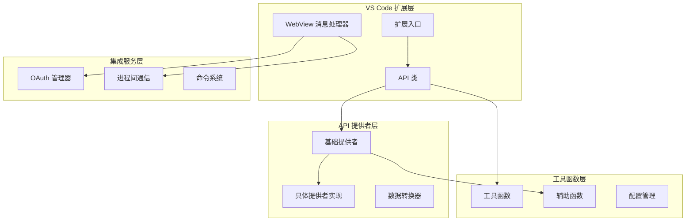
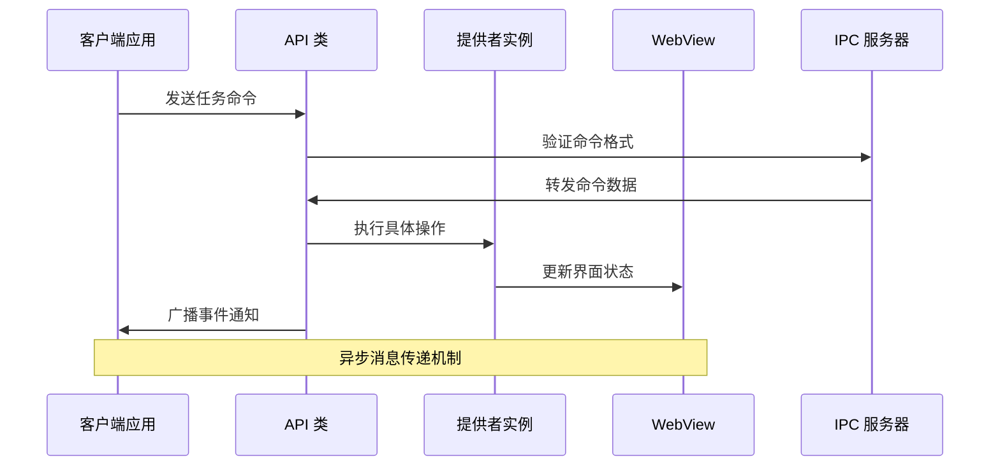
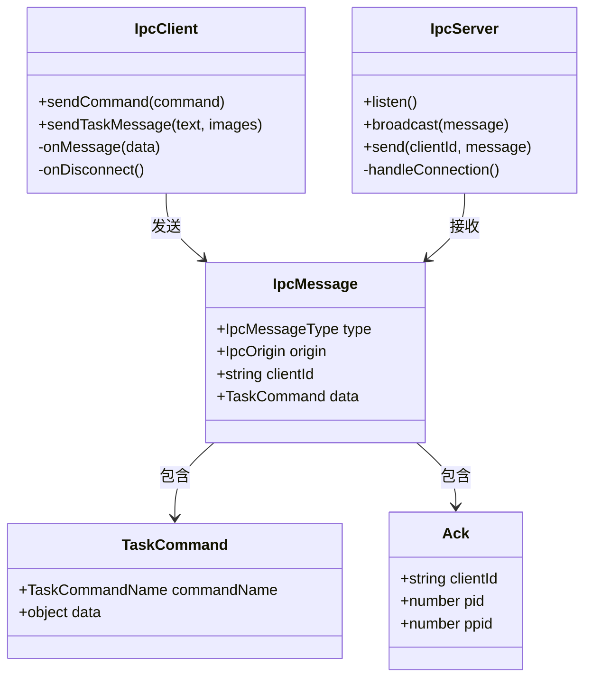
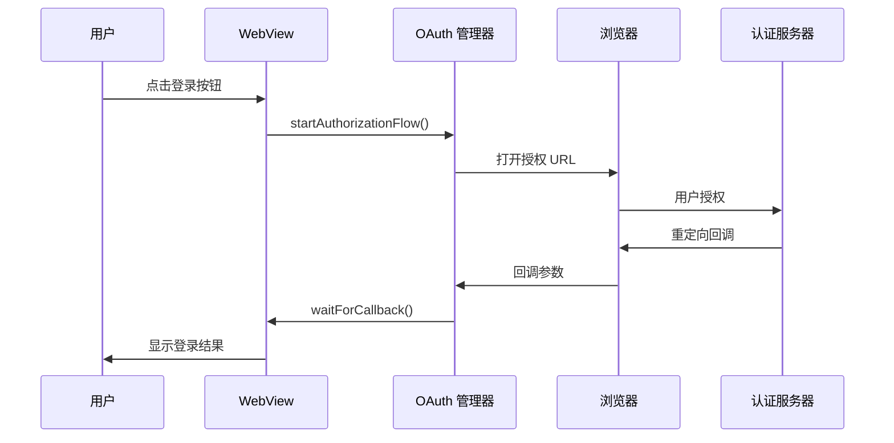
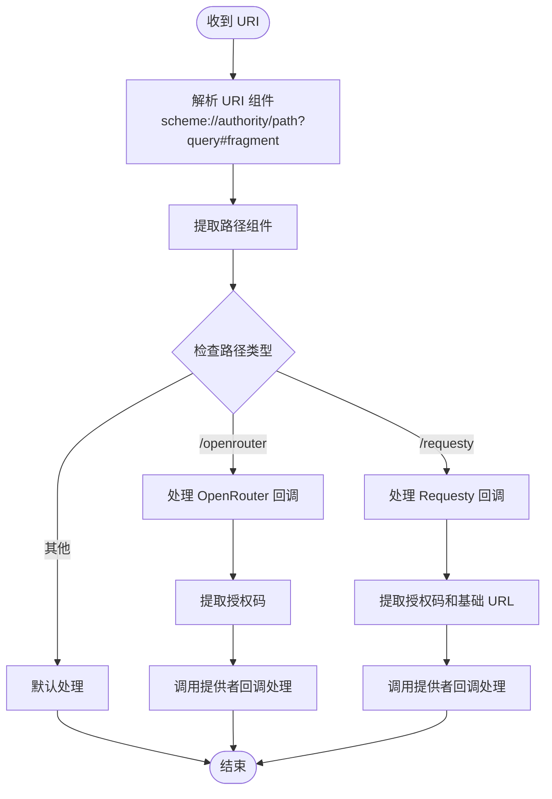
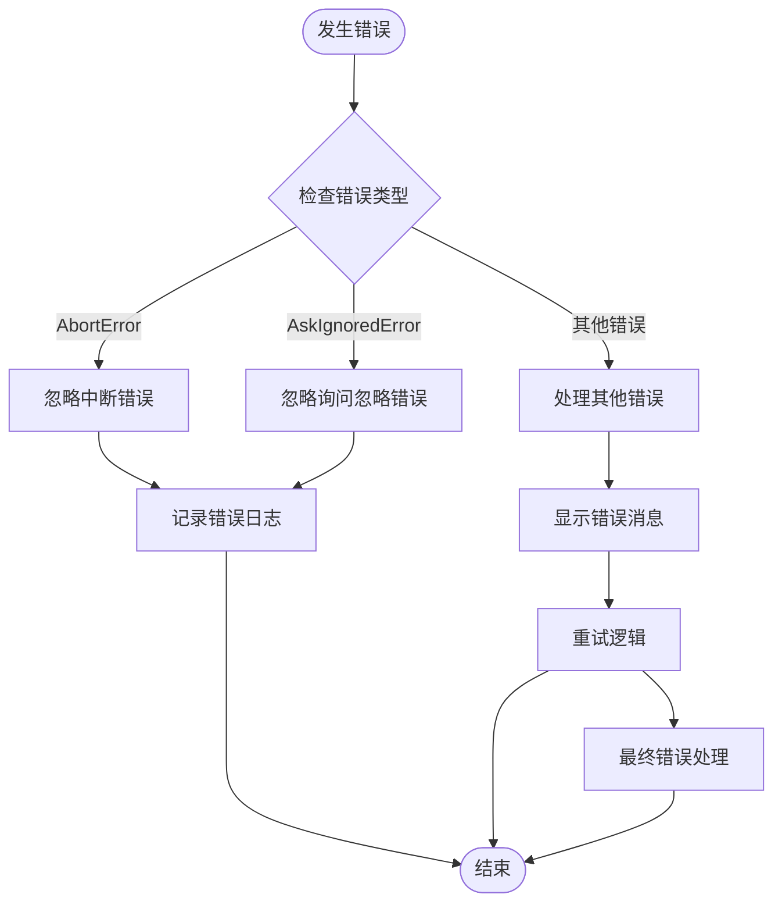
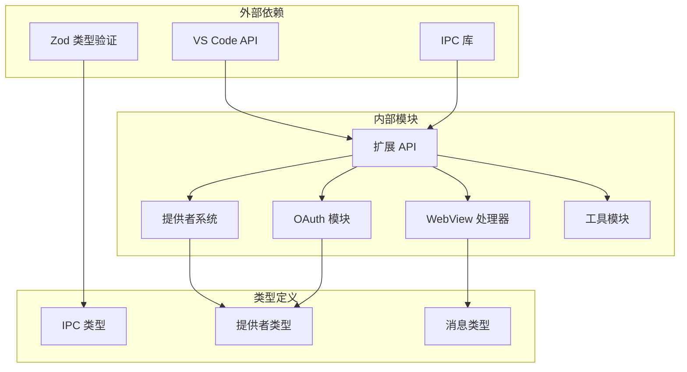

# API 集成

<cite>
**本文档引用的文件**
- [src/extension/api.ts](file://src/extension/api.ts)
- [src/api/index.ts](file://src/api/index.ts)
- [src/api/providers/base-provider.ts](file://src/api/providers/base-provider.ts)
- [src/shared/api.ts](file://src/shared/api.ts)
- [src/integrations/openai-codex/oauth.ts](file://src/integrations/openai-codex/oauth.ts)
- [src/core/webview/webviewMessageHandler.ts](file://src/core/webview/webviewMessageHandler.ts)
- [src/activate/handleUri.ts](file://src/activate/handleUri.ts)
- [packages/types/src/ipc.ts](file://packages/types/src/ipc.ts)
- [packages/ipc/src/ipc-client.ts](file://packages/ipc/src/ipc-client.ts)
- [src/utils/errorHandling.ts](file://src/utils/errorHandling.ts)
- [src/core/task/Task.ts](file://src/core/task/Task.ts)
- [packages/types/src/__tests__/ipc.test.ts](file://packages/types/src/__tests__/ipc.test.ts)
- [apps/cli/src/commands/auth/login.ts](file://apps/cli/src/commands/auth/login.ts)
- [packages/vscode-shim/src/classes/Uri.ts](file://packages/vscode-shim/src/classes/Uri.ts)
</cite>

## 目录
1. [简介](#简介)
2. [项目结构](#项目结构)
3. [核心组件](#核心组件)
4. [架构概览](#架构概览)
5. [详细组件分析](#详细组件分析)
6. [依赖关系分析](#依赖关系分析)
7. [性能考虑](#性能考虑)
8. [故障排除指南](#故障排除指南)
9. [结论](#结论)
10. [附录](#附录)

## 简介

本文件为 VS Code 扩展的 API 集成文档，详细描述了与 VS Code 扩展通信的 API 接口、命令解析机制和消息传递协议。文档涵盖了 OAuth 认证流程、URL 处理和工具函数的实现，并提供了 API 调用的最佳实践、错误处理策略和重试机制。同时包含具体的 API 使用示例和集成指南，解释数据格式转换、编码处理和安全考虑。

## 项目结构

该代码库采用模块化架构，主要分为以下几个核心区域：



**图表来源**
- [src/extension/api.ts:31-163](file://src/extension/api.ts#L31-L163)
- [src/api/index.ts:114-191](file://src/api/index.ts#L114-L191)
- [src/api/providers/base-provider.ts:13-123](file://src/api/providers/base-provider.ts#L13-L123)

**章节来源**
- [src/extension/api.ts:1-567](file://src/extension/api.ts#L1-L567)
- [src/api/index.ts:1-192](file://src/api/index.ts#L1-L192)

## 核心组件

### API 类 (API)

API 类是 VS Code 扩展的核心接口，负责与 WebView 进行通信并处理各种任务命令。

**主要功能特性：**
- **IPC 服务器**：通过 IpcServer 监听外部客户端连接
- **任务管理**：支持新建、取消、恢复任务
- **消息传递**：处理用户消息发送和队列管理
- **事件监听**：转发任务生命周期事件到客户端
- **配置管理**：提供全局设置和提供者配置管理

**关键方法：**
- `startNewTask()`: 创建新任务并启动聊天会话
- `resumeTask()`: 恢复指定任务状态
- `sendMessage()`: 发送用户消息到 AI 服务
- `cancelCurrentTask()`: 取消当前任务执行
- `deleteQueuedMessage()`: 删除队列中的消息

**章节来源**
- [src/extension/api.ts:31-567](file://src/extension/api.ts#L31-L567)

### API 提供者系统

API 提供者系统支持多种 AI 服务提供商，包括 OpenAI、Anthropic、Google Gemini 等。

**提供者类型：**
- 动态提供者：支持运行时配置的提供者
- 本地提供者：直接连接本地模型的服务
- 兼容提供者：遵循特定 API 规范的服务

**核心接口：**
- `ApiHandler`: 定义统一的 API 调用接口
- `BaseProvider`: 提供者基类，实现通用功能
- `ApiStream`: 流式响应处理

**章节来源**
- [src/api/index.ts:94-112](file://src/api/index.ts#L94-L112)
- [src/api/providers/base-provider.ts:13-123](file://src/api/providers/base-provider.ts#L13-L123)

### WebView 消息处理

WebView 消息处理器负责处理来自 WebView 的各种消息请求，包括认证、设置管理和模式导入等功能。

**主要消息类型：**
- `openAiCodexSignIn`: OpenAI Codex 认证登录
- `openAiCodexSignOut`: OpenAI Codex 认证登出
- `saveCodeIndexSettingsAtomic`: 原子性保存代码索引设置
- `checkRulesDirectory`: 检查自定义规则目录
- `debugSetting`: 切换调试模式

**章节来源**
- [src/core/webview/webviewMessageHandler.ts:2296-2334](file://src/core/webview/webviewMessageHandler.ts#L2296-L2334)

## 架构概览

系统采用分层架构设计，确保各组件间的松耦合和高内聚。



**图表来源**
- [src/extension/api.ts:70-161](file://src/extension/api.ts#L70-L161)
- [packages/types/src/ipc.ts:107-125](file://packages/types/src/ipc.ts#L107-L125)

**章节来源**
- [src/extension/api.ts:64-163](file://src/extension/api.ts#L64-L163)
- [packages/types/src/ipc.ts:1-151](file://packages/types/src/ipc.ts#L1-L151)

## 详细组件分析

### IPC 通信协议

IPC（进程间通信）协议定义了客户端与服务器之间的标准化消息格式。



**图表来源**
- [packages/types/src/ipc.ts:10-37](file://packages/types/src/ipc.ts#L10-L37)
- [packages/types/src/ipc.ts:59-99](file://packages/types/src/ipc.ts#L59-L99)
- [packages/ipc/src/ipc-client.ts:93-105](file://packages/ipc/src/ipc-client.ts#L93-L105)

**IPC 消息类型：**
- `Connect`: 连接建立
- `Disconnect`: 连接断开
- `Ack`: 确认响应
- `TaskCommand`: 任务命令
- `TaskEvent`: 任务事件

**任务命令类型：**
- `StartNewTask`: 开始新任务
- `CancelTask`: 取消任务
- `CloseTask`: 关闭任务
- `ResumeTask`: 恢复任务
- `SendMessage`: 发送消息
- `GetCommands`: 获取命令列表
- `GetModes`: 获取模式列表
- `GetModels`: 获取模型列表
- `DeleteQueuedMessage`: 删除队列消息

**章节来源**
- [packages/types/src/ipc.ts:10-151](file://packages/types/src/ipc.ts#L10-L151)
- [packages/ipc/src/ipc-client.ts:49-105](file://packages/ipc/src/ipc-client.ts#L49-L105)

### OAuth 认证流程

系统支持多种 OAuth 认证方式，特别是 OpenAI Codex 的认证流程。



**图表来源**
- [src/core/webview/webviewMessageHandler.ts:2296-2321](file://src/core/webview/webviewMessageHandler.ts#L2296-L2321)
- [src/integrations/openai-codex/oauth.ts:25-37](file://src/integrations/openai-codex/oauth.ts#L25-L37)

**OAuth 管理器接口：**
- `getAccessToken()`: 获取访问令牌
- `forceRefreshAccessToken()`: 强制刷新令牌
- `getAccountId()`: 获取账户 ID
- `isAuthenticated()`: 检查认证状态
- `initialize()`: 初始化 OAuth 流程
- `startAuthorizationFlow()`: 启动授权流程
- `waitForCallback()`: 等待回调完成
- `clearCredentials()`: 清除认证凭据

**章节来源**
- [src/integrations/openai-codex/oauth.ts:1-39](file://src/integrations/openai-codex/oauth.ts#L1-L39)
- [src/core/webview/webviewMessageHandler.ts:2296-2334](file://src/core/webview/webviewMessageHandler.ts#L2296-L2334)

### URL 处理机制

系统使用统一的 URL 处理机制来处理各种回调和重定向。



**图表来源**
- [src/activate/handleUri.ts:5-33](file://src/activate/handleUri.ts#L5-L33)

**URL 处理特性：**
- 支持标准 URL 组件解析
- 自动处理 URL 编码字符
- 提供者特定的回调处理
- 错误处理和验证机制

**章节来源**
- [src/activate/handleUri.ts:1-34](file://src/activate/handleUri.ts#L1-L34)
- [packages/vscode-shim/src/classes/Uri.ts:90-124](file://packages/vscode-shim/src/classes/Uri.ts#L90-L124)

### 数据格式转换

系统实现了多种数据格式转换机制，确保不同组件间的数据兼容性。

**工具函数转换：**
- `convertToolsForOpenAI()`: 将工具转换为 OpenAI 兼容格式
- `convertToolSchemaForOpenAI()`: 转换工具模式为严格模式
- `countTokens()`: 统计内容令牌数量

**转换规则：**
- MCP 工具禁用严格模式以保留可选参数
- OpenAI 严格模式要求所有属性都在 required 数组中
- 空值类型转换为非空类型
- 对象模式添加 additionalProperties: false

**章节来源**
- [src/api/providers/base-provider.ts:27-106](file://src/api/providers/base-provider.ts#L27-L106)

### 错误处理策略

系统采用多层次的错误处理策略，确保系统的稳定性和用户体验。



**图表来源**
- [src/utils/errorHandling.ts:9-15](file://src/utils/errorHandling.ts#L9-L15)

**错误处理机制：**
- `ignoreAbortError()`: 静默忽略中断和询问忽略错误
- 任务级重试机制
- 指数退避算法
- 速率限制处理

**章节来源**
- [src/utils/errorHandling.ts:1-16](file://src/utils/errorHandling.ts#L1-L16)
- [src/core/task/Task.ts:4962-5001](file://src/core/task/Task.ts#L4962-L5001)

## 依赖关系分析

系统采用模块化设计，各组件间通过清晰的接口进行交互。



**图表来源**
- [src/extension/api.ts:9-25](file://src/extension/api.ts#L9-L25)
- [packages/types/src/ipc.ts:1-53](file://packages/types/src/ipc.ts#L1-L53)

**主要依赖关系：**
- VS Code 扩展 API：提供核心功能接口
- IPC 库：实现进程间通信
- Zod：提供类型安全的验证
- 内部模块：按功能划分的独立组件

**章节来源**
- [src/extension/api.ts:1-567](file://src/extension/api.ts#L1-L567)
- [packages/types/src/ipc.ts:1-151](file://packages/types/src/ipc.ts#L1-L151)

## 性能考虑

系统在设计时充分考虑了性能优化，采用了多种策略来提升响应速度和资源利用率。

**性能优化策略：**
- **异步处理**：所有长时间运行的操作都采用异步模式
- **流式响应**：支持流式 API 响应处理
- **缓存机制**：实现模型和配置的缓存
- **连接池**：管理 API 连接的复用
- **背压控制**：防止消息队列过载

**内存管理：**
- 及时清理临时对象和监听器
- 使用弱引用避免循环引用
- 分配和释放策略优化

**网络优化：**
- 连接复用和持久化
- 请求合并和批处理
- 超时和重试策略

## 故障排除指南

### 常见问题诊断

**IPC 连接问题：**
- 检查 socket 路径是否正确
- 验证客户端和服务端版本兼容性
- 确认防火墙设置允许连接

**认证失败问题：**
- 验证 OAuth 配置参数
- 检查回调 URL 设置
- 确认网络连接正常

**任务执行问题：**
- 查看任务日志输出
- 检查 API 密钥有效性
- 验证模型可用性

**章节来源**
- [src/extension/api.ts:425-466](file://src/extension/api.ts#L425-L466)
- [src/core/task/Task.ts:4932-4959](file://src/core/task/Task.ts#L4932-L4959)

### 调试技巧

**启用调试模式：**
- 设置 `debug` 配置选项
- 查看输出通道日志
- 使用开发者工具监控消息

**性能监控：**
- 监控内存使用情况
- 跟踪 API 调用延迟
- 分析任务执行时间

**错误追踪：**
- 记录完整的错误堆栈
- 分析错误发生的上下文
- 实现错误报告机制

## 结论

本 API 集成文档详细描述了 VS Code 扩展的通信机制、命令处理和消息协议。系统采用模块化设计，提供了灵活的 API 提供者选择、强大的 OAuth 认证支持和高效的 IPC 通信协议。通过合理的错误处理和重试机制，确保了系统的稳定性和可靠性。

推荐的集成实践包括：使用标准化的消息格式、实现适当的错误处理、利用缓存机制提升性能，以及遵循安全最佳实践来保护用户数据。

## 附录

### API 使用示例

**基本任务创建：**
```typescript
// 创建新任务
const taskId = await api.startNewTask({
    configuration: settings,
    text: "Hello, AI!",
    newTab: true
});

// 发送消息
await api.sendMessage("How are you?", ["image1.png", "image2.png"]);

// 恢复任务
await api.resumeTask(taskId);
```

**配置管理：**
```typescript
// 获取当前配置
const config = api.getConfiguration();

// 更新配置
await api.setConfiguration({
    currentApiConfigName: "default",
    enableReasoningEffort: true
});
```

**提供者配置：**
```typescript
// 创建提供者配置文件
const profiles = api.getProfiles();
const profile = api.getProfileEntry("default");

// 创建新配置文件
await api.createProfile("production", {
    apiProvider: "openai",
    apiKey: "sk-...",
    baseUrl: "https://api.openai.com"
});
```

### 最佳实践

**安全考虑：**
- 始终验证和清理用户输入
- 使用 HTTPS 和安全的传输协议
- 实施适当的访问控制和权限管理
- 定期轮换和更新 API 密钥

**性能优化：**
- 实现适当的缓存策略
- 使用流式处理减少内存占用
- 优化网络请求频率和批量大小
- 监控和分析性能指标

**错误处理：**
- 实现全面的错误捕获和处理
- 提供有意义的错误消息和恢复选项
- 记录详细的日志用于调试
- 实现优雅降级机制

**章节来源**
- [src/extension/api.ts:174-284](file://src/extension/api.ts#L174-L284)
- [src/shared/api.ts:159-187](file://src/shared/api.ts#L159-L187)