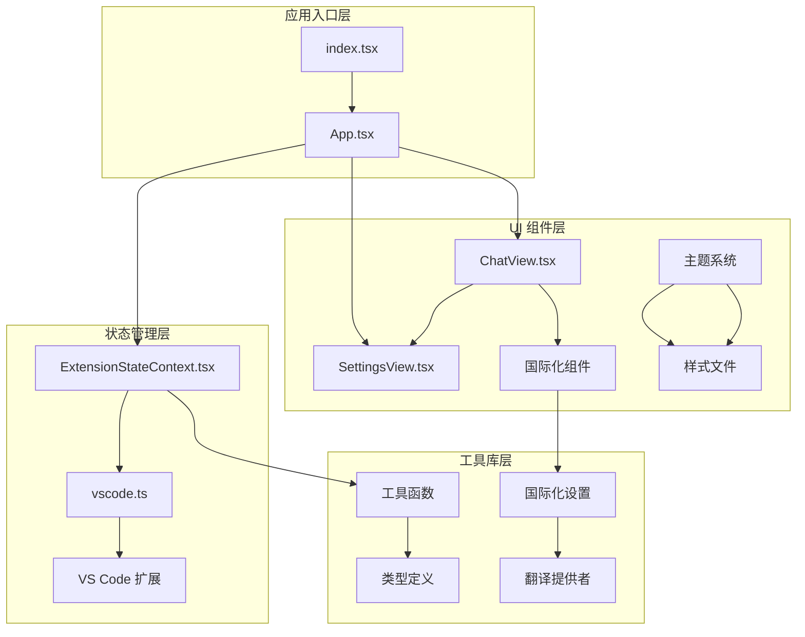
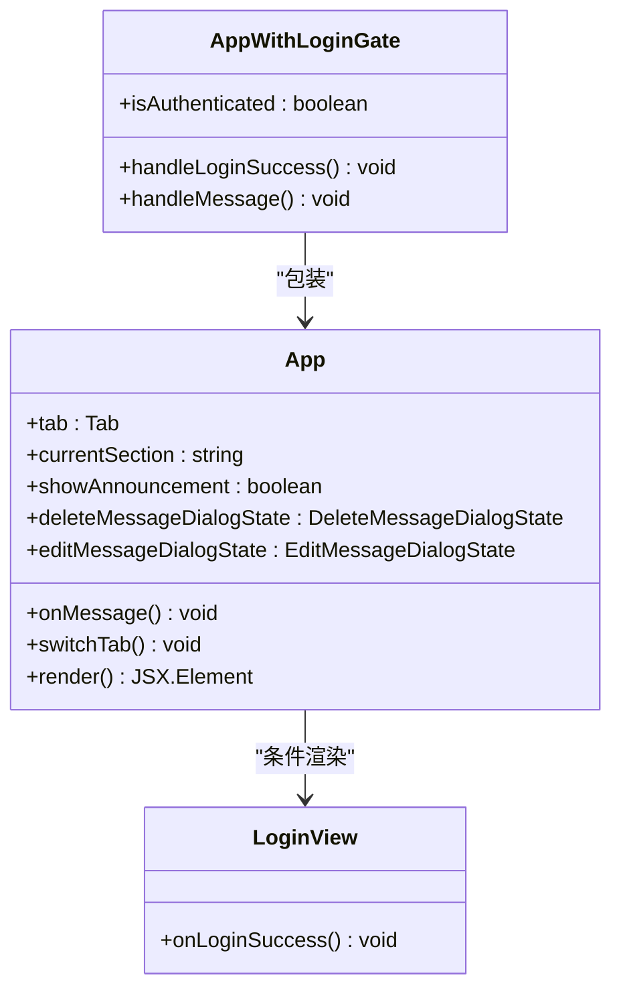
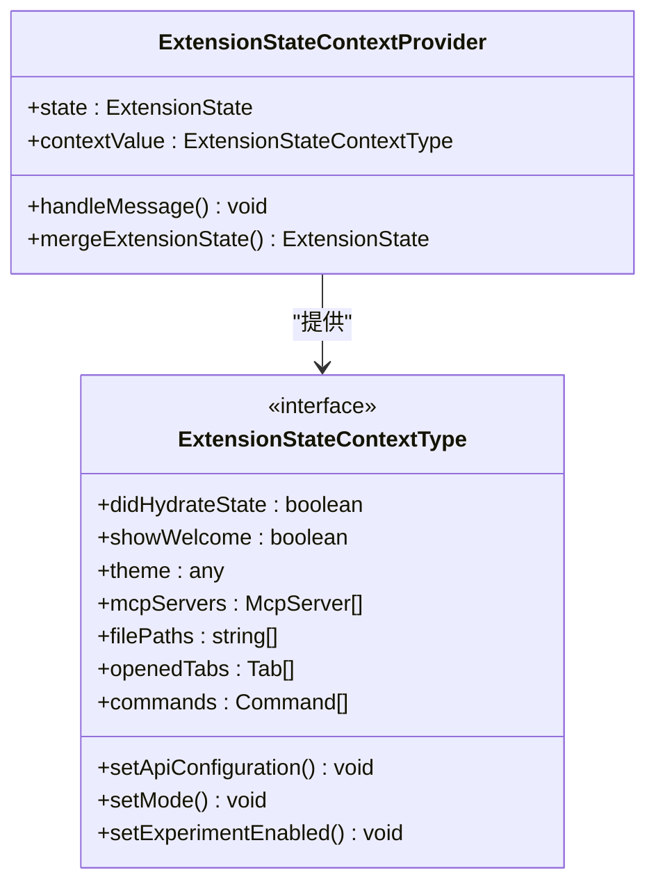
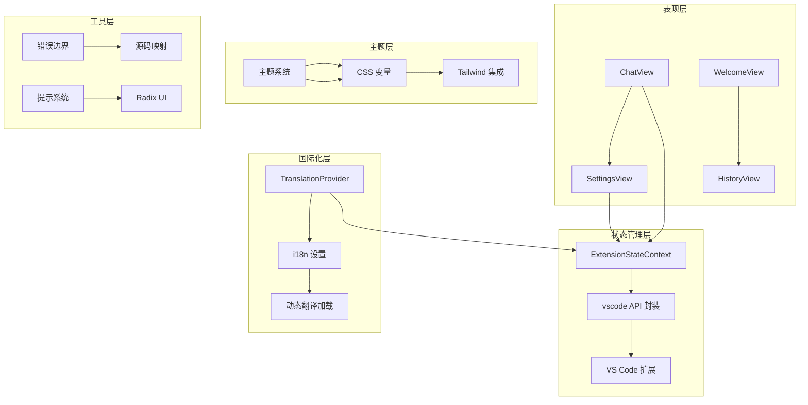
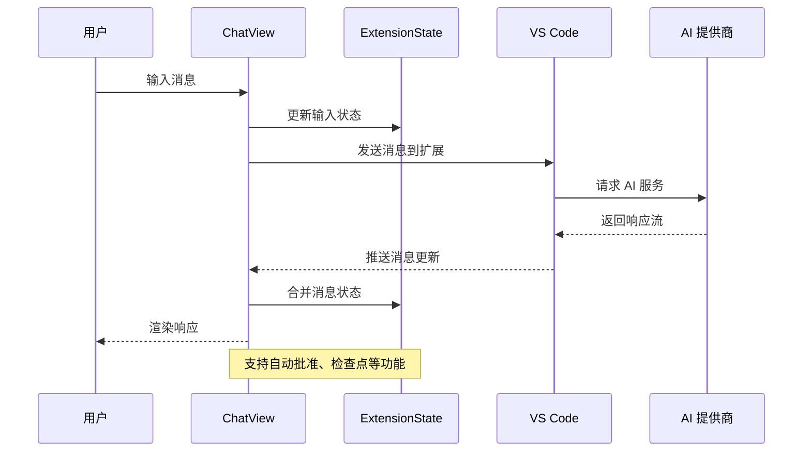
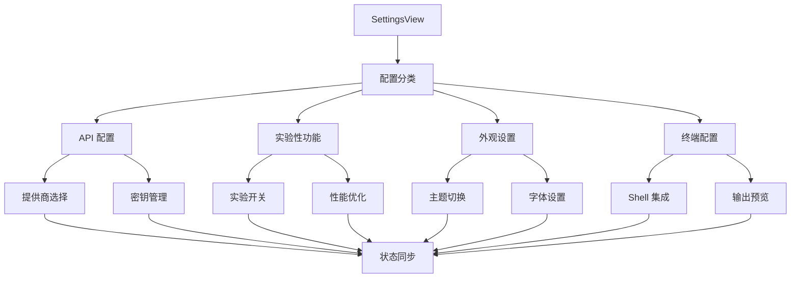
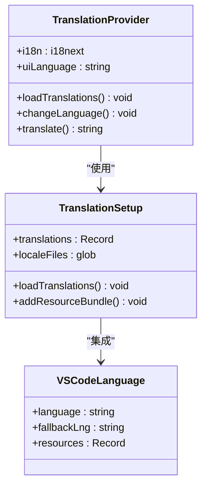
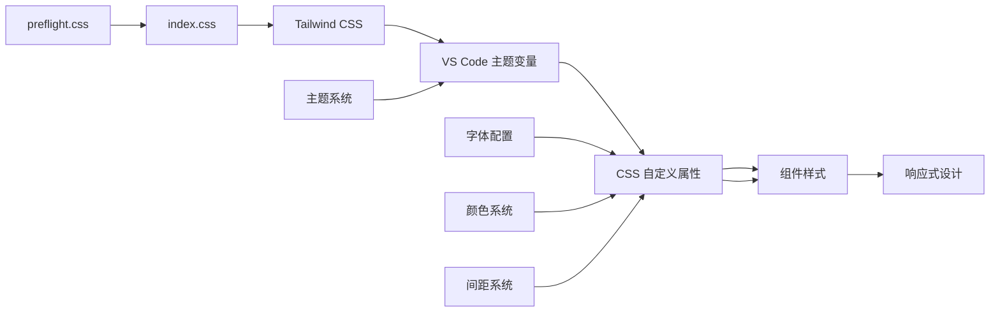
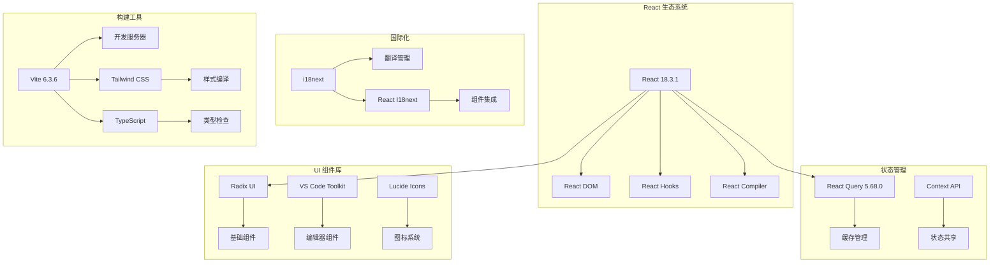

# React 应用架构

<cite>
**本文档引用的文件**
- [App.tsx](file://webview-ui/src/App.tsx)
- [index.tsx](file://webview-ui/src/index.tsx)
- [ExtensionStateContext.tsx](file://webview-ui/src/context/ExtensionStateContext.tsx)
- [TranslationContext.tsx](file://webview-ui/src/i18n/TranslationContext.tsx)
- [vscode.ts](file://webview-ui/src/utils/vscode.ts)
- [ChatView.tsx](file://webview-ui/src/components/chat/ChatView.tsx)
- [SettingsView.tsx](file://webview-ui/src/components/settings/SettingsView.tsx)
- [index.css](file://webview-ui/src/index.css)
- [preflight.css](file://webview-ui/src/preflight.css)
- [setup.ts](file://webview-ui/src/i18n/setup.ts)
- [tooltip.tsx](file://webview-ui/src/components/ui/tooltip.tsx)
- [package.json](file://webview-ui/package.json)
- [vite.config.ts](file://webview-ui/vite.config.ts)
- [types.d.ts](file://webview-ui/src/types.d.ts)
</cite>

## 目录
1. [简介](#简介)
2. [项目结构](#项目结构)
3. [核心组件](#核心组件)
4. [架构概览](#架构概览)
5. [详细组件分析](#详细组件分析)
6. [依赖关系分析](#依赖关系分析)
7. [性能考虑](#性能考虑)
8. [故障排除指南](#故障排除指南)
9. [结论](#结论)

## 简介

这是一个基于 React 的 VS Code 扩展 Webview 应用，专为 AI 辅助编程环境设计。该应用采用现代化的前端架构，集成了状态管理、国际化支持、主题系统和丰富的 UI 组件库。

## 项目结构

Webview 应用采用模块化架构，主要分为以下几个核心层次：

**图表来源**
- [index.tsx:1-18](file://webview-ui/src/index.tsx#L1-L18)
- [App.tsx:49-268](file://webview-ui/src/App.tsx#L49-L268)
- [ExtensionStateContext.tsx:185-585](file://webview-ui/src/context/ExtensionStateContext.tsx#L185-L585)

**章节来源**
- [package.json:1-111](file://webview-ui/package.json#L1-L111)
- [vite.config.ts:55-199](file://webview-ui/vite.config.ts#L55-L199)

## 核心组件

### 主应用组件 (App.tsx)

App.tsx 是整个应用的根组件，负责协调各个子组件和处理消息通信：

**图表来源**
- [App.tsx:292-331](file://webview-ui/src/App.tsx#L292-L331)
- [App.tsx:49-268](file://webview-ui/src/App.tsx#L49-L268)

应用的主要功能包括：
- **登录门控机制**：通过 `AppWithLoginGate` 实现认证状态管理
- **标签页切换**：支持聊天、设置、历史记录三个主要视图
- **消息通信**：处理来自 VS Code 扩展的消息事件
- **对话框管理**：处理消息删除和编辑确认对话框

**章节来源**
- [App.tsx:1-331](file://webview-ui/src/App.tsx#L1-L331)

### 扩展状态上下文 (ExtensionStateContext)

扩展状态上下文是应用的核心状态管理机制：

**图表来源**
- [ExtensionStateContext.tsx:32-140](file://webview-ui/src/context/ExtensionStateContext.tsx#L32-L140)
- [ExtensionStateContext.tsx:185-585](file://webview-ui/src/context/ExtensionStateContext.tsx#L185-L585)

状态上下文管理的关键特性：
- **完整状态模型**：包含 API 配置、任务历史、模式设置等
- **实时同步**：通过消息机制与 VS Code 扩展保持状态同步
- **类型安全**：完整的 TypeScript 类型定义确保类型安全

**章节来源**
- [ExtensionStateContext.tsx:1-585](file://webview-ui/src/context/ExtensionStateContext.tsx#L1-L585)

## 架构概览

应用采用分层架构设计，各层职责明确：

**图表来源**
- [App.tsx:316-327](file://webview-ui/src/App.tsx#L316-L327)
- [TranslationContext.tsx:34-75](file://webview-ui/src/i18n/TranslationContext.tsx#L34-L75)

## 详细组件分析

### 聊天视图 (ChatView)

聊天视图是应用的核心交互组件：

**图表来源**
- [ChatView.tsx:63-200](file://webview-ui/src/components/chat/ChatView.tsx#L63-L200)
- [ChatView.tsx:178-200](file://webview-ui/src/components/chat/ChatView.tsx#L178-L200)

聊天视图的关键功能：
- **实时消息流**：支持流式响应和增量更新
- **自动批准系统**：智能处理后续问题和工具调用
- **检查点管理**：支持任务状态保存和恢复
- **多媒体支持**：处理图片、代码块等富文本内容

**章节来源**
- [ChatView.tsx:1-200](file://webview-ui/src/components/chat/ChatView.tsx#L1-L200)

### 设置视图 (SettingsView)

设置视图提供全面的配置管理界面：

**图表来源**
- [SettingsView.tsx:124-200](file://webview-ui/src/components/settings/SettingsView.tsx#L124-L200)

设置视图的组织结构：
- **模块化设计**：按功能分类的多个设置面板
- **实时预览**：配置更改即时生效
- **搜索功能**：内置设置搜索和过滤
- **导入导出**：支持配置备份和迁移

**章节来源**
- [SettingsView.tsx:1-200](file://webview-ui/src/components/settings/SettingsView.tsx#L1-L200)

### 国际化支持

应用采用 i18next 进行国际化，支持多语言动态加载：

**图表来源**
- [TranslationContext.tsx:34-75](file://webview-ui/src/i18n/TranslationContext.tsx#L34-L75)
- [setup.ts:42-60](file://webview-ui/src/i18n/setup.ts#L42-L60)

国际化系统的特性：
- **动态加载**：运行时按需加载翻译资源
- **语言回退**：支持主语言和备用语言
- **类型安全**：完整的 TypeScript 类型定义
- **性能优化**：预加载关键翻译资源

**章节来源**
- [TranslationContext.tsx:1-81](file://webview-ui/src/i18n/TranslationContext.tsx#L1-L81)
- [setup.ts:1-60](file://webview-ui/src/i18n/setup.ts#L1-L60)

### 全局样式和主题配置

应用采用 Tailwind CSS 和 VS Code 主题集成：

**图表来源**
- [index.css:25-151](file://webview-ui/src/index.css#L25-L151)
- [preflight.css:1-384](file://webview-ui/src/preflight.css#L1-L384)

样式系统的架构：
- **主题继承**：直接继承 VS Code 编辑器主题
- **变量映射**：将 VS Code 颜色映射到 Tailwind 变量
- **预设重置**：自定义的 CSS 重置样式
- **响应式设计**：基于 VS Code 响应式断点

**章节来源**
- [index.css:1-200](file://webview-ui/src/index.css#L1-L200)
- [preflight.css:1-384](file://webview-ui/src/preflight.css#L1-L384)

## 依赖关系分析

应用的依赖关系呈现清晰的分层结构：

**图表来源**
- [package.json:17-86](file://webview-ui/package.json#L17-L86)
- [vite.config.ts:5-10](file://webview-ui/vite.config.ts#L5-L10)

**章节来源**
- [package.json:1-111](file://webview-ui/package.json#L1-L111)
- [vite.config.ts:55-199](file://webview-ui/vite.config.ts#L55-L199)

## 性能考虑

应用在多个层面进行了性能优化：

### 源码映射和调试支持
- **生产环境源码映射**：启用完整的源码映射支持
- **调试工具暴露**：在生产环境中暴露调试工具
- **错误追踪**：改进的错误报告和堆栈跟踪

### 组件优化策略
- **记忆化组件**：对重型对话框组件使用 React.memo
- **懒加载机制**：按需加载大型依赖（如 Mermaid）
- **虚拟滚动**：使用 React Virtuoso 处理大量消息

### 构建优化
- **代码分割**：智能的代码分割策略
- **外部化依赖**：vscode 模块外部化避免打包
- **压缩优化**：生产环境代码压缩和优化

## 故障排除指南

### 常见问题和解决方案

#### 登录认证问题
当遇到登录相关问题时，检查以下要点：
- 确认 `AppWithLoginGate` 组件正确处理认证状态
- 验证 `vscode.getState()` 和 `vscode.setState()` 的调用
- 检查消息监听器是否正确注册和清理

#### 状态同步问题
如果出现状态不同步：
- 确认 `ExtensionStateContextProvider` 正确处理消息事件
- 检查 `mergeExtensionState` 函数的状态合并逻辑
- 验证 `handleMessage` 函数的事件处理

#### 国际化问题
翻译资源加载失败时：
- 检查 `loadTranslations` 函数的资源加载
- 确认 i18n 文件的命名规范和路径
- 验证 `TranslationProvider` 的语言切换逻辑

**章节来源**
- [App.tsx:292-331](file://webview-ui/src/App.tsx#L292-L331)
- [ExtensionStateContext.tsx:297-440](file://webview-ui/src/context/ExtensionStateContext.tsx#L297-L440)
- [TranslationContext.tsx:44-54](file://webview-ui/src/i18n/TranslationContext.tsx#L44-L54)

## 结论

这个 React 应用架构展现了现代前端开发的最佳实践：

### 设计优势
- **模块化架构**：清晰的分层设计便于维护和扩展
- **类型安全**：完整的 TypeScript 支持确保代码质量
- **性能优化**：多层面的性能优化策略
- **用户体验**：流畅的交互和响应式设计

### 技术创新
- **VS Code 集成**：深度集成 VS Code 生态系统
- **国际化支持**：灵活的多语言解决方案
- **主题系统**：原生继承 VS Code 主题
- **状态管理**：高效的上下文状态管理

### 架构决策
应用采用了经过验证的架构模式，平衡了功能完整性、性能要求和可维护性。通过合理的依赖管理和模块化设计，为未来的功能扩展奠定了坚实基础。