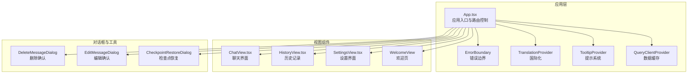
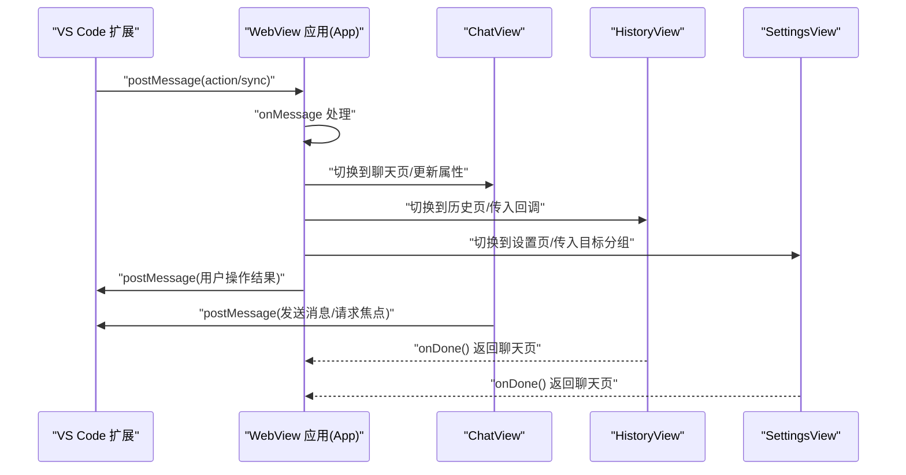
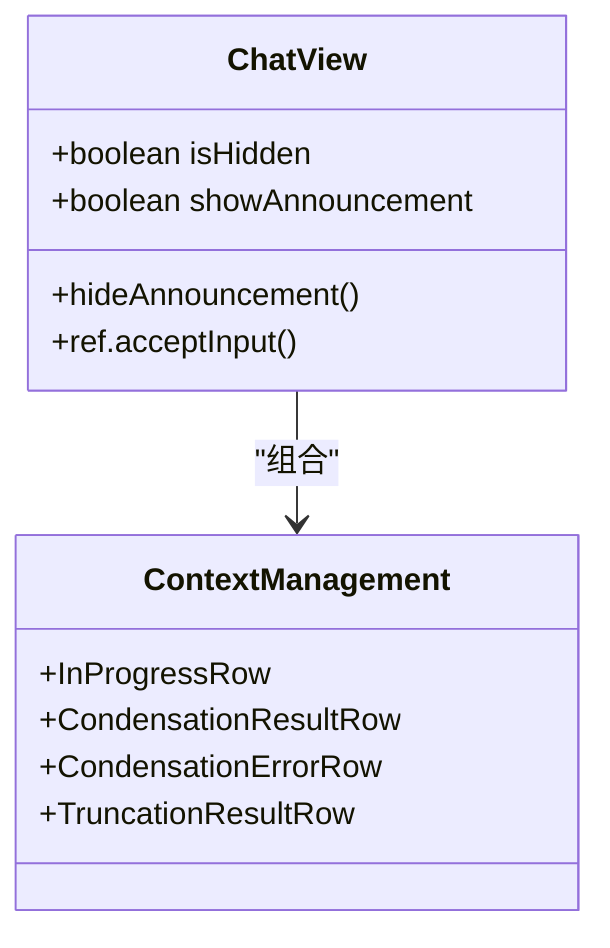
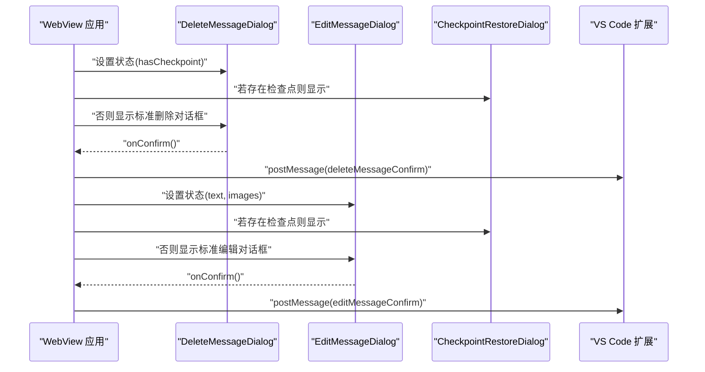
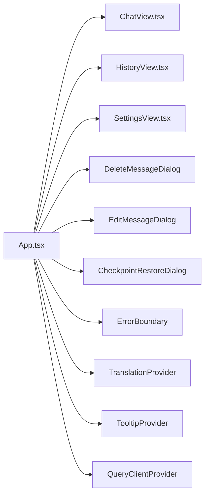

# UI 组件系统

<cite>
**本文档引用的文件**
- [App.tsx](file://webview-ui/src/App.tsx)
- [ChatView.tsx](file://webview-ui/src/components/chat/ChatView.tsx)
- [SettingsView.tsx](file://webview-ui/src/components/settings/SettingsView.tsx)
- [HistoryView.tsx](file://webview-ui/src/components/history/HistoryView.tsx)
- [index.ts](file://webview-ui/src/components/chat/context-management/index.ts)
- [useInputHistory.ts](file://apps/cli/src/ui/hooks/useInputHistory.ts)
- [ChatHistoryItem.tsx](file://apps/cli/src/ui/components/ChatHistoryItem.tsx)
</cite>

## 目录
1. [简介](#简介)
2. [项目结构](#项目结构)
3. [核心组件](#核心组件)
4. [架构总览](#架构总览)
5. [详细组件分析](#详细组件分析)
6. [依赖关系分析](#依赖关系分析)
7. [性能考虑](#性能考虑)
8. [故障排除指南](#故障排除指南)
9. [结论](#结论)
10. [附录](#附录)

## 简介
本文件为 UI 组件系统的开发文档，聚焦于聊天界面组件、通用组件、历史记录组件与设置组件的设计与实现。内容涵盖组件属性接口、事件处理、状态管理、样式定制、组件组合模式、可复用性设计以及组件间通信机制，并提供使用示例与最佳实践，同时解释响应式设计与可访问性实现。

## 项目结构
该 UI 系统位于 webview-ui 子项目中，采用 React + TypeScript 构建，通过 VS Code WebView 与扩展后端进行消息通信。应用入口负责路由切换、对话框状态管理、国际化与错误边界等横切关注点；核心组件包括聊天视图、历史记录视图与设置视图。

**图表来源**
- [App.tsx:1-331](file://webview-ui/src/App.tsx#L1-L331)

**章节来源**
- [App.tsx:1-331](file://webview-ui/src/App.tsx#L1-L331)

## 核心组件
本节概述四大核心组件：聊天界面、历史记录、设置与通用对话框组件。每个组件均具备清晰的职责边界与稳定的对外接口，支持状态提升与事件回调，便于组合与复用。

- 聊天界面组件（ChatView）
  - 负责渲染消息流、输入区域、上下文管理事件展示与用户交互。
  - 支持隐藏/显示控制、公告展示与焦点管理。
  - 提供 ref 接口以接收外部命令（如接受输入）。

- 历史记录组件（HistoryView）
  - 展示任务与消息的历史列表，支持返回聊天界面的回调。

- 设置组件（SettingsView）
  - 提供设置项编辑与保存逻辑，支持未保存更改检测与目标分组跳转。

- 对话框组件（Delete/Edit/CheckpointRestore）
  - 封装消息修改确认与检查点恢复流程，通过消息通道与扩展后端交互。

**章节来源**
- [App.tsx:193-267](file://webview-ui/src/App.tsx#L193-L267)
- [App.tsx:201-206](file://webview-ui/src/App.tsx#L201-L206)

## 架构总览
应用通过消息总线与 VS Code 扩展后端通信，实现跨进程的数据同步与指令下发。应用层负责状态聚合与路由切换，视图组件通过 props 与回调进行解耦，对话框组件通过 memo 化避免不必要重渲染。

**图表来源**
- [App.tsx:102-146](file://webview-ui/src/App.tsx#L102-L146)
- [App.tsx:197-206](file://webview-ui/src/App.tsx#L197-L206)

## 详细组件分析

### 聊天界面组件（ChatView）
- 属性接口
  - isHidden: 控制组件显隐
  - showAnnouncement: 是否展示公告
  - hideAnnouncement: 公告关闭回调
  - ref: 支持外部调用 acceptInput()

- 事件处理
  - 通过 ref 暴露方法，允许外部触发输入接受
  - 与扩展后端通过消息通道交互，支持焦点请求与输入接受

- 状态管理
  - 由应用层统一管理当前标签页与对话框状态
  - 避免在切换标签时卸载组件，保持输入状态与异步流程连续性

- 样式与主题
  - 通过全局字体族属性影响页面排版
  - 与 TooltipProvider、ErrorBoundary 等横切组件协作

- 组合模式与可复用性
  - 作为顶层容器，组合上下文管理行组件（见下节）
  - 通过 ref 与外部交互，降低耦合度

**图表来源**
- [ChatView.tsx](file://webview-ui/src/components/chat/ChatView.tsx)
- [index.ts:1-13](file://webview-ui/src/components/chat/context-management/index.ts#L1-L13)

**章节来源**
- [App.tsx:201-206](file://webview-ui/src/App.tsx#L201-L206)
- [index.ts:1-13](file://webview-ui/src/components/chat/context-management/index.ts#L1-L13)

### 历史记录组件（HistoryView）
- 属性接口
  - onDone: 返回聊天界面的回调函数

- 功能特性
  - 渲染历史列表，支持导航至聊天界面
  - 与应用层路由联动，确保状态一致性

- 使用示例路径
  - 在应用层通过条件渲染加载历史视图，并传入 onDone 回调

**章节来源**
- [App.tsx:197-197](file://webview-ui/src/App.tsx#L197-L197)
- [HistoryView.tsx](file://webview-ui/src/components/history/HistoryView.tsx)

### 设置组件（SettingsView）
- 属性接口
  - ref: 支持检查未保存更改的方法
  - onDone: 返回聊天界面的回调
  - targetSection: 目标设置分组（可选）

- 功能特性
  - 支持未保存更改检测与确认
  - 与应用层路由联动，确保设置页切换安全

- 使用示例路径
  - 应用层在切换到设置页前，先检查未保存更改，再执行切换

**章节来源**
- [App.tsx:84-98](file://webview-ui/src/App.tsx#L84-L98)
- [SettingsView.tsx](file://webview-ui/src/components/settings/SettingsView.tsx)

### 对话框组件（Delete/Edit/CheckpointRestore）
- 删除消息确认对话框
  - 属性：isOpen、onOpenChange、onConfirm
  - 行为：根据是否存在检查点选择标准删除或恢复后删除

- 编辑消息确认对话框
  - 属性：isOpen、onOpenChange、onConfirm(text, images?)
  - 行为：支持图片数组传递

- 检查点恢复对话框
  - 属性：open、type、hasCheckpoint、onOpenChange、onConfirm(restoreCheckpoint)
  - 行为：在存在检查点时提供恢复选项

**图表来源**
- [App.tsx:123-139](file://webview-ui/src/App.tsx#L123-L139)
- [App.tsx:207-265](file://webview-ui/src/App.tsx#L207-L265)

**章节来源**
- [App.tsx:70-82](file://webview-ui/src/App.tsx#L70-L82)
- [App.tsx:123-139](file://webview-ui/src/App.tsx#L123-L139)
- [App.tsx:207-265](file://webview-ui/src/App.tsx#L207-L265)

### 上下文管理 UI 组件（Context Management）
- InProgressRow：显示上下文压缩/截断进行中的状态
- CondensationResultRow：显示压缩结果
- CondensationErrorRow：显示压缩失败状态
- TruncationResultRow：显示截断结果

这些组件用于在聊天界面中可视化上下文管理事件，帮助用户理解 AI 如何优化上下文以减少 token 使用。

**章节来源**
- [index.ts:1-13](file://webview-ui/src/components/chat/context-management/index.ts#L1-L13)

### 通用组件与工具
- 输入历史钩子（useInputHistory）
  - 功能：维护输入历史、浏览历史、草稿状态与添加新条目
  - 适用场景：聊天输入框、命令输入等需要历史导航的场景
  - 关键行为：加载历史、上/下导航、添加新条目、重置浏览状态

- CLI 聊天历史项组件（ChatHistoryItem）
  - 功能：按角色渲染用户、助手、思考与工具输出
  - 特殊处理：对特定工具（如待办列表更新）进行全量展示
  - 适用场景：CLI 环境下的聊天历史展示

**章节来源**
- [useInputHistory.ts:1-127](file://apps/cli/src/ui/hooks/useInputHistory.ts#L1-L127)
- [ChatHistoryItem.tsx:170-220](file://apps/cli/src/ui/components/ChatHistoryItem.tsx#L170-L220)

## 依赖关系分析
- 组件耦合与内聚
  - 应用层承担路由与状态聚合，各视图组件保持低耦合、高内聚
  - 对话框组件通过 memo 化减少重渲染，提升性能

- 外部依赖与集成点
  - VS Code WebView API：消息通信、状态持久化
  - 国际化与主题：通过 Provider 注入
  - 错误边界：统一捕获与降级

**图表来源**
- [App.tsx:1-331](file://webview-ui/src/App.tsx#L1-L331)

**章节来源**
- [App.tsx:1-331](file://webview-ui/src/App.tsx#L1-L331)

## 性能考虑
- 组件重渲染优化
  - 对话框组件使用 React.memo 防止不必要的重渲染
  - 应用层通过 useRef 保存视图引用，避免在切换标签时卸载组件

- 数据获取与缓存
  - 使用 QueryClientProvider 进行数据缓存与去重，减少重复请求

- 事件处理
  - 使用 useCallback 包裹回调，降低子组件重渲染频率

**章节来源**
- [App.tsx:39-42](file://webview-ui/src/App.tsx#L39-L42)
- [App.tsx:87-98](file://webview-ui/src/App.tsx#L87-L98)
- [App.tsx:270-270](file://webview-ui/src/App.tsx#L270-L270)

## 故障排除指南
- 消息通信问题
  - 确认应用已发送 webviewDidLaunch 消息，以便扩展侧识别 WebView 已就绪
  - 检查消息类型与字段是否匹配（如 action、switchTab、showDeleteMessageDialog 等）

- 对话框状态异常
  - 确保 isOpen 状态与 onOpenChange 回调成对出现
  - 在存在检查点时优先显示 CheckpointRestoreDialog

- 设置页切换冲突
  - 在切换设置页前调用 ref.checkUnsaveChanges，确保未保存更改被确认

- 输入焦点问题
  - 在非侧边栏模式下，点击非交互内容会请求焦点；确认 renderContext 正确传递

**章节来源**
- [App.tsx:159-160](file://webview-ui/src/App.tsx#L159-L160)
- [App.tsx:102-146](file://webview-ui/src/App.tsx#L102-L146)
- [App.tsx:207-265](file://webview-ui/src/App.tsx#L207-L265)
- [App.tsx:176-184](file://webview-ui/src/App.tsx#L176-L184)

## 结论
本 UI 组件系统通过清晰的职责划分、稳定的消息通信机制与良好的状态管理模式，实现了聊天、历史、设置等核心功能的模块化与可复用性。结合对话框组件与上下文管理 UI，系统在复杂交互场景下仍保持一致的用户体验。建议在后续迭代中进一步完善可访问性与响应式设计细节，以覆盖更多设备与使用场景。

## 附录
- 使用示例与最佳实践
  - 聊天界面：通过 ref 调用 acceptInput() 接受外部输入；在切换标签时保留组件实例
  - 历史记录：在 onDone 中返回聊天界面，确保状态一致
  - 设置：在切换前检查未保存更改，避免数据丢失
  - 对话框：根据是否有检查点选择标准或恢复型对话框；确认 onConfirm 的参数传递

- 可访问性与响应式设计
  - 建议为按钮与输入框提供语义化标签与键盘导航支持
  - 为不同屏幕尺寸提供合适的布局与字体缩放策略
  - 为颜色对比度不足的场景提供替代方案（如图标+文本）