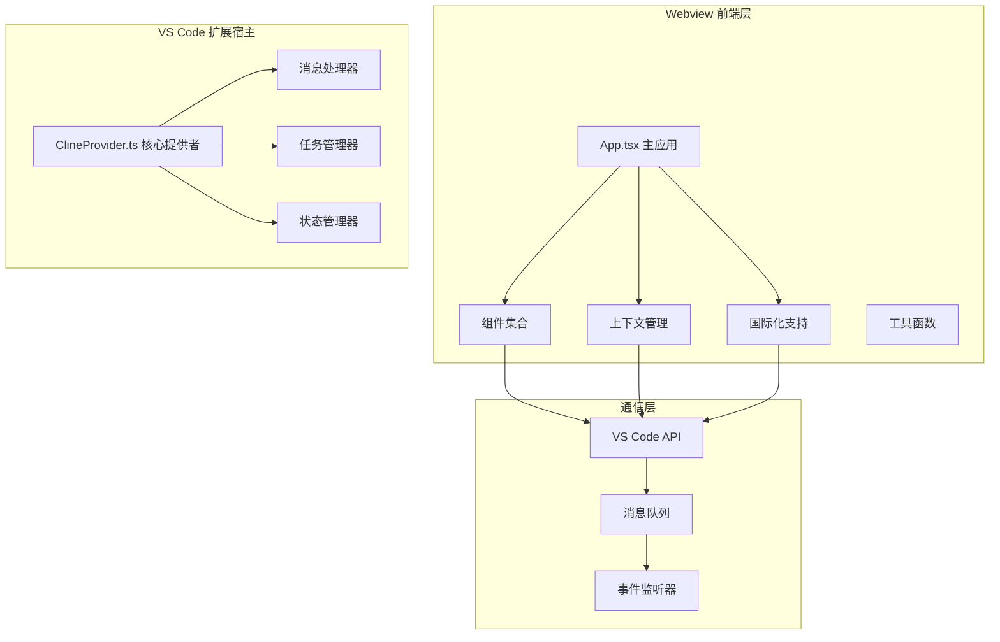
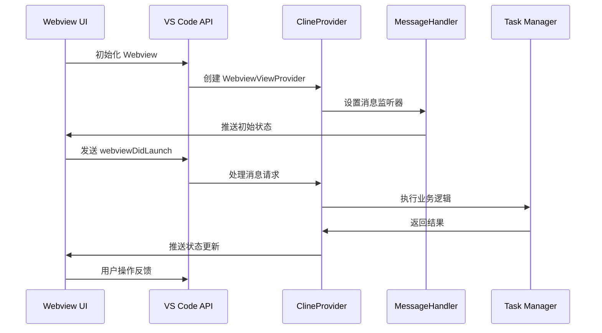
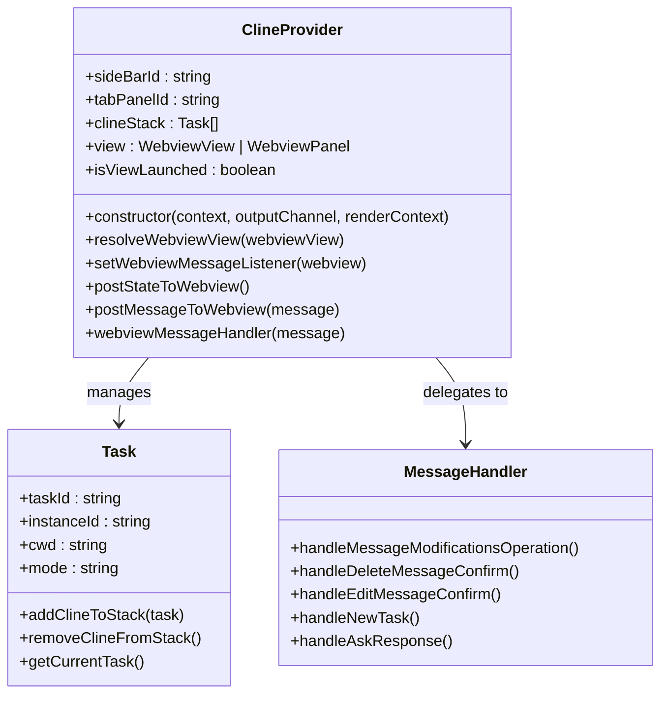
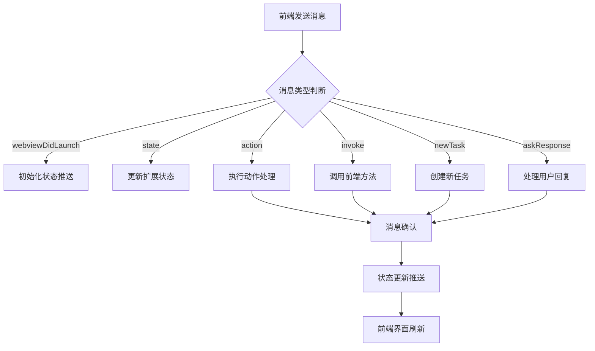
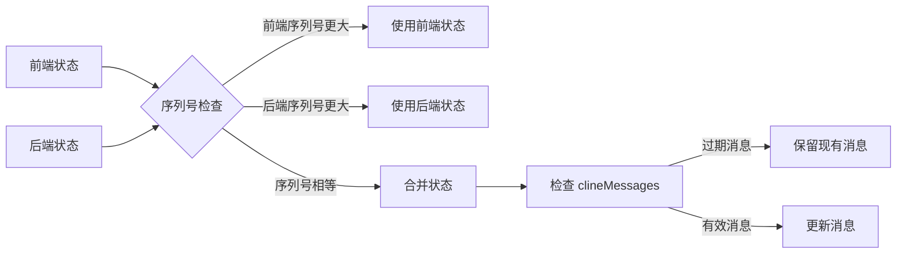
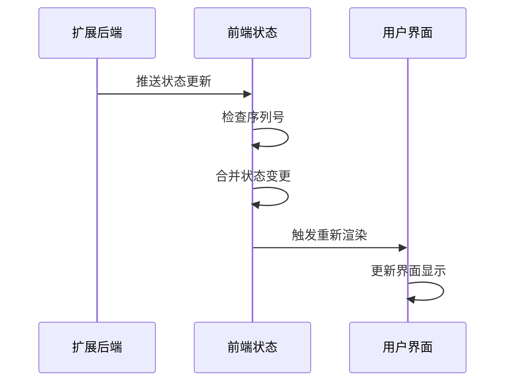
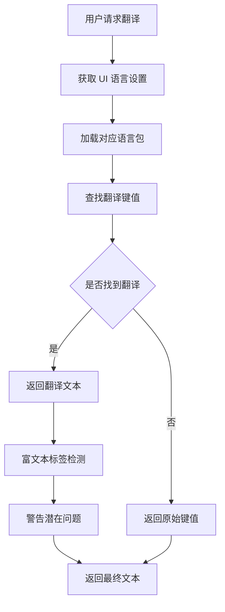
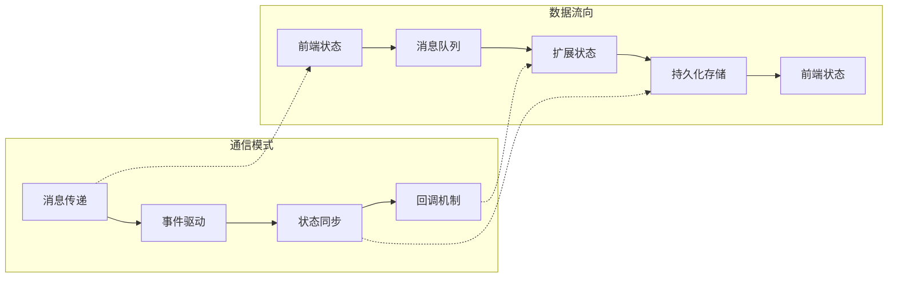

# Webview 界面开发

<cite>
**本文档引用的文件**
- [App.tsx](file://webview-ui/src/App.tsx)
- [index.tsx](file://webview-ui/src/index.tsx)
- [ClineProvider.ts](file://src/core/webview/ClineProvider.ts)
- [webviewMessageHandler.ts](file://src/core/webview/webviewMessageHandler.ts)
- [ExtensionStateContext.tsx](file://webview-ui/src/context/ExtensionStateContext.tsx)
- [vscode.ts](file://webview-ui/src/utils/vscode.ts)
- [TranslationContext.tsx](file://webview-ui/src/i18n/TranslationContext.tsx)
- [package.json](file://webview-ui/package.json)
</cite>

## 目录
1. [简介](#简介)
2. [项目结构](#项目结构)
3. [核心组件](#核心组件)
4. [架构概览](#架构概览)
5. [详细组件分析](#详细组件分析)
6. [依赖关系分析](#依赖关系分析)
7. [性能考虑](#性能考虑)
8. [故障排除指南](#故障排除指南)
9. [结论](#结论)

## 简介

本项目是一个基于 React 的 VS Code 扩展 Webview 界面开发文档。该界面作为 VS Code 扩展的用户交互层，提供了聊天对话、历史记录、设置管理等功能。系统采用双向消息通信机制，通过 VS Code 的 Webview API 实现前端与扩展宿主之间的数据交换。

## 项目结构

Webview 界面采用模块化架构，主要分为以下几个核心部分：



**图表来源**
- [App.tsx:1-331](file://webview-ui/src/App.tsx#L1-L331)
- [ClineProvider.ts:126-800](file://src/core/webview/ClineProvider.ts#L126-L800)

**章节来源**
- [App.tsx:1-331](file://webview-ui/src/App.tsx#L1-L331)
- [package.json:1-111](file://webview-ui/package.json#L1-L111)

## 核心组件

### 应用入口点

应用入口点负责初始化整个 Webview 界面，包括状态管理、国际化支持和错误边界处理。

**章节来源**
- [index.tsx:1-18](file://webview-ui/src/index.tsx#L1-L18)

### 主应用组件 (App)

主应用组件是整个界面的核心控制器，负责：

- **状态管理**: 管理应用级别的状态，包括标签页切换、对话框状态等
- **消息处理**: 处理来自扩展宿主的消息，实现双向通信
- **视图渲染**: 根据状态动态渲染不同的视图组件
- **性能优化**: 使用 React.memo 和 useCallback 优化渲染性能

**章节来源**
- [App.tsx:49-268](file://webview-ui/src/App.tsx#L49-L268)

### 扩展状态上下文 (ExtensionStateContext)

扩展状态上下文提供全局状态管理，包括：

- **状态合并策略**: 实现智能的状态合并，防止过期状态覆盖
- **序列号保护**: 使用单调递增序列号防止状态更新乱序
- **实时状态同步**: 监听扩展宿主推送的状态变化
- **类型安全**: 提供完整的 TypeScript 类型定义

**章节来源**
- [ExtensionStateContext.tsx:185-574](file://webview-ui/src/context/ExtensionStateContext.tsx#L185-L574)

## 架构概览

系统采用分层架构设计，实现了清晰的关注点分离：



**图表来源**
- [ClineProvider.ts:730-800](file://src/core/webview/ClineProvider.ts#L730-L800)
- [webviewMessageHandler.ts:81-595](file://src/core/webview/webviewMessageHandler.ts#L81-L595)

## 详细组件分析

### ClineProvider 核心提供者

ClineProvider 是扩展宿主的核心类，实现了 VS Code 的 WebviewViewProvider 接口：

#### 主要职责

- **Webview 生命周期管理**: 负责 Webview 的创建、销毁和资源清理
- **消息路由**: 将前端发送的消息转发到相应的处理函数
- **状态推送**: 将扩展状态推送到前端界面
- **任务协调**: 管理多个并发任务的生命周期

#### 关键特性



**图表来源**
- [ClineProvider.ts:126-312](file://src/core/webview/ClineProvider.ts#L126-L312)
- [ClineProvider.ts:490-554](file://src/core/webview/ClineProvider.ts#L490-L554)

**章节来源**
- [ClineProvider.ts:126-800](file://src/core/webview/ClineProvider.ts#L126-L800)

### 消息处理机制

消息处理机制实现了前端与扩展宿主之间的双向通信：

#### 消息类型分类

| 消息类型 | 描述 | 用途 |
|---------|------|------|
| `webviewDidLaunch` | Webview 启动通知 | 初始化状态同步 |
| `state` | 状态更新 | 推送扩展状态到前端 |
| `action` | 动作触发 | 处理用户交互事件 |
| `invoke` | 方法调用 | 触发前端特定功能 |
| `newTask` | 新任务创建 | 启动新的对话任务 |

#### 消息处理流程



**图表来源**
- [webviewMessageHandler.ts:522-800](file://src/core/webview/webviewMessageHandler.ts#L522-L800)

**章节来源**
- [webviewMessageHandler.ts:81-800](file://src/core/webview/webviewMessageHandler.ts#L81-L800)

### 状态管理系统

状态管理系统实现了复杂的状态同步机制：

#### 状态合并策略



**图表来源**
- [ExtensionStateContext.tsx:144-183](file://webview-ui/src/context/ExtensionStateContext.tsx#L144-L183)

#### 状态更新流程



**图表来源**
- [ExtensionStateContext.tsx:297-440](file://webview-ui/src/context/ExtensionStateContext.tsx#L297-L440)

**章节来源**
- [ExtensionStateContext.tsx:144-440](file://webview-ui/src/context/ExtensionStateContext.tsx#L144-L440)

### 国际化支持

国际化系统提供了完整的多语言支持：

#### 翻译流程



**图表来源**
- [TranslationContext.tsx:56-75](file://webview-ui/src/i18n/TranslationContext.tsx#L56-L75)

**章节来源**
- [TranslationContext.tsx:1-81](file://webview-ui/src/i18n/TranslationContext.tsx#L1-L81)

## 依赖关系分析

### 核心依赖关系

```mermaid
graph TB
subgraph "前端依赖"
A[React 18.3.1]
B[React DOM 18.3.1]
C[@tanstack/react-query 5.68.0]
D[react-i18next 15.4.1]
E[vscode-webview-ui-toolkit 1.4.0]
end
subgraph "VS Code 扩展依赖"
F[VS Code API]
G[Webview API]
H[Extension Context]
I[Output Channel]
end
subgraph "第三方库"
J[axios 1.12.0]
K[shiki 3.2.1]
L[mermaid 11.4.1]
M[styled-components 6.1.13]
end
A --> F
C --> F
D --> F
F --> G
G --> H
H --> I
J --> F
K --> A
L --> A
M --> A
```

**图表来源**
- [package.json:17-86](file://webview-ui/package.json#L17-L86)

### 组件间通信



**图表来源**
- [vscode.ts:14-81](file://webview-ui/src/utils/vscode.ts#L14-L81)

**章节来源**
- [package.json:1-111](file://webview-ui/package.json#L1-L111)

## 性能考虑

### 渲染优化

1. **组件记忆化**: 使用 React.memo 防止不必要的重渲染
2. **状态提升**: 将共享状态提升到父组件，减少重复计算
3. **懒加载**: 对重型组件实现按需加载
4. **虚拟滚动**: 对长列表实现虚拟化处理

### 内存管理

1. **资源清理**: 实现完整的资源清理机制
2. **事件监听器**: 确保所有事件监听器都能正确移除
3. **定时器管理**: 防止内存泄漏的定时器清理
4. **缓存策略**: 合理的缓存大小控制和自动清理

### 网络优化

1. **请求去重**: 避免重复的网络请求
2. **批量处理**: 将多个小请求合并为批量请求
3. **超时控制**: 实现合理的请求超时机制
4. **错误重试**: 智能的错误重试策略

## 故障排除指南

### 常见问题诊断

#### Webview 无法启动

**症状**: Webview 显示空白或加载失败

**排查步骤**:
1. 检查 VS Code 版本兼容性
2. 验证 Webview 配置选项
3. 查看扩展激活日志
4. 确认资源路径正确性

#### 消息通信异常

**症状**: 前端无法接收扩展状态更新

**排查步骤**:
1. 验证消息序列号机制
2. 检查状态合并逻辑
3. 确认事件监听器注册
4. 查看网络连接状态

#### 性能问题

**症状**: 界面响应缓慢或内存占用过高

**排查步骤**:
1. 分析组件渲染性能
2. 检查内存泄漏情况
3. 优化状态更新频率
4. 实施适当的缓存策略

### 调试技巧

1. **开发工具**: 使用浏览器开发者工具进行调试
2. **日志记录**: 实现详细的日志记录机制
3. **断点调试**: 在关键节点设置断点
4. **性能分析**: 定期进行性能基准测试

**章节来源**
- [vscode.ts:14-81](file://webview-ui/src/utils/vscode.ts#L14-L81)

## 结论

本 Webview 界面开发文档详细介绍了基于 React 的 VS Code 扩展界面架构设计。系统采用了模块化、分层的设计模式，实现了高效的状态管理和双向通信机制。

### 主要优势

1. **架构清晰**: 分层设计使得代码结构清晰，易于维护
2. **性能优化**: 实现了多种性能优化策略，确保流畅的用户体验
3. **扩展性强**: 模块化设计便于功能扩展和定制
4. **类型安全**: 完整的 TypeScript 支持保证了代码质量

### 最佳实践建议

1. **遵循现有架构模式**: 保持与现有组件结构的一致性
2. **重视性能优化**: 持续关注和优化界面性能
3. **完善错误处理**: 实现健壮的错误处理和恢复机制
4. **加强测试覆盖**: 建立完善的测试体系确保代码质量

通过遵循这些指导原则和最佳实践，可以确保 Webview 界面的稳定性和可维护性，为用户提供优秀的开发体验。