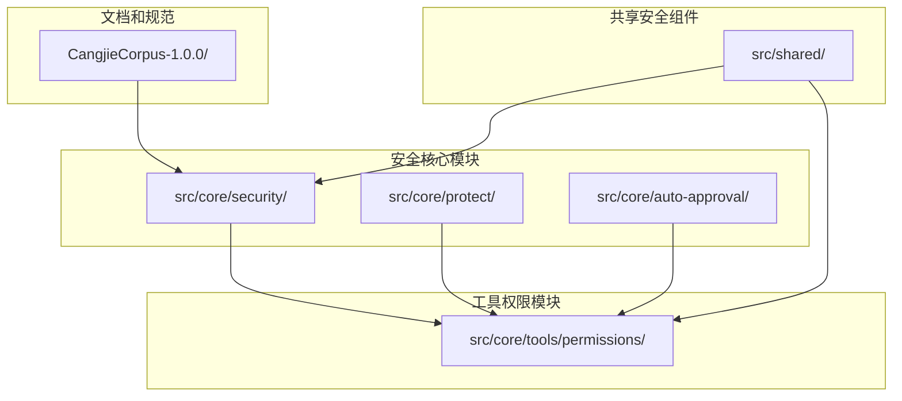
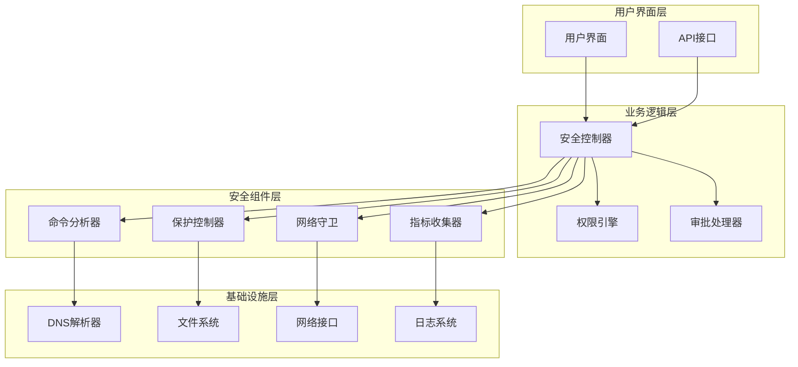
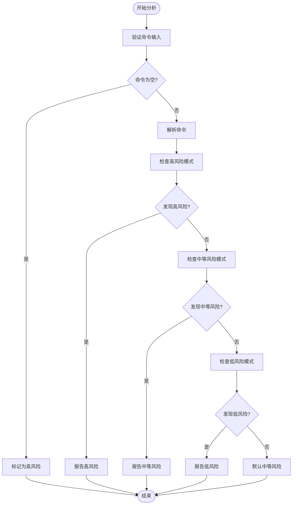
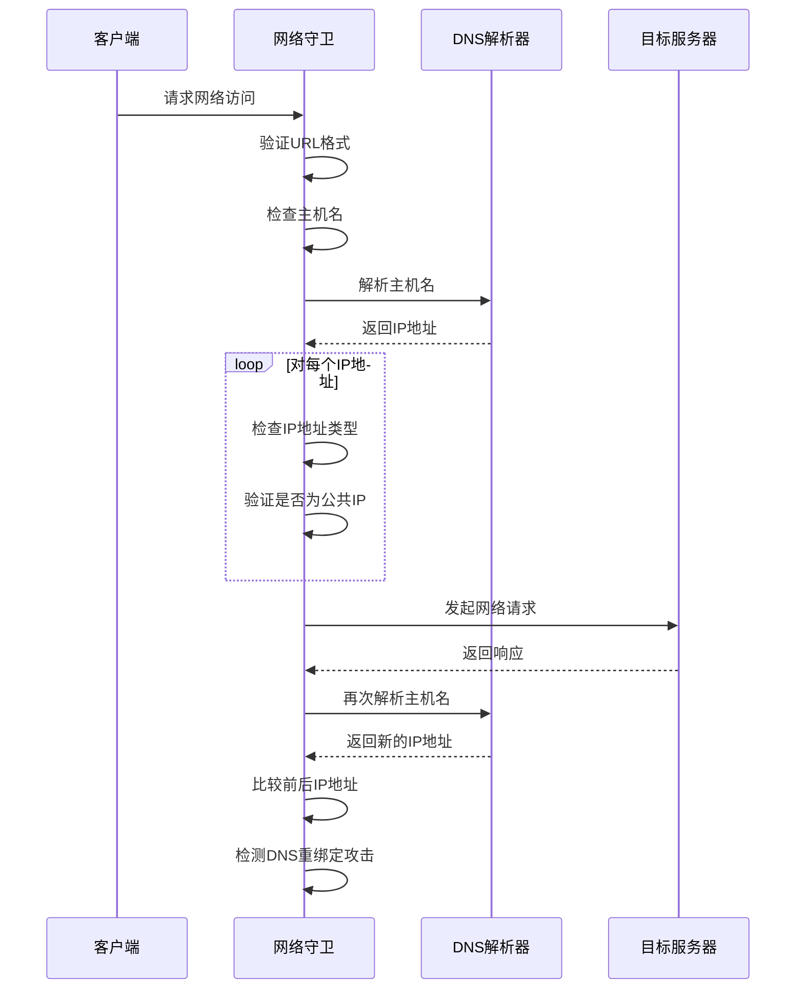
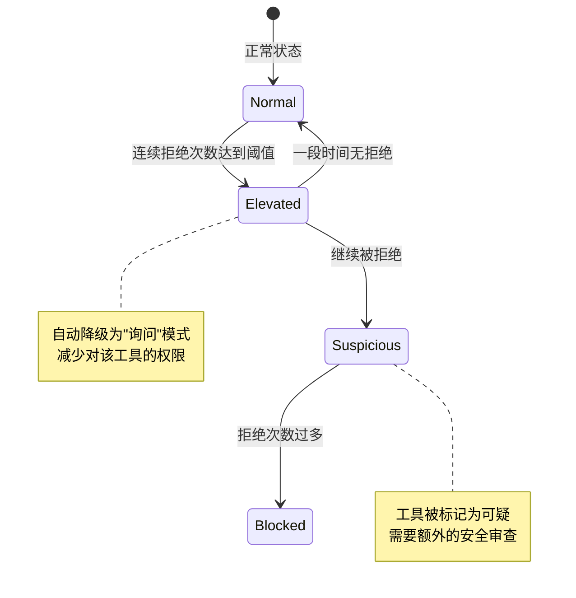
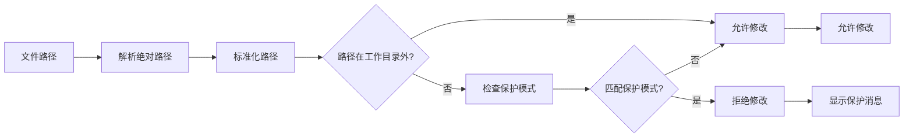
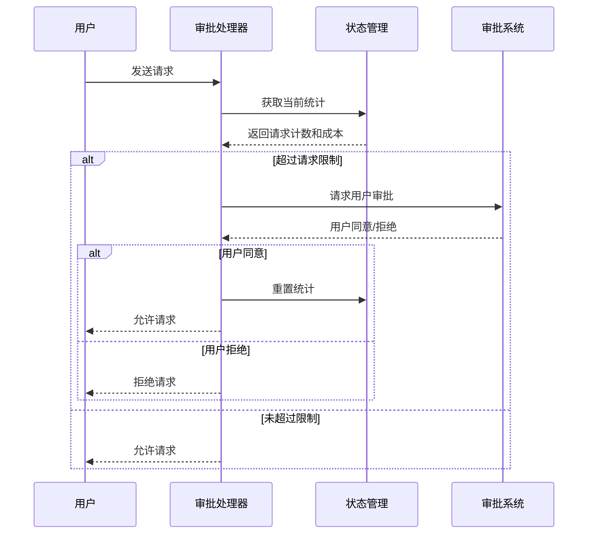
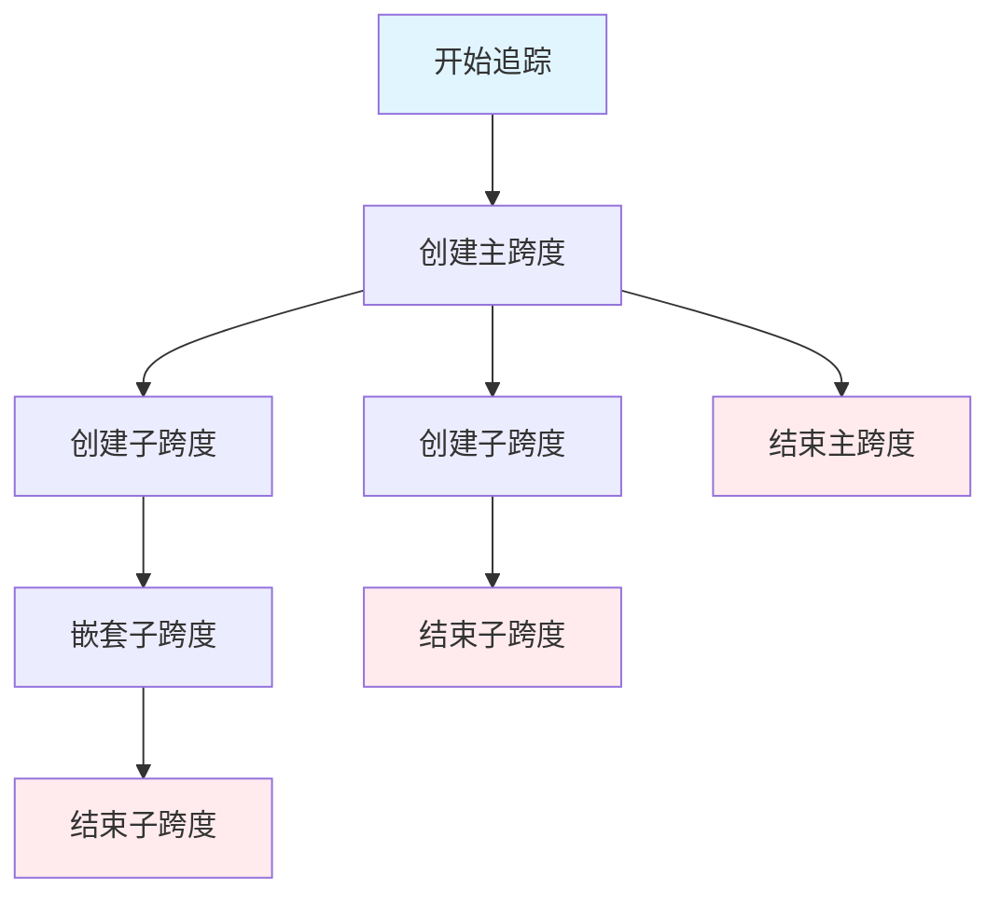
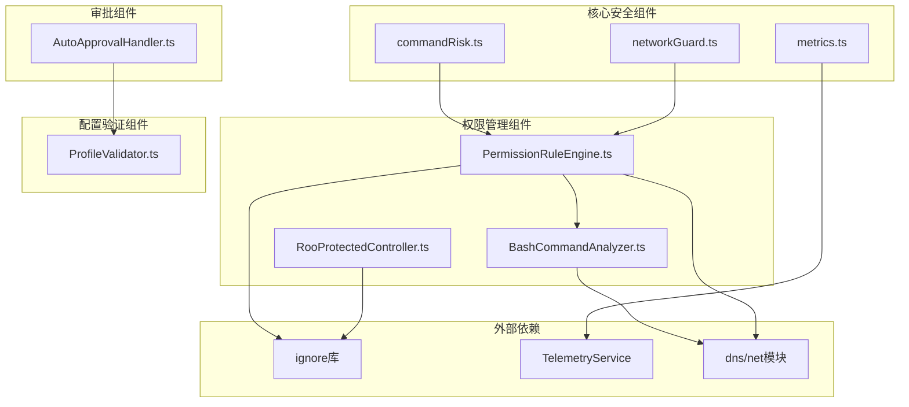

# 安全增强套件

<cite>
**本文档引用的文件**
- [SECURITY.md](file://SECURITY.md)
- [commandRisk.ts](file://src/core/security/commandRisk.ts)
- [networkGuard.ts](file://src/core/security/networkGuard.ts)
- [metrics.ts](file://src/core/security/metrics.ts)
- [RooProtectedController.ts](file://src/core/protect/RooProtectedController.ts)
- [AutoApprovalHandler.ts](file://src/core/auto-approval/AutoApprovalHandler.ts)
- [PermissionRuleEngine.ts](file://src/core/tools/permissions/PermissionRuleEngine.ts)
- [BashCommandAnalyzer.ts](file://src/core/tools/permissions/BashCommandAnalyzer.ts)
- [ProfileValidator.ts](file://src/shared/ProfileValidator.ts)
- [cj-permissions-for-system-apps.md](file://CangjieCorpus-1.0.0/ohos/zh-cn/application-dev/security/AccessToken/cj-permissions-for-system-apps.md)
- [cj-access-control-by-device-and-data-level.md](file://CangjieCorpus-1.0.0/ohos/zh-cn/application-dev/database/cj-access-control-by-device-and-data-level.md)
- [cj-apis-security_huks.md](file://CangjieCorpus-1.0.0/ohos/zh-cn/application-dev/reference/UniversalKeystoreKit/cj-apis-security_huks.md)
- [cjlint_manual.md](file://CangjieCorpus-1.0.0/tools/source_zh_cn/tools/cjlint_manual.md)
</cite>

## 目录
1. [简介](#简介)
2. [项目结构](#项目结构)
3. [核心组件](#核心组件)
4. [架构概览](#架构概览)
5. [详细组件分析](#详细组件分析)
6. [依赖关系分析](#依赖关系分析)
7. [性能考虑](#性能考虑)
8. [故障排除指南](#故障排除指南)
9. [结论](#结论)

## 简介

安全增强套件是Roo Code项目中的一个综合性安全防护系统，旨在为AI代理提供多层次、全方位的安全保护。该套件集成了命令风险评估、网络访问控制、权限管理、配置文件保护、遥测监控等多个安全组件，形成了一个完整的安全防护体系。

本套件特别针对AI代理可能面临的各种安全威胁，包括恶意命令执行、网络攻击、权限滥用、配置文件篡改等，提供了从预防到检测再到响应的完整解决方案。

## 项目结构

安全增强套件主要分布在以下目录结构中：



**图表来源**
- [commandRisk.ts:1-76](file://src/core/security/commandRisk.ts#L1-L76)
- [networkGuard.ts:1-126](file://src/core/security/networkGuard.ts#L1-L126)
- [PermissionRuleEngine.ts:1-523](file://src/core/tools/permissions/PermissionRuleEngine.ts#L1-L523)

**章节来源**
- [commandRisk.ts:1-76](file://src/core/security/commandRisk.ts#L1-L76)
- [networkGuard.ts:1-126](file://src/core/security/networkGuard.ts#L1-L126)
- [PermissionRuleEngine.ts:1-523](file://src/core/tools/permissions/PermissionRuleEngine.ts#L1-L523)

## 核心组件

### 命令风险评估系统

命令风险评估系统通过对shell命令进行深度分析，识别潜在的安全威胁。系统采用多维度的风险评估模型，包括破坏性模式、危险模式、网络操作、特权提升、敏感文件访问等。

### 网络访问控制系统

网络访问控制系统确保所有出站网络请求都经过安全验证，防止本地主机名解析、私有IP地址访问和DNS重绑定攻击等网络威胁。

### 权限规则引擎

权限规则引擎是一个高度可配置的权限管理系统，支持多种权限模式（默认、自动、绕过、询问），并提供插件化的分类器链支持。

### 配置文件保护器

配置文件保护器专门保护Roo项目的配置文件，防止未经授权的修改，确保项目配置的安全性和完整性。

### 自动审批处理器

自动审批处理器管理用户的自动审批限制，防止AI代理在超出设定阈值后继续执行操作。

**章节来源**
- [commandRisk.ts:1-76](file://src/core/security/commandRisk.ts#L1-L76)
- [networkGuard.ts:1-126](file://src/core/security/networkGuard.ts#L1-L126)
- [PermissionRuleEngine.ts:1-523](file://src/core/tools/permissions/PermissionRuleEngine.ts#L1-L523)
- [RooProtectedController.ts:1-113](file://src/core/protect/RooProtectedController.ts#L1-L113)
- [AutoApprovalHandler.ts:1-156](file://src/core/auto-approval/AutoApprovalHandler.ts#L1-L156)

## 架构概览

安全增强套件采用分层架构设计，各组件之间通过清晰的接口进行交互：



**图表来源**
- [PermissionRuleEngine.ts:82-112](file://src/core/tools/permissions/PermissionRuleEngine.ts#L82-L112)
- [networkGuard.ts:65-95](file://src/core/security/networkGuard.ts#L65-L95)
- [RooProtectedController.ts:10-33](file://src/core/protect/RooProtectedController.ts#L10-L33)

## 详细组件分析

### 命令风险评估组件

命令风险评估组件是安全套件的核心，负责分析用户输入的shell命令并评估其安全性。

#### 风险等级定义

系统定义了四个风险等级：
- **低风险**：读取操作，如`git status`、`ls`等
- **中等风险**：可能有破坏性的操作，如`npm install`、`git push`
- **高风险**：具有破坏性的操作，如`rm -rf`、`format`
- **禁止**：绝对危险的操作，如fork炸弹、直接磁盘写入

#### 分析算法流程



**图表来源**
- [commandRisk.ts:33-75](file://src/core/security/commandRisk.ts#L33-L75)

**章节来源**
- [commandRisk.ts:1-76](file://src/core/security/commandRisk.ts#L1-L76)

### 网络访问控制组件

网络访问控制组件确保所有网络请求都经过严格的安全检查，防止各种网络攻击。

#### 安全检查流程



**图表来源**
- [networkGuard.ts:97-125](file://src/core/security/networkGuard.ts#L97-L125)

#### IP地址验证规则

系统实现了严格的IP地址验证规则：

| IP类型 | 验证规则 | 示例 |
|--------|----------|------|
| IPv4私有地址 | 10.0.0.0/8, 172.16.0.0/12, 192.168.0.0/16 | 192.168.1.1, 10.0.0.1 |
| IPv4环回地址 | 127.0.0.0/8 | 127.0.0.1 |
| IPv4零地址 | 0.0.0.0/8 | 0.0.0.0 |
| IPv4链路本地 | 169.254.0.0/16 | 169.254.1.1 |
| IPv4多播 | 224.0.0.0/4 | 239.255.255.250 |
| IPv6环回地址 | ::1 | ::1 |
| IPv6链路本地 | fe80::/10 | fe80::1 |
| IPv6唯一本地 | fc00::/7 | fd12:3456:789a:1::1 |

**章节来源**
- [networkGuard.ts:1-126](file://src/core/security/networkGuard.ts#L1-L126)

### 权限规则引擎

权限规则引擎是一个复杂的权限管理系统，支持多种权限模式和动态决策。

#### 权限模式

系统支持四种权限模式：

| 模式 | 描述 | 行为 |
|------|------|------|
| 默认模式 | 标准权限检查 | 严格遵循规则和分类器 |
| 自动模式 | 自动批准只读操作 | 只读操作自动通过，写操作需要确认 |
| 绕过模式 | 完全放行 | 所有操作自动通过（危险模式） |
| 询问模式 | 所有操作都需要确认 | 无论什么操作都需要人工确认 |

#### 分类器链架构

```mermaid
classDiagram
class PermissionRuleEngine {
-rules : PermissionRule[]
-mode : PermissionMode
-classifiers : ClassifierStrategy[]
-denialTracker : Map~string, DenialRecord~
+evaluate() PermissionAction
+evaluateAsync() Promise~PermissionAction~
+addRule(rule : PermissionRule) void
+registerClassifier(classifier : ClassifierStrategy) void
}
class ClassifierStrategy {
<<interface>>
+name : string
+classify(toolName, params, context) ClassifyResult
}
class StaticPatternClassifier {
+name : "static-pattern"
+confidence : "high"
+classify() ClassifyResult
}
class BashCommandAnalyzer {
+analyze(command : string) BashAnalysisResult
+splitCommandSegments() string[]
+analyzeSegment() {riskLevel, reasons}
}
PermissionRuleEngine --> ClassifierStrategy : "使用"
StaticPatternClassifier --> ClassifierStrategy : "实现"
StaticPatternClassifier --> BashCommandAnalyzer : "委托"
```

**图表来源**
- [PermissionRuleEngine.ts:82-102](file://src/core/tools/permissions/PermissionRuleEngine.ts#L82-L102)
- [BashCommandAnalyzer.ts:304-355](file://src/core/tools/permissions/BashCommandAnalyzer.ts#L304-L355)

#### 拒绝跟踪机制

系统实现了智能的拒绝跟踪机制，当某个工具被多次拒绝时，会自动降低其权限级别：



**图表来源**
- [PermissionRuleEngine.ts:156-190](file://src/core/tools/permissions/PermissionRuleEngine.ts#L156-L190)

**章节来源**
- [PermissionRuleEngine.ts:1-523](file://src/core/tools/permissions/PermissionRuleEngine.ts#L1-L523)
- [BashCommandAnalyzer.ts:1-355](file://src/core/tools/permissions/BashCommandAnalyzer.ts#L1-L355)

### 配置文件保护组件

配置文件保护组件专门保护Roo项目的配置文件，防止未经授权的修改。

#### 保护模式

系统预定义了多个保护模式：

| 模式 | 描述 | 示例文件 |
|------|------|----------|
| .rooignore | Roo忽略文件 | `.rooignore` |
| .roomodes | Roo模式配置 | `.roomodes` |
| .roorules* | Roo规则文件 | `.roorules`, `.roorules-custom` |
| .clinerules* | CLI规则文件 | `.clinerules`, `.clinerules-*` |
| .njust_ai/** | Njust AI配置 | `.njust_ai/skills/**` |
| .vscode/** | VS Code配置 | `.vscode/settings.json` |
| *.code-workspace | VS Code工作区 | `project.code-workspace` |
| AGENTS.md | 代理配置 | `AGENTS.md`, `AGENT.md` |

#### 保护机制



**图表来源**
- [RooProtectedController.ts:40-59](file://src/core/protect/RooProtectedController.ts#L40-L59)

**章节来源**
- [RooProtectedController.ts:1-113](file://src/core/protect/RooProtectedController.ts#L1-L113)

### 自动审批处理器

自动审批处理器管理用户的自动审批限制，防止AI代理在超出设定阈值后继续执行操作。

#### 审批限制检查



**图表来源**
- [AutoApprovalHandler.ts:21-38](file://src/core/auto-approval/AutoApprovalHandler.ts#L21-L38)

**章节来源**
- [AutoApprovalHandler.ts:1-156](file://src/core/auto-approval/AutoApprovalHandler.ts#L1-L156)

### 遥测监控组件

遥测监控组件提供全面的安全指标收集和监控功能。

#### 安全指标类型

系统支持以下安全指标：

| 指标名称 | 描述 | 数据类型 |
|----------|------|----------|
| tool_cache_hit | 工具缓存命中 | 计数器 |
| tool_cache_miss | 工具缓存未命中 | 计数器 |
| tool_retry | 工具重试次数 | 计数器 |
| tool_retry_success | 工具重试成功 | 计数器 |
| permission_deny | 权限拒绝次数 | 计数器 |
| permission_auto_downgrade | 自动降级次数 | 计数器 |
| tool_exec_duration_ms | 工具执行时间 | 计时器 |
| tool_memory_delta_mb | 工具内存变化 | 计数器 |
| tool_memory_rss_mb | 工具RSS内存 | 计数器 |

#### 追踪跨度管理

系统实现了分布式追踪功能，可以跟踪复杂的安全事件：



**图表来源**
- [metrics.ts:28-78](file://src/core/security/metrics.ts#L28-L78)

**章节来源**
- [metrics.ts:1-79](file://src/core/security/metrics.ts#L1-L79)

## 依赖关系分析

安全增强套件的组件之间存在复杂的依赖关系：



**图表来源**
- [PermissionRuleEngine.ts:1-6](file://src/core/tools/permissions/PermissionRuleEngine.ts#L1-L6)
- [RooProtectedController.ts:1-3](file://src/core/protect/RooProtectedController.ts#L1-L3)

**章节来源**
- [PermissionRuleEngine.ts:1-523](file://src/core/tools/permissions/PermissionRuleEngine.ts#L1-L523)
- [RooProtectedController.ts:1-113](file://src/core/protect/RooProtectedController.ts#L1-L113)

## 性能考虑

安全增强套件在设计时充分考虑了性能影响：

### 内存优化
- 使用静态模式分类器减少内存分配
- 实现拒绝跟踪的自动清理机制
- 优化正则表达式匹配性能

### CPU优化
- 命令分析采用快速模式匹配
- 网络检查使用异步DNS解析
- 权限评估采用短路求值

### 缓存策略
- 工具结果缓存
- 规则配置缓存
- 分类器结果缓存

## 故障排除指南

### 常见问题诊断

#### 命令被错误标记为高风险
1. 检查命令是否包含高风险模式
2. 查看具体的匹配原因
3. 调整权限规则或分类器配置

#### 网络请求被阻止
1. 验证目标URL格式
2. 检查DNS解析结果
3. 确认IP地址不是私有地址

#### 权限规则不生效
1. 检查规则优先级
2. 验证工具模式匹配
3. 确认分类器配置正确

**章节来源**
- [commandRisk.ts:33-75](file://src/core/security/commandRisk.ts#L33-L75)
- [networkGuard.ts:65-95](file://src/core/security/networkGuard.ts#L65-L95)
- [PermissionRuleEngine.ts:233-314](file://src/core/tools/permissions/PermissionRuleEngine.ts#L233-L314)

## 结论

安全增强套件为Roo Code项目提供了一个全面、多层次的安全防护体系。通过集成命令风险评估、网络访问控制、权限管理、配置文件保护等功能，有效防范了各种潜在的安全威胁。

该套件的主要优势包括：

1. **多层次防护**：从命令层面到网络层面的全方位保护
2. **智能化决策**：基于机器学习和规则的智能权限管理
3. **实时监控**：全面的安全指标收集和告警机制
4. **可扩展性**：模块化的架构设计，易于添加新的安全功能
5. **合规性**：符合企业级安全标准和最佳实践

通过持续的安全审计和更新，安全增强套件将继续为AI代理的安全运行提供可靠保障。