# AI 模型集成架构

<cite>
**本文档引用的文件**
- [src/api/providers/base-provider.ts](file://src/api/providers/base-provider.ts)
- [src/api/providers/index.ts](file://src/api/providers/index.ts)
- [src/api/providers/constants.ts](file://src/api/providers/constants.ts)
- [src/api/providers/router-provider.ts](file://src/api/providers/router-provider.ts)
- [src/api/providers/openai.ts](file://src/api/providers/openai.ts)
- [src/api/providers/openai-native.ts](file://src/api/providers/openai-native.ts)
- [src/api/providers/gemini.ts](file://src/api/providers/gemini.ts)
- [src/api/providers/anthropic.ts](file://src/api/providers/anthropic.ts)
- [src/api/transform/stream.ts](file://src/api/transform/stream.ts)
- [src/api/transform/model-params.ts](file://src/api/transform/model-params.ts)
- [src/api/transform/reasoning.ts](file://src/api/transform/reasoning.ts)
- [src/shared/cost.ts](file://src/shared/cost.ts)
- [src/api/providers/utils/error-handler.ts](file://src/api/providers/utils/error-handler.ts)
- [src/api/providers/utils/openai-error-handler.ts](file://src/api/providers/utils/openai-error-handler.ts)
- [src/api/providers/fetchers/modelCache.ts](file://src/api/providers/fetchers/modelCache.ts)
</cite>

## 目录
1. [简介](#简介)
2. [项目结构](#项目结构)
3. [核心组件](#核心组件)
4. [架构总览](#架构总览)
5. [详细组件分析](#详细组件分析)
6. [依赖关系分析](#依赖关系分析)
7. [性能考虑](#性能考虑)
8. [故障排除指南](#故障排除指南)
9. [结论](#结论)
10. [附录](#附录)

## 简介
本文件系统性阐述 AI 模型集成架构，围绕统一的 AI 提供商抽象层设计、请求/响应转换机制、流式处理架构展开，覆盖 BaseProvider 基类设计、具体提供商实现模式、配置管理策略、模型参数标准化、成本计算、错误处理与重试机制、提供商切换与负载均衡、性能监控等主题。同时提供架构图与数据流图，帮助读者快速理解多提供商并发、网络超时、API 限流等技术挑战的解决方案，并给出新提供商接入指南与最佳实践。

## 项目结构
该代码库采用按功能域分层的组织方式：API 层负责统一的提供商接口与流式输出；Transform 层负责消息格式转换与推理参数标准化；Shared 层提供成本计算与通用工具；Providers 层包含各具体提供商实现与缓存刷新逻辑。

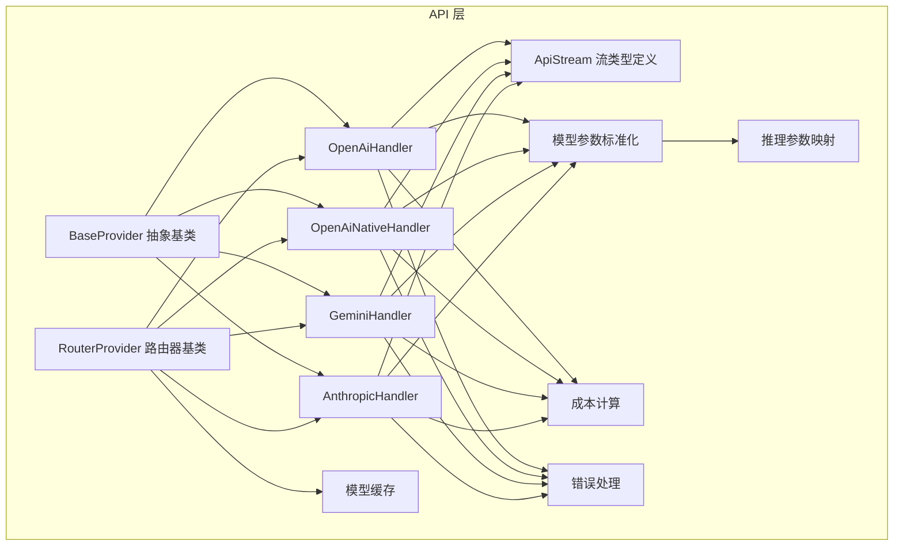

**图表来源**
- [src/api/providers/base-provider.ts:13-122](file://src/api/providers/base-provider.ts#L13-L122)
- [src/api/providers/router-provider.ts:22-87](file://src/api/providers/router-provider.ts#L22-L87)
- [src/api/providers/openai.ts:31-535](file://src/api/providers/openai.ts#L31-L535)
- [src/api/providers/openai-native.ts:35-800](file://src/api/providers/openai-native.ts#L35-L800)
- [src/api/providers/gemini.ts:36-538](file://src/api/providers/gemini.ts#L36-L538)
- [src/api/providers/anthropic.ts:30-386](file://src/api/providers/anthropic.ts#L30-L386)
- [src/api/transform/stream.ts:1-115](file://src/api/transform/stream.ts#L1-L115)
- [src/api/transform/model-params.ts:75-190](file://src/api/transform/model-params.ts#L75-L190)
- [src/api/transform/reasoning.ts:44-170](file://src/api/transform/reasoning.ts#L44-L170)
- [src/shared/cost.ts:66-116](file://src/shared/cost.ts#L66-L116)
- [src/api/providers/utils/error-handler.ts:38-107](file://src/api/providers/utils/error-handler.ts#L38-L107)
- [src/api/providers/fetchers/modelCache.ts:116-148](file://src/api/providers/fetchers/modelCache.ts#L116-L148)

**章节来源**
- [src/api/providers/index.ts:1-33](file://src/api/providers/index.ts#L1-L33)

## 核心组件
- 统一抽象层：BaseProvider 定义 createMessage 接口与通用能力（如工具 Schema 转换、默认 token 计数）。
- 路由器基类：RouterProvider 封装 OpenAI 兼容客户端、默认头部、模型查询与缓存回退。
- 具体提供商：OpenAI、OpenAI Native、Gemini、Anthropic 分别适配各自 API 的消息格式、推理参数与成本计算。
- 流式处理：ApiStream 定义统一的流式事件类型，包括文本、使用量、推理、工具调用等。
- 参数标准化：model-params 与 reasoning 将用户设置映射到各提供商的参数形式。
- 成本计算：shared/cost 提供跨提供商的成本计算函数。
- 错误处理：统一的错误处理器，保留状态码与元数据用于 UI 与重试。
- 模型缓存：modelCache 实现内存+磁盘双层缓存与并发刷新控制。

**章节来源**
- [src/api/providers/base-provider.ts:13-122](file://src/api/providers/base-provider.ts#L13-L122)
- [src/api/providers/router-provider.ts:22-87](file://src/api/providers/router-provider.ts#L22-L87)
- [src/api/transform/stream.ts:1-115](file://src/api/transform/stream.ts#L1-L115)
- [src/api/transform/model-params.ts:75-190](file://src/api/transform/model-params.ts#L75-L190)
- [src/api/transform/reasoning.ts:44-170](file://src/api/transform/reasoning.ts#L44-L170)
- [src/shared/cost.ts:66-116](file://src/shared/cost.ts#L66-L116)
- [src/api/providers/utils/error-handler.ts:38-107](file://src/api/providers/utils/error-handler.ts#L38-L107)
- [src/api/providers/fetchers/modelCache.ts:116-148](file://src/api/providers/fetchers/modelCache.ts#L116-L148)

## 架构总览
下图展示从调用方到各提供商的统一抽象与流式输出路径，以及参数标准化与成本计算的关键节点。

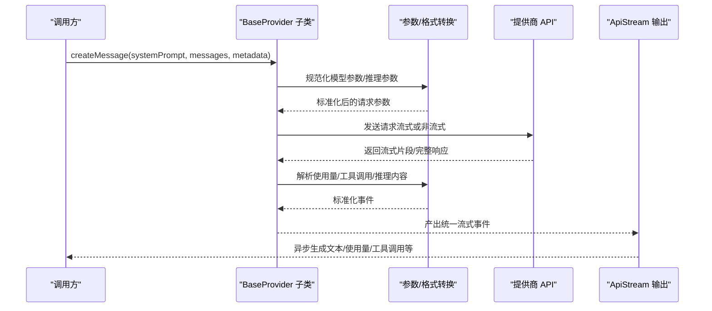

**图表来源**
- [src/api/providers/base-provider.ts:14-18](file://src/api/providers/base-provider.ts#L14-L18)
- [src/api/providers/openai.ts:82-270](file://src/api/providers/openai.ts#L82-L270)
- [src/api/providers/openai-native.ts:172-181](file://src/api/providers/openai-native.ts#L172-L181)
- [src/api/providers/gemini.ts:74-351](file://src/api/providers/gemini.ts#L74-L351)
- [src/api/providers/anthropic.ts:48-316](file://src/api/providers/anthropic.ts#L48-L316)
- [src/api/transform/stream.ts:3-14](file://src/api/transform/stream.ts#L3-L14)

## 详细组件分析

### BaseProvider 基类设计
- 角色：定义统一接口 createMessage(systemPrompt, messages, metadata?) -> ApiStream，确保所有提供商返回一致的流式事件。
- 工具 Schema 转换：convertToolsForOpenAI 与 convertToolSchemaForOpenAI 将工具参数转换为 OpenAI 严格模式兼容格式，保障 MCP 工具与严格模式的平衡。
- Token 计数：countTokens 默认使用 tiktoken worker，可被具体提供商覆盖以使用原生计数端点。

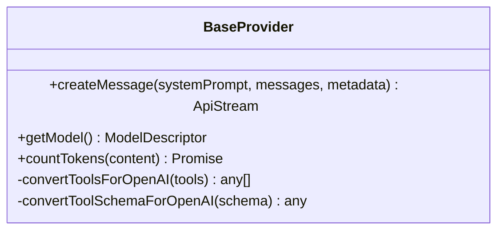

**图表来源**
- [src/api/providers/base-provider.ts:13-122](file://src/api/providers/base-provider.ts#L13-L122)

**章节来源**
- [src/api/providers/base-provider.ts:13-122](file://src/api/providers/base-provider.ts#L13-L122)

### RouterProvider 路由器基类
- 统一封装 OpenAI 兼容客户端，注入默认头部与自定义头。
- 模型查询与缓存：优先通过 getModels 获取实例级模型表，回退到全局缓存；支持按 modelId/defaultModelId/defaultModelInfo 返回当前模型信息。
- 温度支持检测：supportsTemperature 用于屏蔽不支持 temperature 的模型族。

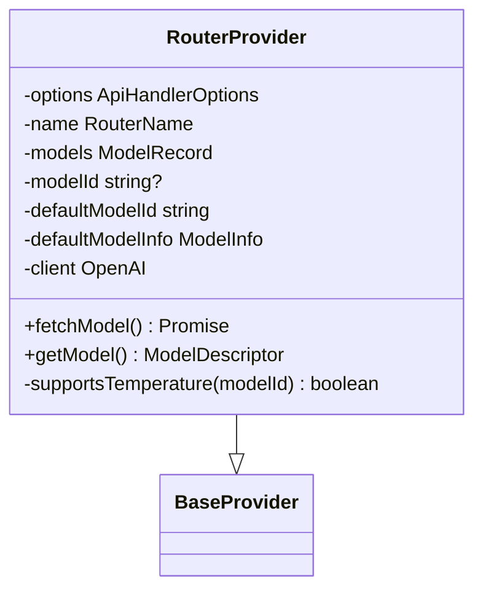

**图表来源**
- [src/api/providers/router-provider.ts:22-87](file://src/api/providers/router-provider.ts#L22-L87)

**章节来源**
- [src/api/providers/router-provider.ts:22-87](file://src/api/providers/router-provider.ts#L22-L87)
- [src/api/providers/constants.ts:3-7](file://src/api/providers/constants.ts#L3-L7)

### OpenAI 提供商实现
- 支持 Azure OpenAI、Azure AI Inference、标准 OpenAI 三种形态，自动识别并构造客户端。
- 流式与非流式两种路径：流式中解析 content、reasoning_content、tool_calls；非流式直接产出文本与工具调用。
- 特殊模型族：o1/o3/o4 使用专用处理流程，禁用 temperature 并使用 max_completion_tokens。
- R1/DeepSeek Reasoner：支持 R1 格式转换与特殊温度。
- Prompt Cache：对支持的模型在 system 与最后两个 user 消息上添加 cache_control。
- 工具调用：使用 TagMatcher 与 processToolCalls 管理工具调用的 partial/delta/end 事件。
- 使用量：processUsageMetrics 产出 usage 事件，包含输入/输出/缓存读写等。

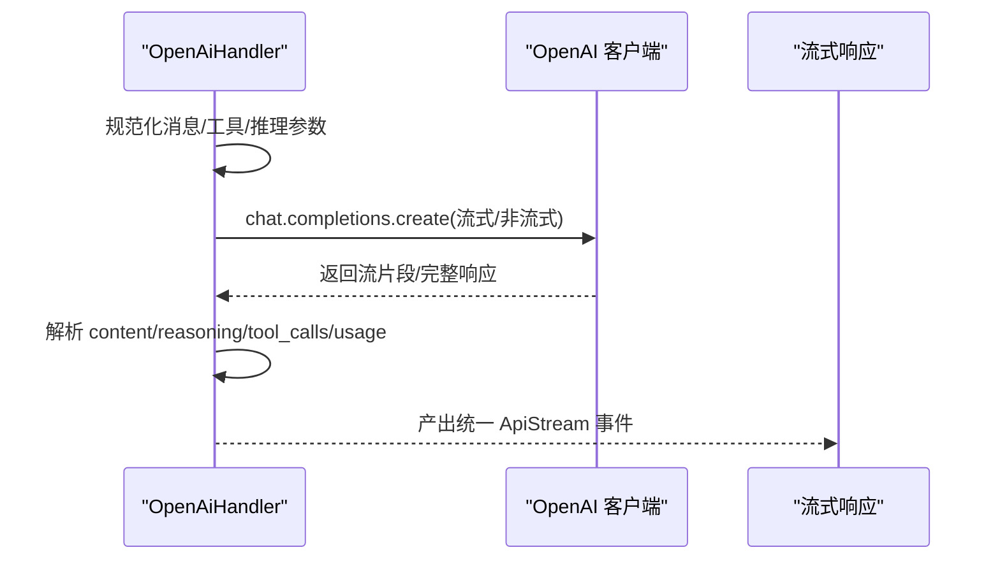

**图表来源**
- [src/api/providers/openai.ts:82-270](file://src/api/providers/openai.ts#L82-L270)
- [src/api/providers/openai.ts:295-327](file://src/api/providers/openai.ts#L295-L327)
- [src/api/providers/openai.ts:329-429](file://src/api/providers/openai.ts#L329-L429)
- [src/api/providers/openai.ts:431-457](file://src/api/providers/openai.ts#L431-L457)

**章节来源**
- [src/api/providers/openai.ts:31-535](file://src/api/providers/openai.ts#L31-L535)

### OpenAI Native 提供商实现
- 使用 Responses API，支持更丰富的事件类型与推理摘要。
- 自动选择 SDK 流式或手动 SSE 回退，具备 AbortController 取消能力。
- 严格的工具 Schema 处理：ensureAllRequired 与 ensureAdditionalPropertiesFalse 保证 OpenAI Responses API 的 schema 合规。
- 服务等级与定价：normalizeUsage 支持 tier 与 cache 细项，calculateApiCostOpenAI 进行成本计算。
- 会话追踪：session_id、originator、User-Agent 头部便于调试与追踪。

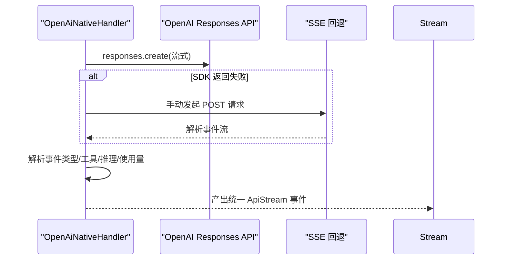

**图表来源**
- [src/api/providers/openai-native.ts:406-454](file://src/api/providers/openai-native.ts#L406-L454)
- [src/api/providers/openai-native.ts:550-670](file://src/api/providers/openai-native.ts#L550-L670)
- [src/api/providers/openai-native.ts:679-800](file://src/api/providers/openai-native.ts#L679-L800)

**章节来源**
- [src/api/providers/openai-native.ts:35-800](file://src/api/providers/openai-native.ts#L35-L800)

### Gemini 提供商实现
- 支持 Vertex 与直接 API 两种认证方式，自动选择 GoogleGenAI 客户端。
- 消息转换：convertAnthropicMessageToGemini 将 Anthropic 消息转换为 Gemini 内容块，处理思考签名与工具名称映射。
- 工具调用：functionDeclarations 形式，支持 allowedFunctionNames 限制调用范围。
- 使用量与成本：extractGroundingSources 提取引用来源，calculateCost 支持 tiered 定价与 cacheReads。
- 思考与推理：支持 thinkingConfig 与 groundingMetadata，产出 reasoning 与 grounding 事件。

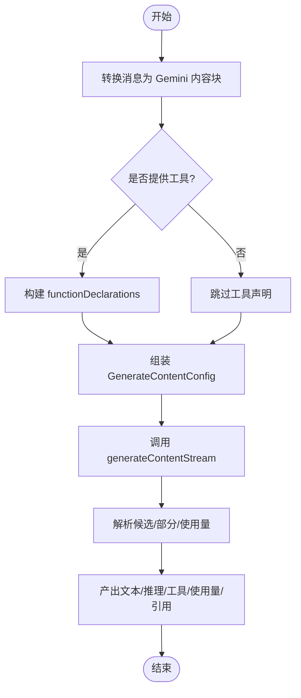

**图表来源**
- [src/api/providers/gemini.ts:74-351](file://src/api/providers/gemini.ts#L74-L351)
- [src/api/providers/gemini.ts:474-536](file://src/api/providers/gemini.ts#L474-L536)

**章节来源**
- [src/api/providers/gemini.ts:36-538](file://src/api/providers/gemini.ts#L36-L538)

### Anthropic 提供商实现
- 支持最新模型的 prompt caching 与 1M 上下文 beta，自动注入 anthropic-beta 头。
- 流式事件：message_start/message_delta/content_block_start/delta/stop，分别对应使用量、文本、推理与工具调用。
- 工具调用：content_block_delta.input_json_delta 逐步产出工具参数，最终由解析器聚合。
- 成本计算：calculateApiCostAnthropic 适用于 Anthropic 的计费模型（输入不含缓存）。

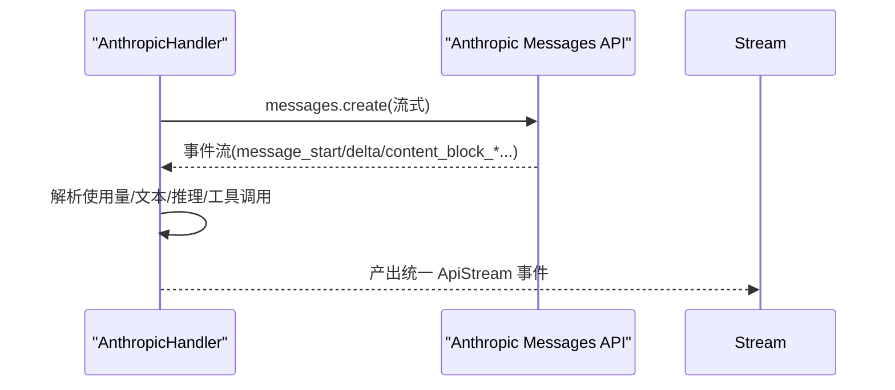

**图表来源**
- [src/api/providers/anthropic.ts:48-316](file://src/api/providers/anthropic.ts#L48-L316)

**章节来源**
- [src/api/providers/anthropic.ts:30-386](file://src/api/providers/anthropic.ts#L30-L386)

### 流式处理架构与数据流
- ApiStream 类型统一了文本、使用量、推理、工具调用、引用、错误等事件。
- 各提供商将自身 API 的事件转换为统一的 ApiStreamChunk，确保上层消费一致性。
- 工具调用：Raw 工具调用事件由 NativeToolCallParser 负责状态管理与 start/delta/end 事件的生成。

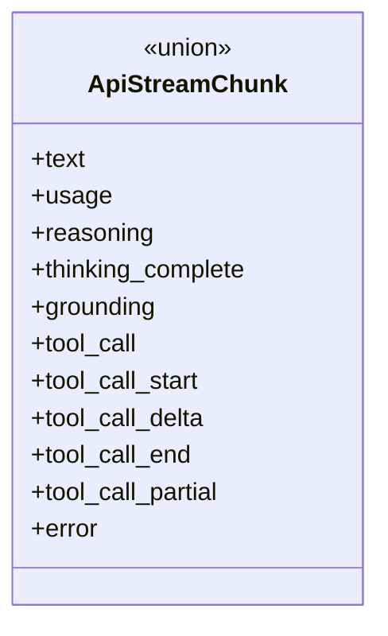

**图表来源**
- [src/api/transform/stream.ts:3-14](file://src/api/transform/stream.ts#L3-L14)

**章节来源**
- [src/api/transform/stream.ts:1-115](file://src/api/transform/stream.ts#L1-L115)

### 模型参数标准化与推理参数
- getModelParams 将 ProviderSettings 映射到各提供商的参数形式，处理 maxTokens、temperature、reasoningEffort/reasoningBudget、verbosity 等。
- reasoning.ts 提供各提供商推理参数的映射函数：OpenRouter、OpenAI、Gemini、Anthropic。
- 不同模型族的温度支持差异：如 o1/o3/o4、某些 OpenRouter 模型不支持 temperature。

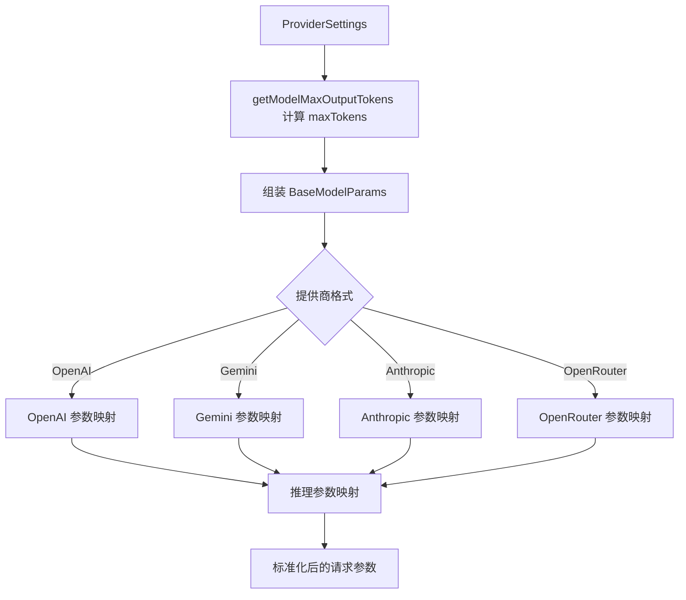

**图表来源**
- [src/api/transform/model-params.ts:75-190](file://src/api/transform/model-params.ts#L75-L190)
- [src/api/transform/reasoning.ts:44-170](file://src/api/transform/reasoning.ts#L44-L170)

**章节来源**
- [src/api/transform/model-params.ts:75-190](file://src/api/transform/model-params.ts#L75-L190)
- [src/api/transform/reasoning.ts:44-170](file://src/api/transform/reasoning.ts#L44-L170)

### 成本计算与错误处理
- 成本计算：calculateApiCostAnthropic/OpenAI 根据不同提供商的计费模型（含缓存、tiered 定价）计算总费用。
- 错误处理：handleProviderError 统一包装错误，保留 status、errorDetails、code、AWS $metadata 等元数据，便于 UI 与重试逻辑使用。

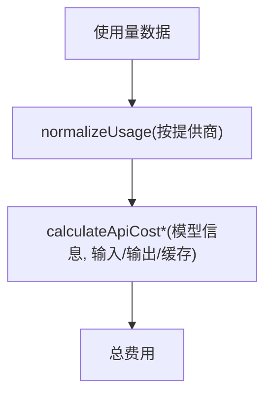

**图表来源**
- [src/shared/cost.ts:66-116](file://src/shared/cost.ts#L66-L116)
- [src/api/providers/utils/error-handler.ts:38-107](file://src/api/providers/utils/error-handler.ts#L38-L107)

**章节来源**
- [src/shared/cost.ts:66-116](file://src/shared/cost.ts#L66-L116)
- [src/api/providers/utils/error-handler.ts:38-107](file://src/api/providers/utils/error-handler.ts#L38-L107)

### 模型缓存与提供商切换
- 双层缓存：内存缓存（NodeCache）与磁盘缓存（JSON 文件），冷启动时同步加载磁盘缓存并校验结构。
- 刷新控制：inFlightRefresh 防止并发刷新导致的数据竞争；flushModels 支持刷新或仅清空内存缓存。
- 初始化：initializeModelCacheRefresh 在扩展激活后异步刷新公开提供商的模型列表。

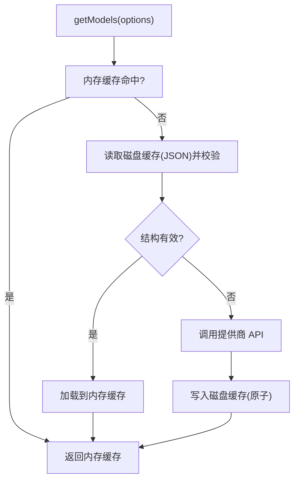

**图表来源**
- [src/api/providers/fetchers/modelCache.ts:116-148](file://src/api/providers/fetchers/modelCache.ts#L116-L148)
- [src/api/providers/fetchers/modelCache.ts:268-312](file://src/api/providers/fetchers/modelCache.ts#L268-L312)

**章节来源**
- [src/api/providers/fetchers/modelCache.ts:116-212](file://src/api/providers/fetchers/modelCache.ts#L116-L212)
- [src/api/providers/fetchers/modelCache.ts:219-238](file://src/api/providers/fetchers/modelCache.ts#L219-L238)

## 依赖关系分析
- 组件耦合：各 Provider 依赖 BaseProvider 的统一接口；RouterProvider 依赖 OpenAI 兼容客户端与模型缓存。
- 数据流：Provider -> Transform -> ApiStream；成本计算与错误处理贯穿于请求生命周期。
- 外部依赖：@anthropic-ai/sdk、@google/genai、openai、axios、node-cache、zod 等。

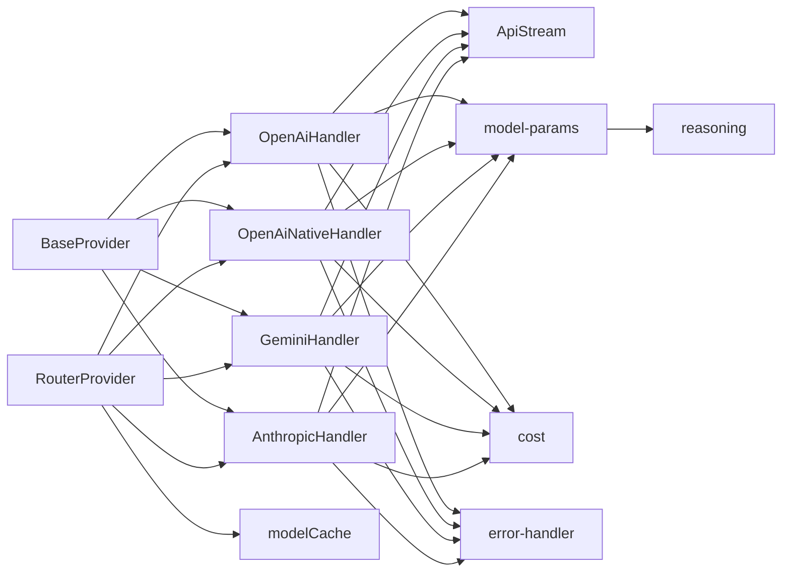

**图表来源**
- [src/api/providers/base-provider.ts:13-122](file://src/api/providers/base-provider.ts#L13-L122)
- [src/api/providers/router-provider.ts:22-87](file://src/api/providers/router-provider.ts#L22-L87)
- [src/api/providers/openai.ts:31-535](file://src/api/providers/openai.ts#L31-L535)
- [src/api/providers/openai-native.ts:35-800](file://src/api/providers/openai-native.ts#L35-L800)
- [src/api/providers/gemini.ts:36-538](file://src/api/providers/gemini.ts#L36-L538)
- [src/api/providers/anthropic.ts:30-386](file://src/api/providers/anthropic.ts#L30-L386)
- [src/api/transform/stream.ts:1-115](file://src/api/transform/stream.ts#L1-L115)
- [src/api/transform/model-params.ts:75-190](file://src/api/transform/model-params.ts#L75-L190)
- [src/api/transform/reasoning.ts:44-170](file://src/api/transform/reasoning.ts#L44-L170)
- [src/shared/cost.ts:66-116](file://src/shared/cost.ts#L66-L116)
- [src/api/providers/utils/error-handler.ts:38-107](file://src/api/providers/utils/error-handler.ts#L38-L107)
- [src/api/providers/fetchers/modelCache.ts:116-148](file://src/api/providers/fetchers/modelCache.ts#L116-L148)

**章节来源**
- [src/api/providers/index.ts:1-33](file://src/api/providers/index.ts#L1-L33)

## 性能考虑
- 流式传输：优先使用流式接口，降低首字节延迟与内存占用。
- 缓存策略：prompt cache（OpenAI）、prompt caching（Anthropic）、缓存读写（OpenAI/Gemini）减少重复计算。
- 模型缓存：内存+磁盘双层缓存，冷启动快速可用，避免硬编码默认值。
- 并发控制：inFlightRefresh 防止并发刷新；initializeModelCacheRefresh 异步后台刷新，避免阻塞主流程。
- 参数裁剪：根据模型能力与用户设置动态调整 temperature、max_tokens、reasoning 等，避免无效请求。

## 故障排除指南
- 错误包装：handleProviderError 保留 status、errorDetails、code、$metadata 等字段，便于 UI 与重试逻辑。
- OpenAI 兼容错误：handleOpenAIError 作为向后兼容的别名，建议统一使用 handleProviderError。
- 常见问题定位：
  - 认证失败：检查 API Key 与服务端点，查看 status 与错误详情。
  - 速率限制：根据 status 429 与 errorDetails 中的 Retry-After 或重试策略进行退避。
  - 模型不可用：检查模型缓存与刷新结果，必要时执行 flushModels(refresh=true)。
  - 工具调用异常：确认工具 Schema 是否符合 OpenAI 严格模式要求，或 MCP 工具的 strict=false 处理。

**章节来源**
- [src/api/providers/utils/error-handler.ts:38-107](file://src/api/providers/utils/error-handler.ts#L38-L107)
- [src/api/providers/utils/openai-error-handler.ts:17-19](file://src/api/providers/utils/openai-error-handler.ts#L17-L19)

## 结论
该架构通过 BaseProvider 抽象层实现了多提供商的一致性接口，结合 RouterProvider 的统一客户端与模型缓存，辅以标准化的参数映射与流式事件，满足复杂场景下的并发、超时与限流挑战。成本计算与错误处理进一步完善了可观测性与可维护性。新提供商接入只需遵循统一接口与转换规范，即可快速融入现有体系。

## 附录

### 新提供商接入指南
- 实现步骤
  - 继承 BaseProvider 或 RouterProvider，实现 createMessage 接口。
  - 在 src/api/providers/index.ts 中导出新处理器。
  - 如需模型列表，实现对应的 fetcher 并在 modelCache.ts 中注册。
  - 在 transform 层补充必要的格式转换与推理参数映射。
  - 在 shared/cost.ts 中补充成本计算逻辑（如需要）。
  - 单元测试与集成测试覆盖关键路径（流式、工具调用、使用量、错误处理）。
- 最佳实践
  - 优先使用流式接口，确保低延迟与资源友好。
  - 严格遵守工具 Schema 的 OpenAI 严格模式要求，或为 MCP 工具启用 strict=false。
  - 合理设置 temperature 与 max_tokens，避免不必要的超长输出。
  - 使用统一错误处理，保留状态码与元数据，便于 UI 与重试。
  - 利用模型缓存与刷新机制，提升启动速度与稳定性。

**章节来源**
- [src/api/providers/index.ts:1-33](file://src/api/providers/index.ts#L1-L33)
- [src/api/providers/fetchers/modelCache.ts:58-103](file://src/api/providers/fetchers/modelCache.ts#L58-L103)