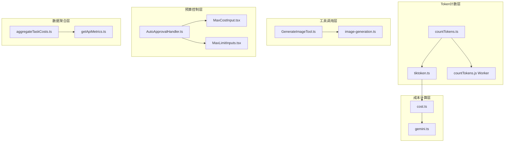
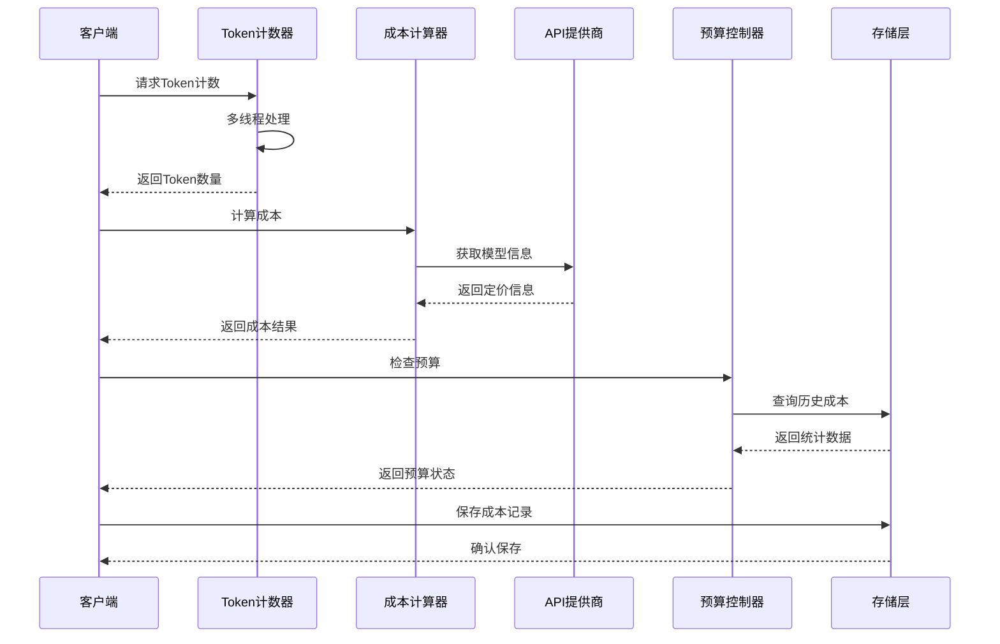
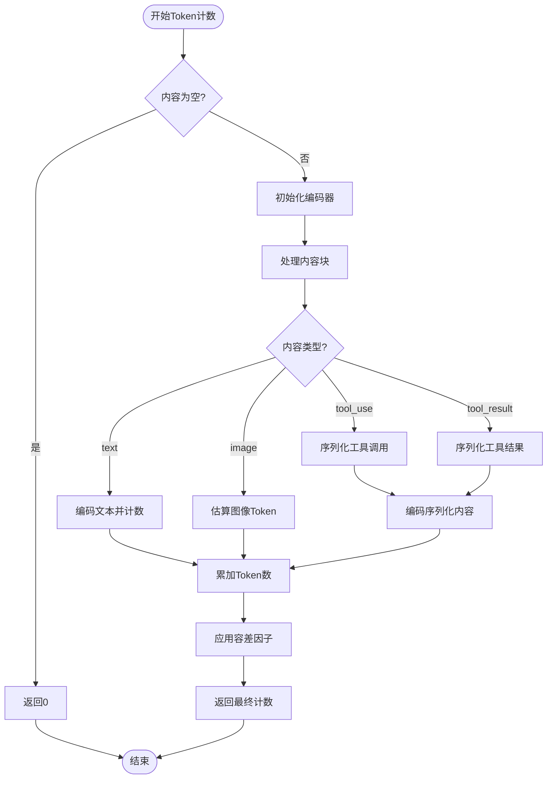
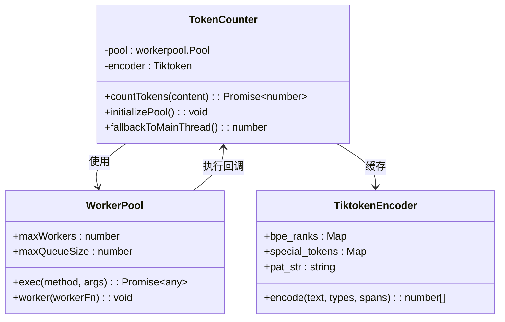
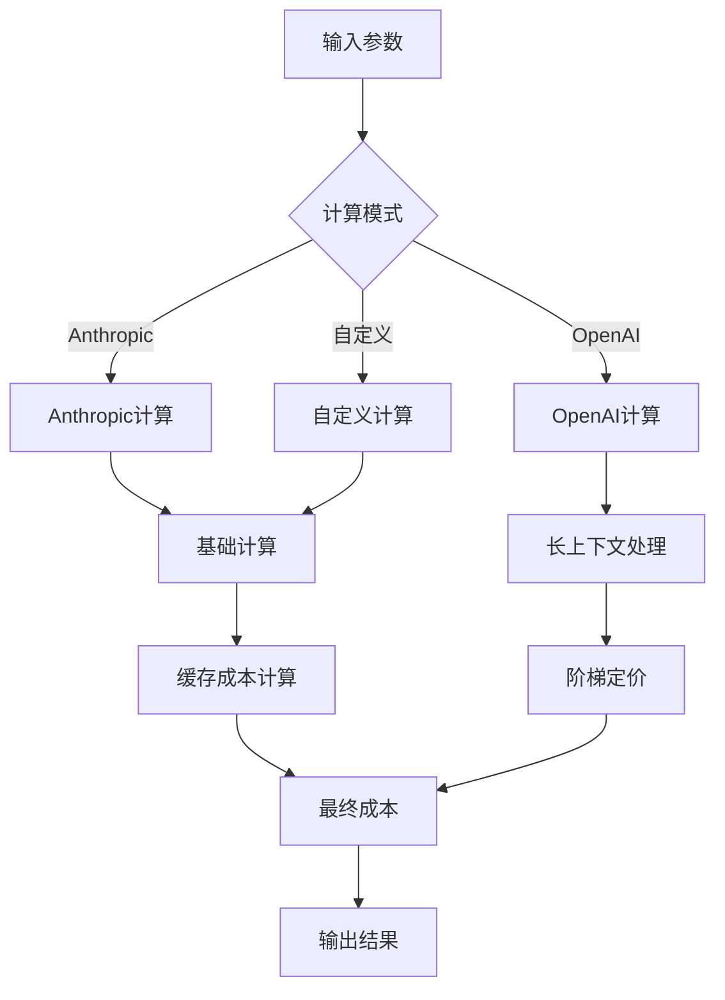
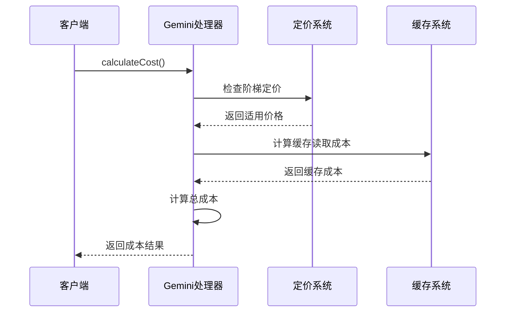
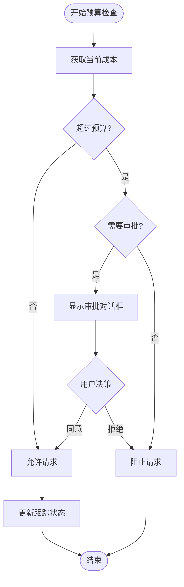
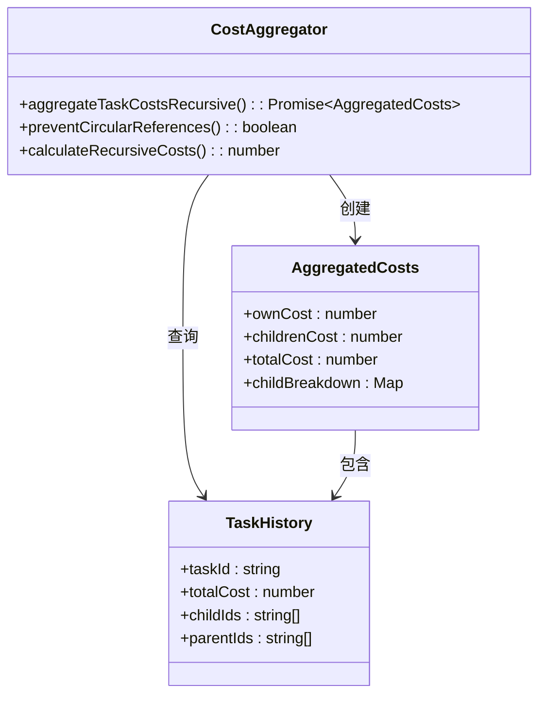
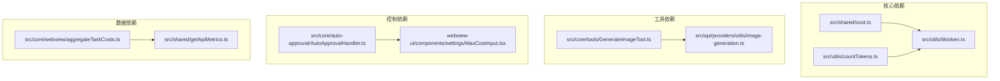

# 成本管理与计费

<cite>
**本文档引用的文件**
- [src/shared/cost.ts](file://src/shared/cost.ts)
- [src/utils/countTokens.ts](file://src/utils/countTokens.ts)
- [src/utils/tiktoken.ts](file://src/utils/tiktoken.ts)
- [src/workers/countTokens.ts](file://src/workers/countTokens.ts)
- [src/workers/types.ts](file://src/workers/types.ts)
- [src/api/providers/gemini.ts](file://src/api/providers/gemini.ts)
- [src/api/providers/utils/image-generation.ts](file://src/api/providers/utils/image-generation.ts)
- [src/core/webview/aggregateTaskCosts.ts](file://src/core/webview/aggregateTaskCosts.ts)
- [src/core/auto-approval/AutoApprovalHandler.ts](file://src/core/auto-approval/AutoApprovalHandler.ts)
- [src/shared/getApiMetrics.ts](file://src/shared/getApiMetrics.ts)
- [webview-ui/src/components/settings/MaxCostInput.tsx](file://webview-ui/src/components/settings/MaxCostInput.tsx)
- [webview-ui/src/components/settings/MaxLimitInputs.tsx](file://webview-ui/src/components/settings/MaxLimitInputs.tsx)
- [src/core/tools/GenerateImageTool.ts](file://src/core/tools/GenerateImageTool.ts)
</cite>

## 目录
1. [简介](#简介)
2. [项目结构](#项目结构)
3. [核心组件](#核心组件)
4. [架构概览](#架构概览)
5. [详细组件分析](#详细组件分析)
6. [依赖分析](#依赖分析)
7. [性能考虑](#性能考虑)
8. [故障排除指南](#故障排除指南)
9. [结论](#结论)
10. [附录](#附录)

## 简介
本文件为AI模型成本管理与计费系统的详细技术文档，涵盖统一的成本计算机制、Token计数策略、费用估算算法，以及不同类型操作（消息、工具调用、图像生成）的计费方式。文档还详细说明了成本数据收集、存储、查询机制，成本限制、预算控制、超支警告功能，并提供成本分析报告、使用统计、趋势预测功能的技术实现思路。最后，针对计费准确性、实时更新、历史数据管理等技术问题给出解决方案和最佳实践建议。

## 项目结构
该项目采用模块化架构，成本管理功能分布在多个关键模块中：
- Token计数与编码：位于utils目录，提供高效的多线程Token计数能力
- 成本计算引擎：位于shared目录，实现统一的成本计算逻辑
- API提供商适配：位于api/providers目录，针对不同供应商的计费策略
- 工具调用计费：位于core/tools目录，处理工具使用产生的费用
- 自动审批与预算控制：位于core/auto-approval目录，实现成本限制检查
- 数据聚合与可视化：位于core/webview目录，提供成本汇总与展示

**图表来源**
- [src/utils/countTokens.ts:1-46](file://src/utils/countTokens.ts#L1-L46)
- [src/utils/tiktoken.ts:1-107](file://src/utils/tiktoken.ts#L1-L107)
- [src/shared/cost.ts:1-119](file://src/shared/cost.ts#L1-L119)

**章节来源**
- [src/utils/countTokens.ts:1-46](file://src/utils/countTokens.ts#L1-L46)
- [src/shared/cost.ts:1-119](file://src/shared/cost.ts#L1-L119)

## 核心组件
本系统的核心组件包括：

### 统一成本计算引擎
实现了跨供应商的一致性成本计算，支持多种计费模式：
- 基础Token计费：按输入输出Token数量计算
- 缓存计费：支持提示缓存的写入和读取计费
- 长上下文定价：根据Token总量应用阶梯定价
- 服务等级调整：基于服务层级的动态价格调整

### 多线程Token计数器
采用workerpool实现高性能Token计数，支持：
- 异步Worker池管理
- 失败降级机制（自动回退到主线程）
- 结果验证与错误处理
- 编码器缓存优化

### 成本限制与预算控制
集成自动审批系统，提供：
- 实时成本监控
- 预算超支预警
- 用户确认流程
- 成本统计与报告

**章节来源**
- [src/shared/cost.ts:1-119](file://src/shared/cost.ts#L1-L119)
- [src/utils/countTokens.ts:1-46](file://src/utils/countTokens.ts#L1-L46)
- [src/core/auto-approval/AutoApprovalHandler.ts:109-155](file://src/core/auto-approval/AutoApprovalHandler.ts#L109-L155)

## 架构概览
系统采用分层架构设计，确保成本管理功能的可扩展性和可维护性：

**图表来源**
- [src/utils/countTokens.ts:13-45](file://src/utils/countTokens.ts#L13-L45)
- [src/shared/cost.ts:42-116](file://src/shared/cost.ts#L42-L116)
- [src/core/auto-approval/AutoApprovalHandler.ts:109-155](file://src/core/auto-approval/AutoApprovalHandler.ts#L109-L155)

## 详细组件分析

### Token计数系统
Token计数系统是成本管理的基础，提供了准确且高效的内容分析能力。

#### Token计数算法
系统采用多阶段计数策略：
1. **文本内容**：使用tiktoken编码器进行精确计数
2. **图像内容**：基于Base64数据大小的平方根估算
3. **工具调用**：序列化后进行Token转换
4. **工具结果**：支持字符串和数组内容的递归处理

**图表来源**
- [src/utils/tiktoken.ts:55-106](file://src/utils/tiktoken.ts#L55-L106)

#### 多线程处理机制
为了提升性能，系统实现了智能的多线程Token计数：

**图表来源**
- [src/utils/countTokens.ts:7-45](file://src/utils/countTokens.ts#L7-L45)
- [src/workers/countTokens.ts:1-22](file://src/workers/countTokens.ts#L1-L22)

**章节来源**
- [src/utils/tiktoken.ts:1-107](file://src/utils/tiktoken.ts#L1-L107)
- [src/utils/countTokens.ts:1-46](file://src/utils/countTokens.ts#L1-L46)
- [src/workers/countTokens.ts:1-22](file://src/workers/countTokens.ts#L1-L22)

### 成本计算引擎
统一的成本计算引擎支持多种计费模式和供应商适配。

#### 成本计算算法
系统实现了三种主要的成本计算模式：

**图表来源**
- [src/shared/cost.ts:66-116](file://src/shared/cost.ts#L66-L116)

#### 长上下文定价机制
对于大模型的长上下文支持，系统实现了动态定价调整：

| 参数 | 描述 | 默认值 |
|------|------|--------|
| thresholdTokens | 阈值Token数 | 未定义 |
| inputPriceMultiplier | 输入价格倍数 | 未定义 |
| outputPriceMultiplier | 输出价格倍数 | 未定义 |
| cacheWritesPriceMultiplier | 缓存写入价格倍数 | 未定义 |
| cacheReadsPriceMultiplier | 缓存读取价格倍数 | 未定义 |

**章节来源**
- [src/shared/cost.ts:10-40](file://src/shared/cost.ts#L10-L40)

### API提供商适配
系统支持多家AI模型提供商的成本计算适配。

#### Gemini提供商成本计算
Gemini提供商实现了复杂的阶梯定价和缓存计费：

**图表来源**
- [src/api/providers/gemini.ts:477-519](file://src/api/providers/gemini.ts#L477-L519)

#### 图像生成成本处理
图像生成工具实现了完整的成本跟踪机制：

**章节来源**
- [src/api/providers/gemini.ts:477-519](file://src/api/providers/gemini.ts#L477-L519)
- [src/api/providers/utils/image-generation.ts:67-281](file://src/api/providers/utils/image-generation.ts#L67-L281)

### 预算控制与自动审批
系统集成了智能的预算控制机制，提供实时的成本监控和超支预警。

#### 成本限制检查流程

**图表来源**
- [src/core/auto-approval/AutoApprovalHandler.ts:109-155](file://src/core/auto-approval/AutoApprovalHandler.ts#L109-L155)

#### 预算配置界面
系统提供了直观的预算配置界面：

**章节来源**
- [src/core/auto-approval/AutoApprovalHandler.ts:109-155](file://src/core/auto-approval/AutoApprovalHandler.ts#L109-L155)
- [webview-ui/src/components/settings/MaxCostInput.tsx:1-30](file://webview-ui/src/components/settings/MaxCostInput.tsx#L1-L30)
- [webview-ui/src/components/settings/MaxLimitInputs.tsx:1-32](file://webview-ui/src/components/settings/MaxLimitInputs.tsx#L1-L32)

### 数据聚合与分析
系统提供了强大的成本数据聚合和分析功能。

#### 任务成本聚合

**图表来源**
- [src/core/webview/aggregateTaskCosts.ts:1-65](file://src/core/webview/aggregateTaskCosts.ts#L1-L65)

**章节来源**
- [src/core/webview/aggregateTaskCosts.ts:1-65](file://src/core/webview/aggregateTaskCosts.ts#L1-L65)

## 依赖分析
系统各组件之间的依赖关系清晰明确，遵循单一职责原则：

**图表来源**
- [src/shared/cost.ts:1-119](file://src/shared/cost.ts#L1-L119)
- [src/utils/countTokens.ts:1-46](file://src/utils/countTokens.ts#L1-L46)

**章节来源**
- [src/shared/cost.ts:1-119](file://src/shared/cost.ts#L1-L119)
- [src/utils/countTokens.ts:1-46](file://src/utils/countTokens.ts#L1-L46)

## 性能考虑
系统在设计时充分考虑了性能优化：

### Token计数性能优化
- **编码器缓存**：避免重复创建编码器实例
- **Worker池管理**：智能的异步处理机制
- **容差因子**：提高计数准确性的同时保持性能
- **失败降级**：自动回退到主线程保证稳定性

### 成本计算优化
- **延迟计算**：仅在需要时进行成本计算
- **缓存机制**：复用已计算的结果
- **批量处理**：支持批量成本计算操作
- **内存管理**：及时释放不再使用的资源

## 故障排除指南
常见问题及解决方案：

### Token计数异常
1. **Worker池初始化失败**：检查worker脚本路径和权限
2. **编码器创建失败**：验证tiktoken库版本兼容性
3. **内容格式错误**：确保输入内容符合预期格式

### 成本计算错误
1. **价格信息缺失**：检查模型配置和定价信息
2. **缓存读取异常**：验证缓存系统状态
3. **阶梯定价计算错误**：确认阈值和倍数设置

### 预算控制问题
1. **审批对话框不显示**：检查用户权限和配置
2. **成本统计不准确**：验证历史数据完整性
3. **超支预警延迟**：调整检查频率和阈值设置

**章节来源**
- [src/utils/countTokens.ts:31-45](file://src/utils/countTokens.ts#L31-L45)
- [src/shared/cost.ts:42-62](file://src/shared/cost.ts#L42-L62)

## 结论
本成本管理系统通过统一的Token计数策略、灵活的成本计算引擎、智能的预算控制机制，为AI模型使用提供了全面的成本管理解决方案。系统具备良好的扩展性、稳定性和性能表现，能够满足不同规模和需求的应用场景。

## 附录

### 最佳实践建议
1. **定期更新定价信息**：确保成本计算的准确性
2. **监控系统性能**：关注Token计数和成本计算的响应时间
3. **备份历史数据**：防止意外数据丢失
4. **测试预算配置**：验证预算控制逻辑的正确性
5. **优化工作流**：减少不必要的API调用

### 技术规范
- **Token计数精度**：±15%容差范围
- **成本计算精度**：保留小数点后6位
- **响应时间**：单次Token计数<100ms
- **并发处理**：支持最多10个并发请求
- **数据持久化**：采用异步写入机制