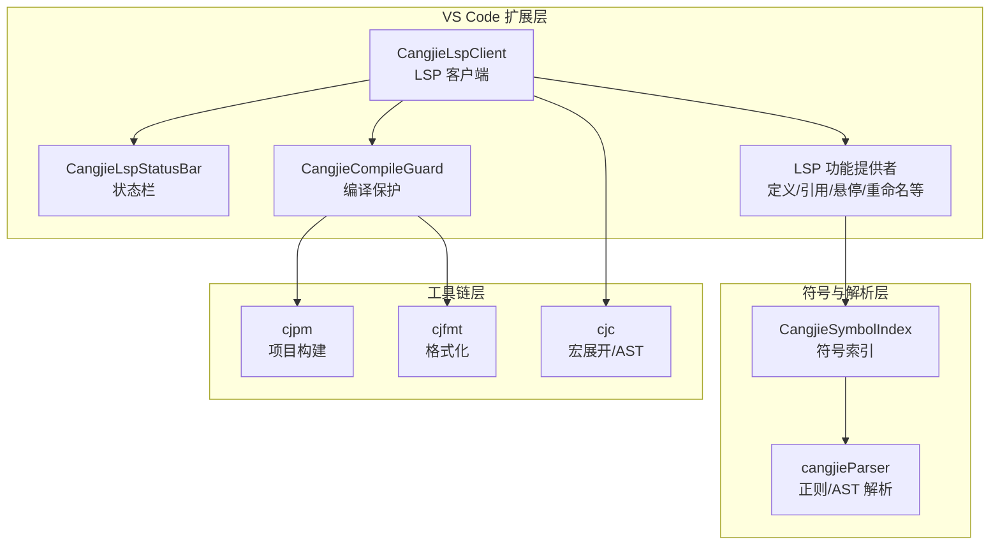
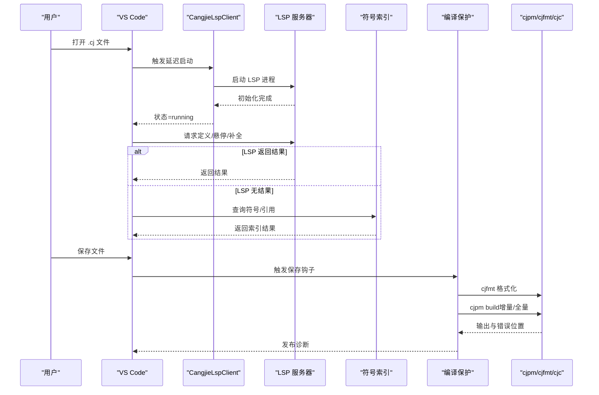
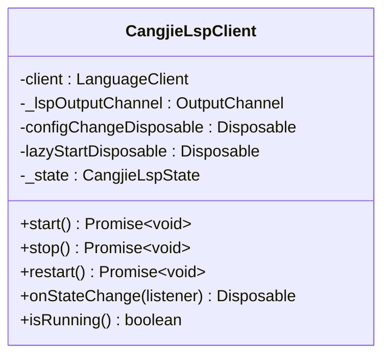
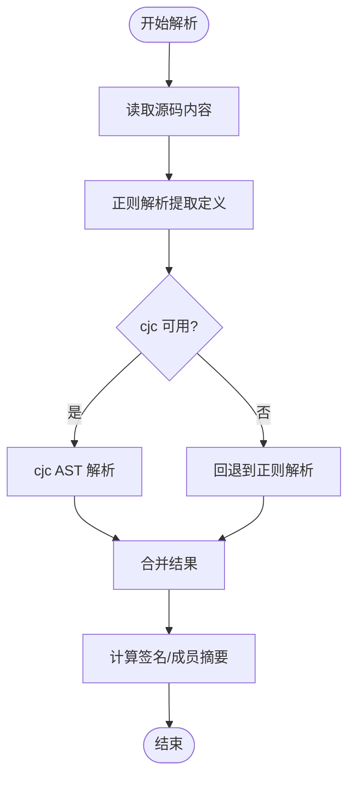
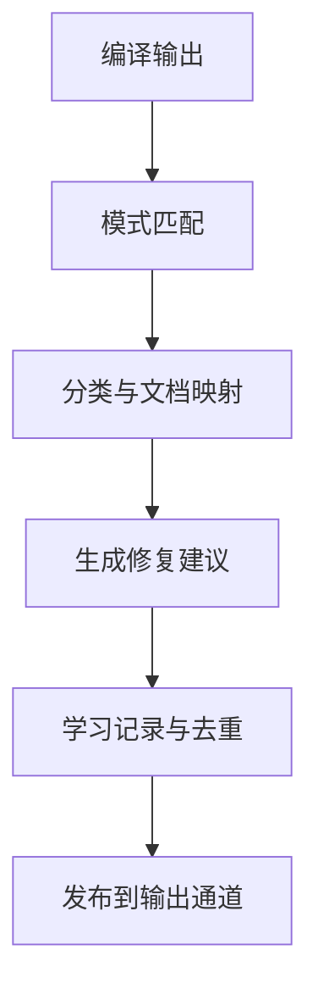
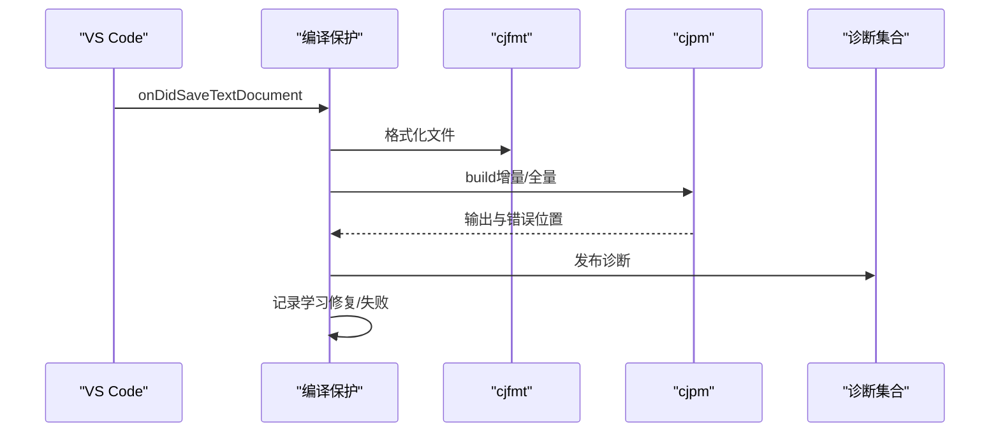
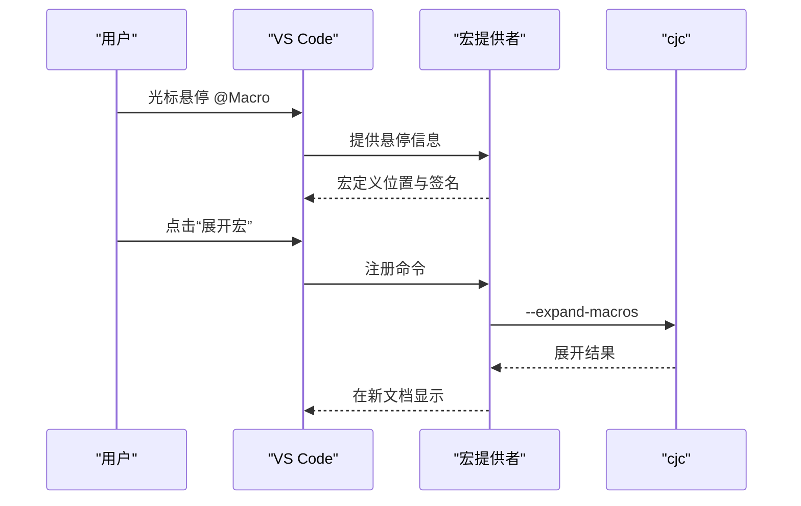
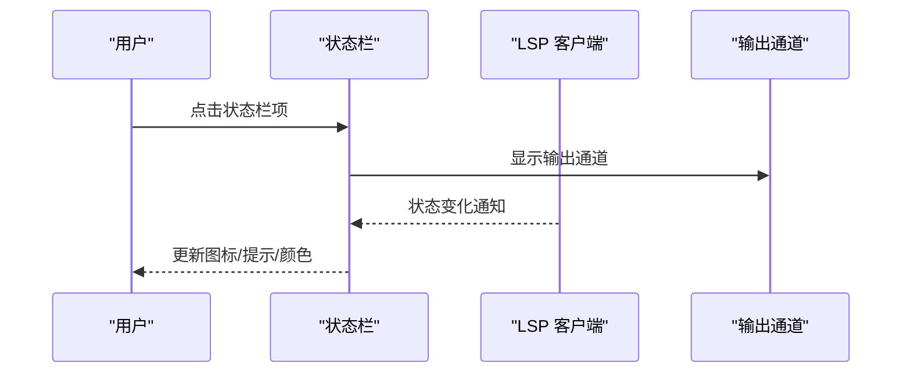
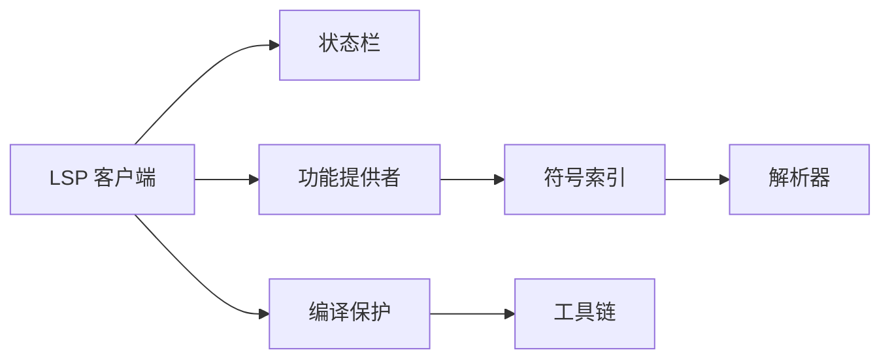

# Cangjie 语言架构

<cite>
**本文档引用的文件**
- [CangjieLspClient.ts](file://src/services/cangjie-lsp/CangjieLspClient.ts)
- [CangjieSymbolIndex.ts](file://src/services/cangjie-lsp/CangjieSymbolIndex.ts)
- [CangjieErrorAnalyzer.ts](file://src/services/cangjie-lsp/CangjieErrorAnalyzer.ts)
- [CangjieMacroProvider.ts](file://src/services/cangjie-lsp/CangjieMacroProvider.ts)
- [CangjieCompileGuard.ts](file://src/services/cangjie-lsp/CangjieCompileGuard.ts)
- [cangjieParser.ts](file://src/services/tree-sitter/cangjieParser.ts)
- [CangjieLspStatusBar.ts](file://src/services/cangjie-lsp/CangjieLspStatusBar.ts)
- [CangjieDefinitionProvider.ts](file://src/services/cangjie-lsp/CangjieDefinitionProvider.ts)
- [CangjieReferenceProvider.ts](file://src/services/cangjie-lsp/CangjieReferenceProvider.ts)
- [CangjieHoverProvider.ts](file://src/services/cangjie-lsp/CangjieHoverProvider.ts)
- [CangjieCodeActionProvider.ts](file://src/services/cangjie-lsp/CangjieCodeActionProvider.ts)
- [CangjieDocumentSymbolProvider.ts](file://src/services/cangjie-lsp/CangjieDocumentSymbolProvider.ts)
- [CangjieEnhancedRenameProvider.ts](file://src/services/cangjie-lsp/CangjieEnhancedRenameProvider.ts)
- [CangjieFoldingRangeProvider.ts](file://src/services/cangjie-lsp/CangjieFoldingRangeProvider.ts)
- [CangjieTestCodeLensProvider.ts](file://src/services/cangjie-lsp/CangjieTestCodeLensProvider.ts)
</cite>

## 目录
1. [简介](#简介)
2. [项目结构](#项目结构)
3. [核心组件](#核心组件)
4. [架构总览](#架构总览)
5. [详细组件分析](#详细组件分析)
6. [依赖关系分析](#依赖关系分析)
7. [性能考虑](#性能考虑)
8. [故障排除指南](#故障排除指南)
9. [结论](#结论)

## 简介
本文件系统性阐述 Cangjie 语言在 VS Code 中的架构实现，涵盖语言服务器协议（LSP）集成、代码补全与悬停提示、语法诊断、符号索引与导航、重命名增强、宏展开与导航、编译保护与格式化、状态栏集成与调试支持等。文档同时提供架构图与解析流程图，帮助开发者理解从源码到 IDE 体验的完整链路，并给出性能优化与兼容性建议。

## 项目结构
围绕 Cangjie 语言的 VS Code 扩展，核心模块分布如下：
- 语言服务器客户端：负责 LSP 生命周期管理、中间件与诊断过滤、状态栏集成
- 符号索引系统：基于 Tree-Sitter 与正则解析构建符号索引，支持跨文件查找与依赖分析
- 诊断与修复：编译输出分析、错误分类与修复建议、学习记录
- LSP 功能提供者：定义/引用/悬停/文档符号/折叠/重命名/代码动作/测试 CodeLens
- 工具链集成：cjpm/cjfmt/cjc 等工具的路径解析与环境构建



**图表来源**
- [CangjieLspClient.ts:277-660](file://src/services/cangjie-lsp/CangjieLspClient.ts#L277-L660)
- [CangjieSymbolIndex.ts:43-470](file://src/services/cangjie-lsp/CangjieSymbolIndex.ts#L43-L470)
- [cangjieParser.ts:1-538](file://src/services/tree-sitter/cangjieParser.ts#L1-L538)
- [CangjieCompileGuard.ts:40-473](file://src/services/cangjie-lsp/CangjieCompileGuard.ts#L40-L473)

**章节来源**
- [CangjieLspClient.ts:1-660](file://src/services/cangjie-lsp/CangjieLspClient.ts#L1-L660)
- [CangjieSymbolIndex.ts:1-470](file://src/services/cangjie-lsp/CangjieSymbolIndex.ts#L1-L470)
- [cangjieParser.ts:1-538](file://src/services/tree-sitter/cangjieParser.ts#L1-L538)
- [CangjieCompileGuard.ts:1-473](file://src/services/cangjie-lsp/CangjieCompileGuard.ts#L1-L473)

## 核心组件
- 语言服务器客户端：负责 LSP 启动/停止、延迟启动、自动重启、配置监听、输出通道、性能日志、诊断过滤与去噪
- 符号索引：构建与维护 .cj 文件符号索引，支持按名称/种类查询、引用扫描、依赖图、公共 API 抽取
- 解析器：提供正则解析与 cjc AST 解析两种策略，用于符号提取与签名计算
- 诊断分析：编译输出模式匹配、错误分类、文档映射、修复建议与学习记录
- 编译保护：保存钩子、增量/全量构建、cjfmt 自动格式化、cjlint 计数、错误发布
- LSP 功能提供者：定义/引用/悬停/文档符号/折叠/重命名/代码动作/测试 CodeLens
- 状态栏：显示 LSP 状态、SDK 版本、点击输出通道

**章节来源**
- [CangjieLspClient.ts:277-660](file://src/services/cangjie-lsp/CangjieLspClient.ts#L277-L660)
- [CangjieSymbolIndex.ts:43-470](file://src/services/cangjie-lsp/CangjieSymbolIndex.ts#L43-L470)
- [cangjieParser.ts:1-538](file://src/services/tree-sitter/cangjieParser.ts#L1-L538)
- [CangjieErrorAnalyzer.ts:1-370](file://src/services/cangjie-lsp/CangjieErrorAnalyzer.ts#L1-L370)
- [CangjieCompileGuard.ts:40-473](file://src/services/cangjie-lsp/CangjieCompileGuard.ts#L40-L473)

## 架构总览
下图展示从用户编辑到 LSP/工具链响应的端到端流程，包括延迟启动、符号索引回退、编译保护与诊断发布。



**图表来源**
- [CangjieLspClient.ts:376-565](file://src/services/cangjie-lsp/CangjieLspClient.ts#L376-L565)
- [CangjieSymbolIndex.ts:200-241](file://src/services/cangjie-lsp/CangjieSymbolIndex.ts#L200-L241)
- [CangjieCompileGuard.ts:67-126](file://src/services/cangjie-lsp/CangjieCompileGuard.ts#L67-L126)

## 详细组件分析

### 语言服务器客户端（LSP 客户端）
- 延迟启动：仅当工作区存在 .cj 文件时才启动 LSP，避免无意义进程启动
- 中间件去抖：对 hover/completion 请求进行去抖，降低高频请求压力
- 诊断过滤：针对 package 名称推断的误报进行过滤，提升诊断质量
- 自动重启：异常退出后最多三次指数退避重启，超限后提示手动重启
- 性能观测：记录首次补全/悬停响应耗时，辅助性能优化
- 环境构建：根据 CANGJIE_HOME 与平台自动拼接 PATH/LD_LIBRARY_PATH



**图表来源**
- [CangjieLspClient.ts:277-660](file://src/services/cangjie-lsp/CangjieLspClient.ts#L277-L660)

**章节来源**
- [CangjieLspClient.ts:1-660](file://src/services/cangjie-lsp/CangjieLspClient.ts#L1-L660)

### 符号索引系统
- 索引结构：按文件缓存 mtime 与符号列表，支持按名称/种类检索、引用扫描、目录/文件级查询
- 全量与增量：首次全量扫描，后续基于 mtime 增量更新；定期持久化到磁盘
- 依赖分析：从 import 语句推导跨文件依赖与反向依赖，支持公共 API 抽取
- 热路径优化：文件内容缓存与行分割缓存，减少重复 IO

```mermaid
classDiagram
class CangjieSymbolIndex {
-data : IndexData
-nameIndex : Map~string, SymbolEntry[]~
-watcher : FileSystemWatcher
-readFileCache : Map~string, {mtime, lines}~
+initialize() Promise~void~
+reindexFile(filePath) Promise~void~
+findDefinitions(name) SymbolEntry[]
+findReferences(name) ReferenceEntry[]
+getFileDependencies(filePath) string[]
+getReverseDependencies(filePath) string[]
+getPublicSymbolsForFile(filePath) SymbolEntry[]
+dispose() void
}
```

**图表来源**
- [CangjieSymbolIndex.ts:43-470](file://src/services/cangjie-lsp/CangjieSymbolIndex.ts#L43-L470)

**章节来源**
- [CangjieSymbolIndex.ts:1-470](file://src/services/cangjie-lsp/CangjieSymbolIndex.ts#L1-L470)

### 解析器与签名计算
- 正则解析：识别 class/struct/interface/enum/func/macro/var/let/main/extend/type_alias/prop/operator 等定义
- AST 集成：可选使用 cjc --dump-ast，失败时回退到正则解析
- 签名计算：对多行声明（函数/宏/主程序/类型）进行最大扫描行数限制，避免过度解析
- 成员摘要：对类型体内的成员进行启发式提取，用于快速概览



**图表来源**
- [cangjieParser.ts:145-342](file://src/services/tree-sitter/cangjieParser.ts#L145-L342)
- [cangjieParser.ts:482-537](file://src/services/tree-sitter/cangjieParser.ts#L482-L537)

**章节来源**
- [cangjieParser.ts:1-538](file://src/services/tree-sitter/cangjieParser.ts#L1-L538)

### 诊断分析与修复
- 错误模式：内置大量编译错误模式匹配，覆盖未找到符号、类型不匹配、循环依赖、不可变赋值、match 不穷尽、泛型约束、main 签名、索引越界等
- 文档映射：将错误类别映射到手册与标准库文档路径，便于用户查阅
- 修复建议：提供人类可读建议与 AI 友好指令，支持学习记录与去重
- 归一化：去除 ANSI 与路径前缀，稳定错误模式键，便于学习与统计



**图表来源**
- [CangjieErrorAnalyzer.ts:248-297](file://src/services/cangjie-lsp/CangjieErrorAnalyzer.ts#L248-L297)

**章节来源**
- [CangjieErrorAnalyzer.ts:1-370](file://src/services/cangjie-lsp/CangjieErrorAnalyzer.ts#L1-L370)

### 编译保护与格式化
- 保存钩子：保存时先 cjfmt 格式化，再 cjpm build（优先增量，失败则全量），最后统计 cjlint 诊断数
- 错误定位：从输出中提取错误位置，构建诊断集合，发布到 VS Code
- 学习机制：对已解决的错误记录修复模式，对未能解决的错误记录失败模式
- 依赖树：尝试使用 cjpm tree 获取精确依赖树，用于 AI 上下文



**图表来源**
- [CangjieCompileGuard.ts:67-126](file://src/services/cangjie-lsp/CangjieCompileGuard.ts#L67-L126)
- [CangjieCompileGuard.ts:294-332](file://src/services/cangjie-lsp/CangjieCompileGuard.ts#L294-L332)

**章节来源**
- [CangjieCompileGuard.ts:1-473](file://src/services/cangjie-lsp/CangjieCompileGuard.ts#L1-L473)

### 宏展开与导航
- CodeLens：在宏调用行上方显示“展开宏”和“跳转到宏定义”
- 悬停预览：悬停 @MacroName 显示宏定义位置与签名
- 命令集成：通过 cjc --expand-macros 将展开结果在新文档中展示



**图表来源**
- [CangjieMacroProvider.ts:18-103](file://src/services/cangjie-lsp/CangjieMacroProvider.ts#L18-L103)
- [CangjieMacroProvider.ts:124-168](file://src/services/cangjie-lsp/CangjieMacroProvider.ts#L124-L168)

**章节来源**
- [CangjieMacroProvider.ts:1-170](file://src/services/cangjie-lsp/CangjieMacroProvider.ts#L1-L170)

### LSP 功能提供者
- 定义/引用：优先使用 LSP，若无结果则回退到符号索引
- 悬停：在 LSP 无结果时，基于解析器提取签名进行展示
- 文档符号：将定义转换为文档符号树，支持层级折叠
- 折叠：支持类型体与 import/comment 折叠
- 重命名：比较 LSP 与索引结果，发现差异时提示用户选择增强版重命名
- 代码动作：针对常见错误提供一键修复（添加 import、let→var、补充分支、添加 return）
- 测试 CodeLens：识别 @Test/@TestCase 并提供运行/调试命令

```mermaid
classDiagram
class CangjieDefinitionProvider {
+provideDefinition(document, position) Location[]
}
class CangjieReferenceProvider {
+provideReferences(document, position, context) Location[]
}
class CangjieHoverProvider {
+provideHover(document, position) Hover
}
class CangjieDocumentSymbolProvider {
+provideDocumentSymbols(document) DocumentSymbol[]
}
class CangjieFoldingRangeProvider {
+provideFoldingRanges(document) FoldingRange[]
}
class CangjieEnhancedRenameProvider {
+prepareRename(document, position) Range
+provideRenameEdits(document, position, newName) WorkspaceEdit
}
class CangjieCodeActionProvider {
+provideCodeActions(document, range, context) CodeAction[]
}
class CangjieTestCodeLensProvider {
+provideCodeLenses(document) CodeLens[]
}
```



**图表来源**
- [CangjieDefinitionProvider.ts:9-31](file://src/services/cangjie-lsp/CangjieDefinitionProvider.ts#L9-L31)
- [CangjieReferenceProvider.ts:9-40](file://src/services/cangjie-lsp/CangjieReferenceProvider.ts#L9-L40)
- [CangjieHoverProvider.ts:9-62](file://src/services/cangjie-lsp/CangjieHoverProvider.ts#L9-L62)
- [CangjieDocumentSymbolProvider.ts:76-88](file://src/services/cangjie-lsp/CangjieDocumentSymbolProvider.ts#L76-L88)
- [CangjieFoldingRangeProvider.ts:8-73](file://src/services/cangjie-lsp/CangjieFoldingRangeProvider.ts#L8-L73)
- [CangjieEnhancedRenameProvider.ts:9-125](file://src/services/cangjie-lsp/CangjieEnhancedRenameProvider.ts#L9-L125)
- [CangjieCodeActionProvider.ts:185-209](file://src/services/cangjie-lsp/CangjieCodeActionProvider.ts#L185-L209)
- [CangjieTestCodeLensProvider.ts:14-83](file://src/services/cangjie-lsp/CangjieTestCodeLensProvider.ts#L14-L83)

**章节来源**
- [CangjieDefinitionProvider.ts:1-32](file://src/services/cangjie-lsp/CangjieDefinitionProvider.ts#L1-L32)
- [CangjieReferenceProvider.ts:1-41](file://src/services/cangjie-lsp/CangjieReferenceProvider.ts#L1-L41)
- [CangjieHoverProvider.ts:1-63](file://src/services/cangjie-lsp/CangjieHoverProvider.ts#L1-L63)
- [CangjieDocumentSymbolProvider.ts:1-89](file://src/services/cangjie-lsp/CangjieDocumentSymbolProvider.ts#L1-L89)
- [CangjieFoldingRangeProvider.ts:1-74](file://src/services/cangjie-lsp/CangjieFoldingRangeProvider.ts#L1-L74)
- [CangjieEnhancedRenameProvider.ts:1-126](file://src/services/cangjie-lsp/CangjieEnhancedRenameProvider.ts#L1-L126)
- [CangjieCodeActionProvider.ts:1-210](file://src/services/cangjie-lsp/CangjieCodeActionProvider.ts#L1-L210)
- [CangjieTestCodeLensProvider.ts:1-84](file://src/services/cangjie-lsp/CangjieTestCodeLensProvider.ts#L1-L84)

### 状态栏与调试支持
- 状态栏：显示 LSP 状态图标与提示，点击弹出输出通道；检测 SDK 版本并在提示中显示
- 调试：提供测试 CodeLens 的“调试测试”命令，配合调试适配器使用



**图表来源**
- [CangjieLspStatusBar.ts:10-113](file://src/services/cangjie-lsp/CangjieLspStatusBar.ts#L10-L113)
- [CangjieTestCodeLensProvider.ts:14-83](file://src/services/cangjie-lsp/CangjieTestCodeLensProvider.ts#L14-L83)

**章节来源**
- [CangjieLspStatusBar.ts:1-113](file://src/services/cangjie-lsp/CangjieLspStatusBar.ts#L1-L113)
- [CangjieTestCodeLensProvider.ts:1-84](file://src/services/cangjie-lsp/CangjieTestCodeLensProvider.ts#L1-L84)

## 依赖关系分析
- 组件耦合：LSP 客户端与状态栏强耦合；符号索引被多个提供者依赖；编译保护依赖工具链与诊断集合
- 外部依赖：vscode-languageclient、cjc/cjpm/cjfmt、操作系统 PATH/LD_LIBRARY_PATH
- 循环依赖：未见明显循环；各模块职责清晰，通过接口与回调交互



**图表来源**
- [CangjieLspClient.ts:277-660](file://src/services/cangjie-lsp/CangjieLspClient.ts#L277-L660)
- [CangjieSymbolIndex.ts:43-470](file://src/services/cangjie-lsp/CangjieSymbolIndex.ts#L43-L470)
- [CangjieCompileGuard.ts:40-473](file://src/services/cangjie-lsp/CangjieCompileGuard.ts#L40-L473)

**章节来源**
- [CangjieLspClient.ts:1-660](file://src/services/cangjie-lsp/CangjieLspClient.ts#L1-L660)
- [CangjieSymbolIndex.ts:1-470](file://src/services/cangjie-lsp/CangjieSymbolIndex.ts#L1-L470)
- [CangjieCompileGuard.ts:1-473](file://src/services/cangjie-lsp/CangjieCompileGuard.ts#L1-L473)

## 性能考虑
- 延迟启动与去抖：避免不必要的 LSP 启动与高频请求
- 符号索引缓存：基于 mtime 的增量更新与磁盘持久化，减少重复解析
- 解析策略：正则解析为主，cjc AST 为辅，兼顾速度与准确性
- 保存钩子串行化：按项目根排队构建，避免并行冲突
- 诊断发布：仅在失败时发布诊断，成功时清空，减少 UI 抖动

[本节为通用指导，无需特定文件来源]

## 故障排除指南
- LSP 启动失败：检查 CANGJIE_HOME 与 envsetup 脚本执行；查看输出通道中的初始化失败信息
- 诊断误报：包名推断导致的“默认包名”误报会被过滤；若用户显式声明包名，LSP 的默认推断将被忽略
- 宏展开失败：cjc 版本过低不支持 --expand-macros；升级 SDK 或使用替代方案
- 重命名不完整：LSP 与索引结果不一致时会提示使用增强版重命名；确认是否选择了索引版
- 编译失败：查看 cjpm 输出中的错误位置与分类，结合修复建议与学习记录改进

**章节来源**
- [CangjieLspClient.ts:420-565](file://src/services/cangjie-lsp/CangjieLspClient.ts#L420-L565)
- [CangjieCompileGuard.ts:247-292](file://src/services/cangjie-lsp/CangjieCompileGuard.ts#L247-L292)
- [CangjieMacroProvider.ts:124-168](file://src/services/cangjie-lsp/CangjieMacroProvider.ts#L124-L168)
- [CangjieEnhancedRenameProvider.ts:54-78](file://src/services/cangjie-lsp/CangjieEnhancedRenameProvider.ts#L54-L78)

## 结论
Cangjie 语言架构在 VS Code 中通过 LSP 客户端、符号索引、解析器与编译保护等模块协同工作，提供了从语法高亮到智能补全、从符号导航到宏展开、从增量构建到诊断发布的完整开发体验。通过延迟启动、去抖与缓存优化，系统在性能与准确性之间取得平衡；通过诊断分析与学习机制，持续提升错误修复效率。未来可在 Tree-Sitter 集成、更细粒度的增量索引与跨工作区符号聚合等方面进一步优化。