# LSP 提供者实现

<cite>
**本文档引用的文件**
- [CangjieCodeActionProvider.ts](file://src/services/cangjie-lsp/CangjieCodeActionProvider.ts)
- [CangjieHoverProvider.ts](file://src/services/cangjie-lsp/CangjieHoverProvider.ts)
- [CangjieDefinitionProvider.ts](file://src/services/cangjie-lsp/CangjieDefinitionProvider.ts)
- [CangjieReferenceProvider.ts](file://src/services/cangjie-lsp/CangjieReferenceProvider.ts)
- [CangjieDocumentSymbolProvider.ts](file://src/services/cangjie-lsp/CangjieDocumentSymbolProvider.ts)
- [CangjieFoldingRangeProvider.ts](file://src/services/cangjie-lsp/CangjieFoldingRangeProvider.ts)
- [CangjieEnhancedRenameProvider.ts](file://src/services/cangjie-lsp/CangjieEnhancedRenameProvider.ts)
- [CangjieSymbolIndex.ts](file://src/services/cangjie-lsp/CangjieSymbolIndex.ts)
- [cangjieCommands.ts](file://src/services/cangjie-lsp/cangjieCommands.ts)
- [CangjieLspClient.ts](file://src/services/cangjie-lsp/CangjieLspClient.ts)
- [CangjieRefactoringProvider.ts](file://src/services/cangjie-lsp/CangjieRefactoringProvider.ts)
- [cangjieParser.ts](file://src/services/tree-sitter/cangjieParser.ts)
</cite>

## 目录
1. [简介](#简介)
2. [项目结构](#项目结构)
3. [核心组件](#核心组件)
4. [架构概览](#架构概览)
5. [详细组件分析](#详细组件分析)
6. [依赖关系分析](#依赖关系分析)
7. [性能考虑](#性能考虑)
8. [故障排除指南](#故障排除指南)
9. [结论](#结论)

## 简介

本文档详细分析了 Cangjie 语言在 VS Code 中的 LSP 提供者实现。该实现包括多种类型的 LSP 提供者：代码动作提供者、悬停信息提供者、定义解析提供者、引用查找提供者、文档符号提供者、折叠范围提供者和增强重命名提供者。这些提供者通过树形结构解析器和符号索引系统协同工作，为开发者提供完整的语言支持。

## 项目结构

LSP 提供者主要位于 `src/services/cangjie-lsp/` 目录下，采用模块化设计：

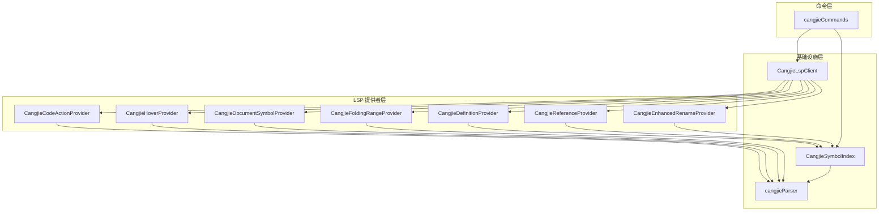

**图表来源**
- [CangjieCodeActionProvider.ts:1-210](file://src/services/cangjie-lsp/CangjieCodeActionProvider.ts#L1-L210)
- [CangjieSymbolIndex.ts:1-470](file://src/services/cangjie-lsp/CangjieSymbolIndex.ts#L1-L470)
- [CangjieLspClient.ts:1-660](file://src/services/cangjie-lsp/CangjieLspClient.ts#L1-L660)

**章节来源**
- [CangjieCodeActionProvider.ts:1-210](file://src/services/cangjie-lsp/CangjieCodeActionProvider.ts#L1-L210)
- [CangjieHoverProvider.ts:1-63](file://src/services/cangjie-lsp/CangjieHoverProvider.ts#L1-L63)
- [CangjieSymbolIndex.ts:1-470](file://src/services/cangjie-lsp/CangjieSymbolIndex.ts#L1-L470)

## 核心组件

### 符号索引系统

CangjieSymbolIndex 是整个 LSP 提供者系统的核心基础设施，负责：

- **符号索引管理**：维护工作区内所有 .cj 文件的符号信息
- **文件监控**：实时监听文件变化并更新索引
- **缓存策略**：使用内存缓存和磁盘持久化相结合的方式
- **查询优化**：提供高效的符号查找和引用扫描功能

### 解析器引擎

cangjieParser 提供两种解析策略：

- **正则表达式解析器**：快速解析，无需外部依赖
- **CJC AST 解析器**：基于 Cangjie SDK 的精确解析，作为回退方案

### LSP 客户端

CangjieLspClient 管理与语言服务器的连接，包括：

- **延迟启动**：仅在需要时启动 LSP 进程
- **自动重启**：服务器异常退出时自动重启
- **中间件**：提供防抖机制优化高频请求
- **诊断过滤**：智能过滤 LSP 返回的诊断信息

**章节来源**
- [CangjieSymbolIndex.ts:43-470](file://src/services/cangjie-lsp/CangjieSymbolIndex.ts#L43-L470)
- [cangjieParser.ts:1-538](file://src/services/tree-sitter/cangjieParser.ts#L1-L538)
- [CangjieLspClient.ts:277-660](file://src/services/cangjie-lsp/CangjieLspClient.ts#L277-L660)

## 架构概览

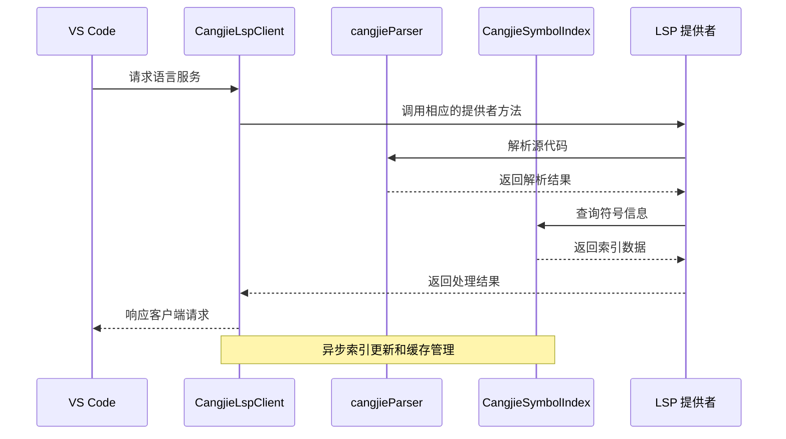

**图表来源**
- [CangjieLspClient.ts:46-56](file://src/services/cangjie-lsp/CangjieLspClient.ts#L46-L56)
- [CangjieSymbolIndex.ts:200-231](file://src/services/cangjie-lsp/CangjieSymbolIndex.ts#L200-L231)
- [cangjieParser.ts:145-195](file://src/services/tree-sitter/cangjieParser.ts#L145-L195)

## 详细组件分析

### 代码动作提供者 (Code Action Provider)

CangjieCodeActionProvider 实现了智能的代码修复功能：

#### 功能特性
- **标准库导入建议**：根据未识别符号自动添加 import 语句
- **可变性修复**：将 let 改为 var 以解决不可变性错误
- **模式匹配补全**：添加缺失的通配分支
- **返回值补全**：在函数末尾添加缺失的 return 语句

#### 实现机制
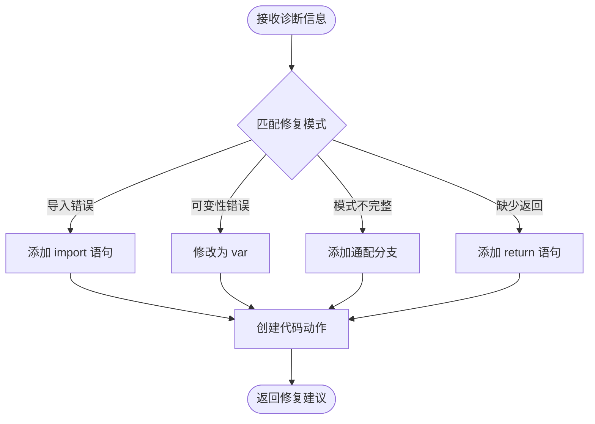

**图表来源**
- [CangjieCodeActionProvider.ts:50-183](file://src/services/cangjie-lsp/CangjieCodeActionProvider.ts#L50-L183)

#### 性能优化
- 使用预编译的正则表达式进行快速匹配
- 限制搜索范围避免全文件扫描
- 缓存插入位置计算结果

**章节来源**
- [CangjieCodeActionProvider.ts:1-210](file://src/services/cangjie-lsp/CangjieCodeActionProvider.ts#L1-L210)

### 悬停信息提供者 (Hover Provider)

CangjieHoverProvider 提供智能的悬停显示功能：

#### 功能特性
- **签名提取**：从解析器中提取完整的函数签名
- **多语言支持**：支持中英文标签显示
- **上下文感知**：根据光标位置智能匹配符号

#### 实现机制
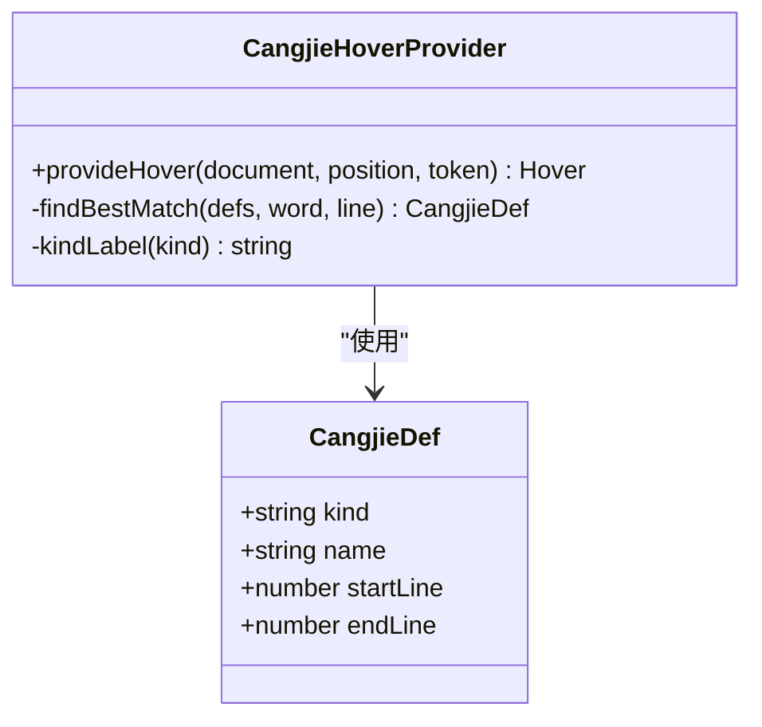

**图表来源**
- [CangjieHoverProvider.ts:9-63](file://src/services/cangjie-lsp/CangjieHoverProvider.ts#L9-L63)
- [cangjieParser.ts:59-64](file://src/services/tree-sitter/cangjieParser.ts#L59-L64)

**章节来源**
- [CangjieHoverProvider.ts:1-63](file://src/services/cangjie-lsp/CangjieHoverProvider.ts#L1-L63)

### 定义解析提供者 (Definition Provider)

CangjieDefinitionProvider 提供跨文件的定义跳转功能：

#### 功能特性
- **符号定位**：在符号索引中查找定义位置
- **跨文件支持**：支持不同文件间的符号引用
- **精确匹配**：根据光标位置精确匹配符号

#### 实现机制
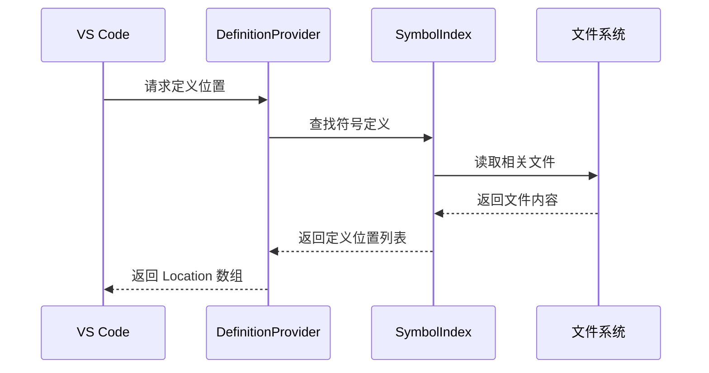

**图表来源**
- [CangjieDefinitionProvider.ts:9-32](file://src/services/cangjie-lsp/CangjieDefinitionProvider.ts#L9-L32)
- [CangjieSymbolIndex.ts:261-263](file://src/services/cangjie-lsp/CangjieSymbolIndex.ts#L261-L263)

**章节来源**
- [CangjieDefinitionProvider.ts:1-32](file://src/services/cangjie-lsp/CangjieDefinitionProvider.ts#L1-L32)

### 引用查找提供者 (Reference Provider)

CangjieReferenceProvider 提供符号引用查找功能：

#### 功能特性
- **引用扫描**：在整个工作区内扫描符号引用
- **声明过滤**：可选择包含或排除声明位置
- **跨文件支持**：支持跨文件的引用查找

#### 实现机制
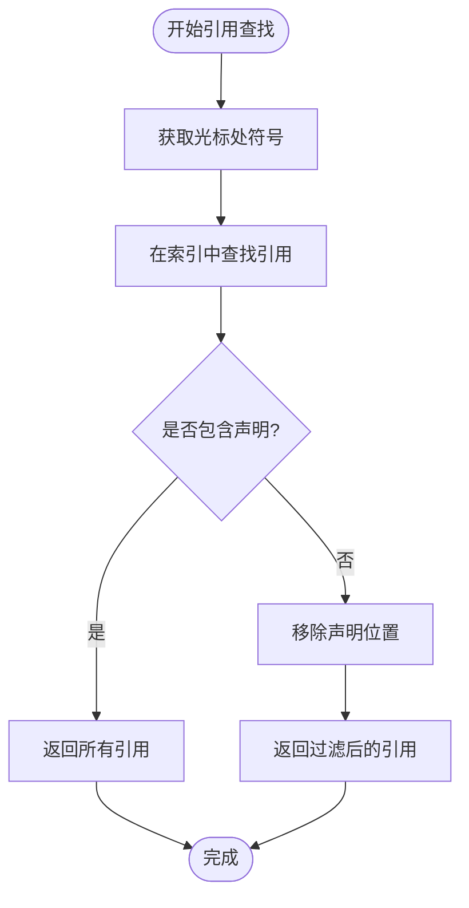

**图表来源**
- [CangjieReferenceProvider.ts:9-41](file://src/services/cangjie-lsp/CangjieReferenceProvider.ts#L9-L41)

**章节来源**
- [CangjieReferenceProvider.ts:1-41](file://src/services/cangjie-lsp/CangjieReferenceProvider.ts#L1-L41)

### 文档符号提供者 (Document Symbol Provider)

CangjieDocumentSymbolProvider 提供文档符号层次结构：

#### 功能特性
- **符号分类**：将不同类型的符号映射到 VS Code 符号类型
- **层次结构**：构建嵌套的符号层次结构
- **智能匹配**：根据符号位置关系确定父子关系

#### 实现机制
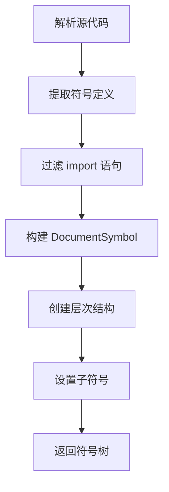

**图表来源**
- [CangjieDocumentSymbolProvider.ts:43-74](file://src/services/cangjie-lsp/CangjieDocumentSymbolProvider.ts#L43-L74)

**章节来源**
- [CangjieDocumentSymbolProvider.ts:1-89](file://src/services/cangjie-lsp/CangjieDocumentSymbolProvider.ts#L1-L89)

### 折叠范围提供者 (Folding Range Provider)

CangjieFoldingRangeProvider 提供代码折叠功能：

#### 功能特性
- **块级折叠**：支持 class、struct、interface、enum 等块级结构
- **导入折叠**：自动折叠连续的 import 语句
- **注释折叠**：支持多行注释和单行注释的折叠

#### 实现机制
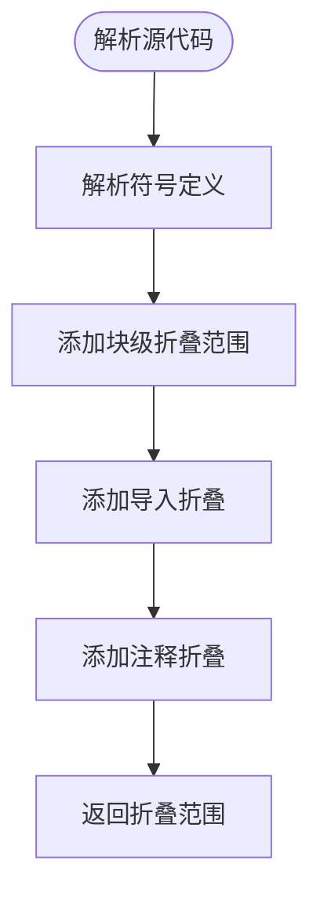

**图表来源**
- [CangjieFoldingRangeProvider.ts:8-28](file://src/services/cangjie-lsp/CangjieFoldingRangeProvider.ts#L8-L28)

**章节来源**
- [CangjieFoldingRangeProvider.ts:1-74](file://src/services/cangjie-lsp/CangjieFoldingRangeProvider.ts#L1-L74)

### 增强重命名提供者 (Enhanced Rename Provider)

CangjieEnhancedRenameProvider 提供智能的重命名功能：

#### 功能特性
- **双重验证**：比较 LSP 和本地索引的结果
- **冲突检测**：当发现不一致时提示用户选择
- **回退机制**：在 LSP 失败时使用本地索引

#### 实现机制
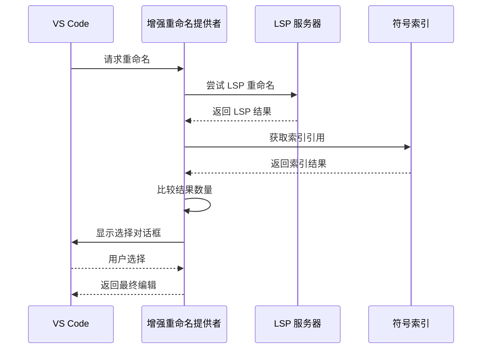

**图表来源**
- [CangjieEnhancedRenameProvider.ts:31-78](file://src/services/cangjie-lsp/CangjieEnhancedRenameProvider.ts#L31-L78)

**章节来源**
- [CangjieEnhancedRenameProvider.ts:1-126](file://src/services/cangjie-lsp/CangjieEnhancedRenameProvider.ts#L1-L126)

## 依赖关系分析

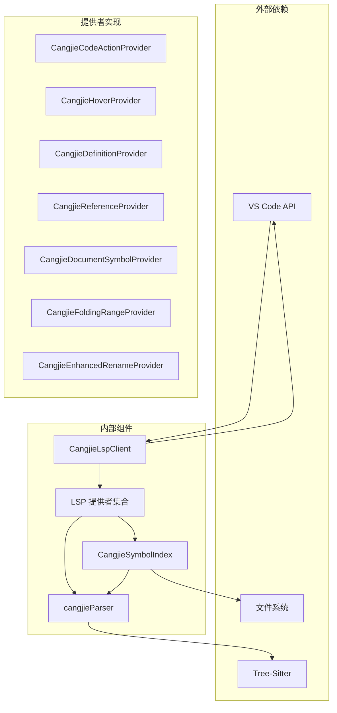

**图表来源**
- [CangjieLspClient.ts:1-660](file://src/services/cangjie-lsp/CangjieLspClient.ts#L1-L660)
- [CangjieSymbolIndex.ts:1-470](file://src/services/cangjie-lsp/CangjieSymbolIndex.ts#L1-L470)

### 组件耦合度分析

| 组件 | 内聚性 | 耦合度 | 主要依赖 |
|------|--------|--------|----------|
| CangjieCodeActionProvider | 高 | 低 | cangjieParser |
| CangjieHoverProvider | 高 | 低 | cangjieParser |
| CangjieDefinitionProvider | 中 | 高 | CangjieSymbolIndex |
| CangjieReferenceProvider | 中 | 高 | CangjieSymbolIndex |
| CangjieDocumentSymbolProvider | 高 | 低 | cangjieParser |
| CangjieFoldingRangeProvider | 高 | 低 | cangjieParser |
| CangjieEnhancedRenameProvider | 中 | 中 | CangjieSymbolIndex |

**章节来源**
- [CangjieSymbolIndex.ts:1-470](file://src/services/cangjie-lsp/CangjieSymbolIndex.ts#L1-L470)
- [cangjieParser.ts:1-538](file://src/services/tree-sitter/cangjieParser.ts#L1-L538)

## 性能考虑

### 缓存策略

1. **符号索引缓存**
   - 内存中的符号索引表
   - 文件修改时间戳缓存
   - 自动保存机制（5秒延迟）

2. **解析结果缓存**
   - 正则表达式编译结果缓存
   - 解析器输出缓存
   - 文件内容缓存

3. **查询优化**
   - 前缀索引用于快速查找
   - 限制查询结果数量
   - 批量处理文件更新

### 性能优化技术

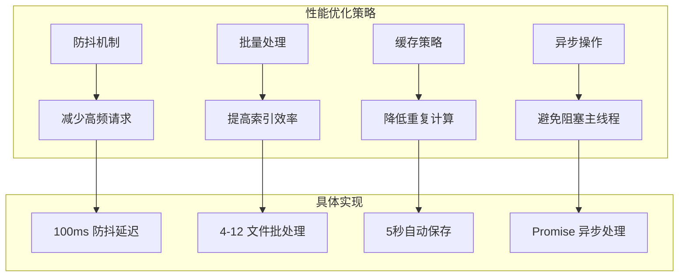

**图表来源**
- [CangjieLspClient.ts:20-44](file://src/services/cangjie-lsp/CangjieLspClient.ts#L20-L44)
- [CangjieSymbolIndex.ts:132-139](file://src/services/cangjie-lsp/CangjieSymbolIndex.ts#L132-L139)

### 性能监控

- **启动时间监控**：记录 LSP 服务器启动耗时
- **首次响应时间**：跟踪首次完成和悬停响应时间
- **索引构建统计**：记录索引构建过程中的文件数量和耗时

**章节来源**
- [CangjieLspClient.ts:491-516](file://src/services/cangjie-lsp/CangjieLspClient.ts#L491-L516)
- [CangjieSymbolIndex.ts:153-194](file://src/services/cangjie-lsp/CangjieSymbolIndex.ts#L153-L194)

## 故障排除指南

### 常见问题及解决方案

#### LSP 服务器启动失败

**症状**：无法启动 Cangjie 语言服务器
**原因**：
- CANGJIE_HOME 环境变量未设置
- 服务器二进制文件不存在
- 权限不足

**解决方案**：
1. 设置正确的 CANGJIE_HOME 环境变量
2. 在设置中配置服务器路径
3. 确保服务器二进制文件具有执行权限

#### 符号索引不准确

**症状**：定义跳转或引用查找结果不正确
**原因**：
- 索引文件损坏
- 文件监控失效
- 缓存过期

**解决方案**：
1. 重启语言服务器
2. 手动触发索引重建
3. 检查文件权限和路径

#### 性能问题

**症状**：代码补全或悬停响应缓慢
**原因**：
- 工作区文件过多
- 索引未完全构建
- 系统资源不足

**解决方案**：
1. 限制工作区大小
2. 等待索引完全构建
3. 关闭不必要的文件

### 错误处理机制

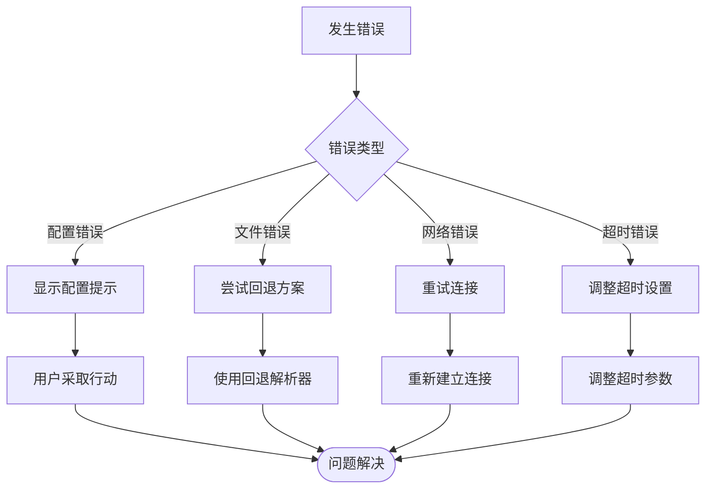

**图表来源**
- [CangjieLspClient.ts:567-594](file://src/services/cangjie-lsp/CangjieLspClient.ts#L567-L594)
- [CangjieSymbolIndex.ts:200-231](file://src/services/cangjie-lsp/CangjieSymbolIndex.ts#L200-L231)

**章节来源**
- [CangjieLspClient.ts:546-564](file://src/services/cangjie-lsp/CangjieLspClient.ts#L546-L564)
- [CangjieSymbolIndex.ts:85-101](file://src/services/cangjie-lsp/CangjieSymbolIndex.ts#L85-L101)

## 结论

该 LSP 提供者实现展现了现代语言服务的最佳实践：

### 技术优势

1. **模块化设计**：各个提供者职责明确，耦合度低
2. **性能优化**：多层次缓存和异步处理机制
3. **容错能力**：完善的错误处理和回退机制
4. **扩展性**：易于添加新的提供者和功能

### 架构特点

- **分层架构**：清晰的抽象层次和职责分离
- **事件驱动**：基于文件系统事件的实时更新
- **智能合并**：VS Code 多提供者结果的智能合并
- **配置灵活**：丰富的配置选项满足不同需求

### 未来改进方向

1. **增量索引**：实现更高效的增量符号索引更新
2. **分布式缓存**：支持多工作区间的符号共享
3. **AI 辅助**：集成 AI 能力提供更智能的代码建议
4. **性能监控**：增强性能指标收集和分析能力

该实现为 Cangjie 语言提供了完整而高效的语言服务支持，为开发者提供了流畅的编程体验。