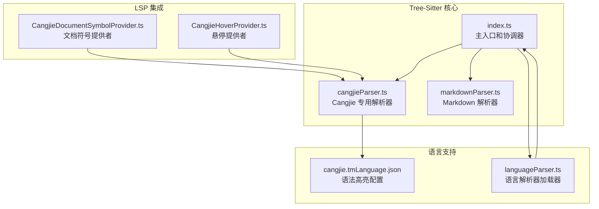
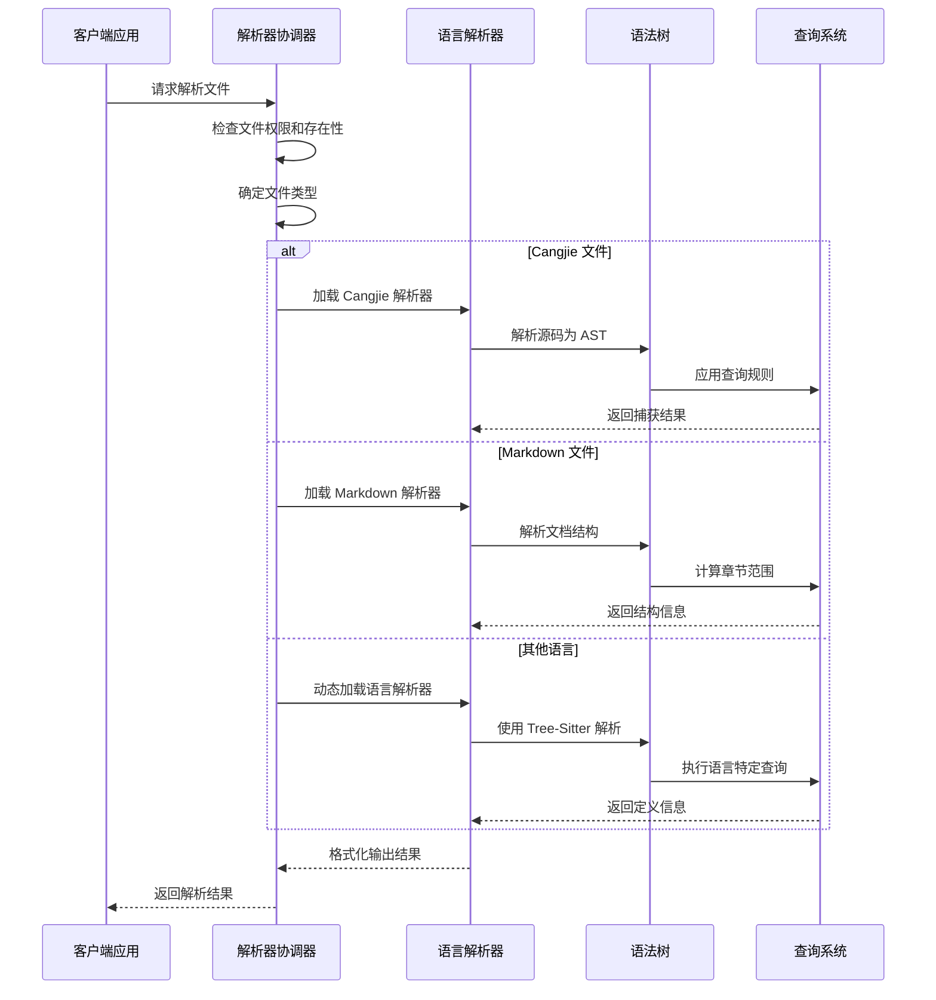
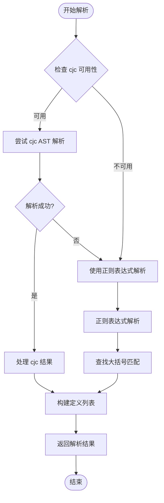
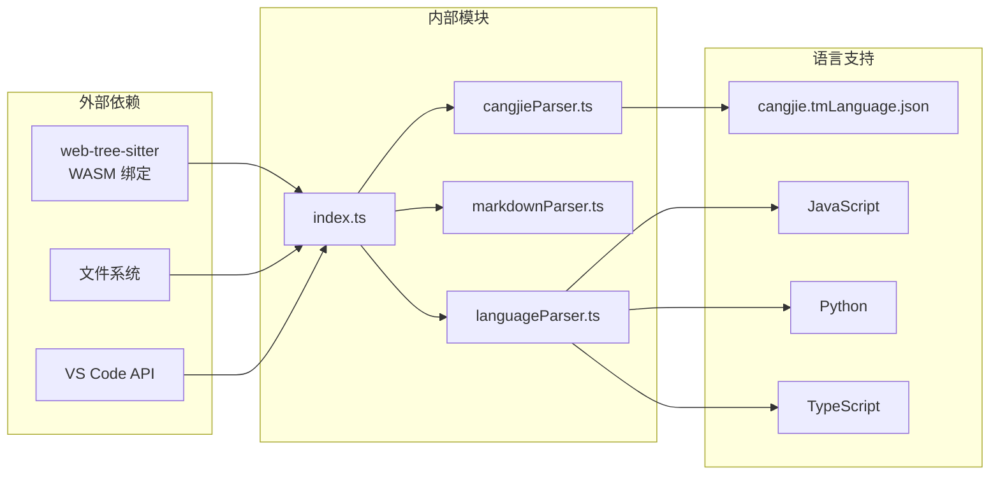

# Tree-Sitter 解析器集成

<cite>
**本文档引用的文件**
- [cangjieParser.ts](file://src/services/tree-sitter/cangjieParser.ts)
- [index.ts](file://src/services/tree-sitter/index.ts)
- [markdownParser.ts](file://src/services/tree-sitter/markdownParser.ts)
- [cangjie.tmLanguage.json](file://src/syntaxes/cangjie.tmLanguage.json)
- [CangjieDocumentSymbolProvider.ts](file://src/services/cangjie-lsp/CangjieDocumentSymbolProvider.ts)
- [CangjieHoverProvider.ts](file://src/services/cangjie-lsp/CangjieHoverProvider.ts)
</cite>

## 目录
1. [简介](#简介)
2. [项目结构](#项目结构)
3. [核心组件](#核心组件)
4. [架构概览](#架构概览)
5. [详细组件分析](#详细组件分析)
6. [依赖关系分析](#依赖关系分析)
7. [性能考虑](#性能考虑)
8. [故障排除指南](#故障排除指南)
9. [结论](#结论)

## 简介

本项目实现了完整的 Tree-Sitter 解析器集成，支持多种编程语言和 Cangjie 语言的代码解析。该系统提供了高效的语法查询、解析树构建机制、语法高亮规则和代码折叠功能。特别针对 Cangjie 语言，实现了专用的解析器和语法配置。

系统采用模块化设计，支持增量解析、错误恢复策略，并提供了丰富的查询系统来提取代码结构信息。通过 Tree-Sitter 的 WASM 绑定，实现了高性能的语法分析能力。

## 项目结构

Tree-Sitter 解析器集成位于 `src/services/tree-sitter/` 目录下，包含以下关键组件：

**图表来源**
- [index.ts:1-352](file://src/services/tree-sitter/index.ts#L1-L352)
- [cangjieParser.ts:1-538](file://src/services/tree-sitter/cangjieParser.ts#L1-L538)
- [markdownParser.ts:1-228](file://src/services/tree-sitter/markdownParser.ts#L1-L228)

**章节来源**
- [index.ts:100-169](file://src/services/tree-sitter/index.ts#L100-L169)
- [cangjieParser.ts:145-195](file://src/services/tree-sitter/cangjieParser.ts#L145-L195)

## 核心组件

### 主解析器协调器

`index.ts` 是整个 Tree-Sitter 解析系统的主入口，负责协调不同语言的解析器工作。

**主要功能：**
- 支持 30+ 种编程语言的解析
- 统一的解析接口和输出格式
- 错误处理和访问控制
- HTML 元素过滤机制

**章节来源**
- [index.ts:30-98](file://src/services/tree-sitter/index.ts#L30-L98)
- [index.ts:100-169](file://src/services/tree-sitter/index.ts#L100-L169)

### Cangjie 专用解析器

`cangjieParser.ts` 实现了 Cangjie 语言的专用解析器，提供两种解析策略：

**双策略架构：**
1. **正则表达式解析器** - 快速、无外部依赖
2. **cjc AST 集成解析器** - 基于编译器的精确解析

**支持的定义类型：**
- 类、结构体、接口、枚举
- 函数、宏、初始化器
- 变量、属性、操作符重载
- 扩展、类型别名、包导入

**章节来源**
- [cangjieParser.ts:41-64](file://src/services/tree-sitter/cangjieParser.ts#L41-L64)
- [cangjieParser.ts:70-87](file://src/services/tree-sitter/cangjieParser.ts#L70-L87)

### Markdown 解析器

`markdownParser.ts` 提供了专门的 Markdown 解析功能，用于文档结构提取。

**功能特性：**
- 支持 ATX 和 Setext 标题格式
- 自动计算章节范围
- 与 Tree-Sitter 捕获系统兼容

**章节来源**
- [markdownParser.ts:38-184](file://src/services/tree-sitter/markdownParser.ts#L38-L184)

## 架构概览

系统采用分层架构设计，确保了良好的可扩展性和维护性：

**图表来源**
- [index.ts:100-169](file://src/services/tree-sitter/index.ts#L100-L169)
- [cangjieParser.ts:338-342](file://src/services/tree-sitter/cangjieParser.ts#L338-L342)

## 详细组件分析

### Cangjie 解析器实现

Cangjie 解析器采用了混合策略来平衡性能和准确性：

**图表来源**
- [cangjieParser.ts:530-537](file://src/services/tree-sitter/cangjieParser.ts#L530-L537)
- [cangjieParser.ts:145-195](file://src/services/tree-sitter/cangjieParser.ts#L145-L195)

**章节来源**
- [cangjieParser.ts:357-380](file://src/services/tree-sitter/cangjieParser.ts#L357-L380)
- [cangjieParser.ts:482-524](file://src/services/tree-sitter/cangjieParser.ts#L482-L524)

### 语法查询定义系统

系统实现了灵活的查询系统来提取代码结构信息：

**查询捕获机制：**
- `name.definition.{kind}` - 定义名称捕获
- `definition.{kind}` - 定义主体捕获
- 支持多级嵌套结构识别

**章节来源**
- [cangjieParser.ts:306-333](file://src/services/tree-sitter/cangjieParser.ts#L306-L333)
- [index.ts:204-304](file://src/services/tree-sitter/index.ts#L204-L304)

### 语法高亮规则

Cangjie 语言的语法高亮通过 `cangjie.tmLanguage.json` 配置实现：

**高亮类别：**
- 字符串字面量（支持三引号和原始字符串）
- 注释（单行和块注释）
- 数字字面量（支持多种进制）
- 关键字和修饰符
- 类型和标识符
- 操作符和标点符号

**章节来源**
- [cangjie.tmLanguage.json:18-392](file://src/syntaxes/cangjie.tmLanguage.json#L18-L392)

### 代码折叠逻辑

系统实现了智能的代码折叠功能：

**折叠规则：**
- 基于大括号匹配的代码块识别
- 支持嵌套结构的正确折叠
- 限制最小折叠行数以避免过度折叠

**章节来源**
- [cangjieParser.ts:96-133](file://src/services/tree-sitter/cangjieParser.ts#L96-L133)
- [index.ts:248-251](file://src/services/tree-sitter/index.ts#L248-L251)

## 依赖关系分析

**图表来源**
- [index.ts:1-8](file://src/services/tree-sitter/index.ts#L1-L8)
- [cangjieParser.ts:14-22](file://src/services/tree-sitter/cangjieParser.ts#L14-L22)

**章节来源**
- [index.ts:30-98](file://src/services/tree-sitter/index.ts#L30-L98)
- [cangjieParser.ts:357-380](file://src/services/tree-sitter/cangjieParser.ts#L357-L380)

## 性能考虑

### 解析器性能优化

**缓存策略：**
- 重复解析的结果缓存
- 语言解析器的懒加载
- 大文件的分块处理

**内存管理：**
- 及时释放解析树资源
- 避免不必要的字符串复制
- 控制正则表达式的复杂度

**并发处理：**
- 多文件并行解析
- 异步文件读取
- 解析超时控制

### 增量解析支持

系统支持增量解析以提高编辑器响应速度：

**增量更新机制：**
- 基于文本变更的局部重解析
- 语法树的增量重建
- 查询结果的增量更新

**章节来源**
- [index.ts:334-351](file://src/services/tree-sitter/index.ts#L334-L351)
- [cangjieParser.ts:530-537](file://src/services/tree-sitter/cangjieParser.ts#L530-L537)

## 故障排除指南

### 常见问题及解决方案

**Cangjie 解析失败：**
- 检查 `cjc` 可执行文件路径配置
- 验证 Cangjie SDK 是否正确安装
- 确认源码语法是否符合规范

**Tree-Sitter 解析错误：**
- 检查 WASM 文件是否正确加载
- 验证语言语法文件完整性
- 确认文件编码格式正确

**性能问题：**
- 调整最小组件行数阈值
- 启用适当的缓存策略
- 优化正则表达式模式

**章节来源**
- [cangjieParser.ts:482-524](file://src/services/tree-sitter/cangjieParser.ts#L482-L524)
- [index.ts:346-350](file://src/services/tree-sitter/index.ts#L346-L350)

### 错误恢复策略

系统实现了多层次的错误恢复机制：

**渐进式降级：**
1. 首选精确解析（cjc AST）
2. 回退到快速解析（正则表达式）
3. 最终使用基础解析功能

**容错处理：**
- 解析异常的静默处理
- 部分解析结果的合理利用
- 用户友好的错误提示

**章节来源**
- [cangjieParser.ts:530-537](file://src/services/tree-sitter/cangjieParser.ts#L530-L537)
- [index.ts:346-350](file://src/services/tree-sitter/index.ts#L346-L350)

## 结论

本 Tree-Sitter 解析器集成为 Cangjie 语言和其他多种编程语言提供了强大的代码分析能力。通过混合解析策略、智能查询系统和完善的错误处理机制，系统在准确性和性能之间取得了良好平衡。

**主要优势：**
- 支持 30+ 种编程语言
- Cangjie 语言的专用优化
- 高效的增量解析支持
- 完善的语法高亮和代码折叠
- 良好的错误恢复能力

**未来改进方向：**
- 进一步优化大型文件的解析性能
- 扩展更多语言的支持
- 增强语义分析功能
- 改进解析器的准确性

该系统为代码索引、智能代码补全、文档生成等高级功能奠定了坚实的基础，是现代开发工具链的重要组成部分。