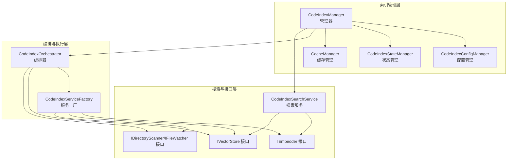
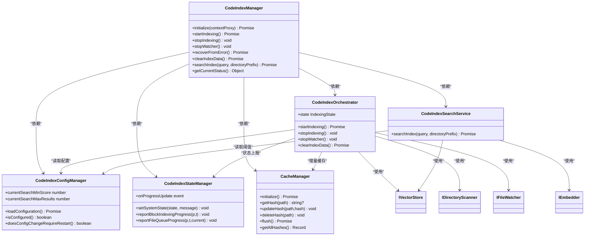
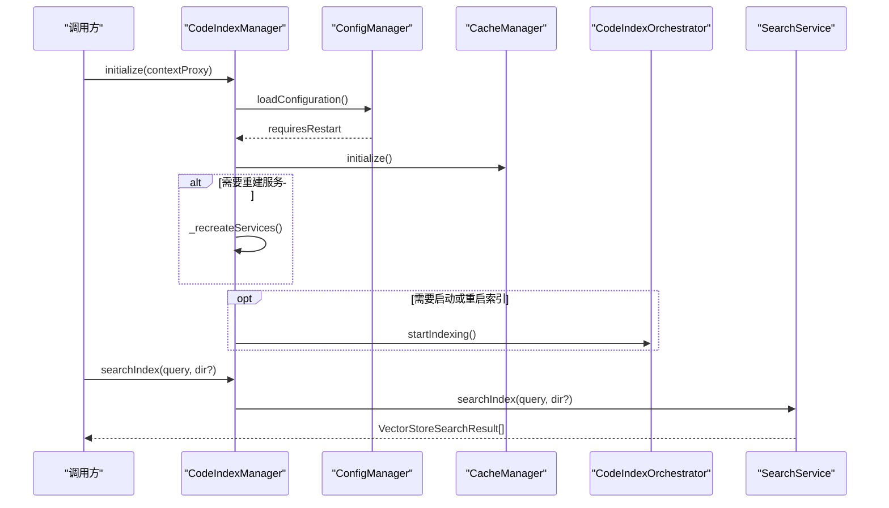
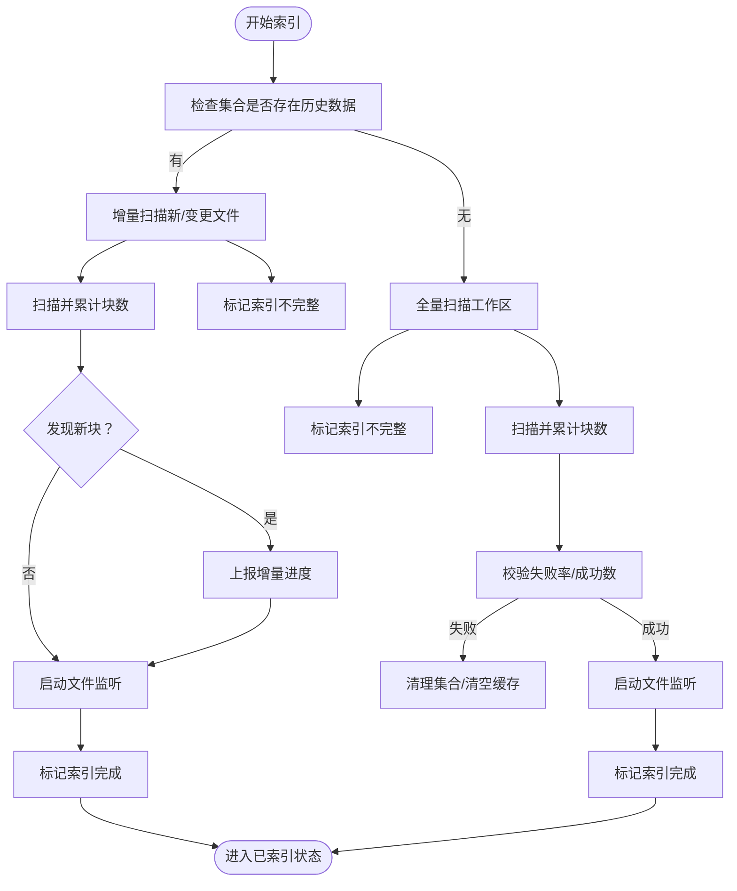
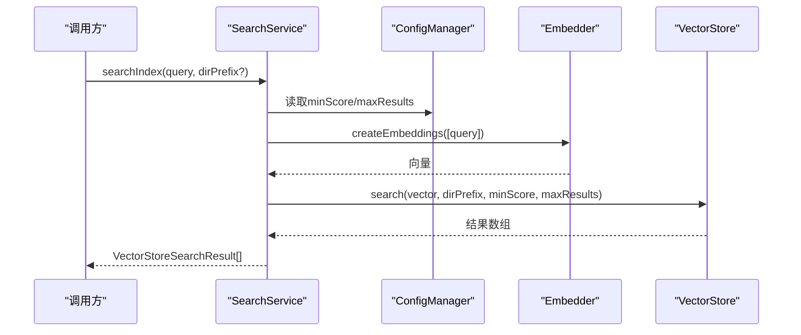
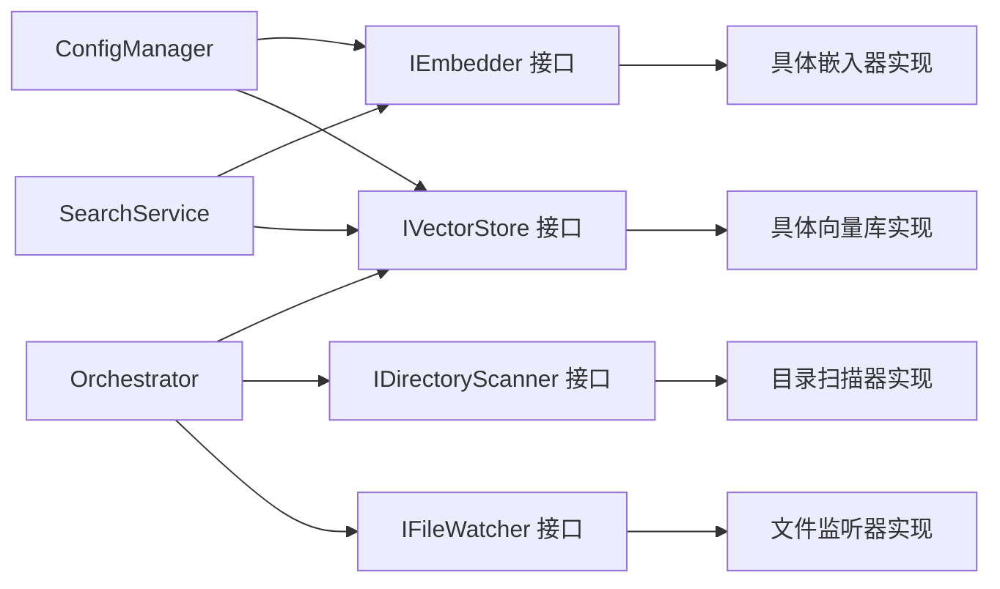
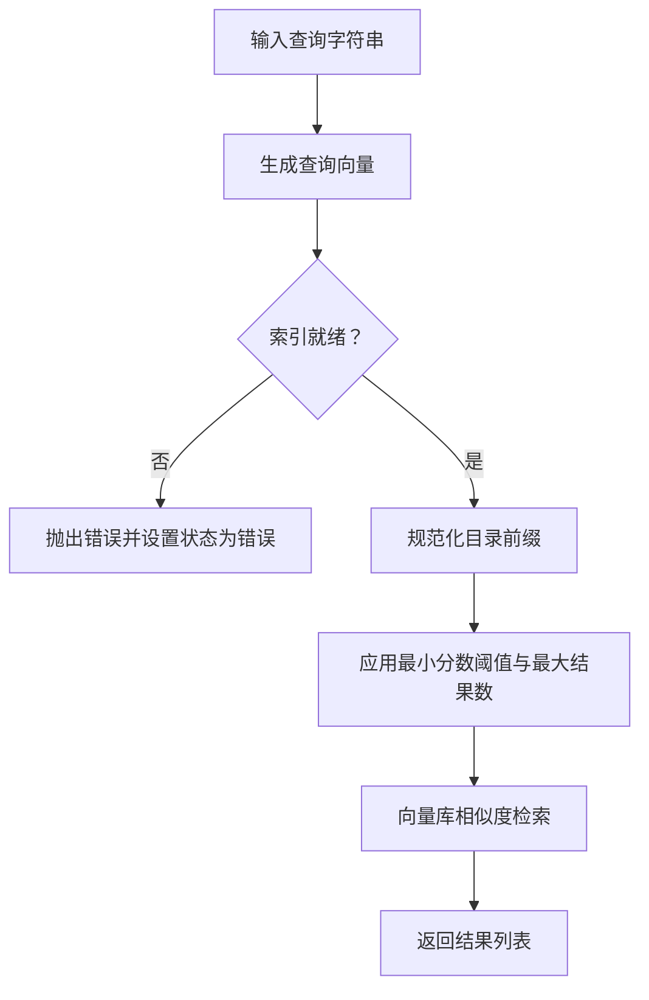

# 代码索引架构

<cite>
**本文档引用的文件**
- [manager.ts](file://src/services/code-index/manager.ts)
- [search-service.ts](file://src/services/code-index/search-service.ts)
- [orchestrator.ts](file://src/services/code-index/orchestrator.ts)
- [state-manager.ts](file://src/services/code-index/state-manager.ts)
- [cache-manager.ts](file://src/services/code-index/cache-manager.ts)
- [config-manager.ts](file://src/services/code-index/config-manager.ts)
- [interfaces/index.ts](file://src/services/code-index/interfaces/index.ts)
- [interfaces/embedder.ts](file://src/services/code-index/interfaces/embedder.ts)
- [interfaces/vector-store.ts](file://src/services/code-index/interfaces/vector-store.ts)
- [interfaces/file-processor.ts](file://src/services/code-index/interfaces/file-processor.ts)
- [interfaces/manager.ts](file://src/services/code-index/interfaces/manager.ts)
- [constants/index.ts](file://src/services/code-index/constants/index.ts)
</cite>

## 目录
1. [简介](#简介)
2. [项目结构](#项目结构)
3. [核心组件](#核心组件)
4. [架构总览](#架构总览)
5. [详细组件分析](#详细组件分析)
6. [依赖关系分析](#依赖关系分析)
7. [性能考虑](#性能考虑)
8. [故障排除指南](#故障排除指南)
9. [结论](#结论)
10. [附录](#附录)

## 简介
本文件面向代码索引架构，系统化阐述向量化代码索引系统的设计理念、嵌入模型集成、搜索算法实现与索引构建流程。重点覆盖以下方面：
- 向量化索引：基于嵌入模型生成代码块向量，使用向量数据库（默认 Qdrant）进行相似度检索
- 增量更新：通过文件哈希缓存与文件监听器实现仅变更文件的增量索引
- 缓存策略：本地去抖动持久化缓存，避免重复处理与网络开销
- 搜索与排序：查询向量化后在向量库中检索，结合最小分数阈值与最大结果数进行过滤与排序
- 性能与并发：批处理、并发解析与嵌入、背压与重试机制、状态机驱动的进度报告
- 质量评估与优化：基于失败率与进度指标的质量监控与调优建议

## 项目结构
代码索引模块采用分层与职责分离设计，围绕管理器（Manager）、编排器（Orchestrator）、搜索服务（SearchService）、配置管理（ConfigManager）、状态管理（StateManager）、缓存管理（CacheManager）以及可插拔的嵌入器与向量存储接口展开。

**图表来源**
- [manager.ts:18-92](file://src/services/code-index/manager.ts#L18-L92)
- [orchestrator.ts:14-27](file://src/services/code-index/orchestrator.ts#L14-L27)
- [search-service.ts:11-17](file://src/services/code-index/search-service.ts#L11-L17)
- [config-manager.ts:12-33](file://src/services/code-index/config-manager.ts#L12-L33)
- [state-manager.ts:5-11](file://src/services/code-index/state-manager.ts#L5-L11)
- [cache-manager.ts:10-31](file://src/services/code-index/cache-manager.ts#L10-L31)

**章节来源**
- [manager.ts:18-92](file://src/services/code-index/manager.ts#L18-L92)
- [orchestrator.ts:14-27](file://src/services/code-index/orchestrator.ts#L14-L27)
- [search-service.ts:11-17](file://src/services/code-index/search-service.ts#L11-L17)
- [config-manager.ts:12-33](file://src/services/code-index/config-manager.ts#L12-L33)
- [state-manager.ts:5-11](file://src/services/code-index/state-manager.ts#L5-L11)
- [cache-manager.ts:10-31](file://src/services/code-index/cache-manager.ts#L10-L31)

## 核心组件
- 管理器（CodeIndexManager）
  - 单例模式，按工作区隔离实例
  - 负责初始化、重启、错误恢复、清理数据、对外提供搜索接口
- 编排器（CodeIndexOrchestrator）
  - 控制索引进程：全量扫描、增量扫描、文件监听、批处理、错误清理
  - 维护“索引完成/不完整”元数据，确保一致性
- 搜索服务（CodeIndexSearchService）
  - 将查询文本向量化，调用向量库检索并返回带分数的结果
- 配置管理（CodeIndexConfigManager）
  - 加载/校验嵌入模型提供商、API密钥、Qdrant连接参数、搜索阈值与结果上限
  - 判断配置变更是否需要重启服务
- 状态管理（CodeIndexStateManager）
  - 统一的状态机与事件发布，支持块级与文件队列级进度上报
- 缓存管理（CacheManager）
  - 基于工作区路径的去抖保存，记录文件哈希以支持增量扫描

**章节来源**
- [manager.ts:18-466](file://src/services/code-index/manager.ts#L18-L466)
- [orchestrator.ts:14-399](file://src/services/code-index/orchestrator.ts#L14-L399)
- [search-service.ts:11-66](file://src/services/code-index/search-service.ts#L11-L66)
- [config-manager.ts:12-545](file://src/services/code-index/config-manager.ts#L12-L545)
- [state-manager.ts:5-120](file://src/services/code-index/state-manager.ts#L5-L120)
- [cache-manager.ts:10-111](file://src/services/code-index/cache-manager.ts#L10-L111)

## 架构总览
整体架构遵循“管理器-编排器-服务工厂-接口”的分层设计，通过接口抽象嵌入器与向量存储，便于替换不同提供商与后端。

**图表来源**
- [manager.ts:18-466](file://src/services/code-index/manager.ts#L18-L466)
- [orchestrator.ts:14-399](file://src/services/code-index/orchestrator.ts#L14-L399)
- [search-service.ts:11-66](file://src/services/code-index/search-service.ts#L11-L66)
- [config-manager.ts:12-545](file://src/services/code-index/config-manager.ts#L12-L545)
- [state-manager.ts:5-120](file://src/services/code-index/state-manager.ts#L5-L120)
- [cache-manager.ts:10-111](file://src/services/code-index/cache-manager.ts#L10-L111)

## 详细组件分析

### 管理器（CodeIndexManager）
- 单例与工作区隔离：按工作区路径映射实例，确保多工作区独立运行
- 初始化流程：加载配置 → 校验启用状态 → 创建缓存 → 重建服务 → 可选启动索引
- 错误恢复：清空服务实例并设置“待机”状态，等待重新初始化
- 对外接口：搜索、停止索引/监听、清理数据、状态查询

**图表来源**
- [manager.ts:162-214](file://src/services/code-index/manager.ts#L162-L214)
- [manager.ts:348-424](file://src/services/code-index/manager.ts#L348-L424)
- [search-service.ts:27-64](file://src/services/code-index/search-service.ts#L27-L64)

**章节来源**
- [manager.ts:162-214](file://src/services/code-index/manager.ts#L162-L214)
- [manager.ts:223-240](file://src/services/code-index/manager.ts#L223-L240)
- [manager.ts:277-301](file://src/services/code-index/manager.ts#L277-L301)
- [manager.ts:315-322](file://src/services/code-index/manager.ts#L315-L322)
- [manager.ts:336-342](file://src/services/code-index/manager.ts#L336-L342)
- [manager.ts:348-424](file://src/services/code-index/manager.ts#L348-L424)

### 编排器（CodeIndexOrchestrator）
- 全量扫描与增量扫描：根据集合是否存在历史数据决定扫描策略；增量扫描前标记“不完整”，完成后标记“完成”
- 文件监听：订阅批量开始/进度/结束事件，动态更新状态与消息
- 批处理与错误处理：统计成功/失败计数，计算失败率，超过阈值抛出异常；支持中断与清理
- 清理与回收：停止监听、删除集合、清空缓存文件

**图表来源**
- [orchestrator.ts:128-296](file://src/services/code-index/orchestrator.ts#L128-L296)
- [orchestrator.ts:297-333](file://src/services/code-index/orchestrator.ts#L297-L333)
- [orchestrator.ts:365-390](file://src/services/code-index/orchestrator.ts#L365-L390)

**章节来源**
- [orchestrator.ts:92-333](file://src/services/code-index/orchestrator.ts#L92-L333)
- [orchestrator.ts:335-390](file://src/services/code-index/orchestrator.ts#L335-L390)

### 搜索服务（CodeIndexSearchService）
- 查询流程：校验功能与配置 → 生成查询向量 → 规范化目录前缀 → 调用向量库检索 → 返回结果
- 参数来源：从配置管理器获取最小分数阈值与最大结果数
- 错误处理：捕获异常并设置系统状态为“错误”，随后重新抛出

**图表来源**
- [search-service.ts:27-64](file://src/services/code-index/search-service.ts#L27-L64)
- [config-manager.ts:525-543](file://src/services/code-index/config-manager.ts#L525-L543)

**章节来源**
- [search-service.ts:27-64](file://src/services/code-index/search-service.ts#L27-L64)

### 配置管理（CodeIndexConfigManager）
- 提供商与凭据：支持 OpenAI、Ollama、OpenAI-Compatible、Gemini、Mistral、Vercel AI Gateway、Bedrock、OpenRouter
- 连接参数：Qdrant URL/Key、模型ID、维度、搜索阈值、最大结果数
- 重启判定：当提供商、认证信息、模型维度、Qdrant连接或启用状态发生关键变化时要求重启
- 搜索阈值：优先用户设置，其次模型特定阈值，最后默认常量

**章节来源**
- [config-manager.ts:12-545](file://src/services/code-index/config-manager.ts#L12-L545)
- [constants/index.ts:9-32](file://src/services/code-index/constants/index.ts#L9-L32)

### 状态管理（CodeIndexStateManager）
- 状态机：Standby → Indexing → Indexed → Error → Stopping
- 进度上报：块级进度（单位“blocks”）与文件队列进度（单位“files”），自动触发事件
- 事件发布：通过 VS Code 事件机制向外广播状态变化

**章节来源**
- [state-manager.ts:3-120](file://src/services/code-index/state-manager.ts#L3-L120)

### 缓存管理（CacheManager）
- 去抖写入：1.5 秒内多次更新合并为一次磁盘写入
- 存储位置：基于工作区路径的全局存储 URI，文件名包含工作区路径的 SHA256 哈希
- 功能：读取/写入/清空缓存文件；按需立即落盘；提供全部哈希快照

**章节来源**
- [cache-manager.ts:10-111](file://src/services/code-index/cache-manager.ts#L10-L111)

## 依赖关系分析
- 接口抽象：通过 IEmbedder、IVectorStore、IDirectoryScanner、IFileWatcher 定义清晰边界，便于替换实现
- 配置驱动：所有外部服务（嵌入器、向量库、文件系统）均通过配置管理器注入
- 事件驱动：状态管理器与文件监听器通过事件传递进度与状态

**图表来源**
- [interfaces/embedder.ts:5-44](file://src/services/code-index/interfaces/embedder.ts#L5-L44)
- [interfaces/vector-store.ts:10-98](file://src/services/code-index/interfaces/vector-store.ts#L10-L98)
- [interfaces/file-processor.ts:7-118](file://src/services/code-index/interfaces/file-processor.ts#L7-L118)
- [config-manager.ts:12-545](file://src/services/code-index/config-manager.ts#L12-L545)

**章节来源**
- [interfaces/index.ts:1-5](file://src/services/code-index/interfaces/index.ts#L1-L5)
- [interfaces/embedder.ts:5-44](file://src/services/code-index/interfaces/embedder.ts#L5-L44)
- [interfaces/vector-store.ts:10-98](file://src/services/code-index/interfaces/vector-store.ts#L10-L98)
- [interfaces/file-processor.ts:7-118](file://src/services/code-index/interfaces/file-processor.ts#L7-L118)
- [config-manager.ts:12-545](file://src/services/code-index/config-manager.ts#L12-L545)

## 性能考虑
- 批处理与并发
  - 扫描批大小阈值与最大批数量：避免内存峰值与网络拥塞
  - 并发解析与嵌入：解析与嵌入并发度可控，降低端到端延迟
- 重试与容错
  - 批处理重试次数与初始延迟：在瞬时网络波动下提升成功率
- 缓存与增量
  - 文件哈希缓存：跳过未变更文件，显著减少重复处理
  - 增量扫描：仅处理新增/修改文件，缩短索引周期
- 搜索优化
  - 最小分数阈值与最大结果数：在召回与性能间平衡
  - 目录前缀过滤：缩小搜索空间，提高响应速度

**章节来源**
- [constants/index.ts:17-32](file://src/services/code-index/constants/index.ts#L17-L32)
- [cache-manager.ts:28-31](file://src/services/code-index/cache-manager.ts#L28-L31)
- [config-manager.ts:525-543](file://src/services/code-index/config-manager.ts#L525-L543)

## 故障排除指南
- 索引失败
  - 现象：状态变为“错误”，可能伴随“索引部分失败/完全失败”提示
  - 处理：编排器会清理集合并清空缓存，防止缓存与向量库不一致；随后可尝试恢复并重新初始化
- 搜索失败
  - 现象：搜索服务设置系统状态为“错误”，并重新抛出异常
  - 处理：检查嵌入器与向量库连通性、凭据与模型配置
- 监听器异常
  - 现象：文件监听事件回调中出现批处理错误
  - 处理：关注批处理汇总中的错误原因，必要时调整并发与批大小

**章节来源**
- [orchestrator.ts:297-333](file://src/services/code-index/orchestrator.ts#L297-L333)
- [search-service.ts:58-64](file://src/services/code-index/search-service.ts#L58-L64)

## 结论
该代码索引架构以接口抽象为核心，通过配置驱动与事件驱动实现高扩展性与可观测性。管理器负责生命周期与对外接口，编排器协调索引流程与错误恢复，搜索服务提供统一检索入口，状态与缓存管理保障性能与一致性。整体设计兼顾了大规模代码库的实时更新与查询性能需求，并提供了完善的错误处理与质量评估手段。

## 附录

### 搜索流程图（代码层面）

**图表来源**
- [search-service.ts:27-64](file://src/services/code-index/search-service.ts#L27-L64)
- [config-manager.ts:525-543](file://src/services/code-index/config-manager.ts#L525-L543)