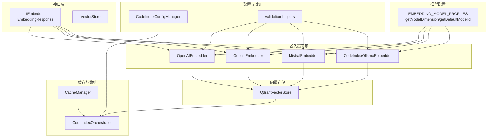
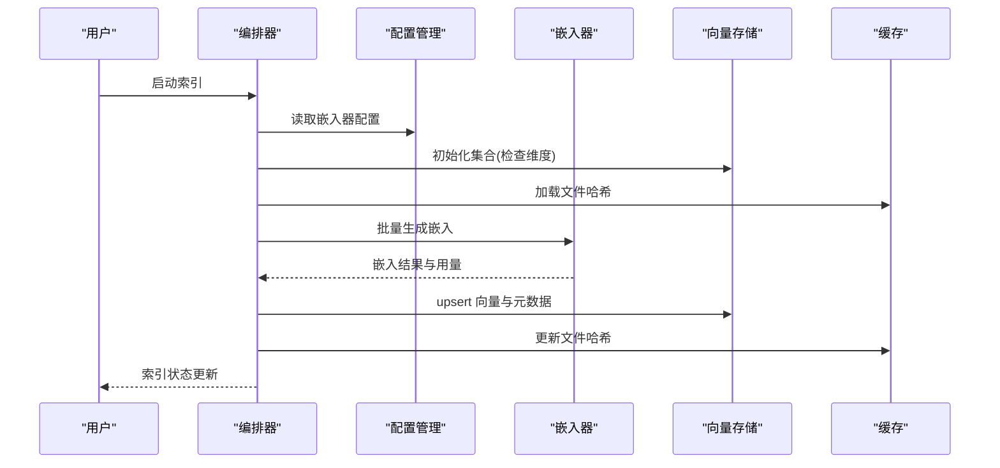
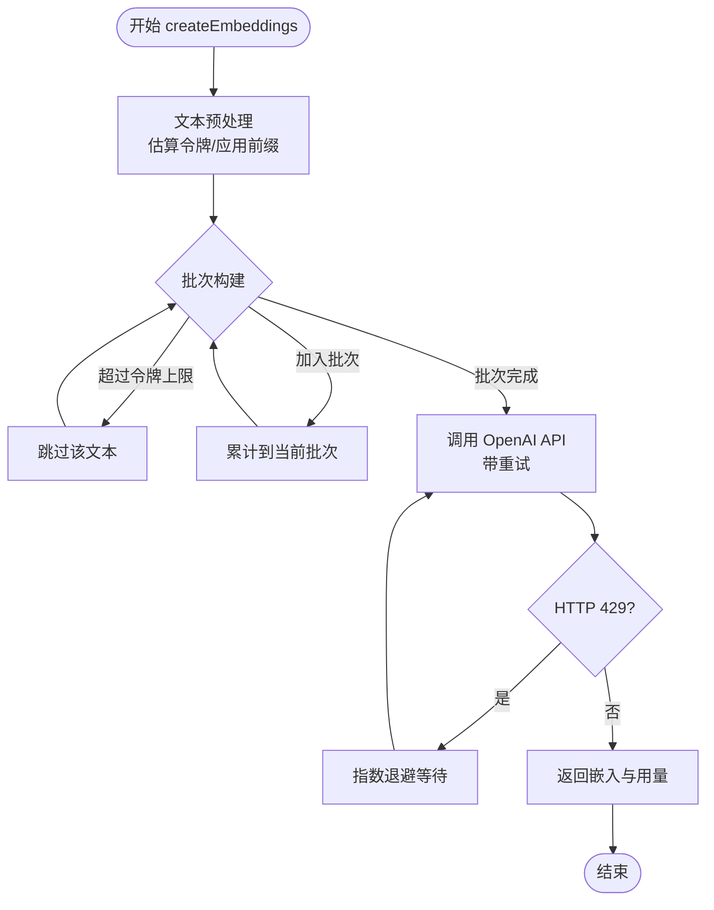
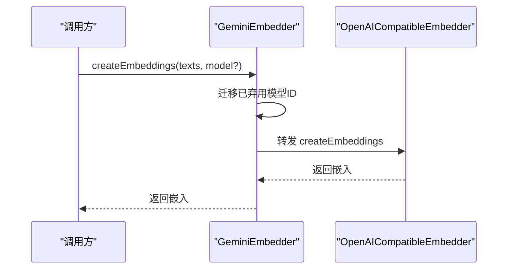
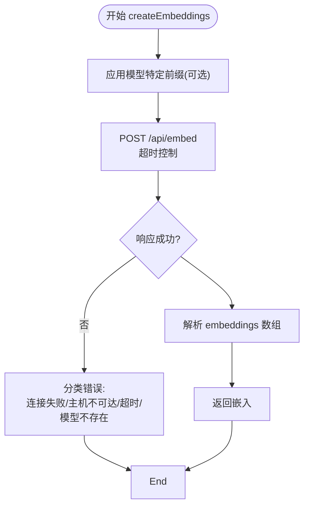
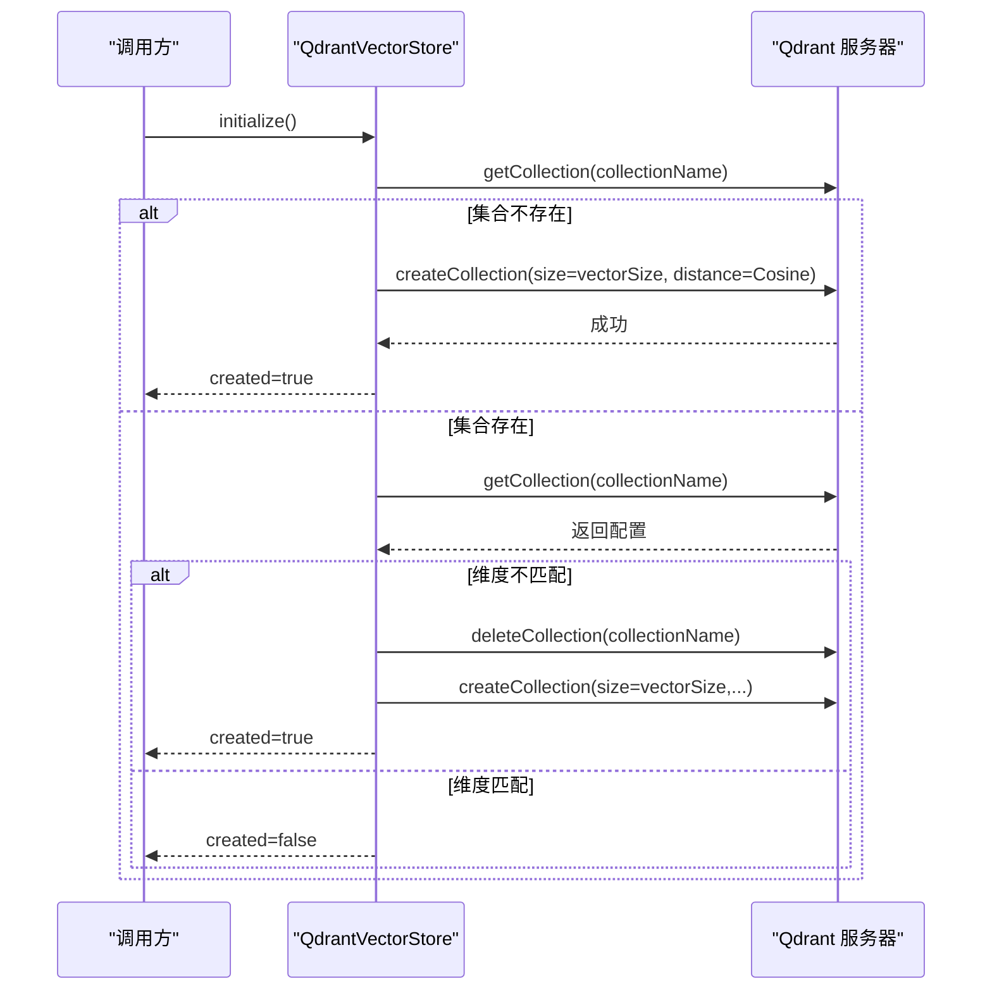
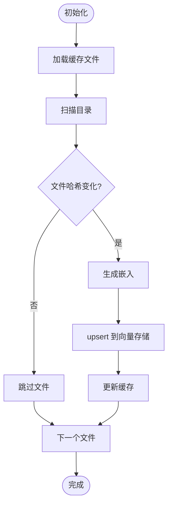
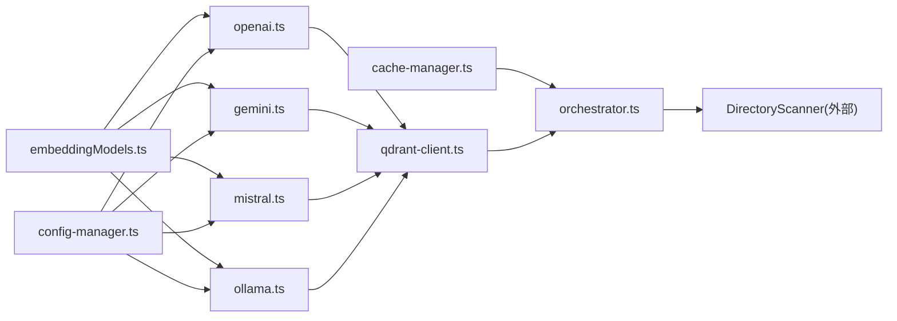
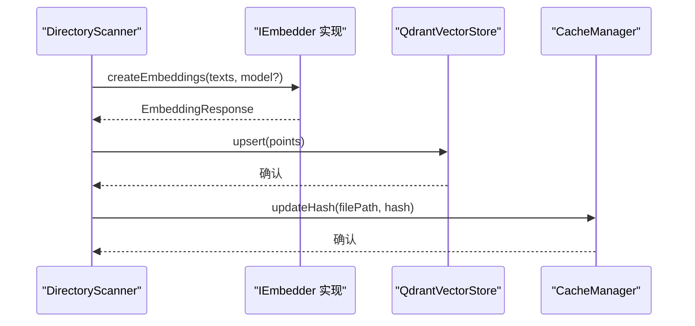

# 向量嵌入系统

<cite>
**本文档引用的文件**
- [embedder.ts](file://src/services/code-index/interfaces/embedder.ts)
- [embeddingModels.ts](file://src/shared/embeddingModels.ts)
- [openai.ts](file://src/services/code-index/embedders/openai.ts)
- [gemini.ts](file://src/services/code-index/embedders/gemini.ts)
- [mistral.ts](file://src/services/code-index/embedders/mistral.ts)
- [ollama.ts](file://src/services/code-index/embedders/ollama.ts)
- [qdrant-client.ts](file://src/services/code-index/vector-store/qdrant-client.ts)
- [cache-manager.ts](file://src/services/code-index/cache-manager.ts)
- [orchestrator.ts](file://src/services/code-index/orchestrator.ts)
- [config-manager.ts](file://src/services/code-index/config-manager.ts)
- [validation-helpers.ts](file://src/services/code-index/shared/validation-helpers.ts)
- [vector-store.ts](file://src/services/code-index/interfaces/vector-store.ts)
- [embedding.ts](file://packages/types/src/embedding.ts)
</cite>

## 目录
1. [简介](#简介)
2. [项目结构](#项目结构)
3. [核心组件](#核心组件)
4. [架构总览](#架构总览)
5. [详细组件分析](#详细组件分析)
6. [依赖关系分析](#依赖关系分析)
7. [性能考虑](#性能考虑)
8. [故障排除指南](#故障排除指南)
9. [结论](#结论)
10. [附录](#附录)

## 简介
本文件面向向量嵌入系统，系统支持多种提供商的嵌入模型（OpenAI、Gemini、Mistral、Ollama 等），具备批量嵌入处理、向量存储与检索、缓存与增量更新、错误处理与配置管理等功能。本文档从代码结构、数据流、处理逻辑、集成点、错误处理与性能优化等方面进行深入解析，并提供流程图与配置示例，帮助读者理解并高效使用该系统。

## 项目结构
向量嵌入系统主要由以下模块构成：
- 接口层：定义嵌入器与向量存储接口
- 嵌入器实现：针对不同提供商的具体实现
- 模型配置与维度：统一管理各提供商模型维度与阈值
- 向量存储：基于 Qdrant 的向量数据库客户端
- 缓存与编排：文件哈希缓存与索引进程编排
- 配置与验证：嵌入器与向量存储的配置与校验
- 类型定义：跨包的嵌入类型与模型配置类型

**图表来源**
- [embedder.ts:5-21](file://src/services/code-index/interfaces/embedder.ts#L5-L21)
- [embeddingModels.ts:8-90](file://src/shared/embeddingModels.ts#L8-L90)
- [openai.ts:19-40](file://src/services/code-index/embedders/openai.ts#L19-L40)
- [gemini.ts:16-61](file://src/services/code-index/embedders/gemini.ts#L16-L61)
- [mistral.ts:13-39](file://src/services/code-index/embedders/mistral.ts#L13-L39)
- [ollama.ts:15-28](file://src/services/code-index/embedders/ollama.ts#L15-L28)
- [qdrant-client.ts:13-84](file://src/services/code-index/vector-store/qdrant-client.ts#L13-L84)
- [cache-manager.ts:10-31](file://src/services/code-index/cache-manager.ts#L10-L31)
- [orchestrator.ts:14-27](file://src/services/code-index/orchestrator.ts#L14-L27)
- [config-manager.ts:114-148](file://src/services/code-index/config-manager.ts#L114-L148)
- [validation-helpers.ts:207-229](file://src/services/code-index/shared/validation-helpers.ts#L207-L229)

**章节来源**
- [embedder.ts:1-44](file://src/services/code-index/interfaces/embedder.ts#L1-L44)
- [embeddingModels.ts:1-194](file://src/shared/embeddingModels.ts#L1-L194)
- [qdrant-client.ts:1-685](file://src/services/code-index/vector-store/qdrant-client.ts#L1-L685)
- [cache-manager.ts:1-111](file://src/services/code-index/cache-manager.ts#L1-L111)
- [orchestrator.ts:1-399](file://src/services/code-index/orchestrator.ts#L1-L399)
- [config-manager.ts:114-148](file://src/services/code-index/config-manager.ts#L114-L148)

## 核心组件
- 嵌入器接口与响应
  - IEmbedder 定义了 createEmbeddings 与 validateConfiguration 方法，以及 embedderInfo 属性
  - EmbeddingResponse 包含 embeddings 数组与可选 usage 统计
- 模型维度与默认模型
  - EMBEDDING_MODEL_PROFILES 提供各提供商模型的维度、阈值与查询前缀
  - getModelDimension/getModelScoreThreshold/getModelQueryPrefix 提供维度与阈值查询
  - getDefaultModelId 提供默认具体模型 ID
- 向量存储接口
  - IVectorStore 定义 upsert/search/delete 等操作
- 编排器
  - CodeIndexOrchestrator 协调配置、状态、缓存、扫描与向量存储初始化

**章节来源**
- [embedder.ts:5-29](file://src/services/code-index/interfaces/embedder.ts#L5-L29)
- [embeddingModels.ts:8-145](file://src/shared/embeddingModels.ts#L8-L145)
- [embedding.ts:1-22](file://packages/types/src/embedding.ts#L1-L22)
- [vector-store.ts:1-200](file://src/services/code-index/interfaces/vector-store.ts#L1-L200)
- [orchestrator.ts:14-27](file://src/services/code-index/orchestrator.ts#L14-L27)

## 架构总览
系统采用分层架构：
- 外部提供商适配层：OpenAI、Gemini、Mistral、Ollama
- 统一接口层：IEmbedder
- 配置与模型层：模型维度、阈值、默认模型
- 存储层：QdrantVectorStore
- 缓存与编排层：CacheManager、CodeIndexOrchestrator
- 验证与错误处理：validation-helpers

**图表来源**
- [orchestrator.ts:92-296](file://src/services/code-index/orchestrator.ts#L92-L296)
- [config-manager.ts:114-148](file://src/services/code-index/config-manager.ts#L114-L148)
- [qdrant-client.ts:149-215](file://src/services/code-index/vector-store/qdrant-client.ts#L149-L215)
- [cache-manager.ts:36-43](file://src/services/code-index/cache-manager.ts#L36-L43)
- [openai.ts:48-124](file://src/services/code-index/embedders/openai.ts#L48-L124)

## 详细组件分析

### OpenAI 嵌入器
- 功能要点
  - 支持批量嵌入与令牌限制控制
  - 自适应查询前缀（如需要）
  - 指数退避重试与速率限制处理
  - 配置校验：最小请求验证
- 关键流程
  - 文本预处理（估算令牌、应用前缀、超限警告）
  - 分批嵌入（按令牌上限聚合）
  - 错误处理（429 重试、格式化错误消息）

**图表来源**
- [openai.ts:48-177](file://src/services/code-index/embedders/openai.ts#L48-L177)

**章节来源**
- [openai.ts:19-213](file://src/services/code-index/embedders/openai.ts#L19-L213)
- [validation-helpers.ts:207-229](file://src/services/code-index/shared/validation-helpers.ts#L207-L229)

### Gemini 嵌入器
- 功能要点
  - 基于 OpenAI 兼容接口封装
  - 自动迁移已弃用模型至 gemini-embedding-001
  - 使用固定基础 URL 与最大令牌限制
- 关键流程
  - 构造时迁移模型 ID
  - 转发调用 OpenAI 兼容嵌入器
  - 配置校验委托给兼容实现

**图表来源**
- [gemini.ts:34-76](file://src/services/code-index/embedders/gemini.ts#L34-L76)

**章节来源**
- [gemini.ts:16-102](file://src/services/code-index/embedders/gemini.ts#L16-L102)

### Mistral 嵌入器
- 功能要点
  - 基于 OpenAI 兼容接口封装
  - 固定基础 URL 与最大令牌限制
  - 默认模型 codestral-embed-2505
- 关键流程
  - 构造时设置模型 ID
  - 转发调用 OpenAI 兼容嵌入器
  - 配置校验委托给兼容实现

**章节来源**
- [mistral.ts:13-80](file://src/services/code-index/embedders/mistral.ts#L13-L80)

### Ollama 嵌入器
- 功能要点
  - 本地服务调用，支持自定义基础 URL 与模型 ID
  - 可选查询前缀处理
  - 严格超时控制与连接错误处理
  - 配置校验：服务可用性、模型存在性、可嵌入能力
- 关键流程
  - POST /api/embed 发送数组输入
  - 解析响应中的 embeddings 字段
  - 错误分类：连接失败、主机不可达、超时、模型不存在

**图表来源**
- [ollama.ts:36-129](file://src/services/code-index/embedders/ollama.ts#L36-L129)

**章节来源**
- [ollama.ts:15-263](file://src/services/code-index/embedders/ollama.ts#L15-L263)

### 向量存储（Qdrant）
- 功能要点
  - 自动创建集合、校验向量维度、重建集合以适配维度变化
  - 创建路径分段索引以支持目录过滤
  - upsert、搜索、按路径删除、清空集合、标记索引完成状态
  - URL 解析与协议/端口处理
- 关键流程
  - 初始化：获取集合信息 → 不存在则创建；存在则校验维度 → 不匹配则重建
  - 搜索：构造过滤器（目录前缀与类型排除）→ 查询 → 过滤有效负载
  - 删除：根据路径分段字段匹配删除

**图表来源**
- [qdrant-client.ts:149-215](file://src/services/code-index/vector-store/qdrant-client.ts#L149-L215)

**章节来源**
- [qdrant-client.ts:13-685](file://src/services/code-index/vector-store/qdrant-client.ts#L13-L685)

### 缓存与增量更新
- CacheManager
  - 基于工作区路径生成唯一缓存文件名
  - 文件哈希记录与去抖保存，避免频繁写盘
  - 支持清空缓存文件、获取全部哈希
- 增量更新策略
  - 编排器在启动时检测已有数据，执行增量扫描以处理新增/变更文件
  - 使用缓存判断文件是否需要重新嵌入

**图表来源**
- [cache-manager.ts:36-43](file://src/services/code-index/cache-manager.ts#L36-L43)
- [orchestrator.ts:141-200](file://src/services/code-index/orchestrator.ts#L141-L200)

**章节来源**
- [cache-manager.ts:10-111](file://src/services/code-index/cache-manager.ts#L10-L111)
- [orchestrator.ts:141-200](file://src/services/code-index/orchestrator.ts#L141-L200)

### 配置与模型维度
- 配置管理
  - CodeIndexConfigManager 解析与设置提供商、模型 ID、基础 URL、API Key 等
  - 检测模型维度变化，必要时重启以确保向量维度一致
- 模型维度与阈值
  - EMBEDDING_MODEL_PROFILES 统一维护维度、相似度阈值、查询前缀
  - getModelDimension/getModelScoreThreshold/getModelQueryPrefix 提供查询
  - getDefaultModelId 提供默认具体模型 ID

**章节来源**
- [config-manager.ts:114-148](file://src/services/code-index/config-manager.ts#L114-L148)
- [config-manager.ts:419-440](file://src/services/code-index/config-manager.ts#L419-L440)
- [embeddingModels.ts:8-193](file://src/shared/embeddingModels.ts#L8-L193)

### 错误处理与验证
- 统一错误格式化
  - formatEmbeddingError 根据状态码与错误信息生成用户友好提示
- 验证辅助
  - withValidationErrorHandling 包装验证逻辑，捕获提供商特定错误
- 嵌入器验证
  - OpenAI/Gemini/Mistral/Ollama 均提供 validateConfiguration，覆盖认证、服务可用性、模型存在性等

**章节来源**
- [validation-helpers.ts:207-229](file://src/services/code-index/shared/validation-helpers.ts#L207-L229)
- [openai.ts:183-205](file://src/services/code-index/embedders/openai.ts#L183-L205)
- [gemini.ts:83-91](file://src/services/code-index/embedders/gemini.ts#L83-L91)
- [mistral.ts:61-69](file://src/services/code-index/embedders/mistral.ts#L61-L69)
- [ollama.ts:135-255](file://src/services/code-index/embedders/ollama.ts#L135-L255)

## 依赖关系分析
- 嵌入器对模型配置的依赖：通过 getModelDimension/getModelQueryPrefix 获取维度与前缀
- 编排器对嵌入器与向量存储的依赖：协调初始化、扫描、upsert、状态更新
- 向量存储对 Qdrant 的依赖：REST 客户端、集合管理、索引与查询
- 缓存对文件系统与去抖的依赖：安全写入、延迟保存

**图表来源**
- [embeddingModels.ts:8-193](file://src/shared/embeddingModels.ts#L8-L193)
- [openai.ts:19-40](file://src/services/code-index/embedders/openai.ts#L19-L40)
- [gemini.ts:16-61](file://src/services/code-index/embedders/gemini.ts#L16-L61)
- [mistral.ts:13-39](file://src/services/code-index/embedders/mistral.ts#L13-L39)
- [ollama.ts:15-28](file://src/services/code-index/embedders/ollama.ts#L15-L28)
- [qdrant-client.ts:13-84](file://src/services/code-index/vector-store/qdrant-client.ts#L13-L84)
- [cache-manager.ts:10-31](file://src/services/code-index/cache-manager.ts#L10-L31)
- [orchestrator.ts:14-27](file://src/services/code-index/orchestrator.ts#L14-L27)

**章节来源**
- [embeddingModels.ts:8-193](file://src/shared/embeddingModels.ts#L8-L193)
- [openai.ts:19-40](file://src/services/code-index/embedders/openai.ts#L19-L40)
- [qdrant-client.ts:13-84](file://src/services/code-index/vector-store/qdrant-client.ts#L13-L84)
- [cache-manager.ts:10-31](file://src/services/code-index/cache-manager.ts#L10-L31)
- [orchestrator.ts:14-27](file://src/services/code-index/orchestrator.ts#L14-L27)

## 性能考虑
- 批量嵌入与令牌限制
  - OpenAI 嵌入器按最大批次令牌数聚合文本，减少 API 调用次数
  - 对超限文本发出警告并跳过，避免无效请求
- 重试与退避
  - HTTP 429 时采用指数退避，降低服务压力
- 向量存储优化
  - Qdrant 使用 Cosine 距离与 HNSW 参数优化检索性能
  - 索引路径分段字段以支持目录过滤
- 缓存与增量更新
  - 基于文件哈希的缓存避免重复嵌入
  - 增量扫描仅处理变更文件，缩短索引时间
- 内存优化
  - 去抖保存缓存，减少磁盘 IO
  - 分批 upsert，避免一次性大量内存占用

[本节为通用性能讨论，无需特定文件分析]

## 故障排除指南
- 常见错误与定位
  - 认证失败：401 状态码，检查 API Key 或凭据
  - 服务不可达：连接被拒绝或主机不可达，检查服务地址与网络
  - 超时：请求超时，检查网络与服务端性能
  - 模型不存在：确认模型名称与本地可用模型列表
- 嵌入器验证
  - 使用 validateConfiguration 快速诊断配置问题
  - OpenAI：最小请求验证；Gemini/Mistral：兼容验证；Ollama：服务与模型可用性验证
- 向量存储问题
  - 集合维度不匹配：自动重建集合，保留或清理缓存取决于错误阶段
  - 查询失败：检查过滤器与 payload 结构有效性

**章节来源**
- [validation-helpers.ts:218-229](file://src/services/code-index/shared/validation-helpers.ts#L218-L229)
- [openai.ts:183-205](file://src/services/code-index/embedders/openai.ts#L183-L205)
- [gemini.ts:83-91](file://src/services/code-index/embedders/gemini.ts#L83-L91)
- [mistral.ts:61-69](file://src/services/code-index/embedders/mistral.ts#L61-L69)
- [ollama.ts:135-255](file://src/services/code-index/embedders/ollama.ts#L135-L255)
- [qdrant-client.ts:222-293](file://src/services/code-index/vector-store/qdrant-client.ts#L222-L293)

## 结论
该向量嵌入系统通过统一接口与配置管理，实现了多提供商嵌入能力、高效的批量处理、可靠的向量存储与检索、完善的缓存与增量更新机制，以及健壮的错误处理与验证流程。系统在大规模代码嵌入场景下具备良好的扩展性与稳定性，能够满足不同环境下的部署需求。

[本节为总结性内容，无需特定文件分析]

## 附录

### 嵌入维度与相似度阈值
- OpenAI
  - text-embedding-3-small: 1536 维
  - text-embedding-3-large: 3072 维
  - text-embedding-ada-002: 1536 维
- Ollama
  - nomic-embed-text: 768 维
  - nomic-embed-code: 3584 维（查询前缀）
  - mxbai-embed-large: 1024 维
  - all-minilm: 384 维
- Gemini
  - gemini-embedding-001: 3072 维
  - text-embedding-004: 已迁移至 gemini-embedding-001（3072 维）
- Mistral
  - codestral-embed-2505: 1536 维
- 其他提供商（示例）
  - Vercel AI Gateway/OpenRouter/Qwen/Bedrock 等均在模型配置中定义维度与阈值

**章节来源**
- [embeddingModels.ts:8-90](file://src/shared/embeddingModels.ts#L8-L90)

### 相似度计算方法
- 向量距离：Cosine（余弦相似度）
- 检索参数：score_threshold、limit、hnsw_ef 等
- 过滤：排除元数据点，支持目录前缀过滤

**章节来源**
- [qdrant-client.ts:446-467](file://src/services/code-index/vector-store/qdrant-client.ts#L446-L467)

### 嵌入流程图（代码级映射）

**图表来源**
- [openai.ts:48-124](file://src/services/code-index/embedders/openai.ts#L48-L124)
- [qdrant-client.ts:338-375](file://src/services/code-index/vector-store/qdrant-client.ts#L338-L375)
- [cache-manager.ts:82-85](file://src/services/code-index/cache-manager.ts#L82-L85)

### 配置示例（路径引用）
- OpenAI 嵌入器配置
  - [openai.ts:27-40](file://src/services/code-index/embedders/openai.ts#L27-L40)
- Gemini 嵌入器配置
  - [gemini.ts:43-61](file://src/services/code-index/embedders/gemini.ts#L43-L61)
- Mistral 嵌入器配置
  - [mistral.ts:24-39](file://src/services/code-index/embedders/mistral.ts#L24-L39)
- Ollama 嵌入器配置
  - [ollama.ts:19-28](file://src/services/code-index/embedders/ollama.ts#L19-L28)
- 向量存储初始化
  - [qdrant-client.ts:149-215](file://src/services/code-index/vector-store/qdrant-client.ts#L149-L215)
- 缓存管理
  - [cache-manager.ts:20-31](file://src/services/code-index/cache-manager.ts#L20-L31)
- 编排器启动与增量扫描
  - [orchestrator.ts:92-200](file://src/services/code-index/orchestrator.ts#L92-L200)