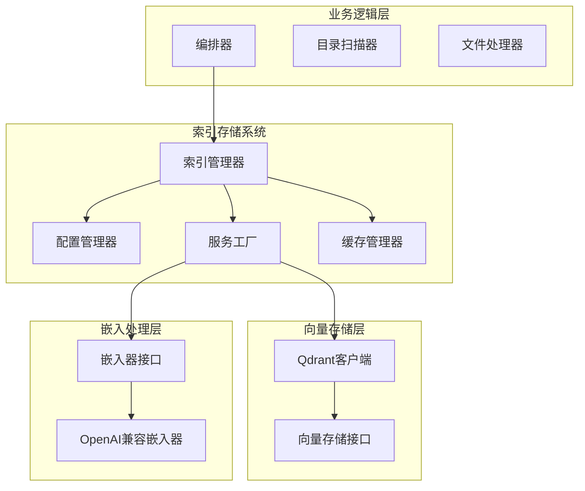
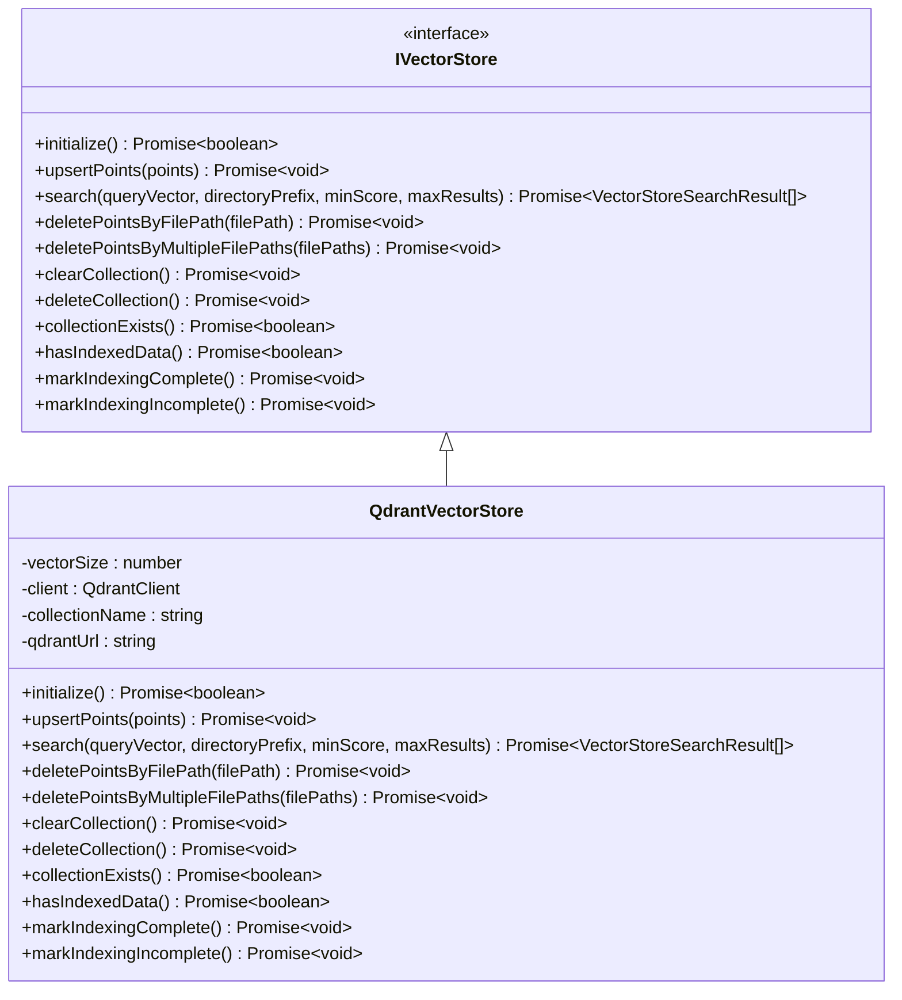
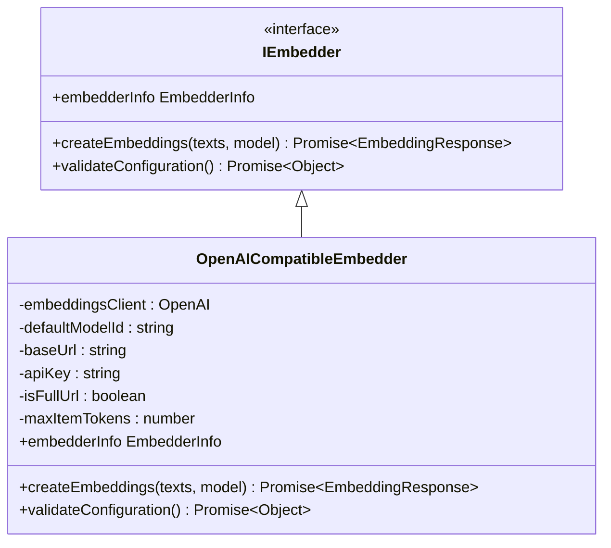
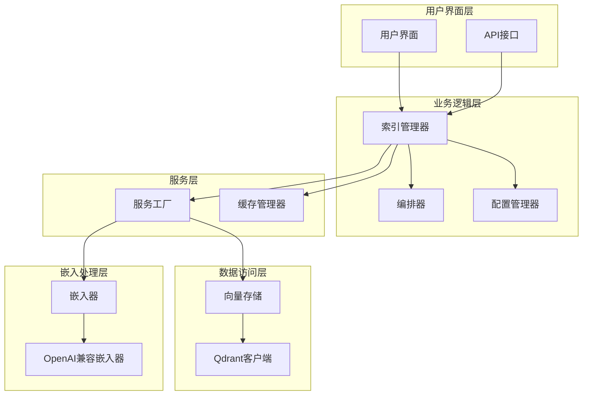
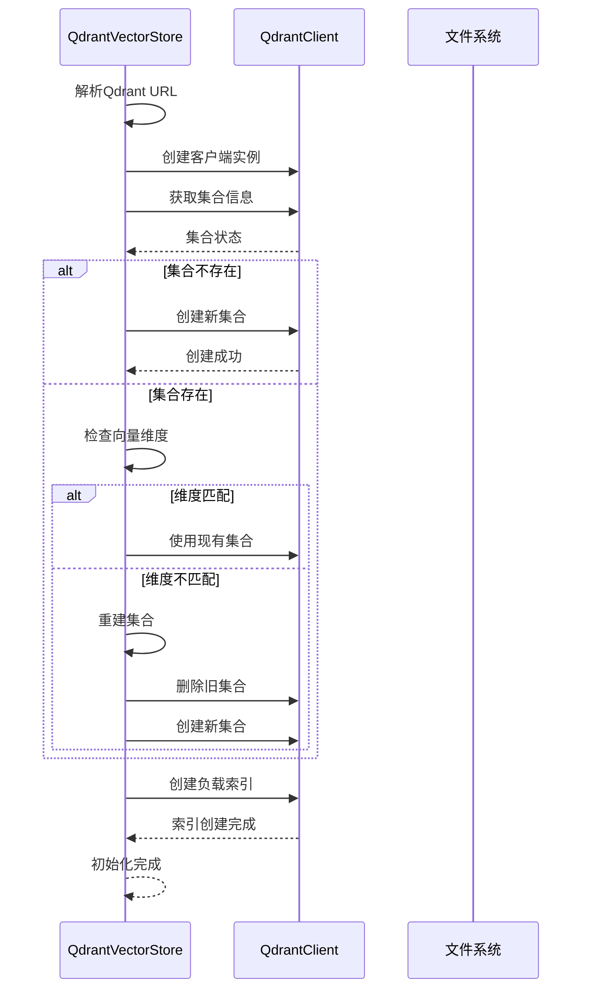
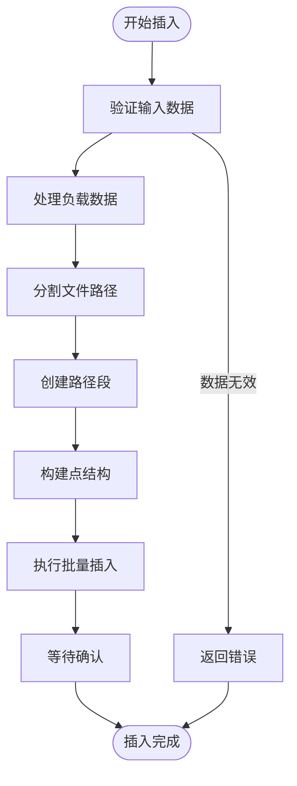
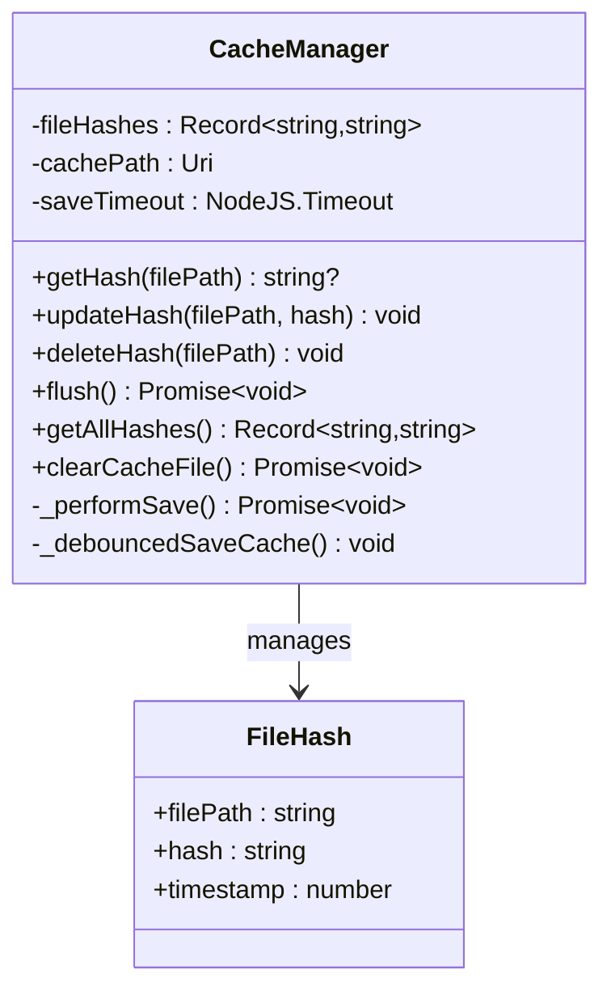
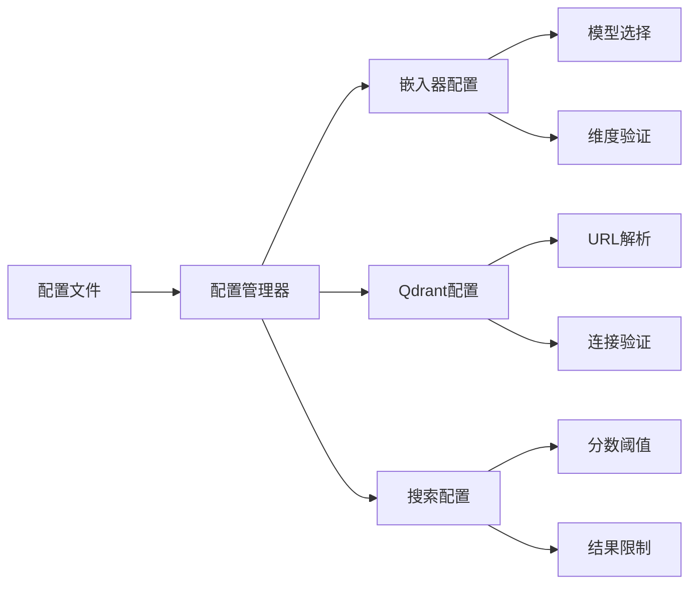
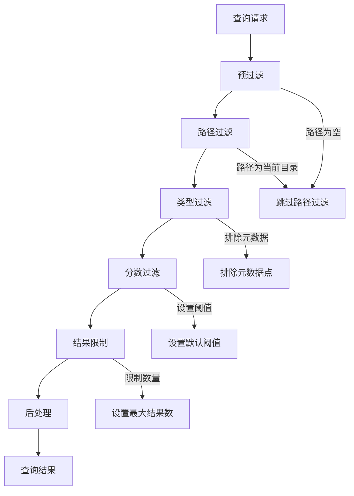
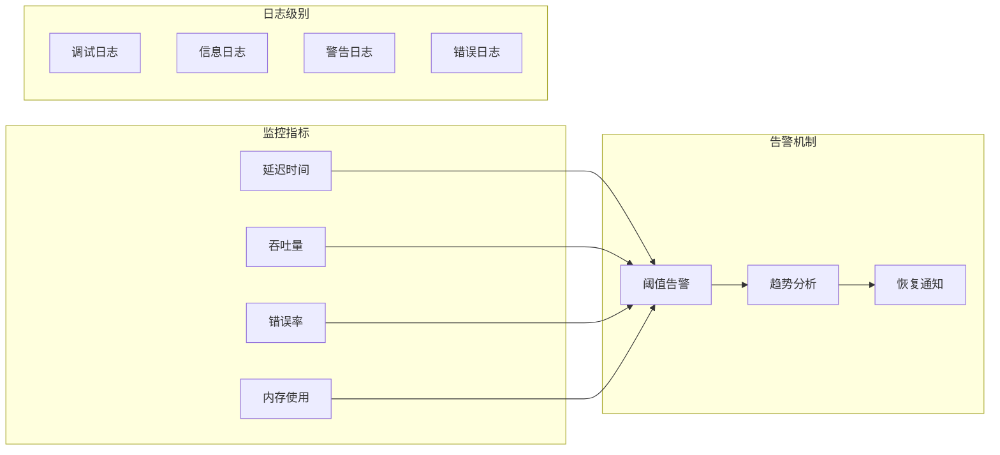

# 索引存储管理

<cite>
**本文档引用的文件**
- [qdrant-client.ts](file://src/services/code-index/vector-store/qdrant-client.ts)
- [vector-store.ts](file://src/services/code-index/interfaces/vector-store.ts)
- [manager.ts](file://src/services/code-index/manager.ts)
- [config-manager.ts](file://src/services/code-index/config-manager.ts)
- [service-factory.ts](file://src/services/code-index/service-factory.ts)
- [cache-manager.ts](file://src/services/code-index/cache-manager.ts)
- [openai-compatible.ts](file://src/services/code-index/embedders/openai-compatible.ts)
- [embedder.ts](file://src/services/code-index/interfaces/embedder.ts)
- [orchestrator.ts](file://src/services/code-index/orchestrator.ts)
- [qdrant-client.spec.ts](file://src/services/code-index/vector-store/__tests__/qdrant-client.spec.ts)
</cite>

## 目录
1. [简介](#简介)
2. [项目结构](#项目结构)
3. [核心组件](#核心组件)
4. [架构概览](#架构概览)
5. [详细组件分析](#详细组件分析)
6. [依赖关系分析](#依赖关系分析)
7. [性能考虑](#性能考虑)
8. [故障排除指南](#故障排除指南)
9. [结论](#结论)

## 简介

索引存储管理系统是一个基于Qdrant向量数据库的智能代码索引解决方案。该系统提供了完整的向量数据持久化存储、索引结构设计、索引创建/删除/更新操作，以及高效的缓存管理机制。

系统的核心目标是为大型代码库提供快速的语义搜索能力，支持基于向量相似度的代码片段检索，并具备良好的扩展性和性能表现。通过集成多种嵌入模型提供商，系统能够适应不同的部署环境和性能需求。

## 项目结构

索引存储管理系统采用模块化架构设计，主要包含以下核心模块：



**图表来源**
- [manager.ts:1-350](file://src/services/code-index/manager.ts#L1-L350)
- [service-factory.ts:95-170](file://src/services/code-index/service-factory.ts#L95-L170)
- [qdrant-client.ts:1-85](file://src/services/code-index/vector-store/qdrant-client.ts#L1-L85)

**章节来源**
- [manager.ts:1-350](file://src/services/code-index/manager.ts#L1-L350)
- [config-manager.ts:26-532](file://src/services/code-index/config-manager.ts#L26-L532)
- [service-factory.ts:95-170](file://src/services/code-index/service-factory.ts#L95-L170)

## 核心组件

### 向量存储接口

系统定义了统一的向量存储接口，确保不同存储后端的兼容性：



**图表来源**
- [vector-store.ts:10-83](file://src/services/code-index/interfaces/vector-store.ts#L10-L83)
- [qdrant-client.ts:13-84](file://src/services/code-index/vector-store/qdrant-client.ts#L13-L84)

### 嵌入器接口

系统支持多种嵌入模型提供商，通过统一接口实现：



**图表来源**
- [embedder.ts:5-44](file://src/services/code-index/interfaces/embedder.ts#L5-L44)
- [openai-compatible.ts:33-84](file://src/services/code-index/embedders/openai-compatible.ts#L33-L84)

**章节来源**
- [vector-store.ts:1-97](file://src/services/code-index/interfaces/vector-store.ts#L1-L97)
- [embedder.ts:1-44](file://src/services/code-index/interfaces/embedder.ts#L1-L44)

## 架构概览

索引存储管理系统采用分层架构设计，确保各组件职责清晰、耦合度低：



**图表来源**
- [manager.ts:1-350](file://src/services/code-index/manager.ts#L1-L350)
- [service-factory.ts:131-165](file://src/services/code-index/service-factory.ts#L131-L165)
- [config-manager.ts:46-532](file://src/services/code-index/config-manager.ts#L46-L532)

## 详细组件分析

### Qdrant向量存储实现

QdrantVectorStore是系统的核心存储组件，负责向量数据的持久化和查询：

#### 初始化流程



**图表来源**
- [qdrant-client.ts:149-215](file://src/services/code-index/vector-store/qdrant-client.ts#L149-L215)
- [qdrant-client.ts:222-293](file://src/services/code-index/vector-store/qdrant-client.ts#L222-L293)

#### 数据插入流程



**图表来源**
- [qdrant-client.ts:338-375](file://src/services/code-index/vector-store/qdrant-client.ts#L338-L375)

#### 查询优化策略

系统采用多级过滤和索引优化策略：

| 过滤类型 | 实现方式 | 性能影响 |
|---------|----------|----------|
| 路径前缀过滤 | `pathSegments.n` 关键字索引 | 高效精确匹配 |
| 类型过滤 | `type` 字段过滤 | 快速排除元数据 |
| 分数阈值 | `score_threshold` 参数 | 减少结果集大小 |
| 结果限制 | `limit` 参数 | 控制网络传输 |

**章节来源**
- [qdrant-client.ts:399-468](file://src/services/code-index/vector-store/qdrant-client.ts#L399-L468)

### 缓存管理机制

系统实现了智能缓存管理，平衡内存使用和查询性能：



**图表来源**
- [cache-manager.ts:42-110](file://src/services/code-index/cache-manager.ts#L42-L110)

### 配置管理系统

系统支持灵活的配置管理，包括嵌入模型选择、Qdrant连接参数等：



**图表来源**
- [config-manager.ts:46-532](file://src/services/code-index/config-manager.ts#L46-L532)

**章节来源**
- [cache-manager.ts:42-110](file://src/services/code-index/cache-manager.ts#L42-L110)
- [config-manager.ts:46-532](file://src/services/code-index/config-manager.ts#L46-L532)

## 依赖关系分析

系统采用松耦合设计，通过接口抽象实现组件间的解耦：

```mermaid
graph TB
subgraph "外部依赖"
QdrantSDK[@qdrant/js-client-rest]
OpenAISDK[openai]
AsyncMutex[async-mutex]
end
subgraph "内部模块"
VectorStore[vector-store]
Interfaces[interfaces]
Embedders[embedders]
Services[services]
end
subgraph "核心实现"
QdrantClient[QdrantVectorStore]
OpenAICompatible[OpenAICompatibleEmbedder]
ServiceFactory[ServiceFactory]
end
QdrantSDK --> QdrantClient
OpenAISDK --> OpenAICompatible
AsyncMutex --> OpenAICompatible
Interfaces --> VectorStore
Interfaces --> Embedders
Services --> VectorStore
Services --> Embedders
VectorStore --> QdrantClient
Embedders --> OpenAICompatible
Services --> ServiceFactory
```

**图表来源**
- [qdrant-client.ts:1-8](file://src/services/code-index/vector-store/qdrant-client.ts#L1-L8)
- [openai-compatible.ts:1-14](file://src/services/code-index/embedders/openai-compatible.ts#L1-L14)

**章节来源**
- [service-factory.ts:131-165](file://src/services/code-index/service-factory.ts#L131-L165)
- [manager.ts:293-345](file://src/services/code-index/manager.ts#L293-L345)

## 性能考虑

### 存储优化策略

系统采用多种存储优化技术提升性能：

1. **磁盘存储优化**
   - 向量维度配置：`on_disk: true` 启用磁盘存储
   - HNSW索引配置：`m: 64`, `ef_construct: 512` 平衡构建质量和性能
   - 距离度量：使用余弦相似度优化向量比较

2. **内存映射机制**
   - 使用UUIDv5生成确定性ID确保一致性
   - 元数据标记系统避免重复索引
   - 路径段索引支持高效目录过滤

3. **批处理优化**
   - 嵌入器批量处理减少API调用次数
   - 向量存储批量插入提升写入性能
   - 智能重试机制处理临时错误

### 查询性能优化



**图表来源**
- [qdrant-client.ts:406-468](file://src/services/code-index/vector-store/qdrant-client.ts#L406-L468)

### 缓存策略

系统实现多层次缓存机制：

| 缓存层级 | 缓存类型 | 缓存策略 | 适用场景 |
|---------|----------|----------|----------|
| 应用层缓存 | 内存缓存 | LRU淘汰 | 频繁访问的查询结果 |
| 文件哈希缓存 | 持久化缓存 | 增量更新 | 文件变更检测 |
| 嵌入缓存 | 磁盘缓存 | 批量写入 | 大规模嵌入生成 |
| 网络缓存 | 连接池 | 连接复用 | API调用优化 |

**章节来源**
- [qdrant-client.ts:149-215](file://src/services/code-index/vector-store/qdrant-client.ts#L149-L215)
- [cache-manager.ts:42-110](file://src/services/code-index/cache-manager.ts#L42-L110)

## 故障排除指南

### 常见问题及解决方案

#### Qdrant连接问题

**问题症状**：初始化失败，提示无法连接到Qdrant

**诊断步骤**：
1. 验证Qdrant服务器状态
2. 检查网络连接和防火墙设置
3. 确认URL格式正确性

**解决方案**：
- 使用URL解析器处理各种URL格式
- 实现自动重连机制
- 提供详细的错误信息

#### 向量维度不匹配

**问题症状**：集合创建失败，提示向量维度不匹配

**诊断步骤**：
1. 检查当前模型的向量维度
2. 验证现有集合的配置
3. 确认模型切换的影响

**解决方案**：
- 自动重建集合处理维度变化
- 保留重要数据的安全措施
- 提供用户友好的错误提示

#### 嵌入器配置错误

**问题症状**：嵌入生成失败，API调用异常

**诊断步骤**：
1. 验证API密钥有效性
2. 检查模型ID和基础URL
3. 确认网络连接状态

**解决方案**：
- 实现配置验证机制
- 提供详细的错误诊断
- 支持多种认证方式

**章节来源**
- [qdrant-client.ts:200-215](file://src/services/code-index/vector-store/qdrant-client.ts#L200-L215)
- [openai-compatible.ts:353-387](file://src/services/code-index/embedders/openai-compatible.ts#L353-L387)

### 监控和日志

系统提供全面的监控和日志功能：



## 结论

索引存储管理系统通过精心设计的架构和优化策略，为大规模向量数据存储提供了可靠的解决方案。系统的主要优势包括：

1. **高可靠性**：完善的错误处理和恢复机制
2. **高性能**：多层缓存和索引优化策略
3. **可扩展性**：模块化设计支持功能扩展
4. **易维护性**：清晰的代码结构和文档

系统在向量数据持久化、Qdrant集成、索引结构设计等方面都体现了专业的工程实践，能够满足企业级应用的需求。通过持续的优化和改进，该系统将继续为用户提供优秀的向量存储和检索体验。