# 代理编排系统

<cite>
**本文档引用的文件**
- [AgentOrchestrator.ts](file://src/core/agent/AgentOrchestrator.ts)
- [PlanEngine.ts](file://src/core/agent/PlanEngine.ts)
- [types.ts](file://src/core/agent/types.ts)
- [index.ts](file://src/core/agent/index.ts)
- [ClineProvider.ts](file://src/core/webview/ClineProvider.ts)
- [Task.ts](file://src/core/task/Task.ts)
- [CloudAgentOrchestrator.ts](file://src/core/task/CloudAgentOrchestrator.ts)
- [ITaskHost.ts](file://src/core/task/interfaces/ITaskHost.ts)
- [ITaskUINotifier.ts](file://src/core/task/interfaces/ITaskUINotifier.ts)
- [taskHostState.ts](file://src/core/task/interfaces/taskHostState.ts)
- [TaskCenter.ts](file://src/core/webview/TaskCenter.ts)
- [modes.ts](file://src/shared/modes.ts)
- [McpHub.ts](file://src/services/mcp/McpHub.ts)
- [taskMessages.ts](file://src/core/task-persistence/taskMessages.ts)
- [TaskHistoryStore.ts](file://src/core/task-persistence/TaskHistoryStore.ts)
</cite>

## 更新摘要
**变更内容**
- Task类重构后通过新的接口模式（ITaskHost）与任务系统解耦
- CloudAgentOrchestrator成为独立的组件，支持延迟协议循环和工作空间操作确认
- 引入严格的接口契约，增强组件间的松耦合性
- 新增Cloud Agent远程编排能力，支持deferred协议循环和编译反馈循环

## 目录
1. [简介](#简介)
2. [项目结构](#项目结构)
3. [核心组件](#核心组件)
4. [架构总览](#架构总览)
5. [详细组件分析](#详细组件分析)
6. [依赖关系分析](#依赖关系分析)
7. [性能考虑](#性能考虑)
8. [故障排除指南](#故障排除指南)
9. [结论](#结论)
10. [附录](#附录)

## 简介
本文件面向代理编排系统，系统性阐述 AgentOrchestrator 的设计架构、并行任务执行机制、代理间通信协议，以及计划引擎（PlanEngine）的工作原理。内容涵盖代理创建流程、任务分配策略、资源协调机制、结果聚合算法；解释依赖解析、执行顺序优化、并行度控制；包含代理状态管理、错误传播机制、故障恢复策略；提供代理编排流程图和数据流图；解决并发控制、负载均衡、性能监控等关键技术问题，并给出代理扩展机制与自定义代理开发指南。

**更新** 本次更新反映了代理编排系统的架构演进，重点展示了Task类重构后通过ITaskHost接口与任务系统解耦的设计，以及CloudAgentOrchestrator作为独立组件的引入，支持延迟协议循环和工作空间操作确认等新功能。

## 项目结构
代理编排系统位于核心模块中，主要由以下层次构成：
- 代理层：AgentOrchestrator 负责并行代理调度与上下文共享；PlanEngine 提供计划生成与执行能力。
- 任务层：Task 抽象了单次任务的生命周期、状态机与消息流，通过ITaskHost接口实现与宿主环境解耦；CloudAgentOrchestrator提供独立的云代理编排能力。
- 服务层：ClineProvider 作为统一入口，整合任务栈、事件分发、持久化与 MCP 协议桥接。
- 接口层：ITaskHost、ITaskUINotifier等接口定义了清晰的契约边界，确保组件间的松耦合。
- 配置与模式：modes 定义代理模式与工具组，支持自定义模式覆盖。
- 通信协议：McpHub 实现 MCP（Model Context Protocol）协议的客户端连接与管理。
- 持久化：TaskHistoryStore 与 taskMessages 提供任务历史与消息持久化。

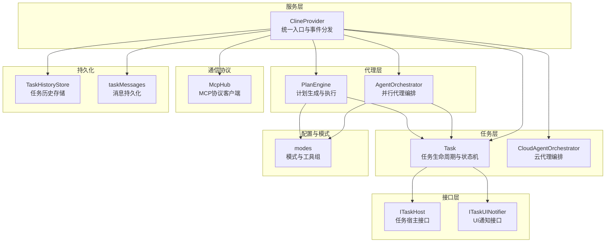

**图表来源**
- [ClineProvider.ts:133-161](file://src/core/webview/ClineProvider.ts#L133-L161)
- [AgentOrchestrator.ts:1-380](file://src/core/agent/AgentOrchestrator.ts#L1-L380)
- [PlanEngine.ts:1-200](file://src/core/agent/PlanEngine.ts#L1-L200)
- [Task.ts:195-200](file://src/core/task/Task.ts#L195-L200)
- [CloudAgentOrchestrator.ts:106-107](file://src/core/task/CloudAgentOrchestrator.ts#L106-L107)
- [ITaskHost.ts:19-59](file://src/core/task/interfaces/ITaskHost.ts#L19-L59)
- [ITaskUINotifier.ts:7-13](file://src/core/task/interfaces/ITaskUINotifier.ts#L7-L13)

**章节来源**
- [ClineProvider.ts:133-161](file://src/core/webview/ClineProvider.ts#L133-L161)
- [AgentOrchestrator.ts:1-380](file://src/core/agent/AgentOrchestrator.ts#L1-L380)
- [PlanEngine.ts:1-200](file://src/core/agent/PlanEngine.ts#L1-L200)
- [Task.ts:195-200](file://src/core/task/Task.ts#L195-L200)
- [CloudAgentOrchestrator.ts:106-107](file://src/core/task/CloudAgentOrchestrator.ts#L106-L107)
- [ITaskHost.ts:19-59](file://src/core/task/interfaces/ITaskHost.ts#L19-L59)
- [ITaskUINotifier.ts:7-13](file://src/core/task/interfaces/ITaskUINotifier.ts#L7-L13)

## 核心组件
- AgentOrchestrator：负责并行代理的启动、上下文共享、结果聚合与事件通知，支持独立与依赖型任务的混合执行。
- PlanEngine：基于 LLM 的计划生成器，维护计划状态与步骤依赖，按并行度批量执行步骤。
- ClineProvider：统一的任务入口，持有 Task 堆栈、PlanEngine 与 AgentOrchestrator 实例，处理事件与持久化，实现ITaskHost接口。
- Task：封装任务生命周期、模式切换、消息流、工具调用与状态同步，通过ITaskHost接口实现与宿主环境解耦。
- CloudAgentOrchestrator：独立的云代理编排组件，支持延迟协议循环、工作空间操作确认和编译反馈循环。
- ITaskHost：任务宿主接口，定义Task所需的最小表面，包括状态、MCP、webview、配置文件等。
- ITaskUINotifier：UI通知接口，定义Task向UI发送消息的契约。
- McpHub：MCP 协议客户端，管理服务器连接、配置校验与错误上报。
- 模式系统：modes 提供内置与自定义模式，决定可用工具集与提示词。

**更新** 新增CloudAgentOrchestrator作为独立组件，以及ITaskHost、ITaskUINotifier等接口契约，体现了系统架构的解耦设计。

**章节来源**
- [AgentOrchestrator.ts:1-380](file://src/core/agent/AgentOrchestrator.ts#L1-L380)
- [PlanEngine.ts:1-200](file://src/core/agent/PlanEngine.ts#L1-L200)
- [ClineProvider.ts:133-161](file://src/core/webview/ClineProvider.ts#L133-L161)
- [Task.ts:195-200](file://src/core/task/Task.ts#L195-L200)
- [CloudAgentOrchestrator.ts:106-107](file://src/core/task/CloudAgentOrchestrator.ts#L106-L107)
- [ITaskHost.ts:19-59](file://src/core/task/interfaces/ITaskHost.ts#L19-L59)
- [ITaskUINotifier.ts:7-13](file://src/core/task/interfaces/ITaskUINotifier.ts#L7-L13)

## 架构总览
系统采用"服务入口 + 任务执行 + 代理编排"的分层架构。ClineProvider 作为顶层协调者，向上提供任务创建与状态同步，向下驱动 Task 执行与 MCP 交互。AgentOrchestrator 与 PlanEngine 分别承担并行代理与计划驱动的职责，二者均通过 ClineProvider 的 Task 创建接口与模式切换能力完成具体工作。Task 通过ITaskHost接口实现与宿主环境的解耦，CloudAgentOrchestrator作为独立组件提供云代理编排能力。

**更新** 架构图增加了CloudAgentOrchestrator和接口层的展示，体现了新的解耦设计。

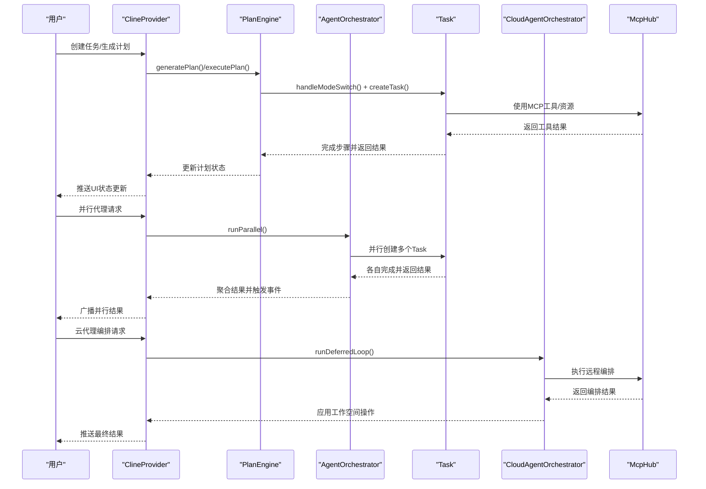

**图表来源**
- [ClineProvider.ts:133-161](file://src/core/webview/ClineProvider.ts#L133-L161)
- [PlanEngine.ts:1-200](file://src/core/agent/PlanEngine.ts#L1-L200)
- [AgentOrchestrator.ts:1-380](file://src/core/agent/AgentOrchestrator.ts#L1-L380)
- [Task.ts:195-200](file://src/core/task/Task.ts#L195-L200)
- [CloudAgentOrchestrator.ts:106-107](file://src/core/task/CloudAgentOrchestrator.ts#L106-L107)

## 详细组件分析

### AgentOrchestrator 组件分析
AgentOrchestrator 是并行代理编排的核心，负责：
- 任务规格解析：区分独立任务与依赖任务，先执行无依赖任务，再执行可运行的依赖任务。
- 上下文共享：构建共享上下文（已修改文件、其他代理结果），注入到后续任务提示词中。
- 结果聚合：收集各代理结果，统一事件输出（agentStarted/agentCompleted/agentFailed/allCompleted）。
- 超时与取消：每个任务设置超时检测，支持按代理 ID 取消与全部取消。
- 状态管理：维护代理映射、活动任务映射与共享上下文。

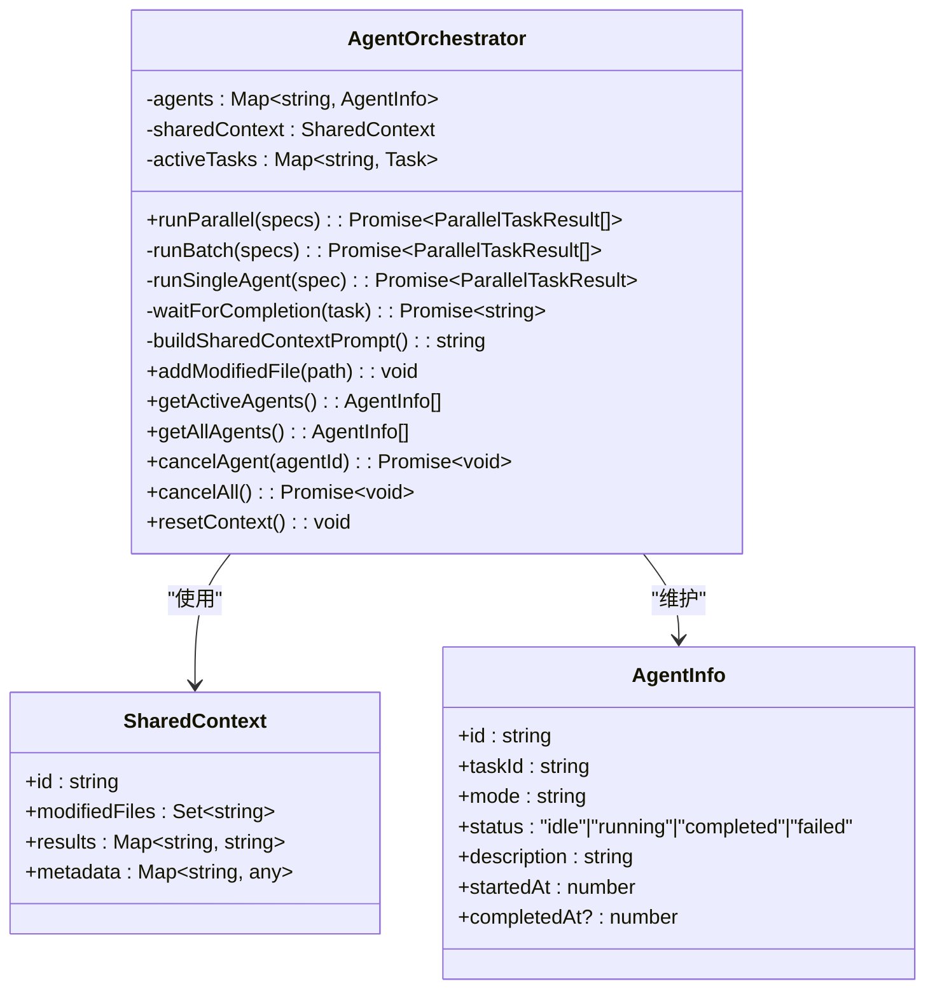

**图表来源**
- [AgentOrchestrator.ts:1-380](file://src/core/agent/AgentOrchestrator.ts#L1-L380)
- [types.ts:52-67](file://src/core/agent/types.ts#L52-L67)

**章节来源**
- [AgentOrchestrator.ts:1-380](file://src/core/agent/AgentOrchestrator.ts#L1-L380)
- [types.ts:52-67](file://src/core/agent/types.ts#L52-L67)

### PlanEngine 组件分析
PlanEngine 提供"计划-执行"能力：
- 计划生成：基于模板提示词调用 LLM 生成结构化计划，解析失败时回退默认计划。
- 步骤依赖：根据步骤索引映射依赖 ID，自动更新就绪步骤。
- 并行执行：按最大并行度批量执行就绪步骤，使用 Promise.allSettled 处理部分失败。
- 错误传播：任一步骤失败会标记自身失败并取消其下游依赖步骤。
- 状态同步：提供暂停、批准、重排步骤、删除计划等管理接口。

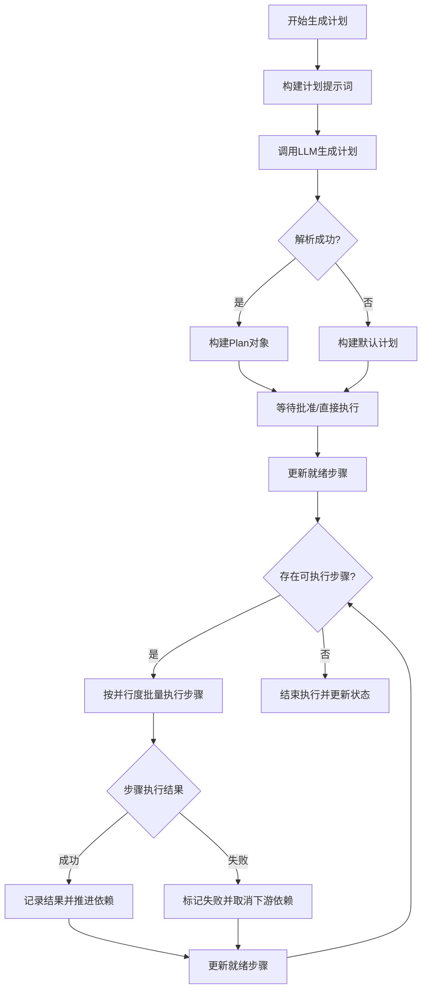

**图表来源**
- [PlanEngine.ts:1-200](file://src/core/agent/PlanEngine.ts#L1-L200)

**章节来源**
- [PlanEngine.ts:1-200](file://src/core/agent/PlanEngine.ts#L1-L200)

### 代理创建流程与任务分配策略
- 代理创建：AgentOrchestrator 为每个代理生成唯一 agentId，注入共享上下文后调用 ClineProvider.handleModeSwitch 与 createTask。
- 任务分配：独立任务优先执行；依赖任务通过 updateReadySteps 检查依赖是否全部完成，满足条件后加入当前批次。
- 资源协调：共享上下文通过 buildSharedContextPrompt 注入到任务提示词，避免重复信息与冲突。
- 结果聚合：runBatch 使用 Promise.allSettled 收集结果，统一转换为 ParallelTaskResult 并触发 allCompleted 事件。

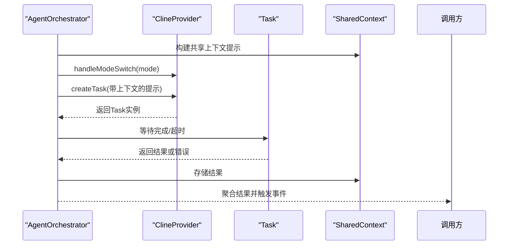

**图表来源**
- [AgentOrchestrator.ts:1-380](file://src/core/agent/AgentOrchestrator.ts#L1-L380)

**章节来源**
- [AgentOrchestrator.ts:1-380](file://src/core/agent/AgentOrchestrator.ts#L1-L380)

### 代理状态管理与错误传播
- 状态模型：AgentInfo 包含 id、taskId、mode、status、时间戳等字段；PlanEngine 的 Plan/PlanStep 维护状态机。
- 事件驱动：AgentOrchestrator 发出 agentStarted/agentCompleted/agentFailed/allCompleted 事件；PlanEngine 在步骤与计划层面发出更新事件。
- 错误传播：PlanEngine 在步骤失败时标记失败并递归取消下游依赖；AgentOrchestrator 将异常转换为失败结果并清理活动任务。
- 故障恢复：ClineProvider 在任务中断时尝试重新加载历史以恢复；Task 提供检查点与流中断处理。

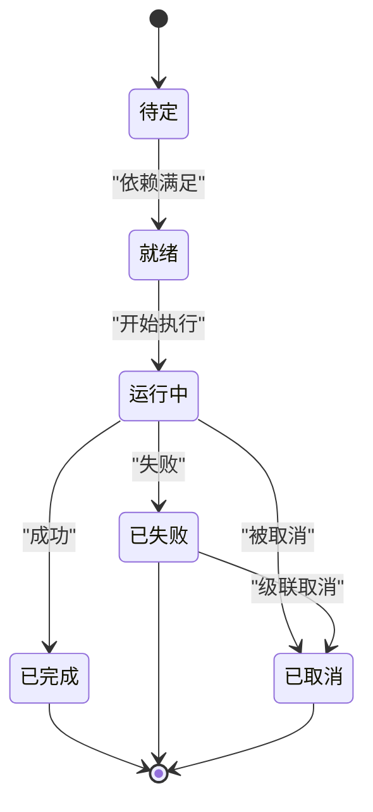

**图表来源**
- [types.ts:13-29](file://src/core/agent/types.ts#L13-L29)
- [PlanEngine.ts:1-200](file://src/core/agent/PlanEngine.ts#L1-L200)

**章节来源**
- [types.ts:13-29](file://src/core/agent/types.ts#L13-L29)
- [PlanEngine.ts:1-200](file://src/core/agent/PlanEngine.ts#L1-L200)

### 代理间通信协议与 MCP 集成
- MCP 协议：McpHub 作为 MCP 客户端，支持 stdio、sse、streamable-http 三种传输方式，提供服务器配置校验、连接状态跟踪与错误上报。
- 代理协作：AgentOrchestrator/PlanEngine 通过 ClineProvider 的 Task 接口间接使用 MCP 工具与资源，实现跨代理的资源共享与工具调用。
- 配置管理：支持全局与项目级 mcp.json 配置，动态监听变更并热更新连接状态。

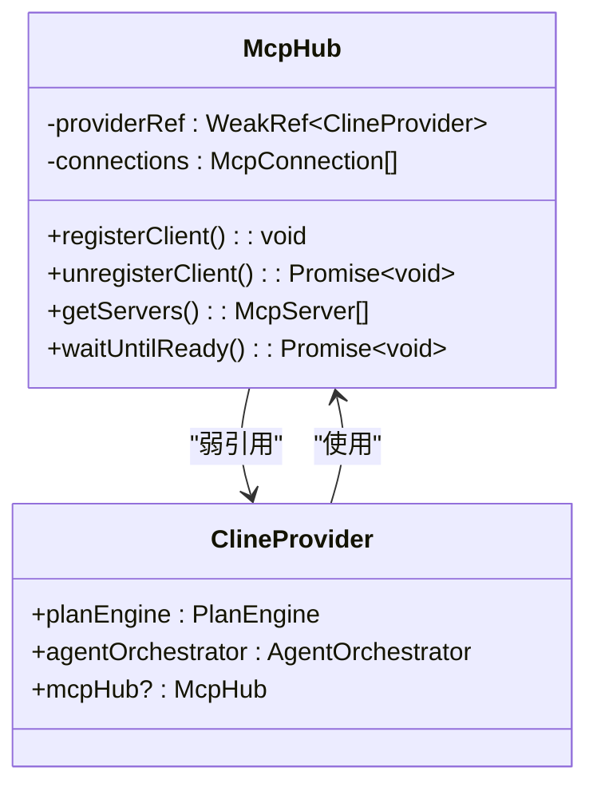

**图表来源**
- [McpHub.ts:151-176](file://src/services/mcp/McpHub.ts#L151-L176)
- [ClineProvider.ts:133-161](file://src/core/webview/ClineProvider.ts#L133-L161)

**章节来源**
- [McpHub.ts:151-176](file://src/services/mcp/McpHub.ts#L151-L176)
- [ClineProvider.ts:133-161](file://src/core/webview/ClineProvider.ts#L133-L161)

### 任务系统集成与状态同步
- 任务栈管理：ClineProvider 维护任务栈，支持任务入栈、出栈与委托修复，确保父子任务状态一致性。
- 状态广播：通过 broadcastTaskHistoryUpdate 将任务历史推送到前端，保持 UI 与后端状态一致。
- 消息持久化：taskMessages 提供任务消息的读写，TaskHistoryStore 提供任务历史的缓存与去重写入。

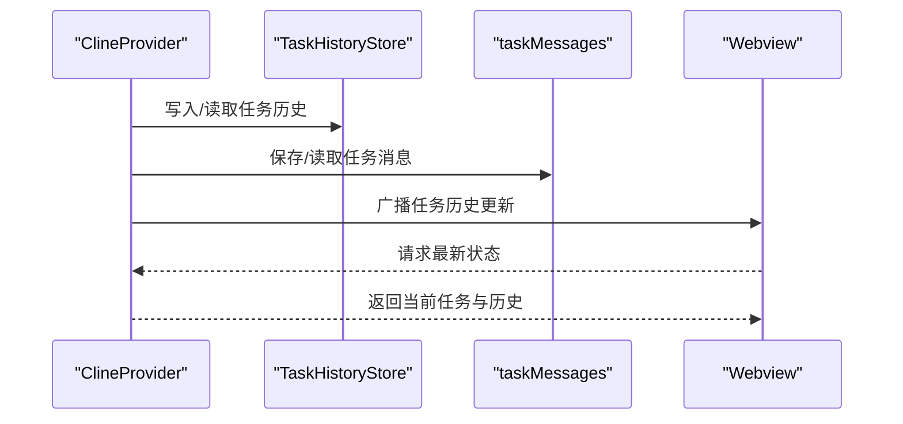

**图表来源**
- [ClineProvider.ts:133-161](file://src/core/webview/ClineProvider.ts#L133-L161)
- [TaskHistoryStore.ts:44-73](file://src/core/task-persistence/TaskHistoryStore.ts#L44-L73)
- [taskMessages.ts:17-56](file://src/core/task-persistence/taskMessages.ts#L17-L56)

**章节来源**
- [ClineProvider.ts:133-161](file://src/core/webview/ClineProvider.ts#L133-L161)
- [TaskHistoryStore.ts:44-73](file://src/core/task-persistence/TaskHistoryStore.ts#L44-L73)
- [taskMessages.ts:17-56](file://src/core/task-persistence/taskMessages.ts#L17-L56)

### CloudAgentOrchestrator 组件分析
**新增** CloudAgentOrchestrator 作为独立的云代理编排组件，提供以下能力：

- 延迟协议循环：支持 Cloud Agent 的 deferred protocol，实现多轮对话和工具调用的循环执行。
- 工作空间操作确认：支持工作空间操作的确认机制，允许用户逐项确认远程操作。
- 编译反馈循环：自动检测编译错误并执行修复循环，提高代码质量。
- 配置管理：通过配置文件管理服务器URL、设备令牌、API密钥等参数。
- 错误处理：提供完整的错误处理和重试机制，确保任务的可靠性。

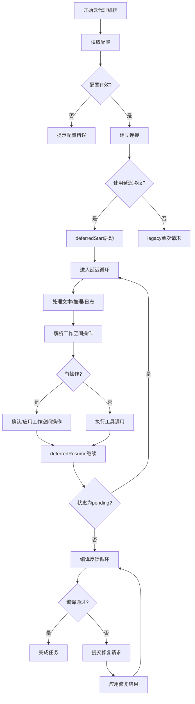

**图表来源**
- [CloudAgentOrchestrator.ts:106-107](file://src/core/task/CloudAgentOrchestrator.ts#L106-L107)
- [CloudAgentOrchestrator.ts:225-438](file://src/core/task/CloudAgentOrchestrator.ts#L225-L438)

**章节来源**
- [CloudAgentOrchestrator.ts:106-107](file://src/core/task/CloudAgentOrchestrator.ts#L106-L107)
- [CloudAgentOrchestrator.ts:225-438](file://src/core/task/CloudAgentOrchestrator.ts#L225-L438)

### ITaskHost 接口契约分析
**新增** ITaskHost 接口定义了Task所需的最小宿主表面，实现与ClineProvider的解耦：

- 状态管理：提供 getState() 方法获取宿主状态，支持任务初始化和配置管理。
- MCP集成：提供 getMcpHub() 和 getSkillsManager() 方法，集成MCP协议和技能管理。
- 任务操作：提供 delegateParentAndOpenChild()、setMode()、setProviderProfile() 等方法。
- 事件处理：提供 on() 和 off() 方法处理 ProviderProfileChanged 事件。
- UI交互：提供 log()、convertToWebviewUri() 等方法。

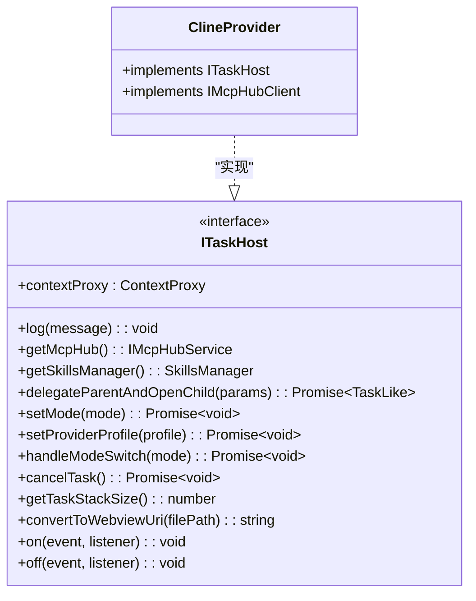

**图表来源**
- [ITaskHost.ts:19-59](file://src/core/task/interfaces/ITaskHost.ts#L19-L59)
- [ClineProvider.ts:133-161](file://src/core/webview/ClineProvider.ts#L133-L161)

**章节来源**
- [ITaskHost.ts:19-59](file://src/core/task/interfaces/ITaskHost.ts#L19-L59)
- [ClineProvider.ts:133-161](file://src/core/webview/ClineProvider.ts#L133-L161)

### Task 类重构与解耦设计
**更新** Task 类通过重构实现了与宿主环境的完全解耦：

- 接口依赖：Task 通过 ITaskHost 接口依赖宿主功能，不再直接依赖 ClineProvider 具体实现。
- 弱引用管理：使用 WeakRef<ITaskHost> 管理宿主引用，避免循环引用和内存泄漏。
- 初始化机制：提供 taskModeReady 和 taskApiConfigReady Promise，确保异步初始化的正确性。
- UI通知：通过 ITaskUINotifier 接口实现UI状态刷新，保持与具体UI实现的解耦。
- 生命周期：TaskLifecycleHandler 管理任务生命周期，提供状态转换和事件处理。

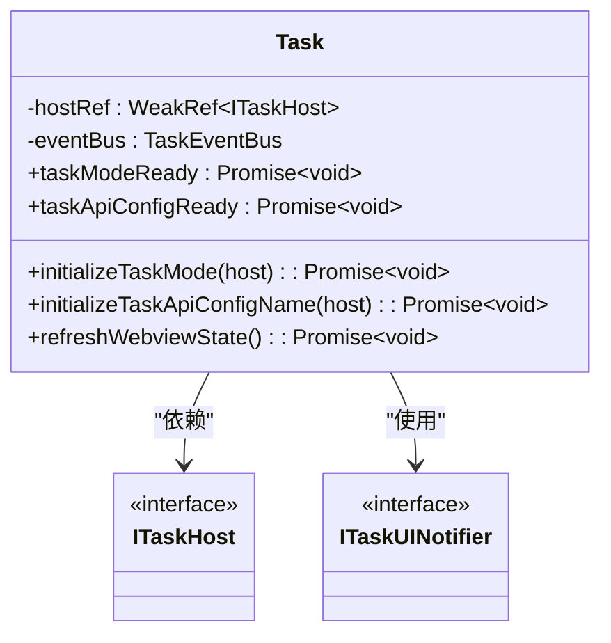

**图表来源**
- [Task.ts:295-935](file://src/core/task/Task.ts#L295-L935)
- [ITaskHost.ts:19-59](file://src/core/task/interfaces/ITaskHost.ts#L19-L59)
- [ITaskUINotifier.ts:7-13](file://src/core/task/interfaces/ITaskUINotifier.ts#L7-L13)

**章节来源**
- [Task.ts:295-935](file://src/core/task/Task.ts#L295-L935)
- [ITaskHost.ts:19-59](file://src/core/task/interfaces/ITaskHost.ts#L19-L59)
- [ITaskUINotifier.ts:7-13](file://src/core/task/interfaces/ITaskUINotifier.ts#L7-L13)

## 依赖关系分析
- 组件耦合：AgentOrchestrator 与 PlanEngine 均依赖 ClineProvider 的 Task 创建与模式切换能力；两者通过事件与回调实现松耦合。
- 接口契约：Task 通过 ITaskHost 接口与宿主环境解耦，实现真正的依赖倒置。
- 外部依赖：McpHub 作为 MCP 协议客户端，与 Task/Provider 解耦，仅通过 ClineProvider 暴露接口。
- 类型契约：types.ts 定义了 Plan/PlanStep/AgentInfo/SharedContext 等核心类型，保证跨模块的数据一致性。

**更新** 新增了接口层的依赖关系，体现了系统架构的解耦设计。

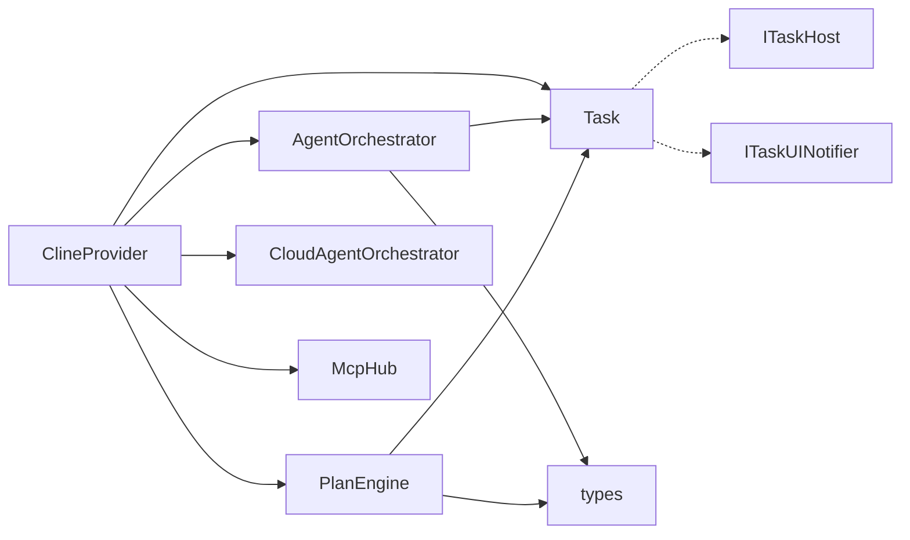

**图表来源**
- [ClineProvider.ts:133-161](file://src/core/webview/ClineProvider.ts#L133-L161)
- [AgentOrchestrator.ts:1-380](file://src/core/agent/AgentOrchestrator.ts#L1-L380)
- [PlanEngine.ts:1-200](file://src/core/agent/PlanEngine.ts#L1-L200)
- [Task.ts:195-200](file://src/core/task/Task.ts#L195-L200)
- [CloudAgentOrchestrator.ts:106-107](file://src/core/task/CloudAgentOrchestrator.ts#L106-L107)
- [ITaskHost.ts:19-59](file://src/core/task/interfaces/ITaskHost.ts#L19-L59)
- [ITaskUINotifier.ts:7-13](file://src/core/task/interfaces/ITaskUINotifier.ts#L7-L13)

**章节来源**
- [ClineProvider.ts:133-161](file://src/core/webview/ClineProvider.ts#L133-L161)
- [AgentOrchestrator.ts:1-380](file://src/core/agent/AgentOrchestrator.ts#L1-L380)
- [PlanEngine.ts:1-200](file://src/core/agent/PlanEngine.ts#L1-L200)
- [Task.ts:195-200](file://src/core/task/Task.ts#L195-L200)
- [CloudAgentOrchestrator.ts:106-107](file://src/core/task/CloudAgentOrchestrator.ts#L106-L107)
- [ITaskHost.ts:19-59](file://src/core/task/interfaces/ITaskHost.ts#L19-L59)
- [ITaskUINotifier.ts:7-13](file://src/core/task/interfaces/ITaskUINotifier.ts#L7-L13)

## 性能考虑
- 并发控制：PlanEngine 的 maxParallel 控制每轮执行步骤数量；AgentOrchestrator 的 Promise.allSettled 避免单点阻塞。
- 超时与心跳：任务执行设置 10 分钟超时，轮询检测 completion_result/error 消息，及时释放资源。
- 上下文压缩：共享上下文按需拼接，避免冗余信息导致上下文窗口溢出。
- 持久化去抖：TaskHistoryStore 对索引写入进行去抖与周期性对账，降低磁盘压力。
- 模式选择：modes 提供工具组裁剪，减少不必要的工具调用与上下文负担。
- 接口解耦：通过 ITaskHost 等接口实现组件解耦，提高系统的可测试性和可维护性。
- 云代理优化：CloudAgentOrchestrator 支持延迟协议循环，减少网络往返次数，提高执行效率。

**更新** 新增了接口解耦和云代理优化的性能考虑。

## 故障排除指南
- 任务超时：检查任务消息队列与 completion_result 触发时机，确认轮询逻辑未被中断。
- 代理取消：使用 cancelAgent/cancelAll 清理活动任务并更新状态；若任务处于 abandoned/didFinishAbortingStream 状态，按错误消息处理。
- 计划执行中断：pausePlan 使用 AbortController 触发暂停；检查下游依赖取消逻辑是否正确执行。
- MCP 连接失败：查看 McpHub 的 stderr 输出与错误历史，确认配置字段与传输类型匹配。
- 状态不一致：通过 broadcastTaskHistoryUpdate 主动推送任务历史，结合 TaskHistoryStore 的去重写入机制排查。
- 云代理错误：检查 CloudAgentOrchestrator 的配置和网络连接，确认 deferred protocol 循环的正确性。
- 接口解耦问题：验证 ITaskHost 实现的完整性，确保所有必需方法都已正确实现。

**更新** 新增了云代理和接口解耦相关的故障排除指南。

**章节来源**
- [AgentOrchestrator.ts:1-380](file://src/core/agent/AgentOrchestrator.ts#L1-L380)
- [PlanEngine.ts:1-200](file://src/core/agent/PlanEngine.ts#L1-L200)
- [McpHub.ts:151-176](file://src/services/mcp/McpHub.ts#L151-L176)
- [ClineProvider.ts:133-161](file://src/core/webview/ClineProvider.ts#L133-L161)
- [CloudAgentOrchestrator.ts:106-107](file://src/core/task/CloudAgentOrchestrator.ts#L106-L107)
- [ITaskHost.ts:19-59](file://src/core/task/interfaces/ITaskHost.ts#L19-L59)

## 结论
代理编排系统通过 AgentOrchestrator 与 PlanEngine 实现了从"并行代理执行"到"计划驱动执行"的双轨机制，配合 ClineProvider 的任务栈管理、MCP 协议桥接与持久化体系，形成了高内聚、低耦合的代理编排框架。系统在并发控制、错误传播与状态同步方面具备完善的机制，能够支撑复杂任务的自动化编排与扩展。

**更新** 本次架构演进通过Task类重构和CloudAgentOrchestrator的引入，进一步强化了系统的解耦设计和云代理能力，为未来的功能扩展奠定了坚实基础。

## 附录

### 代理扩展机制与自定义代理开发指南
- 自定义模式：通过 modes 的自定义模式覆盖内置模式，调整角色定义、使用场景与指令集合。
- 代理接口：遵循 AgentInfo/SharedContext 类型约定，确保事件与状态的一致性。
- 通信协议：通过 McpHub 配置 MCP 服务器，实现跨进程工具与资源访问。
- 开发建议：优先使用现有工具组与模式，必要时通过自定义模式与工具组扩展能力。
- 接口实现：实现 ITaskHost 接口以支持自定义宿主环境，确保与 Task 系统的兼容性。
- 云代理集成：利用 CloudAgentOrchestrator 的延迟协议循环能力，实现复杂的远程编排需求。

**更新** 新增了接口实现和云代理集成的开发指南。

**章节来源**
- [modes.ts:69-91](file://src/shared/modes.ts#L69-L91)
- [modes.ts:161-173](file://src/shared/modes.ts#L161-L173)
- [types.ts:52-67](file://src/core/agent/types.ts#L52-L67)
- [McpHub.ts:547-588](file://src/services/mcp/McpHub.ts#L547-L588)
- [ITaskHost.ts:19-59](file://src/core/task/interfaces/ITaskHost.ts#L19-L59)
- [CloudAgentOrchestrator.ts:106-107](file://src/core/task/CloudAgentOrchestrator.ts#L106-L107)