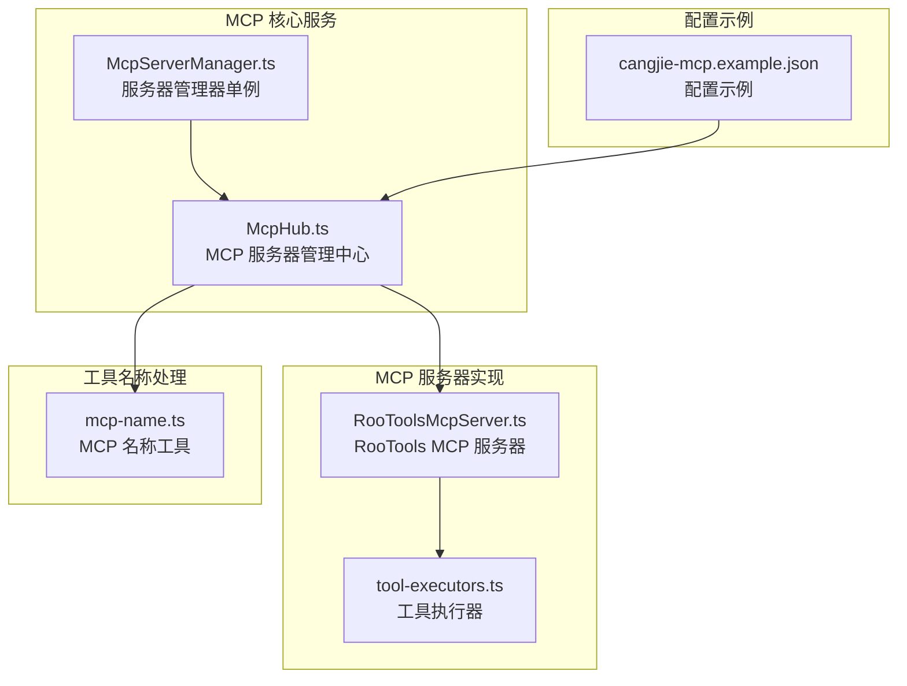
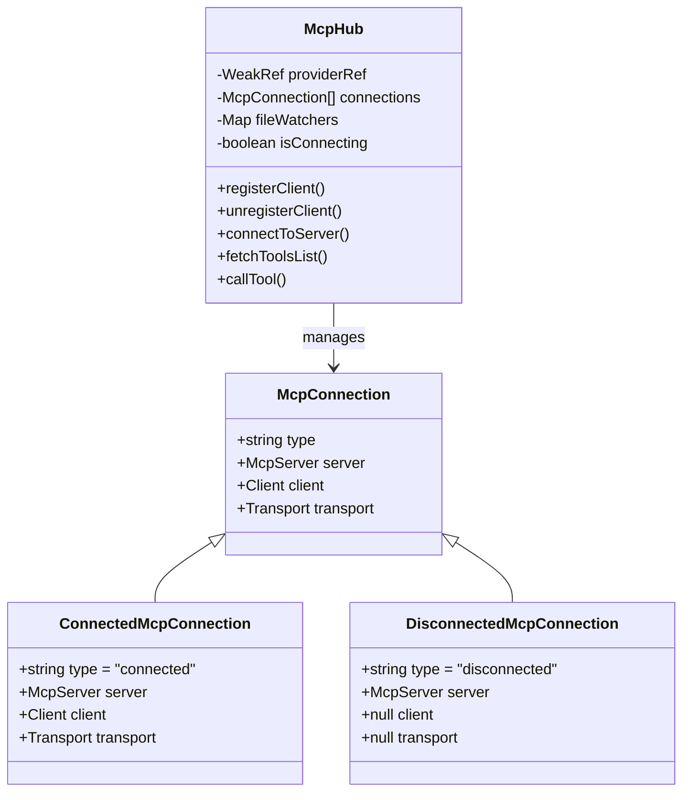
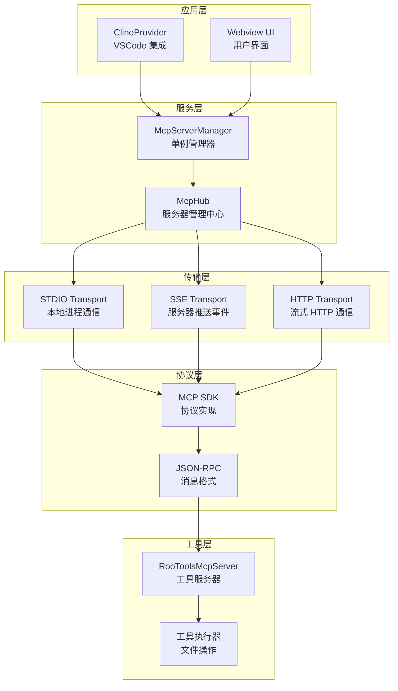
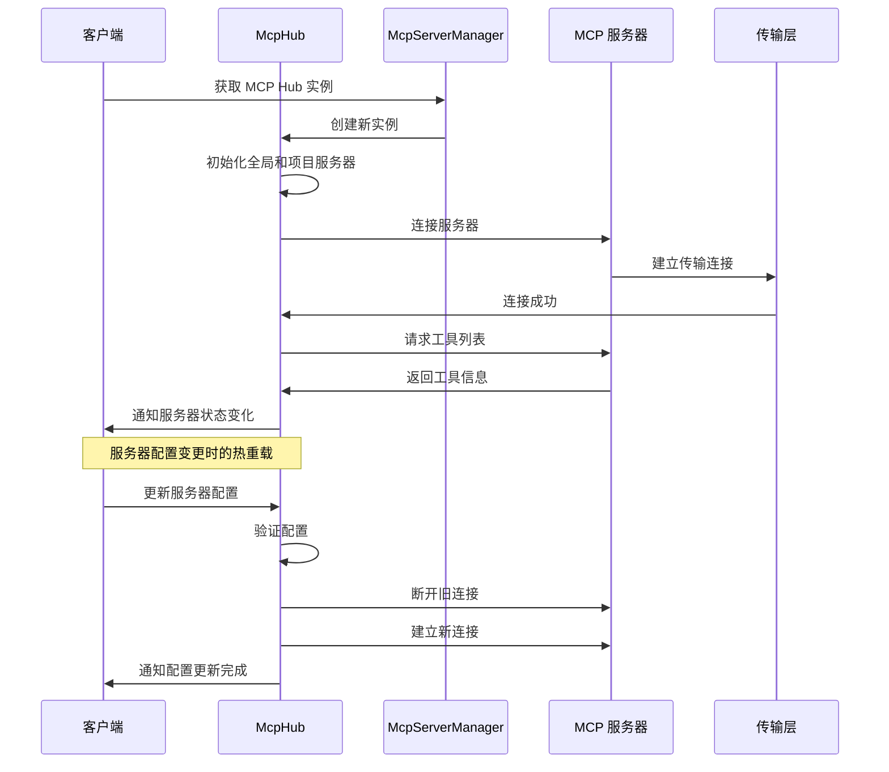
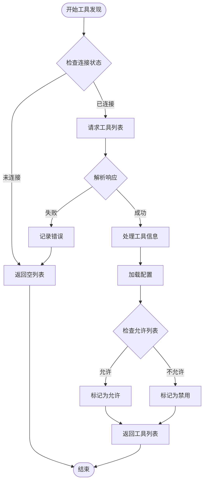
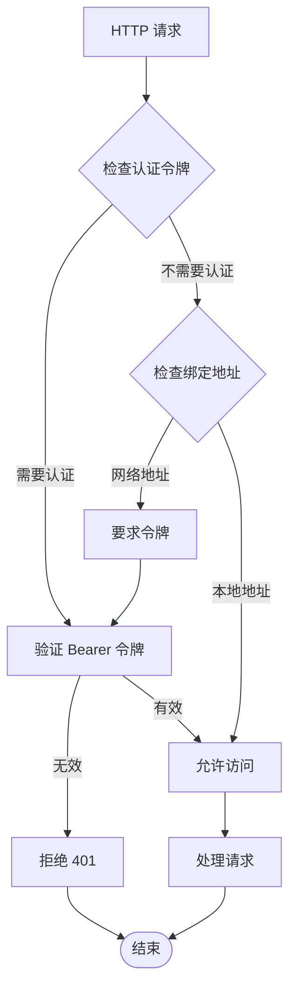
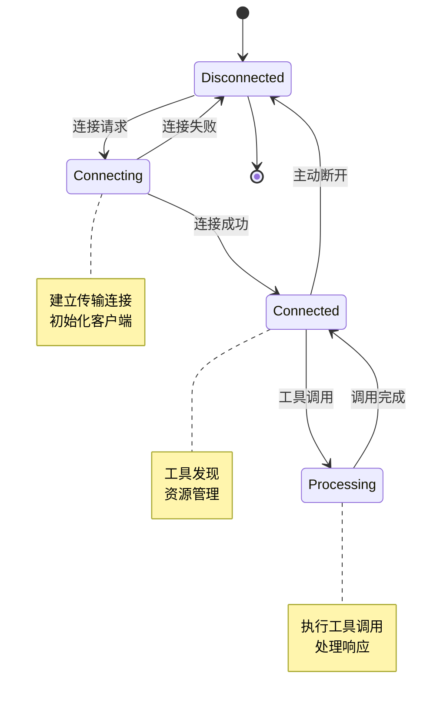

# MCP 协议架构

<cite>
**本文档引用的文件**
- [McpHub.ts](file://src/services/mcp/McpHub.ts)
- [McpServerManager.ts](file://src/services/mcp/McpServerManager.ts)
- [RooToolsMcpServer.ts](file://src/services/mcp-server/RooToolsMcpServer.ts)
- [tool-executors.ts](file://src/services/mcp-server/tool-executors.ts)
- [mcp-name.ts](file://src/utils/mcp-name.ts)
- [cangjie-mcp.example.json](file://docs/examples/cangjie-mcp.example.json)
</cite>

## 目录
1. [简介](#简介)
2. [项目结构](#项目结构)
3. [核心组件](#核心组件)
4. [架构概览](#架构概览)
5. [详细组件分析](#详细组件分析)
6. [依赖关系分析](#依赖关系分析)
7. [性能考虑](#性能考虑)
8. [故障排除指南](#故障排除指南)
9. [结论](#结论)

## 简介

MCP（Model Context Protocol）协议架构是基于 Model Context Protocol SDK 实现的智能模型上下文协议系统。该架构提供了完整的 MCP 服务器管理、客户端连接管理和工具执行功能，支持多种传输协议（STDIO、SSE、Streamable HTTP）和安全认证机制。

本架构的核心目标是为 AI 模型提供标准化的工具调用接口，通过统一的协议规范实现与各种 MCP 服务器的无缝集成，同时确保系统的安全性、可靠性和可扩展性。

## 项目结构

MCP 协议架构在项目中的组织结构如下：



**图表来源**
- [McpHub.ts:151-176](file://src/services/mcp/McpHub.ts#L151-L176)
- [McpServerManager.ts:9-54](file://src/services/mcp/McpServerManager.ts#L9-L54)
- [RooToolsMcpServer.ts:27-34](file://src/services/mcp-server/RooToolsMcpServer.ts#L27-L34)

**章节来源**
- [McpHub.ts:151-1997](file://src/services/mcp/McpHub.ts#L151-L1997)
- [McpServerManager.ts:1-87](file://src/services/mcp/McpServerManager.ts#L1-87)
- [RooToolsMcpServer.ts:1-339](file://src/services/mcp-server/RooToolsMcpServer.ts#L1-L339)

## 核心组件

### McpHub - MCP 服务器管理中心

McpHub 是整个 MCP 架构的核心管理中心，负责管理所有 MCP 服务器的生命周期、连接状态和配置更新。

**主要功能特性：**
- 多服务器连接管理（全局和项目级）
- 动态配置热重载
- 文件变更监控和自动重启
- 工具发现和资源管理
- 错误历史记录和状态跟踪

**关键数据结构：**


**图表来源**
- [McpHub.ts:44-65](file://src/services/mcp/McpHub.ts#L44-L65)
- [McpHub.ts:151-176](file://src/services/mcp/McpHub.ts#L151-L176)

### McpServerManager - 服务器管理器单例

McpServerManager 提供了 MCP 服务器的单例管理模式，确保在整个应用中只运行一个 MCP Hub 实例。

**核心特性：**
- 线程安全的单例实现
- Provider 注册和通知机制
- 资源清理和生命周期管理

**章节来源**
- [McpServerManager.ts:9-87](file://src/services/mcp/McpServerManager.ts#L9-L87)

### RooToolsMcpServer - RooTools MCP 服务器

RooToolsMcpServer 是 MCP 协议的具体实现，提供了文件操作、命令执行、搜索等功能的工具实现。

**支持的工具：**
- 文件读取和写入
- 目录列表和文件搜索
- 命令执行和差异应用
- 安全的路径访问控制

**章节来源**
- [RooToolsMcpServer.ts:27-161](file://src/services/mcp-server/RooToolsMcpServer.ts#L27-L161)

## 架构概览

MCP 协议架构采用分层设计，从底层传输到上层应用服务都有清晰的职责分离：



**图表来源**
- [McpHub.ts:689-897](file://src/services/mcp/McpHub.ts#L689-L897)
- [RooToolsMcpServer.ts:44-161](file://src/services/mcp-server/RooToolsMcpServer.ts#L44-L161)

## 详细组件分析

### 服务器连接管理

McpHub 提供了完整的服务器连接生命周期管理：



**图表来源**
- [McpServerManager.ts:20-54](file://src/services/mcp/McpServerManager.ts#L20-L54)
- [McpHub.ts:656-897](file://src/services/mcp/McpHub.ts#L656-L897)

### 工具发现机制

工具发现是 MCP 协议的核心功能之一，McpHub 提供了自动化的工具发现和管理：



**图表来源**
- [McpHub.ts:981-1039](file://src/services/mcp/McpHub.ts#L981-L1039)

### 认证授权策略

MCP 服务器实现了多层次的安全认证机制：



**图表来源**
- [RooToolsMcpServer.ts:168-235](file://src/services/mcp-server/RooToolsMcpServer.ts#L168-L235)
- [RooToolsMcpServer.ts:254-257](file://src/services/mcp-server/RooToolsMcpServer.ts#L254-L257)

### 会话管理

McpHub 提供了完整的会话管理功能，包括会话创建、维护和清理：



**图表来源**
- [McpHub.ts:862-897](file://src/services/mcp/McpHub.ts#L862-L897)

**章节来源**
- [McpHub.ts:899-924](file://src/services/mcp/McpHub.ts#L899-L924)
- [McpHub.ts:1075-1108](file://src/services/mcp/McpHub.ts#L1075-L1108)

## 依赖关系分析

MCP 协议架构的依赖关系体现了清晰的分层设计：

```mermaid
graph TB
subgraph "外部依赖"
A[@modelcontextprotocol/sdk<br/>MCP SDK]
B[VSCode API<br/>扩展开发平台]
C[zod<br/>类型验证]
D[chokidar<br/>文件监控]
end
subgraph "内部模块"
E[McpHub]
F[McpServerManager]
G[RooToolsMcpServer]
H[tool-executors]
I[mcp-name]
end
subgraph "工具函数"
J[fs/promises<br/>文件系统]
K[child_process<br/>子进程]
L[http<br/>HTTP 服务器]
end
A --> E
B --> E
C --> E
D --> E
E --> F
E --> G
G --> H
G --> I
H --> J
H --> K
G --> L
```

**图表来源**
- [McpHub.ts:1-42](file://src/services/mcp/McpHub.ts#L1-L42)
- [RooToolsMcpServer.ts:1-7](file://src/services/mcp-server/RooToolsMcpServer.ts#L1-L7)

**章节来源**
- [mcp-name.ts:1-191](file://src/utils/mcp-name.ts#L1-L191)

## 性能考虑

### 连接池管理

McpHub 实现了智能的连接池管理，避免重复连接和资源浪费：

- **连接复用**：相同服务器的多次请求共享连接
- **超时控制**：每个连接都有独立的超时设置
- **错误恢复**：自动重连机制处理临时故障

### 缓存策略

为了提高性能，系统实现了多级缓存：

- **工具列表缓存**：工具元数据缓存减少重复查询
- **配置缓存**：服务器配置缓存避免频繁磁盘访问
- **错误历史缓存**：最近的错误信息缓存便于诊断

### 内存优化

- **弱引用管理**：使用 WeakRef 避免循环引用
- **文件监听器清理**：及时清理不再使用的监听器
- **传输层优化**：智能关闭不再使用的传输连接

## 故障排除指南

### 常见问题诊断

**服务器连接失败**
1. 检查服务器配置是否正确
2. 验证网络连接和端口可用性
3. 查看错误历史记录获取详细信息

**工具调用超时**
1. 检查工具执行时间设置
2. 验证服务器负载情况
3. 考虑增加超时时间

**认证失败**
1. 确认认证令牌设置正确
2. 检查绑定地址配置
3. 验证 CORS 设置

### 日志和调试

McpHub 提供了完整的日志记录机制：

- **错误历史**：最多保存 100 条错误记录
- **状态跟踪**：实时服务器状态更新
- **配置变更日志**：记录所有配置修改历史

**章节来源**
- [McpHub.ts:899-924](file://src/services/mcp/McpHub.ts#L899-L924)
- [McpHub.ts:1367-1429](file://src/services/mcp/McpHub.ts#L1367-L1429)

## 结论

MCP 协议架构提供了一个完整、安全且高性能的智能模型上下文协议实现。通过模块化的设计和清晰的职责分离，该架构能够：

- **支持多种传输协议**：STDIO、SSE 和 Streamable HTTP
- **提供强大的安全机制**：认证授权、路径限制和命令白名单
- **实现智能连接管理**：自动重连、超时控制和资源清理
- **支持动态配置更新**：热重载和文件监控
- **确保高可用性**：错误恢复和状态同步机制

该架构为 AI 模型与各种 MCP 服务器的集成提供了标准化的解决方案，具有良好的扩展性和维护性，能够满足复杂应用场景的需求。