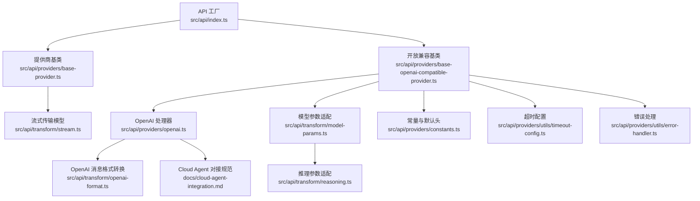
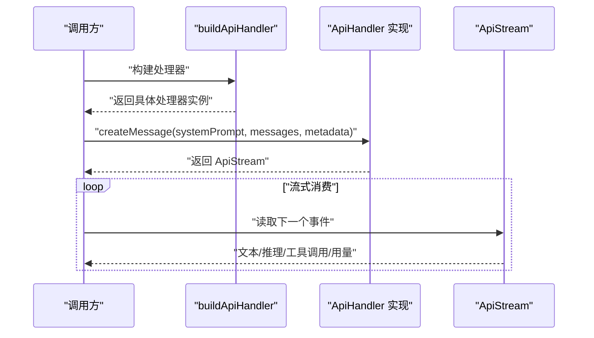
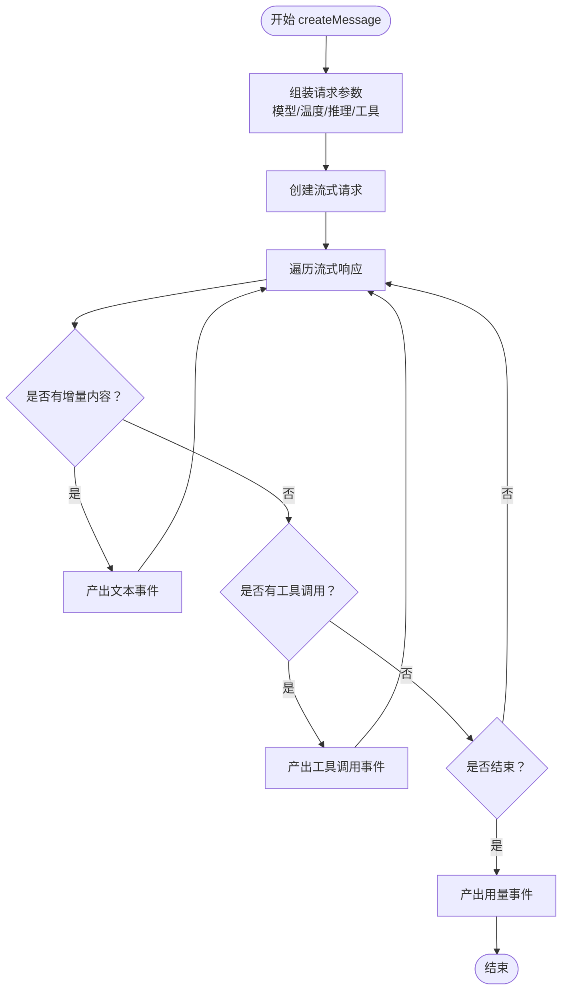
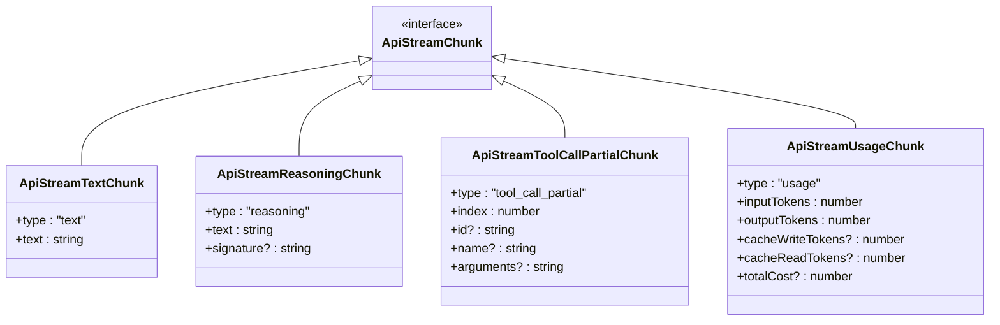
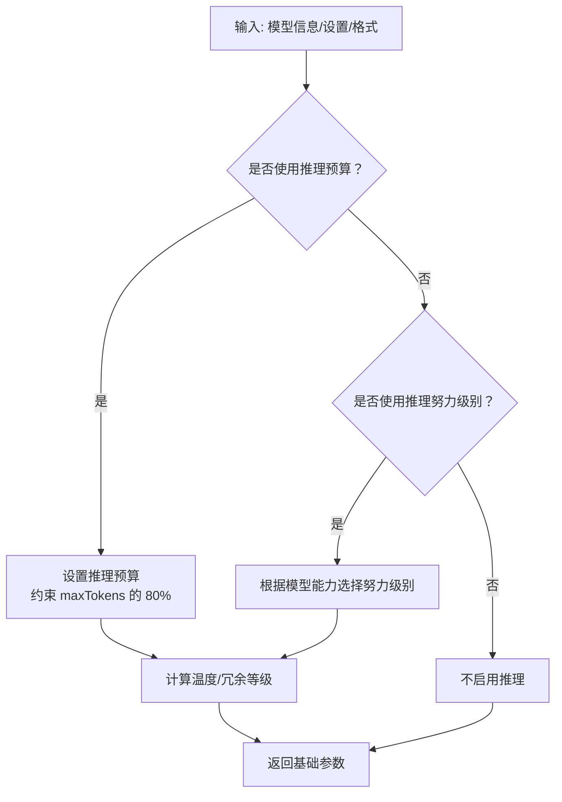
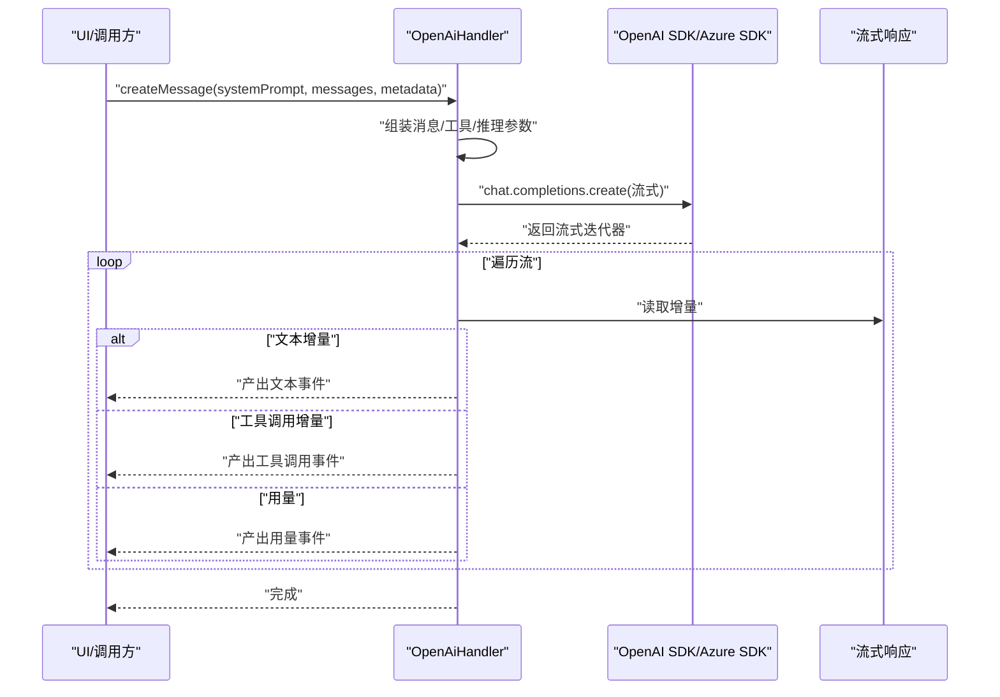
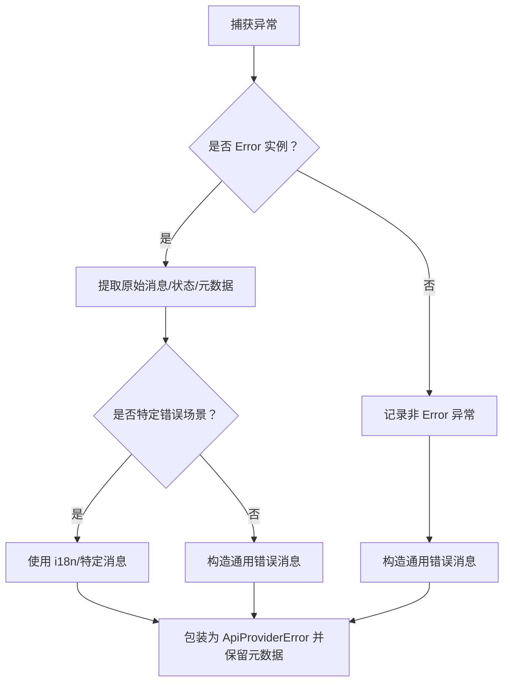
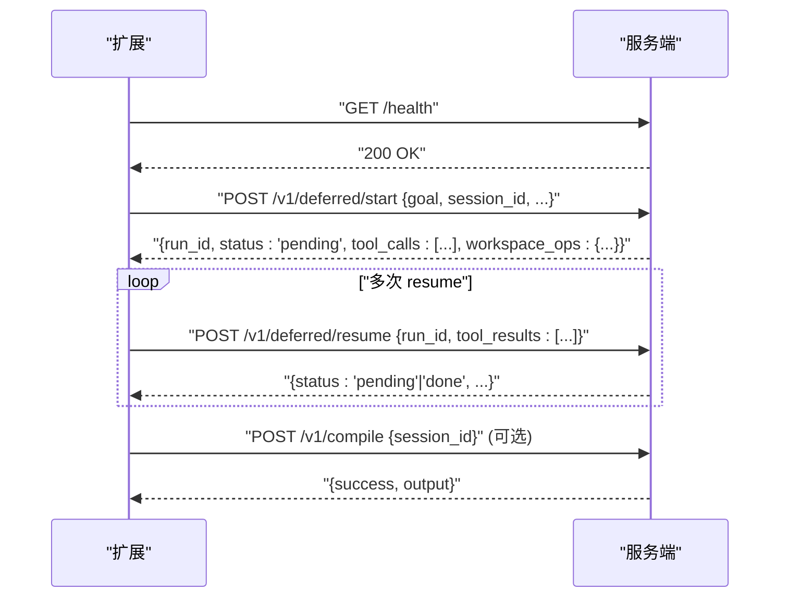
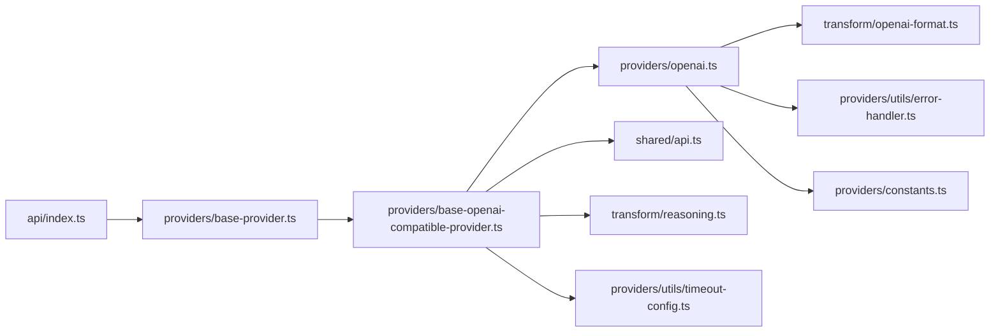

# API 集成模式

<cite>
**本文档引用的文件**
- [src/api/index.ts](file://src/api/index.ts)
- [src/api/providers/base-provider.ts](file://src/api/providers/base-provider.ts)
- [src/api/providers/base-openai-compatible-provider.ts](file://src/api/providers/base-openai-compatible-provider.ts)
- [src/api/transform/stream.ts](file://src/api/transform/stream.ts)
- [src/api/transform/model-params.ts](file://src/api/transform/model-params.ts)
- [src/api/providers/constants.ts](file://src/api/providers/constants.ts)
- [src/api/providers/utils/openai-error-handler.ts](file://src/api/providers/utils/openai-error-handler.ts)
- [src/shared/api.ts](file://src/shared/api.ts)
- [src/api/transform/reasoning.ts](file://src/api/transform/reasoning.ts)
- [src/api/providers/openai.ts](file://src/api/providers/openai.ts)
- [src/api/providers/utils/error-handler.ts](file://src/api/providers/utils/error-handler.ts)
- [src/api/transform/openai-format.ts](file://src/api/transform/openai-format.ts)
- [src/api/providers/utils/timeout-config.ts](file://src/api/providers/utils/timeout-config.ts)
- [docs/cloud-agent-integration.md](file://docs/cloud-agent-integration.md)
</cite>

## 目录
1. [简介](#简介)
2. [项目结构](#项目结构)
3. [核心组件](#核心组件)
4. [架构总览](#架构总览)
5. [详细组件分析](#详细组件分析)
6. [依赖关系分析](#依赖关系分析)
7. [性能考虑](#性能考虑)
8. [故障排除指南](#故障排除指南)
9. [结论](#结论)
10. [附录](#附录)

## 简介
本文件面向需要在 NJUST AI CJ 扩展中实现统一 API 集成的开发者，系统阐述统一 API 接口设计、请求/响应转换模式、错误处理策略、可扩展的 API 架构设计、统一认证机制以及跨服务数据同步方案。文档基于仓库中的 API 抽象层、流式传输模型、推理参数适配、错误处理与超时配置等核心模块，提供从架构到实现细节的完整指导。

## 项目结构
API 集成相关代码主要分布在以下目录：
- 统一接口与工厂：src/api/index.ts
- 提供商基类与开放兼容基类：src/api/providers/base-provider.ts、src/api/providers/base-openai-compatible-provider.ts
- 流式传输与事件模型：src/api/transform/stream.ts
- 推理参数与模型参数适配：src/api/transform/model-params.ts、src/api/transform/reasoning.ts
- OpenAI 兼容处理器：src/api/providers/openai.ts
- 常量与通用配置：src/api/providers/constants.ts、src/api/providers/utils/timeout-config.ts
- 错误处理与转换：src/api/providers/utils/error-handler.ts、src/api/providers/utils/openai-error-handler.ts
- OpenAI 消息格式转换：src/api/transform/openai-format.ts
- Cloud Agent 服务端对接规范：docs/cloud-agent-integration.md



**图表来源**
- [src/api/index.ts:114-191](file://src/api/index.ts#L114-L191)
- [src/api/providers/base-provider.ts:13-122](file://src/api/providers/base-provider.ts#L13-L122)
- [src/api/providers/base-openai-compatible-provider.ts:26-260](file://src/api/providers/base-openai-compatible-provider.ts#L26-L260)
- [src/api/providers/openai.ts:31-535](file://src/api/providers/openai.ts#L31-L535)
- [src/api/transform/stream.ts:1-115](file://src/api/transform/stream.ts#L1-L115)
- [src/api/transform/model-params.ts:75-190](file://src/api/transform/model-params.ts#L75-L190)
- [src/api/transform/reasoning.ts:107-169](file://src/api/transform/reasoning.ts#L107-L169)
- [src/api/transform/openai-format.ts:276-509](file://src/api/transform/openai-format.ts#L276-L509)
- [src/api/providers/constants.ts:3-7](file://src/api/providers/constants.ts#L3-L7)
- [src/api/providers/utils/timeout-config.ts:13-31](file://src/api/providers/utils/timeout-config.ts#L13-L31)
- [src/api/providers/utils/error-handler.ts:38-107](file://src/api/providers/utils/error-handler.ts#L38-L107)
- [docs/cloud-agent-integration.md:13-351](file://docs/cloud-agent-integration.md#L13-L351)

**章节来源**
- [src/api/index.ts:114-191](file://src/api/index.ts#L114-L191)
- [src/api/providers/base-provider.ts:13-122](file://src/api/providers/base-provider.ts#L13-L122)
- [src/api/providers/base-openai-compatible-provider.ts:26-260](file://src/api/providers/base-openai-compatible-provider.ts#L26-L260)
- [src/api/providers/openai.ts:31-535](file://src/api/providers/openai.ts#L31-L535)
- [src/api/transform/stream.ts:1-115](file://src/api/transform/stream.ts#L1-L115)
- [src/api/transform/model-params.ts:75-190](file://src/api/transform/model-params.ts#L75-L190)
- [src/api/transform/reasoning.ts:107-169](file://src/api/transform/reasoning.ts#L107-L169)
- [src/api/transform/openai-format.ts:276-509](file://src/api/transform/openai-format.ts#L276-L509)
- [src/api/providers/constants.ts:3-7](file://src/api/providers/constants.ts#L3-L7)
- [src/api/providers/utils/timeout-config.ts:13-31](file://src/api/providers/utils/timeout-config.ts#L13-L31)
- [src/api/providers/utils/error-handler.ts:38-107](file://src/api/providers/utils/error-handler.ts#L38-L107)
- [docs/cloud-agent-integration.md:13-351](file://docs/cloud-agent-integration.md#L13-L351)

## 核心组件
- 统一 API 接口与工厂
  - ApiHandler 接口定义统一的消息创建、模型查询与 token 计数能力。
  - buildApiHandler 工厂根据配置选择具体提供商处理器。
- 提供商抽象层
  - BaseProvider 提供通用功能（工具 schema 转换、默认 token 计数）。
  - BaseOpenAiCompatibleProvider 提供 OpenAI 兼容的流式处理、参数适配与错误处理。
- 流式传输模型
  - ApiStream 定义统一的流式事件类型，包括文本、推理、工具调用、用量统计等。
- 推理与模型参数适配
  - model-params 与 reasoning 模块负责根据模型能力与用户设置生成推理预算/努力级别与温度等参数。
- OpenAI 兼容处理器
  - OpenAiHandler 支持多种 OpenAI 生态变体（含 Azure OpenAI、Azure AI Inference、Grok/X.AI 等），并处理特殊模型族（如 o1/o3）。
- 错误处理与超时
  - 统一的 handleProviderError 与 handleOpenAIError 提供一致的错误包装与元数据保留。
  - getApiRequestTimeout 提供可配置的请求超时。
- Cloud Agent 对接
  - 文档定义了健康检查、运行与延迟执行协议、编译反馈循环及结构化工作区操作规范。

**章节来源**
- [src/api/index.ts:94-112](file://src/api/index.ts#L94-L112)
- [src/api/index.ts:114-191](file://src/api/index.ts#L114-L191)
- [src/api/providers/base-provider.ts:13-122](file://src/api/providers/base-provider.ts#L13-L122)
- [src/api/providers/base-openai-compatible-provider.ts:26-260](file://src/api/providers/base-openai-compatible-provider.ts#L26-L260)
- [src/api/transform/stream.ts:3-115](file://src/api/transform/stream.ts#L3-L115)
- [src/api/transform/model-params.ts:75-190](file://src/api/transform/model-params.ts#L75-L190)
- [src/api/transform/reasoning.ts:107-169](file://src/api/transform/reasoning.ts#L107-L169)
- [src/api/providers/openai.ts:31-535](file://src/api/providers/openai.ts#L31-L535)
- [src/api/providers/utils/error-handler.ts:38-107](file://src/api/providers/utils/error-handler.ts#L38-L107)
- [src/api/providers/utils/timeout-config.ts:13-31](file://src/api/providers/utils/timeout-config.ts#L13-L31)
- [docs/cloud-agent-integration.md:13-351](file://docs/cloud-agent-integration.md#L13-L351)

## 架构总览
统一 API 集成采用“工厂 + 抽象基类 + 流式传输”的分层设计，确保：
- 接口统一：所有提供商实现 ApiHandler，屏蔽差异。
- 参数适配：根据模型能力与用户设置动态生成推理参数与温度。
- 流式体验：统一的 ApiStream 事件模型，支持文本、推理、工具调用与用量统计。
- 错误一致：统一错误包装与元数据保留，便于 UI 与重试逻辑。
- 可扩展：新增提供商只需继承基类并实现必要方法。

```mermaid
classDiagram
class ApiHandler {
+createMessage(systemPrompt, messages, metadata) ApiStream
+getModel() {id, info}
+countTokens(contentBlocks) Promise<number>
}
class BaseProvider {
+createMessage(systemPrompt, messages, metadata) ApiStream
+getModel() {id, info}
+countTokens(contentBlocks) Promise<number>
-convertToolsForOpenAI(tools) any[]
-convertToolSchemaForOpenAI(schema) any
}
class BaseOpenAiCompatibleProvider {
+createMessage(systemPrompt, messages, metadata) ApiStream
+completePrompt(prompt) Promise<string>
+getModel() {id, info}
-createStream(systemPrompt, messages, metadata, requestOptions)
-processUsageMetrics(usage, modelInfo) ApiStreamUsageChunk
}
class OpenAiHandler {
+createMessage(systemPrompt, messages, metadata) ApiStream
+completePrompt(prompt) Promise<string>
+getModel() {id, info}
-addMaxTokensIfNeeded(requestOptions, modelInfo)
-processToolCalls(delta, finishReason, activeToolCallIds)
}
ApiHandler <|.. BaseProvider
BaseProvider <|-- BaseOpenAiCompatibleProvider
BaseOpenAiCompatibleProvider <|-- OpenAiHandler
```

**图表来源**
- [src/api/index.ts:94-112](file://src/api/index.ts#L94-L112)
- [src/api/providers/base-provider.ts:13-122](file://src/api/providers/base-provider.ts#L13-L122)
- [src/api/providers/base-openai-compatible-provider.ts:26-260](file://src/api/providers/base-openai-compatible-provider.ts#L26-L260)
- [src/api/providers/openai.ts:31-535](file://src/api/providers/openai.ts#L31-L535)

**章节来源**
- [src/api/index.ts:94-112](file://src/api/index.ts#L94-L112)
- [src/api/providers/base-provider.ts:13-122](file://src/api/providers/base-provider.ts#L13-L122)
- [src/api/providers/base-openai-compatible-provider.ts:26-260](file://src/api/providers/base-openai-compatible-provider.ts#L26-L260)
- [src/api/providers/openai.ts:31-535](file://src/api/providers/openai.ts#L31-L535)

## 详细组件分析

### 统一 API 接口与工厂
- ApiHandler 接口
  - createMessage：统一入口，返回 ApiStream，支持系统提示、消息序列与元数据（工具、温度、推理等）。
  - getModel：返回当前使用的模型 ID 与模型信息。
  - countTokens：默认使用 tiktoken，可被提供商覆盖。
- buildApiHandler 工厂
  - 根据配置选择具体提供商，支持大量主流与兼容提供商，并对已退役提供商进行明确提示。



**图表来源**
- [src/api/index.ts:114-191](file://src/api/index.ts#L114-L191)
- [src/api/index.ts:94-112](file://src/api/index.ts#L94-L112)

**章节来源**
- [src/api/index.ts:94-112](file://src/api/index.ts#L94-L112)
- [src/api/index.ts:114-191](file://src/api/index.ts#L114-L191)

### 提供商基类与开放兼容基类
- BaseProvider
  - 工具 schema 转换：将 MCP 工具与严格模式工具 schema 互转，保证 OpenAI Responses API 兼容性。
  - 默认 token 计数：使用 worker 加速的 tiktoken。
- BaseOpenAiCompatibleProvider
  - 统一的流式创建逻辑，集中处理 max_tokens、温度、工具调用与推理参数。
  - 统一的用量统计与成本计算。
  - 错误处理：捕获并转换 OpenAI 客户端错误为用户友好消息。



**图表来源**
- [src/api/providers/base-openai-compatible-provider.ts:113-200](file://src/api/providers/base-openai-compatible-provider.ts#L113-L200)
- [src/api/providers/base-openai-compatible-provider.ts:202-220](file://src/api/providers/base-openai-compatible-provider.ts#L202-L220)

**章节来源**
- [src/api/providers/base-provider.ts:13-122](file://src/api/providers/base-provider.ts#L13-L122)
- [src/api/providers/base-openai-compatible-provider.ts:26-260](file://src/api/providers/base-openai-compatible-provider.ts#L26-L260)

### 流式传输模型与事件类型
- ApiStreamChunk 定义了统一的事件类型集合，包括文本、推理、工具调用（开始/增量/结束/原始）、用量统计与错误。
- 统一的事件模型使得上层 UI 与工具解析器无需关心底层提供商差异。



**图表来源**
- [src/api/transform/stream.ts:3-115](file://src/api/transform/stream.ts#L3-L115)

**章节来源**
- [src/api/transform/stream.ts:3-115](file://src/api/transform/stream.ts#L3-L115)

### 推理参数与模型参数适配
- model-params
  - 根据模型能力与用户设置计算 maxTokens、温度、推理预算/努力级别与冗余等级。
  - 对 Hybrid Reasoning 模型与特定厂商模型（如 Gemini 2.5 Pro）进行特殊处理。
- reasoning
  - 为不同提供商生成对应的推理参数：Anthropic 的 thinkingConfig、OpenAI 的 reasoning_effort、Gemini 的 thinkingLevel 等。



**图表来源**
- [src/api/transform/model-params.ts:75-190](file://src/api/transform/model-params.ts#L75-L190)
- [src/api/transform/reasoning.ts:107-169](file://src/api/transform/reasoning.ts#L107-L169)

**章节来源**
- [src/api/transform/model-params.ts:75-190](file://src/api/transform/model-params.ts#L75-L190)
- [src/api/transform/reasoning.ts:107-169](file://src/api/transform/reasoning.ts#L107-L169)

### OpenAI 兼容处理器
- OpenAiHandler
  - 支持标准 OpenAI、Azure OpenAI、Azure AI Inference、Grok/X.AI 等变体。
  - 处理特殊模型族（如 o1/o3/o4）的参数差异与流式响应。
  - 统一工具调用处理与用量统计。



**图表来源**
- [src/api/providers/openai.ts:82-270](file://src/api/providers/openai.ts#L82-L270)
- [src/api/providers/openai.ts:295-327](file://src/api/providers/openai.ts#L295-L327)

**章节来源**
- [src/api/providers/openai.ts:31-535](file://src/api/providers/openai.ts#L31-L535)

### 错误处理策略
- handleProviderError
  - 统一包装错误，保留 HTTP 状态码、错误详情、AWS 元数据等，便于 UI 与重试逻辑。
  - 支持自定义消息前缀与转换器。
- handleOpenAIError
  - OpenAI 兼容错误的专用包装器，保持向后兼容。



**图表来源**
- [src/api/providers/utils/error-handler.ts:38-107](file://src/api/providers/utils/error-handler.ts#L38-L107)
- [src/api/providers/utils/openai-error-handler.ts:17-19](file://src/api/providers/utils/openai-error-handler.ts#L17-L19)

**章节来源**
- [src/api/providers/utils/error-handler.ts:38-107](file://src/api/providers/utils/error-handler.ts#L38-L107)
- [src/api/providers/utils/openai-error-handler.ts:17-19](file://src/api/providers/utils/openai-error-handler.ts#L17-L19)

### 超时配置与统一认证
- 超时配置
  - getApiRequestTimeout 从 VSCode 配置读取，支持禁用（返回 undefined）与毫秒转换。
- 默认请求头
  - DEFAULT_HEADERS 包含来源、标题与用户代理，便于服务端识别与统计。

**章节来源**
- [src/api/providers/utils/timeout-config.ts:13-31](file://src/api/providers/utils/timeout-config.ts#L13-L31)
- [src/api/providers/constants.ts:3-7](file://src/api/providers/constants.ts#L3-L7)

### Cloud Agent 服务端对接
- 协议概览
  - 支持 deferred（推荐）与 legacy 两种模式，分别对应 /v1/deferred/start 与 /v1/run。
  - 健康检查 /health，成功返回 200。
- 请求鉴权头
  - Content-Type、X-Device-Token、X-API-Key（按需）。
- Deferred 执行流程
  - start -> resume（多次）-> done，期间可返回 workspace_ops 与增量文本/推理/日志。
- 编译反馈循环
  - 成功：结束；失败：将错误作为 goal 再次运行，最多重试 N 次。



**图表来源**
- [docs/cloud-agent-integration.md:18-207](file://docs/cloud-agent-integration.md#L18-L207)
- [docs/cloud-agent-integration.md:218-259](file://docs/cloud-agent-integration.md#L218-L259)

**章节来源**
- [docs/cloud-agent-integration.md:13-351](file://docs/cloud-agent-integration.md#L13-L351)

## 依赖关系分析
- 组件耦合
  - ApiHandler 与 BaseProvider/子类之间为强契约关系，确保统一接口。
  - BaseOpenAiCompatibleProvider 依赖 shared/api.ts 的模型参数与推理配置。
  - OpenAiHandler 依赖 openai-format.ts 的消息转换与 reasoning.ts 的推理参数。
- 外部依赖
  - OpenAI SDK/AzureOpenAI SDK、axios（用于模型列表获取）、tiktoken（token 计数）。
- 潜在循环依赖
  - 当前结构清晰，未发现循环依赖迹象。



**图表来源**
- [src/api/index.ts:114-191](file://src/api/index.ts#L114-L191)
- [src/api/providers/base-provider.ts:13-122](file://src/api/providers/base-provider.ts#L13-L122)
- [src/api/providers/base-openai-compatible-provider.ts:26-260](file://src/api/providers/base-openai-compatible-provider.ts#L26-L260)
- [src/api/providers/openai.ts:31-535](file://src/api/providers/openai.ts#L31-L535)
- [src/api/transform/openai-format.ts:276-509](file://src/api/transform/openai-format.ts#L276-L509)
- [src/api/transform/reasoning.ts:107-169](file://src/api/transform/reasoning.ts#L107-L169)
- [src/api/providers/utils/error-handler.ts:38-107](file://src/api/providers/utils/error-handler.ts#L38-L107)
- [src/api/providers/utils/timeout-config.ts:13-31](file://src/api/providers/utils/timeout-config.ts#L13-L31)
- [src/api/providers/constants.ts:3-7](file://src/api/providers/constants.ts#L3-L7)

**章节来源**
- [src/api/index.ts:114-191](file://src/api/index.ts#L114-L191)
- [src/api/providers/base-provider.ts:13-122](file://src/api/providers/base-provider.ts#L13-L122)
- [src/api/providers/base-openai-compatible-provider.ts:26-260](file://src/api/providers/base-openai-compatible-provider.ts#L26-L260)
- [src/api/providers/openai.ts:31-535](file://src/api/providers/openai.ts#L31-L535)
- [src/api/transform/openai-format.ts:276-509](file://src/api/transform/openai-format.ts#L276-L509)
- [src/api/transform/reasoning.ts:107-169](file://src/api/transform/reasoning.ts#L107-L169)
- [src/api/providers/utils/error-handler.ts:38-107](file://src/api/providers/utils/error-handler.ts#L38-L107)
- [src/api/providers/utils/timeout-config.ts:13-31](file://src/api/providers/utils/timeout-config.ts#L13-L31)
- [src/api/providers/constants.ts:3-7](file://src/api/providers/constants.ts#L3-L7)

## 性能考虑
- 流式传输优先：统一使用流式响应，降低首字节延迟，提升交互体验。
- Token 计数优化：BaseProvider 默认使用 worker 加速的 tiktoken，减少主线程阻塞。
- 推理预算与温度：合理设置 maxTokens 与温度，避免过度消耗与不必要的计算。
- 超时配置：通过 getApiRequestTimeout 支持可配置超时，避免长时间挂起。
- 工具调用批处理：在流中聚合工具调用增量，减少事件风暴。

[本节为通用性能建议，不直接分析具体文件]

## 故障排除指南
- 常见错误类型
  - API Key 无效/字符非法：由 handleProviderError 捕获并提供 i18n 友好消息。
  - HTTP 状态码与元数据：保留 status、errorDetails、code、$metadata，便于 UI 与重试。
- 排查步骤
  - 检查 DEFAULT_HEADERS 与超时配置是否正确。
  - 确认模型参数（maxTokens、温度、推理）与提供商能力匹配。
  - 对于 Azure/OpenAI 生态差异，确认 URL 主机与 API 版本。
- 云代理问题
  - 确保 /health 可达，deferred 协议下的 start/resume 循环正常。
  - workspace_ops 校验失败不会导致 HTTP 层失败，但会忽略该段内容。

**章节来源**
- [src/api/providers/utils/error-handler.ts:38-107](file://src/api/providers/utils/error-handler.ts#L38-L107)
- [src/api/providers/utils/openai-error-handler.ts:17-19](file://src/api/providers/utils/openai-error-handler.ts#L17-L19)
- [src/api/providers/constants.ts:3-7](file://src/api/providers/constants.ts#L3-L7)
- [src/api/providers/utils/timeout-config.ts:13-31](file://src/api/providers/utils/timeout-config.ts#L13-L31)
- [docs/cloud-agent-integration.md:18-207](file://docs/cloud-agent-integration.md#L18-L207)

## 结论
通过统一的 API 接口设计、抽象的提供商基类、标准化的流式传输模型与完善的错误处理机制，NJUST AI CJ 的 API 集成具备良好的可扩展性与一致性。结合推理参数适配、OpenAI 生态兼容与 Cloud Agent 对接规范，能够支撑复杂场景下的跨服务数据同步与统一认证需求。

[本节为总结性内容，不直接分析具体文件]

## 附录
- API 版本管理与向后兼容
  - 通过 shared/api.ts 的 GetModelsOptions 与动态提供商映射，确保新提供商加入时编译期可见约束。
  - 对已退役提供商进行明确提示，避免运行时错误。
- 迁移策略
  - 新增提供商：继承 BaseProvider 或 BaseOpenAiCompatibleProvider，实现最小必要接口。
  - 参数演进：通过 model-params 与 reasoning 模块的条件分支，平滑过渡新旧参数。
  - Cloud Agent：优先采用 deferred 协议，legacy 模式仅作回退。

**章节来源**
- [src/shared/api.ts:168-187](file://src/shared/api.ts#L168-L187)
- [src/api/index.ts:117-121](file://src/api/index.ts#L117-L121)
- [docs/cloud-agent-integration.md:91-215](file://docs/cloud-agent-integration.md#L91-L215)