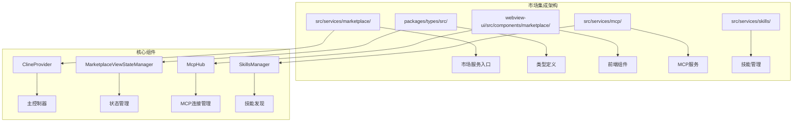
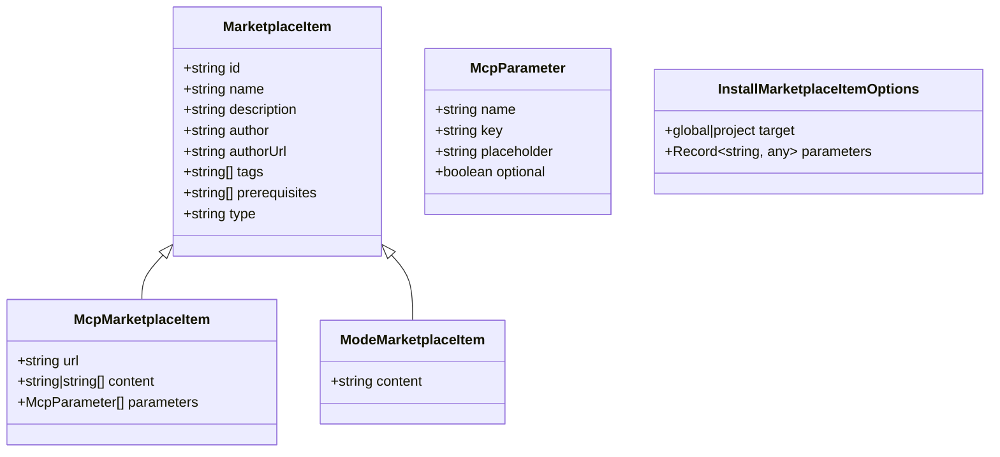
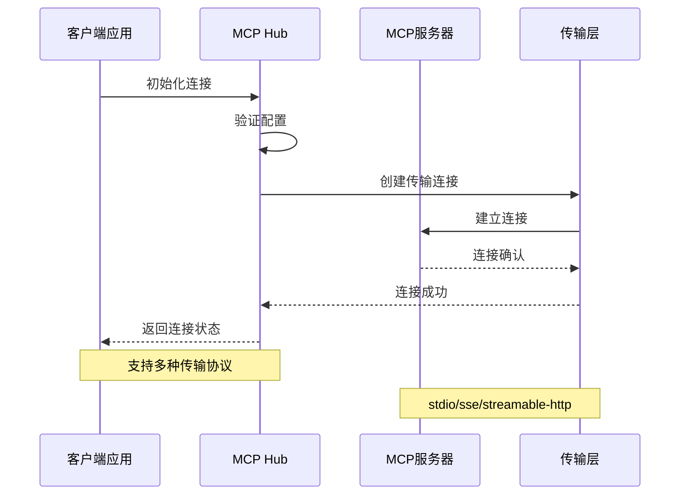
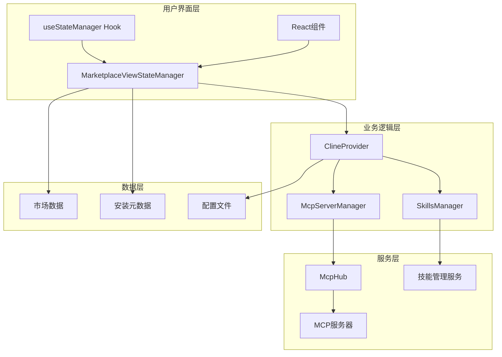
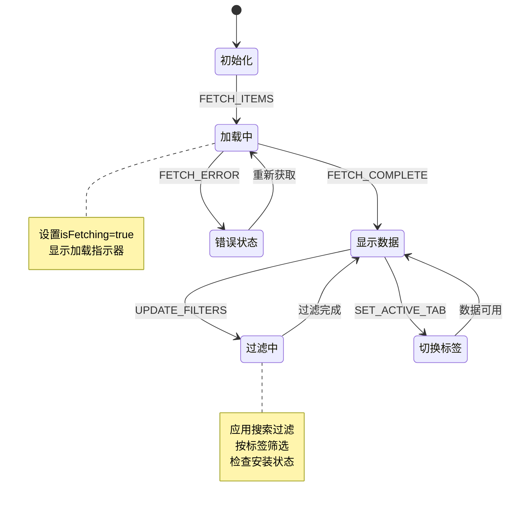
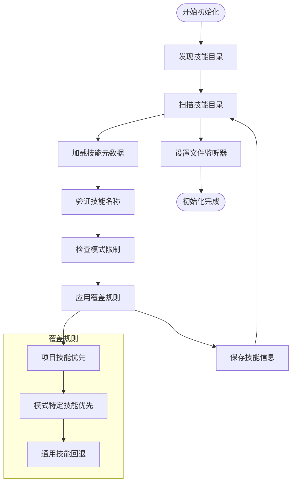
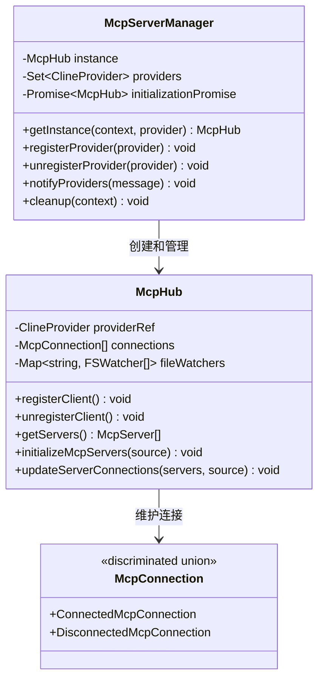
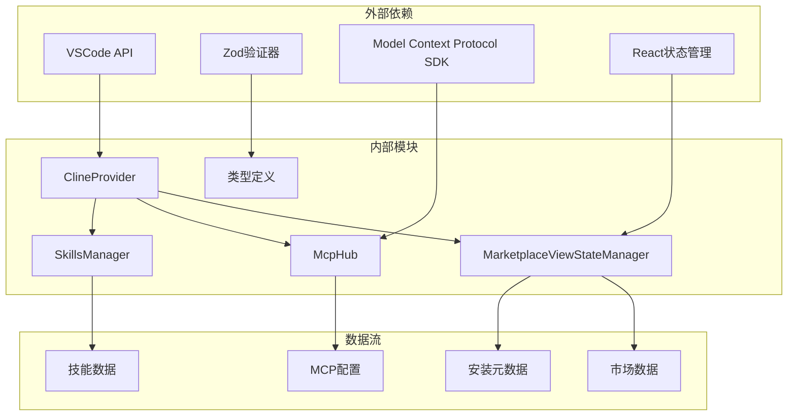

# 市场集成

<cite>
**本文档引用的文件**
- [src/services/marketplace/index.ts](file://src/services/marketplace/index.ts)
- [packages/types/src/marketplace.ts](file://packages/types/src/marketplace.ts)
- [webview-ui/src/components/marketplace/MarketplaceViewStateManager.ts](file://webview-ui/src/components/marketplace/MarketplaceViewStateManager.ts)
- [webview-ui/src/components/marketplace/useStateManager.ts](file://webview-ui/src/components/marketplace/useStateManager.ts)
- [src/services/mcp/McpHub.ts](file://src/services/mcp/McpHub.ts)
- [src/services/mcp/McpServerManager.ts](file://src/services/mcp/McpServerManager.ts)
- [src/services/skills/SkillsManager.ts](file://src/services/skills/SkillsManager.ts)
- [src/services/skills/skillInvocation.ts](file://src/services/skills/skillInvocation.ts)
- [src/shared/skills.ts](file://src/shared/skills.ts)
- [src/core/webview/ClineProvider.ts](file://src/core/webview/ClineProvider.ts)
</cite>

## 目录
1. [简介](#简介)
2. [项目结构](#项目结构)
3. [核心组件](#核心组件)
4. [架构概览](#架构概览)
5. [详细组件分析](#详细组件分析)
6. [依赖关系分析](#依赖关系分析)
7. [性能考虑](#性能考虑)
8. [故障排除指南](#故障排除指南)
9. [结论](#结论)

## 简介

市场集成服务是NJU-SCAI-CJ AI助手生态系统中的关键组件，负责管理技能市场、工具市场和插件市场。该系统基于Model Context Protocol (MCP) 架构，提供了一个统一的市场平台来发现、安装和管理各种AI工具和服务。

本系统的核心特性包括：
- **多类型市场支持**：技能市场、工具市场和插件市场
- **MCP协议集成**：完整的MCP服务器配置和管理
- **智能搜索过滤**：基于标签、类型和安装状态的过滤系统
- **实时状态管理**：React状态管理器确保UI响应性
- **版本控制**：支持全局和项目级别的安装管理

## 项目结构

市场集成服务采用模块化架构，主要分布在以下目录中：

**图表来源**
- [src/services/marketplace/index.ts:1-4](file://src/services/marketplace/index.ts#L1-L4)
- [src/core/webview/ClineProvider.ts:126-225](file://src/core/webview/ClineProvider.ts#L126-L225)

**章节来源**
- [src/services/marketplace/index.ts:1-4](file://src/services/marketplace/index.ts#L1-L4)
- [packages/types/src/marketplace.ts:1-94](file://packages/types/src/marketplace.ts#L1-L94)

## 核心组件

### 市场类型系统

市场集成服务使用Zod验证器定义了完整的类型系统，确保数据的一致性和完整性。

**图表来源**
- [packages/types/src/marketplace.ts:67-76](file://packages/types/src/marketplace.ts#L67-L76)
- [packages/types/src/marketplace.ts:18-25](file://packages/types/src/marketplace.ts#L18-L25)
- [packages/types/src/marketplace.ts:56-62](file://packages/types/src/marketplace.ts#L56-L62)

### MCP服务器管理

MCP Hub提供了完整的MCP服务器生命周期管理，包括连接、监控和故障恢复。

**图表来源**
- [src/services/mcp/McpHub.ts:656-800](file://src/services/mcp/McpHub.ts#L656-L800)
- [src/services/mcp/McpHub.ts:151-176](file://src/services/mcp/McpHub.ts#L151-L176)

**章节来源**
- [packages/types/src/marketplace.ts:1-94](file://packages/types/src/marketplace.ts#L1-L94)
- [src/services/mcp/McpHub.ts:151-800](file://src/services/mcp/McpHub.ts#L151-L800)

## 架构概览

市场集成服务采用分层架构设计，确保各组件之间的松耦合和高内聚。

**图表来源**
- [src/core/webview/ClineProvider.ts:126-225](file://src/core/webview/ClineProvider.ts#L126-L225)
- [webview-ui/src/components/marketplace/MarketplaceViewStateManager.ts:50-86](file://webview-ui/src/components/marketplace/MarketplaceViewStateManager.ts#L50-L86)

## 详细组件分析

### 市场视图状态管理器

MarketplaceViewStateManager是前端状态管理的核心组件，负责管理市场视图的所有状态变化。

**图表来源**
- [webview-ui/src/components/marketplace/MarketplaceViewStateManager.ts:163-295](file://webview-ui/src/components/marketplace/MarketplaceViewStateManager.ts#L163-L295)

#### 状态转换处理

状态管理器实现了完整的状态转换逻辑，包括：

1. **数据获取流程**：从扩展服务获取市场数据
2. **过滤系统**：支持类型、搜索词、标签和安装状态过滤
3. **UI更新优化**：避免不必要的重渲染
4. **错误处理**：优雅处理数据获取失败

**章节来源**
- [webview-ui/src/components/marketplace/MarketplaceViewStateManager.ts:1-487](file://webview-ui/src/components/marketplace/MarketplaceViewStateManager.ts#L1-L487)
- [webview-ui/src/components/marketplace/useStateManager.ts:1-32](file://webview-ui/src/components/marketplace/useStateManager.ts#L1-L32)

### 技能管理系统

SkillsManager提供了完整的技能发现、管理和加载功能，支持全局和项目级别的技能管理。

**图表来源**
- [src/services/skills/SkillsManager.ts:32-52](file://src/services/skills/SkillsManager.ts#L32-L52)
- [src/services/skills/SkillsManager.ts:185-253](file://src/services/skills/SkillsManager.ts#L185-L253)

#### 技能发现机制

系统支持多种技能发现方式：

1. **目录扫描**：自动扫描全局和项目技能目录
2. **符号链接支持**：支持技能目录和文件的符号链接
3. **模式特定技能**：支持按模式分类的技能管理
4. **实时监控**：通过文件系统监听器实现实时更新

**章节来源**
- [src/services/skills/SkillsManager.ts:1-730](file://src/services/skills/SkillsManager.ts#L1-L730)
- [src/shared/skills.ts:1-28](file://src/shared/skills.ts#L1-L28)

### MCP服务器管理

McpServerManager实现了MCP服务器的单例管理模式，确保跨多个webview实例的统一管理。

**图表来源**
- [src/services/mcp/McpServerManager.ts:9-87](file://src/services/mcp/McpServerManager.ts#L9-L87)
- [src/services/mcp/McpHub.ts:151-207](file://src/services/mcp/McpHub.ts#L151-L207)

#### MCP配置管理

系统支持多种MCP服务器配置方式：

1. **全局配置**：`.njust_ai/skills/mcp.json`
2. **项目配置**：工作空间根目录下的mcp.json
3. **动态配置**：运行时热更新配置
4. **环境变量注入**：支持变量替换和魔法变量

**章节来源**
- [src/services/mcp/McpServerManager.ts:1-87](file://src/services/mcp/McpServerManager.ts#L1-L87)
- [src/services/mcp/McpHub.ts:547-611](file://src/services/mcp/McpHub.ts#L547-L611)

## 依赖关系分析

市场集成服务的依赖关系呈现清晰的层次结构：

**图表来源**
- [src/core/webview/ClineProvider.ts:71-76](file://src/core/webview/ClineProvider.ts#L71-L76)
- [packages/types/src/marketplace.ts:1-13](file://packages/types/src/marketplace.ts#L1-L13)

### 组件耦合度分析

- **低耦合设计**：各组件通过明确的接口交互
- **单一职责**：每个组件专注于特定的功能领域
- **可测试性**：良好的抽象使得单元测试成为可能
- **可扩展性**：模块化设计便于功能扩展

**章节来源**
- [src/core/webview/ClineProvider.ts:126-225](file://src/core/webview/ClineProvider.ts#L126-L225)
- [webview-ui/src/components/marketplace/MarketplaceViewStateManager.ts:19-33](file://webview-ui/src/components/marketplace/MarketplaceViewStateManager.ts#L19-L33)

## 性能考虑

### 内存优化策略

1. **懒加载机制**：技能和市场数据按需加载
2. **缓存策略**：使用WeakRef避免内存泄漏
3. **状态最小化**：只存储必要的状态信息
4. **批量更新**：合并多次状态更新以减少重渲染

### 网络性能优化

1. **连接池管理**：复用MCP连接减少建立开销
2. **配置缓存**：缓存MCP服务器配置避免重复解析
3. **增量更新**：只更新发生变化的数据
4. **超时控制**：合理的超时设置避免资源占用

### 前端性能优化

1. **虚拟滚动**：大量市场项目的高效显示
2. **防抖处理**：搜索输入的防抖优化
3. **条件渲染**：根据状态变化进行选择性渲染
4. **事件委托**：减少事件处理器的数量

## 故障排除指南

### 常见问题诊断

#### MCP连接问题

**症状**：MCP服务器无法连接或频繁断开

**诊断步骤**：
1. 检查MCP配置文件语法
2. 验证服务器可达性
3. 查看错误日志输出
4. 确认网络连接状态

**解决方案**：
- 修复配置文件格式错误
- 检查防火墙设置
- 验证服务器状态
- 重启MCP Hub服务

#### 技能加载失败

**症状**：技能无法被发现或加载

**诊断步骤**：
1. 检查SKILL.md文件格式
2. 验证技能名称规范
3. 确认文件权限设置
4. 查看文件系统监听器状态

**解决方案**：
- 修正SKILL.md前言字段
- 使用有效的技能名称
- 调整文件权限
- 重启文件监听器

#### 市场数据获取失败

**症状**：市场项目列表为空或加载缓慢

**诊断步骤**：
1. 检查网络连接状态
2. 验证市场API可用性
3. 查看缓存状态
4. 检查过滤条件

**解决方案**：
- 重置网络连接
- 清除缓存数据
- 简化过滤条件
- 重新加载市场数据

**章节来源**
- [src/services/mcp/McpHub.ts:281-284](file://src/services/mcp/McpHub.ts#L281-L284)
- [src/services/skills/SkillsManager.ts:174-177](file://src/services/skills/SkillsManager.ts#L174-L177)

## 结论

市场集成服务展现了现代AI助手生态系统的设计理念，通过模块化架构、类型安全和智能状态管理，为用户提供了一体化的技能、工具和插件管理体验。

### 主要优势

1. **架构清晰**：分层设计确保了代码的可维护性
2. **类型安全**：完整的Zod类型定义保证了数据一致性
3. **性能优化**：多层缓存和懒加载机制提升了用户体验
4. **扩展性强**：模块化设计便于功能扩展和定制

### 未来发展方向

1. **智能化推荐**：基于使用模式的个性化推荐算法
2. **分布式架构**：支持多节点部署和负载均衡
3. **增强搜索**：支持语义搜索和向量检索
4. **生态集成**：与其他AI平台的深度集成

该系统为AI助手的市场集成提供了一个坚实的基础，通过持续的优化和扩展，将为用户带来更加丰富和便捷的AI工具使用体验。