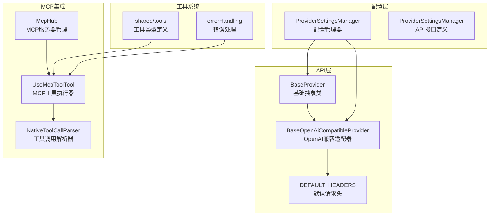
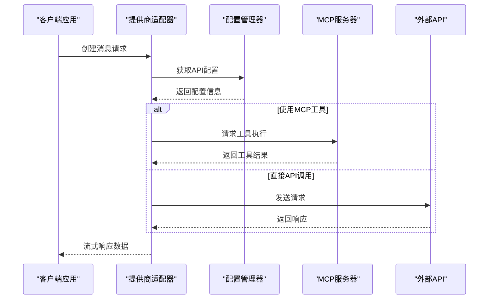
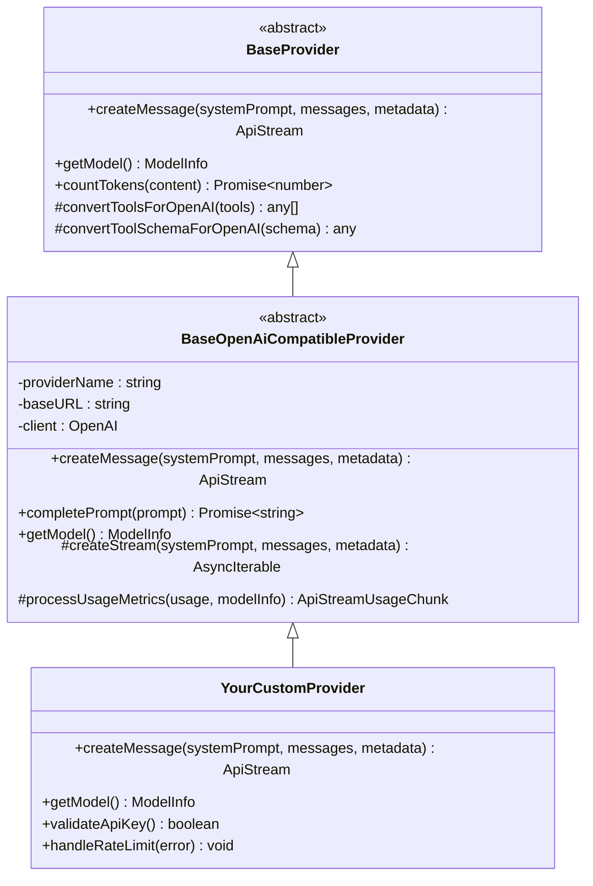
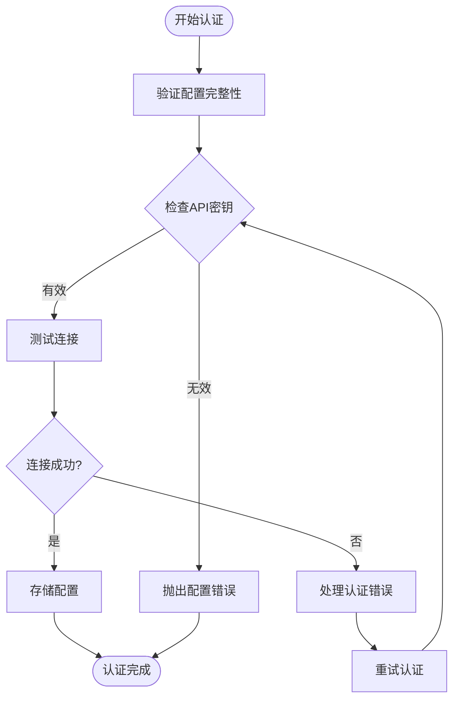
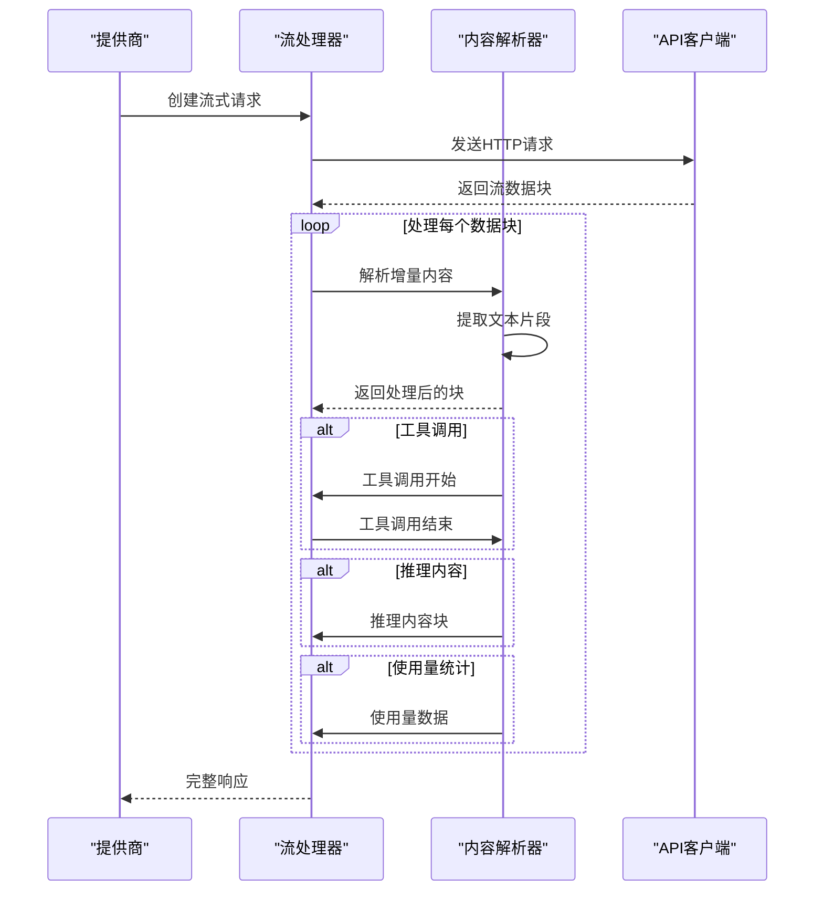
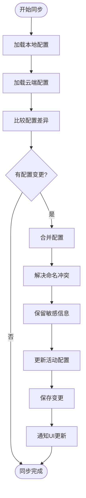
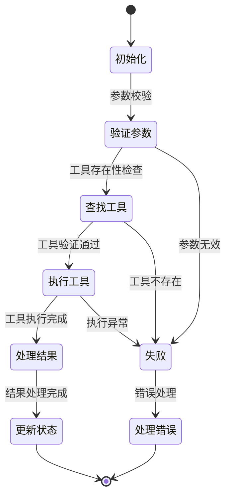
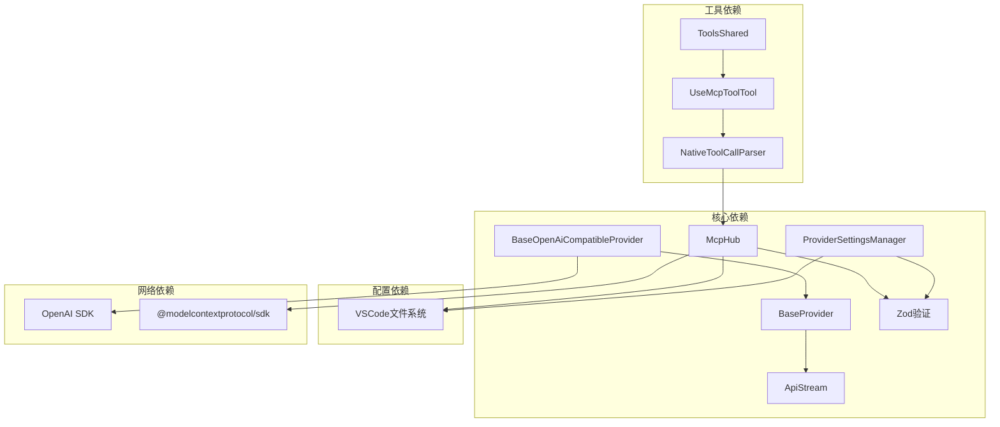
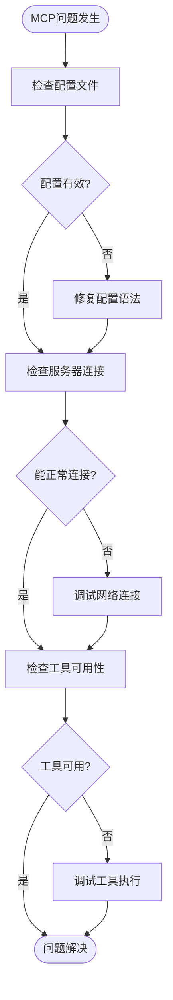

# 自定义集成开发

<cite>
**本文档引用的文件**
- [src/api/providers/base-provider.ts](file://src/api/providers/base-provider.ts)
- [src/api/providers/base-openai-compatible-provider.ts](file://src/api/providers/base-openai-compatible-provider.ts)
- [src/api/providers/constants.ts](file://src/api/providers/constants.ts)
- [src/core/config/ProviderSettingsManager.ts](file://src/core/config/ProviderSettingsManager.ts)
- [packages/types/src/api.ts](file://packages/types/src/api.ts)
- [src/services/mcp/McpHub.ts](file://src/services/mcp/McpHub.ts)
- [src/core/tools/UseMcpToolTool.ts](file://src/core/tools/UseMcpToolTool.ts)
- [src/core/assistant-message/NativeToolCallParser.ts](file://src/core/assistant-message/NativeToolCallParser.ts)
- [src/utils/errorHandling.ts](file://src/utils/errorHandling.ts)
- [src/shared/tools.ts](file://src/shared/tools.ts)
- [src/api/transform/cache-strategy/multi-point-strategy.ts](file://src/api/transform/cache-strategy/multi-point-strategy.ts)
- [src/api/transform/caching/gemini.ts](file://src/api/transform/caching/gemini.ts)
- [apps/cli/scripts/integration/run.ts](file://apps/cli/scripts/integration/run.ts)
- [test-mcp-server.mjs](file://test-mcp-server.mjs)
</cite>

## 目录
1. [简介](#简介)
2. [项目结构](#项目结构)
3. [核心组件](#核心组件)
4. [架构概览](#架构概览)
5. [详细组件分析](#详细组件分析)
6. [依赖关系分析](#依赖关系分析)
7. [性能考虑](#性能考虑)
8. [故障排除指南](#故障排除指南)
9. [结论](#结论)
10. [附录](#附录)

## 简介

本指南面向开发者，提供在现有系统基础上开发新的第三方服务集成的完整方法论。系统已内置多种AI模型提供商适配层（如OpenAI兼容接口），以及MCP（Model Context Protocol）工具服务器集成能力。通过遵循本文档的模板、最佳实践和架构设计原则，您可以快速、安全地将新的第三方服务无缝集成到现有平台中。

## 项目结构

系统采用模块化架构，主要涉及以下关键目录：

- **src/api/providers**: 提供商适配层，包含基础抽象类和具体提供商实现
- **src/core/config**: 配置管理与提供商配置存储
- **src/services/mcp**: MCP协议客户端与服务器管理
- **src/core/tools**: 工具执行器，支持本地工具和MCP工具
- **src/api/transform**: 数据转换与缓存策略
- **apps/cli/scripts/integration**: 集成测试脚本与案例



**图表来源**
- [src/api/providers/base-provider.ts:1-123](file://src/api/providers/base-provider.ts#L1-L123)
- [src/api/providers/base-openai-compatible-provider.ts:1-261](file://src/api/providers/base-openai-compatible-provider.ts#L1-L261)
- [src/core/config/ProviderSettingsManager.ts:380-598](file://src/core/config/ProviderSettingsManager.ts#L380-L598)

**章节来源**
- [src/api/providers/base-provider.ts:1-123](file://src/api/providers/base-provider.ts#L1-L123)
- [src/api/providers/base-openai-compatible-provider.ts:1-261](file://src/api/providers/base-openai-compatible-provider.ts#L1-L261)
- [src/core/config/ProviderSettingsManager.ts:380-598](file://src/core/config/ProviderSettingsManager.ts#L380-L598)

## 核心组件

### 基础提供商抽象层

系统提供了两层抽象来支持不同类型的API集成：

1. **BaseProvider**: 通用AI模型提供商抽象
   - 定义统一的消息创建接口
   - 提供工具参数转换机制
   - 实现基础的令牌计数功能

2. **BaseOpenAiCompatibleProvider**: OpenAI兼容接口适配器
   - 继承BaseProvider并实现单次完成处理
   - 提供流式响应处理和使用量统计
   - 支持推理模式和工具调用

### 配置管理系统

ProviderSettingsManager负责：
- API配置文件的加载与存储
- 多配置文件支持（全局与项目级）
- 配置验证与迁移
- 云同步与冲突解决

### MCP集成框架

McpHub提供完整的MCP协议支持：
- 多种传输方式（STDIO、SSE、Streamable HTTP）
- 动态服务器发现与连接管理
- 配置文件监控与热重载
- 错误处理与状态跟踪

**章节来源**
- [src/api/providers/base-provider.ts:13-123](file://src/api/providers/base-provider.ts#L13-L123)
- [src/api/providers/base-openai-compatible-provider.ts:26-261](file://src/api/providers/base-openai-compatible-provider.ts#L26-L261)
- [src/core/config/ProviderSettingsManager.ts:580-598](file://src/core/config/ProviderSettingsManager.ts#L580-L598)
- [src/services/mcp/McpHub.ts:151-176](file://src/services/mcp/McpHub.ts#L151-L176)

## 架构概览

系统采用分层架构设计，确保各组件职责清晰且松耦合：



**图表来源**
- [src/api/providers/base-openai-compatible-provider.ts:113-200](file://src/api/providers/base-openai-compatible-provider.ts#L113-L200)
- [src/core/config/ProviderSettingsManager.ts:380-417](file://src/core/config/ProviderSettingsManager.ts#L380-L417)
- [src/services/mcp/McpHub.ts:656-800](file://src/services/mcp/McpHub.ts#L656-L800)

## 详细组件分析

### 新增第三方服务集成模板

#### 1. 基础提供商实现



**图表来源**
- [src/api/providers/base-provider.ts:13-123](file://src/api/providers/base-provider.ts#L13-L123)
- [src/api/providers/base-openai-compatible-provider.ts:26-68](file://src/api/providers/base-openai-compatible-provider.ts#L26-L68)

#### 2. 配置文件结构

新增提供商需要的配置项：

| 配置项 | 类型 | 必需 | 描述 |
|--------|------|------|------|
| `providerName` | string | 是 | 服务提供商名称 |
| `apiKey` | string | 是 | API访问密钥 |
| `baseURL` | string | 是 | API基础URL |
| `defaultModel` | string | 是 | 默认模型ID |
| `models` | object | 是 | 模型配置映射 |
| `timeout` | number | 否 | 请求超时时间（秒） |
| `rateLimit` | number | 否 | 全局限制（秒） |

#### 3. 认证机制实现



**图表来源**
- [src/api/providers/base-openai-compatible-provider.ts:58-67](file://src/api/providers/base-openai-compatible-provider.ts#L58-L67)
- [src/core/config/ProviderSettingsManager.ts:380-417](file://src/core/config/ProviderSettingsManager.ts#L380-L417)

### API客户端封装

#### 1. 流式响应处理

BaseOpenAiCompatibleProvider实现了完整的流式响应处理：



**图表来源**
- [src/api/providers/base-openai-compatible-provider.ts:113-200](file://src/api/providers/base-openai-compatible-provider.ts#L113-L200)

#### 2. 错误处理与重试机制

系统实现了智能的错误处理和重试策略：

| 错误类型 | 处理策略 | 重试次数 | 退避算法 |
|----------|----------|----------|----------|
| 429 限流 | 指数退避 | 最多5次 | 2^n秒 |
| 5xx 服务器错误 | 指数退避 | 最多3次 | 2^n秒 |
| 网络超时 | 固定延迟 | 无限制 | 1秒 |
| 认证失败 | 直接失败 | 0次 | 不重试 |

### 数据同步策略

#### 1. 配置同步流程



**图表来源**
- [src/core/config/ProviderSettingsManager.ts:699-845](file://src/core/config/ProviderSettingsManager.ts#L699-L845)

#### 2. MCP服务器同步

McpHub实现了动态服务器发现和同步：

- **文件监控**: 自动监听mcp.json配置文件变化
- **动态连接**: 支持服务器的热插拔
- **优先级规则**: 项目级配置优先于全局配置
- **错误隔离**: 单个服务器故障不影响其他服务器

### 工具执行与状态管理

#### 1. 工具调用生命周期



**图表来源**
- [src/core/tools/UseMcpToolTool.ts:30-43](file://src/core/tools/UseMcpToolTool.ts#L30-L43)
- [src/core/assistant-message/NativeToolCallParser.ts:1094-1130](file://src/core/assistant-message/NativeToolCallParser.ts#L1094-L1130)

#### 2. 工具类型系统

系统提供了完整的工具类型定义：

| 工具类别 | 工具名称 | 参数类型 | 功能描述 |
|----------|----------|----------|----------|
| 文件操作 | read_file | path, start_line, end_line | 读取文件内容 |
| 文件操作 | write_to_file | path, content | 写入文件内容 |
| 命令执行 | execute_command | command, cwd, timeout | 执行系统命令 |
| 代码搜索 | codebase_search | query, path | 代码库搜索 |
| 网络搜索 | web_search | search_query, count | 网络搜索 |
| MCP工具 | use_mcp_tool | server_name, tool_name, arguments | 调用MCP工具 |

**章节来源**
- [src/shared/tools.ts:96-125](file://src/shared/tools.ts#L96-L125)
- [src/core/tools/UseMcpToolTool.ts:12-26](file://src/core/tools/UseMcpToolTool.ts#L12-L26)

## 依赖关系分析

系统组件间的依赖关系如下：



**图表来源**
- [src/api/providers/base-openai-compatible-provider.ts:1-16](file://src/api/providers/base-openai-compatible-provider.ts#L1-L16)
- [src/services/mcp/McpHub.ts:1-20](file://src/services/mcp/McpHub.ts#L1-L20)

**章节来源**
- [src/api/providers/base-openai-compatible-provider.ts:1-16](file://src/api/providers/base-openai-compatible-provider.ts#L1-L16)
- [src/services/mcp/McpHub.ts:1-20](file://src/services/mcp/McpHub.ts#L1-L20)

## 性能考虑

### 缓存策略优化

系统实现了智能的缓存控制策略：

1. **多点缓存策略**: 通过分析消息间的令牌分布，自动选择最优的缓存点组合
2. **频率控制**: 支持按用户消息频率添加缓存断点，平衡性能与准确性
3. **令牌估算**: 基于实际内容估算令牌数量，避免过度缓存

### 流式处理优化

- **增量解析**: 使用TagMatcher实现实时内容解析
- **并发工具调用**: 支持并行工具调用以提高响应速度
- **内存管理**: 及时清理已完成的工具调用状态

### 网络请求优化

- **连接复用**: 复用HTTP连接减少建立开销
- **超时控制**: 智能超时配置避免长时间阻塞
- **错误重试**: 指数退避重试机制提高成功率

## 故障排除指南

### 常见问题诊断

#### 1. 配置相关问题

| 问题症状 | 可能原因 | 解决方案 |
|----------|----------|----------|
| API密钥验证失败 | 密钥格式错误或过期 | 检查密钥格式并重新配置 |
| 模型不可用 | 模型ID不正确 | 验证模型列表中的可用模型 |
| 连接超时 | 网络不稳定 | 检查网络连接和防火墙设置 |
| 权限不足 | API权限配置错误 | 检查API权限范围 |

#### 2. MCP集成问题



**图表来源**
- [src/services/mcp/McpHub.ts:325-361](file://src/services/mcp/McpHub.ts#L325-L361)

#### 3. 错误处理最佳实践

系统提供了专门的错误处理工具：

- **忽略特定错误**: `ignoreAbortError`用于处理取消操作的异常
- **统一错误格式**: 标准化的错误消息格式便于诊断
- **错误历史记录**: 自动记录服务器错误历史便于追踪

**章节来源**
- [src/utils/errorHandling.ts:9-15](file://src/utils/errorHandling.ts#L9-L15)
- [src/services/mcp/McpHub.ts:281-283](file://src/services/mcp/McpHub.ts#L281-L283)

## 结论

通过遵循本指南提供的架构模式和最佳实践，您可以高效地开发新的第三方服务集成。关键要点包括：

1. **遵循抽象层次**: 使用BaseProvider和BaseOpenAiCompatibleProvider作为基类
2. **配置管理**: 利用ProviderSettingsManager实现配置的持久化和同步
3. **MCP集成**: 通过McpHub实现标准的MCP协议支持
4. **错误处理**: 实现健壮的错误处理和重试机制
5. **性能优化**: 应用缓存策略和流式处理技术

这些组件共同构成了一个可扩展、可维护的集成框架，能够支持各种第三方服务的无缝接入。

## 附录

### 开发步骤清单

1. **需求分析**: 明确目标服务的功能特性和集成要求
2. **架构设计**: 设计提供商适配器和配置结构
3. **实现开发**: 编写核心业务逻辑和错误处理
4. **测试验证**: 编写单元测试和集成测试
5. **文档完善**: 更新相关文档和配置示例
6. **部署集成**: 将新集成合并到主分支

### 测试策略

系统提供了完善的测试基础设施：

- **单元测试**: 针对核心组件的功能测试
- **集成测试**: 端到端的服务集成测试
- **性能测试**: 缓存策略和流式处理的性能验证
- **回归测试**: 确保现有功能不受影响

### 配置示例

```json
{
  "mcpServers": {
    "your-server": {
      "type": "stdio",
      "command": "node",
      "args": ["path/to/server"],
      "env": {
        "YOUR_API_KEY": "$YOUR_API_KEY"
      }
    }
  }
}
```