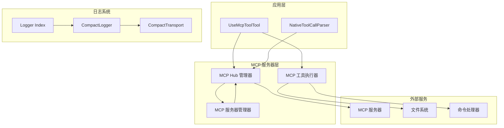
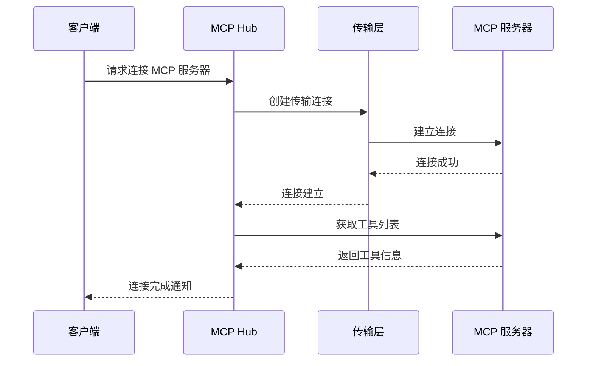
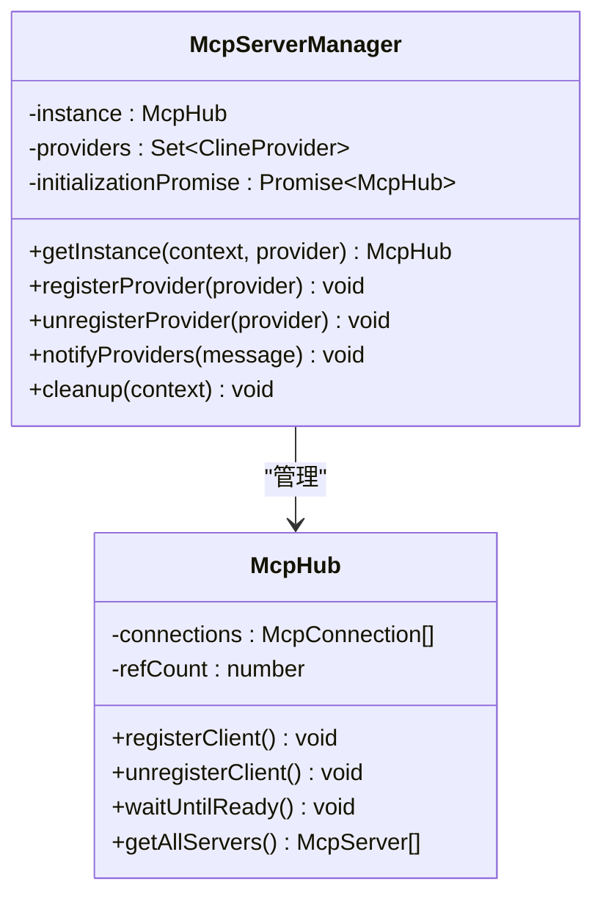
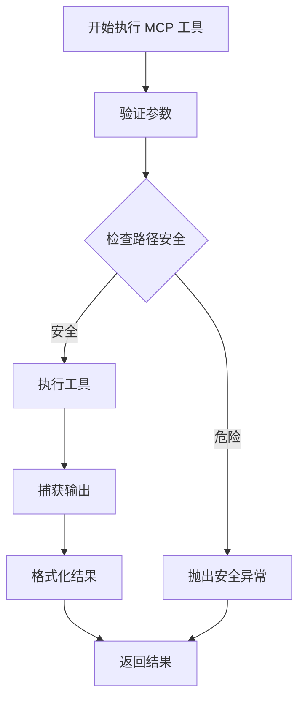
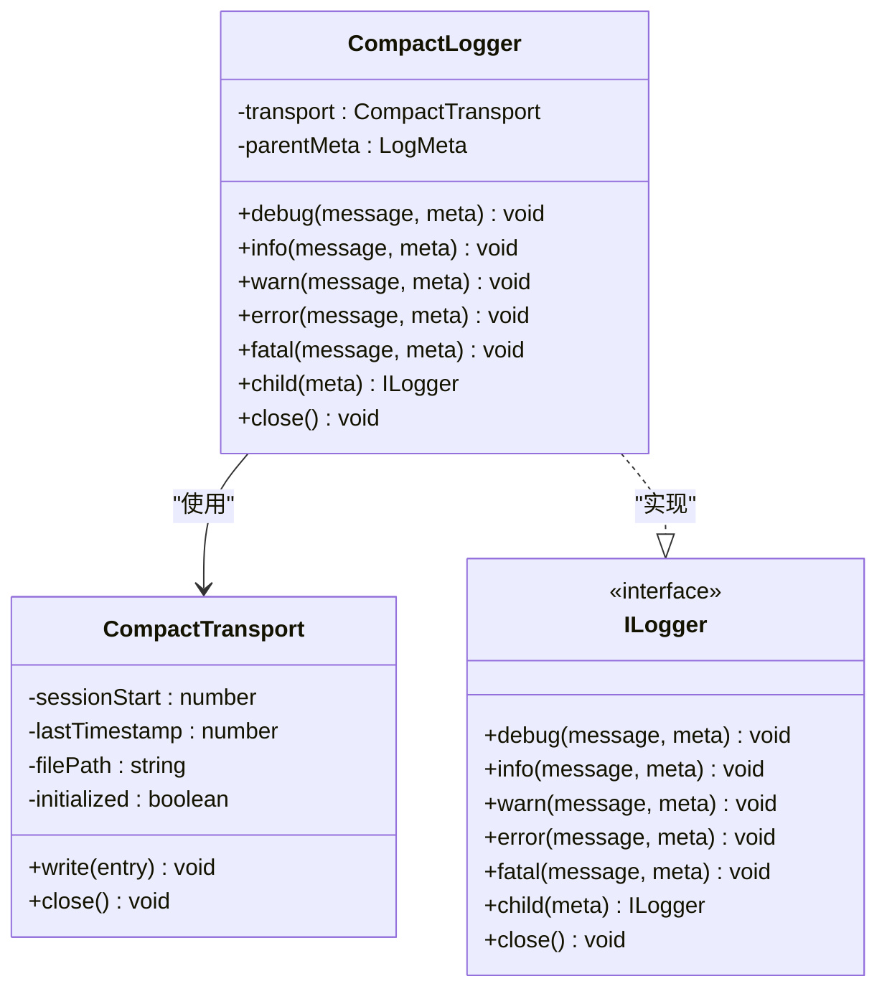
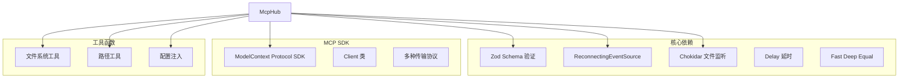
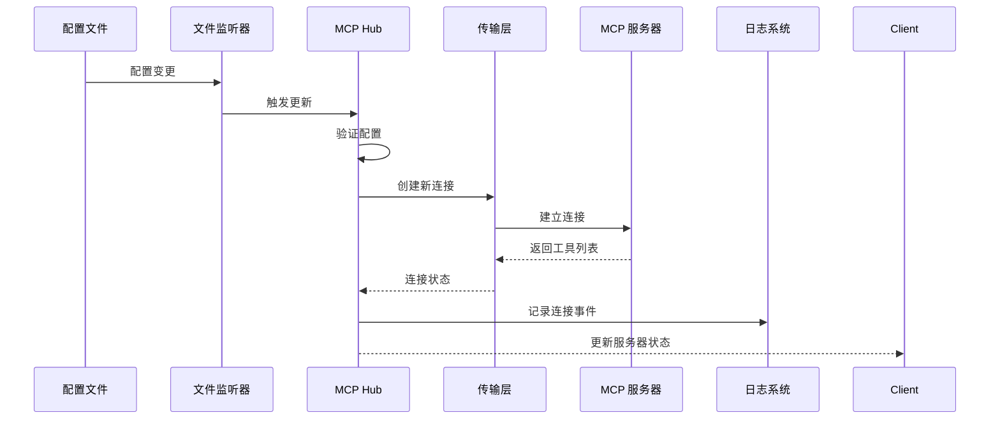
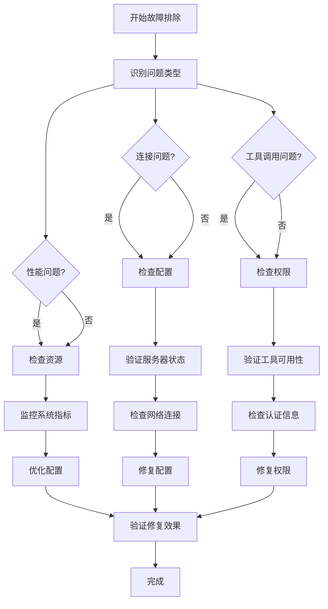

# MCP 调试与监控

<cite>
**本文档引用的文件**
- [McpHub.ts](file://src/services/mcp/McpHub.ts)
- [McpServerManager.ts](file://src/services/mcp/McpServerManager.ts)
- [UseMcpToolTool.ts](file://src/core/tools/UseMcpToolTool.ts)
- [CompactLogger.ts](file://src/utils/logging/CompactLogger.ts)
- [CompactTransport.ts](file://src/utils/logging/CompactTransport.ts)
- [index.ts](file://src/utils/logging/index.ts)
- [tool-executors.ts](file://src/services/mcp-server/tool-executors.ts)
- [test-mcp-server.mjs](file://test-mcp-server.mjs)
- [test-mcp-standalone.cjs](file://test-mcp-standalone.cjs)
- [mcp.ts](file://packages/types/src/mcp.ts)
- [NativeToolCallParser.ts](file://src/core/assistant-message/NativeToolCallParser.ts)
</cite>

## 目录
1. [简介](#简介)
2. [项目结构](#项目结构)
3. [核心组件](#核心组件)
4. [架构概览](#架构概览)
5. [详细组件分析](#详细组件分析)
6. [依赖关系分析](#依赖关系分析)
7. [性能考虑](#性能考虑)
8. [故障排除指南](#故障排除指南)
9. [结论](#结论)

## 管理](#管理)

### 组件 A 分析
- **MCP Hub 管理器**：负责 MCP 服务器的生命周期管理，包括连接、断开、配置更新等
- **MCP 服务器管理器**：提供单例模式的 MCP 服务器实例管理
- **MCP 工具执行器**：处理各种 MCP 工具的执行，包括文件操作、命令执行等
- **日志系统**：提供紧凑格式的日志记录和传输机制

**章节来源**
- [McpHub.ts:151-800](file://src/services/mcp/McpHub.ts#L151-L800)
- [McpServerManager.ts:1-87](file://src/services/mcp/McpServerManager.ts#L1-L87)
- [tool-executors.ts:1-208](file://src/services/mcp-server/tool-executors.ts#L1-L208)

### 架构概览

**图表来源**
- [McpHub.ts:151-800](file://src/services/mcp/McpHub.ts#L151-L800)
- [McpServerManager.ts:1-87](file://src/services/mcp/McpServerManager.ts#L1-L87)
- [CompactLogger.ts:12-151](file://src/utils/logging/CompactLogger.ts#L12-L151)

## 详细组件分析

### MCP Hub 管理器

MCP Hub 是整个 MCP 系统的核心管理器，负责：

#### 连接管理
- **多协议支持**：支持 STDIO、SSE 和 Streamable HTTP 三种连接方式
- **自动重连**：通过 `ReconnectingEventSource` 实现断线自动重连
- **状态跟踪**：维护每个 MCP 服务器的连接状态和错误历史

#### 配置管理
- **动态配置**：支持全局和项目级别的 MCP 配置文件监听
- **配置验证**：使用 Zod Schema 进行严格的配置验证
- **热更新**：配置变更时自动重新连接 MCP 服务器

**图表来源**
- [McpHub.ts:656-897](file://src/services/mcp/McpHub.ts#L656-L897)

#### 错误处理机制
- **错误历史记录**：最多保留 100 条错误记录
- **分级错误处理**：支持 error、warn、info 三种错误级别
- **自动清理**：超过限制时自动清理最旧的错误记录

**章节来源**
- [McpHub.ts:878-924](file://src/services/mcp/McpHub.ts#L878-L924)
- [McpHub.ts:911-949](file://src/services/mcp/McpHub.ts#L911-L949)

### MCP 服务器管理器

提供单例模式的 MCP 服务器实例管理：

#### 单例模式实现
- **线程安全**：使用 Promise 基锁确保初始化过程的线程安全
- **实例复用**：确保所有 webview 共享同一套 MCP 服务器实例
- **生命周期管理**：提供清理和销毁机制

**图表来源**
- [McpServerManager.ts:9-87](file://src/services/mcp/McpServerManager.ts#L9-L87)

**章节来源**
- [McpServerManager.ts:20-54](file://src/services/mcp/McpServerManager.ts#L20-L54)

### MCP 工具执行器

处理各种 MCP 工具的执行，提供安全的文件操作和命令执行：

#### 文件操作工具
- **读取文件**：支持行范围选择和编号显示
- **写入文件**：自动创建目录结构
- **列出文件**：支持递归遍历和结果限制

#### 命令执行工具
- **安全执行**：限制工作目录边界，防止路径逃逸
- **超时控制**：可配置的命令执行超时时间
- **输出捕获**：同时捕获 stdout 和 stderr

**图表来源**
- [tool-executors.ts:28-50](file://src/services/mcp-server/tool-executors.ts#L28-L50)
- [tool-executors.ts:116-180](file://src/services/mcp-server/tool-executors.ts#L116-L180)

**章节来源**
- [tool-executors.ts:13-20](file://src/services/mcp-server/tool-executors.ts#L13-L20)
- [tool-executors.ts:116-180](file://src/services/mcp-server/tool-executors.ts#L116-L180)

### 日志系统

提供紧凑格式的日志记录和传输机制：

#### 日志记录器
- **紧凑格式**：使用 JSON 格式存储，包含时间戳、级别、消息等
- **元数据支持**：支持上下文和自定义元数据
- **错误对象处理**：自动提取 Error 对象的堆栈信息

#### 传输层
- **文件输出**：支持将日志写入文件
- **会话管理**：记录日志会话的开始和结束
- **增量时间戳**：使用相对时间戳减少日志体积

**图表来源**
- [CompactLogger.ts:12-151](file://src/utils/logging/CompactLogger.ts#L12-L151)
- [CompactTransport.ts:36-123](file://src/utils/logging/CompactTransport.ts#L36-L123)

**章节来源**
- [CompactLogger.ts:95-110](file://src/utils/logging/CompactLogger.ts#L95-L110)
- [CompactTransport.ts:85-106](file://src/utils/logging/CompactTransport.ts#L85-L106)

## 依赖关系分析

### 核心依赖关系

**图表来源**
- [McpHub.ts:1-50](file://src/services/mcp/McpHub.ts#L1-L50)

### 数据流分析

**图表来源**
- [McpHub.ts:325-361](file://src/services/mcp/McpHub.ts#L325-L361)
- [McpHub.ts:688-897](file://src/services/mcp/McpHub.ts#L688-L897)

**章节来源**
- [McpHub.ts:325-361](file://src/services/mcp/McpHub.ts#L325-L361)
- [McpHub.ts:688-897](file://src/services/mcp/McpHub.ts#L688-L897)

## 性能考虑

### 连接优化
- **连接池管理**：通过单例模式避免重复创建 MCP 服务器实例
- **延迟初始化**：按需创建连接，减少启动时间
- **资源清理**：及时清理断开的连接和相关资源

### 内存管理
- **错误历史限制**：最多保留 100 条错误记录，防止内存泄漏
- **弱引用管理**：使用 WeakRef 管理 Provider 引用
- **文件监听器清理**：及时清理不再使用的文件监听器

### 执行效率
- **批量操作**：支持多个 MCP 服务器同时连接和操作
- **异步处理**：所有网络操作都采用异步模式
- **超时控制**：为每个操作设置合理的超时时间

## 故障排除指南

### 常见问题诊断

#### 连接失败
1. **检查 MCP 服务器状态**
   - 验证 MCP 服务器是否正在运行
   - 检查网络连接和防火墙设置
   - 确认端口未被其他程序占用

2. **验证配置文件**
   - 检查 `mcp.json` 配置语法
   - 确认服务器类型和参数正确
   - 验证认证信息和权限设置

3. **查看错误历史**
   - 使用 `MCP Servers` 视图查看错误历史
   - 检查最近的错误消息和时间戳
   - 分析错误模式和频率

#### 工具调用错误
1. **参数验证**
   - 确认工具名称拼写正确
   - 检查必需参数是否提供
   - 验证参数类型和格式

2. **权限问题**
   - 检查 MCP 服务器的工具权限
   - 验证用户是否有执行权限
   - 确认工作目录访问权限

3. **资源限制**
   - 检查文件大小限制
   - 验证磁盘空间
   - 确认内存使用情况

#### 性能瓶颈
1. **连接数监控**
   - 监控同时连接的 MCP 服务器数量
   - 检查连接建立时间
   - 分析连接失败率

2. **工具执行时间**
   - 记录工具调用的响应时间
   - 分析慢查询和阻塞操作
   - 优化工具执行策略

3. **资源使用**
   - 监控 CPU 和内存使用
   - 检查磁盘 I/O 活动
   - 分析网络带宽使用

### 调试工具使用

#### 日志分析
1. **启用详细日志**
   - 设置日志级别为 debug
   - 启用文件输出
   - 配置日志轮转

2. **日志格式**
   - 时间戳：相对时间戳，便于分析
   - 级别：debug/info/warn/error/fatal
   - 上下文：包含请求 ID 和用户信息
   - 错误：自动提取堆栈信息

3. **日志分析技巧**
   - 使用正则表达式过滤特定类型的日志
   - 分析错误模式和趋势
   - 关联多个日志源进行交叉验证

#### 网络抓包
1. **HTTP/SSE 抓包**
   - 使用浏览器开发者工具
   - 捕获 MCP 协议的 JSON-RPC 消息
   - 分析请求和响应的完整流程

2. **连接状态监控**
   - 监控 TCP 连接状态
   - 检查连接重试和超时
   - 分析网络延迟和丢包

#### 性能剖析
1. **工具执行时间分析**
   - 记录每个工具的执行时间
   - 分析热点函数和瓶颈
   - 识别耗时的操作

2. **内存使用分析**
   - 监控内存分配和释放
   - 检查内存泄漏
   - 优化数据结构和缓存

### 故障排除流程

**图表来源**
- [McpHub.ts:878-924](file://src/services/mcp/McpHub.ts#L878-L924)

### 运维自动化方案

#### 自动化监控
1. **健康检查**
   - 定期检查 MCP 服务器连接状态
   - 监控工具可用性和响应时间
   - 自动告警和通知

2. **自动修复**
   - 自动重连断开的连接
   - 自动重启失败的服务
   - 自动清理资源

3. **配置管理**
   - 自动检测配置变更
   - 应用配置更新
   - 回滚失败的配置

#### 最佳实践
1. **配置管理**
   - 使用版本控制管理 MCP 配置
   - 实施配置审批流程
   - 建立配置备份和恢复机制

2. **监控告警**
   - 设置合理的阈值和告警规则
   - 实施多级告警机制
   - 建立告警升级流程

3. **性能优化**
   - 定期分析性能指标
   - 优化工具执行策略
   - 实施容量规划

**章节来源**
- [McpHub.ts:878-924](file://src/services/mcp/McpHub.ts#L878-L924)
- [McpHub.ts:911-949](file://src/services/mcp/McpHub.ts#L911-L949)

## 结论

MCP 调试与监控系统提供了完整的解决方案，包括：

1. **全面的连接管理**：支持多种连接协议，提供自动重连和状态跟踪
2. **强大的日志系统**：紧凑格式的日志记录，支持文件输出和会话管理
3. **完善的错误处理**：详细的错误历史记录和分级错误处理
4. **丰富的调试工具**：提供多种调试和监控工具
5. **自动化运维**：支持自动化的监控、告警和修复机制

通过合理使用这些工具和最佳实践，可以有效提升 MCP 系统的稳定性和可维护性。