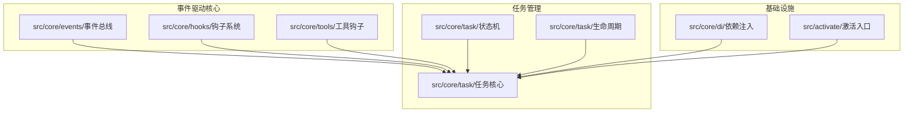
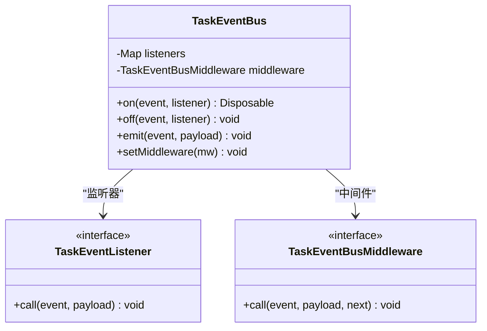
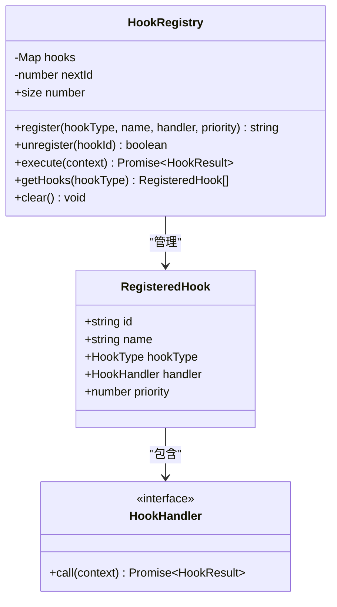
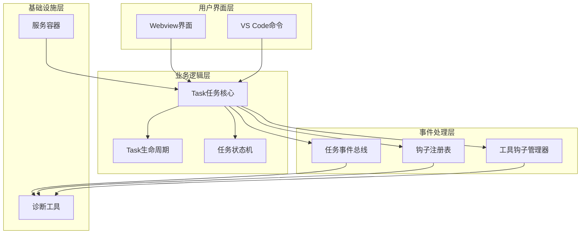
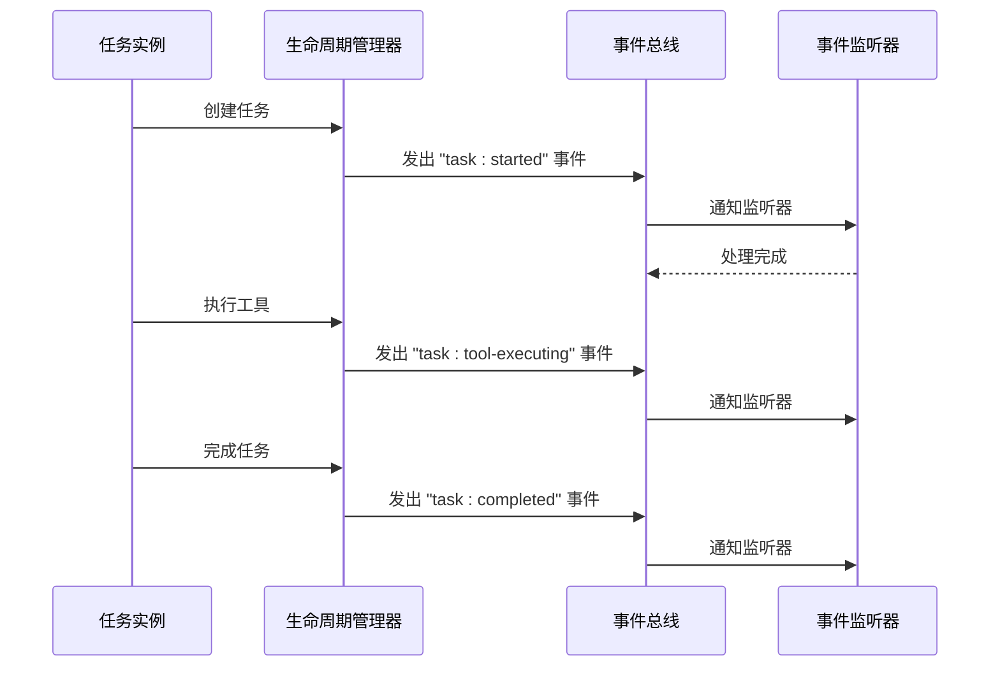
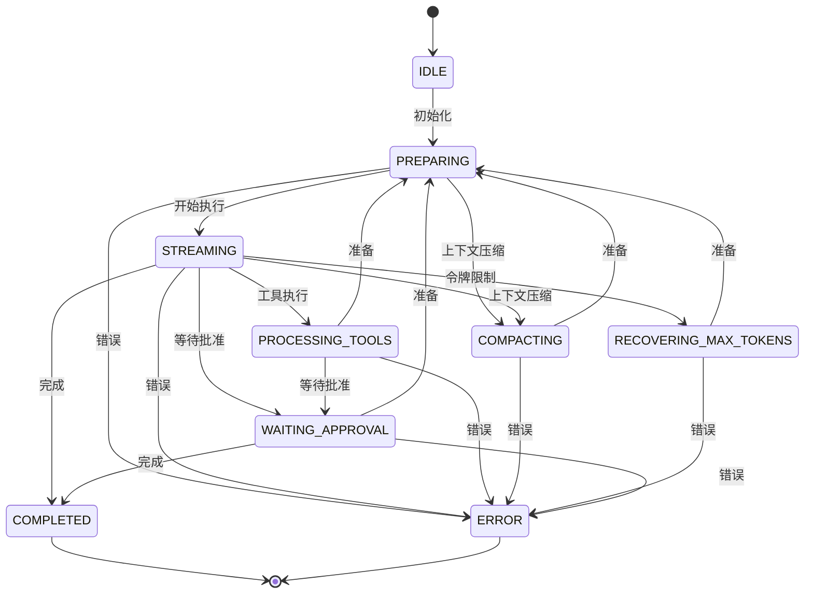
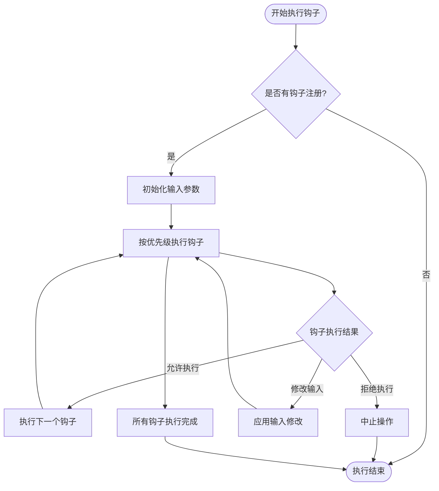
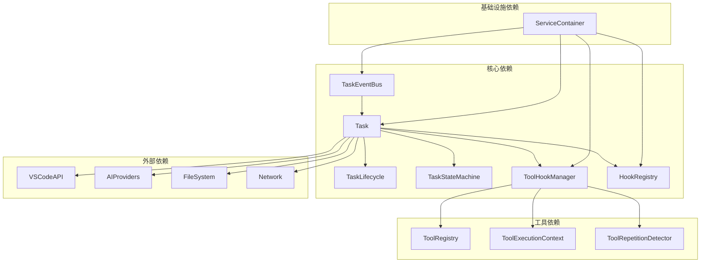

# 事件驱动架构

<cite>
**本文档引用的文件**
- [TaskEventBus.ts](file://src/core/events/TaskEventBus.ts)
- [HookRegistry.ts](file://src/core/hooks/HookRegistry.ts)
- [types.ts](file://src/core/hooks/types.ts)
- [TaskLifecycle.ts](file://src/core/task/TaskLifecycle.ts)
- [TaskStateMachine.ts](file://src/core/task/TaskStateMachine.ts)
- [Task.ts](file://src/core/task/Task.ts)
- [ToolHookManager.ts](file://src/core/tools/ToolHookManager.ts)
- [ServiceContainer.ts](file://src/core/di/ServiceContainer.ts)
- [index.ts](file://src/activate/index.ts)
</cite>

## 目录
1. [引言](#引言)
2. [项目结构](#项目结构)
3. [核心组件](#核心组件)
4. [架构概览](#架构概览)
5. [详细组件分析](#详细组件分析)
6. [依赖关系分析](#依赖关系分析)
7. [性能考虑](#性能考虑)
8. [故障排除指南](#故障排除指南)
9. [结论](#结论)

## 引言

本项目采用事件驱动架构设计，通过任务事件总线、钩子系统和状态机管理等核心组件，实现了高度解耦、可扩展的任务处理机制。该架构支持异步事件处理、钩子注册与执行、状态转换控制等功能，为复杂的AI代理任务提供了强大的基础设施。

事件驱动架构的核心优势在于：
- **解耦性**：组件间通过事件进行通信，降低直接依赖
- **可扩展性**：支持动态注册和执行各种类型的钩子
- **可观测性**：完整的事件日志和调试支持
- **可靠性**：异常处理和错误恢复机制

## 项目结构

项目采用模块化组织方式，事件驱动相关的组件主要分布在以下目录：



**图表来源**
- [TaskEventBus.ts:1-88](file://src/core/events/TaskEventBus.ts#L1-L88)
- [HookRegistry.ts:1-120](file://src/core/hooks/HookRegistry.ts#L1-L120)
- [Task.ts:1-200](file://src/core/task/Task.ts#L1-L200)

**章节来源**
- [TaskEventBus.ts:1-88](file://src/core/events/TaskEventBus.ts#L1-L88)
- [HookRegistry.ts:1-120](file://src/core/hooks/HookRegistry.ts#L1-L120)
- [Task.ts:1-200](file://src/core/task/Task.ts#L1-L200)

## 核心组件

### 任务事件总线

任务事件总线是整个事件驱动架构的核心组件，负责管理任务相关的领域事件。



**图表来源**
- [TaskEventBus.ts:31-76](file://src/core/events/TaskEventBus.ts#L31-L76)

事件类型包括：
- 任务生命周期事件：`task:started`, `task:completed`, `task:failed`, `task:aborted`
- 工具执行事件：`task:tool-executing`, `task:tool-completed`
- LLM交互事件：`task:llm-response`, `task:llm-retry`
- 令牌更新事件：`task:tokens-updated`

**章节来源**
- [TaskEventBus.ts:4-18](file://src/core/events/TaskEventBus.ts#L4-L18)
- [TaskEventBus.ts:31-76](file://src/core/events/TaskEventBus.ts#L31-L76)

### 钩子注册表

钩子注册表提供异步钩子管理功能，支持优先级排序和条件执行。



**图表来源**
- [HookRegistry.ts:13-116](file://src/core/hooks/HookRegistry.ts#L13-L116)
- [types.ts:81-87](file://src/core/hooks/types.ts#L81-L87)

**章节来源**
- [HookRegistry.ts:1-120](file://src/core/hooks/HookRegistry.ts#L1-L120)
- [types.ts:1-88](file://src/core/hooks/types.ts#L1-L88)

### 工具钩子管理器

工具钩子管理器专门处理工具执行相关的钩子，支持多种钩子类型和执行顺序控制。

```mermaid
classDiagram
class ToolHookManager {
-PreToolUseHook[] preHooks
-PostToolUseHook[] postHooks
-PostToolUseFailureHook[] failureHooks
-HookExecutionOrder hookExecutionOrder
+registerPreHook(hook) void
+registerPostHook(hook) void
+registerFailureHook(hook) void
+runPreHooks(toolName, input, context) Promise
+runPostHooks(toolName, input, result, context) Promise
+runFailureHooks(toolName, input, error, context) Promise
}
class HookExecutionOrder {
<<enumeration>>
"before-permission"
"after-permission"
}
ToolHookManager --> HookExecutionOrder : "使用"
```

**图表来源**
- [ToolHookManager.ts:31-301](file://src/core/tools/ToolHookManager.ts#L31-L301)

**章节来源**
- [ToolHookManager.ts:1-302](file://src/core/tools/ToolHookManager.ts#L1-L302)

## 架构概览

事件驱动架构的整体设计体现了分层解耦的思想：



**图表来源**
- [Task.ts:195-313](file://src/core/task/Task.ts#L195-L313)
- [TaskLifecycle.ts:148-199](file://src/core/task/TaskLifecycle.ts#L148-L199)
- [ServiceContainer.ts:10-46](file://src/core/di/ServiceContainer.ts#L10-L46)

## 详细组件分析

### 任务生命周期管理

任务生命周期管理器负责协调任务的各个阶段转换，并通过事件总线发出相应的事件。



**图表来源**
- [TaskLifecycle.ts:177-186](file://src/core/task/TaskLifecycle.ts#L177-L186)
- [TaskEventBus.ts:39-53](file://src/core/events/TaskEventBus.ts#L39-L53)

**章节来源**
- [TaskLifecycle.ts:148-199](file://src/core/task/TaskLifecycle.ts#L148-L199)

### 状态机设计

任务状态机定义了合法的状态转换规则，确保任务按照预期的流程执行。



**图表来源**
- [TaskStateMachine.ts:13-52](file://src/core/task/TaskStateMachine.ts#L13-L52)

**章节来源**
- [TaskStateMachine.ts:1-58](file://src/core/task/TaskStateMachine.ts#L1-L58)

### 钩子系统执行流程

钩子系统的执行遵循严格的优先级和条件检查机制：



**图表来源**
- [ToolHookManager.ts:126-153](file://src/core/tools/ToolHookManager.ts#L126-L153)
- [HookRegistry.ts:68-89](file://src/core/hooks/HookRegistry.ts#L68-L89)

**章节来源**
- [ToolHookManager.ts:121-190](file://src/core/tools/ToolHookManager.ts#L121-L190)
- [HookRegistry.ts:68-89](file://src/core/hooks/HookRegistry.ts#L68-L89)

## 依赖关系分析

事件驱动架构中的组件依赖关系体现了清晰的层次结构：



**图表来源**
- [Task.ts:118-159](file://src/core/task/Task.ts#L118-L159)
- [ServiceContainer.ts:1-47](file://src/core/di/ServiceContainer.ts#L1-L47)

**章节来源**
- [Task.ts:108-160](file://src/core/task/Task.ts#L108-L160)
- [ServiceContainer.ts:1-47](file://src/core/di/ServiceContainer.ts#L1-L47)

## 性能考虑

事件驱动架构在性能方面的优化策略：

### 事件处理优化
- 使用Set数据结构存储监听器，提高事件分发效率
- 支持中间件模式，便于添加调试和监控功能
- 异常隔离处理，避免单个监听器失败影响整体性能

### 钩子执行优化
- 优先级排序减少不必要的钩子执行
- 输入参数缓存避免重复计算
- 异步执行避免阻塞主线程

### 内存管理
- 使用WeakRef管理宿主引用，防止内存泄漏
- 及时清理不再使用的监听器和钩子
- 事件总线支持动态注册和注销

## 故障排除指南

### 常见问题及解决方案

**事件监听器未触发**
1. 检查事件名称是否正确
2. 确认监听器是否正确注册
3. 验证事件总线中间件配置

**钩子执行异常**
1. 查看钩子执行日志
2. 检查钩子优先级设置
3. 验证钩子返回值格式

**状态转换错误**
1. 检查状态转换矩阵
2. 确认前置条件满足
3. 查看状态机日志

**章节来源**
- [TaskEventBus.ts:62-67](file://src/core/events/TaskEventBus.ts#L62-L67)
- [HookRegistry.ts:82-85](file://src/core/hooks/HookRegistry.ts#L82-L85)

## 结论

事件驱动架构为本项目提供了强大的扩展性和可维护性。通过任务事件总线、钩子系统和状态机的有机结合，实现了高度解耦的组件通信机制。该架构不仅支持当前的功能需求，还为未来的功能扩展奠定了坚实的基础。

关键优势包括：
- **模块化设计**：各组件职责明确，易于维护和测试
- **事件驱动**：支持异步处理和实时响应
- **钩子扩展**：提供丰富的扩展点和插件机制
- **状态管理**：确保任务执行的正确性和一致性
- **性能优化**：高效的事件分发和钩子执行机制

这种架构设计为AI代理系统的复杂业务逻辑提供了可靠的基础设施，能够有效支撑未来的发展需求。