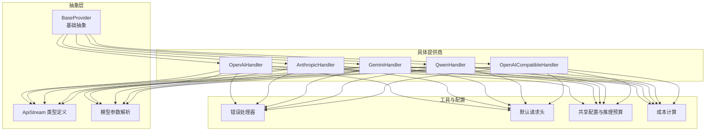
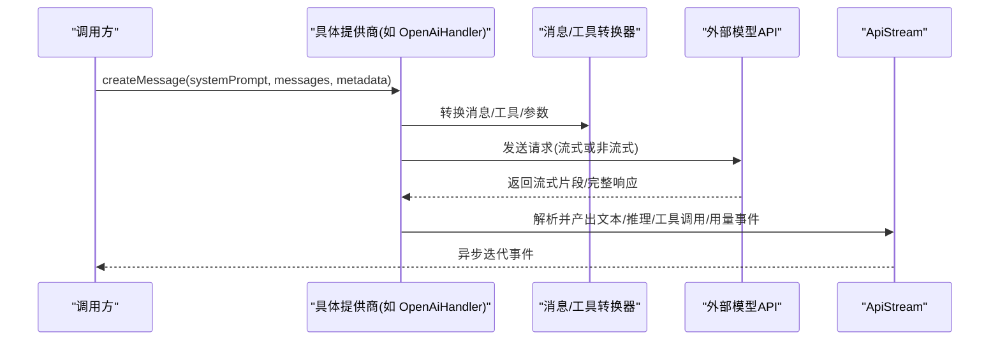
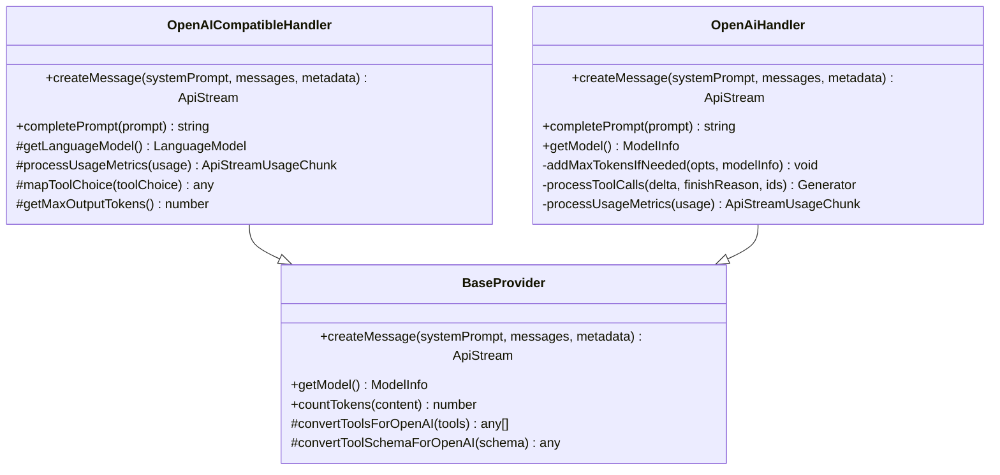
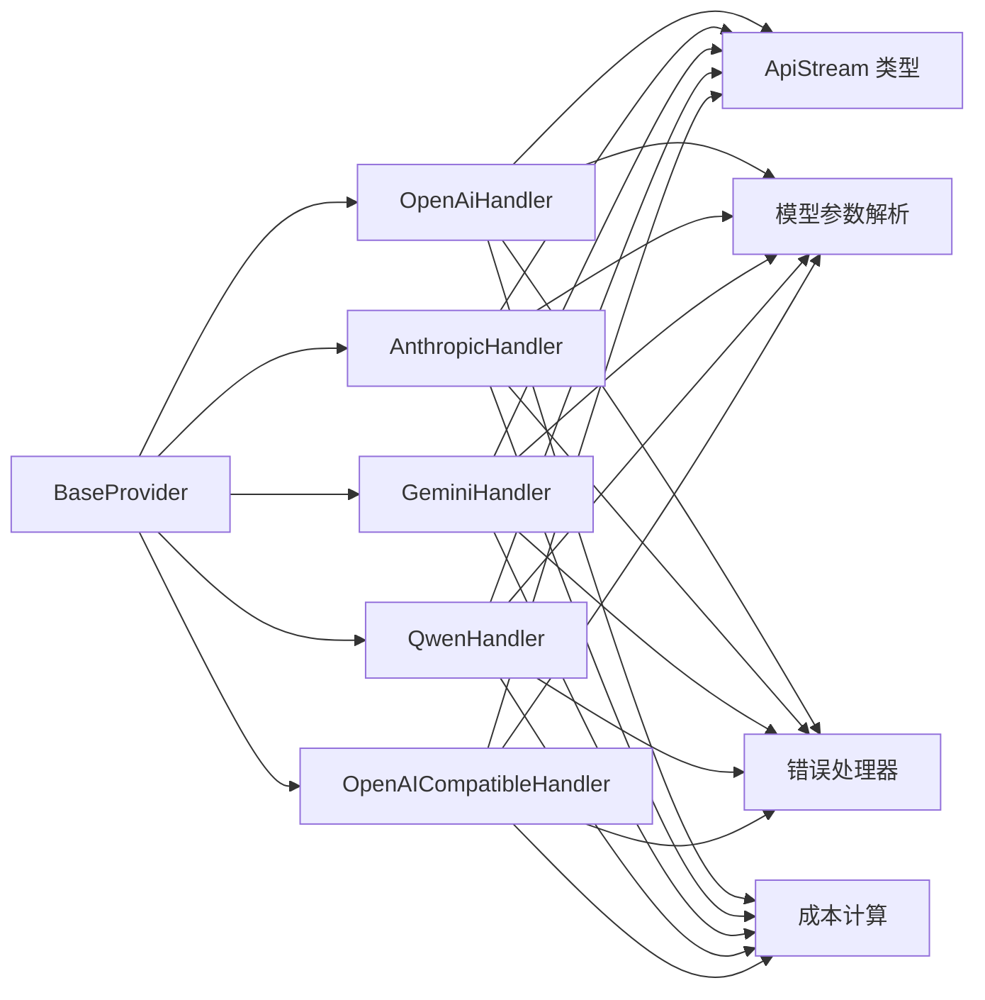

# AI 模型集成系统

<cite>
**本文档引用的文件**
- [src/api/providers/base-provider.ts](file://src/api/providers/base-provider.ts)
- [src/api/providers/openai.ts](file://src/api/providers/openai.ts)
- [src/api/providers/gemini.ts](file://src/api/providers/gemini.ts)
- [src/api/providers/qwen.ts](file://src/api/providers/qwen.ts)
- [src/api/providers/anthropic.ts](file://src/api/providers/anthropic.ts)
- [src/api/providers/openai-compatible.ts](file://src/api/providers/openai-compatible.ts)
- [src/api/providers/constants.ts](file://src/api/providers/constants.ts)
- [src/api/providers/utils/error-handler.ts](file://src/api/providers/utils/error-handler.ts)
- [src/api/providers/utils/openai-error-handler.ts](file://src/api/providers/utils/openai-error-handler.ts)
- [src/api/transform/stream.ts](file://src/api/transform/stream.ts)
- [src/api/transform/model-params.ts](file://src/api/transform/model-params.ts)
- [src/shared/api.ts](file://src/shared/api.ts)
- [src/shared/cost.ts](file://src/shared/cost.ts)
- [src/api/providers/index.ts](file://src/api/providers/index.ts)
- [src/api/providers/fake-ai.ts](file://src/api/providers/fake-ai.ts)
</cite>

## 目录
1. [简介](#简介)
2. [项目结构](#项目结构)
3. [核心组件](#核心组件)
4. [架构总览](#架构总览)
5. [详细组件分析](#详细组件分析)
6. [依赖关系分析](#依赖关系分析)
7. [性能考量](#性能考量)
8. [故障排除指南](#故障排除指南)
9. [结论](#结论)
10. [附录](#附录)

## 简介
本系统提供统一的 AI 提供商抽象层，支持多家大模型服务（如 OpenAI、Anthropic、Google Gemini、Qwen 等），通过一致的接口与数据流协议对外暴露能力。其核心目标包括：
- 统一的请求/响应转换与流式处理机制
- 多提供商的成本计算与计费追踪
- 可扩展的错误处理与遥测上报
- 易于新增提供商的插件化架构

## 项目结构
系统采用“抽象基类 + 具体提供商实现”的分层设计，配合消息格式转换器与流式数据类型定义，形成清晰的职责边界。

图表来源
- [src/api/providers/base-provider.ts:13-122](file://src/api/providers/base-provider.ts#L13-L122)
- [src/api/providers/openai.ts:31-535](file://src/api/providers/openai.ts#L31-L535)
- [src/api/providers/anthropic.ts:30-385](file://src/api/providers/anthropic.ts#L30-L385)
- [src/api/providers/gemini.ts:36-537](file://src/api/providers/gemini.ts#L36-L537)
- [src/api/providers/qwen.ts:10-63](file://src/api/providers/qwen.ts#L10-L63)
- [src/api/providers/openai-compatible.ts:50-212](file://src/api/providers/openai-compatible.ts#L50-L212)
- [src/api/transform/stream.ts:1-115](file://src/api/transform/stream.ts#L1-L115)
- [src/api/transform/model-params.ts:75-190](file://src/api/transform/model-params.ts#L75-L190)
- [src/shared/api.ts:44-157](file://src/shared/api.ts#L44-L157)
- [src/shared/cost.ts:66-116](file://src/shared/cost.ts#L66-L116)
- [src/api/providers/constants.ts:3-7](file://src/api/providers/constants.ts#L3-L7)
- [src/api/providers/utils/error-handler.ts:38-107](file://src/api/providers/utils/error-handler.ts#L38-L107)

章节来源
- [src/api/providers/index.ts:1-33](file://src/api/providers/index.ts#L1-L33)

## 核心组件
- 抽象基类 BaseProvider：定义统一的 createMessage 接口、工具 Schema 转换、默认 token 计数等通用能力。
- 具体提供商：
  - OpenAiHandler：OpenAI 官方 API 的完整实现，支持流式/非流式、工具调用、温度与最大输出令牌控制、Azure/Azure AI Inference 适配。
  - AnthropicHandler：Anthropic Claude API 实现，支持提示缓存、思维块、工具调用、多模型差异化处理。
  - GeminiHandler：Google Gemini API 实现，支持思考配置、工具调用、推理预算、引用溯源、成本计算。
  - QwenHandler：基于 OpenAI 兼容层的通义千问实现，统一了参数映射与使用体验。
  - OpenAICompatibleHandler：通用 OpenAI 兼容 API 抽象，便于快速接入第三方兼容服务。
- 流式数据类型 ApiStream：标准化文本、推理、工具调用、用量、错误等事件类型。
- 错误处理：统一的 handleProviderError，保留状态码与重试元数据，支持 i18n。
- 成本计算：calculateApiCostAnthropic/calculateApiCostOpenAI，支持缓存写入/读取、长上下文定价、分层计费。
- 配置与推理预算：getModelMaxOutputTokens、shouldUseReasoningBudget/shouldUseReasoningEffort 等集中逻辑。

章节来源
- [src/api/providers/base-provider.ts:13-122](file://src/api/providers/base-provider.ts#L13-L122)
- [src/api/providers/openai.ts:31-535](file://src/api/providers/openai.ts#L31-L535)
- [src/api/providers/anthropic.ts:30-385](file://src/api/providers/anthropic.ts#L30-L385)
- [src/api/providers/gemini.ts:36-537](file://src/api/providers/gemini.ts#L36-L537)
- [src/api/providers/qwen.ts:10-63](file://src/api/providers/qwen.ts#L10-L63)
- [src/api/providers/openai-compatible.ts:50-212](file://src/api/providers/openai-compatible.ts#L50-L212)
- [src/api/transform/stream.ts:1-115](file://src/api/transform/stream.ts#L1-L115)
- [src/shared/cost.ts:66-116](file://src/shared/cost.ts#L66-L116)
- [src/shared/api.ts:44-157](file://src/shared/api.ts#L44-L157)

## 架构总览
系统通过 BaseProvider 抽象出统一的消息生成接口，各提供商在内部完成消息格式转换、参数映射、工具 Schema 适配与流式事件解析，最终以统一的 ApiStream 输出给上层消费。

图表来源
- [src/api/providers/openai.ts:82-270](file://src/api/providers/openai.ts#L82-L270)
- [src/api/transform/stream.ts:1-115](file://src/api/transform/stream.ts#L1-L115)

## 详细组件分析

### BaseProvider 抽象层
- 角色：定义统一接口 createMessage、getModel；提供工具 Schema 严格模式转换、默认 token 计数。
- 关键点：
  - convertToolsForOpenAI：将工具 Schema 转为 OpenAI 严格模式要求（必需字段、去空值、禁止额外属性）。
  - convertToolSchemaForOpenAI：递归处理对象/数组嵌套结构，确保符合 OpenAI Responses API。
  - countTokens：默认使用 worker 进行 tiktoken 计数，可被具体提供商覆盖。

章节来源
- [src/api/providers/base-provider.ts:13-122](file://src/api/providers/base-provider.ts#L13-L122)

### OpenAI 兼容层与 OpenAiHandler
- 设计要点：
  - 自动识别 Azure OpenAI、Azure AI Inference、标准 OpenAI，分别构造客户端。
  - 支持 o1/o3 家族特殊处理（禁用温度、使用现代参数）。
  - Prompt Cache 控制（针对支持的模型）。
  - 工具调用：支持 tool_choice、parallel_tool_calls，流式中按块增量产出。
  - 流式处理：使用 include_usage 或自定义解析器，产出 usage 事件。
  - 错误处理：统一转为用户友好消息，保留状态码与重试信息。
- 参数映射：
  - 温度、最大输出令牌、工具、推理参数等通过 getModelParams 统一解析。
- 成本计算：
  - 使用 calculateApiCostOpenAI，考虑缓存写入/读取与长上下文分层定价。

图表来源
- [src/api/providers/base-provider.ts:13-122](file://src/api/providers/base-provider.ts#L13-L122)
- [src/api/providers/openai-compatible.ts:50-212](file://src/api/providers/openai-compatible.ts#L50-L212)
- [src/api/providers/openai.ts:31-535](file://src/api/providers/openai.ts#L31-L535)

章节来源
- [src/api/providers/openai.ts:31-535](file://src/api/providers/openai.ts#L31-L535)
- [src/api/providers/openai-compatible.ts:50-212](file://src/api/providers/openai-compatible.ts#L50-L212)
- [src/api/transform/model-params.ts:75-190](file://src/api/transform/model-params.ts#L75-L190)
- [src/shared/cost.ts:92-116](file://src/shared/cost.ts#L92-L116)

### AnthropicHandler（Claude）
- 特性：
  - 支持提示缓存（prompt-caching-2024-07-31）、思维块（thinking）、工具调用。
  - 对特定模型启用 1M 上下文 beta 标志。
  - 流式事件包含 message_start/message_delta/content_block_* 等，统一映射到 ApiStream。
  - 使用 calculateApiCostAnthropic，输入不包含缓存令牌。
- 参数与工具：
  - convertOpenAIToolsToAnthropic、convertOpenAIToolChoiceToAnthropic 用于参数映射。
  - 温度、最大输出令牌、推理参数由 getModelParams 决定。

章节来源
- [src/api/providers/anthropic.ts:30-385](file://src/api/providers/anthropic.ts#L30-L385)
- [src/api/transform/model-params.ts:75-190](file://src/api/transform/model-params.ts#L75-L190)
- [src/shared/cost.ts:66-89](file://src/shared/cost.ts#L66-L89)

### GeminiHandler（Google Gemini）
- 特性：
  - 支持 thinkingConfig、maxOutputTokens、temperature、工具函数声明。
  - 思维签名（thoughtSignature）持久化与回传，保障工具调用连续性。
  - 引用溯源（groundingMetadata）抽取为链接列表。
  - 成本计算：支持 tiered 定价、缓存读取、推理令牌计入输出计费。
- 参数与工具：
  - convertAnthropicMessageToGemini、工具函数声明映射。
  - tool_choice 支持 none/auto/required/指定函数名。

章节来源
- [src/api/providers/gemini.ts:36-537](file://src/api/providers/gemini.ts#L36-L537)
- [src/api/transform/model-params.ts:75-190](file://src/api/transform/model-params.ts#L75-L190)
- [src/shared/cost.ts:42-62](file://src/shared/cost.ts#L42-L62)

### QwenHandler（通义千问）
- 设计：
  - 基于 OpenAICompatibleHandler，复用统一的参数映射与流式处理。
  - 默认 baseURL 指向 DashScope 兼容模式，支持自定义 apiKey/baseURL。
  - processUsageMetrics 适配 DashScope usage 字段。

章节来源
- [src/api/providers/qwen.ts:10-63](file://src/api/providers/qwen.ts#L10-L63)
- [src/api/providers/openai-compatible.ts:50-212](file://src/api/providers/openai-compatible.ts#L50-L212)

### 错误处理与遥测
- 统一错误处理器 handleProviderError：
  - 保留 HTTP 状态码、错误详情、AWS 元数据，支持 i18n。
  - 特殊场景（如 OpenAI 兼容 SDK 的密钥字符问题）进行专门提示。
- 各提供商捕获异常后统一包装，保证 UI 与重试逻辑可用。

章节来源
- [src/api/providers/utils/error-handler.ts:38-107](file://src/api/providers/utils/error-handler.ts#L38-L107)
- [src/api/providers/utils/openai-error-handler.ts:17-19](file://src/api/providers/utils/openai-error-handler.ts#L17-L19)
- [src/api/providers/openai.ts:176-178](file://src/api/providers/openai.ts#L176-L178)
- [src/api/providers/anthropic.ts:169-171](file://src/api/providers/anthropic.ts#L169-L171)
- [src/api/providers/gemini.ts:336-350](file://src/api/providers/gemini.ts#L336-L350)

### 请求/响应转换与流式处理
- ApiStream 类型体系：
  - 文本、推理、工具调用（开始/增量/结束/部分）、用量、错误等事件类型统一。
- 转换器：
  - OpenAI：convertToOpenAiMessages、convertToR1Format。
  - Gemini：convertAnthropicMessageToGemini。
  - AI SDK：convertToAiSdkMessages、convertToolsForAiSdk、processAiSdkStreamPart。
- 流式处理：
  - 各提供商在流式循环中解析增量内容、工具调用、用量与结束信号，逐个 yield 到 ApiStream。

章节来源
- [src/api/transform/stream.ts:1-115](file://src/api/transform/stream.ts#L1-L115)
- [src/api/providers/openai.ts:104-270](file://src/api/providers/openai.ts#L104-L270)
- [src/api/providers/anthropic.ts:197-316](file://src/api/providers/anthropic.ts#L197-L316)
- [src/api/providers/gemini.ts:218-351](file://src/api/providers/gemini.ts#L218-L351)
- [src/api/providers/openai-compatible.ts:153-195](file://src/api/providers/openai-compatible.ts#L153-L195)

### 成本计算系统
- Anthropic 计费：
  - 输入不包含缓存令牌；缓存写入/读取单独计费。
- OpenAI 计费：
  - 输入已包含缓存令牌；长上下文分层定价生效。
- 通用逻辑：
  - applyLongContextPricing：根据阈值与服务层级调整单价。
  - calculateApiCostInternal：统一计算缓存写入、缓存读取、基础输入、输出费用。

章节来源
- [src/shared/cost.ts:42-116](file://src/shared/cost.ts#L42-L116)

### 配置管理与模型参数
- getModelParams：
  - 统一解析 maxTokens、temperature、reasoningEffort/reasoningBudget、verbosity。
  - 针对不同格式（Anthropic/OpenAI/Gemini/OpenRouter）选择对应推理参数。
- getModelMaxOutputTokens：
  - 推理预算模型固定上限；Anthropic 上下文兜底；其他模型按上下文窗口 20% 限制。
- Shared 配置：
  - shouldUseReasoningBudget/shouldUseReasoningEffort：依据模型能力与设置决定是否启用推理预算或推理强度。

章节来源
- [src/api/transform/model-params.ts:75-190](file://src/api/transform/model-params.ts#L75-L190)
- [src/shared/api.ts:44-157](file://src/shared/api.ts#L44-L157)

### 添加新提供商指南（实践步骤）
以下为添加新 AI 提供商的关键步骤与参考路径（不直接粘贴代码）：

1. 选择抽象基类
   - 若为 OpenAI 兼容 API：继承 OpenAICompatibleHandler，复用统一参数映射与流式处理。
   - 若为自有 SDK：继承 BaseProvider，实现 createMessage/getModel/completePrompt。
   - 参考路径：
     - [src/api/providers/base-provider.ts:13-122](file://src/api/providers/base-provider.ts#L13-L122)
     - [src/api/providers/openai-compatible.ts:50-212](file://src/api/providers/openai-compatible.ts#L50-L212)

2. 配置管理与默认头
   - 使用 DEFAULT_HEADERS 注入标准请求头，避免被屏蔽。
   - 参考路径：
     - [src/api/providers/constants.ts:3-7](file://src/api/providers/constants.ts#L3-L7)

3. 参数映射与模型信息
   - 通过 getModelParams 获取 maxTokens/temperature/reasoning 等参数。
   - 参考路径：
     - [src/api/transform/model-params.ts:75-190](file://src/api/transform/model-params.ts#L75-L190)
     - [src/shared/api.ts:105-157](file://src/shared/api.ts#L105-L157)

4. 工具 Schema 适配
   - 如需严格模式，调用 convertToolsForOpenAI 与 convertToolSchemaForOpenAI。
   - 参考路径：
     - [src/api/providers/base-provider.ts:27-106](file://src/api/providers/base-provider.ts#L27-L106)

5. 流式处理与事件产出
   - 将外部 API 的增量事件映射为 ApiStream 文本/推理/工具调用/用量事件。
   - 参考路径：
     - [src/api/transform/stream.ts:1-115](file://src/api/transform/stream.ts#L1-L115)
     - [src/api/providers/openai.ts:192-223](file://src/api/providers/openai.ts#L192-L223)
     - [src/api/providers/anthropic.ts:197-316](file://src/api/providers/anthropic.ts#L197-L316)
     - [src/api/providers/gemini.ts:218-351](file://src/api/providers/gemini.ts#L218-L351)

6. 错误处理与遥测
   - 使用 handleProviderError 包装异常，保留状态码与重试信息。
   - 参考路径：
     - [src/api/providers/utils/error-handler.ts:38-107](file://src/api/providers/utils/error-handler.ts#L38-L107)

7. 成本计算对接
   - 根据提供商计费规则选择 calculateApiCostAnthropic 或 calculateApiCostOpenAI。
   - 参考路径：
     - [src/shared/cost.ts:66-116](file://src/shared/cost.ts#L66-L116)

8. 模型列表与端点缓存
   - 动态提供商可通过 GetModelsOptions 组合 baseUrl/apiKey 等参数。
   - 参考路径：
     - [src/shared/api.ts:159-187](file://src/shared/api.ts#L159-L187)

9. 单元测试与集成验证
   - 在 providers/__tests__ 下补充对应测试用例，覆盖流式、工具、错误与成本路径。

章节来源
- [src/api/providers/base-provider.ts:13-122](file://src/api/providers/base-provider.ts#L13-L122)
- [src/api/providers/openai-compatible.ts:50-212](file://src/api/providers/openai-compatible.ts#L50-L212)
- [src/api/providers/constants.ts:3-7](file://src/api/providers/constants.ts#L3-L7)
- [src/api/transform/model-params.ts:75-190](file://src/api/transform/model-params.ts#L75-L190)
- [src/shared/api.ts:105-187](file://src/shared/api.ts#L105-L187)
- [src/api/providers/utils/error-handler.ts:38-107](file://src/api/providers/utils/error-handler.ts#L38-L107)
- [src/shared/cost.ts:66-116](file://src/shared/cost.ts#L66-L116)

## 依赖关系分析

图表来源
- [src/api/providers/base-provider.ts:13-122](file://src/api/providers/base-provider.ts#L13-L122)
- [src/api/providers/openai.ts:31-535](file://src/api/providers/openai.ts#L31-L535)
- [src/api/providers/anthropic.ts:30-385](file://src/api/providers/anthropic.ts#L30-L385)
- [src/api/providers/gemini.ts:36-537](file://src/api/providers/gemini.ts#L36-L537)
- [src/api/providers/qwen.ts:10-63](file://src/api/providers/qwen.ts#L10-L63)
- [src/api/providers/openai-compatible.ts:50-212](file://src/api/providers/openai-compatible.ts#L50-L212)
- [src/api/transform/stream.ts:1-115](file://src/api/transform/stream.ts#L1-L115)
- [src/api/transform/model-params.ts:75-190](file://src/api/transform/model-params.ts#L75-L190)
- [src/shared/cost.ts:66-116](file://src/shared/cost.ts#L66-L116)
- [src/api/providers/utils/error-handler.ts:38-107](file://src/api/providers/utils/error-handler.ts#L38-L107)

## 性能考量
- 流式优先：尽量使用流式接口，降低首字节延迟与内存占用。
- Prompt Cache：对支持的模型启用缓存控制，减少重复输入开销。
- 最大输出令牌限制：合理设置 modelMaxTokens，避免超长输出导致成本与延迟上升。
- Token 计数：使用 worker 进行批量计数，减少主线程阻塞。
- 工具调用批处理：开启 parallel_tool_calls，提升工具执行吞吐。

## 故障排除指南
- 常见错误类型与定位
  - 认证失败/无效密钥：检查 apiKey/baseURL，查看 handleProviderError 是否捕获到特殊提示。
  - 429/限流：保留的 errorDetails/status 可用于退避重试。
  - 超时/网络异常：检查 getApiRequestTimeout 与网络代理配置。
- 诊断建议
  - 开启 i18n 与日志，记录 providerName + operation + modelId。
  - 对比各提供商的 usage 事件，确认输入/输出/缓存令牌统计是否符合预期。
  - 验证工具 Schema 严格模式转换是否正确，避免参数缺失导致调用失败。

章节来源
- [src/api/providers/utils/error-handler.ts:38-107](file://src/api/providers/utils/error-handler.ts#L38-L107)
- [src/api/providers/openai.ts:176-178](file://src/api/providers/openai.ts#L176-L178)
- [src/api/providers/anthropic.ts:169-171](file://src/api/providers/anthropic.ts#L169-L171)
- [src/api/providers/gemini.ts:336-350](file://src/api/providers/gemini.ts#L336-L350)

## 结论
该系统通过 BaseProvider 抽象与统一的 ApiStream 事件模型，实现了多提供商的一致接入与灵活扩展。借助集中化的模型参数解析、推理预算与成本计算模块，开发者可以快速对接新提供商，同时保持用户体验与可观测性的统一。

## 附录
- 相关文件索引
  - 抽象与实现：[src/api/providers/base-provider.ts:13-122](file://src/api/providers/base-provider.ts#L13-L122)、[src/api/providers/index.ts:1-33](file://src/api/providers/index.ts#L1-L33)
  - OpenAI 生态：[src/api/providers/openai.ts:31-535](file://src/api/providers/openai.ts#L31-L535)、[src/api/providers/openai-compatible.ts:50-212](file://src/api/providers/openai-compatible.ts#L50-L212)
  - Anthropic：[src/api/providers/anthropic.ts:30-385](file://src/api/providers/anthropic.ts#L30-L385)
  - Gemini：[src/api/providers/gemini.ts:36-537](file://src/api/providers/gemini.ts#L36-L537)
  - Qwen：[src/api/providers/qwen.ts:10-63](file://src/api/providers/qwen.ts#L10-L63)
  - 数据流与类型：[src/api/transform/stream.ts:1-115](file://src/api/transform/stream.ts#L1-L115)
  - 参数与预算：[src/api/transform/model-params.ts:75-190](file://src/api/transform/model-params.ts#L75-L190)、[src/shared/api.ts:44-157](file://src/shared/api.ts#L44-L157)
  - 成本计算：[src/shared/cost.ts:66-116](file://src/shared/cost.ts#L66-L116)
  - 错误处理：[src/api/providers/utils/error-handler.ts:38-107](file://src/api/providers/utils/error-handler.ts#L38-L107)、[src/api/providers/utils/openai-error-handler.ts:17-19](file://src/api/providers/utils/openai-error-handler.ts#L17-L19)
  - 默认请求头：[src/api/providers/constants.ts:3-7](file://src/api/providers/constants.ts#L3-L7)
  - Fake AI 适配：[src/api/providers/fake-ai.ts:43-81](file://src/api/providers/fake-ai.ts#L43-L81)