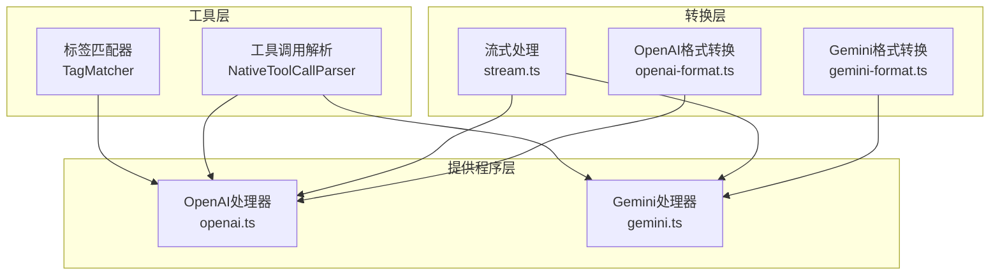
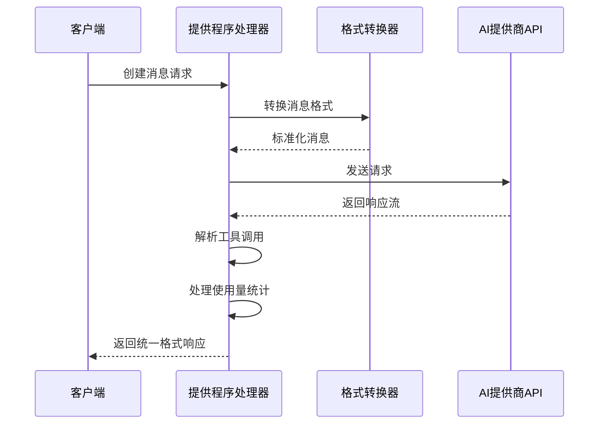
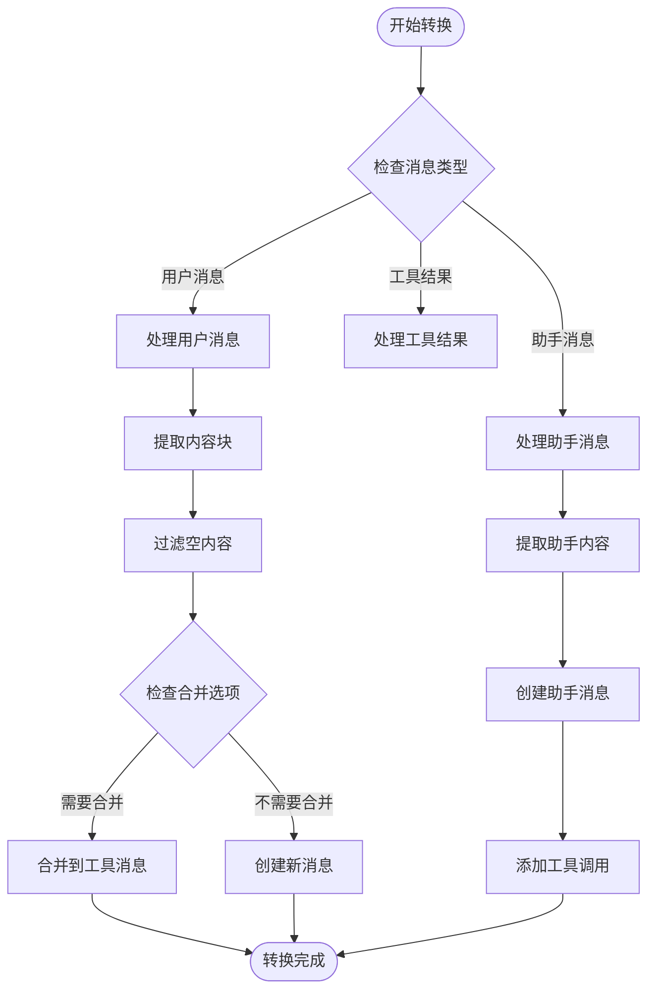
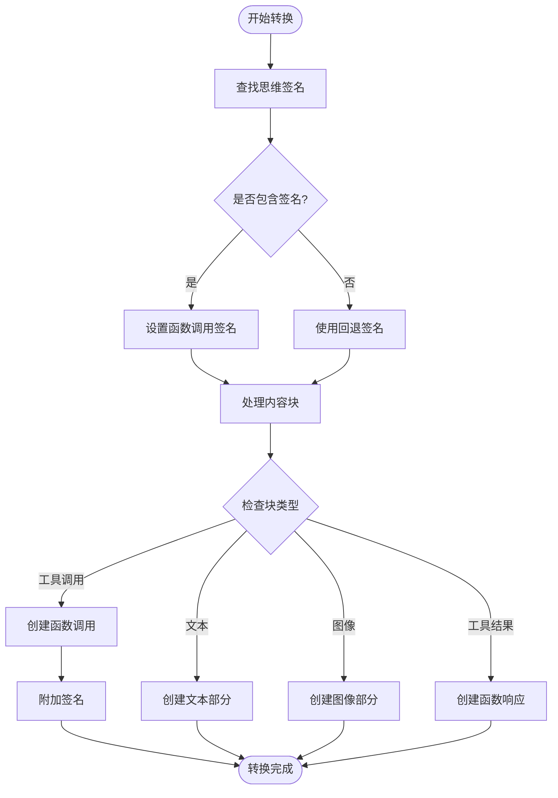
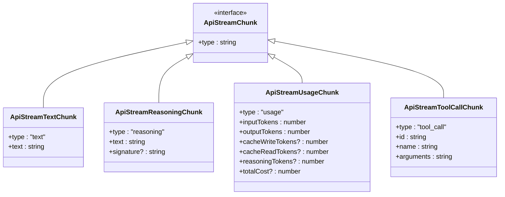
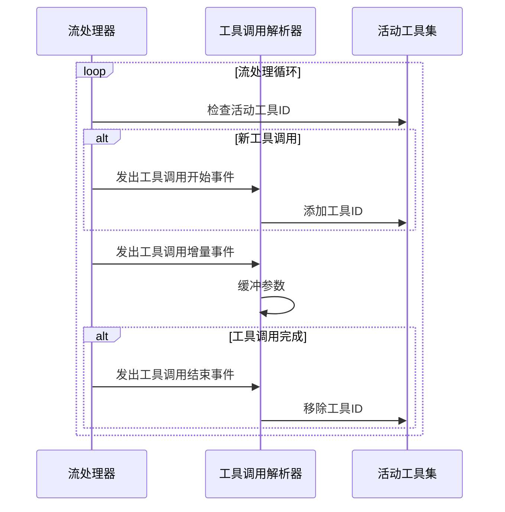
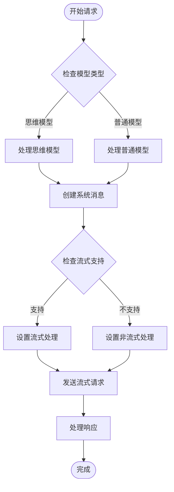
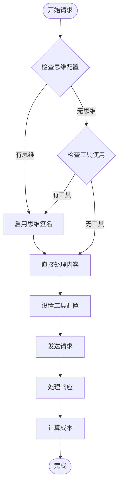
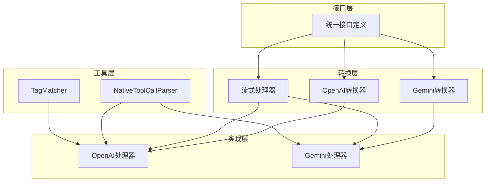

# 请求响应转换

<cite>
**本文档引用的文件**
- [openai-format.ts](file://src/api/transform/openai-format.ts)
- [gemini-format.ts](file://src/api/transform/gemini-format.ts)
- [stream.ts](file://src/api/transform/stream.ts)
- [openai.ts](file://src/api/providers/openai.ts)
- [gemini.ts](file://src/api/providers/gemini.ts)
</cite>

## 目录
1. [简介](#简介)
2. [项目结构](#项目结构)
3. [核心组件](#核心组件)
4. [架构概览](#架构概览)
5. [详细组件分析](#详细组件分析)
6. [依赖关系分析](#依赖关系分析)
7. [性能考虑](#性能考虑)
8. [故障排除指南](#故障排除指南)
9. [结论](#结论)

## 简介

本项目实现了统一的请求响应转换系统，旨在解决多提供商AI模型之间的格式兼容性问题。该系统通过标准化的消息格式转换机制，将内部格式转换为各提供商特定格式，并提供统一的响应格式标准化过程。

系统的核心目标是：
- 统一内部消息格式与各提供商API格式之间的转换
- 标准化响应格式，包括统一字段映射、工具调用解析、流式数据处理
- 实现流式响应处理机制，包括数据分片、事件分发、状态管理
- 支持多种AI提供商（OpenAI、Gemini等）的格式转换

## 项目结构

请求响应转换系统主要由以下三个核心模块组成：

**图表来源**
- [openai-format.ts:1-510](file://src/api/transform/openai-format.ts#L1-L510)
- [gemini-format.ts:1-200](file://src/api/transform/gemini-format.ts#L1-L200)
- [stream.ts:1-115](file://src/api/transform/stream.ts#L1-L115)
- [openai.ts:1-571](file://src/api/providers/openai.ts#L1-L571)
- [gemini.ts:1-538](file://src/api/providers/gemini.ts#L1-L538)

**章节来源**
- [openai-format.ts:1-510](file://src/api/transform/openai-format.ts#L1-L510)
- [gemini-format.ts:1-200](file://src/api/transform/gemini-format.ts#L1-L200)
- [stream.ts:1-115](file://src/api/transform/stream.ts#L1-L115)
- [openai.ts:1-571](file://src/api/providers/openai.ts#L1-L571)
- [gemini.ts:1-538](file://src/api/providers/gemini.ts#L1-L538)

## 核心组件

### 1. 格式转换器

#### OpenAI格式转换器
负责将Anthropic格式的消息转换为OpenAI兼容格式，支持：
- 文本内容转换
- 工具调用映射
- 思维/推理内容处理
- 基础图像内容转换

#### Gemini格式转换器
负责将Anthropic格式的消息转换为Gemini兼容格式，支持：
- 思维签名处理
- 函数调用映射
- 工具结果转换
- 内容块类型转换

### 2. 流式处理系统

定义了统一的流式数据接口，包括：
- 文本流数据
- 使用量统计流
- 思维内容流
- 工具调用流
- 错误处理流

### 3. 提供程序处理器

#### OpenAI处理器
- 支持流式和非流式响应
- 处理思维模型（如o1系列）
- 工具调用解析和状态管理
- 使用量统计处理

#### Gemini处理器
- 支持思维配置和推理预算
- 思维签名持久化
- 引用源提取和处理
- 成本计算功能

**章节来源**
- [openai-format.ts:276-509](file://src/api/transform/openai-format.ts#L276-L509)
- [gemini-format.ts:26-181](file://src/api/transform/gemini-format.ts#L26-L181)
- [stream.ts:1-115](file://src/api/transform/stream.ts#L1-L115)
- [openai.ts:31-270](file://src/api/providers/openai.ts#L31-L270)
- [gemini.ts:36-351](file://src/api/providers/gemini.ts#L36-L351)

## 架构概览

系统采用分层架构设计，通过统一的接口适配不同提供商的API：

**图表来源**
- [openai.ts:82-270](file://src/api/providers/openai.ts#L82-L270)
- [gemini.ts:74-351](file://src/api/providers/gemini.ts#L74-L351)
- [openai-format.ts:276-509](file://src/api/transform/openai-format.ts#L276-L509)
- [gemini-format.ts:26-181](file://src/api/transform/gemini-format.ts#L26-L181)

## 详细组件分析

### OpenAI格式转换器

OpenAI格式转换器实现了复杂的格式转换逻辑，主要包括：

#### 思维内容处理
- 合并多个思维细节块
- 过滤损坏的加密块
- 保持最后签名和ID信息
- 支持文本和摘要内容

#### 消息转换流程

**图表来源**
- [openai-format.ts:276-509](file://src/api/transform/openai-format.ts#L276-L509)

#### 关键特性
- 支持工具调用ID规范化
- 处理思维模型的特殊要求
- 图像内容base64编码处理
- 历史消息兼容性处理

**章节来源**
- [openai-format.ts:41-146](file://src/api/transform/openai-format.ts#L41-L146)
- [openai-format.ts:276-509](file://src/api/transform/openai-format.ts#L276-L509)

### Gemini格式转换器

Gemini格式转换器专注于思维签名处理和函数调用映射：

#### 思维签名处理流程

**图表来源**
- [gemini-format.ts:26-181](file://src/api/transform/gemini-format.ts#L26-L181)

#### 关键特性
- 思维签名的全局处理和局部应用
- 函数调用签名的智能分配
- 工具名称映射验证
- 不支持内容类型的跳过处理

**章节来源**
- [gemini-format.ts:26-181](file://src/api/transform/gemini-format.ts#L26-L181)

### 流式处理系统

流式处理系统提供了统一的数据流接口：

#### 数据流类型定义

**图表来源**
- [stream.ts:1-115](file://src/api/transform/stream.ts#L1-L115)

#### 工具调用流处理
OpenAI处理器实现了完整的工具调用流处理机制：

**图表来源**
- [openai.ts:466-497](file://src/api/providers/openai.ts#L466-L497)

**章节来源**
- [stream.ts:1-115](file://src/api/transform/stream.ts#L1-L115)
- [openai.ts:466-497](file://src/api/providers/openai.ts#L466-L497)

### 提供程序处理器

#### OpenAI处理器
OpenAI处理器实现了完整的请求处理流程：

**图表来源**
- [openai.ts:82-270](file://src/api/providers/openai.ts#L82-L270)

#### Gemini处理器
Gemini处理器专注于思维能力和成本计算：

**图表来源**
- [gemini.ts:74-351](file://src/api/providers/gemini.ts#L74-L351)

**章节来源**
- [openai.ts:82-270](file://src/api/providers/openai.ts#L82-L270)
- [gemini.ts:74-351](file://src/api/providers/gemini.ts#L74-L351)

## 依赖关系分析

系统采用松耦合的设计模式，通过接口抽象实现模块间的解耦：

**图表来源**
- [openai.ts:17-26](file://src/api/providers/openai.ts#L17-L26)
- [gemini.ts:24-27](file://src/api/providers/gemini.ts#L24-L27)

### 关键依赖关系

1. **格式转换依赖**：提供程序处理器依赖格式转换器进行消息格式标准化
2. **工具解析依赖**：流式处理器依赖工具解析器进行工具调用状态管理
3. **错误处理依赖**：所有处理器都依赖统一的错误处理机制

**章节来源**
- [openai.ts:17-26](file://src/api/providers/openai.ts#L17-L26)
- [gemini.ts:24-27](file://src/api/providers/gemini.ts#L24-L27)

## 性能考虑

### 流式处理优化
- 使用AsyncGenerator减少内存占用
- 实时数据处理避免完整缓冲
- 工具调用状态缓存提高处理效率

### 格式转换优化
- 批量内容处理减少转换开销
- 智能过滤避免无效内容传输
- 缓存常用转换结果

### 并发处理
- 异步流处理支持高并发请求
- 工具调用独立处理避免阻塞
- 错误隔离确保系统稳定性

## 故障排除指南

### 常见问题及解决方案

#### 格式转换错误
- **问题**：转换后的消息格式不符合API要求
- **解决方案**：检查输入消息格式，确保必需字段完整

#### 工具调用解析失败
- **问题**：工具调用参数解析不完整
- **解决方案**：验证工具调用ID映射，检查参数序列完整性

#### 流式处理中断
- **问题**：流式响应在工具调用期间中断
- **解决方案**：实现工具调用状态恢复机制

**章节来源**
- [openai-format.ts:164-254](file://src/api/transform/openai-format.ts#L164-L254)
- [gemini-format.ts:88-103](file://src/api/transform/gemini-format.ts#L88-L103)

## 结论

请求响应转换系统通过标准化的格式转换机制和统一的流式处理接口，成功解决了多提供商AI模型之间的兼容性问题。系统的主要优势包括：

1. **高度可扩展性**：通过接口抽象支持新增提供商
2. **强大的格式转换能力**：支持复杂的思维内容和工具调用处理
3. **高效的流式处理**：实时数据处理和状态管理
4. **完善的错误处理**：统一的错误处理和诊断机制

该系统为构建跨提供商的AI应用提供了坚实的基础，能够有效简化开发复杂度并提高系统的稳定性和性能。