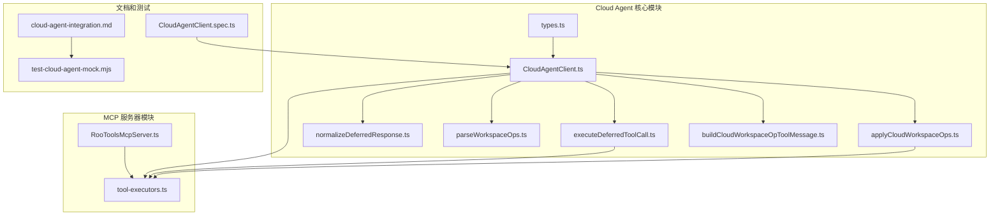
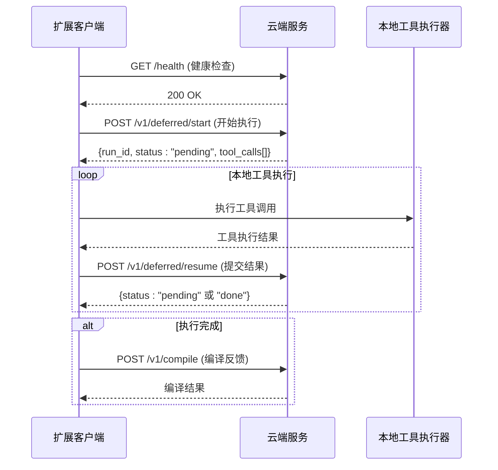
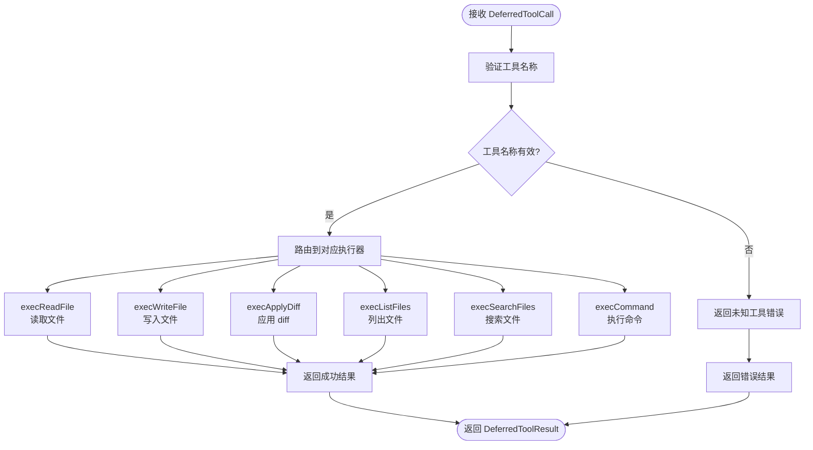
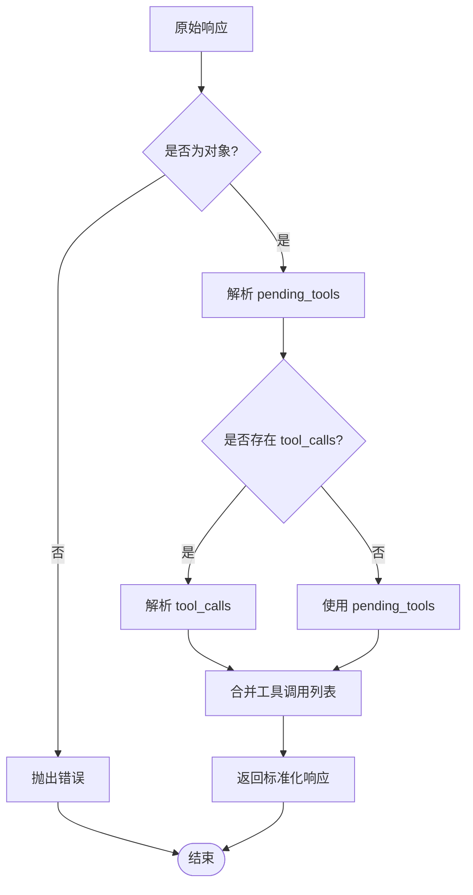
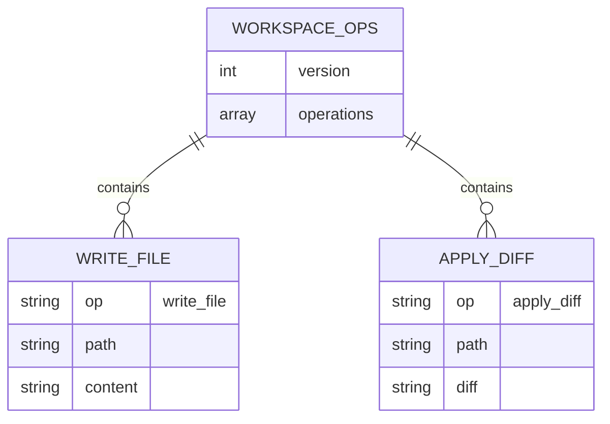
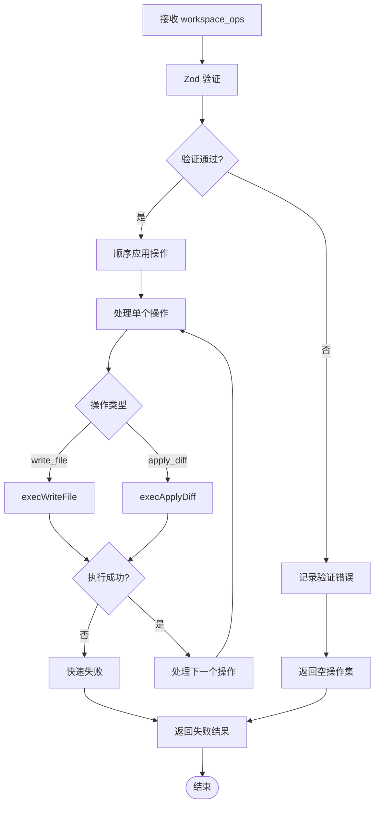
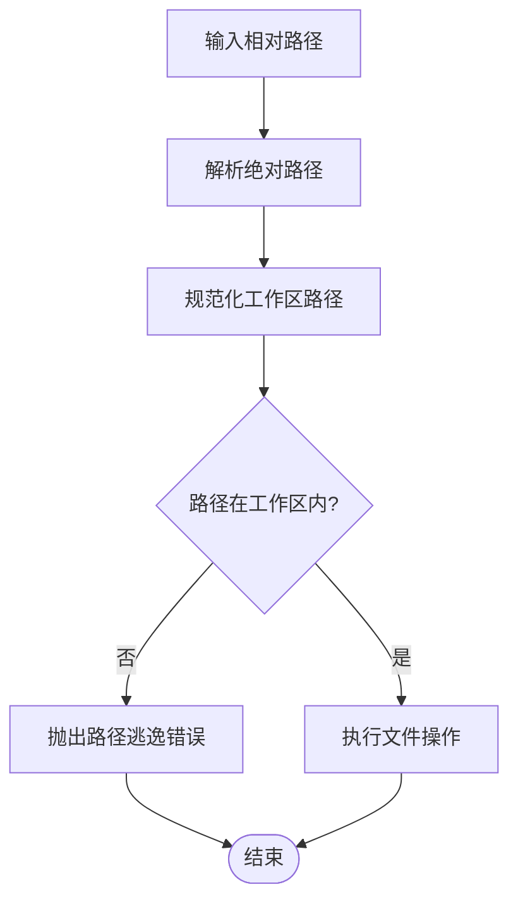
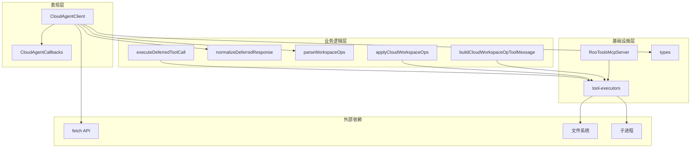

# 工具调用映射机制

<cite>
**本文档引用的文件**
- [types.ts](file://src/services/cloud-agent/types.ts)
- [CloudAgentClient.ts](file://src/services/cloud-agent/CloudAgentClient.ts)
- [executeDeferredToolCall.ts](file://src/services/cloud-agent/executeDeferredToolCall.ts)
- [normalizeDeferredResponse.ts](file://src/services/cloud-agent/normalizeDeferredResponse.ts)
- [parseWorkspaceOps.ts](file://src/services/cloud-agent/parseWorkspaceOps.ts)
- [buildCloudWorkspaceOpToolMessage.ts](file://src/services/cloud-agent/buildCloudWorkspaceOpToolMessage.ts)
- [applyCloudWorkspaceOps.ts](file://src/services/cloud-agent/applyCloudWorkspaceOps.ts)
- [tool-executors.ts](file://src/services/mcp-server/tool-executors.ts)
- [RooToolsMcpServer.ts](file://src/services/mcp-server/RooToolsMcpServer.ts)
- [cloud-agent-integration.md](file://docs/cloud-agent-integration.md)
- [test-cloud-agent-mock.mjs](file://src/test-cloud-agent-mock.mjs)
- [CloudAgentClient.spec.ts](file://src/services/cloud-agent/__tests__/CloudAgentClient.spec.ts)
</cite>

## 目录
1. [简介](#简介)
2. [项目结构](#项目结构)
3. [核心组件](#核心组件)
4. [架构概览](#架构概览)
5. [详细组件分析](#详细组件分析)
6. [依赖关系分析](#依赖关系分析)
7. [性能考虑](#性能考虑)
8. [故障排除指南](#故障排除指南)
9. [结论](#结论)

## 简介

Cloud Agent 工具调用映射机制是 NJUST AI CJ 扩展的核心功能之一，它实现了从云端 Agent 到本地工具执行的完整映射流程。该机制支持两种执行模式：传统的单次执行模式和推荐的延迟执行模式。

在延迟执行模式下，云端 Agent 会将需要本地执行的工具调用作为 `DeferredToolCall` 对象返回，扩展端负责在本地环境中执行这些工具，并将结果以 `DeferredToolResult` 格式返回给云端服务。这种设计确保了敏感操作可以在本地安全执行，同时保持云端智能决策的优势。

## 项目结构

Cloud Agent 相关的代码主要分布在以下文件中：



**图表来源**
- [types.ts:1-102](file://src/services/cloud-agent/types.ts#L1-L102)
- [CloudAgentClient.ts:1-339](file://src/services/cloud-agent/CloudAgentClient.ts#L1-L339)
- [RooToolsMcpServer.ts:1-339](file://src/services/mcp-server/RooToolsMcpServer.ts#L1-L339)

**章节来源**
- [types.ts:1-102](file://src/services/cloud-agent/types.ts#L1-L102)
- [CloudAgentClient.ts:1-339](file://src/services/cloud-agent/CloudAgentClient.ts#L1-L339)

## 核心组件

### 数据模型定义

Cloud Agent 机制的核心数据结构包括：

#### 工作区操作类型
```typescript
export type WorkspaceOp =
    | { op: "write_file"; path: string; content: string }
    | { op: "apply_diff"; path: string; diff: string }

export interface WorkspaceOpsEnvelope {
    version?: 1
    operations: WorkspaceOp[]
}
```

#### 延迟工具调用
```typescript
export interface DeferredToolCall {
    call_id: string
    tool: string
    arguments: Record<string, unknown>
}

export interface DeferredToolResult {
    call_id: string
    content: string
    is_error: boolean
}
```

#### 回调接口
```typescript
export interface CloudAgentCallbacks {
    onText: (content: string) => Promise<void>
    onReasoning: (content: string) => Promise<void>
    onDone: (summary?: string) => Promise<void>
    onError: (message: string) => Promise<void>
}
```

**章节来源**
- [types.ts:1-102](file://src/services/cloud-agent/types.ts#L1-L102)

### CloudAgentClient 类

CloudAgentClient 是整个工具调用映射机制的核心协调者，负责：

1. **连接管理**：维护与云端服务的健康检查连接
2. **请求构建**：构建带有认证头的 HTTP 请求
3. **响应处理**：解析和验证云端服务的响应
4. **工具调用执行**：协调延迟执行协议中的工具调用

**章节来源**
- [CloudAgentClient.ts:43-339](file://src/services/cloud-agent/CloudAgentClient.ts#L43-L339)

## 架构概览

Cloud Agent 工具调用映射机制采用分层架构设计，实现了云端智能与本地执行的安全分离：



**图表来源**
- [CloudAgentClient.ts:306-333](file://src/services/cloud-agent/CloudAgentClient.ts#L306-L333)
- [cloud-agent-integration.md:183-207](file://docs/cloud-agent-integration.md#L183-L207)

## 详细组件分析

### 延迟执行协议实现

延迟执行协议是 Cloud Agent 机制的核心创新，它将工具调用的执行时机从云端转移到本地：

#### 工具调用映射表

| 服务端工具名 | 本地执行器 | 参数结构 | 功能描述 |
|-------------|-----------|----------|----------|
| `read_file` | `execReadFile` | `{ path, start_line?, end_line? }` | 读取文件内容，支持行范围选择 |
| `write_file` | `execWriteFile` | `{ path, content }` | 写入文件内容，自动创建目录 |
| `apply_diff` | `execApplyDiff` | `{ path, diff }` | 应用 SEARCH/REPLACE 格式的 diff |
| `list_files` | `execListFiles` | `{ path, recursive? }` | 列出目录文件，支持递归 |
| `search_files` | `execSearchFiles` | `{ path, regex, file_pattern? }` | 正则搜索文件 |
| `execute_command` | `execCommand` | `{ command, cwd?, timeout? }` | 执行系统命令 |

#### 工具调用执行流程



**图表来源**
- [executeDeferredToolCall.ts:15-82](file://src/services/cloud-agent/executeDeferredToolCall.ts#L15-L82)

**章节来源**
- [executeDeferredToolCall.ts:1-83](file://src/services/cloud-agent/executeDeferredToolCall.ts#L1-L83)

### 响应标准化机制

为了兼容不同云端服务的响应格式，系统实现了响应标准化功能：

#### 响应标准化流程



**图表来源**
- [normalizeDeferredResponse.ts:67-83](file://src/services/cloud-agent/normalizeDeferredResponse.ts#L67-L83)

**章节来源**
- [normalizeDeferredResponse.ts:1-84](file://src/services/cloud-agent/normalizeDeferredResponse.ts#L1-L84)

### 工作区操作处理

工作区操作是 Cloud Agent 机制的重要组成部分，它允许云端服务表达结构化的文件操作意图：

#### 操作类型定义



**图表来源**
- [types.ts:2-9](file://src/services/cloud-agent/types.ts#L2-L9)

#### 操作验证和应用



**图表来源**
- [parseWorkspaceOps.ts:41-61](file://src/services/cloud-agent/parseWorkspaceOps.ts#L41-L61)
- [applyCloudWorkspaceOps.ts:38-63](file://src/services/cloud-agent/applyCloudWorkspaceOps.ts#L38-L63)

**章节来源**
- [parseWorkspaceOps.ts:1-62](file://src/services/cloud-agent/parseWorkspaceOps.ts#L1-L62)
- [applyCloudWorkspaceOps.ts:1-64](file://src/services/cloud-agent/applyCloudWorkspaceOps.ts#L1-L64)

### 本地工具执行器

本地工具执行器提供了安全的文件系统操作能力，所有操作都经过严格的安全检查：

#### 路径安全验证



**图表来源**
- [tool-executors.ts:13-20](file://src/services/mcp-server/tool-executors.ts#L13-L20)

**章节来源**
- [tool-executors.ts:1-208](file://src/services/mcp-server/tool-executors.ts#L1-L208)

## 依赖关系分析

Cloud Agent 工具调用映射机制的依赖关系体现了清晰的分层架构：



**图表来源**
- [CloudAgentClient.ts:1-12](file://src/services/cloud-agent/CloudAgentClient.ts#L1-L12)
- [executeDeferredToolCall.ts:1-8](file://src/services/cloud-agent/executeDeferredToolCall.ts#L1-L8)
- [tool-executors.ts:1-8](file://src/services/mcp-server/tool-executors.ts#L1-L8)

**章节来源**
- [CloudAgentClient.ts:1-339](file://src/services/cloud-agent/CloudAgentClient.ts#L1-L339)
- [executeDeferredToolCall.ts:1-83](file://src/services/cloud-agent/executeDeferredToolCall.ts#L1-L83)

## 性能考虑

### 资源限制和安全控制

Cloud Agent 机制实施了多层次的安全和性能控制：

#### 路径安全边界
- 绝对路径和相对路径都必须位于工作区边界内
- 任何尝试访问工作区外路径的操作都会被拒绝
- 路径解析过程中进行严格的边界检查

#### 操作限制
- 单次响应最多包含 50 个工作区操作
- 文件路径长度限制为 4096 字符
- 文件内容和 diff 内容长度限制为 1,000,000 字符
- 命令执行超时默认 30 秒，可配置

#### 并发控制
- 工作区操作按顺序应用，支持快速失败
- 工具调用执行遵循云端服务的指令顺序
- 支持中断信号和超时机制

### 错误处理和恢复

系统实现了完善的错误处理机制：

#### 错误分类
- **网络错误**：连接失败、超时、HTTP 错误
- **验证错误**：JSON 解析失败、Schema 验证失败
- **执行错误**：工具调用失败、文件系统错误
- **安全错误**：路径逃逸、权限不足

#### 恢复策略
- 网络错误支持重试机制
- 工作区操作失败时停止应用后续操作
- 工具调用失败时返回错误结果而非中断整个流程

## 故障排除指南

### 常见问题诊断

#### 连接问题
1. **健康检查失败**：检查服务端 URL 和网络连通性
2. **认证失败**：验证 X-API-Key 和 X-Device-Token 配置
3. **超时问题**：调整 requestTimeoutMs 参数

#### 工具调用问题
1. **未知工具错误**：确认工具名称是否在支持列表中
2. **路径错误**：检查相对路径是否在工作区内
3. **权限问题**：验证文件系统权限设置

#### 工作区操作问题
1. **验证失败**：检查 workspace_ops 格式和大小限制
2. **应用失败**：查看具体失败的操作索引
3. **安全拒绝**：确认操作是否被本地策略阻止

**章节来源**
- [CloudAgentClient.spec.ts:1-219](file://src/services/cloud-agent/__tests__/CloudAgentClient.spec.ts#L1-L219)

### 调试技巧

#### 开发环境调试
1. 使用提供的 mock 服务器进行本地联调
2. 启用详细的日志记录
3. 利用单元测试验证各个组件功能

#### 生产环境监控
1. 监控网络请求和响应时间
2. 跟踪工具调用成功率
3. 监控资源使用情况和错误率

**章节来源**
- [test-cloud-agent-mock.mjs:1-395](file://src/test-cloud-agent-mock.mjs#L1-L395)

## 结论

Cloud Agent 工具调用映射机制通过精心设计的架构实现了云端智能与本地执行的安全分离。其核心优势包括：

1. **安全性**：敏感操作在本地执行，云端仅负责智能决策
2. **灵活性**：支持多种工具调用和工作区操作
3. **可靠性**：完善的错误处理和恢复机制
4. **可扩展性**：模块化设计便于功能扩展和维护

该机制为现代 AI 辅助开发场景提供了可靠的基础设施，既保证了用户体验，又确保了系统的安全性和稳定性。通过持续的优化和改进，它将继续为开发者提供高效、安全的工具调用服务。