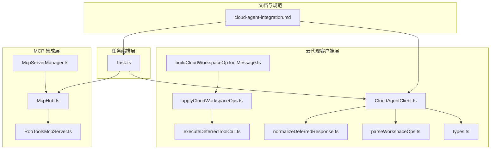
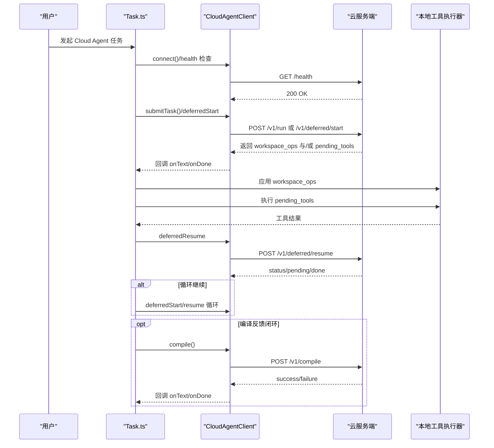
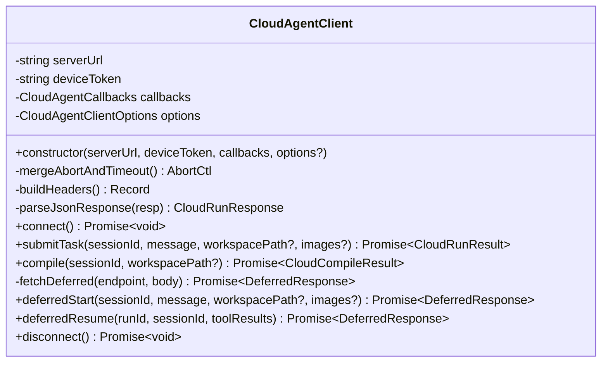
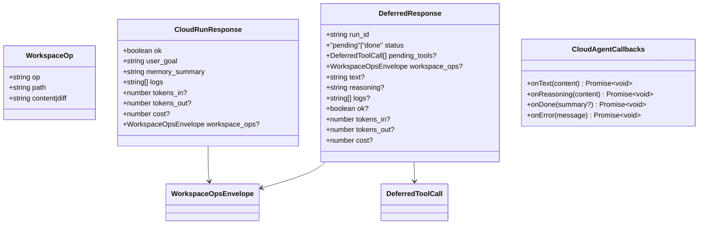
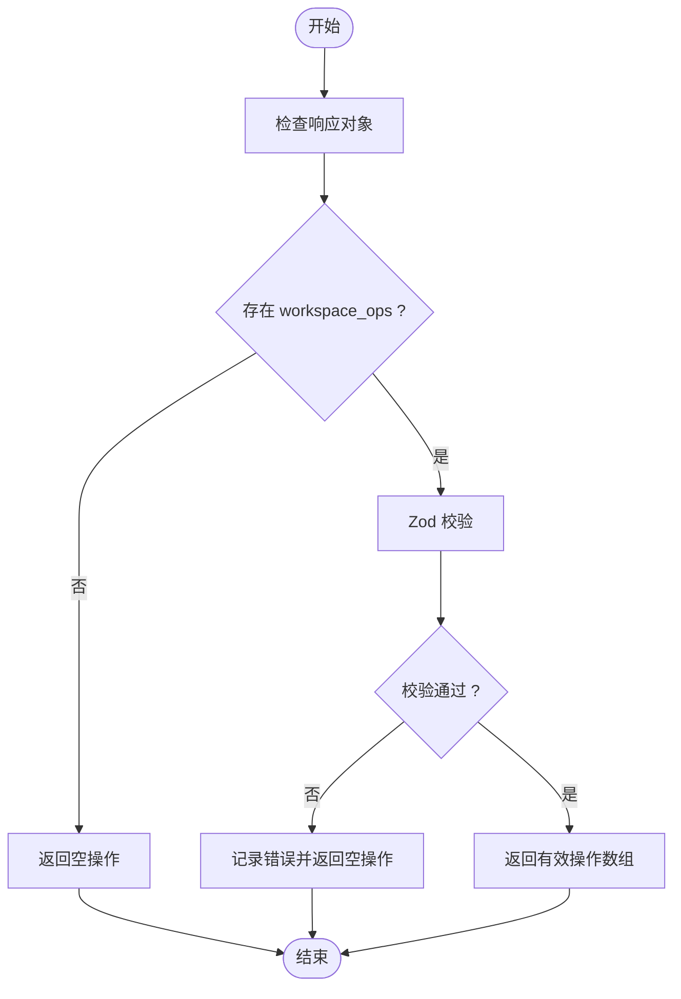
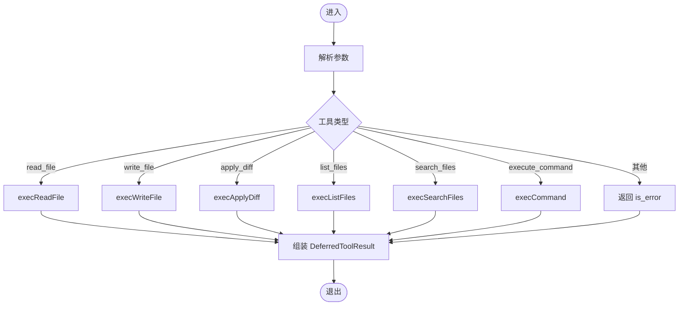
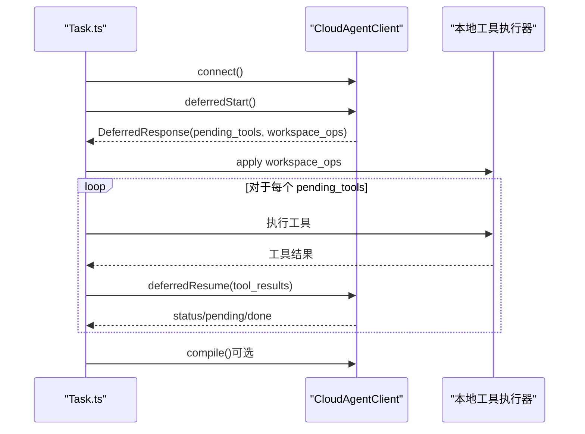
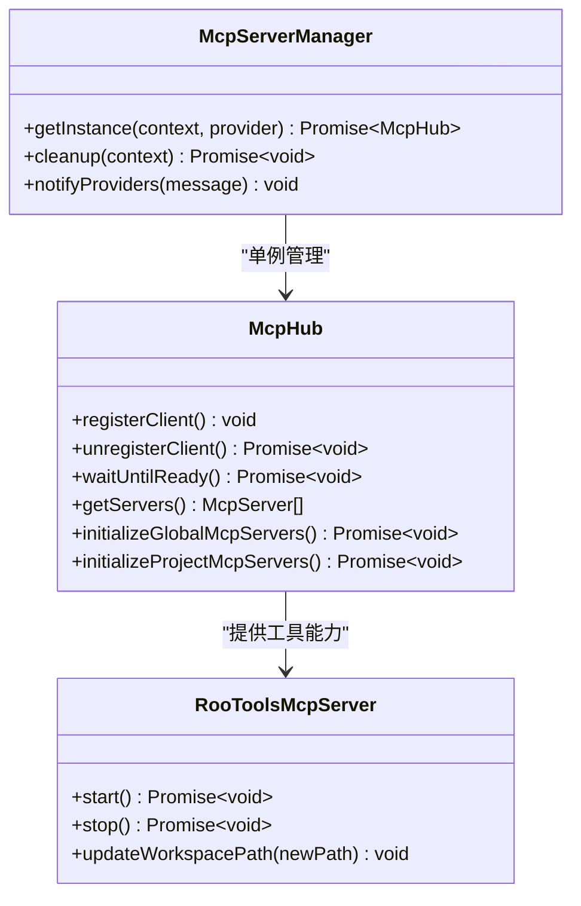
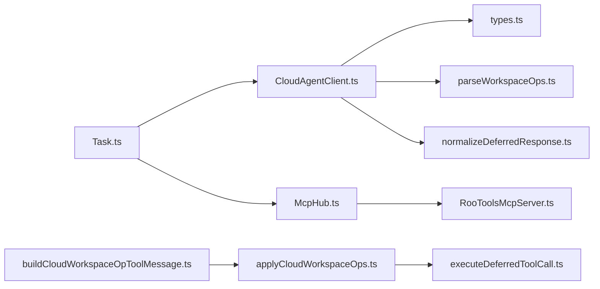

# 架构设计与组件

<cite>
**本文引用的文件**
- [CloudAgentClient.ts](file://src/services/cloud-agent/CloudAgentClient.ts)
- [types.ts](file://src/services/cloud-agent/types.ts)
- [applyCloudWorkspaceOps.ts](file://src/services/cloud-agent/applyCloudWorkspaceOps.ts)
- [buildCloudWorkspaceOpToolMessage.ts](file://src/services/cloud-agent/buildCloudWorkspaceOpToolMessage.ts)
- [executeDeferredToolCall.ts](file://src/services/cloud-agent/executeDeferredToolCall.ts)
- [parseWorkspaceOps.ts](file://src/services/cloud-agent/parseWorkspaceOps.ts)
- [normalizeDeferredResponse.ts](file://src/services/cloud-agent/normalizeDeferredResponse.ts)
- [cloud-agent-integration.md](file://docs/cloud-agent-integration.md)
- [Task.ts](file://src/core/task/Task.ts)
- [McpHub.ts](file://src/services/mcp/McpHub.ts)
- [McpServerManager.ts](file://src/services/mcp/McpServerManager.ts)
- [RooToolsMcpServer.ts](file://src/services/mcp-server/RooToolsMcpServer.ts)
</cite>

## 目录
1. [引言](#引言)
2. [项目结构](#项目结构)
3. [核心组件](#核心组件)
4. [架构总览](#架构总览)
5. [详细组件分析](#详细组件分析)
6. [依赖关系分析](#依赖关系分析)
7. [性能考虑](#性能考虑)
8. [故障排查指南](#故障排查指南)
9. [结论](#结论)
10. [附录](#附录)

## 引言
本文件面向 Cloud Agent 架构设计，系统性阐述 Cloud Agent Client 的整体架构、组件协作关系、数据流与职责分工。重点覆盖：
- 客户端与本地扩展的集成方式（MCP 工具执行器）
- 服务发现与连接管理策略（REST 模式下的健康检查与超时合并）
- 初始化流程、配置管理与错误处理机制
- 分布式系统挑战与解决方案（网络分区、一致性、性能优化）

## 项目结构
Cloud Agent 相关代码主要位于以下模块：
- 云代理客户端与协议：src/services/cloud-agent/*
- 任务编排与回调：src/core/task/Task.ts
- MCP 服务器与 Hub：src/services/mcp/* 与 src/services/mcp-server/*
- 文档与对接规范：docs/cloud-agent-integration.md

**图表来源**
- [CloudAgentClient.ts:43-339](file://src/services/cloud-agent/CloudAgentClient.ts#L43-L339)
- [types.ts:1-102](file://src/services/cloud-agent/types.ts#L1-L102)
- [parseWorkspaceOps.ts:1-62](file://src/services/cloud-agent/parseWorkspaceOps.ts#L1-L62)
- [applyCloudWorkspaceOps.ts:1-64](file://src/services/cloud-agent/applyCloudWorkspaceOps.ts#L1-L64)
- [buildCloudWorkspaceOpToolMessage.ts:1-96](file://src/services/cloud-agent/buildCloudWorkspaceOpToolMessage.ts#L1-L96)
- [executeDeferredToolCall.ts:1-83](file://src/services/cloud-agent/executeDeferredToolCall.ts#L1-L83)
- [normalizeDeferredResponse.ts:1-84](file://src/services/cloud-agent/normalizeDeferredResponse.ts#L1-L84)
- [Task.ts:2462-2838](file://src/core/task/Task.ts#L2462-L2838)
- [McpHub.ts:151-800](file://src/services/mcp/McpHub.ts#L151-L800)
- [McpServerManager.ts:1-87](file://src/services/mcp/McpServerManager.ts#L1-L87)
- [RooToolsMcpServer.ts:1-339](file://src/services/mcp-server/RooToolsMcpServer.ts#L1-L339)
- [cloud-agent-integration.md:1-351](file://docs/cloud-agent-integration.md#L1-L351)

**章节来源**
- [cloud-agent-integration.md:1-351](file://docs/cloud-agent-integration.md#L1-L351)
- [Task.ts:2462-2838](file://src/core/task/Task.ts#L2462-L2838)

## 核心组件
- CloudAgentClient：REST 客户端，负责健康检查、任务提交、编译反馈、延迟执行协议的启动与恢复。
- 数据模型与协议：types.ts 定义响应结构、回调接口、延迟执行协议的数据契约。
- 工作区操作解析与应用：parseWorkspaceOps.ts 校验并提取结构化写盘指令；applyCloudWorkspaceOps.ts 顺序应用并支持中断。
- 本地工具执行：executeDeferredToolCall.ts 将服务端工具调用映射到本地工具执行器。
- UI 消息构建：buildCloudWorkspaceOpToolMessage.ts 将写盘操作转换为聊天 UI 的审批消息。
- MCP 集成：McpHub/McpServerManager/RooToolsMcpServer 提供本地工具能力与服务器生命周期管理。

**章节来源**
- [CloudAgentClient.ts:43-339](file://src/services/cloud-agent/CloudAgentClient.ts#L43-L339)
- [types.ts:1-102](file://src/services/cloud-agent/types.ts#L1-L102)
- [parseWorkspaceOps.ts:1-62](file://src/services/cloud-agent/parseWorkspaceOps.ts#L1-L62)
- [applyCloudWorkspaceOps.ts:1-64](file://src/services/cloud-agent/applyCloudWorkspaceOps.ts#L1-L64)
- [buildCloudWorkspaceOpToolMessage.ts:1-96](file://src/services/cloud-agent/buildCloudWorkspaceOpToolMessage.ts#L1-L96)
- [executeDeferredToolCall.ts:1-83](file://src/services/cloud-agent/executeDeferredToolCall.ts#L1-L83)
- [McpHub.ts:151-800](file://src/services/mcp/McpHub.ts#L151-L800)
- [McpServerManager.ts:1-87](file://src/services/mcp/McpServerManager.ts#L1-L87)
- [RooToolsMcpServer.ts:1-339](file://src/services/mcp-server/RooToolsMcpServer.ts#L1-L339)

## 架构总览
Cloud Agent 采用“云侧推理 + 本地执行”的混合架构：
- 云侧：负责规划、推理与决策，通过 REST API 与扩展交互。
- 本地：负责文件系统与命令行等受限能力，通过 MCP 工具或直接执行器暴露给扩展。
- 扩展：统一调度任务、回调与 UI 更新，并在必要时进行编译反馈闭环。

**图表来源**
- [CloudAgentClient.ts:118-206](file://src/services/cloud-agent/CloudAgentClient.ts#L118-L206)
- [CloudAgentClient.ts:306-333](file://src/services/cloud-agent/CloudAgentClient.ts#L306-L333)
- [cloud-agent-integration.md:91-215](file://docs/cloud-agent-integration.md#L91-L215)
- [Task.ts:2462-2838](file://src/core/task/Task.ts#L2462-L2838)

## 详细组件分析

### CloudAgentClient 组件
职责与特性：
- 健康检查：调用 /health 并处理非 2xx 与 JSON 解析异常。
- 任务提交：支持 /v1/run 与 /v1/deferred/start，解析响应并分发回调。
- 编译反馈：调用 /v1/compile 获取构建输出。
- 延迟执行协议：封装 /v1/deferred/start 与 /v1/deferred/resume，标准化响应格式。
- 连接管理：基于 AbortSignal 与超时合并，统一清理资源。
- 错误增强：对 fetch 失败进行原因拼接，401 时给出配置提示。

**图表来源**
- [CloudAgentClient.ts:43-339](file://src/services/cloud-agent/CloudAgentClient.ts#L43-L339)

**章节来源**
- [CloudAgentClient.ts:118-206](file://src/services/cloud-agent/CloudAgentClient.ts#L118-L206)
- [CloudAgentClient.ts:212-257](file://src/services/cloud-agent/CloudAgentClient.ts#L212-L257)
- [CloudAgentClient.ts:306-333](file://src/services/cloud-agent/CloudAgentClient.ts#L306-L333)

### 数据模型与协议（types.ts）
- WorkspaceOp：写文件与应用 diff 两类结构化操作。
- CloudRunResponse/Result：任务结果与用量统计。
- DeferredResponse/ToolCall：延迟执行协议的数据契约。
- 回调接口：onText/onReasoning/onDone/onError。

**图表来源**
- [types.ts:1-102](file://src/services/cloud-agent/types.ts#L1-L102)

**章节来源**
- [types.ts:1-102](file://src/services/cloud-agent/types.ts#L1-L102)

### 工作区操作解析与应用（parseWorkspaceOps.ts、applyCloudWorkspaceOps.ts）
- 解析与校验：使用 Zod schema 校验 workspace_ops，限制数量与长度，非法时返回空集合并记录错误。
- 应用策略：顺序执行，支持中断；失败即停止（fail-fast）。

**图表来源**
- [parseWorkspaceOps.ts:41-61](file://src/services/cloud-agent/parseWorkspaceOps.ts#L41-L61)

**章节来源**
- [parseWorkspaceOps.ts:1-62](file://src/services/cloud-agent/parseWorkspaceOps.ts#L1-L62)
- [applyCloudWorkspaceOps.ts:1-64](file://src/services/cloud-agent/applyCloudWorkspaceOps.ts#L1-L64)

### 本地工具执行（executeDeferredToolCall.ts）
- 映射工具：read_file/write_file/apply_diff/list_files/search_files/execute_command。
- 错误处理：未知工具返回 is_error 结果而非抛出异常。

**图表来源**
- [executeDeferredToolCall.ts:15-83](file://src/services/cloud-agent/executeDeferredToolCall.ts#L15-L83)

**章节来源**
- [executeDeferredToolCall.ts:1-83](file://src/services/cloud-agent/executeDeferredToolCall.ts#L1-L83)

### UI 消息构建（buildCloudWorkspaceOpToolMessage.ts）
- 将写盘操作转换为聊天 UI 的审批消息，包含差异统计与路径信息。
- 支持新文件与已有文件的不同处理路径。

**章节来源**
- [buildCloudWorkspaceOpToolMessage.ts:1-96](file://src/services/cloud-agent/buildCloudWorkspaceOpToolMessage.ts#L1-L96)

### 任务编排与回调（Task.ts）
- 模式判断：当 mode 为 "cloud-agent" 时，初始化 CloudAgentClient 并进入延迟执行循环。
- 生命周期：connect → deferredStart → 本地执行工具 → deferredResume → 循环至 done → 编译反馈闭环。
- 回调驱动：通过 CloudAgentCallbacks 将增量文本、记忆摘要与完成状态回传给 UI。

**图表来源**
- [Task.ts:2462-2838](file://src/core/task/Task.ts#L2462-L2838)
- [CloudAgentClient.ts:306-333](file://src/services/cloud-agent/CloudAgentClient.ts#L306-L333)

**章节来源**
- [Task.ts:2462-2838](file://src/core/task/Task.ts#L2462-L2838)

### MCP 集成与本地工具能力
- McpHub：集中管理 MCP 服务器，支持全局与项目级配置，文件变更监听与去重。
- McpServerManager：单例管理，确保跨 webview 的唯一实例。
- RooToolsMcpServer：提供本地工具（读写文件、列出/搜索文件、执行命令、应用 diff）的 MCP 服务端。

**图表来源**
- [McpServerManager.ts:1-87](file://src/services/mcp/McpServerManager.ts#L1-L87)
- [McpHub.ts:151-800](file://src/services/mcp/McpHub.ts#L151-L800)
- [RooToolsMcpServer.ts:1-339](file://src/services/mcp-server/RooToolsMcpServer.ts#L1-L339)

**章节来源**
- [McpServerManager.ts:1-87](file://src/services/mcp/McpServerManager.ts#L1-L87)
- [McpHub.ts:151-800](file://src/services/mcp/McpHub.ts#L151-L800)
- [RooToolsMcpServer.ts:1-339](file://src/services/mcp-server/RooToolsMcpServer.ts#L1-L339)

## 依赖关系分析
- CloudAgentClient 依赖：
  - types.ts（数据契约）
  - parseWorkspaceOps.ts（workspace_ops 校验）
  - normalizeDeferredResponse.ts（延迟响应标准化）
  - applyCloudWorkspaceOps.ts（本地应用）
  - executeDeferredToolCall.ts（本地工具执行）
- Task.ts 依赖 CloudAgentClient 与工具应用/消息构建模块。
- MCP 层独立于 Cloud Agent，但为本地工具执行提供基础设施。

**图表来源**
- [CloudAgentClient.ts:1-339](file://src/services/cloud-agent/CloudAgentClient.ts#L1-L339)
- [types.ts:1-102](file://src/services/cloud-agent/types.ts#L1-L102)
- [parseWorkspaceOps.ts:1-62](file://src/services/cloud-agent/parseWorkspaceOps.ts#L1-L62)
- [normalizeDeferredResponse.ts:1-84](file://src/services/cloud-agent/normalizeDeferredResponse.ts#L1-L84)
- [applyCloudWorkspaceOps.ts:1-64](file://src/services/cloud-agent/applyCloudWorkspaceOps.ts#L1-L64)
- [buildCloudWorkspaceOpToolMessage.ts:1-96](file://src/services/cloud-agent/buildCloudWorkspaceOpToolMessage.ts#L1-L96)
- [executeDeferredToolCall.ts:1-83](file://src/services/cloud-agent/executeDeferredToolCall.ts#L1-L83)
- [Task.ts:2462-2838](file://src/core/task/Task.ts#L2462-L2838)
- [McpHub.ts:151-800](file://src/services/mcp/McpHub.ts#L151-L800)
- [RooToolsMcpServer.ts:1-339](file://src/services/mcp-server/RooToolsMcpServer.ts#L1-L339)

**章节来源**
- [Task.ts:2462-2838](file://src/core/task/Task.ts#L2462-L2838)
- [CloudAgentClient.ts:1-339](file://src/services/cloud-agent/CloudAgentClient.ts#L1-L339)

## 性能考虑
- 超时与取消：通过 AbortSignal 与超时合并，避免长时间阻塞；请求结束后统一清理。
- 响应解析：严格 JSON 校验，非 2xx 直接报错，减少无效计算。
- workspace_ops 限流：数量与长度限制，防止过大负载；非法时整段丢弃，不影响日志与摘要展示。
- 编译反馈闭环：最大重试次数限制，避免无限循环；仅在启用且出现 workspace_ops 时触发。
- MCP 服务器去重：按名称去重，项目级配置优先，降低重复连接成本。

[本节为通用性能建议，无需特定文件引用]

## 故障排查指南
常见问题与定位要点：
- 401 未授权：检查 apiKey 配置与环境变量，确认 VS Code 用户设置与扩展宿主环境变量一致。
- 健康检查失败：确认服务端地址与网络连通性，查看响应体中的错误片段。
- JSON 解析失败：检查服务端响应是否为合法 JSON，关注长度截断提示。
- workspace_ops 校验失败：检查路径长度、内容长度与操作类型，确认未超过限制。
- 延迟执行协议异常：核对 run_id 与工具调用参数，确保工具名与参数结构匹配。
- MCP 服务器不可用：检查配置文件语法与权限，确认绑定地址与认证令牌设置。

**章节来源**
- [CloudAgentClient.ts:13-41](file://src/services/cloud-agent/CloudAgentClient.ts#L13-L41)
- [CloudAgentClient.ts:118-141](file://src/services/cloud-agent/CloudAgentClient.ts#L118-L141)
- [CloudAgentClient.ts:175-179](file://src/services/cloud-agent/CloudAgentClient.ts#L175-L179)
- [parseWorkspaceOps.ts:5-10](file://src/services/cloud-agent/parseWorkspaceOps.ts#L5-L10)
- [cloud-agent-integration.md:260-266](file://docs/cloud-agent-integration.md#L260-L266)

## 结论
Cloud Agent 架构通过清晰的职责分离与严格的协议约束，实现了“云推理 + 本地执行”的高效协同。关键优势包括：
- 明确的初始化与连接管理策略，支持超时与取消。
- 严谨的数据校验与错误增强，提升可观测性与可维护性。
- 本地工具执行与 UI 消息构建的解耦，便于扩展与定制。
- MCP 体系提供可插拔的本地能力，便于安全与权限控制。

## 附录
- 对接规范与协议细节参见文档：docs/cloud-agent-integration.md
- 任务编排入口与回调机制参见：src/core/task/Task.ts
- MCP 服务器与 Hub 的生命周期管理参见：src/services/mcp/McpHub.ts、src/services/mcp/McpServerManager.ts、src/services/mcp-server/RooToolsMcpServer.ts