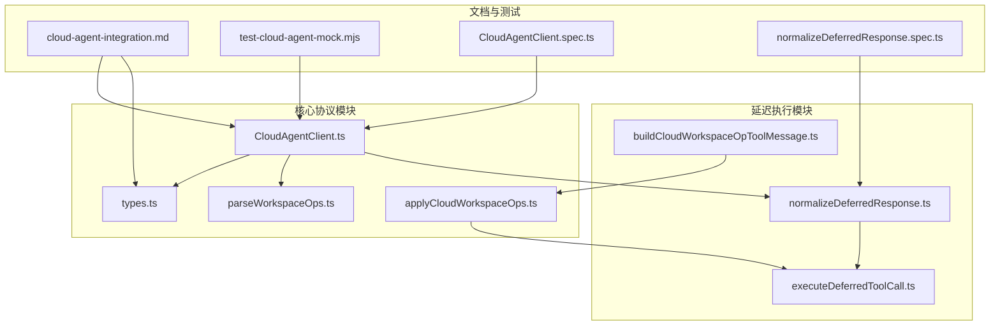
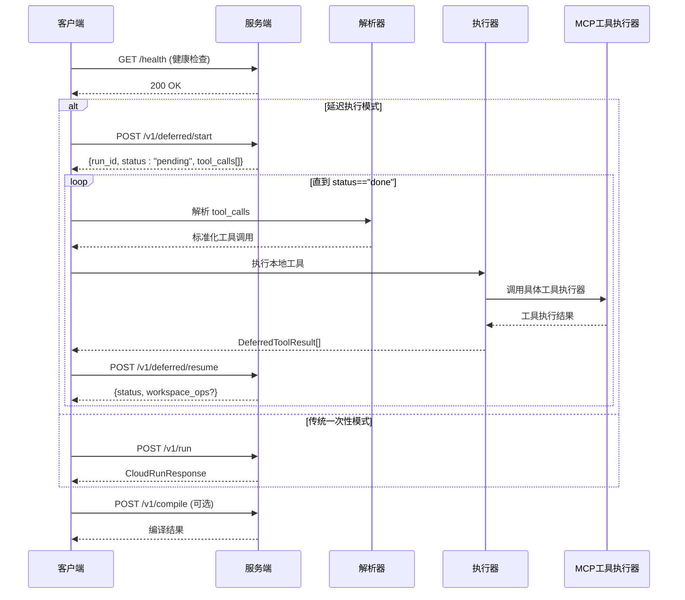
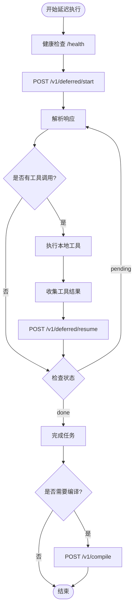
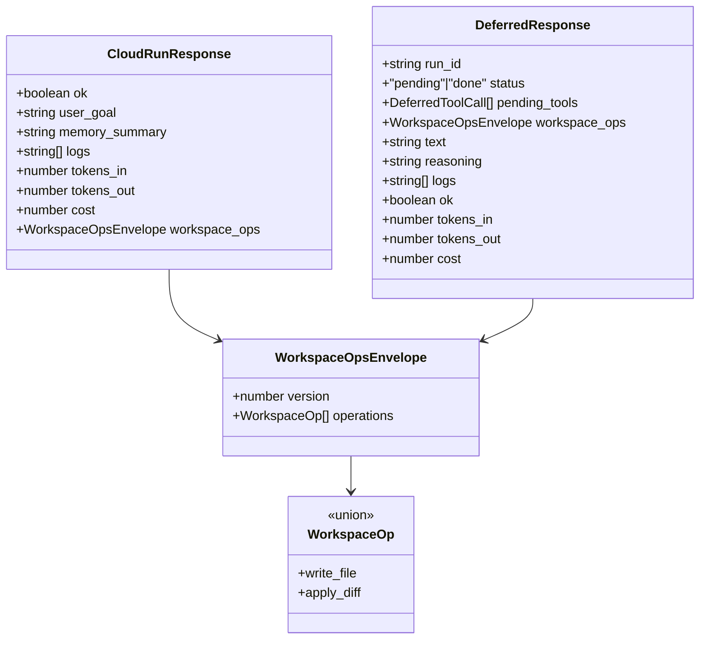
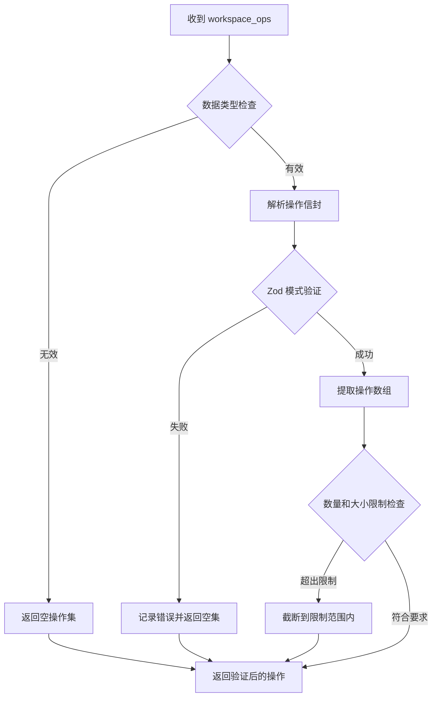
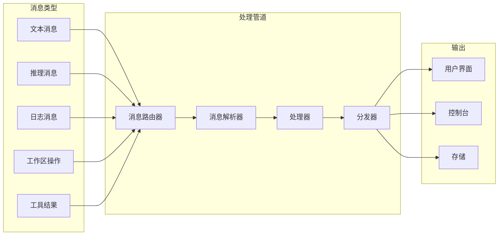
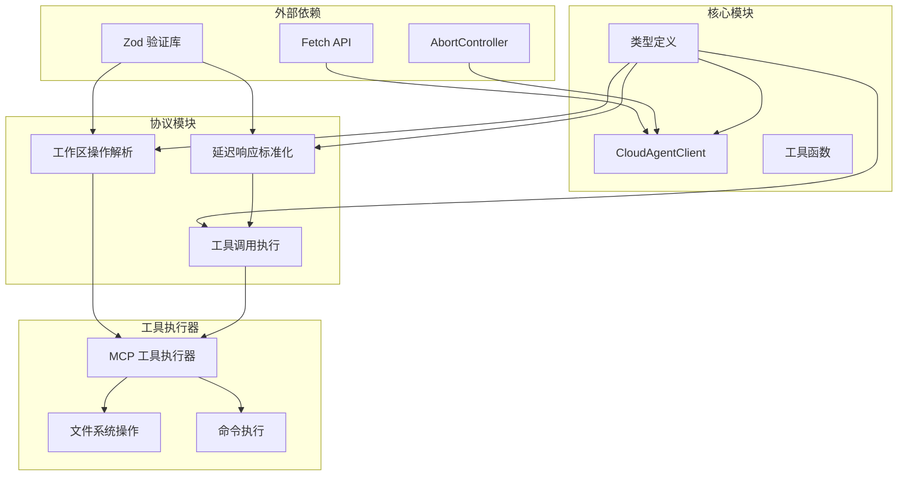

# 通信协议与消息处理

<cite>
**本文档引用的文件**
- [CloudAgentClient.ts](file://src/services/cloud-agent/CloudAgentClient.ts)
- [types.ts](file://src/services/cloud-agent/types.ts)
- [applyCloudWorkspaceOps.ts](file://src/services/cloud-agent/applyCloudWorkspaceOps.ts)
- [parseWorkspaceOps.ts](file://src/services/cloud-agent/parseWorkspaceOps.ts)
- [normalizeDeferredResponse.ts](file://src/services/cloud-agent/normalizeDeferredResponse.ts)
- [executeDeferredToolCall.ts](file://src/services/cloud-agent/executeDeferredToolCall.ts)
- [buildCloudWorkspaceOpToolMessage.ts](file://src/services/cloud-agent/buildCloudWorkspaceOpToolMessage.ts)
- [cloud-agent-integration.md](file://docs/cloud-agent-integration.md)
- [test-cloud-agent-mock.mjs](file://src/test-cloud-agent-mock.mjs)
- [CloudAgentClient.spec.ts](file://src/services/cloud-agent/__tests__/CloudAgentClient.spec.ts)
- [normalizeDeferredResponse.spec.ts](file://src/services/cloud-agent/__tests__/normalizeDeferredResponse.spec.ts)
</cite>

## 目录
1. [简介](#简介)
2. [项目结构](#项目结构)
3. [核心组件](#核心组件)
4. [架构概览](#架构概览)
5. [详细组件分析](#详细组件分析)
6. [依赖关系分析](#依赖关系分析)
7. [性能考虑](#性能考虑)
8. [故障排除指南](#故障排除指南)
9. [结论](#结论)

## 简介

Cloud Agent 通信协议是 NJUST AI CJ 扩展与云端 Agent 服务端之间的标准化接口规范。该协议支持两种模式：传统一次性请求模式（/v1/run）和延迟执行模式（/v1/deferred/start 和 /v1/deferred/resume）。协议设计遵循 RESTful 架构，采用 JSON 作为消息序列化格式，支持结构化工作区操作、增量文本流式传输和标准化的错误处理机制。

协议的核心特性包括：
- **双协议支持**：兼容传统一次性请求和现代延迟执行两种模式
- **结构化工作区操作**：支持文件写入和差异应用的标准化操作
- **标准化工具调用**：定义了统一的工具调用协议，支持多种本地工具执行
- **流式消息处理**：支持增量文本、推理过程和日志的实时传输
- **健壮的错误处理**：提供详细的错误信息和重试机制

## 项目结构

Cloud Agent 通信协议相关的代码主要分布在以下模块中：

**图表来源**
- [CloudAgentClient.ts:1-339](file://src/services/cloud-agent/CloudAgentClient.ts#L1-L339)
- [types.ts:1-102](file://src/services/cloud-agent/types.ts#L1-L102)
- [cloud-agent-integration.md:1-351](file://docs/cloud-agent-integration.md#L1-L351)

**章节来源**
- [CloudAgentClient.ts:1-339](file://src/services/cloud-agent/CloudAgentClient.ts#L1-L339)
- [types.ts:1-102](file://src/services/cloud-agent/types.ts#L1-L102)
- [cloud-agent-integration.md:1-351](file://docs/cloud-agent-integration.md#L1-L351)

## 核心组件

### CloudAgentClient - 主要客户端类

CloudAgentClient 是协议的核心实现类，负责管理与云端服务端的通信连接和消息处理。

**关键功能特性**：
- **健康检查**：通过 /health 端点验证服务可用性
- **任务提交**：支持一次性任务提交和延迟执行模式
- **编译反馈**：集成编译结果的反馈循环机制
- **超时控制**：支持基于 AbortSignal 的超时和取消机制
- **错误增强**：提供详细的错误信息和诊断提示

**章节来源**
- [CloudAgentClient.ts:43-339](file://src/services/cloud-agent/CloudAgentClient.ts#L43-L339)

### 数据类型定义

协议定义了完整的 TypeScript 类型系统，确保客户端和服务端之间的数据一致性。

**核心数据类型**：
- **WorkspaceOp**：工作区操作类型，支持 write_file 和 apply_diff
- **CloudRunResponse**：一次性请求的响应格式
- **DeferredResponse**：延迟执行模式的响应格式
- **DeferredToolCall**：工具调用的标准化表示

**章节来源**
- [types.ts:1-102](file://src/services/cloud-agent/types.ts#L1-L102)

### 工作区操作处理

工作区操作处理模块提供了安全可靠的操作执行机制。

**处理流程**：
1. **解析验证**：使用 Zod schema 验证操作的有效性
2. **安全执行**：通过 MCP 工具执行器安全地应用操作
3. **结果收集**：收集执行结果并提供错误处理
4. **批量应用**：支持多个操作的顺序执行和快速失败

**章节来源**
- [applyCloudWorkspaceOps.ts:1-64](file://src/services/cloud-agent/applyCloudWorkspaceOps.ts#L1-L64)
- [parseWorkspaceOps.ts:1-62](file://src/services/cloud-agent/parseWorkspaceOps.ts#L1-L62)

## 架构概览

Cloud Agent 通信协议采用分层架构设计，清晰分离了协议抽象、消息处理和工具执行等不同层面。

**图表来源**
- [CloudAgentClient.ts:118-206](file://src/services/cloud-agent/CloudAgentClient.ts#L118-L206)
- [CloudAgentClient.ts:306-333](file://src/services/cloud-agent/CloudAgentClient.ts#L306-L333)
- [cloud-agent-integration.md:183-207](file://docs/cloud-agent-integration.md#L183-L207)

## 详细组件分析

### 延迟执行协议详解

延迟执行协议是 Cloud Agent 的核心创新，它将复杂的任务分解为可管理的步骤，支持实时的工具调用和状态恢复。

**图表来源**
- [CloudAgentClient.ts:306-333](file://src/services/cloud-agent/CloudAgentClient.ts#L306-L333)
- [normalizeDeferredResponse.ts:67-83](file://src/services/cloud-agent/normalizeDeferredResponse.ts#L67-L83)

#### 工具调用标准化

协议定义了统一的工具调用格式，支持多种本地工具的标准化执行：

**支持的工具类型**：
- `read_file`: 文件读取，支持行范围参数
- `write_file`: 文件写入，支持内容参数
- `apply_diff`: 差异应用，支持 SEARCH/REPLACE 格式
- `list_files`: 文件列表，支持递归参数
- `search_files`: 文件搜索，支持正则表达式
- `execute_command`: 命令执行，支持工作目录和超时

**章节来源**
- [executeDeferredToolCall.ts:15-83](file://src/services/cloud-agent/executeDeferredToolCall.ts#L15-L83)
- [cloud-agent-integration.md:146-153](file://docs/cloud-agent-integration.md#L146-L153)

### 消息格式规范

协议定义了严格的消息格式规范，确保客户端和服务端之间的数据一致性。

**图表来源**
- [types.ts:11-101](file://src/services/cloud-agent/types.ts#L11-L101)

#### 序列化机制

协议采用 JSON 作为标准序列化格式，提供了灵活的数据交换能力。

**序列化特点**：
- **类型安全**：通过 TypeScript 接口确保数据结构正确性
- **向后兼容**：支持可选字段和版本控制
- **错误处理**：提供详细的解析错误信息
- **性能优化**：最小化数据传输体积

**章节来源**
- [CloudAgentClient.ts:107-116](file://src/services/cloud-agent/CloudAgentClient.ts#L107-L116)
- [normalizeDeferredResponse.ts:12-32](file://src/services/cloud-agent/normalizeDeferredResponse.ts#L12-L32)

### 工作区操作解析流程

工作区操作解析是协议的重要组成部分，确保云端服务可以安全地表达本地操作意图。

**图表来源**
- [parseWorkspaceOps.ts:41-61](file://src/services/cloud-agent/parseWorkspaceOps.ts#L41-L61)

#### 安全执行机制

工作区操作的安全执行通过 MCP 工具执行器实现，确保所有文件操作都在受控环境中进行。

**安全特性**：
- **路径验证**：确保操作路径在工作区内
- **权限控制**：支持写保护和外部路径检测
- **错误隔离**：单个操作失败不影响整体执行
- **审计日志**：记录所有操作的执行结果

**章节来源**
- [applyCloudWorkspaceOps.ts:21-63](file://src/services/cloud-agent/applyCloudWorkspaceOps.ts#L21-L63)
- [buildCloudWorkspaceOpToolMessage.ts:22-95](file://src/services/cloud-agent/buildCloudWorkspaceOpToolMessage.ts#L22-L95)

### 消息路由机制

协议实现了智能的消息路由机制，支持不同类型消息的分类处理和优先级管理。

**图表来源**
- [CloudAgentClient.ts:188-196](file://src/services/cloud-agent/CloudAgentClient.ts#L188-L196)
- [types.ts:35-40](file://src/services/cloud-agent/types.ts#L35-L40)

## 依赖关系分析

Cloud Agent 通信协议的依赖关系体现了清晰的分层架构和模块化设计。

**图表来源**
- [CloudAgentClient.ts:1-12](file://src/services/cloud-agent/CloudAgentClient.ts#L1-L12)
- [parseWorkspaceOps.ts:1](file://src/services/cloud-agent/parseWorkspaceOps.ts#L1)
- [normalizeDeferredResponse.ts:1](file://src/services/cloud-agent/normalizeDeferredResponse.ts#L1)

**章节来源**
- [CloudAgentClient.ts:1-12](file://src/services/cloud-agent/CloudAgentClient.ts#L1-L12)
- [parseWorkspaceOps.ts:1-1](file://src/services/cloud-agent/parseWorkspaceOps.ts#L1-L1)
- [normalizeDeferredResponse.ts:1-1](file://src/services/cloud-agent/normalizeDeferredResponse.ts#L1-L1)

## 性能考虑

Cloud Agent 通信协议在设计时充分考虑了性能优化，采用了多种策略来提升系统的响应速度和资源利用率。

### 网络优化策略

**连接复用**：
- 使用持久连接减少 TCP 握手开销
- 支持 HTTP/1.1 keep-alive 机制
- 避免不必要的连接建立和销毁

**数据压缩**：
- 实施 GZIP 压缩减少传输数据量
- 智能缓存机制避免重复数据传输
- 流式处理支持大数据量的渐进式传输

**超时管理**：
- 可配置的请求超时时间防止资源泄露
- 支持基于 AbortSignal 的优雅取消
- 自动清理机制释放临时资源

### 内存管理优化

**流式处理**：
- 采用流式 JSON 解析避免大对象内存占用
- 分块处理大型响应数据
- 及时释放中间计算结果

**对象池**：
- 复用频繁创建的对象实例
- 减少垃圾回收压力
- 优化内存分配模式

### 并发控制

**请求队列**：
- 限制并发请求数量防止资源耗尽
- 实现优先级调度确保关键请求及时处理
- 支持请求合并减少网络往返

**背压处理**：
- 监控系统负载动态调整请求速率
- 实现指数退避机制避免雪崩效应
- 支持优雅降级保证基本功能可用

## 故障排除指南

### 常见问题诊断

**连接问题**：
- 检查服务端地址配置是否正确
- 验证网络连通性和防火墙设置
- 确认 API 密钥和设备令牌的有效性

**认证失败**：
- 验证 X-API-Key 头部设置
- 检查设备令牌格式和有效期
- 确认服务端密钥配置与客户端一致

**超时问题**：
- 调整 requestTimeoutMs 参数
- 检查服务端响应时间
- 实现适当的重试机制

**章节来源**
- [CloudAgentClient.ts:14-41](file://src/services/cloud-agent/CloudAgentClient.ts#L14-L41)
- [CloudAgentClient.ts:128-139](file://src/services/cloud-agent/CloudAgentClient.ts#L128-L139)

### 调试工具和方法

**协议测试工具**：
- 提供完整的协议测试套件
- 支持模拟服务端行为进行联调
- 包含详细的错误场景测试

**日志监控**：
- 记录详细的请求响应日志
- 提供错误堆栈跟踪信息
- 支持调试模式下的详细输出

**性能分析**：
- 监控请求延迟和吞吐量
- 分析内存使用情况
- 识别潜在的性能瓶颈

**章节来源**
- [test-cloud-agent-mock.mjs:1-395](file://src/test-cloud-agent-mock.mjs#L1-L395)
- [CloudAgentClient.spec.ts:1-219](file://src/services/cloud-agent/__tests__/CloudAgentClient.spec.ts#L1-L219)
- [normalizeDeferredResponse.spec.ts:1-51](file://src/services/cloud-agent/__tests__/normalizeDeferredResponse.spec.ts#L1-L51)

### 错误码定义

协议定义了标准的错误处理机制，确保客户端能够正确理解和处理各种异常情况。

**HTTP 状态码**：
- 200: 成功响应
- 400: 请求格式错误
- 401: 认证失败
- 404: 接口不存在
- 500: 服务器内部错误
- 502: 网关错误
- 504: 网关超时

**自定义错误**：
- Cloud Agent 特定的错误类型
- 详细的错误描述和修复建议
- 错误恢复指导和最佳实践

**章节来源**
- [cloud-agent-integration.md:84-87](file://docs/cloud-agent-integration.md#L84-L87)
- [CloudAgentClient.ts:175-179](file://src/services/cloud-agent/CloudAgentClient.ts#L175-L179)

### 重连策略

协议实现了智能的重连机制，能够在网络不稳定的情况下保持服务的连续性。

**指数退避**：
- 初始等待时间：1秒
- 退避倍数：2
- 最大等待时间：60秒
- 随机抖动：±25%

**重试条件**：
- 网络连接错误
- 服务器暂时不可用
- 请求超时但可安全重试

**停止条件**：
- 达到最大重试次数
- 用户明确取消操作
- 出现不可恢复的错误

**章节来源**
- [CloudAgentClient.ts:76-93](file://src/services/cloud-agent/CloudAgentClient.ts#L76-L93)
- [CloudAgentClient.spec.ts:198-217](file://src/services/cloud-agent/__tests__/CloudAgentClient.spec.ts#L198-L217)

## 结论

Cloud Agent 通信协议通过其精心设计的架构和严格的实现规范，为云端 AI 服务与本地开发环境之间建立了可靠的桥梁。协议的核心优势体现在以下几个方面：

**标准化程度高**：通过严格的类型定义和消息格式规范，确保了客户端和服务端之间的无缝协作。

**安全性保障**：通过 MCP 工具执行器和严格的操作验证，有效防止了恶意操作对本地系统的威胁。

**灵活性强**：支持多种执行模式和工具类型，适应不同的应用场景和需求变化。

**可维护性好**：清晰的模块划分和完善的测试覆盖，为协议的长期演进奠定了坚实基础。

随着协议的不断完善和优化，它将继续为 NJUST AI CJ 生态系统提供强大的通信基础设施，推动 AI 技术在软件开发领域的深度应用和价值创造。