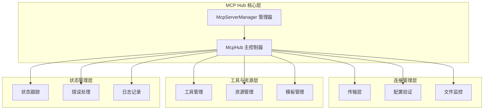
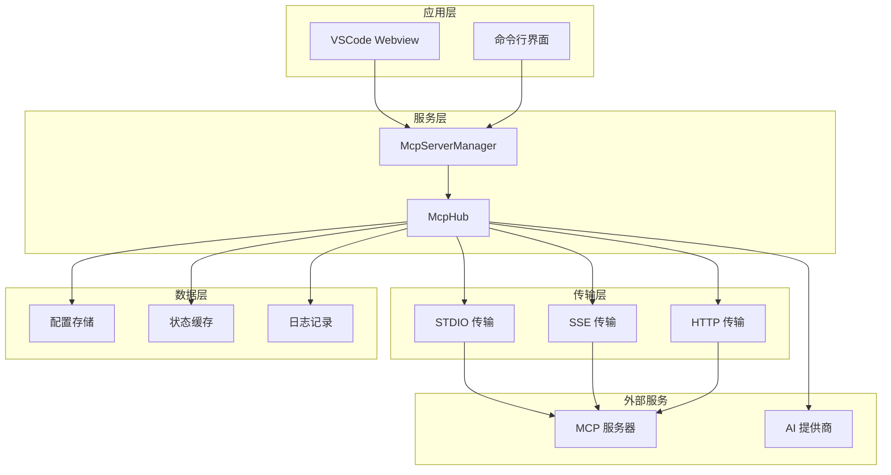
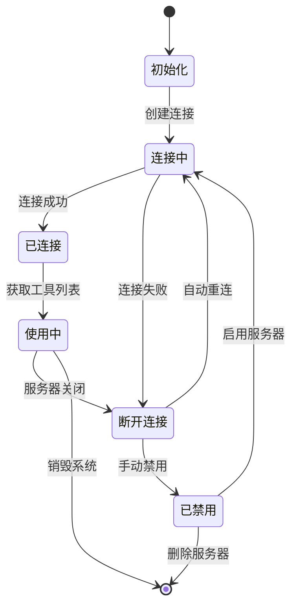
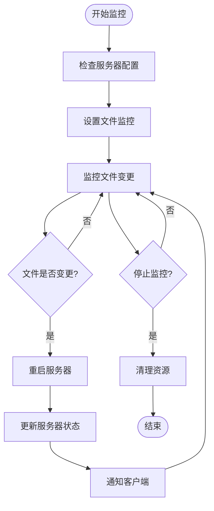
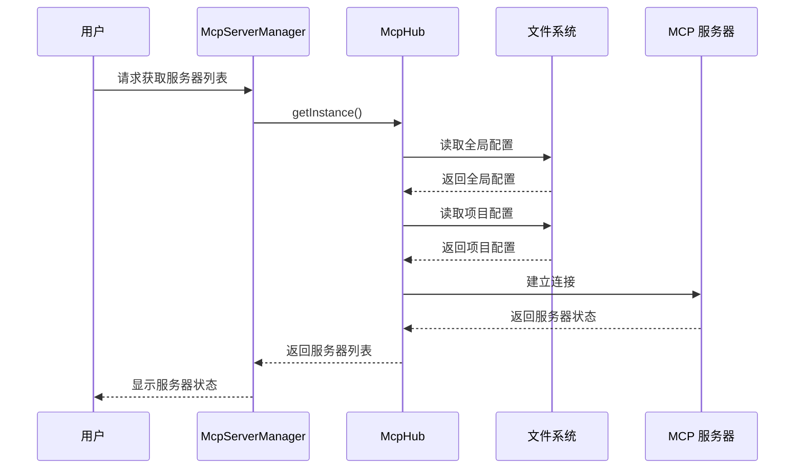
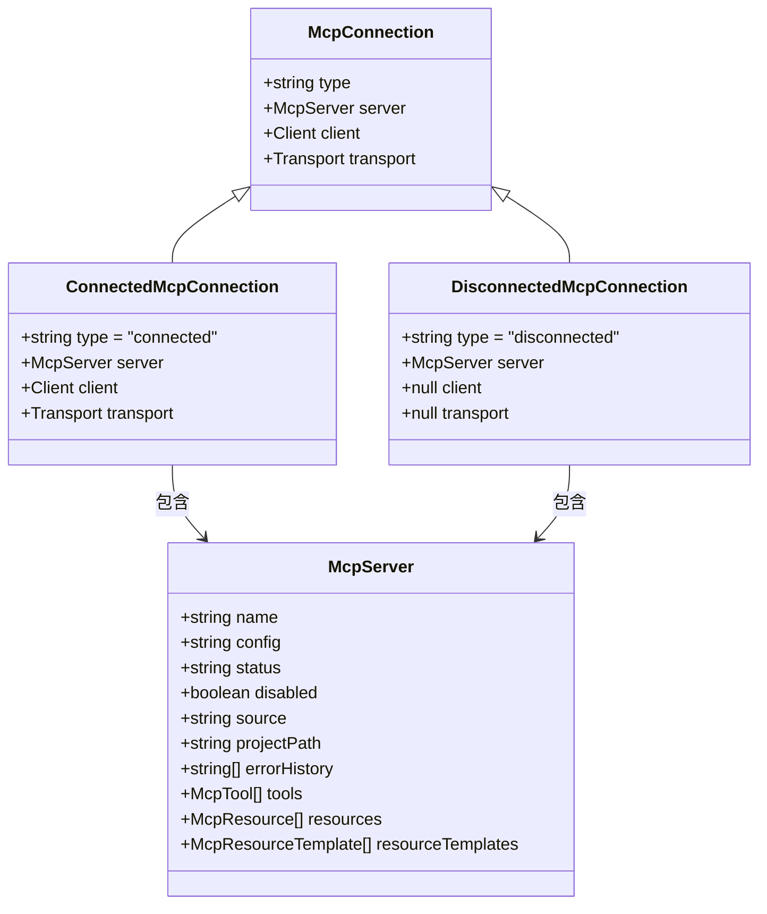
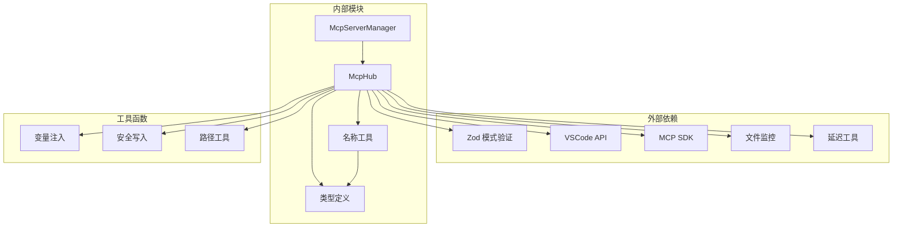

# MCP Hub 管理系统

<cite>
**本文档引用的文件**
- [McpHub.ts](file://src/services/mcp/McpHub.ts)
- [McpServerManager.ts](file://src/services/mcp/McpServerManager.ts)
- [mcp-name.ts](file://src/utils/mcp-name.ts)
- [index.ts](file://packages/types/src/index.ts)
</cite>

## 目录
1. [简介](#简介)
2. [项目结构](#项目结构)
3. [核心组件](#核心组件)
4. [架构概览](#架构概览)
5. [详细组件分析](#详细组件分析)
6. [依赖关系分析](#依赖关系分析)
7. [性能考虑](#性能考虑)
8. [故障排除指南](#故障排除指南)
9. [结论](#结论)

## 简介

MCP Hub 管理系统是基于 Model Context Protocol (MCP) 的多服务器管理系统，专为 VSCode 扩展环境设计。该系统提供了完整的 MCP 服务器生命周期管理、动态配置更新、实时状态监控和智能故障恢复功能。

系统支持三种连接方式：STDIO 进程连接、SSE（Server-Sent Events）流式连接和 Streamable HTTP 连接，实现了高度灵活的服务器发现和管理机制。通过智能的文件监控和自动重启机制，确保服务器集群的高可用性和稳定性。

## 项目结构

MCP Hub 系统采用模块化架构设计，主要包含以下核心模块：

**图表来源**
- [McpHub.ts:151-176](file://src/services/mcp/McpHub.ts#L151-L176)
- [McpServerManager.ts:9-54](file://src/services/mcp/McpServerManager.ts#L9-L54)

**章节来源**
- [McpHub.ts:151-1997](file://src/services/mcp/McpHub.ts#L151-L1997)
- [McpServerManager.ts:1-87](file://src/services/mcp/McpServerManager.ts#L1-87)

## 核心组件

### McpHub 主控制器

McpHub 是整个 MCP 管理系统的核心控制器，负责管理所有 MCP 服务器的生命周期。其主要职责包括：

- **服务器发现与注册**：自动扫描全局和项目级 MCP 配置文件
- **连接管理**：建立和维护与 MCP 服务器的连接
- **配置验证**：使用 Zod 模式验证确保配置的正确性
- **状态监控**：实时跟踪服务器状态变化
- **自动重启**：基于文件变更触发的智能重启机制

### McpServerManager 管理器

McpServerManager 作为单例管理器，确保在整个 VSCode 扩展环境中只运行一个 MCP Hub 实例：

- **单例模式实现**：线程安全的实例创建和管理
- **提供者注册**：跟踪多个 VSCode 提供者实例
- **状态通知**：向所有注册的提供者广播服务器状态变化
- **资源清理**：优雅地清理和释放系统资源

### 名称规范化工具

系统提供了完整的 MCP 名称处理工具集：

- **名称标准化**：确保 MCP 工具名称符合 API 要求
- **模糊匹配**：处理模型将连字符转换为下划线的情况
- **分隔符处理**：统一使用双连字符作为分隔符
- **长度限制**：遵循各 AI 提供商的 API 名称长度限制

**章节来源**
- [McpHub.ts:151-1997](file://src/services/mcp/McpHub.ts#L151-L1997)
- [McpServerManager.ts:1-87](file://src/services/mcp/McpServerManager.ts#L1-87)
- [mcp-name.ts:1-191](file://src/utils/mcp-name.ts#L1-L191)

## 架构概览

MCP Hub 系统采用分层架构设计，实现了高度解耦和可扩展的系统结构：

**图表来源**
- [McpHub.ts:656-897](file://src/services/mcp/McpHub.ts#L656-L897)
- [McpServerManager.ts:20-54](file://src/services/mcp/McpServerManager.ts#L20-L54)

系统架构的关键特性：

1. **多传输协议支持**：统一的抽象层支持三种不同的连接方式
2. **智能配置管理**：自动检测和应用配置变更
3. **实时状态同步**：双向状态同步确保客户端和服务器一致性
4. **故障隔离**：单个服务器故障不影响其他服务器运行

## 详细组件分析

### 服务器生命周期管理

MCP Hub 实现了完整的服务器生命周期管理，从初始化到销毁的每个阶段都有完善的处理机制：

**图表来源**
- [McpHub.ts:1110-1177](file://src/services/mcp/McpHub.ts#L1110-L1177)
- [McpHub.ts:1255-1295](file://src/services/mcp/McpHub.ts#L1255-L1295)

#### 连接建立流程

系统支持三种连接方式，每种都有特定的配置要求和错误处理机制：

1. **STDIO 连接**：适用于本地进程或脚本服务器
2. **SSE 连接**：适用于基于事件源的服务器
3. **HTTP 连接**：适用于标准 HTTP 接口的服务器

#### 配置验证机制

使用 Zod 模式验证确保配置的完整性和正确性：

- **字段完整性检查**：确保必需字段存在
- **类型验证**：验证字段类型和格式
- **逻辑一致性检查**：防止配置冲突
- **错误消息优化**：提供用户友好的错误信息

**章节来源**
- [McpHub.ts:216-274](file://src/services/mcp/McpHub.ts#L216-L274)
- [McpHub.ts:656-897](file://src/services/mcp/McpHub.ts#L656-L897)

### 进程监控与自动重启

系统实现了智能的进程监控和自动重启机制：

**图表来源**
- [McpHub.ts:1179-1240](file://src/services/mcp/McpHub.ts#L1179-L1240)
- [McpHub.ts:1255-1295](file://src/services/mcp/McpHub.ts#L1255-L1295)

#### 文件监控策略

系统支持多种文件监控方式：

- **自定义路径监控**：监控配置中指定的路径
- **构建文件监控**：监控 build/index.js 等关键文件
- **变更响应**：文件变更时自动触发服务器重启

#### 重启策略

智能的重启策略确保最小化服务中断：

- **状态保持**：重启前后保持服务器状态
- **配置验证**：重启前重新验证配置
- **渐进式重启**：避免同时重启所有服务器
- **错误恢复**：重启失败时进行错误恢复

**章节来源**
- [McpHub.ts:1179-1295](file://src/services/mcp/McpHub.ts#L1179-L1295)

### 服务器发现机制

MCP Hub 实现了智能的服务器发现机制，支持全局和项目级配置：

**图表来源**
- [McpServerManager.ts:20-54](file://src/services/mcp/McpServerManager.ts#L20-L54)
- [McpHub.ts:547-611](file://src/services/mcp/McpHub.ts#L547-L611)

#### 配置优先级

系统实现了清晰的配置优先级规则：

1. **项目级配置优先**：项目级配置覆盖全局配置
2. **名称去重**：相同名称的服务器以项目级为准
3. **动态更新**：配置变更时自动应用新设置

#### 实时状态同步

所有服务器状态变更都会实时同步到客户端：

- **状态变更通知**：服务器状态变化时立即通知
- **工具列表更新**：服务器能力变更时自动刷新
- **错误历史记录**：维护详细的错误历史信息

**章节来源**
- [McpHub.ts:454-477](file://src/services/mcp/McpHub.ts#L454-L477)
- [McpHub.ts:1367-1429](file://src/services/mcp/McpHub.ts#L1367-L1429)

### 通信协议与状态同步

系统实现了多种通信协议的支持和状态同步机制：

**图表来源**
- [McpHub.ts:44-59](file://src/services/mcp/McpHub.ts#L44-L59)
- [McpHub.ts:22-30](file://src/services/mcp/McpHub.ts#L22-L30)

#### 协议支持

系统支持三种主要的 MCP 通信协议：

1. **STDIO 协议**：本地进程间通信
2. **SSE 协议**：服务器推送事件
3. **HTTP 协议**：标准 HTTP 请求响应

#### 状态同步机制

实现双向状态同步确保系统一致性：

- **主动同步**：Hub 主动向客户端推送状态
- **被动同步**：客户端请求时返回最新状态
- **增量更新**：只同步发生变化的状态信息

**章节来源**
- [McpHub.ts:44-59](file://src/services/mcp/McpHub.ts#L44-L59)
- [McpHub.ts:1367-1429](file://src/services/mcp/McpHub.ts#L1367-L1429)

## 依赖关系分析

MCP Hub 系统的依赖关系体现了清晰的模块化设计：

**图表来源**
- [McpHub.ts:1-42](file://src/services/mcp/McpHub.ts#L1-L42)
- [McpServerManager.ts:1-4](file://src/services/mcp/McpServerManager.ts#L1-L4)

### 关键依赖特性

1. **类型安全**：使用 TypeScript 和 Zod 确保类型安全
2. **异步处理**：完全基于 Promise 和 async/await
3. **错误处理**：完善的错误捕获和处理机制
4. **资源管理**：自动化的资源清理和释放

**章节来源**
- [McpHub.ts:1-42](file://src/services/mcp/McpHub.ts#L1-L42)
- [McpServerManager.ts:1-87](file://src/services/mcp/McpServerManager.ts#L1-L87)

## 性能考虑

MCP Hub 系统在设计时充分考虑了性能优化：

### 内存管理
- **弱引用管理**：使用 WeakRef 避免循环引用
- **连接池优化**：复用已建立的连接
- **状态缓存**：缓存服务器状态减少重复查询

### 并发控制
- **初始化锁**：防止并发初始化多个实例
- **操作队列**：串行化敏感操作
- **超时控制**：避免长时间阻塞操作

### 资源优化
- **文件监控去重**：避免重复监控相同文件
- **网络连接复用**：复用 HTTP 连接
- **内存泄漏防护**：及时清理定时器和监听器

## 故障排除指南

### 常见问题诊断

#### 连接问题
1. **检查配置格式**：确保 MCP 配置文件格式正确
2. **验证服务器可达性**：确认目标服务器正在运行
3. **检查网络连接**：验证网络连接状态

#### 性能问题
1. **监控资源使用**：检查内存和 CPU 使用情况
2. **分析连接数**：避免过多并发连接
3. **优化配置**：调整超时和重试参数

#### 配置问题
1. **验证字段完整性**：确保所有必需字段都已设置
2. **检查权限设置**：验证执行权限和访问权限
3. **调试模式**：启用详细日志进行问题定位

**章节来源**
- [McpHub.ts:899-924](file://src/services/mcp/McpHub.ts#L899-L924)
- [McpHub.ts:1950-1995](file://src/services/mcp/McpHub.ts#L1950-L1995)

## 结论

MCP Hub 管理系统是一个功能完整、设计精良的多服务器管理解决方案。通过其模块化架构、智能的生命周期管理和强大的故障恢复机制，为 MCP 服务器的部署和管理提供了可靠的基础。

系统的主要优势包括：

1. **高度可扩展性**：支持多种连接协议和配置选项
2. **智能自动化**：自动发现、监控和重启机制
3. **强类型安全**：完整的 TypeScript 类型支持
4. **用户友好**：直观的配置界面和详细的错误反馈
5. **高性能**：优化的资源管理和并发处理

该系统为构建复杂的 MCP 生态系统奠定了坚实的基础，支持从个人开发到企业级部署的各种应用场景。