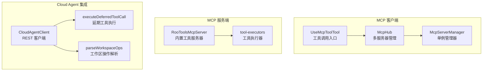
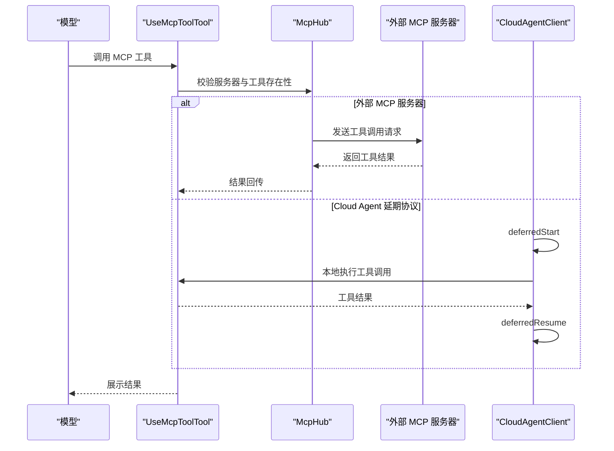
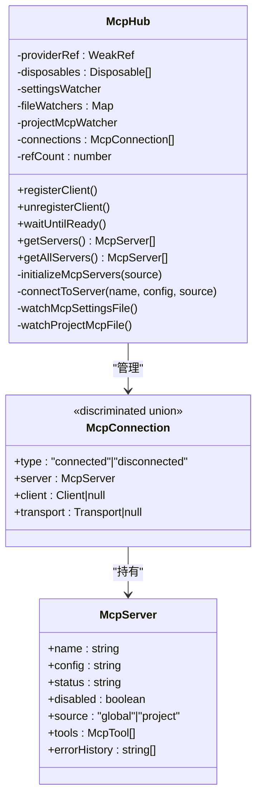
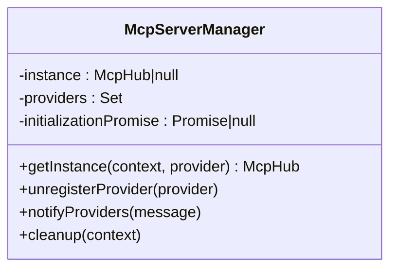
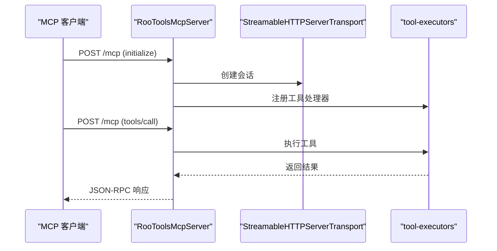
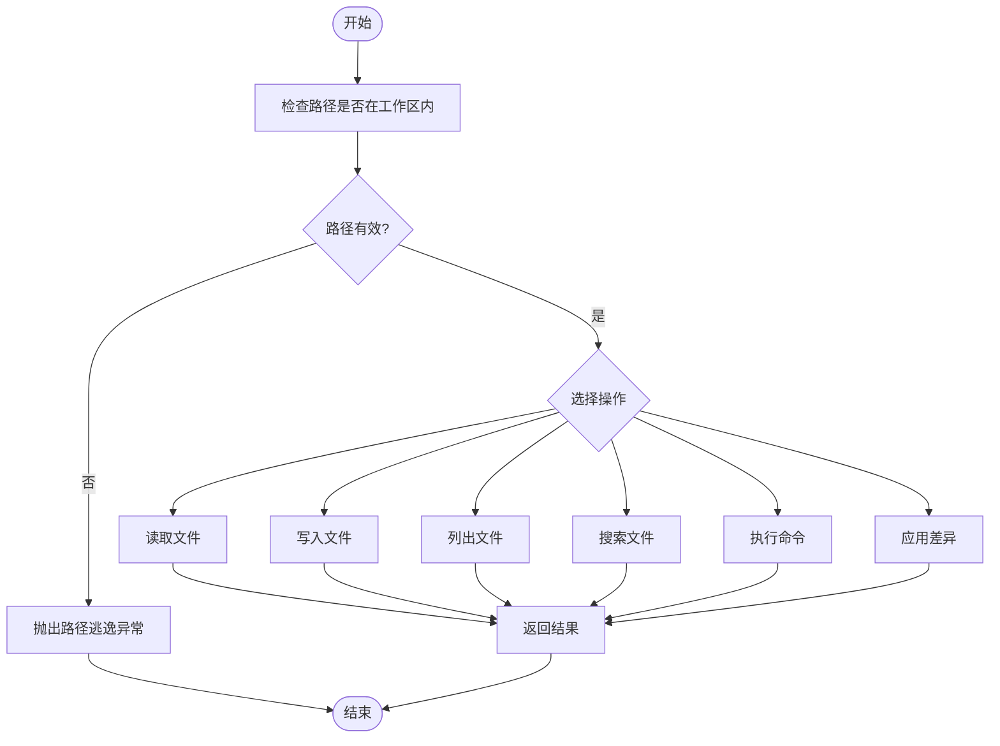
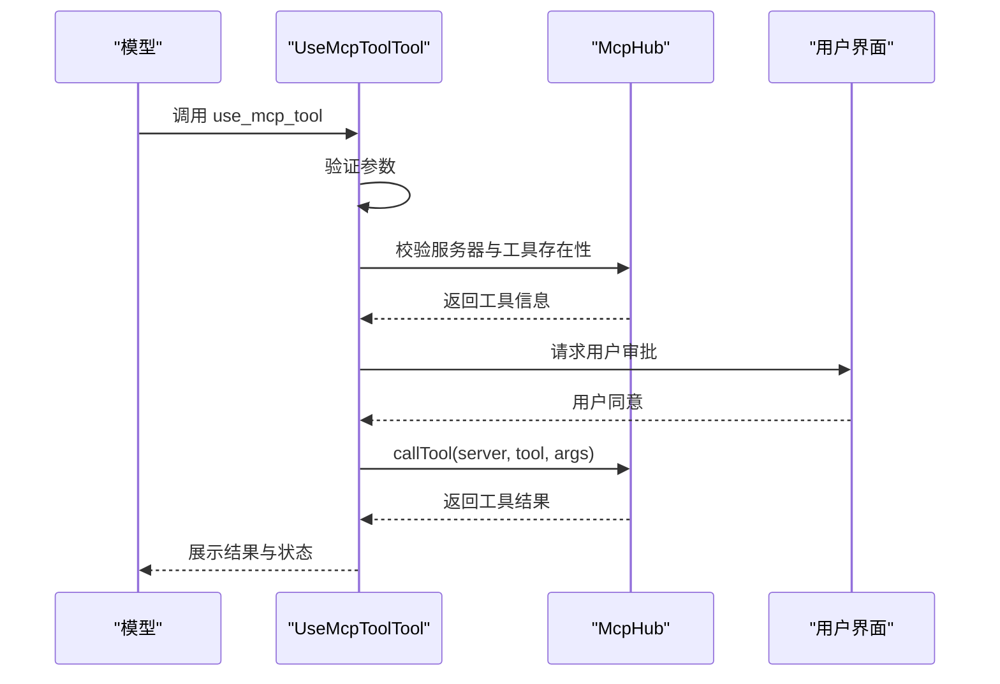
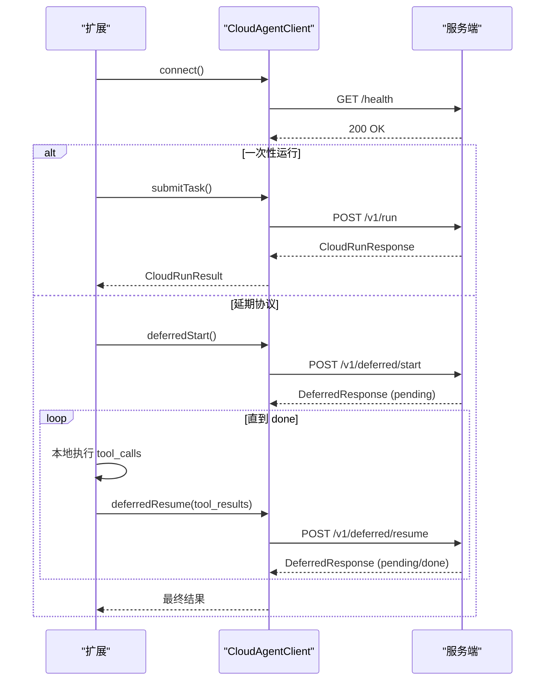
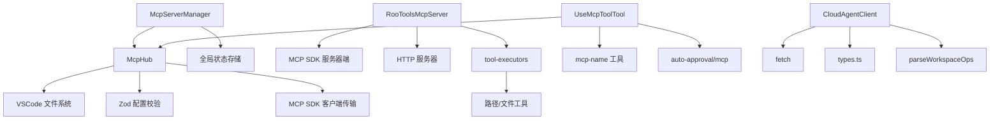

# MCP 协议支持系统

<cite>
**本文档引用的文件**
- [McpHub.ts](file://src/services/mcp/McpHub.ts)
- [McpServerManager.ts](file://src/services/mcp/McpServerManager.ts)
- [RooToolsMcpServer.ts](file://src/services/mcp-server/RooToolsMcpServer.ts)
- [tool-executors.ts](file://src/services/mcp-server/tool-executors.ts)
- [UseMcpToolTool.ts](file://src/core/tools/UseMcpToolTool.ts)
- [CloudAgentClient.ts](file://src/services/cloud-agent/CloudAgentClient.ts)
- [executeDeferredToolCall.ts](file://src/services/cloud-agent/executeDeferredToolCall.ts)
- [mcp.ts](file://src/core/auto-approval/mcp.ts)
- [cangjie-mcp.md](file://docs/cangjie-mcp.md)
- [cloud-agent-integration.md](file://docs/cloud-agent-integration.md)
- [mcp-name.ts](file://src/utils/mcp-name.ts)
- [globalFileNames.ts](file://src/shared/globalFileNames.ts)
- [cangjie-mcp.example.json](file://docs/examples/cangjie-mcp.example.json)
- [test-mcp-server.mjs](file://test-mcp-server.mjs)
- [types.ts](file://src/services/cloud-agent/types.ts)
- [parseWorkspaceOps.ts](file://src/services/cloud-agent/parseWorkspaceOps.ts)
</cite>

## 目录
1. [简介](#简介)
2. [项目结构](#项目结构)
3. [核心组件](#核心组件)
4. [架构总览](#架构总览)
5. [详细组件分析](#详细组件分析)
6. [依赖关系分析](#依赖关系分析)
7. [性能考虑](#性能考虑)
8. [故障排除指南](#故障排除指南)
9. [结论](#结论)
10. [附录](#附录)

## 简介
本文件为 NJUST AI CJ 扩展中的 MCP（Model Context Protocol）协议支持系统提供全面技术文档。系统涵盖 MCP 客户端与服务端两部分：客户端负责连接外部 MCP 服务器并暴露工具给模型调用；服务端提供内置工具集并通过 HTTP/SSE/流式 HTTP 传输协议对外提供服务。文档详细阐述了 MCP Hub 的多服务器管理、进程生命周期控制、工具暴露机制，以及与 Cloud Agent 的集成关系、延期协议的实现细节、工具调用的安全控制。同时提供开发自定义 MCP 工具、配置 MCP 服务器、处理工具调用的完整流程指导。

## 项目结构
MCP 支持系统主要分布在以下模块：
- 服务层：MCP Hub、MCP 服务器管理器、内置 MCP 工具服务器
- 工具执行层：工具执行器（文件读写、搜索、命令执行、差异应用）
- 工具层：UseMcpToolTool（模型调用 MCP 工具的入口）
- Cloud Agent 集成：REST 客户端、延期协议执行器、工作区操作解析
- 工具命名与配置：工具名称规范化、全局文件名常量、示例配置
- 文档与测试：接入指南、集成规范、测试脚本

**图表来源**
- [McpHub.ts:151-176](file://src/services/mcp/McpHub.ts#L151-L176)
- [McpServerManager.ts:9-54](file://src/services/mcp/McpServerManager.ts#L9-L54)
- [RooToolsMcpServer.ts:27-44](file://src/services/mcp-server/RooToolsMcpServer.ts#L27-L44)
- [tool-executors.ts:28-207](file://src/services/mcp-server/tool-executors.ts#L28-L207)
- [UseMcpToolTool.ts:27-82](file://src/core/tools/UseMcpToolTool.ts#L27-L82)
- [CloudAgentClient.ts:43-141](file://src/services/cloud-agent/CloudAgentClient.ts#L43-L141)
- [executeDeferredToolCall.ts:15-82](file://src/services/cloud-agent/executeDeferredToolCall.ts#L15-L82)
- [parseWorkspaceOps.ts:41-61](file://src/services/cloud-agent/parseWorkspaceOps.ts#L41-L61)

**章节来源**
- [McpHub.ts:151-176](file://src/services/mcp/McpHub.ts#L151-L176)
- [McpServerManager.ts:9-54](file://src/services/mcp/McpServerManager.ts#L9-L54)
- [RooToolsMcpServer.ts:27-44](file://src/services/mcp-server/RooToolsMcpServer.ts#L27-L44)
- [tool-executors.ts:28-207](file://src/services/mcp-server/tool-executors.ts#L28-L207)
- [UseMcpToolTool.ts:27-82](file://src/core/tools/UseMcpToolTool.ts#L27-L82)
- [CloudAgentClient.ts:43-141](file://src/services/cloud-agent/CloudAgentClient.ts#L43-L141)
- [executeDeferredToolCall.ts:15-82](file://src/services/cloud-agent/executeDeferredToolCall.ts#L15-L82)
- [parseWorkspaceOps.ts:41-61](file://src/services/cloud-agent/parseWorkspaceOps.ts#L41-L61)

## 核心组件
- **McpHub**：MCP 客户端的核心管理器，负责服务器配置加载、连接建立与维护、文件监控、去重合并（项目级优先）、错误历史记录与通知。
- **McpServerManager**：单例管理器，确保全局仅有一个 McpHub 实例，提供客户端注册/注销、实例清理、跨视图通知。
- **RooToolsMcpServer**：内置 MCP 服务端，提供文件读取、写入、列出、搜索、命令执行、差异应用等工具，并实现 HTTP/SSE/流式 HTTP 传输、会话管理、鉴权与 CORS。
- **tool-executors**：工具执行器集合，包含路径边界检查、文件操作、搜索、命令执行、差异应用等，提供安全的本地工具执行。
- **UseMcpToolTool**：模型调用 MCP 工具的入口工具，负责参数验证、工具存在性检查、用户审批、结果处理与状态上报。
- **CloudAgentClient**：Cloud Agent REST 客户端，支持健康检查、一次性运行、编译反馈、延期协议（start/resume）。
- **executeDeferredToolCall**：在扩展本地执行单个延期工具调用，返回 MCP 形状的结果。
- **parseWorkspaceOps**：解析并校验服务端返回的结构化工作区操作，确保安全与限额。

**章节来源**
- [McpHub.ts:151-176](file://src/services/mcp/McpHub.ts#L151-L176)
- [McpServerManager.ts:9-54](file://src/services/mcp/McpServerManager.ts#L9-L54)
- [RooToolsMcpServer.ts:27-44](file://src/services/mcp-server/RooToolsMcpServer.ts#L27-L44)
- [tool-executors.ts:28-207](file://src/services/mcp-server/tool-executors.ts#L28-L207)
- [UseMcpToolTool.ts:27-82](file://src/core/tools/UseMcpToolTool.ts#L27-L82)
- [CloudAgentClient.ts:43-141](file://src/services/cloud-agent/CloudAgentClient.ts#L43-L141)
- [executeDeferredToolCall.ts:15-82](file://src/services/cloud-agent/executeDeferredToolCall.ts#L15-L82)
- [parseWorkspaceOps.ts:41-61](file://src/services/cloud-agent/parseWorkspaceOps.ts#L41-L61)

## 架构总览
系统采用“客户端-服务端”双通道架构：
- 外部 MCP 客户端：McpHub 监控全局与项目级 mcp.json，按类型（stdio/SSE/streamable-http）连接外部 MCP 服务器，暴露工具给模型调用。
- 内置 MCP 服务端：RooToolsMcpServer 提供一组安全工具，通过 HTTP 会话与传输协议与客户端通信，支持鉴权与 CORS。
- Cloud Agent 集成：CloudAgentClient 支持一次性运行与延期协议，配合 executeDeferredToolCall 在本地执行工具调用，parseWorkspaceOps 校验并应用结构化工作区操作。

**图表来源**
- [UseMcpToolTool.ts:294-351](file://src/core/tools/UseMcpToolTool.ts#L294-L351)
- [McpHub.ts:656-800](file://src/services/mcp/McpHub.ts#L656-L800)
- [CloudAgentClient.ts:306-333](file://src/services/cloud-agent/CloudAgentClient.ts#L306-L333)
- [executeDeferredToolCall.ts:15-82](file://src/services/cloud-agent/executeDeferredToolCall.ts#L15-L82)

## 详细组件分析

### McpHub 组件分析
McpHub 是 MCP 客户端的核心，负责：
- 配置文件监控与热更新：全局与项目级 mcp.json 自动监听，带防抖处理，避免频繁重启。
- 服务器连接管理：支持 stdio、SSE、streamable-http 三种传输类型，自动注入变量、错误处理与状态跟踪。
- 去重与优先级：项目级服务器优先于全局服务器，避免重复。
- 文件监控：为启用的服务器设置文件监控，支持路径变化触发重启。
- 通知机制：通过 ClineProvider 通知前端服务器状态变化。

**图表来源**
- [McpHub.ts:44-99](file://src/services/mcp/McpHub.ts#L44-L99)
- [McpHub.ts:151-176](file://src/services/mcp/McpHub.ts#L151-L176)

**章节来源**
- [McpHub.ts:151-176](file://src/services/mcp/McpHub.ts#L151-L176)
- [McpHub.ts:216-274](file://src/services/mcp/McpHub.ts#L216-L274)
- [McpHub.ts:656-800](file://src/services/mcp/McpHub.ts#L656-L800)

### McpServerManager 组件分析
McpServerManager 保证全局单例的 McpHub 实例，提供：
- 线程安全的初始化锁，避免并发创建。
- Provider 注册与注销，跨视图通知。
- 清理与实例销毁。

**图表来源**
- [McpServerManager.ts:9-54](file://src/services/mcp/McpServerManager.ts#L9-L54)

**章节来源**
- [McpServerManager.ts:9-54](file://src/services/mcp/McpServerManager.ts#L9-L54)

### RooToolsMcpServer 组件分析
内置 MCP 服务端，提供安全工具集：
- 工具定义：read_file、write_to_file、list_files、search_files、execute_command、apply_diff。
- 传输协议：HTTP 服务器，支持会话初始化、GET/DELETE 请求处理、流式 HTTP 传输。
- 安全控制：非本地绑定需鉴权；路径边界检查；命令白名单/黑名单；超时控制。
- 会话管理：基于 mcp-session-id 的会话生命周期管理。

**图表来源**
- [RooToolsMcpServer.ts:284-302](file://src/services/mcp-server/RooToolsMcpServer.ts#L284-L302)
- [RooToolsMcpServer.ts:44-161](file://src/services/mcp-server/RooToolsMcpServer.ts#L44-L161)
- [tool-executors.ts:28-207](file://src/services/mcp-server/tool-executors.ts#L28-L207)

**章节来源**
- [RooToolsMcpServer.ts:27-44](file://src/services/mcp-server/RooToolsMcpServer.ts#L27-L44)
- [RooToolsMcpServer.ts:168-235](file://src/services/mcp-server/RooToolsMcpServer.ts#L168-L235)
- [RooToolsMcpServer.ts:274-337](file://src/services/mcp-server/RooToolsMcpServer.ts#L274-L337)

### tool-executors 工具执行器分析
工具执行器提供安全的本地工具执行：
- 路径边界检查：防止路径逃逸到工作区之外。
- 文件操作：读取、写入、列出、搜索。
- 命令执行：跨平台 shell、超时控制、标准输出/错误收集。
- 差异应用：基于 MultiSearchReplaceDiffStrategy 的 SEARCH/REPLACE 差异应用。

**图表来源**
- [tool-executors.ts:13-20](file://src/services/mcp-server/tool-executors.ts#L13-L20)
- [tool-executors.ts:116-180](file://src/services/mcp-server/tool-executors.ts#L116-L180)
- [tool-executors.ts:187-207](file://src/services/mcp-server/tool-executors.ts#L187-L207)

**章节来源**
- [tool-executors.ts:13-20](file://src/services/mcp-server/tool-executors.ts#L13-L20)
- [tool-executors.ts:116-180](file://src/services/mcp-server/tool-executors.ts#L116-L180)
- [tool-executors.ts:187-207](file://src/services/mcp-server/tool-executors.ts#L187-L207)

### UseMcpToolTool 工具调用分析
UseMcpToolTool 是模型调用 MCP 工具的入口：
- 参数验证：server_name、tool_name、arguments 结构校验。
- 工具存在性检查：通过 McpHub 获取服务器与工具列表，模糊匹配处理模型将连字符转换为下划线的情况。
- 用户审批：构造 ClineAskUseMcpServer 消息，等待用户确认。
- 执行与结果处理：调用 McpHub.callTool，处理结果并上报执行状态。

**图表来源**
- [UseMcpToolTool.ts:30-82](file://src/core/tools/UseMcpToolTool.ts#L30-L82)
- [UseMcpToolTool.ts:141-249](file://src/core/tools/UseMcpToolTool.ts#L141-L249)
- [UseMcpToolTool.ts:294-351](file://src/core/tools/UseMcpToolTool.ts#L294-L351)

**章节来源**
- [UseMcpToolTool.ts:27-82](file://src/core/tools/UseMcpToolTool.ts#L27-L82)
- [UseMcpToolTool.ts:141-249](file://src/core/tools/UseMcpToolTool.ts#L141-L249)
- [UseMcpToolTool.ts:294-351](file://src/core/tools/UseMcpToolTool.ts#L294-L351)

### Cloud Agent 集成分析
Cloud Agent 提供两种协议模式：
- 一次性运行：POST /v1/run，返回结构化结果与可选 workspace_ops。
- 延期协议：POST /v1/deferred/start，返回需要扩展本地执行的工具调用；扩展执行后 POST /v1/deferred/resume，直至 status="done"。

**图表来源**
- [CloudAgentClient.ts:118-141](file://src/services/cloud-agent/CloudAgentClient.ts#L118-L141)
- [CloudAgentClient.ts:143-206](file://src/services/cloud-agent/CloudAgentClient.ts#L143-L206)
- [CloudAgentClient.ts:306-333](file://src/services/cloud-agent/CloudAgentClient.ts#L306-L333)

**章节来源**
- [CloudAgentClient.ts:118-141](file://src/services/cloud-agent/CloudAgentClient.ts#L118-L141)
- [CloudAgentClient.ts:143-206](file://src/services/cloud-agent/CloudAgentClient.ts#L143-L206)
- [CloudAgentClient.ts:306-333](file://src/services/cloud-agent/CloudAgentClient.ts#L306-L333)
- [executeDeferredToolCall.ts:15-82](file://src/services/cloud-agent/executeDeferredToolCall.ts#L15-L82)
- [parseWorkspaceOps.ts:41-61](file://src/services/cloud-agent/parseWorkspaceOps.ts#L41-L61)

## 依赖关系分析
- McpHub 依赖 VSCode 文件系统监听、Zod 配置校验、MCP SDK 客户端传输（stdio/SSE/HTTP）。
- McpServerManager 依赖弱引用 Provider 与全局状态存储。
- RooToolsMcpServer 依赖 MCP SDK 服务器端、HTTP 服务器、工具执行器。
- UseMcpToolTool 依赖 McpHub、工具名称规范化、自动审批策略。
- CloudAgentClient 依赖 fetch、Zod 校验、工作区操作解析。
- 工具名称规范化与全局文件名常量为跨模块共享工具。

**图表来源**
- [McpHub.ts:1-42](file://src/services/mcp/McpHub.ts#L1-L42)
- [McpServerManager.ts:1-13](file://src/services/mcp/McpServerManager.ts#L1-L13)
- [RooToolsMcpServer.ts:1-8](file://src/services/mcp-server/RooToolsMcpServer.ts#L1-L8)
- [UseMcpToolTool.ts:1-10](file://src/core/tools/UseMcpToolTool.ts#L1-L10)
- [CloudAgentClient.ts:1-12](file://src/services/cloud-agent/CloudAgentClient.ts#L1-L12)
- [mcp-name.ts:1-191](file://src/utils/mcp-name.ts#L1-L191)
- [globalFileNames.ts:1-10](file://src/shared/globalFileNames.ts#L1-L10)

**章节来源**
- [McpHub.ts:1-42](file://src/services/mcp/McpHub.ts#L1-L42)
- [McpServerManager.ts:1-13](file://src/services/mcp/McpServerManager.ts#L1-L13)
- [RooToolsMcpServer.ts:1-8](file://src/services/mcp-server/RooToolsMcpServer.ts#L1-L8)
- [UseMcpToolTool.ts:1-10](file://src/core/tools/UseMcpToolTool.ts#L1-L10)
- [CloudAgentClient.ts:1-12](file://src/services/cloud-agent/CloudAgentClient.ts#L1-L12)
- [mcp-name.ts:1-191](file://src/utils/mcp-name.ts#L1-L191)
- [globalFileNames.ts:1-10](file://src/shared/globalFileNames.ts#L1-L10)

## 性能考虑
- 配置文件监听防抖：500ms 防抖减少频繁重启。
- 连接超时与错误历史：避免无限等待，记录错误便于诊断。
- 工具执行超时：命令执行默认 30 秒，可配置。
- 会话复用：HTTP 传输基于 mcp-session-id，避免重复初始化。
- 工作区操作限额：最多 50 条操作，单条路径与内容长度限制，防止过大负载。

[本节为通用性能讨论，无需特定文件来源]

## 故障排除指南
- MCP 服务器无法连接
  - 检查 mcp.json 配置语法与字段完整性。
  - 查看输出面板 MCP 相关日志。
  - 确认传输类型与字段匹配（stdio 需 command；SSE/HTTP 需 url）。
- 工具调用失败
  - 确认服务器名称与工具名称存在且启用。
  - 检查工具参数结构与必填字段。
  - 查看工具执行器错误（路径越界、命令权限、超时）。
- Cloud Agent 延期协议问题
  - 确认 /health 成功。
  - 检查 deferredStart 返回的 tool_calls 与 arguments。
  - 本地执行失败时查看 executeDeferredToolCall 返回的 is_error 与内容。
- 安全与鉴权
  - 非本地绑定需设置 authToken。
  - 检查 CORS 头与 Authorization 头。

**章节来源**
- [McpHub.ts:216-274](file://src/services/mcp/McpHub.ts#L216-L274)
- [UseMcpToolTool.ts:141-249](file://src/core/tools/UseMcpToolTool.ts#L141-L249)
- [CloudAgentClient.ts:118-141](file://src/services/cloud-agent/CloudAgentClient.ts#L118-L141)
- [executeDeferredToolCall.ts:15-82](file://src/services/cloud-agent/executeDeferredToolCall.ts#L15-L82)
- [RooToolsMcpServer.ts:168-176](file://src/services/mcp-server/RooToolsMcpServer.ts#L168-L176)

## 结论
本 MCP 协议支持系统提供了完整的客户端与服务端能力：既能连接外部 MCP 服务器以扩展工具集，又能在本地提供安全可控的工具服务。通过严格的路径边界检查、鉴权与 CORS、超时控制与错误历史记录，系统在功能与安全性之间取得平衡。与 Cloud Agent 的集成进一步增强了远程协作与自动化编排能力。建议在生产环境中启用鉴权、合理配置超时与限额，并通过示例配置与测试脚本快速验证部署。

[本节为总结性内容，无需特定文件来源]

## 附录

### MCP 工具开发指南
- 自定义工具：在 RooToolsMcpServer 中通过 server.tool(name, description, paramsSchema, handler) 添加新工具。
- 参数校验：使用 Zod schema 定义参数结构，确保类型安全。
- 执行器：将复杂逻辑封装到 tool-executors，保持工具处理器简洁。
- 安全控制：始终进行路径边界检查与命令白名单/黑名单过滤。

**章节来源**
- [RooToolsMcpServer.ts:44-161](file://src/services/mcp-server/RooToolsMcpServer.ts#L44-L161)
- [tool-executors.ts:13-20](file://src/services/mcp-server/tool-executors.ts#L13-L20)

### MCP 服务器配置指南
- 全局配置：扩展设置目录下的 mcp_settings.json。
- 项目配置：工作区根目录 .njust_ai/mcp.json，扩展自动监听。
- 配置格式：mcpServers 对象，键为服务器显示名称，值为配置对象（type、command/args/env 或 url/headers）。

**章节来源**
- [cangjie-mcp.md:17-45](file://docs/cangjie-mcp.md#L17-L45)
- [cangjie-mcp.md:47-87](file://docs/cangjie-mcp.md#L47-L87)
- [cangjie-mcp.example.json:1-20](file://docs/examples/cangjie-mcp.example.json#L1-L20)
- [globalFileNames.ts:4-4](file://src/shared/globalFileNames.ts#L4-L4)

### 工具调用流程示例
- 使用 UseMcpToolTool：提供 server_name、tool_name、arguments，等待用户审批后执行。
- 外部 MCP：通过 McpHub 连接外部服务器，调用 tools/call。
- 内置 MCP：通过 HTTP 与会话 ID 交互，执行工具并返回结果。

**章节来源**
- [UseMcpToolTool.ts:30-82](file://src/core/tools/UseMcpToolTool.ts#L30-L82)
- [McpHub.ts:656-800](file://src/services/mcp/McpHub.ts#L656-L800)
- [RooToolsMcpServer.ts:274-337](file://src/services/mcp-server/RooToolsMcpServer.ts#L274-L337)

### 测试与调试
- 内置 MCP 服务器测试：使用 test-mcp-server.mjs 脚本进行 initialize、list tools、tools/call 等测试。
- Cloud Agent 本地联调：启动 mock 服务端，配置 serverUrl 与可选 API Key，使用 Cloud Agent 模式进行测试。

**章节来源**
- [test-mcp-server.mjs:85-179](file://test-mcp-server.mjs#L85-L179)
- [cloud-agent-integration.md:330-338](file://docs/cloud-agent-integration.md#L330-L338)