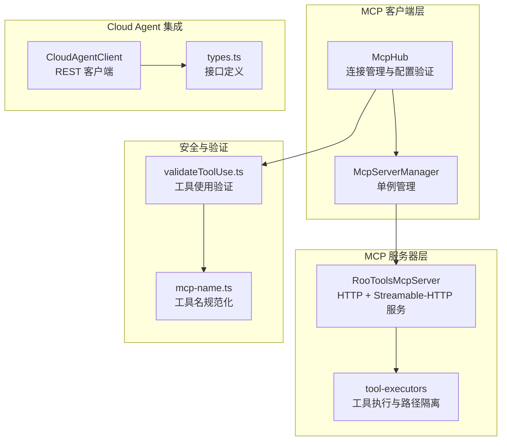
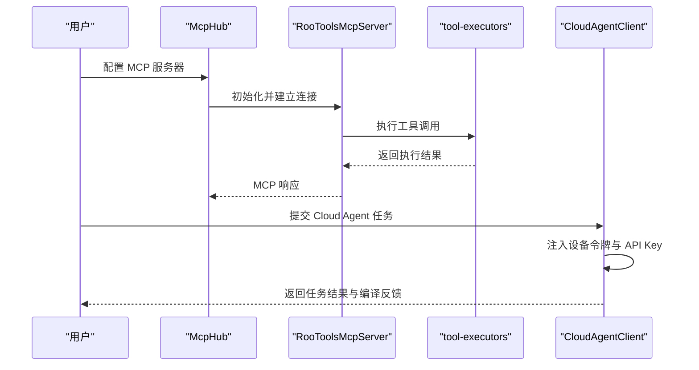
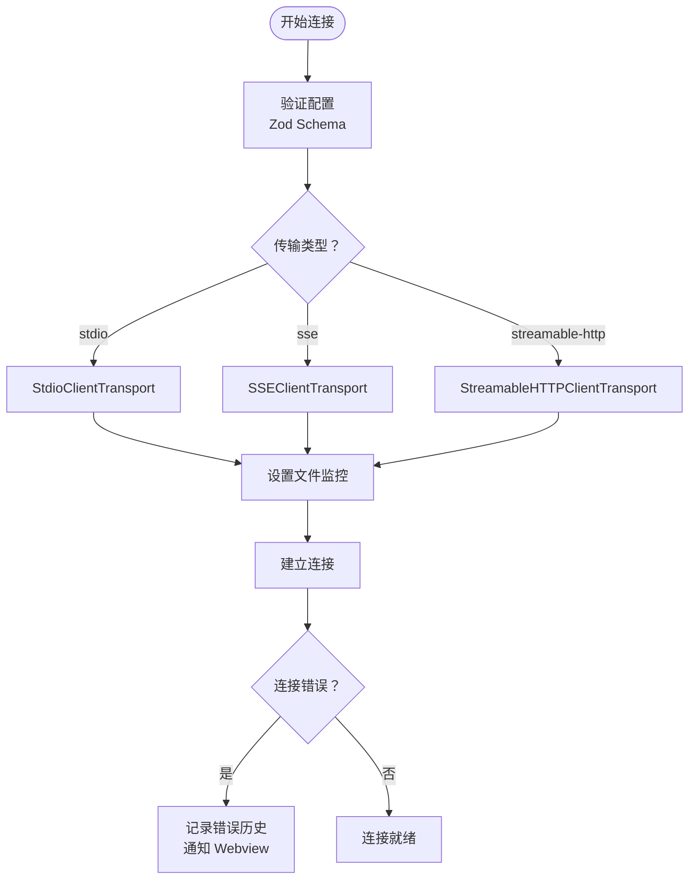
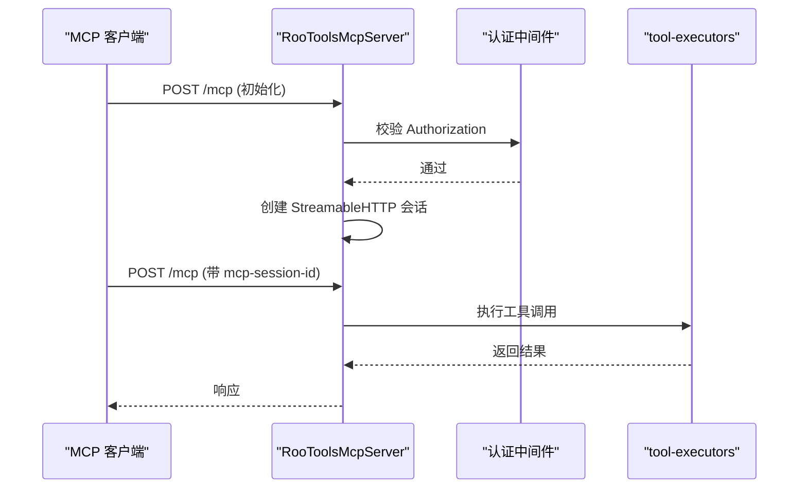
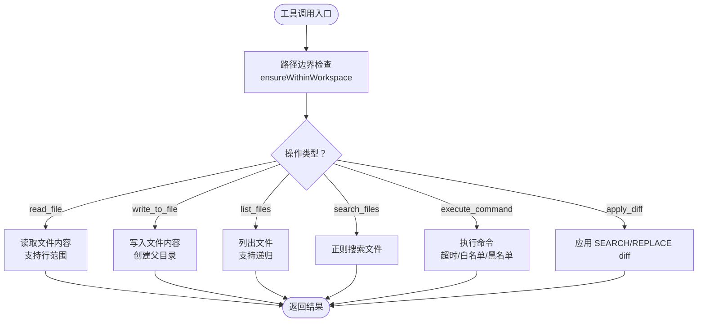
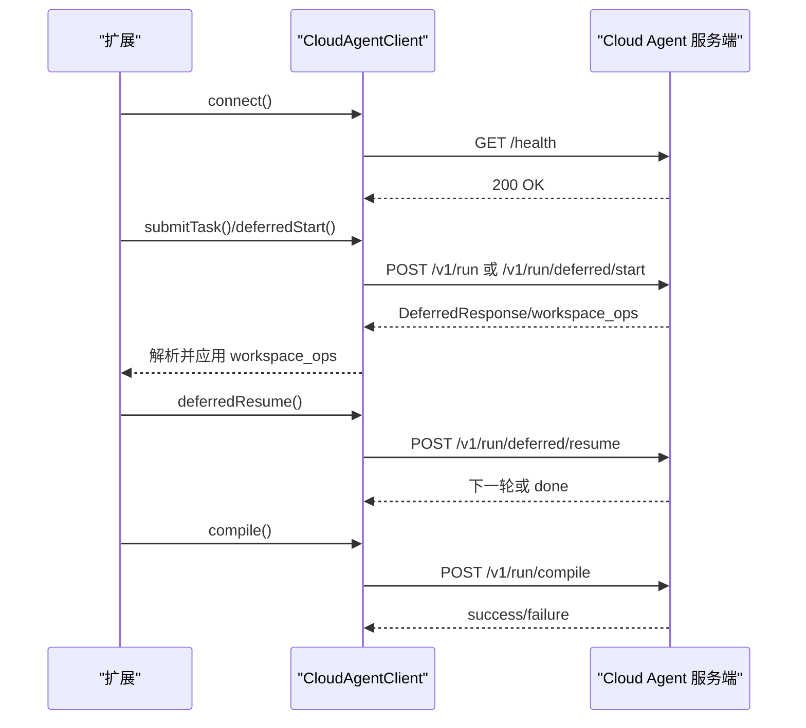
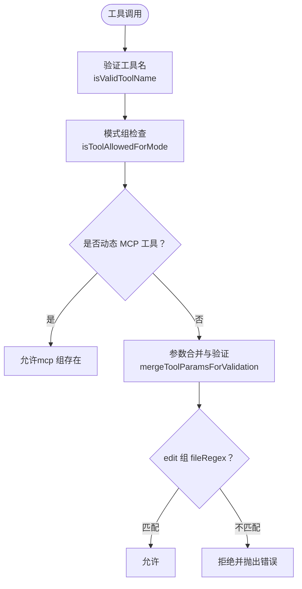
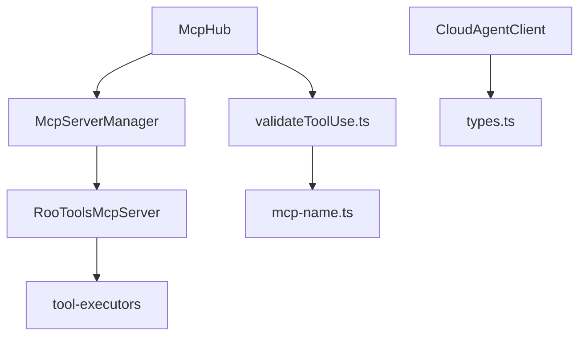

# MCP 安全认证体系

<cite>
**本文档引用的文件**
- [McpHub.ts](file://src/services/mcp/McpHub.ts)
- [McpServerManager.ts](file://src/services/mcp/McpServerManager.ts)
- [RooToolsMcpServer.ts](file://src/services/mcp-server/RooToolsMcpServer.ts)
- [tool-executors.ts](file://src/services/mcp-server/tool-executors.ts)
- [CloudAgentClient.ts](file://src/services/cloud-agent/CloudAgentClient.ts)
- [types.ts](file://src/services/cloud-agent/types.ts)
- [validateToolUse.ts](file://src/core/tools/validateToolUse.ts)
- [mcp-name.ts](file://src/utils/mcp-name.ts)
- [cangjie-mcp.md](file://docs/cangjie-mcp.md)
- [cloud-agent-integration.md](file://docs/cloud-agent-integration.md)
</cite>

## 目录
1. [简介](#简介)
2. [项目结构](#项目结构)
3. [核心组件](#核心组件)
4. [架构总览](#架构总览)
5. [详细组件分析](#详细组件分析)
6. [依赖关系分析](#依赖关系分析)
7. [性能考虑](#性能考虑)
8. [故障排除指南](#故障排除指南)
9. [结论](#结论)
10. [附录](#附录)

## 简介
本文件为 NJUST AI Cangjie 扩展的 MCP（Model Context Protocol）安全认证体系提供全面技术文档。重点涵盖：
- MCP 协议的安全机制与身份验证流程
- 访问控制策略与工具调用安全检查
- 与 Cloud Agent 的安全集成与远程工具调用认证
- 数据传输加密方案与审计日志
- 安全配置选项、威胁防护措施与最佳实践

## 项目结构
围绕 MCP 安全认证的关键模块分布如下：
- MCP 客户端与服务器管理：McpHub、McpServerManager、RooToolsMcpServer
- 工具执行与资源隔离：tool-executors
- Cloud Agent 安全集成：CloudAgentClient、types
- 工具使用验证与访问控制：validateToolUse、mcp-name
- 文档与配置：cangjie-mcp.md、cloud-agent-integration.md

**图表来源**
- [McpHub.ts:151-176](file://src/services/mcp/McpHub.ts#L151-L176)
- [McpServerManager.ts:9-54](file://src/services/mcp/McpServerManager.ts#L9-L54)
- [RooToolsMcpServer.ts:27-43](file://src/services/mcp-server/RooToolsMcpServer.ts#L27-L43)
- [tool-executors.ts:1-208](file://src/services/mcp-server/tool-executors.ts#L1-L208)
- [CloudAgentClient.ts:43-59](file://src/services/cloud-agent/CloudAgentClient.ts#L43-L59)
- [types.ts:1-102](file://src/services/cloud-agent/types.ts#L1-L102)
- [validateToolUse.ts:57-88](file://src/core/tools/validateToolUse.ts#L57-L88)
- [mcp-name.ts:1-191](file://src/utils/mcp-name.ts#L1-L191)

**章节来源**
- [McpHub.ts:151-176](file://src/services/mcp/McpHub.ts#L151-L176)
- [McpServerManager.ts:9-54](file://src/services/mcp/McpServerManager.ts#L9-L54)
- [RooToolsMcpServer.ts:27-43](file://src/services/mcp-server/RooToolsMcpServer.ts#L27-L43)
- [tool-executors.ts:1-208](file://src/services/mcp-server/tool-executors.ts#L1-L208)
- [CloudAgentClient.ts:43-59](file://src/services/cloud-agent/CloudAgentClient.ts#L43-L59)
- [types.ts:1-102](file://src/services/cloud-agent/types.ts#L1-L102)
- [validateToolUse.ts:57-88](file://src/core/tools/validateToolUse.ts#L57-L88)
- [mcp-name.ts:1-191](file://src/utils/mcp-name.ts#L1-L191)

## 核心组件
- McpHub：负责 MCP 服务器配置加载、连接生命周期管理、错误记录与通知、文件监控与热重载。
- McpServerManager：提供 MCP 服务器实例的单例管理，确保跨 Webview 的一致性与资源释放。
- RooToolsMcpServer：内置 MCP 服务端，支持 Streamable-HTTP 传输，提供文件读写、命令执行、搜索等工具，并实施严格的路径隔离与命令白/黑名单策略。
- tool-executors：工具执行器，所有文件操作均进行工作区边界检查，防止路径逃逸；命令执行支持超时与白/黑名单策略。
- CloudAgentClient：Cloud Agent REST 客户端，实现健康检查、任务提交、编译反馈循环与延迟执行协议，统一注入设备令牌与 API Key。
- validateToolUse：工具使用验证，基于模式组与参数进行访问控制，支持 MCP 工具动态授权。
- mcp-name：MCP 工具名规范化与匹配，确保跨模型的工具名兼容性。

**章节来源**
- [McpHub.ts:151-176](file://src/services/mcp/McpHub.ts#L151-L176)
- [McpServerManager.ts:9-54](file://src/services/mcp/McpServerManager.ts#L9-L54)
- [RooToolsMcpServer.ts:27-43](file://src/services/mcp-server/RooToolsMcpServer.ts#L27-L43)
- [tool-executors.ts:1-208](file://src/services/mcp-server/tool-executors.ts#L1-L208)
- [CloudAgentClient.ts:43-59](file://src/services/cloud-agent/CloudAgentClient.ts#L43-L59)
- [validateToolUse.ts:57-88](file://src/core/tools/validateToolUse.ts#L57-L88)
- [mcp-name.ts:1-191](file://src/utils/mcp-name.ts#L1-L191)

## 架构总览
MCP 安全认证体系采用“客户端-服务器-工具执行器”三层架构，结合 Cloud Agent REST 协议与本地工具执行，形成完整的安全闭环。

**图表来源**
- [McpHub.ts:656-800](file://src/services/mcp/McpHub.ts#L656-L800)
- [RooToolsMcpServer.ts:168-235](file://src/services/mcp-server/RooToolsMcpServer.ts#L168-L235)
- [tool-executors.ts:116-180](file://src/services/mcp-server/tool-executors.ts#L116-L180)
- [CloudAgentClient.ts:96-105](file://src/services/cloud-agent/CloudAgentClient.ts#L96-L105)

## 详细组件分析

### MCP 客户端安全连接管理（McpHub）
- 配置验证与错误处理：使用 Zod Schema 对服务器配置进行严格校验，支持 stdio、SSE、Streamable-HTTP 三种类型，并提供清晰的错误信息。
- 文件监控与热重载：监听全局与项目级 mcp_settings.json 与 .njust_ai/mcp.json 的变更，500ms 防抖处理，避免频繁重启。
- 连接状态管理：维护连接集合，支持断线重连与占位连接（禁用原因：全局禁用或服务器禁用）。
- 传输层错误捕获：捕获 stderr 输出，区分 INFO 与 ERROR 日志，记录错误历史并通知 Webview。

**图表来源**
- [McpHub.ts:216-274](file://src/services/mcp/McpHub.ts#L216-L274)
- [McpHub.ts:656-800](file://src/services/mcp/McpHub.ts#L656-L800)

**章节来源**
- [McpHub.ts:216-274](file://src/services/mcp/McpHub.ts#L216-L274)
- [McpHub.ts:656-800](file://src/services/mcp/McpHub.ts#L656-L800)

### 内置 MCP 服务端安全（RooToolsMcpServer）
- 认证与授权：绑定到非本地地址时强制要求 authToken；HTTP 层验证 Authorization 头（Bearer Token）。
- CORS 策略：根据是否本地绑定设置 Access-Control-Allow-Origin；统一允许 GET/POST/DELETE/OPTIONS 方法。
- 会话管理：基于 mcp-session-id 维护 StreamableHTTP 会话，支持初始化、轮询与删除。
- 工具安全：所有工具调用均通过 tool-executors 执行，严格遵循工作区边界与命令策略。

**图表来源**
- [RooToolsMcpServer.ts:168-235](file://src/services/mcp-server/RooToolsMcpServer.ts#L168-L235)
- [RooToolsMcpServer.ts:254-257](file://src/services/mcp-server/RooToolsMcpServer.ts#L254-L257)
- [RooToolsMcpServer.ts:274-337](file://src/services/mcp-server/RooToolsMcpServer.ts#L274-L337)

**章节来源**
- [RooToolsMcpServer.ts:168-235](file://src/services/mcp-server/RooToolsMcpServer.ts#L168-L235)
- [RooToolsMcpServer.ts:254-257](file://src/services/mcp-server/RooToolsMcpServer.ts#L254-L257)
- [RooToolsMcpServer.ts:274-337](file://src/services/mcp-server/RooToolsMcpServer.ts#L274-L337)

### 工具执行与资源隔离（tool-executors）
- 路径隔离：ensureWithinWorkspace 确保所有文件操作路径位于工作区边界内，防止路径逃逸。
- 文件操作：read_file、write_to_file、list_files、search_files 支持行范围读取、递归列出与正则搜索。
- 命令执行：支持工作目录切换、超时控制、白/黑名单策略；默认超时 30 秒。
- Diff 应用：MultiSearchReplaceDiffStrategy 应用 SEARCH/REPLACE diff，失败时抛出错误。

**图表来源**
- [tool-executors.ts:13-20](file://src/services/mcp-server/tool-executors.ts#L13-L20)
- [tool-executors.ts:28-50](file://src/services/mcp-server/tool-executors.ts#L28-L50)
- [tool-executors.ts:116-180](file://src/services/mcp-server/tool-executors.ts#L116-L180)

**章节来源**
- [tool-executors.ts:13-20](file://src/services/mcp-server/tool-executors.ts#L13-L20)
- [tool-executors.ts:28-50](file://src/services/mcp-server/tool-executors.ts#L28-L50)
- [tool-executors.ts:116-180](file://src/services/mcp-server/tool-executors.ts#L116-L180)

### Cloud Agent 安全集成（CloudAgentClient）
- 设备令牌与 API Key：统一注入 X-Device-Token 与 X-API-Key 请求头，支持可选 API Key。
- 健康检查：GET /health 成功返回 200，失败则中止任务。
- 任务提交：POST /v1/run 返回结构化响应，支持 workspace_ops、日志与成本统计。
- 编译反馈循环：POST /v1/run/compile 支持编译失败后的自动修正循环。
- 延迟执行协议：/v1/run/deferred/start 与 /v1/run/deferred/resume 支持分阶段执行与本地工具调用。
- 错误增强：丰富 fetch 失败错误信息，401 时提供 API Key 配置提示。

**图表来源**
- [CloudAgentClient.ts:118-141](file://src/services/cloud-agent/CloudAgentClient.ts#L118-L141)
- [CloudAgentClient.ts:143-206](file://src/services/cloud-agent/CloudAgentClient.ts#L143-L206)
- [CloudAgentClient.ts:306-333](file://src/services/cloud-agent/CloudAgentClient.ts#L306-L333)
- [CloudAgentClient.ts:212-257](file://src/services/cloud-agent/CloudAgentClient.ts#L212-L257)

**章节来源**
- [CloudAgentClient.ts:118-141](file://src/services/cloud-agent/CloudAgentClient.ts#L118-L141)
- [CloudAgentClient.ts:143-206](file://src/services/cloud-agent/CloudAgentClient.ts#L143-L206)
- [CloudAgentClient.ts:306-333](file://src/services/cloud-agent/CloudAgentClient.ts#L306-L333)
- [CloudAgentClient.ts:212-257](file://src/services/cloud-agent/CloudAgentClient.ts#L212-L257)

### 工具使用验证与访问控制（validateToolUse）
- 工具名验证：支持静态工具、自定义工具与动态 MCP 工具（mcp_serverName_toolName）。
- 模式组控制：基于 MODE.groups 与 GROUP.options 实施访问控制，支持 fileRegex 文件路径限制。
- MCP 工具动态授权：当模式包含 mcp 组时，动态 MCP 工具被允许。
- 参数合并与验证：mergeToolParamsForValidation 确保编辑类工具的参数完整性，避免绕过路径检查。

**图表来源**
- [validateToolUse.ts:39-55](file://src/core/tools/validateToolUse.ts#L39-L55)
- [validateToolUse.ts:145-264](file://src/core/tools/validateToolUse.ts#L145-L264)

**章节来源**
- [validateToolUse.ts:39-55](file://src/core/tools/validateToolUse.ts#L39-L55)
- [validateToolUse.ts:145-264](file://src/core/tools/validateToolUse.ts#L145-L264)

### MCP 工具名规范化（mcp-name）
- 工具名标准化：normalizeMcpToolName 处理 hyphen/underscore 分隔符，确保跨模型兼容。
- 名称构建与解析：buildMcpToolName 与 parseMcpToolName 提供统一命名规范与解析。
- 比较与匹配：toolNamesMatch 支持模糊匹配，isMcpTool 判断工具类型。

**章节来源**
- [mcp-name.ts:44-65](file://src/utils/mcp-name.ts#L44-L65)
- [mcp-name.ts:127-140](file://src/utils/mcp-name.ts#L127-L140)
- [mcp-name.ts:149-178](file://src/utils/mcp-name.ts#L149-L178)
- [mcp-name.ts:188-190](file://src/utils/mcp-name.ts#L188-L190)

## 依赖关系分析

**图表来源**
- [McpHub.ts:151-176](file://src/services/mcp/McpHub.ts#L151-L176)
- [McpServerManager.ts:9-54](file://src/services/mcp/McpServerManager.ts#L9-L54)
- [RooToolsMcpServer.ts:27-43](file://src/services/mcp-server/RooToolsMcpServer.ts#L27-L43)
- [tool-executors.ts:1-208](file://src/services/mcp-server/tool-executors.ts#L1-L208)
- [CloudAgentClient.ts:43-59](file://src/services/cloud-agent/CloudAgentClient.ts#L43-L59)
- [validateToolUse.ts:57-88](file://src/core/tools/validateToolUse.ts#L57-L88)
- [mcp-name.ts:1-191](file://src/utils/mcp-name.ts#L1-L191)

**章节来源**
- [McpHub.ts:151-176](file://src/services/mcp/McpHub.ts#L151-L176)
- [McpServerManager.ts:9-54](file://src/services/mcp/McpServerManager.ts#L9-L54)
- [RooToolsMcpServer.ts:27-43](file://src/services/mcp-server/RooToolsMcpServer.ts#L27-L43)
- [tool-executors.ts:1-208](file://src/services/mcp-server/tool-executors.ts#L1-L208)
- [CloudAgentClient.ts:43-59](file://src/services/cloud-agent/CloudAgentClient.ts#L43-L59)
- [validateToolUse.ts:57-88](file://src/core/tools/validateToolUse.ts#L57-L88)
- [mcp-name.ts:1-191](file://src/utils/mcp-name.ts#L1-L191)

## 性能考虑
- 连接初始化：McpHub 在构造时并行初始化全局与项目级 MCP 服务器，等待所有连接完成后再标记就绪，避免阻塞。
- 文件监控防抖：500ms 防抖减少频繁重启带来的性能损耗。
- 工具执行超时：命令执行默认 30 秒超时，防止长时间阻塞；可通过配置调整。
- CORS 优化：本地绑定时放宽 CORS 策略，远程绑定时严格限制 Origin，平衡易用性与安全性。
- 编译反馈循环：最大重试次数默认 3，避免无限循环消耗资源。

[本节为通用性能讨论，无需特定文件分析]

## 故障排除指南
- MCP 连接失败
  - 检查配置语法与字段：命令/URL 类型与字段不匹配、缺少必要字段。
  - 查看 stderr 输出：区分 INFO 与 ERROR 日志，定位具体错误。
  - 重新加载配置：修改 mcp.json 或 mcp_settings.json 后自动重连。
- Cloud Agent 401 错误
  - 确认 X-API-Key 与服务端密钥一致；检查 VS Code 用户设置与进程环境变量。
  - 参考提示信息：扩展会给出 API Key 配置建议。
- 工具执行失败
  - 路径逃逸：确保工具参数中的路径位于工作区内。
  - 命令被拒绝：检查 allowedCommands/deniedCommands 策略。
  - 超时：适当增加 timeout 配置。
- MCP 工具不可用
  - 确认模式包含 mcp 组；动态 MCP 工具名需符合 mcp--server--tool 格式。
  - 检查工具名规范化：hyphen/underscore 混用时使用 normalizeMcpToolName。

**章节来源**
- [McpHub.ts:216-274](file://src/services/mcp/McpHub.ts#L216-L274)
- [CloudAgentClient.ts:32-41](file://src/services/cloud-agent/CloudAgentClient.ts#L32-L41)
- [tool-executors.ts:13-20](file://src/services/mcp-server/tool-executors.ts#L13-L20)
- [validateToolUse.ts:184-211](file://src/core/tools/validateToolUse.ts#L184-L211)

## 结论
本安全认证体系通过严格的配置验证、传输层安全、工具执行隔离与访问控制，构建了从客户端到服务器再到工具层的多维安全防线。结合 Cloud Agent 的 REST 协议与延迟执行机制，实现了可控的远程工具调用与本地执行的协同。建议在生产环境中启用 authToken、合理配置命令白/黑名单、限制工作区边界，并定期审查日志与错误历史以发现潜在风险。

[本节为总结性内容，无需特定文件分析]

## 附录

### 安全配置选项
- MCP 服务器配置
  - type：stdio/sse/streamable-http
  - command/args/env：stdio 类型必需
  - url/headers：SSE/Streamable-HTTP 类型必需
  - timeout：连接超时（1-3600 秒）
  - alwaysAllow：始终允许的工具名列表
  - disabledTools：禁用的工具名列表
  - watchPaths：监控路径，用于自动重启
- 内置 MCP 服务器
  - authToken：非本地绑定时必需
  - allowedCommands/deniedCommands：命令白/黑名单
  - workspacePath：工作区根路径
- Cloud Agent
  - apiKey：可选 API Key
  - requestTimeoutMs：请求超时（毫秒）
  - deferredProtocol：是否启用延迟执行协议
  - applyRemoteWorkspaceOps/confirmRemoteWorkspaceOps：远程写盘策略

**章节来源**
- [McpHub.ts:68-74](file://src/services/mcp/McpHub.ts#L68-L74)
- [RooToolsMcpServer.ts:18-25](file://src/services/mcp-server/RooToolsMcpServer.ts#L18-L25)
- [CloudAgentClient.ts:42-49](file://src/services/cloud-agent/CloudAgentClient.ts#L42-L49)

### 审计日志与威胁防护
- 审计日志
  - MCP 连接错误历史：记录最近错误信息，便于诊断。
  - Cloud Agent 请求头：X-Device-Token、X-API-Key、Content-Type。
  - 工具执行输出：STDOUT/STDERR 与退出码。
- 威胁防护
  - 路径逃逸防护：所有文件操作强制工作区边界检查。
  - 命令执行白/黑名单：阻止高危命令。
  - CORS 限制：远程绑定时严格限制来源。
  - 超时与重试：防止资源耗尽与无限循环。

**章节来源**
- [McpHub.ts:736-781](file://src/services/mcp/McpHub.ts#L736-L781)
- [tool-executors.ts:13-20](file://src/services/mcp-server/tool-executors.ts#L13-L20)
- [RooToolsMcpServer.ts:171-195](file://src/services/mcp-server/RooToolsMcpServer.ts#L171-L195)
- [CloudAgentClient.ts:96-105](file://src/services/cloud-agent/CloudAgentClient.ts#L96-L105)

### 最佳实践
- 优先使用 stdio 或 Streamable-HTTP 本地服务，避免不必要的网络暴露。
- 非本地绑定时务必配置 authToken，并妥善保管密钥。
- 启用 alwaysAllow 与 disabledTools 精细化控制工具集。
- 为命令执行设置合理的 allowedCommands/deniedCommands 与 timeout。
- 定期审查 Cloud Agent API Key 配置，确保与服务端一致。
- 使用延迟执行协议与 workspace_ops 校验，减少远程直接写盘风险。

[本节为通用最佳实践，无需特定文件分析]