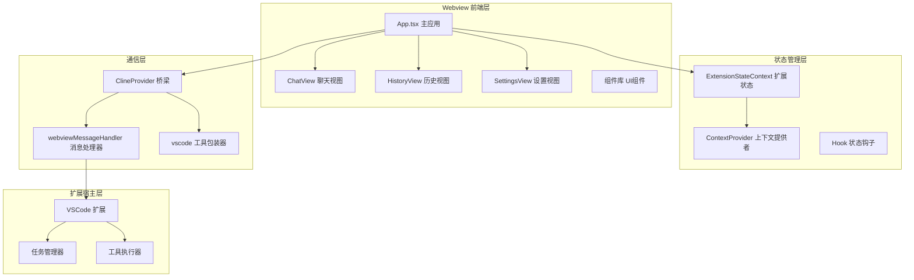
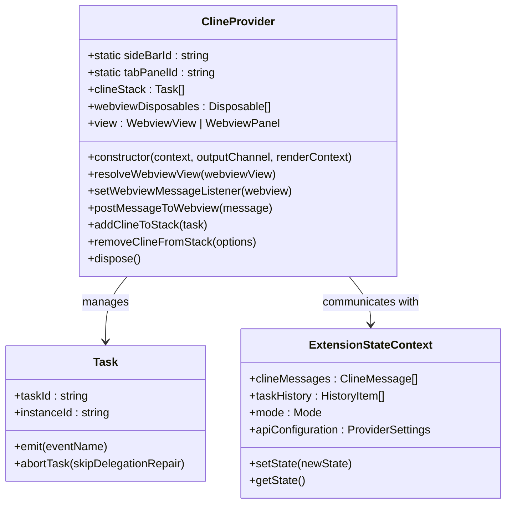
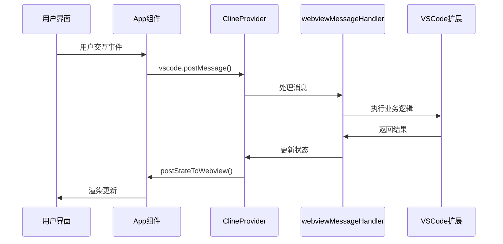
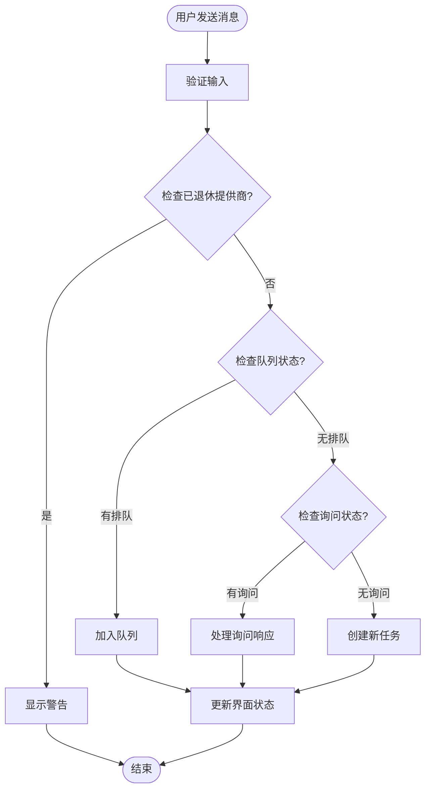
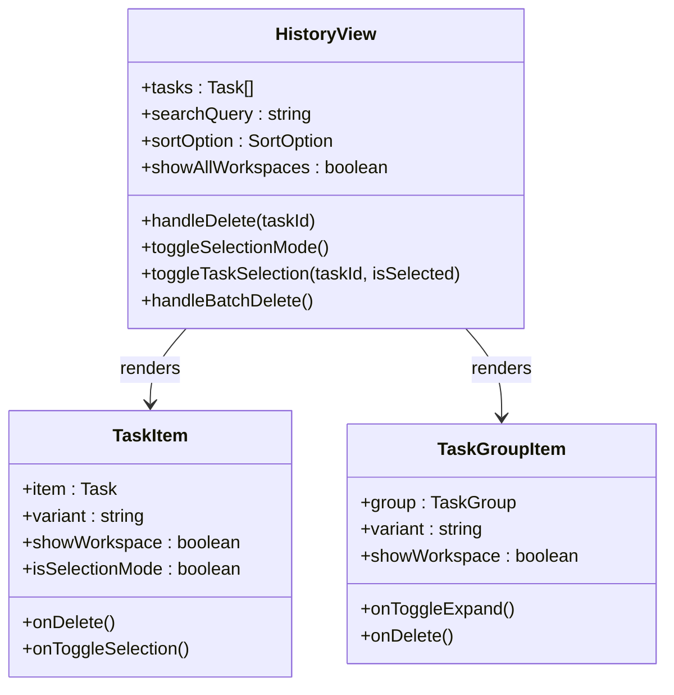
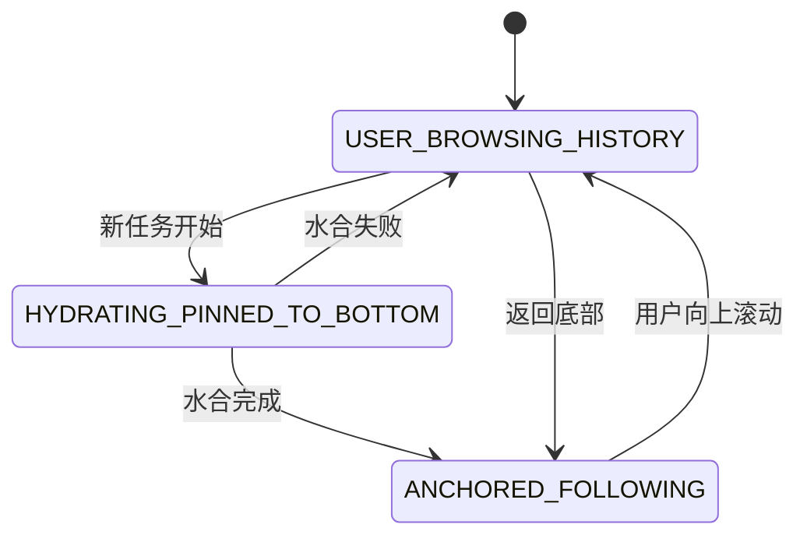

# Webview 界面系统

<cite>
**本文档引用的文件**
- [App.tsx](file://webview-ui/src/App.tsx)
- [index.tsx](file://webview-ui/src/index.tsx)
- [ClineProvider.ts](file://src/core/webview/ClineProvider.ts)
- [webviewMessageHandler.ts](file://src/core/webview/webviewMessageHandler.ts)
- [ExtensionStateContext.tsx](file://webview-ui/src/context/ExtensionStateContext.tsx)
- [vscode.ts](file://webview-ui/src/utils/vscode.ts)
- [ChatView.tsx](file://webview-ui/src/components/chat/ChatView.tsx)
- [HistoryView.tsx](file://webview-ui/src/components/history/HistoryView.tsx)
- [SettingsView.tsx](file://webview-ui/src/components/settings/SettingsView.tsx)
- [ChatRow.tsx](file://webview-ui/src/components/chat/ChatRow.tsx)
- [Tab.tsx](file://webview-ui/src/components/common/Tab.tsx)
- [useScrollLifecycle.ts](file://webview-ui/src/hooks/useScrollLifecycle.ts)
</cite>

## 目录
1. [简介](#简介)
2. [项目结构](#项目结构)
3. [核心组件](#核心组件)
4. [架构概览](#架构概览)
5. [详细组件分析](#详细组件分析)
6. [依赖关系分析](#依赖关系分析)
7. [性能考虑](#性能考虑)
8. [故障排除指南](#故障排除指南)
9. [结论](#结论)

## 简介

Webview 界面系统是 Roo-Code 扩展程序的核心前端架构，基于 React 构建，为用户提供现代化的 AI 对话界面。该系统通过 ClineProvider 作为界面与扩展宿主之间的桥梁，实现了双向的消息通信机制，支持聊天界面、工具调用审批、代码展示、历史管理等多种功能。

系统采用模块化设计，具有清晰的组件层次结构和状态管理模式，能够高效处理复杂的 AI 交互场景，包括实时对话、工具调用、文件操作等。

## 项目结构

Webview 界面系统主要由以下核心部分组成：



**图表来源**
- [App.tsx:1-331](file://webview-ui/src/App.tsx#L1-L331)
- [ClineProvider.ts:126-312](file://src/core/webview/ClineProvider.ts#L126-L312)
- [ExtensionStateContext.tsx:185-574](file://webview-ui/src/context/ExtensionStateContext.tsx#L185-L574)

**章节来源**
- [App.tsx:1-331](file://webview-ui/src/App.tsx#L1-L331)
- [index.tsx:1-18](file://webview-ui/src/index.tsx#L1-L18)

## 核心组件

### ClineProvider - 界面与扩展宿主的桥梁

ClineProvider 是整个系统的中枢控制器，实现了 VSCode 的 WebviewViewProvider 接口，负责：

- **视图生命周期管理**：处理 Webview 的创建、销毁和可见性变化
- **消息路由**：在前端界面和扩展宿主之间传递消息
- **任务协调**：管理多个任务实例的栈式结构
- **资源清理**：确保所有订阅和事件监听器正确释放



**图表来源**
- [ClineProvider.ts:126-312](file://src/core/webview/ClineProvider.ts#L126-L312)
- [ExtensionStateContext.tsx:32-140](file://webview-ui/src/context/ExtensionStateContext.tsx#L32-L140)

### 扩展状态管理系统

ExtensionStateContext 提供了完整的状态管理解决方案：

- **全局状态存储**：集中管理所有扩展相关的状态
- **实时状态同步**：通过序列号防止过期状态覆盖
- **类型安全**：完整的 TypeScript 类型定义
- **性能优化**：智能的状态合并和更新策略

**章节来源**
- [ExtensionStateContext.tsx:144-183](file://webview-ui/src/context/ExtensionStateContext.tsx#L144-L183)
- [ExtensionStateContext.tsx:297-440](file://webview-ui/src/context/ExtensionStateContext.tsx#L297-L440)

## 架构概览

系统采用分层架构设计，确保各层职责清晰分离：



**图表来源**
- [App.tsx:102-146](file://webview-ui/src/App.tsx#L102-L146)
- [ClineProvider.ts:790-792](file://src/core/webview/ClineProvider.ts#L790-L792)
- [webviewMessageHandler.ts:81-522](file://src/core/webview/webviewMessageHandler.ts#L81-L522)

## 详细组件分析

### 聊天界面组件 (ChatView)

ChatView 是最复杂的组件，负责处理所有聊天相关的交互：

#### 核心功能特性

- **实时消息流**：支持流式响应显示
- **工具调用审批**：提供工具使用确认界面
- **文件操作**：支持图片上传和文件上下文
- **自动完成**：智能的输入建议和补全
- **性能优化**：虚拟滚动和懒加载



**图表来源**
- [ChatView.tsx:595-679](file://webview-ui/src/components/chat/ChatView.tsx#L595-L679)

#### 消息处理流程

组件内部实现了复杂的消息处理逻辑：

- **消息队列管理**：处理并发消息的顺序执行
- **工具调用处理**：审批和执行各种工具调用
- **状态跟踪**：维护聊天状态和用户意图
- **错误恢复**：处理各种异常情况

**章节来源**
- [ChatView.tsx:1-800](file://webview-ui/src/components/chat/ChatView.tsx#L1-L800)

### 历史管理组件 (HistoryView)

HistoryView 提供了完整的任务历史管理功能：

#### 主要特性

- **搜索和过滤**：支持按多种条件搜索历史记录
- **分组显示**：按时间或项目分组显示任务
- **批量操作**：支持批量删除和管理
- **工作区切换**：支持在不同工作区间切换查看



**图表来源**
- [HistoryView.tsx:34-363](file://webview-ui/src/components/history/HistoryView.tsx#L34-L363)

**章节来源**
- [HistoryView.tsx:1-363](file://webview-ui/src/components/history/HistoryView.tsx#L1-L363)

### 设置管理组件 (SettingsView)

SettingsView 提供了全面的配置管理界面：

#### 功能模块

- **API 配置管理**：管理各种 AI 服务的配置
- **模式设置**：自定义工作模式和行为
- **实验性功能**：控制实验性特性的开关
- **主题和外观**：个性化界面外观
- **快捷命令**：自定义快捷命令和提示

**章节来源**
- [SettingsView.tsx:1-965](file://webview-ui/src/components/settings/SettingsView.tsx#L1-L965)

### 滚动生命周期管理 (useScrollLifecycle)

这是一个专门用于聊天界面滚动行为的高级 Hook：

#### 核心功能

- **智能跟随**：自动跟随最新消息
- **水合窗口**：优化初始渲染体验
- **用户意图检测**：识别用户的浏览行为
- **性能优化**：减少不必要的重渲染



**图表来源**
- [useScrollLifecycle.ts:26-69](file://webview-ui/src/hooks/useScrollLifecycle.ts#L26-L69)

**章节来源**
- [useScrollLifecycle.ts:1-490](file://webview-ui/src/hooks/useScrollLifecycle.ts#L1-L490)

## 依赖关系分析

系统采用了清晰的依赖层次结构：

```mermaid
graph TB
subgraph "外部依赖"
A[React 18]
B[VSCode Webview API]
C[TanStack React Query]
D[React Use Hooks]
end
subgraph "内部模块"
E[Webview UI]
F[Core Extensions]
G[Shared Utilities]
H[Services Layer]
end
subgraph "类型定义"
I[@njust-ai-cj/types]
J[@njust-ai-cj/core]
K[VSCode Types]
end
A --> E
B --> E
C --> E
D --> E
E --> F
F --> G
G --> H
I --> E
J --> F
K --> B
```

**图表来源**
- [App.tsx:1-11](file://webview-ui/src/App.tsx#L1-L11)
- [ClineProvider.ts:1-106](file://src/core/webview/ClineProvider.ts#L1-L106)

**章节来源**
- [vscode.ts:1-81](file://webview-ui/src/utils/vscode.ts#L1-L81)
- [ChatRow.tsx:1-80](file://webview-ui/src/components/chat/ChatRow.tsx#L1-L80)

## 性能考虑

### 渲染优化策略

1. **组件记忆化**：大量使用 React.memo 和 useMemo
2. **虚拟滚动**：使用 react-virtuoso 处理大量消息
3. **懒加载**：延迟加载非关键组件
4. **状态分离**：避免不必要的状态更新

### 内存管理

- **事件监听器清理**：确保组件卸载时清理所有监听器
- **定时器管理**：及时清理超时和间隔器
- **缓存策略**：合理使用 LRU 缓存
- **资源释放**：及时释放大对象和文件句柄

### 网络优化

- **请求去重**：避免重复的网络请求
- **批处理**：合并相似的操作
- **缓存机制**：利用本地缓存减少请求
- **错误重试**：智能的错误处理和重试策略

## 故障排除指南

### 常见问题及解决方案

#### 消息通信问题

**问题**：界面无法接收扩展消息
**解决方案**：
1. 检查 ClineProvider 是否正确初始化
2. 验证 webviewMessageHandler 是否正常工作
3. 确认消息序列号机制是否正常

#### 状态同步问题

**问题**：界面状态与扩展状态不一致
**解决方案**：
1. 检查序列号比较逻辑
2. 验证状态合并函数
3. 确认状态更新的时机

#### 性能问题

**问题**：聊天界面响应缓慢
**解决方案**：
1. 检查虚拟滚动配置
2. 优化组件渲染频率
3. 减少不必要的状态更新

**章节来源**
- [ExtensionStateContext.tsx:144-183](file://webview-ui/src/context/ExtensionStateContext.tsx#L144-L183)
- [ClineProvider.ts:561-620](file://src/core/webview/ClineProvider.ts#L561-L620)

## 结论

Webview 界面系统展现了现代前端架构的最佳实践，通过精心设计的分层结构和状态管理模式，成功地将复杂的 AI 交互场景抽象为直观易用的用户界面。系统的主要优势包括：

1. **模块化设计**：清晰的组件边界和职责分离
2. **类型安全**：完整的 TypeScript 支持
3. **性能优化**：针对大规模数据处理的优化策略
4. **可扩展性**：易于添加新功能和组件
5. **用户体验**：流畅的交互和响应式设计

该系统为开发者提供了良好的扩展基础，可以轻松地添加新的 UI 组件、集成新的 AI 服务，以及实现更复杂的业务逻辑。通过遵循现有的架构模式和最佳实践，开发者可以快速而可靠地扩展系统功能。