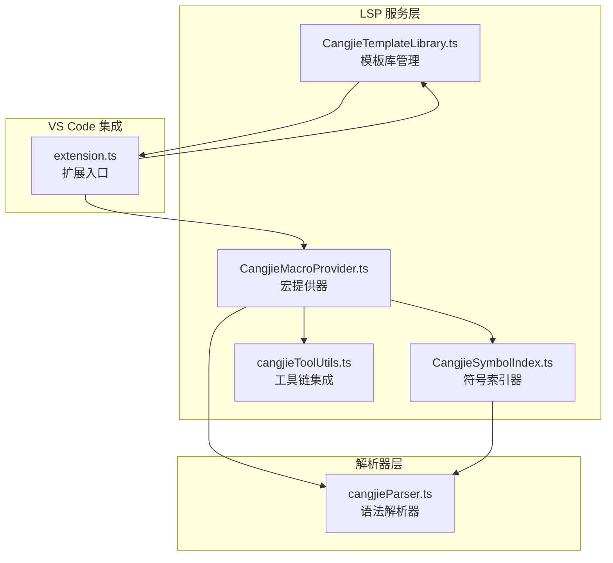
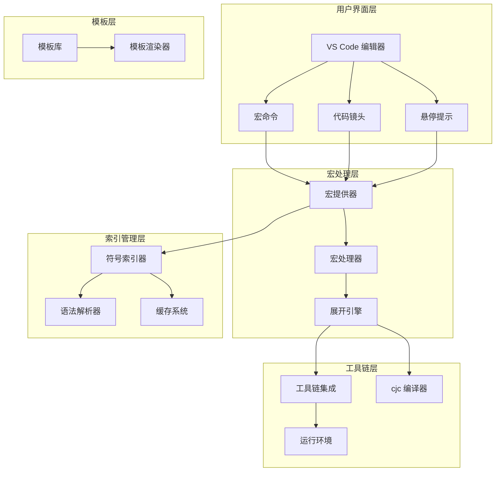
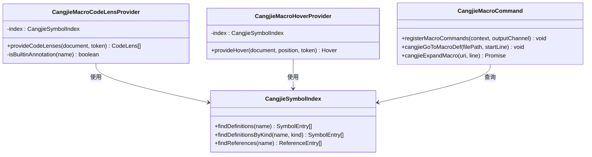
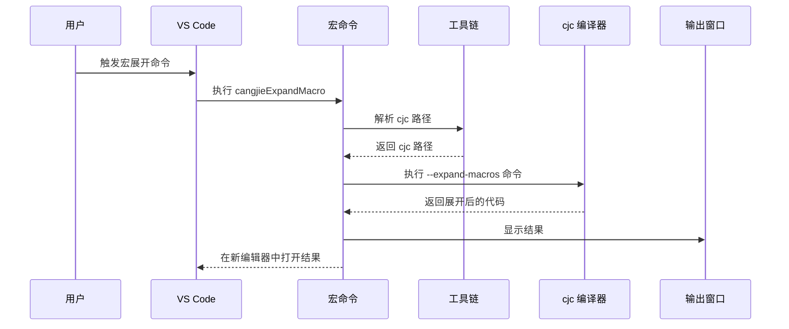
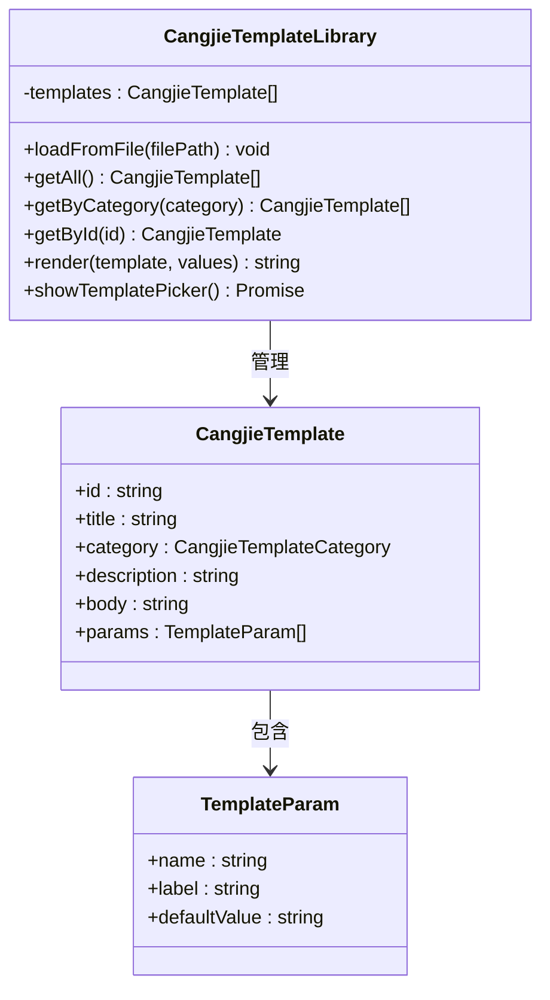
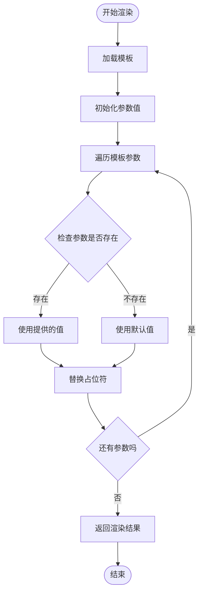
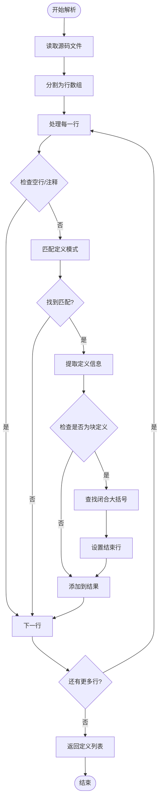
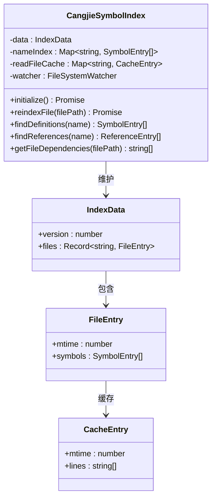
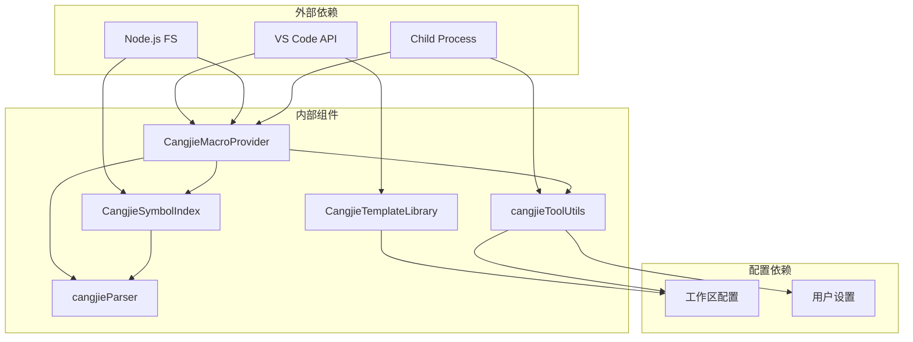

# 宏系统支持

<cite>
**本文档引用的文件**
- [CangjieMacroProvider.ts](file://src/services/cangjie-lsp/CangjieMacroProvider.ts)
- [CangjieTemplateLibrary.ts](file://src/services/cangjie-lsp/CangjieTemplateLibrary.ts)
- [cangjieParser.ts](file://src/services/tree-sitter/cangjieParser.ts)
- [CangjieSymbolIndex.ts](file://src/services/cangjie-lsp/CangjieSymbolIndex.ts)
- [cangjieToolUtils.ts](file://src/services/cangjie-lsp/cangjieToolUtils.ts)
- [extension.ts](file://src/extension.ts)
</cite>

## 目录
1. [简介](#简介)
2. [项目结构](#项目结构)
3. [核心组件](#核心组件)
4. [架构概览](#架构概览)
5. [详细组件分析](#详细组件分析)
6. [依赖关系分析](#依赖关系分析)
7. [性能考虑](#性能考虑)
8. [故障排除指南](#故障排除指南)
9. [结论](#结论)

## 简介

Cangjie 宏系统支持是基于仓颉语言的高级代码生成和模板管理系统。该系统提供了完整的宏定义解析、宏调用处理、代码生成流程，以及模板库管理功能。通过集成 VS Code LSP（Language Server Protocol）服务，系统实现了智能的宏展开、导航和代码补全功能。

宏系统的核心目标是为开发者提供强大的代码生成能力，支持复杂的模板化代码生成、条件编译和运行时代码扩展。系统采用模块化设计，包含宏提供器、模板库管理器、符号索引器和工具链集成等关键组件。

## 项目结构

Cangjie 宏系统支持位于项目的 LSP 服务层，主要文件分布如下：

**图表来源**
- [CangjieMacroProvider.ts:1-170](file://src/services/cangjie-lsp/CangjieMacroProvider.ts#L1-L170)
- [CangjieTemplateLibrary.ts:1-343](file://src/services/cangjie-lsp/CangjieTemplateLibrary.ts#L1-L343)
- [cangjieParser.ts:1-538](file://src/services/tree-sitter/cangjieParser.ts#L1-L538)
- [CangjieSymbolIndex.ts:1-470](file://src/services/cangjie-lsp/CangjieSymbolIndex.ts#L1-L470)
- [cangjieToolUtils.ts:1-223](file://src/services/cangjie-lsp/cangjieToolUtils.ts#L1-L223)
- [extension.ts:377-420](file://src/extension.ts#L377-L420)

**章节来源**
- [CangjieMacroProvider.ts:1-170](file://src/services/cangjie-lsp/CangjieMacroProvider.ts#L1-L170)
- [CangjieTemplateLibrary.ts:1-343](file://src/services/cangjie-lsp/CangjieTemplateLibrary.ts#L1-L343)
- [cangjieParser.ts:1-538](file://src/services/tree-sitter/cangjieParser.ts#L1-L538)
- [CangjieSymbolIndex.ts:1-470](file://src/services/cangjie-lsp/CangjieSymbolIndex.ts#L1-L470)
- [cangjieToolUtils.ts:1-223](file://src/services/cangjie-lsp/cangjieToolUtils.ts#L1-L223)
- [extension.ts:377-420](file://src/extension.ts#L377-L420)

## 核心组件

### 宏提供器 (Macro Provider)

宏提供器是宏系统的核心组件，负责处理宏调用的识别、导航和展开。它包含三个主要类：

1. **CangjieMacroCodeLensProvider**: 提供代码镜头功能，显示宏展开和跳转选项
2. **CangjieMacroHoverProvider**: 提供悬停提示，显示宏定义预览
3. **宏命令注册**: 注册宏相关的 VS Code 命令

### 模板库管理器 (Template Library)

模板库管理器提供预定义的代码模板，支持参数化模板渲染和自定义模板加载。内置了多种类型的模板，包括可执行项目、HTTP 服务器、CLI 工具、单元测试等。

### 符号索引器 (Symbol Index)

符号索引器维护整个工作区的符号数据库，支持快速查找宏定义、函数、类等符号信息。采用缓存机制优化性能，并支持文件变更监听。

### 工具链集成 (Tool Utils)

工具链集成功能检测和配置 Cangjie SDK 工具路径，构建运行环境变量，确保宏展开功能正常工作。

**章节来源**
- [CangjieMacroProvider.ts:14-170](file://src/services/cangjie-lsp/CangjieMacroProvider.ts#L14-L170)
- [CangjieTemplateLibrary.ts:5-343](file://src/services/cangjie-lsp/CangjieTemplateLibrary.ts#L5-L343)
- [CangjieSymbolIndex.ts:43-470](file://src/services/cangjie-lsp/CangjieSymbolIndex.ts#L43-L470)
- [cangjieToolUtils.ts:18-223](file://src/services/cangjie-lsp/cangjieToolUtils.ts#L18-L223)

## 架构概览

宏系统采用分层架构设计，各组件职责明确，通过清晰的接口进行交互：

**图表来源**
- [CangjieMacroProvider.ts:18-170](file://src/services/cangjie-lsp/CangjieMacroProvider.ts#L18-L170)
- [CangjieSymbolIndex.ts:43-231](file://src/services/cangjie-lsp/CangjieSymbolIndex.ts#L43-L231)
- [cangjieToolUtils.ts:48-130](file://src/services/cangjie-lsp/cangjieToolUtils.ts#L48-L130)
- [CangjieTemplateLibrary.ts:255-343](file://src/services/cangjie-lsp/CangjieTemplateLibrary.ts#L255-L343)

## 详细组件分析

### 宏提供器实现机制

宏提供器通过正则表达式模式匹配来识别宏调用和宏定义：

**图表来源**
- [CangjieMacroProvider.ts:18-170](file://src/services/cangjie-lsp/CangjieMacroProvider.ts#L18-L170)
- [CangjieSymbolIndex.ts:261-290](file://src/services/cangjie-lsp/CangjieSymbolIndex.ts#L261-L290)

宏展开算法流程：

**图表来源**
- [CangjieMacroProvider.ts:125-169](file://src/services/cangjie-lsp/CangjieMacroProvider.ts#L125-L169)
- [cangjieToolUtils.ts:101-130](file://src/services/cangjie-lsp/cangjieToolUtils.ts#L101-L130)

**章节来源**
- [CangjieMacroProvider.ts:11-170](file://src/services/cangjie-lsp/CangjieMacroProvider.ts#L11-L170)

### 模板库管理方式

模板库采用配置驱动的方式管理，支持内置模板和自定义模板：

**图表来源**
- [CangjieTemplateLibrary.ts:5-343](file://src/services/cangjie-lsp/CangjieTemplateLibrary.ts#L5-L343)

模板渲染算法：

**图表来源**
- [CangjieTemplateLibrary.ts:289-296](file://src/services/cangjie-lsp/CangjieTemplateLibrary.ts#L289-L296)

**章节来源**
- [CangjieTemplateLibrary.ts:34-343](file://src/services/cangjie-lsp/CangjieTemplateLibrary.ts#L34-L343)

### 宏定义解析机制

宏定义解析通过正则表达式模式匹配实现，支持多种修饰符和复杂语法：

**图表来源**
- [cangjieParser.ts:145-195](file://src/services/tree-sitter/cangjieParser.ts#L145-L195)

**章节来源**
- [cangjieParser.ts:68-87](file://src/services/tree-sitter/cangjieParser.ts#L68-L87)
- [cangjieParser.ts:145-195](file://src/services/tree-sitter/cangjieParser.ts#L145-L195)

### 符号索引与缓存机制

符号索引器采用多级缓存策略，确保高性能的符号查询：

**图表来源**
- [CangjieSymbolIndex.ts:43-470](file://src/services/cangjie-lsp/CangjieSymbolIndex.ts#L43-L470)

**章节来源**
- [CangjieSymbolIndex.ts:85-101](file://src/services/cangjie-lsp/CangjieSymbolIndex.ts#L85-L101)
- [CangjieSymbolIndex.ts:200-231](file://src/services/cangjie-lsp/CangjieSymbolIndex.ts#L200-L231)

## 依赖关系分析

宏系统各组件之间的依赖关系如下：

**图表来源**
- [CangjieMacroProvider.ts:1-10](file://src/services/cangjie-lsp/CangjieMacroProvider.ts#L1-L10)
- [CangjieTemplateLibrary.ts:1-4](file://src/services/cangjie-lsp/CangjieTemplateLibrary.ts#L1-L4)
- [CangjieSymbolIndex.ts:1-12](file://src/services/cangjie-lsp/CangjieSymbolIndex.ts#L1-L12)
- [cangjieToolUtils.ts:1-5](file://src/services/cangjie-lsp/cangjieToolUtils.ts#L1-L5)

**章节来源**
- [extension.ts:377-420](file://src/extension.ts#L377-L420)

## 性能考虑

宏系统在设计时充分考虑了性能优化：

### 缓存策略
- **文件读取缓存**: 使用 mtime 标记的文件内容缓存，避免重复读取
- **索引持久化**: 符号索引定期保存到磁盘，启动时快速加载
- **环境变量缓存**: 工具链环境构建结果缓存，减少重复计算

### 异步处理
- **批量索引**: 文件索引采用批量处理，提高大规模项目处理效率
- **异步命令**: 宏展开操作异步执行，避免阻塞主线程
- **流式处理**: 大文件处理采用流式读取，控制内存使用

### 优化技术
- **正则表达式优化**: 使用预编译的正则表达式模式
- **早期退出**: 发现匹配后立即停止进一步匹配
- **增量更新**: 仅重新索引修改过的文件

**章节来源**
- [CangjieSymbolIndex.ts:55-56](file://src/services/cangjie-lsp/CangjieSymbolIndex.ts#L55-L56)
- [CangjieSymbolIndex.ts:173-176](file://src/services/cangjie-lsp/CangjieSymbolIndex.ts#L173-L176)
- [cangjieToolUtils.ts:9-16](file://src/services/cangjie-lsp/cangjieToolUtils.ts#L9-L16)

## 故障排除指南

### 常见问题及解决方案

#### 宏展开失败
**问题**: 宏展开命令执行后无响应或报错
**原因**: cjc 编译器不可用或版本过低
**解决方案**:
1. 检查 CANGJIE_HOME 环境变量设置
2. 验证 cjc 可执行文件路径
3. 更新到支持 --expand-macros 参数的 SDK 版本

#### 符号索引不准确
**问题**: 宏定义或符号无法正确识别
**原因**: 索引缓存过期或解析错误
**解决方案**:
1. 清除 .cangjie-index 目录
2. 重启 VS Code 或重新加载窗口
3. 检查源码语法格式

#### 模板渲染异常
**问题**: 自定义模板无法正确渲染
**原因**: 模板文件格式错误或参数缺失
**解决方案**:
1. 验证 JSON 格式的模板文件
2. 检查模板参数的 defaultValue 设置
3. 确认模板占位符格式正确

**章节来源**
- [CangjieMacroProvider.ts:154-165](file://src/services/cangjie-lsp/CangjieMacroProvider.ts#L154-L165)
- [CangjieSymbolIndex.ts:85-101](file://src/services/cangjie-lsp/CangjieSymbolIndex.ts#L85-L101)
- [CangjieTemplateLibrary.ts:261-272](file://src/services/cangjie-lsp/CangjieTemplateLibrary.ts#L261-L272)

## 结论

Cangjie 宏系统支持提供了一个完整、高效的代码生成和模板管理解决方案。通过模块化的架构设计、智能的符号索引机制和优化的性能策略，系统能够满足复杂项目的宏处理需求。

系统的主要优势包括：
- **完整的 VS Code 集成**: 提供原生的宏展开、导航和代码补全体验
- **灵活的模板系统**: 支持内置模板和自定义模板扩展
- **高性能的索引机制**: 采用多级缓存和增量更新策略
- **可靠的工具链集成**: 自动检测和配置 Cangjie SDK 环境

未来可以考虑的功能扩展：
- 更丰富的宏语法支持
- 宏调用的实时预览功能
- 宏定义的图形化编辑器
- 宏性能分析和优化建议