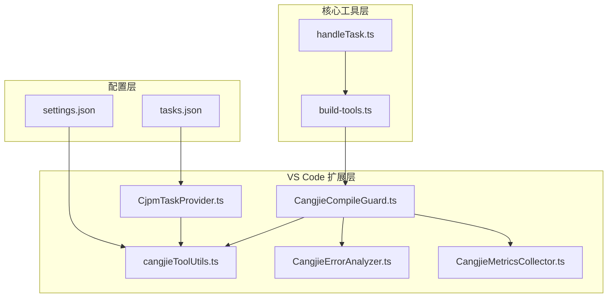
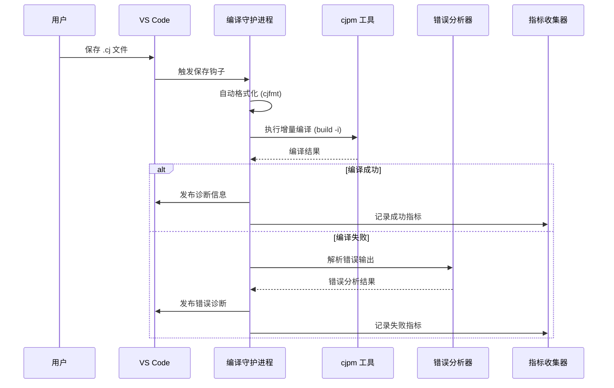
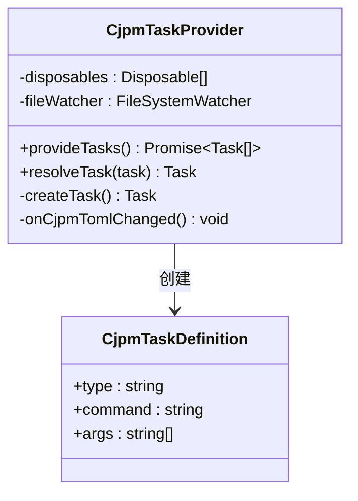
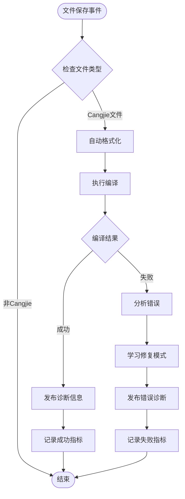
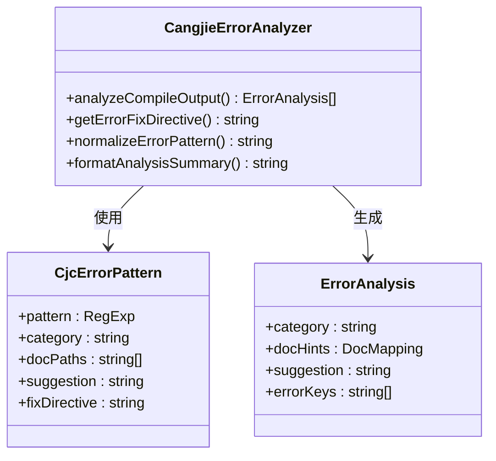
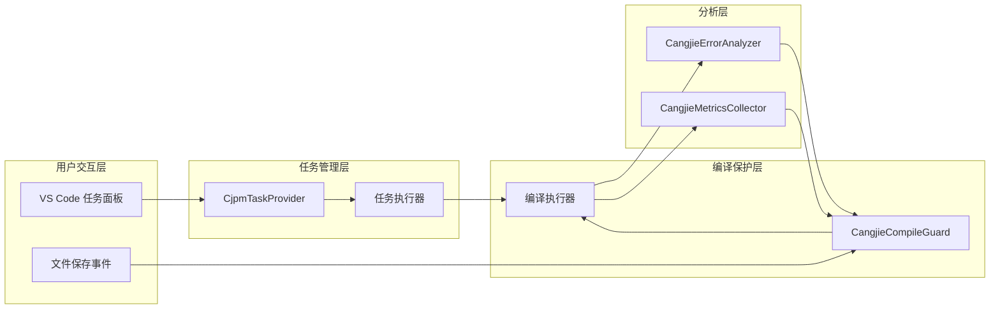
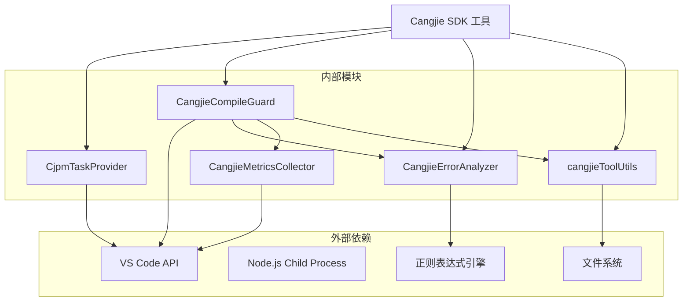

# 构建工具集成

<cite>
**本文档引用的文件**
- [CjpmTaskProvider.ts](file://src/services/cangjie-lsp/CjpmTaskProvider.ts)
- [CangjieCompileGuard.ts](file://src/services/cangjie-lsp/CangjieCompileGuard.ts)
- [CangjieErrorAnalyzer.ts](file://src/services/cangjie-lsp/CangjieErrorAnalyzer.ts)
- [cangjieToolUtils.ts](file://src/services/cangjie-lsp/cangjieToolUtils.ts)
- [CangjieMetricsCollector.ts](file://src/services/cangjie-lsp/CangjieMetricsCollector.ts)
- [build-tools.ts](file://src/core/task/build-tools.ts)
- [handleTask.ts](file://src/activate/handleTask.ts)
- [settings.json](file://.arts/settings.json)
- [tasks.json](file://.arts/tasks.json)
</cite>

## 目录
1. [简介](#简介)
2. [项目结构](#项目结构)
3. [核心组件](#核心组件)
4. [架构概览](#架构概览)
5. [详细组件分析](#详细组件分析)
6. [依赖分析](#依赖分析)
7. [性能考虑](#性能考虑)
8. [故障排除指南](#故障排除指南)
9. [结论](#结论)
10. [附录](#附录)

## 简介

本文件为 Cangjie 构建工具集成创建详细的技术文档，深入解释 cjpm 任务提供器的实现机制、编译守护进程的工作原理、错误分析器的分析策略。文档详细说明任务调度系统、构建流程管理、错误报告机制，解释编译保护机制、增量编译优化、错误定位算法，并结合具体代码示例展示如何扩展构建工具、添加自定义任务、优化构建性能。

## 项目结构

该构建工具集成主要分布在以下模块中：

**图表来源**
- [CjpmTaskProvider.ts:1-132](file://src/services/cangjie-lsp/CjpmTaskProvider.ts#L1-L132)
- [CangjieCompileGuard.ts:1-473](file://src/services/cangjie-lsp/CangjieCompileGuard.ts#L1-L473)
- [CangjieErrorAnalyzer.ts:1-370](file://src/services/cangjie-lsp/CangjieErrorAnalyzer.ts#L1-L370)
- [cangjieToolUtils.ts:1-223](file://src/services/cangjie-lsp/cangjieToolUtils.ts#L1-L223)
- [CangjieMetricsCollector.ts:1-241](file://src/services/cangjie-lsp/CangjieMetricsCollector.ts#L1-L241)

**章节来源**
- [CjpmTaskProvider.ts:1-132](file://src/services/cangjie-lsp/CjpmTaskProvider.ts#L1-L132)
- [CangjieCompileGuard.ts:1-473](file://src/services/cangjie-lsp/CangjieCompileGuard.ts#L1-L473)
- [CangjieErrorAnalyzer.ts:1-370](file://src/services/cangjie-lsp/CangjieErrorAnalyzer.ts#L1-L370)
- [cangjieToolUtils.ts:1-223](file://src/services/cangjie-lsp/cangjieToolUtils.ts#L1-L223)
- [CangjieMetricsCollector.ts:1-241](file://src/services/cangjie-lsp/CangjieMetricsCollector.ts#L1-L241)

## 核心组件

### 1. cjpm 任务提供器 (CjpmTaskProvider)

cjpm 任务提供器是 VS Code 任务系统的扩展，负责动态发现和创建 Cangjie 项目的构建任务。

**关键特性：**
- 自动检测项目中的 cjpm.toml 文件
- 动态生成标准构建命令任务
- 支持文件系统监听和任务刷新
- 集成 VS Code 任务面板

**支持的命令：**
- build: 标准构建任务
- run: 运行项目
- test: 单元测试
- bench: 性能基准测试
- check: 代码检查
- clean: 清理构建产物
- init: 初始化项目
- update: 更新依赖
- tree: 显示依赖树

**章节来源**
- [CjpmTaskProvider.ts:13-23](file://src/services/cangjie-lsp/CjpmTaskProvider.ts#L13-L23)
- [CjpmTaskProvider.ts:48-83](file://src/services/cangjie-lsp/CjpmTaskProvider.ts#L48-L83)

### 2. 编译守护进程 (CangjieCompileGuard)

编译守护进程提供智能的文件保存后处理，包括自动格式化、增量编译和错误分析。

**核心功能：**
- 文件保存钩子注册
- 自动格式化 (cjfmt)
- 增量编译 (cjpm build -i)
- 错误诊断发布
- 学习机制 (记录修复模式)

**编译保护机制：**
- 序列化构建请求 (避免并行冲突)
- 智能增量/全量编译决策
- 错误模式学习和记录
- 诊断信息缓存

**章节来源**
- [CangjieCompileGuard.ts:67-126](file://src/services/cangjie-lsp/CangjieCompileGuard.ts#L67-L126)
- [CangjieCompileGuard.ts:142-207](file://src/services/cangjie-lsp/CangjieCompileGuard.ts#L142-L207)

### 3. 错误分析器 (CangjieErrorAnalyzer)

错误分析器负责解析编译输出，提取错误信息并提供智能建议。

**分析策略：**
- 正则表达式模式匹配
- 错误分类和文档映射
- 自动修复建议生成
- 标准库符号识别

**错误分类体系：**
- 未找到符号 (import 错误)
- 类型不匹配 (类型系统错误)
- 循环依赖 (包管理错误)
- 不可变变量赋值
- 递归结构体
- 算术溢出
- 空值异常
- 接口未实现
- 访问权限错误

**章节来源**
- [CangjieErrorAnalyzer.ts:64-231](file://src/services/cangjie-lsp/CangjieErrorAnalyzer.ts#L64-L231)
- [CangjieErrorAnalyzer.ts:248-297](file://src/services/cangjie-lsp/CangjieErrorAnalyzer.ts#L248-L297)

### 4. 工具实用程序 (cangjieToolUtils)

提供 Cangjie SDK 工具的路径解析和环境配置。

**功能特性：**
- CANGJIE_HOME 检测
- 环境变量构建
- 工具路径解析
- 缓存机制

**章节来源**
- [cangjieToolUtils.ts:101-130](file://src/services/cangjie-lsp/cangjieToolUtils.ts#L101-L130)
- [cangjieToolUtils.ts:48-92](file://src/services/cangjie-lsp/cangjieToolUtils.ts#L48-L92)

### 5. 指标收集器 (CangjieMetricsCollector)

监控构建性能和错误趋势。

**指标类型：**
- 构建成功率统计
- 错误趋势分析
- 平均错误数计算
- 顶级错误分类

**章节来源**
- [CangjieMetricsCollector.ts:11-35](file://src/services/cangjie-lsp/CangjieMetricsCollector.ts#L11-L35)
- [CangjieMetricsCollector.ts:63-105](file://src/services/cangjie-lsp/CangjieMetricsCollector.ts#L63-L105)

## 架构概览

**图表来源**
- [CangjieCompileGuard.ts:67-126](file://src/services/cangjie-lsp/CangjieCompileGuard.ts#L67-L126)
- [CangjieErrorAnalyzer.ts:248-297](file://src/services/cangjie-lsp/CangjieErrorAnalyzer.ts#L248-L297)
- [CangjieMetricsCollector.ts:63-88](file://src/services/cangjie-lsp/CangjieMetricsCollector.ts#L63-L88)

## 详细组件分析

### 任务提供器实现机制

CjpmTaskProvider 通过 VS Code 的任务提供器 API 实现，具有以下特点：

**任务创建流程：**
1. 检测工作区中的 cjpm.toml 文件
2. 为每个支持的命令创建任务
3. 设置任务执行环境和参数
4. 配置任务显示选项

**章节来源**
- [CjpmTaskProvider.ts:48-126](file://src/services/cangjie-lsp/CjpmTaskProvider.ts#L48-L126)

### 编译守护进程工作原理

编译守护进程采用流水线式处理模型：

**图表来源**
- [CangjieCompileGuard.ts:67-126](file://src/services/cangjie-lsp/CangjieCompileGuard.ts#L67-L126)
- [CangjieCompileGuard.ts:142-207](file://src/services/cangjie-lsp/CangjieCompileGuard.ts#L142-L207)

**增量编译优化：**

编译守护进程实现了智能的增量编译策略：

1. **增量编译启用条件：**
   - target/ 目录存在
   - cjpm.toml 未发生变化
   - 上次编译成功

2. **编译回退机制：**
   - 增量编译失败时自动降级到全量编译
   - 重新计算 cjpm.toml 哈希值
   - 更新最后编译状态

**章节来源**
- [CangjieCompileGuard.ts:209-225](file://src/services/cangjie-lsp/CangjieCompileGuard.ts#L209-L225)
- [CangjieCompileGuard.ts:166-196](file://src/services/cangjie-lsp/CangjieCompileGuard.ts#L166-L196)

### 错误分析器分析策略

错误分析器采用多层分析策略：

**分析流程：**
1. **模式匹配：** 使用预定义的正则表达式匹配错误消息
2. **分类确定：** 将错误映射到预定义的错误类别
3. **文档关联：** 为每类错误关联相关文档路径
4. **建议生成：** 提供具体的修复建议
5. **摘要格式化：** 生成人类可读的分析摘要

**章节来源**
- [CangjieErrorAnalyzer.ts:248-297](file://src/services/cangjie-lsp/CangjieErrorAnalyzer.ts#L248-L297)
- [CangjieErrorAnalyzer.ts:306-333](file://src/services/cangjie-lsp/CangjieErrorAnalyzer.ts#L306-L333)

### 构建流程管理系统

构建工具集成了完整的流程管理：

**图表来源**
- [build-tools.ts:66-176](file://src/core/task/build-tools.ts#L66-L176)
- [handleTask.ts:7-23](file://src/activate/handleTask.ts#L7-L23)

**章节来源**
- [build-tools.ts:83-176](file://src/core/task/build-tools.ts#L83-L176)
- [handleTask.ts:7-23](file://src/activate/handleTask.ts#L7-L23)

## 依赖分析

**图表来源**
- [CjpmTaskProvider.ts:1-4](file://src/services/cangjie-lsp/CjpmTaskProvider.ts#L1-L4)
- [CangjieCompileGuard.ts:1-13](file://src/services/cangjie-lsp/CangjieCompileGuard.ts#L1-L13)
- [CangjieErrorAnalyzer.ts](file://src/services/cangjie-lsp/CangjieErrorAnalyzer.ts#L1)

**依赖关系特点：**
- **低耦合高内聚：** 各组件职责明确，接口清晰
- **单向依赖：** 从工具实用程序到具体服务
- **可测试性：** 通过接口抽象支持单元测试
- **可扩展性：** 插件化架构支持新工具集成

**章节来源**
- [cangjieToolUtils.ts:1-16](file://src/services/cangjie-lsp/cangjieToolUtils.ts#L1-L16)
- [CangjieCompileGuard.ts:1-13](file://src/services/cangjie-lsp/CangjieCompileGuard.ts#L1-L13)

## 性能考虑

### 编译性能优化

1. **增量编译优先：** 默认启用增量编译，仅编译变更部分
2. **构建队列化：** 使用 Promise 队列防止并发构建冲突
3. **缓存机制：** 智能缓存 cjpm.toml 哈希值和依赖树
4. **超时控制：** 编译和格式化操作设置合理超时时间

### 内存管理

1. **资源清理：** 实现 Disposable 接口确保资源正确释放
2. **缓存限制：** 限制最近构建记录和错误趋势的存储大小
3. **异步处理：** 使用异步操作避免阻塞主线程

### 错误处理策略

1. **渐进式降级：** 编译失败时自动尝试全量编译
2. **错误分类：** 将错误按严重程度分类处理
3. **学习机制：** 记录常见错误模式用于后续改进

## 故障排除指南

### 常见问题及解决方案

**问题1：cjpm 工具未找到**
- 检查 CANGJIE_HOME 环境变量设置
- 验证工具路径配置
- 确认工具在系统 PATH 中可用

**问题2：增量编译失败**
- 检查 target/ 目录完整性
- 验证 cjpm.toml 文件未被修改
- 手动执行全量编译验证

**问题3：错误分析不准确**
- 检查编译输出格式
- 验证正则表达式模式
- 更新错误模式数据库

**章节来源**
- [cangjieToolUtils.ts:101-130](file://src/services/cangjie-lsp/cangjieToolUtils.ts#L101-L130)
- [CangjieCompileGuard.ts:180-196](file://src/services/cangjie-lsp/CangjieCompileGuard.ts#L180-L196)

### 调试技巧

1. **启用详细日志：** 在输出通道查看详细的编译过程
2. **检查环境变量：** 验证 CANGJIE_HOME 和 PATH 设置
3. **手动验证命令：** 在终端中直接运行相同的构建命令
4. **分析错误模式：** 使用错误分析器提供的修复建议

## 结论

Cangjie 构建工具集成通过模块化的架构设计，实现了高效的构建流程管理和智能的错误处理机制。核心组件各司其职，形成了完整的开发体验闭环：

- **任务提供器** 提供无缝的任务集成
- **编译守护进程** 实现智能的构建保护
- **错误分析器** 提供精准的错误定位
- **指标收集器** 支持持续的性能监控

该系统具备良好的可扩展性和维护性，为 Cangjie 开发者提供了现代化的开发体验。

## 附录

### 配置参考

**VS Code 设置：**
- `cangjieTools.cjpmPath`: cjpm 工具路径
- `cangjieTools.cjfmtPath`: cjfmt 工具路径
- `CANGJIE_HOME`: Cangjie SDK 安装目录

**构建配置：**
- 任务定义在 tasks.json 中
- 自动任务发现基于 cjpm.toml 文件
- 支持自定义任务参数

**章节来源**
- [settings.json:16-20](file://.arts/settings.json#L16-L20)
- [tasks.json:1-75](file://.arts/tasks.json#L1-L75)