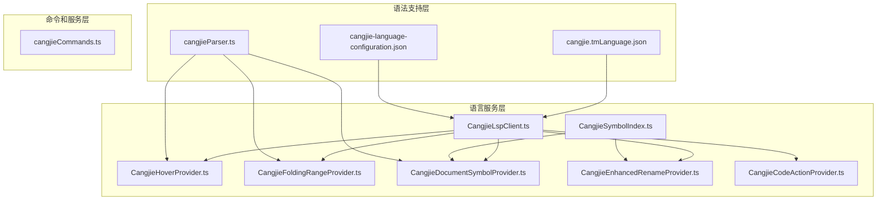
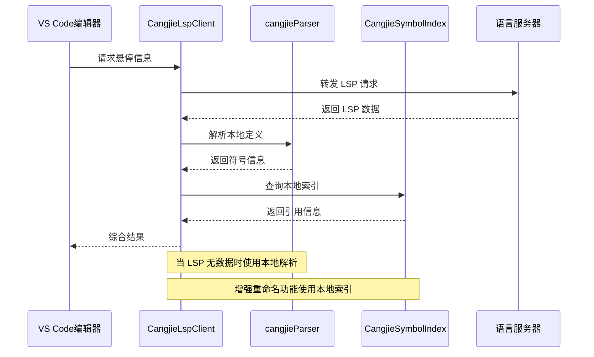
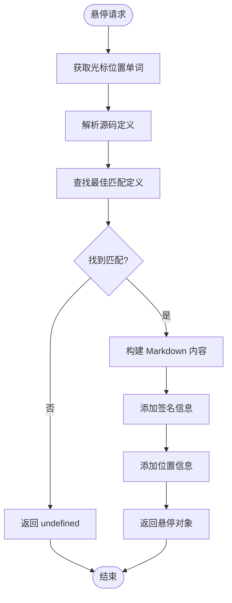
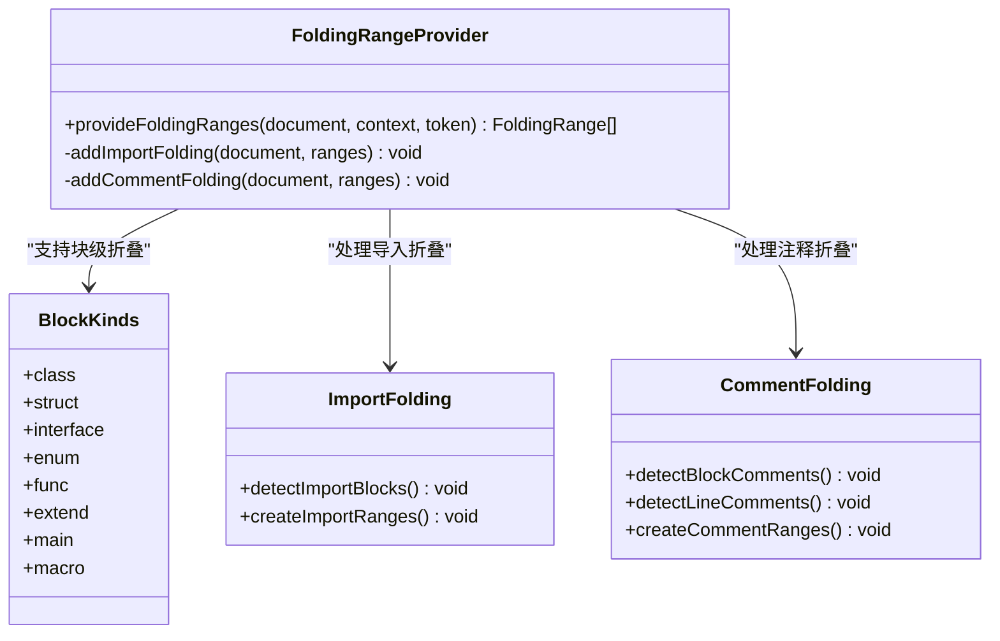
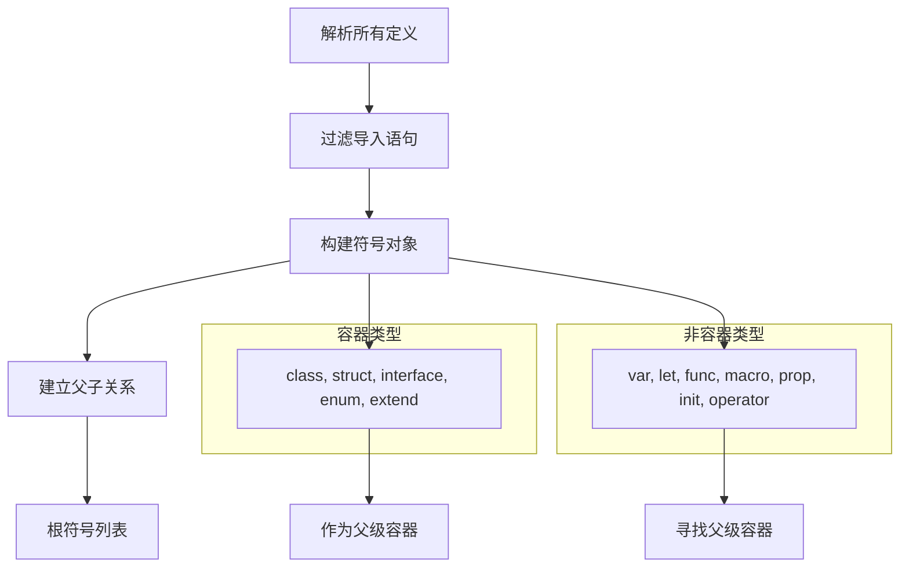
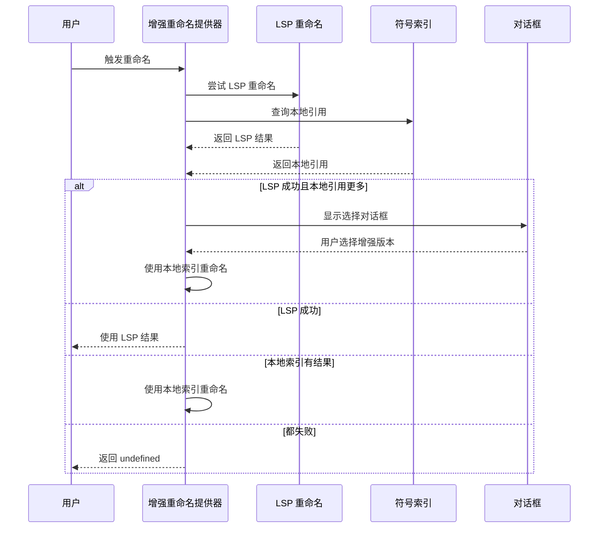
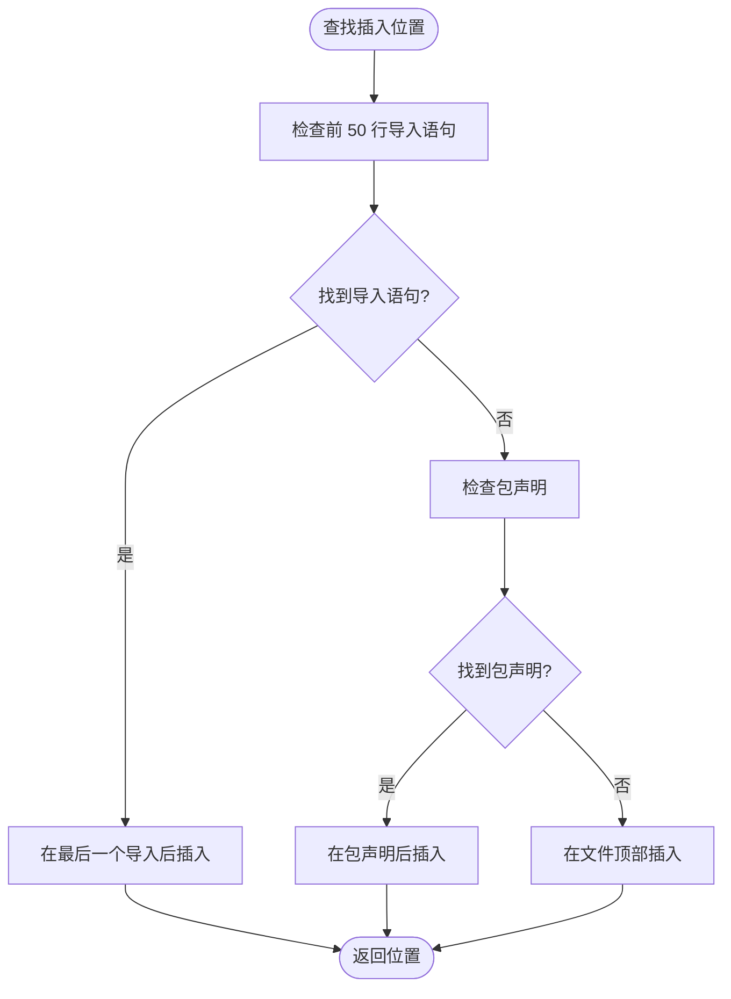
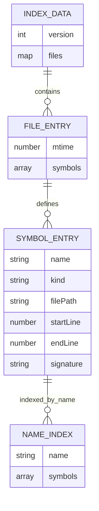
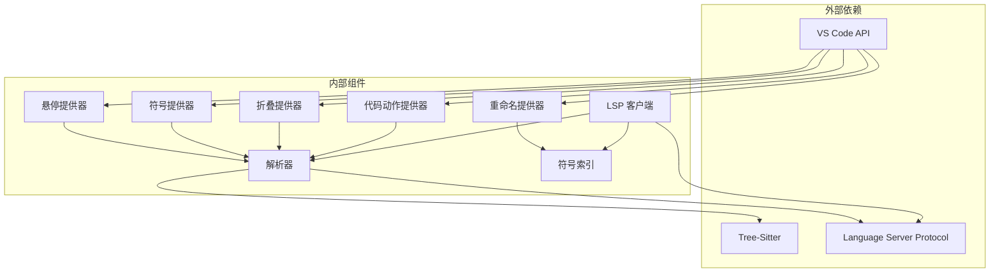

# 语言特性支持

<cite>
**本文档引用的文件**
- [CangjieHoverProvider.ts](file://src/services/cangjie-lsp/CangjieHoverProvider.ts)
- [CangjieFoldingRangeProvider.ts](file://src/services/cangjie-lsp/CangjieFoldingRangeProvider.ts)
- [CangjieDocumentSymbolProvider.ts](file://src/services/cangjie-lsp/CangjieDocumentSymbolProvider.ts)
- [CangjieEnhancedRenameProvider.ts](file://src/services/cangjie-lsp/CangjieEnhancedRenameProvider.ts)
- [CangjieCodeActionProvider.ts](file://src/services/cangjie-lsp/CangjieCodeActionProvider.ts)
- [CangjieLspClient.ts](file://src/services/cangjie-lsp/CangjieLspClient.ts)
- [cangjieParser.ts](file://src/services/tree-sitter/cangjieParser.ts)
- [cangjie-language-configuration.json](file://src/languages/cangjie-language-configuration.json)
- [cangjie.tmLanguage.json](file://src/syntaxes/cangjie.tmLanguage.json)
- [CangjieSymbolIndex.ts](file://src/services/cangjie-lsp/CangjieSymbolIndex.ts)
- [cangjieCommands.ts](file://src/services/cangjie-lsp/cangjieCommands.ts)
</cite>

## 目录
1. [简介](#简介)
2. [项目结构](#项目结构)
3. [核心组件](#核心组件)
4. [架构概览](#架构概览)
5. [详细组件分析](#详细组件分析)
6. [依赖关系分析](#依赖关系分析)
7. [性能考虑](#性能考虑)
8. [故障排除指南](#故障排除指南)
9. [结论](#结论)

## 简介

本文档深入分析了 Cangjie 语言在 VS Code 中的语言特性支持实现。Cangjie 是一种现代编程语言，该扩展为其提供了完整的 IDE 支持，包括悬停信息、代码折叠、文档符号、重命名、代码动作、语法高亮等核心功能。

该系统采用混合架构设计，结合了基于正则表达式的快速解析器和 Tree-Sitter 集成，确保在不同环境下都能提供可靠的开发体验。扩展通过 LSP 客户端与语言服务器通信，同时提供本地符号索引以增强功能。

## 项目结构

Cangjie 语言特性的实现主要分布在以下目录结构中：



**图表来源**
- [CangjieLspClient.ts:1-660](file://src/services/cangjie-lsp/CangjieLspClient.ts#L1-L660)
- [cangjieParser.ts:1-538](file://src/services/tree-sitter/cangjieParser.ts#L1-L538)

**章节来源**
- [CangjieLspClient.ts:1-660](file://src/services/cangjie-lsp/CangjieLspClient.ts#L1-L660)
- [cangjieParser.ts:1-538](file://src/services/tree-sitter/cangjieParser.ts#L1-L538)

## 核心组件

### LSP 客户端管理器

CangjieLspClient 是整个语言服务的核心协调者，负责管理语言服务器的生命周期、性能优化和错误处理。

**主要功能特性：**
- **延迟启动机制**：仅在用户打开 .cj 文件时启动语言服务器，避免不必要的资源消耗
- **自动重启策略**：最多尝试 3 次自动重启，防止服务器异常退出影响开发体验
- **性能监控**：记录首次完成建议和悬停响应的时间，优化用户体验
- **配置监听**：实时监听配置变化，动态调整服务器行为

### 符号解析引擎

cangjieParser 提供了强大的代码解析能力，支持两种解析策略：

**正则表达式解析器**（默认）
- 快速、无需外部依赖
- 支持所有 Cangjie 语言特性
- 适用于大多数场景

**Tree-Sitter 集成解析器**（可选）
- 更精确的语法分析
- 需要安装 Cangjie SDK
- 用于代码索引等高级功能

**章节来源**
- [CangjieLspClient.ts:277-660](file://src/services/cangjie-lsp/CangjieLspClient.ts#L277-L660)
- [cangjieParser.ts:145-195](file://src/services/tree-sitter/cangjieParser.ts#L145-L195)

## 架构概览

Cangjie 语言特性支持采用分层架构设计，确保各组件职责清晰、耦合度低：



**图表来源**
- [CangjieLspClient.ts:46-56](file://src/services/cangjie-lsp/CangjieLspClient.ts#L46-L56)
- [CangjieHoverProvider.ts:9-36](file://src/services/cangjie-lsp/CangjieHoverProvider.ts#L9-L36)
- [CangjieEnhancedRenameProvider.ts:9-78](file://src/services/cangjie-lsp/CangjieEnhancedRenameProvider.ts#L9-L78)

## 详细组件分析

### 悬停提供器 (Hover Provider)

CangjieHoverProvider 实现了智能悬停显示功能，提供丰富的代码上下文信息。

**核心实现机制：**



**图表来源**
- [CangjieHoverProvider.ts:10-36](file://src/services/cangjie-lsp/CangjieHoverProvider.ts#L10-L36)

**关键特性：**
- **智能匹配算法**：优先匹配当前行定义，然后按距离选择最接近的定义
- **多语言支持**：支持中英文标签显示
- **签名提取**：自动提取多行声明的完整签名
- **位置信息**：显示定义所在的行范围

**章节来源**
- [CangjieHoverProvider.ts:1-63](file://src/services/cangjie-lsp/CangjieHoverProvider.ts#L1-L63)

### 代码折叠提供器 (Folding Range Provider)

CangjieFoldingRangeProvider 提供智能代码折叠功能，支持多种折叠类型。

**折叠规则实现：**



**图表来源**
- [CangjieFoldingRangeProvider.ts:4-72](file://src/services/cangjie-lsp/CangjieFoldingRangeProvider.ts#L4-L72)

**支持的折叠类型：**
- **块级折叠**：类、结构体、接口、枚举、函数、宏等
- **导入折叠**：连续的 import 语句自动折叠
- **注释折叠**：块注释和行注释的智能折叠

**章节来源**
- [CangjieFoldingRangeProvider.ts:1-74](file://src/services/cangjie-lsp/CangjieFoldingRangeProvider.ts#L1-L74)

### 文档符号提供器 (Document Symbol Provider)

CangjieDocumentSymbolProvider 将 Cangjie 代码转换为 VS Code 的文档符号树。

**符号映射机制：**

| Cangjie 类型 | VS Code 符号类型 | 描述 |
|-------------|------------------|------|
| class | Class | 类定义 |
| struct | Struct | 结构体 |
| interface | Interface | 接口 |
| enum | Enum | 枚举 |
| func/main | Function | 函数/主函数 |
| macro | Function | 宏 |
| extend | Namespace | 扩展 |
| var/let | Variable | 变量 |
| type_alias | TypeParameter | 类型别名 |
| package | Package | 包 |
| import | Module | 导入 |
| prop | Property | 属性 |
| init | Constructor | 构造函数 |
| operator | Operator | 运算符 |

**层次结构构建：**



**图表来源**
- [CangjieDocumentSymbolProvider.ts:23-74](file://src/services/cangjie-lsp/CangjieDocumentSymbolProvider.ts#L23-L74)

**章节来源**
- [CangjieDocumentSymbolProvider.ts:1-89](file://src/services/cangjie-lsp/CangjieDocumentSymbolProvider.ts#L1-L89)

### 增强重命名提供器 (Enhanced Rename Provider)

CangjieEnhancedRenameProvider 提供了比标准 LSP 更强大的重命名功能。

**智能比较机制：**



**图表来源**
- [CangjieEnhancedRenameProvider.ts:31-78](file://src/services/cangjie-lsp/CangjieEnhancedRenameProvider.ts#L31-L78)

**核心优化：**
- **双重验证**：同时查询 LSP 和本地索引，确保引用完整性
- **智能提示**：当发现更多引用时提示用户使用增强版本
- **防重入保护**：避免递归调用导致的无限循环
- **回退机制**：优先使用 LSP 结果，本地索引作为备选

**章节来源**
- [CangjieEnhancedRenameProvider.ts:1-126](file://src/services/cangjie-lsp/CangjieEnhancedRenameProvider.ts#L1-L126)

### 代码动作提供器 (Code Action Provider)

CangjieCodeActionProvider 实现了智能的代码修复建议功能。

**快速修复模式：**

| 模式名称 | 匹配条件 | 修复操作 |
|---------|----------|----------|
| 未声明符号 | `undeclared \| cannot find \| not found` | 添加缺失的 import 语句 |
| 不可变赋值 | `immutable \| cannot assign \| let.*reassign` | 将 let 改为 var |
| 模式匹配不完整 | `non-exhaustive \| not exhaustive` | 添加通配 case 分支 |
| 缺少返回值 | `missing return \| no return` | 在函数末尾添加 return 语句 |
| 缺少导入 | `missing import \| import.*not found` | 自动添加 import 语句 |

**智能插入位置：**



**图表来源**
- [CangjieCodeActionProvider.ts:29-48](file://src/services/cangjie-lsp/CangjieCodeActionProvider.ts#L29-L48)

**章节来源**
- [CangjieCodeActionProvider.ts:1-210](file://src/services/cangjie-lsp/CangjieCodeActionProvider.ts#L1-L210)

### 符号索引系统

CangjieSymbolIndex 提供了高性能的符号索引和查询功能。

**索引存储结构：**



**图表来源**
- [CangjieSymbolIndex.ts:38-41](file://src/services/cangjie-lsp/CangjieSymbolIndex.ts#L38-L41)

**核心功能：**
- **实时索引更新**：文件变更时自动重新索引
- **跨文件引用查询**：支持符号的全局引用搜索
- **依赖关系分析**：识别文件间的导入依赖
- **性能优化**：使用内存缓存和批量处理

**章节来源**
- [CangjieSymbolIndex.ts:1-470](file://src/services/cangjie-lsp/CangjieSymbolIndex.ts#L1-L470)

## 依赖关系分析

Cangjie 语言特性支持的组件间依赖关系如下：



**图表来源**
- [CangjieLspClient.ts:46-56](file://src/services/cangjie-lsp/CangjieLspClient.ts#L46-L56)
- [cangjieParser.ts:338-342](file://src/services/tree-sitter/cangjieParser.ts#L338-L342)

**章节来源**
- [CangjieLspClient.ts:46-56](file://src/services/cangjie-lsp/CangjieLspClient.ts#L46-L56)
- [cangjieParser.ts:338-342](file://src/services/tree-sitter/cangjieParser.ts#L338-L342)

## 性能考虑

### 延迟启动优化

LSP 客户端实现了智能的延迟启动机制，只有在用户实际需要时才启动语言服务器：

- **空闲状态**：检测到没有 .cj 文件打开时不启动服务器
- **事件触发**：用户打开第一个 .cj 文件时启动
- **配置监听**：实时响应配置变化，动态调整启动策略

### 请求去抖动

为了提升响应速度和减少服务器负载，实现了请求去抖动机制：

- **悬停请求去抖动**：100ms 去抖动间隔
- **自动补全请求去抖动**：150ms 去抖动间隔
- **性能监控**：记录首次响应时间，优化用户体验

### 符号索引缓存

符号索引系统采用了多层缓存策略：

- **内存缓存**：最近访问的文件内容缓存
- **增量更新**：只重新索引修改过的文件
- **批量处理**：并发处理多个文件的索引任务

## 故障排除指南

### LSP 服务器启动问题

**常见问题及解决方案：**

1. **服务器找不到**
   - 检查 CANGJIE_HOME 环境变量设置
   - 验证 LSPServer 可执行文件路径
   - 确认 SDK 已正确安装和配置

2. **初始化失败**
   - 运行 envsetup 脚本
   - 检查系统 API 兼容性
   - 查看 LSP 输出通道中的详细错误信息

3. **自动重启限制**
   - 服务器连续崩溃超过 3 次后停止自动重启
   - 需要手动重启或检查 SDK 配置

### 符号索引问题

**索引不准确或过期：**

1. **手动重建索引**
   ```typescript
   // 通过命令面板执行
   Cangjie: 重建符号索引
   ```

2. **检查索引文件**
   - 索引文件位于工作区根目录的 `.cangjie-index` 文件夹
   - 删除索引文件后会自动重新生成

3. **性能优化**
   - 大型项目可能需要较长时间重建索引
   - 可以通过配置禁用某些索引功能以提升性能

### 语法高亮问题

**语法着色不正确：**

1. **检查语言配置**
   - 确认文件扩展名 .cj 正确关联到 Cangjie 语言
   - 验证语言配置文件中的括号、自动闭合等设置

2. **重新加载语法文件**
   ```typescript
   // 通过命令面板执行
   Reload Window
   ```

3. **检查自定义主题**
   - 某些主题可能不完全支持 Cangjie 语法
   - 切换到默认主题测试语法高亮效果

**章节来源**
- [CangjieLspClient.ts:567-594](file://src/services/cangjie-lsp/CangjieLspClient.ts#L567-L594)
- [CangjieSymbolIndex.ts:85-101](file://src/services/cangjie-lsp/CangjieSymbolIndex.ts#L85-L101)

## 结论

Cangjie 语言特性支持系统展现了现代 IDE 扩展的最佳实践。通过精心设计的分层架构、智能的性能优化和完善的错误处理机制，该系统为 Cangjie 开发者提供了专业级的开发体验。

**主要优势：**
- **模块化设计**：各组件职责明确，易于维护和扩展
- **性能优化**：采用多种优化策略确保流畅的开发体验
- **智能功能**：提供比传统 LSP 更强大的代码分析能力
- **容错处理**：完善的错误处理和恢复机制

**未来改进方向：**
- 增加更多代码重构和分析功能
- 优化大型项目的索引性能
- 扩展对更多 Cangjie 特性的支持
- 提供更丰富的开发工具集成

该系统为 Cangjie 语言生态系统的健康发展奠定了坚实基础，为开发者提供了高效、可靠的开发环境。