# 调试支持系统

<cite>
**本文档引用的文件**
- [CangjieDebugAdapterFactory.ts](file://src/services/cangjie-lsp/CangjieDebugAdapterFactory.ts)
- [CangjieProfiler.ts](file://src/services/cangjie-lsp/CangjieProfiler.ts)
- [CangjieMetricsCollector.ts](file://src/services/cangjie-lsp/CangjieMetricsCollector.ts)
- [CangjieCompileGuard.ts](file://src/services/cangjie-lsp/CangjieCompileGuard.ts)
- [cangjieToolUtils.ts](file://src/services/cangjie-lsp/cangjieToolUtils.ts)
- [CangjieLspClient.ts](file://src/services/cangjie-lsp/CangjieLspClient.ts)
- [CangjieErrorAnalyzer.ts](file://src/services/cangjie-lsp/CangjieErrorAnalyzer.ts)
- [cjdb_manual_cjnative.md](file://CangjieCorpus-1.0.0/tools/source_zh_cn/tools/cjdb_manual_cjnative.md)
- [cjprof_manual_cjnative.md](file://CangjieCorpus-1.0.0/tools/source_zh_cn/tools/cjprof_manual_cjnative.md)
</cite>

## 目录
1. [引言](#引言)
2. [项目结构](#项目结构)
3. [核心组件](#核心组件)
4. [架构概览](#架构概览)
5. [详细组件分析](#详细组件分析)
6. [依赖关系分析](#依赖关系分析)
7. [性能考虑](#性能考虑)
8. [故障排除指南](#故障排除指南)
9. [结论](#结论)

## 引言

Cangjie 调试支持系统是一个完整的开发工具链，为仓颉编程语言提供从编译到调试的全流程支持。该系统集成了调试适配器工厂、性能分析器、指标收集器等多个核心组件，为开发者提供了强大的调试和性能分析能力。

系统的核心目标是：
- 提供无缝的调试体验，支持热重载和增量编译
- 实时性能监控和分析
- 智能错误诊断和修复建议
- 全面的项目度量统计和趋势分析

## 项目结构

调试支持系统主要位于 `src/services/cangjie-lsp/` 目录下，采用模块化设计，每个组件都有明确的职责分工：

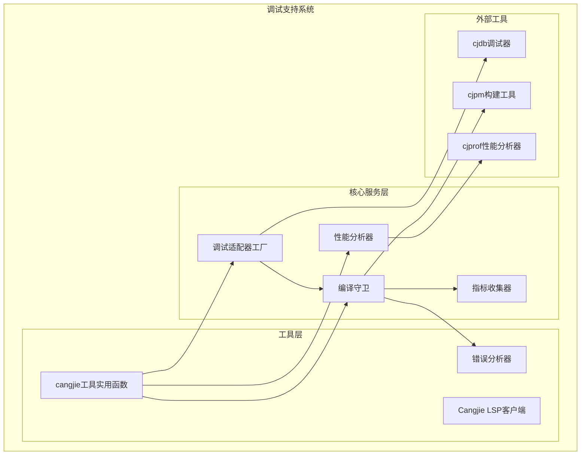

**图表来源**
- [CangjieDebugAdapterFactory.ts:1-180](file://src/services/cangjie-lsp/CangjieDebugAdapterFactory.ts#L1-L180)
- [CangjieCompileGuard.ts:1-473](file://src/services/cangjie-lsp/CangjieCompileGuard.ts#L1-L473)
- [CangjieMetricsCollector.ts:1-241](file://src/services/cangjie-lsp/CangjieMetricsCollector.ts#L1-L241)
- [CangjieProfiler.ts:1-205](file://src/services/cangjie-lsp/CangjieProfiler.ts#L1-L205)

**章节来源**
- [CangjieDebugAdapterFactory.ts:1-180](file://src/services/cangjie-lsp/CangjieDebugAdapterFactory.ts#L1-L180)
- [CangjieCompileGuard.ts:1-473](file://src/services/cangjie-lsp/CangjieCompileGuard.ts#L1-L473)
- [CangjieMetricsCollector.ts:1-241](file://src/services/cangjie-lsp/CangjieMetricsCollector.ts#L1-L241)
- [CangjieProfiler.ts:1-205](file://src/services/cangjie-lsp/CangjieProfiler.ts#L1-L205)

## 核心组件

### 调试适配器工厂 (CangjieDebugAdapterFactory)

调试适配器工厂负责为 VS Code 调试框架提供 Cangjie 程序的调试支持。它实现了 `vscode.DebugAdapterDescriptorFactory` 接口，能够动态检测和配置调试器。

**主要功能：**
- 自动检测 CANGJIE_HOME 环境变量
- 解析 cjdb 调试器可执行文件路径
- 支持热重载功能
- 提供初始调试配置

### 编译守卫 (CangjieCompileGuard)

编译守卫提供文件保存后的自动化处理流程，包括格式化、编译和诊断报告。

**核心流程：**
1. 自动格式化 (.cj 文件)
2. 增量编译 (cjpm build -i)
3. 错误诊断发布
4. 学习模式 (记录修复模式)

### 指标收集器 (CangjieMetricsCollector)

指标收集器负责跟踪项目的构建性能和错误趋势，提供历史数据分析。

**收集指标：**
- 构建成功率和失败率
- 错误趋势分析
- 平均错误数量
- 顶级错误分类

### 性能分析器 (CangjieProfiler)

性能分析器集成 cjprof 工具，提供运行时性能分析和热点函数识别。

**分析功能：**
- 运行时性能分析
- 热点函数识别
- 热图可视化
- 性能报告生成

**章节来源**
- [CangjieDebugAdapterFactory.ts:14-120](file://src/services/cangjie-lsp/CangjieDebugAdapterFactory.ts#L14-L120)
- [CangjieCompileGuard.ts:40-126](file://src/services/cangjie-lsp/CangjieCompileGuard.ts#L40-L126)
- [CangjieMetricsCollector.ts:46-88](file://src/services/cangjie-lsp/CangjieMetricsCollector.ts#L46-L88)
- [CangjieProfiler.ts:30-75](file://src/services/cangjie-lsp/CangjieProfiler.ts#L30-L75)

## 架构概览

系统采用分层架构设计，各组件之间通过清晰的接口进行交互：

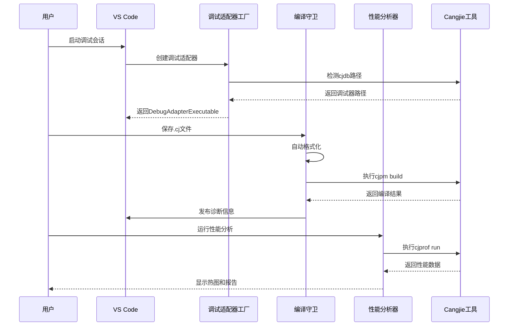

**图表来源**
- [CangjieDebugAdapterFactory.ts:29-52](file://src/services/cangjie-lsp/CangjieDebugAdapterFactory.ts#L29-L52)
- [CangjieCompileGuard.ts:67-126](file://src/services/cangjie-lsp/CangjieCompileGuard.ts#L67-L126)
- [CangjieProfiler.ts:44-75](file://src/services/cangjie-lsp/CangjieProfiler.ts#L44-L75)

## 详细组件分析

### 调试适配器工厂实现机制

调试适配器工厂是整个调试系统的核心协调者，负责管理调试会话生命周期和热重载功能。

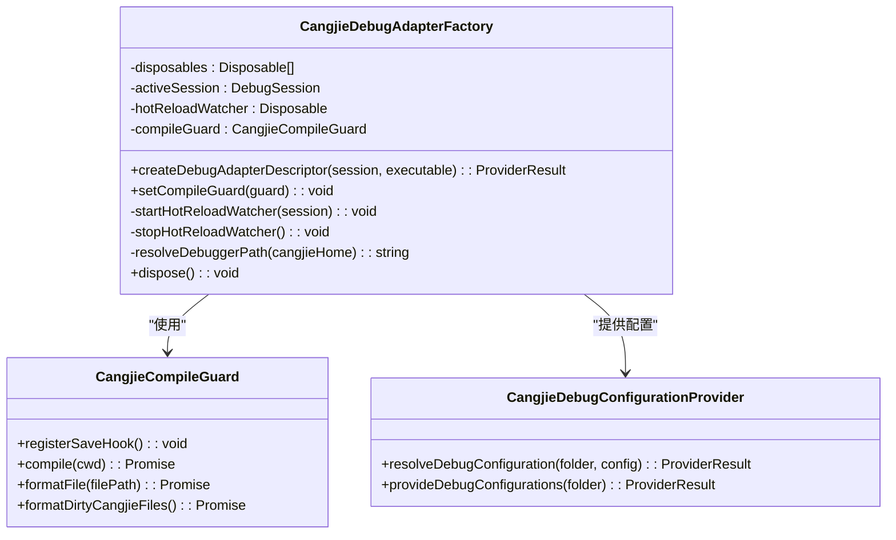

**图表来源**
- [CangjieDebugAdapterFactory.ts:14-120](file://src/services/cangjie-lsp/CangjieDebugAdapterFactory.ts#L14-L120)
- [CangjieCompileGuard.ts:40-54](file://src/services/cangjie-lsp/CangjieCompileGuard.ts#L40-L54)

#### 热重载机制

热重载功能允许在调试过程中实时重新编译和交换模块：

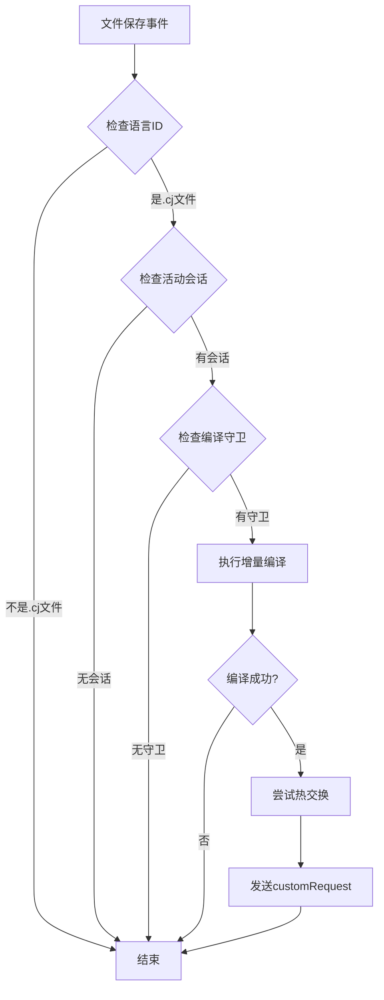

**图表来源**
- [CangjieDebugAdapterFactory.ts:58-100](file://src/services/cangjie-lsp/CangjieDebugAdapterFactory.ts#L58-L100)

**章节来源**
- [CangjieDebugAdapterFactory.ts:14-120](file://src/services/cangjie-lsp/CangjieDebugAdapterFactory.ts#L14-L120)
- [CangjieDebugAdapterFactory.ts:58-100](file://src/services/cangjie-lsp/CangjieDebugAdapterFactory.ts#L58-L100)

### 性能分析器工作原理

性能分析器通过集成 cjprof 工具提供全面的运行时性能分析：

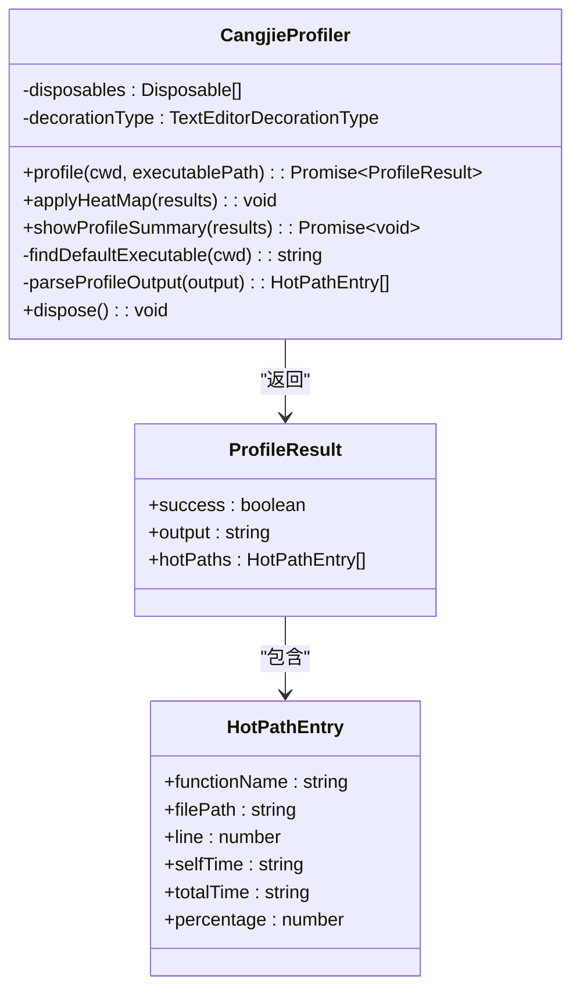

**图表来源**
- [CangjieProfiler.ts:30-205](file://src/services/cangjie-lsp/CangjieProfiler.ts#L30-L205)

#### 性能分析流程

性能分析过程包括多个阶段的数据处理和可视化：

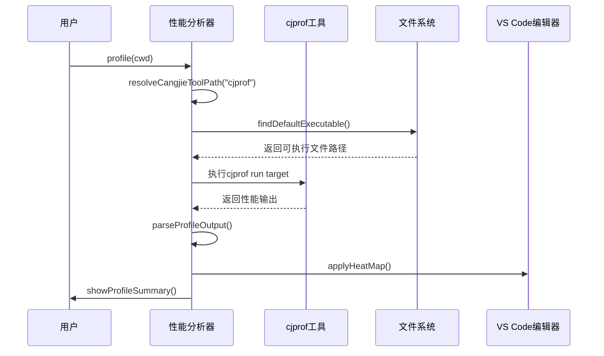

**图表来源**
- [CangjieProfiler.ts:44-132](file://src/services/cangjie-lsp/CangjieProfiler.ts#L44-L132)

**章节来源**
- [CangjieProfiler.ts:30-205](file://src/services/cangjie-lsp/CangjieProfiler.ts#L30-L205)
- [CangjieProfiler.ts:151-198](file://src/services/cangjie-lsp/CangjieProfiler.ts#L151-L198)

### 指标收集器数据采集策略

指标收集器采用异步持久化策略，确保数据完整性和性能优化：

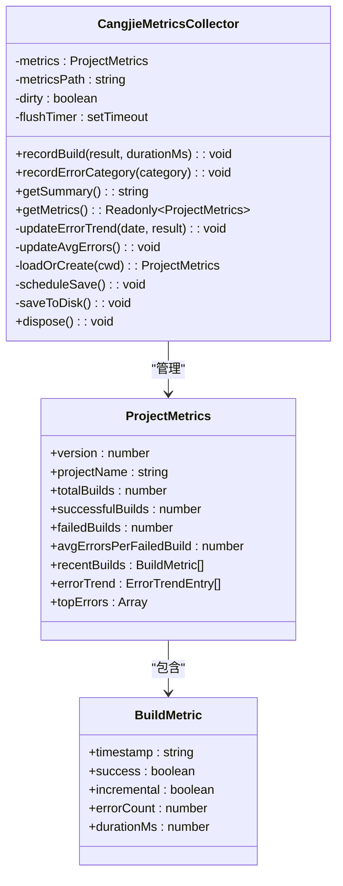

**图表来源**
- [CangjieMetricsCollector.ts:46-241](file://src/services/cangjie-lsp/CangjieMetricsCollector.ts#L46-L241)

#### 数据持久化机制

指标收集器采用延迟保存策略，避免频繁的磁盘I/O操作：

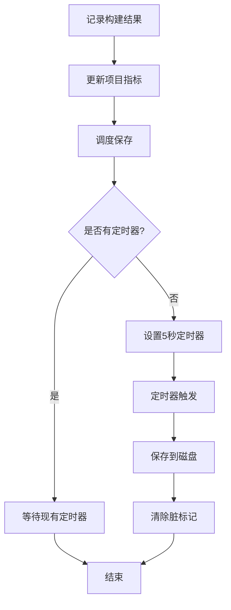

**图表来源**
- [CangjieMetricsCollector.ts:213-232](file://src/services/cangjie-lsp/CangjieMetricsCollector.ts#L213-L232)

**章节来源**
- [CangjieMetricsCollector.ts:46-241](file://src/services/cangjie-lsp/CangjieMetricsCollector.ts#L46-L241)
- [CangjieMetricsCollector.ts:213-232](file://src/services/cangjie-lsp/CangjieMetricsCollector.ts#L213-L232)

### 调试会话管理

调试会话管理涉及多个组件的协调工作，包括会话生命周期管理和资源清理：

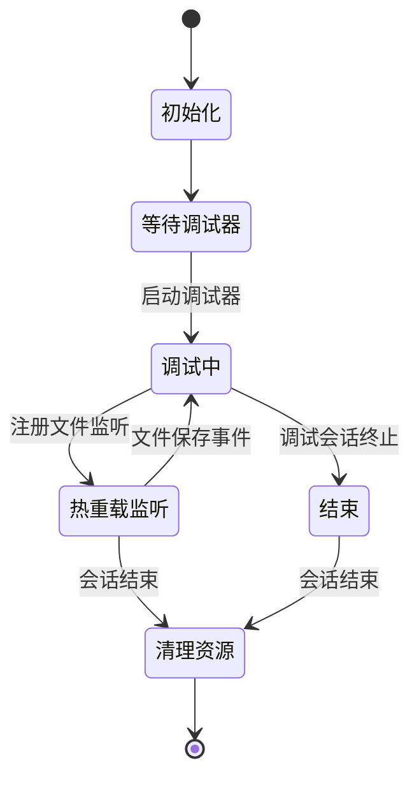

**图表来源**
- [CangjieDebugAdapterFactory.ts:58-100](file://src/services/cangjie-lsp/CangjieDebugAdapterFactory.ts#L58-L100)

### 断点处理机制

系统支持多种类型的断点，包括源码断点、函数断点和条件断点：

| 断点类型 | 命令格式 | 用途 | 示例 |
|---------|----------|------|------|
| 源码断点 | `b file:line` | 在指定文件的指定行设置断点 | `b test.cj:4` |
| 函数断点 | `b function_name` | 在指定函数入口设置断点 | `b main` |
| 条件断点 | `breakpoint set --file --line --condition` | 带条件的断点 | `breakpoint set --file test.cj --line 4 --condition a==12` |

**章节来源**
- [CangjieDebugAdapterFactory.ts:116-120](file://src/services/cangjie-lsp/CangjieDebugAdapterFactory.ts#L116-L120)
- [cjdb_manual_cjnative.md:87-153](file://CangjieCorpus-1.0.0/tools/source_zh_cn/tools/cjdb_manual_cjnative.md#L87-L153)

### 变量监视功能

变量监视支持多种变量查看和修改操作：

```mermaid
flowchart LR
subgraph "变量查看"
Locals[locals] --> 查看所有局部变量
Globals[globals] --> 查看所有全局变量
Print[p variableName] --> 查看单个变量
ArrayPrint[p array[1..3]] --> 查看数组区间
end
subgraph "变量修改"
Set[set variableName value] --> 修改变量值
Expr[expr expression] --> 计算表达式
end
subgraph "线程信息"
Thread[thread info] --> 查看线程信息
CJThread[cjthread] --> 查看仓颉线程
end
```

**图表来源**
- [cjdb_manual_cjnative.md:145-153](file://CangjieCorpus-1.0.0/tools/source_zh_cn/tools/cjdb_manual_cjnative.md#L145-L153)

**章节来源**
- [cjdb_manual_cjnative.md:69-77](file://CangjieCorpus-1.0.0/tools/source_zh_cn/tools/cjdb_manual_cjnative.md#L69-L77)

### 性能监控机制

性能监控通过多维度指标收集和分析：

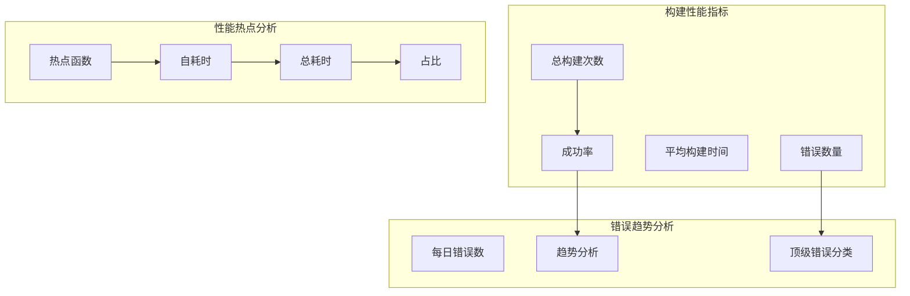

**图表来源**
- [CangjieMetricsCollector.ts:25-35](file://src/services/cangjie-lsp/CangjieMetricsCollector.ts#L25-L35)
- [CangjieProfiler.ts:18-25](file://src/services/cangjie-lsp/CangjieProfiler.ts#L18-L25)

### 内存分析工具

内存分析功能基于 cjprof 的堆内存分析能力：

**内存分析报告字段说明：**

| 字段 | 描述 | 用途 |
|------|------|------|
| Object Type | 对象类型名 | 识别对象类型 |
| Shallow Heap | 浅堆大小 | 对象自身占用内存 |
| Retained Heap | 深堆大小 | 对象可释放的总内存 |

**章节来源**
- [CangjieProfiler.ts:18-25](file://src/services/cangjie-lsp/CangjieProfiler.ts#L18-L25)
- [cjprof_manual_cjnative.md:236-256](file://CangjieCorpus-1.0.0/tools/source_zh_cn/tools/cjprof_manual_cjnative.md#L236-L256)

## 依赖关系分析

系统组件之间的依赖关系呈现清晰的层次结构：

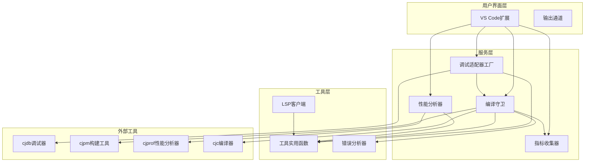

**图表来源**
- [CangjieDebugAdapterFactory.ts:1-7](file://src/services/cangjie-lsp/CangjieDebugAdapterFactory.ts#L1-L7)
- [CangjieCompileGuard.ts:1-11](file://src/services/cangjie-lsp/CangjieCompileGuard.ts#L1-L11)
- [cangjieToolUtils.ts:1-5](file://src/services/cangjie-lsp/cangjieToolUtils.ts#L1-L5)

**章节来源**
- [CangjieDebugAdapterFactory.ts:1-7](file://src/services/cangjie-lsp/CangjieDebugAdapterFactory.ts#L1-L7)
- [CangjieCompileGuard.ts:1-11](file://src/services/cangjie-lsp/CangjieCompileGuard.ts#L1-L11)
- [cangjieToolUtils.ts:1-5](file://src/services/cangjie-lsp/cangjieToolUtils.ts#L1-L5)

## 性能考虑

### 编译性能优化

系统采用多种策略优化编译性能：

1. **增量编译优先**：在满足条件时优先使用增量编译 (`cjpm build -i`)
2. **编译队列化**：防止并发编译导致的资源竞争
3. **智能缓存**：缓存工具路径和环境变量
4. **超时控制**：设置合理的编译超时时间

### 内存管理

- **异步保存**：使用定时器批量保存指标数据
- **资源清理**：及时释放文件监听器和装饰器
- **缓存策略**：避免重复计算和文件系统访问

### 网络和I/O优化

- **路径解析缓存**：缓存 CANGJIE_HOME 检测结果
- **环境变量缓存**：避免重复构建工具环境
- **文件系统访问优化**：批量处理文件操作

## 故障排除指南

### 调试器启动问题

**问题**：无法找到调试器
**解决方案**：
1. 检查 CANGJIE_HOME 环境变量
2. 验证 cjdb 可执行文件是否存在
3. 确认工具链版本兼容性

**章节来源**
- [CangjieDebugAdapterFactory.ts:33-45](file://src/services/cangjie-lsp/CangjieDebugAdapterFactory.ts#L33-L45)

### 编译失败处理

**问题**：编译过程中出现错误
**解决方案**：
1. 检查错误分析器输出
2. 查看诊断集合中的错误信息
3. 使用学习模式获取修复建议

**章节来源**
- [CangjieCompileGuard.ts:200-207](file://src/services/cangjie-lsp/CangjieCompileGuard.ts#L200-L207)

### 性能分析失败

**问题**：性能分析器无法获取数据
**解决方案**：
1. 验证 cjprof 工具路径
2. 检查目标可执行文件是否存在
3. 确认有足够的权限执行分析

**章节来源**
- [CangjieProfiler.ts:44-75](file://src/services/cangjie-lsp/CangjieProfiler.ts#L44-L75)

## 结论

Cangjie 调试支持系统通过精心设计的架构和多个专业组件，为仓颉语言开发者提供了完整的调试和性能分析解决方案。系统的主要优势包括：

1. **无缝集成**：与 VS Code 调试框架深度集成
2. **智能自动化**：自动格式化、编译和诊断
3. **实时反馈**：热重载和性能可视化
4. **全面监控**：构建性能和错误趋势分析
5. **扩展性强**：模块化设计便于功能扩展

该系统不仅提高了开发效率，还为复杂项目的调试和性能优化提供了强有力的支持。通过持续的功能增强和性能优化，Cangjie 调试支持系统将继续为仓颉生态系统的开发者提供卓越的开发体验。