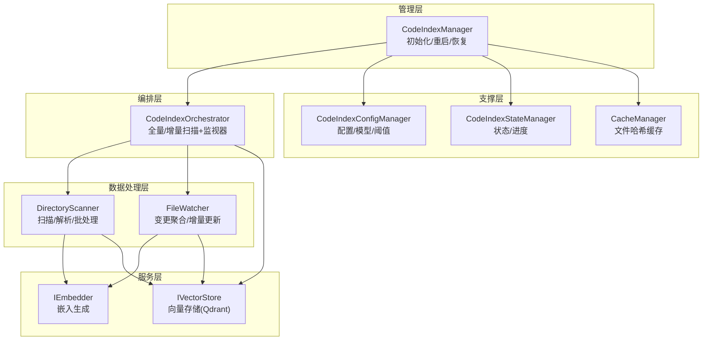
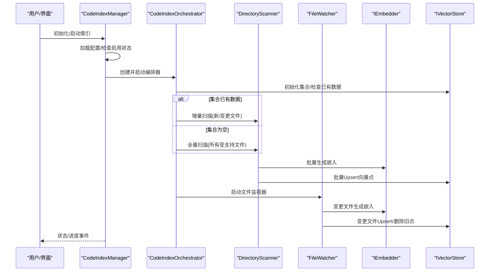
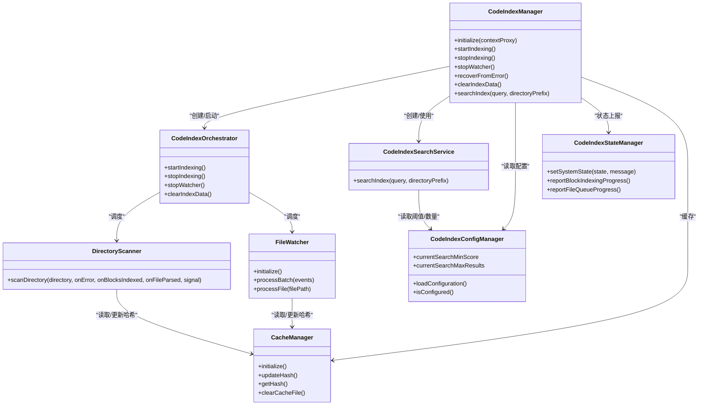

# 代码索引与搜索系统

<cite>
**本文引用的文件**
- [src/services/code-index/manager.ts](file://src/services/code-index/manager.ts)
- [src/services/code-index/orchestrator.ts](file://src/services/code-index/orchestrator.ts)
- [src/services/code-index/search-service.ts](file://src/services/code-index/search-service.ts)
- [src/services/code-index/config-manager.ts](file://src/services/code-index/config-manager.ts)
- [src/services/code-index/state-manager.ts](file://src/services/code-index/state-manager.ts)
- [src/services/code-index/cache-manager.ts](file://src/services/code-index/cache-manager.ts)
- [src/services/code-index/processors/scanner.ts](file://src/services/code-index/processors/scanner.ts)
- [src/services/code-index/processors/file-watcher.ts](file://src/services/code-index/processors/file-watcher.ts)
- [src/shared/embeddingModels.ts](file://src/shared/embeddingModels.ts)
</cite>

## 目录
1. [简介](#简介)
2. [项目结构](#项目结构)
3. [核心组件](#核心组件)
4. [架构总览](#架构总览)
5. [详细组件分析](#详细组件分析)
6. [依赖关系分析](#依赖关系分析)
7. [性能考量](#性能考量)
8. [故障排查指南](#故障排查指南)
9. [结论](#结论)
10. [附录](#附录)

## 简介
本技术文档围绕“代码索引与搜索系统”的完整流水线进行深入解析，涵盖从文件扫描、代码块解析、向量嵌入生成到向量存储管理的全流程。系统支持多种嵌入模型提供商（如 OpenAI、Ollama、OpenAI-Compatible、Gemini、Mistral、Vercel AI Gateway、Bedrock、OpenRouter），并提供缓存策略、增量索引机制、并发控制与重试容错、以及基于阈值的相关性评分与结果排序等关键技术。文档同时给出配置不同嵌入模型的方法、性能优化建议与大规模代码库索引的实践指导。

## 项目结构
该系统位于扩展服务层的 code-index 子模块中，采用分层设计：
- 管理层：负责生命周期管理、配置加载与服务重建、错误恢复与清理
- 编排器：协调扫描器、文件监视器、向量存储与状态管理
- 扫描器：递归扫描工作区、过滤忽略项、并发解析与批量嵌入
- 文件监视器：对文件变更进行去抖动聚合，增量更新向量库
- 搜索服务：查询时生成查询向量并在向量库中检索
- 配置管理：统一读取与校验嵌入模型、向量维度、阈值与 Qdrant 连接参数
- 缓存管理：基于文件内容哈希的本地缓存，避免重复处理
- 状态管理：统一的状态机与进度事件，供 UI 展示与交互

图表来源
- [src/services/code-index/manager.ts:18-466](file://src/services/code-index/manager.ts#L18-L466)
- [src/services/code-index/orchestrator.ts:14-399](file://src/services/code-index/orchestrator.ts#L14-L399)
- [src/services/code-index/processors/scanner.ts:32-485](file://src/services/code-index/processors/scanner.ts#L32-L485)
- [src/services/code-index/processors/file-watcher.ts:32-580](file://src/services/code-index/processors/file-watcher.ts#L32-L580)
- [src/services/code-index/config-manager.ts:12-545](file://src/services/code-index/config-manager.ts#L12-L545)
- [src/services/code-index/state-manager.ts:5-120](file://src/services/code-index/state-manager.ts#L5-L120)
- [src/services/code-index/cache-manager.ts:10-111](file://src/services/code-index/cache-manager.ts#L10-L111)

章节来源
- [src/services/code-index/manager.ts:18-466](file://src/services/code-index/manager.ts#L18-L466)
- [src/services/code-index/orchestrator.ts:14-399](file://src/services/code-index/orchestrator.ts#L14-L399)

## 核心组件
- 管理器（CodeIndexManager）：单例模式，负责初始化、配置加载、服务重建、错误恢复、清理索引数据、对外提供搜索接口
- 编排器（CodeIndexOrchestrator）：协调扫描器与文件监视器，决定是全量扫描还是增量扫描；管理向量存储初始化与标记完成/不完整
- 扫描器（DirectoryScanner）：递归列出文件、过滤忽略项、并发解析、批量生成嵌入并写入向量库，支持删除文件点位清理
- 文件监视器（FileWatcher）：对新增/修改/删除事件进行去抖动聚合，按批次处理并增量更新向量库
- 搜索服务（CodeIndexSearchService）：生成查询向量并在向量库中检索，支持目录前缀过滤与阈值/数量限制
- 配置管理（CodeIndexConfigManager）：统一读取嵌入提供商、模型、维度、阈值、Qdrant 连接信息，判断是否需要重启
- 状态管理（CodeIndexStateManager）：维护系统状态与进度事件，供 UI 实时反馈
- 缓存管理（CacheManager）：以文件路径为键、内容哈希为值的本地缓存，支持防抖落盘

章节来源
- [src/services/code-index/manager.ts:18-466](file://src/services/code-index/manager.ts#L18-L466)
- [src/services/code-index/orchestrator.ts:14-399](file://src/services/code-index/orchestrator.ts#L14-L399)
- [src/services/code-index/search-service.ts:11-66](file://src/services/code-index/search-service.ts#L11-L66)
- [src/services/code-index/config-manager.ts:12-545](file://src/services/code-index/config-manager.ts#L12-L545)
- [src/services/code-index/state-manager.ts:5-120](file://src/services/code-index/state-manager.ts#L5-L120)
- [src/services/code-index/cache-manager.ts:10-111](file://src/services/code-index/cache-manager.ts#L10-L111)

## 架构总览
系统采用“配置驱动 + 事件驱动”的架构：
- 配置驱动：通过 CodeIndexConfigManager 统一加载与校验嵌入模型、阈值、Qdrant 连接参数，决定是否需要重启服务
- 事件驱动：FileWatcher 对文件变更进行去抖动聚合，触发批量处理；DirectoryScanner 负责全量/增量扫描
- 并发与容错：p-limit 控制解析与批处理并发；指数退避重试；AbortController 支持用户中断
- 状态与进度：CodeIndexStateManager 提供统一状态机与进度事件，便于 UI 呈现

图表来源
- [src/services/code-index/manager.ts:162-214](file://src/services/code-index/manager.ts#L162-L214)
- [src/services/code-index/orchestrator.ts:92-333](file://src/services/code-index/orchestrator.ts#L92-L333)
- [src/services/code-index/processors/scanner.ts:67-371](file://src/services/code-index/processors/scanner.ts#L67-L371)
- [src/services/code-index/processors/file-watcher.ts:174-478](file://src/services/code-index/processors/file-watcher.ts#L174-L478)

## 详细组件分析

### 管理器（CodeIndexManager）
职责与流程
- 单例实例化：按工作区路径映射实例，确保每个工作区独立管理
- 初始化：加载配置、检查启用状态、初始化缓存、创建服务工厂与编排器、搜索服务
- 错误恢复：清空服务实例并允许重新初始化，防止竞态
- 清理：停止监视器、清空向量集合、删除缓存文件
- 搜索：委托搜索服务执行查询

关键要点
- 通过 CodeIndexConfigManager 判断功能启用与配置就绪
- 通过 CodeIndexStateManager 获取当前状态并上报进度
- 通过 CodeIndexServiceFactory 创建共享服务实例

章节来源
- [src/services/code-index/manager.ts:18-466](file://src/services/code-index/manager.ts#L18-L466)

### 编排器（CodeIndexOrchestrator）
职责与流程
- 全量扫描：初始化向量存储、标记“不完整”、统计块数、批量处理、失败率检测、标记“完成”
- 增量扫描：在集合已有数据且未新建集合时，仅扫描新增/变更文件，跳过未变更文件
- 文件监视器：注册事件回调，报告批次进度、最终汇总
- 中断与清理：AbortController 支持用户取消；异常时清理集合与缓存

关键要点
- 通过 hasIndexedData 决定全量/增量
- 通过 markIndexingComplete/Incomplete 标记索引状态
- 失败率阈值与错误聚合用于判定整体健康度

章节来源
- [src/services/code-index/orchestrator.ts:92-333](file://src/services/code-index/orchestrator.ts#L92-L333)

### 扫描器（DirectoryScanner）
职责与流程
- 列出文件：使用 listFiles 递归遍历，自动应用 .gitignore
- 过滤：RooIgnore 过滤、扩展名白名单、忽略目录与 .ignore
- 并发解析：p-limit 控制解析并发，逐文件计算哈希，跳过未变更文件
- 批处理嵌入：累积到阈值后，互斥保护下提交批次；指数退避重试；成功后更新缓存
- 删除处理：对已不存在的文件，删除对应向量点并清除缓存

关键要点
- 批大小可配置，默认来自 VS Code 设置
- 最大挂起批次数与最大文件大小限制
- 通过 segmentHash 生成稳定点 ID，避免同一文件多片段冲突

章节来源
- [src/services/code-index/processors/scanner.ts:67-485](file://src/services/code-index/processors/scanner.ts#L67-L485)

### 文件监视器（FileWatcher）
职责与流程
- 监听：基于受支持扩展名创建 FileSystemWatcher
- 聚合：500ms 去抖动，合并同一批次的新增/修改/删除
- 分阶段处理：先删除受影响文件的旧点，再并发解析并准备 Upsert，最后批量写入
- 并发与重试：分块并发处理文件，Upsert 使用指数退避重试

关键要点
- 严格遵循忽略规则（.rooignore/.gitignore）
- 对超大文件直接跳过
- 成功后更新缓存哈希

章节来源
- [src/services/code-index/processors/file-watcher.ts:106-580](file://src/services/code-index/processors/file-watcher.ts#L106-L580)

### 搜索服务（CodeIndexSearchService）
职责与流程
- 生成查询向量：调用嵌入器生成查询向量
- 过滤与检索：支持目录前缀规范化过滤，按最小分数与最大结果数返回
- 状态校验：仅在“已索引/索引中”状态下允许搜索

关键要点
- 查询阈值与最大结果数来自配置管理器
- 异常时设置系统状态并抛出

章节来源
- [src/services/code-index/search-service.ts:27-66](file://src/services/code-index/search-service.ts#L27-L66)

### 配置管理（CodeIndexConfigManager）
职责与流程
- 加载：从全局状态与密钥存储读取配置，刷新密钥
- 校验：根据提供商类型校验必要字段（API Key、Base URL、Region 等）
- 重启判断：当提供商、认证、向量维度、Qdrant 连接或启用状态发生重大变化时要求重启
- 模型维度与阈值：优先用户设置，其次模型特定阈值，最后默认值
- 默认模型：按提供商选择默认模型 ID

关键要点
- doesConfigChangeRequireRestart 用于决定是否重建服务
- currentSearchMinScore 与 currentSearchMaxResults 作为检索参数

章节来源
- [src/services/code-index/config-manager.ts:156-545](file://src/services/code-index/config-manager.ts#L156-L545)
- [src/shared/embeddingModels.ts:98-194](file://src/shared/embeddingModels.ts#L98-L194)

### 状态管理（CodeIndexStateManager）
职责与流程
- 状态机：Standby/Indexing/Indexed/Error/Stopping
- 进度事件：支持块级与文件级进度上报
- 事件发射：统一的 onProgressUpdate 供订阅者消费

章节来源
- [src/services/code-index/state-manager.ts:5-120](file://src/services/code-index/state-manager.ts#L5-L120)

### 缓存管理（CacheManager）
职责与流程
- 哈希缓存：以文件路径为键，内容 SHA256 为值
- 防抖落盘：1.5 秒防抖，减少频繁 IO
- 清理：支持清空缓存文件与立即刷盘

章节来源
- [src/services/code-index/cache-manager.ts:10-111](file://src/services/code-index/cache-manager.ts#L10-L111)

## 依赖关系分析
- 管理器依赖：配置管理、状态管理、缓存管理、服务工厂、编排器、搜索服务
- 编排器依赖：配置管理、状态管理、缓存管理、向量存储、扫描器、文件监视器
- 扫描器依赖：嵌入器、向量存储、代码解析器、缓存管理、忽略规则
- 文件监视器依赖：嵌入器、向量存储、缓存管理、忽略规则
- 搜索服务依赖：配置管理、状态管理、嵌入器、向量存储

图表来源
- [src/services/code-index/manager.ts:18-466](file://src/services/code-index/manager.ts#L18-L466)
- [src/services/code-index/orchestrator.ts:14-399](file://src/services/code-index/orchestrator.ts#L14-L399)
- [src/services/code-index/processors/scanner.ts:32-485](file://src/services/code-index/processors/scanner.ts#L32-L485)
- [src/services/code-index/processors/file-watcher.ts:32-580](file://src/services/code-index/processors/file-watcher.ts#L32-L580)
- [src/services/code-index/search-service.ts:11-66](file://src/services/code-index/search-service.ts#L11-L66)
- [src/services/code-index/config-manager.ts:12-545](file://src/services/code-index/config-manager.ts#L12-L545)
- [src/services/code-index/state-manager.ts:5-120](file://src/services/code-index/state-manager.ts#L5-L120)
- [src/services/code-index/cache-manager.ts:10-111](file://src/services/code-index/cache-manager.ts#L10-L111)

## 性能考量
- 并发控制
  - 解析并发：PARSING_CONCURRENCY 控制文件解析并发
  - 批处理并发：BATCH_PROCESSING_CONCURRENCY 控制批量嵌入/写入并发
  - 文件处理分块：FILE_PROCESSING_CONCURRENCY_LIMIT 控制单批文件处理并发
- 批大小与内存
  - embeddingBatchSize 来自 VS Code 设置，影响批内文本段数量与内存占用
  - 最大挂起批次数与批阈值共同限制内存峰值
- 重试与退避
  - MAX_BATCH_RETRIES 与 INITIAL_RETRY_DELAY_MS 的指数退避降低瞬时压力
- 缓存与跳过
  - CacheManager 基于内容哈希跳过未变更文件，显著降低重复处理成本
- 忽略与过滤
  - .gitignore、.rooignore、扩展名白名单与忽略目录减少无效扫描
- 中断与清理
  - AbortController 支持用户中断；异常时清理集合与缓存，避免不一致

章节来源
- [src/services/code-index/processors/scanner.ts:48-56](file://src/services/code-index/processors/scanner.ts#L48-L56)
- [src/services/code-index/processors/file-watcher.ts:88-100](file://src/services/code-index/processors/file-watcher.ts#L88-L100)
- [src/services/code-index/processors/scanner.ts:112-121](file://src/services/code-index/processors/scanner.ts#L112-L121)
- [src/services/code-index/processors/file-watcher.ts:38-39](file://src/services/code-index/processors/file-watcher.ts#L38-L39)

## 故障排查指南
常见问题与定位
- 初始化失败
  - 检查配置是否就绪（提供商、API Key、Base URL、Region、Qdrant 连接）
  - 观察状态机是否进入 Error，查看错误消息
- 索引失败
  - 全量扫描失败：检查失败率与首错；确认网络与 Qdrant 可达性
  - 增量扫描失败：确认集合存在且未被外部清理
- 搜索不可用
  - 确认状态为 Indexed 或 Indexing；检查最小分数与最大结果数配置
- 文件变更未生效
  - 检查去抖动时间与事件聚合；确认忽略规则与文件大小限制
- 缓存不一致
  - 清理缓存文件后重启索引；确认哈希更新逻辑

操作建议
- 使用 recoverFromError 清理服务实例并重新初始化
- 使用 clearIndexData 清空集合与缓存，重置索引
- 在配置变更后调用 handleSettingsChange，必要时重建服务

章节来源
- [src/services/code-index/manager.ts:277-322](file://src/services/code-index/manager.ts#L277-L322)
- [src/services/code-index/orchestrator.ts:297-333](file://src/services/code-index/orchestrator.ts#L297-L333)
- [src/services/code-index/search-service.ts:36-39](file://src/services/code-index/search-service.ts#L36-L39)

## 结论
该代码索引与搜索系统通过清晰的分层设计与事件驱动机制，实现了从文件扫描到向量检索的完整闭环。其关键优势在于：
- 配置即服务：统一配置驱动，支持多种嵌入提供商与模型
- 增量高效：基于缓存与监视器的增量更新，显著降低全量成本
- 容错稳健：并发控制、批处理、重试与中断机制保障稳定性
- 可观测性强：统一状态机与进度事件便于 UI 呈现与用户反馈

对于大规模代码库，建议合理设置批大小、并发度与忽略规则，结合缓存与增量索引策略，获得最佳性能与体验。

## 附录

### 嵌入模型配置与选择
- 支持的提供商：openai、ollama、openai-compatible、gemini、mistral、vercel-ai-gateway、bedrock、openrouter
- 维度与阈值：通过 EMBEDDING_MODEL_PROFILES 统一管理，支持按模型覆盖
- 默认模型：按提供商选择默认模型 ID
- 自定义维度：若模型无内置维度，可通过配置指定自定义维度

章节来源
- [src/shared/embeddingModels.ts:98-194](file://src/shared/embeddingModels.ts#L98-L194)
- [src/services/code-index/config-manager.ts:508-519](file://src/services/code-index/config-manager.ts#L508-L519)

### 增量索引机制
- 全量扫描：首次或集合为空时执行，完成后标记完成
- 增量扫描：集合已有数据时仅处理新增/变更文件，跳过未变更文件
- 删除处理：对已不存在文件删除对应向量点并清理缓存

章节来源
- [src/services/code-index/orchestrator.ts:137-200](file://src/services/code-index/orchestrator.ts#L137-L200)
- [src/services/code-index/processors/scanner.ts:325-362](file://src/services/code-index/processors/scanner.ts#L325-L362)

### 搜索相关性与排序
- 查询向量：由嵌入器生成
- 检索参数：最小分数阈值与最大结果数，来源于配置管理器
- 排序依据：向量相似度（余弦/内积），由向量存储返回
- 目录过滤：对结果进行目录前缀规范化过滤

章节来源
- [src/services/code-index/search-service.ts:32-56](file://src/services/code-index/search-service.ts#L32-L56)