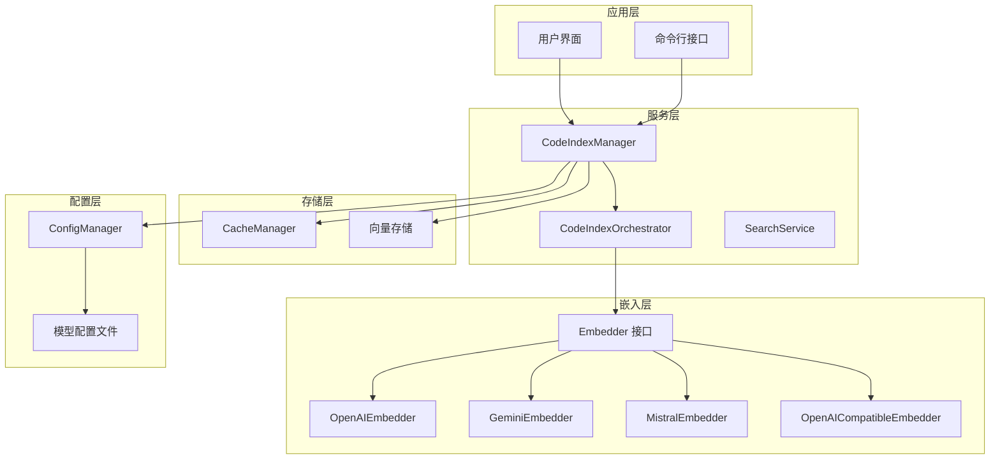
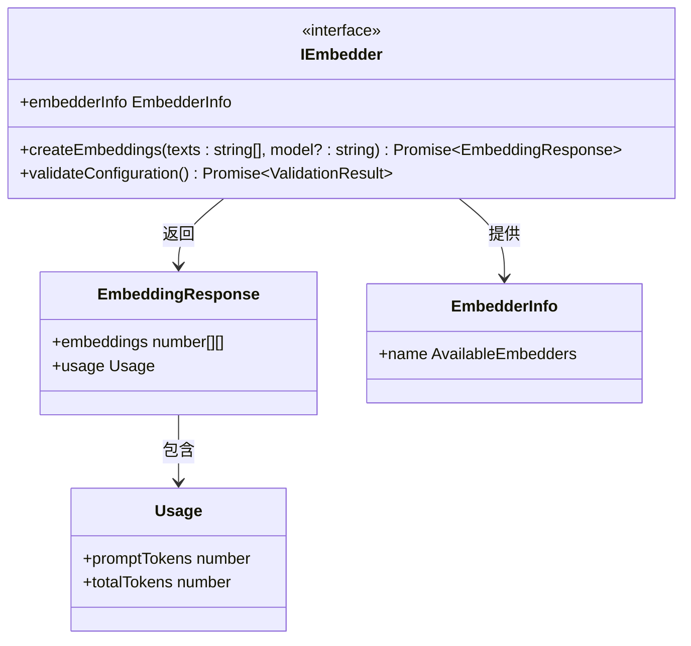
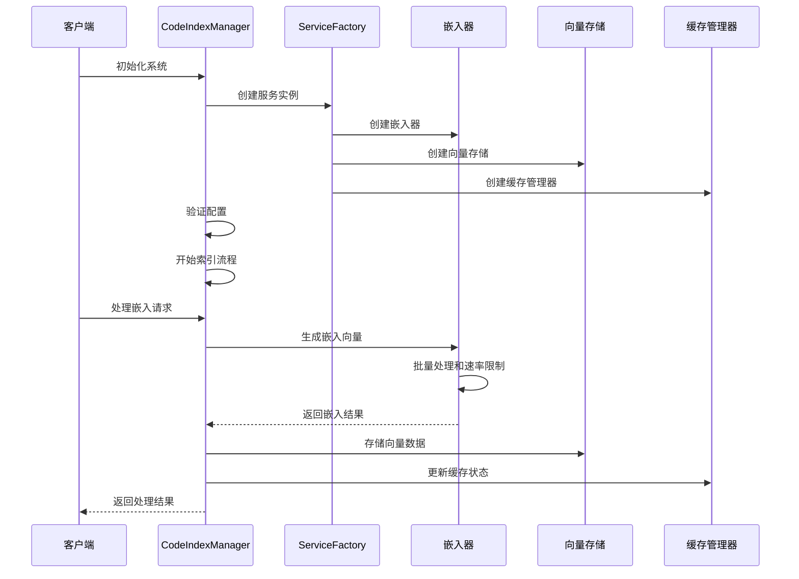
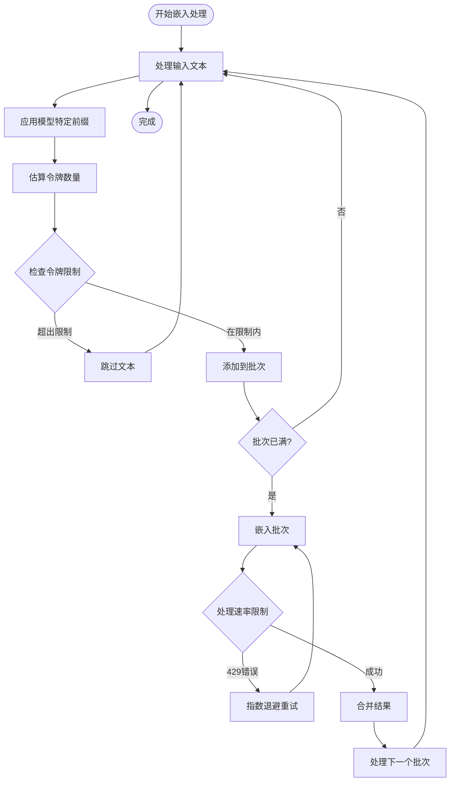
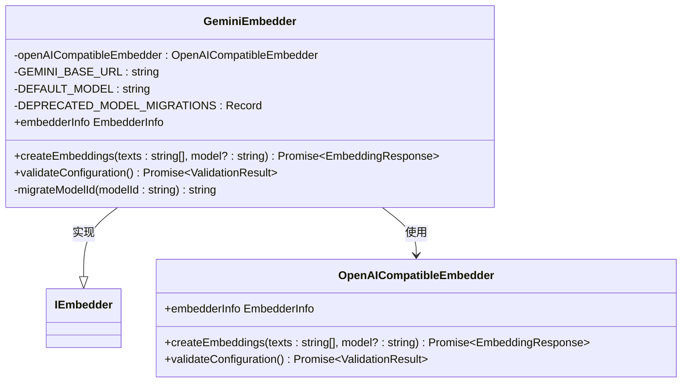
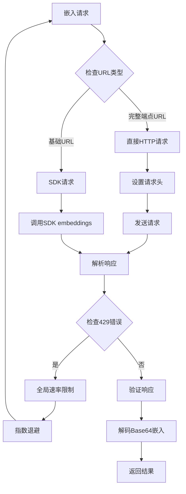
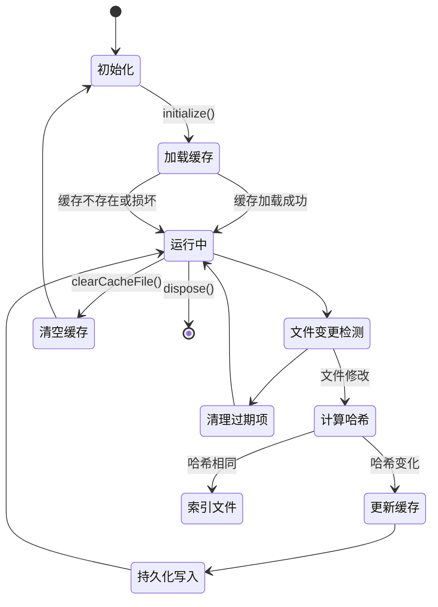
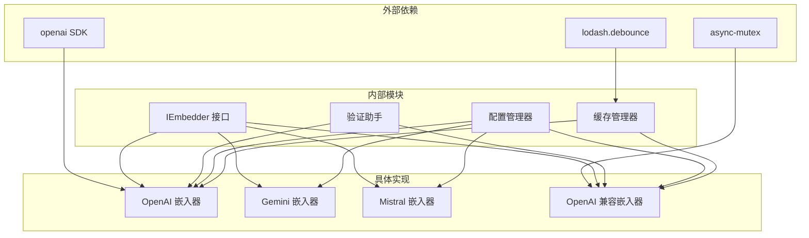
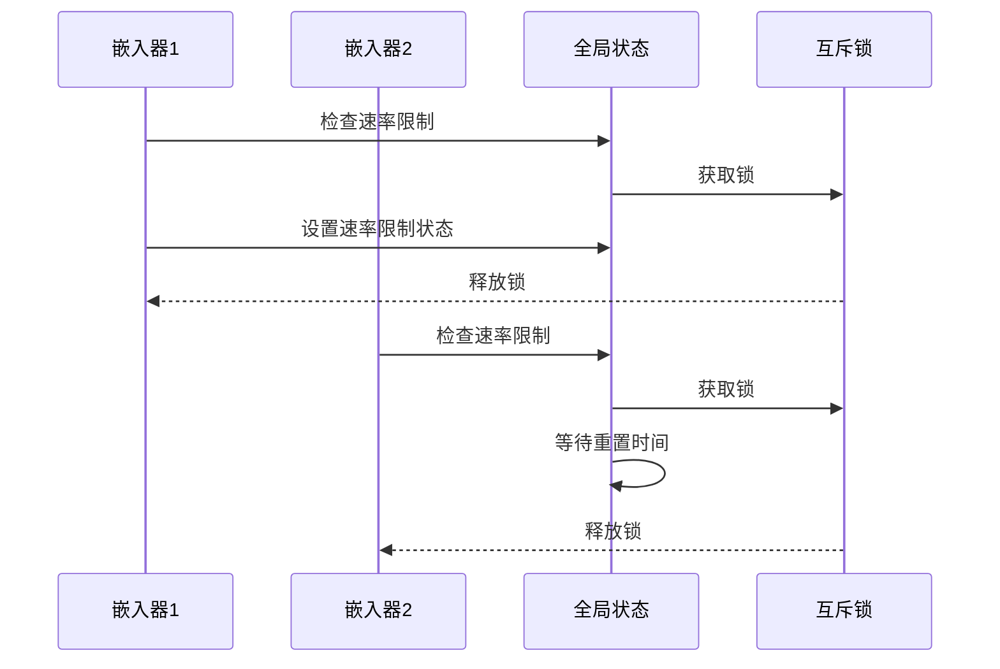
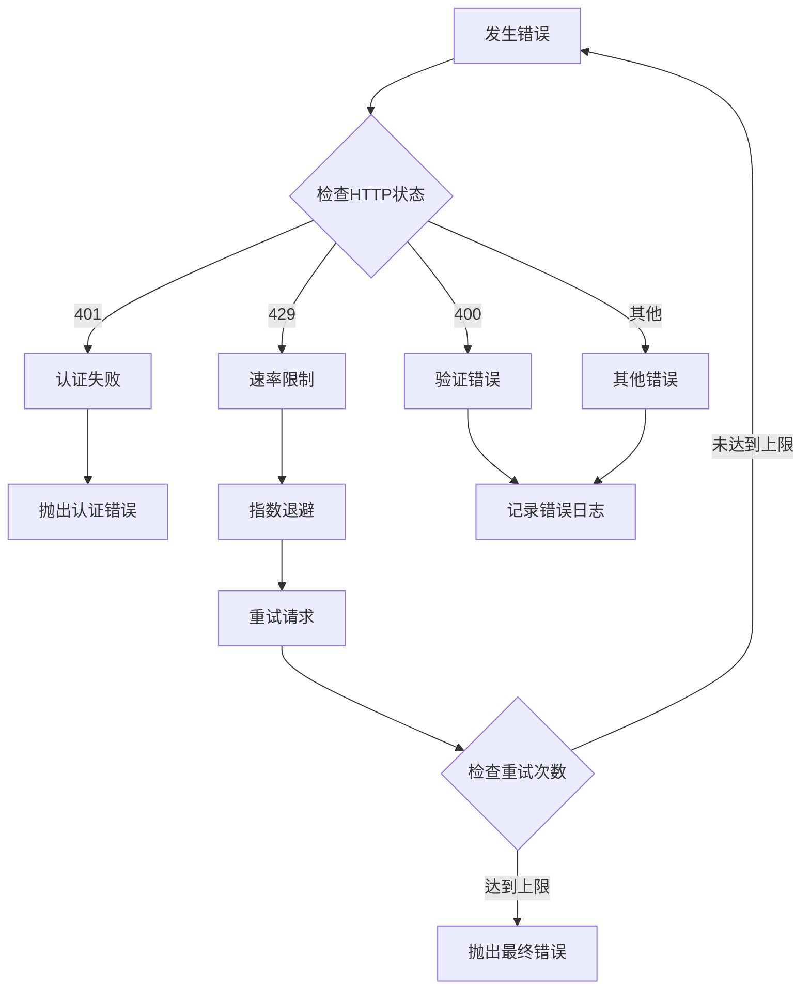

# 向量嵌入系统

<cite>
**本文档引用的文件**
- [embeddingModels.ts](file://src/shared/embeddingModels.ts)
- [embedder.ts](file://src/services/code-index/interfaces/embedder.ts)
- [openai.ts](file://src/services/code-index/embedders/openai.ts)
- [gemini.ts](file://src/services/code-index/embedders/gemini.ts)
- [mistral.ts](file://src/services/code-index/embedders/mistral.ts)
- [openai-compatible.ts](file://src/services/code-index/embedders/openai-compatible.ts)
- [service-factory.ts](file://src/services/code-index/service-factory.ts)
- [manager.ts](file://src/services/code-index/manager.ts)
- [orchestrator.ts](file://src/services/code-index/orchestrator.ts)
- [cache-manager.ts](file://src/services/code-index/cache-manager.ts)
- [validation-helpers.ts](file://src/services/code-index/shared/validation-helpers.ts)
- [embeddingModels.spec.ts](file://src/shared/__tests__/embeddingModels.spec.ts)
</cite>

## 目录
1. [简介](#简介)
2. [项目结构](#项目结构)
3. [核心组件](#核心组件)
4. [架构概览](#架构概览)
5. [详细组件分析](#详细组件分析)
6. [依赖关系分析](#依赖关系分析)
7. [性能考虑](#性能考虑)
8. [故障排除指南](#故障排除指南)
9. [结论](#结论)

## 简介

向量嵌入系统是一个基于 VS Code 扩展的智能代码索引和搜索平台，支持多种 AI 提供商的嵌入模型。该系统通过将代码内容转换为高维向量表示，实现了高效的语义搜索和代码理解功能。

系统主要特性包括：
- 多提供商嵌入模型支持（OpenAI、Gemini、Mistral 等）
- 智能批量处理和速率限制
- 增量索引和缓存管理
- 错误处理和重试机制
- 配置验证和动态重配置

## 项目结构

向量嵌入系统采用模块化架构设计，主要分为以下几个核心层次：

**图表来源**
- [manager.ts:18-92](file://src/services/code-index/manager.ts#L18-L92)
- [service-factory.ts:67-97](file://src/services/code-index/service-factory.ts#L67-L97)

**章节来源**
- [manager.ts:1-466](file://src/services/code-index/manager.ts#L1-L466)
- [service-factory.ts:133-170](file://src/services/code-index/service-factory.ts#L133-L170)

## 核心组件

### 嵌入器接口定义

系统定义了统一的嵌入器接口，确保所有提供商的实现具有一致的行为模式：

**图表来源**
- [embedder.ts:5-44](file://src/services/code-index/interfaces/embedder.ts#L5-L44)

### 模型配置管理

系统通过集中化的模型配置文件管理所有支持的嵌入模型：

| 提供商 | 模型ID | 维度 | 分数阈值 | 查询前缀 |
|--------|--------|------|----------|----------|
| OpenAI | text-embedding-3-small | 1536 | 0.4 | 无 |
| OpenAI | text-embedding-3-large | 3072 | 0.4 | 无 |
| OpenAI | text-embedding-ada-002 | 1536 | 0.4 | 无 |
| Ollama | nomic-embed-text | 768 | 0.4 | 无 |
| Ollama | nomic-embed-code | 3584 | 0.15 | 代码查询前缀 |
| Gemini | gemini-embedding-001 | 3072 | 0.4 | 无 |
| Mistral | codestral-embed-2505 | 1536 | 0.4 | 无 |

**章节来源**
- [embeddingModels.ts:8-90](file://src/shared/embeddingModels.ts#L8-L90)
- [embeddingModels.ts:155-193](file://src/shared/embeddingModels.ts#L155-L193)

## 架构概览

向量嵌入系统采用分层架构设计，实现了清晰的关注点分离：

**图表来源**
- [manager.ts:162-214](file://src/services/code-index/manager.ts#L162-L214)
- [service-factory.ts:348-424](file://src/services/code-index/service-factory.ts#L348-L424)

## 详细组件分析

### OpenAI 嵌入器实现

OpenAI 嵌入器提供了完整的批处理和速率限制功能：

**图表来源**
- [openai.ts:48-124](file://src/services/code-index/embedders/openai.ts#L48-L124)

**章节来源**
- [openai.ts:1-213](file://src/services/code-index/embedders/openai.ts#L1-L213)

### Gemini 嵌入器实现

Gemini 嵌入器通过继承 OpenAI 兼容嵌入器实现，提供自动模型迁移功能：

**图表来源**
- [gemini.ts:16-102](file://src/services/code-index/embedders/gemini.ts#L16-L102)

**章节来源**
- [gemini.ts:1-102](file://src/services/code-index/embedders/gemini.ts#L1-L102)

### Mistral 嵌入器实现

Mistral 嵌入器同样基于 OpenAI 兼容嵌入器构建：

**章节来源**
- [mistral.ts:1-80](file://src/services/code-index/embedders/mistral.ts#L1-L80)

### OpenAI 兼容嵌入器实现

OpenAI 兼容嵌入器提供了最强大的功能集，支持自定义 API 端点：

**图表来源**
- [openai-compatible.ts:254-347](file://src/services/code-index/embedders/openai-compatible.ts#L254-L347)

**章节来源**
- [openai-compatible.ts:1-481](file://src/services/code-index/embedders/openai-compatible.ts#L1-L481)

### 缓存管理系统

缓存管理系统实现了智能的文件哈希管理和增量索引：

**图表来源**
- [cache-manager.ts:36-111](file://src/services/code-index/cache-manager.ts#L36-L111)

**章节来源**
- [cache-manager.ts:1-111](file://src/services/code-index/cache-manager.ts#L1-L111)

## 依赖关系分析

系统中的组件依赖关系如下所示：

**图表来源**
- [openai.ts:1-15](file://src/services/code-index/embedders/openai.ts#L1-L15)
- [openai-compatible.ts:1-14](file://src/services/code-index/embedders/openai-compatible.ts#L1-L14)

**章节来源**
- [service-factory.ts:67-97](file://src/services/code-index/service-factory.ts#L67-L97)
- [manager.ts:1-17](file://src/services/code-index/manager.ts#L1-L17)

## 性能考虑

### 批量处理优化

系统实现了智能的批量处理策略，以最大化 API 效率：

| 参数 | OpenAI | Gemini | Mistral | OpenAI 兼容 |
|------|--------|--------|---------|-------------|
| 最大批记数 | 8191 | 8191 | 8191 | 可配置 |
| 单项最大令牌 | 8191 | 8191 | 8191 | 可配置 |
| 最大重试次数 | 3 | 3 | 3 | 3 |
| 初始重试延迟 | 1000ms | 1000ms | 1000ms | 1000ms |

### 速率限制处理

系统采用全局共享的速率限制状态，避免多个嵌入器实例之间的竞争：

**图表来源**
- [openai-compatible.ts:401-461](file://src/services/code-index/embedders/openai-compatible.ts#L401-L461)

### 内存管理

系统通过以下机制优化内存使用：
- 批次处理避免一次性加载大量数据
- 智能缓存管理减少重复计算
- 异步操作避免阻塞主线程

## 故障排除指南

### 常见错误类型及解决方案

| 错误类型 | 错误代码 | 描述 | 解决方案 |
|----------|----------|------|----------|
| 配置错误 | 401 | API 密钥无效 | 检查 API 密钥配置 |
| 网络错误 | 404 | 端点不可达 | 验证网络连接和端点URL |
| 速率限制 | 429 | 请求过于频繁 | 实施指数退避策略 |
| 超时错误 | 408/504 | 服务器响应超时 | 增加超时时间或减少批量大小 |
| 配额不足 | 400 | 超出配额限制 | 检查账户配额或升级计划 |

### 错误处理流程

**图表来源**
- [validation-helpers.ts:218-229](file://src/services/code-index/shared/validation-helpers.ts#L218-L229)

**章节来源**
- [validation-helpers.ts:80-229](file://src/services/code-index/shared/validation-helpers.ts#L80-L229)

### 配置验证

系统提供了多层次的配置验证机制：

1. **运行时验证**：每次嵌入请求前验证配置有效性
2. **启动验证**：初始化时进行完整的配置检查
3. **模型兼容性验证**：确保向量维度与模型匹配

**章节来源**
- [openai.ts:183-205](file://src/services/code-index/embedders/openai.ts#L183-L205)
- [openai-compatible.ts:353-387](file://src/services/code-index/embedders/openai-compatible.ts#L353-L387)

## 结论

向量嵌入系统通过精心设计的架构和实现，为 VS Code 提供了一个强大而灵活的代码索引和搜索解决方案。系统的主要优势包括：

### 技术优势
- **多提供商支持**：统一接口支持多种 AI 提供商
- **智能批处理**：优化的批量处理和速率限制
- **增量索引**：高效的增量更新机制
- **错误恢复**：完善的错误处理和恢复能力

### 扩展性
- **模块化设计**：清晰的组件分离便于维护和扩展
- **配置驱动**：灵活的配置选项适应不同需求
- **性能优化**：针对大规模代码库的性能优化

### 最佳实践建议
1. **合理配置批量大小**：根据 API 限制调整批量参数
2. **监控资源使用**：定期检查内存和网络使用情况
3. **备份配置**：定期备份嵌入器配置和缓存数据
4. **性能调优**：根据实际使用情况调整超时和重试参数

该系统为开发者提供了高效、可靠的代码理解和搜索能力，是现代软件开发工作流的重要组成部分。