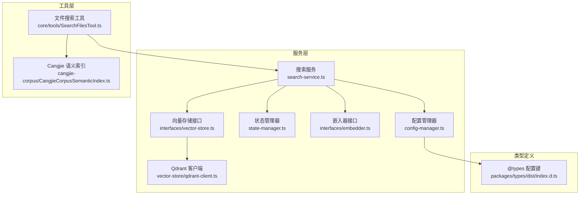
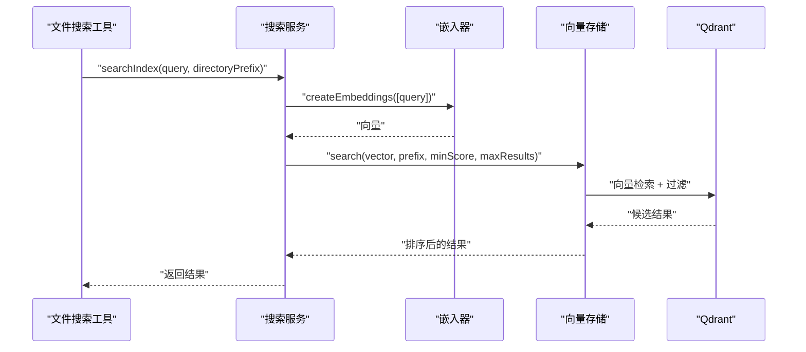
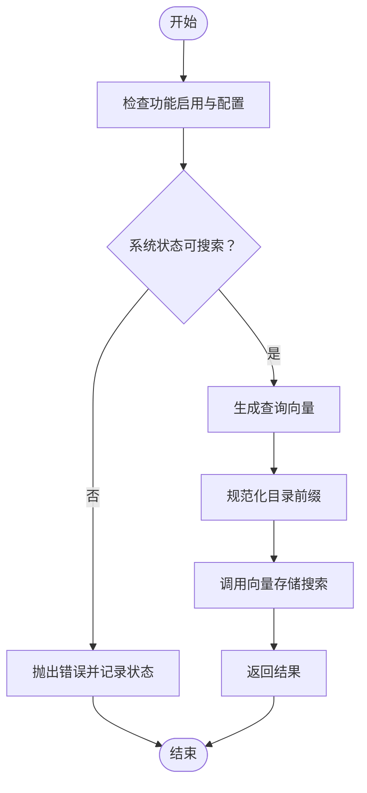
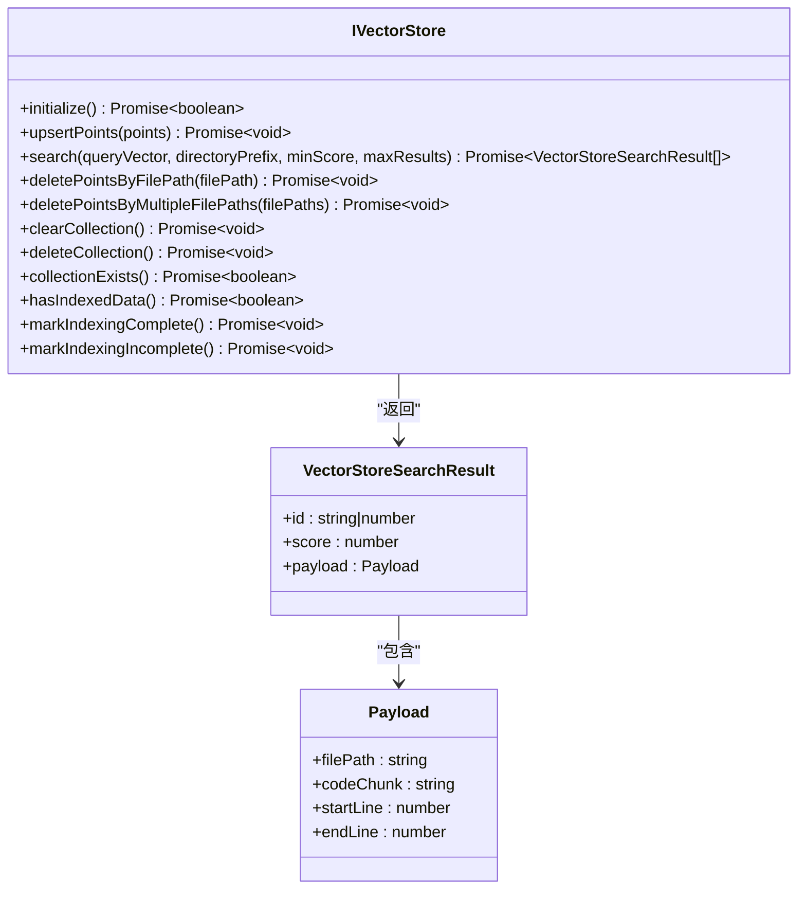
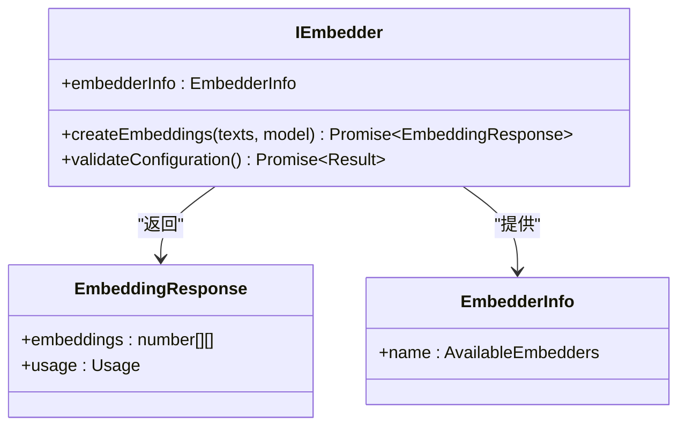
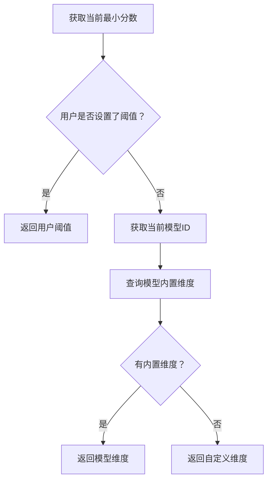
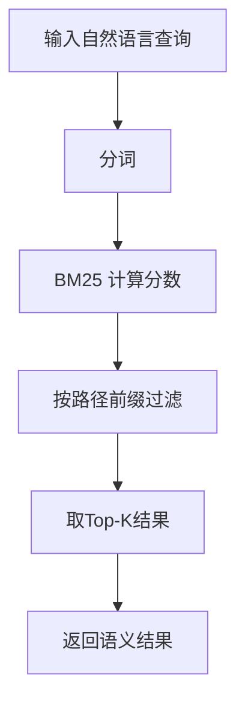
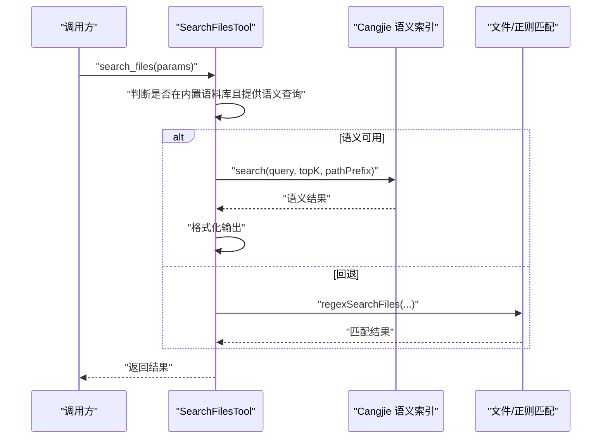
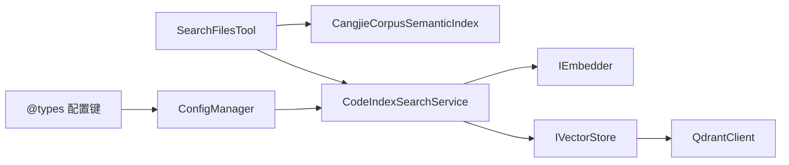

# 搜索算法与查询

<cite>
**本文引用的文件**
- [search-service.ts](file://src/services/code-index/search-service.ts)
- [vector-store.ts](file://src/services/code-index/interfaces/vector-store.ts)
- [embedder.ts](file://src/services/code-index/interfaces/embedder.ts)
- [CangjieCorpusSemanticIndex.ts](file://src/services/cangjie-corpus/CangjieCorpusSemanticIndex.ts)
- [SearchFilesTool.ts](file://src/core/tools/SearchFilesTool.ts)
- [qdrant-client.ts](file://src/services/code-index/vector-store/qdrant-client.ts)
- [config-manager.ts](file://src/services/code-index/config-manager.ts)
- [index.d.ts](file://packages/types/dist/index.d.ts)
</cite>

## 目录
1. [简介](#简介)
2. [项目结构](#项目结构)
3. [核心组件](#核心组件)
4. [架构总览](#架构总览)
5. [详细组件分析](#详细组件分析)
6. [依赖关系分析](#依赖关系分析)
7. [性能考虑](#性能考虑)
8. [故障排除指南](#故障排除指南)
9. [结论](#结论)

## 简介
本文件面向搜索算法与查询系统的技术文档，聚焦以下目标：
- 深入解释语义搜索的核心算法：向量相似度计算、相关性评分、结果排序等关键技术
- 详细说明 Qdrant 向量数据库的集成使用、查询优化、索引策略、性能调优
- 解释模糊搜索、关键词匹配、混合搜索等多策略融合机制
- 结合具体代码示例路径展示如何执行语义搜索、优化查询性能、处理大规模搜索请求、实现搜索结果的后处理和过滤

## 项目结构
本项目在服务层提供了可插拔的嵌入器（Embedder）与向量存储（Vector Store）接口，并通过配置管理器统一控制搜索阈值、最大结果数等参数；同时在工具层提供对 Cangjie 内置语料库的 BM25 关键词检索能力，支持与向量检索的混合策略。

**图表来源**
- [search-service.ts:1-66](file://src/services/code-index/search-service.ts#L1-L66)
- [vector-store.ts:1-98](file://src/services/code-index/interfaces/vector-store.ts#L1-L98)
- [embedder.ts:1-44](file://src/services/code-index/interfaces/embedder.ts#L1-L44)
- [CangjieCorpusSemanticIndex.ts:1-183](file://src/services/cangjie-corpus/CangjieCorpusSemanticIndex.ts#L1-L183)
- [SearchFilesTool.ts:33-105](file://src/core/tools/SearchFilesTool.ts#L33-L105)
- [qdrant-client.ts](file://src/services/code-index/vector-store/qdrant-client.ts)
- [config-manager.ts:493-532](file://src/services/code-index/config-manager.ts#L493-L532)
- [index.d.ts](file://packages/types/dist/index.d.ts)

**章节来源**
- [search-service.ts:1-66](file://src/services/code-index/search-service.ts#L1-L66)
- [vector-store.ts:1-98](file://src/services/code-index/interfaces/vector-store.ts#L1-L98)
- [embedder.ts:1-44](file://src/services/code-index/interfaces/embedder.ts#L1-L44)
- [CangjieCorpusSemanticIndex.ts:1-183](file://src/services/cangjie-corpus/CangjieCorpusSemanticIndex.ts#L1-L183)
- [SearchFilesTool.ts:33-105](file://src/core/tools/SearchFilesTool.ts#L33-L105)
- [qdrant-client.ts](file://src/services/code-index/vector-store/qdrant-client.ts)
- [config-manager.ts:493-532](file://src/services/code-index/config-manager.ts#L493-L532)
- [index.d.ts](file://packages/types/dist/index.d.ts)

## 核心组件
- 搜索服务（CodeIndexSearchService）
  - 负责接收查询、生成嵌入向量、调用向量存储进行相似度检索，并返回带分数的结果列表
  - 参考路径：[search-service.ts:11-66](file://src/services/code-index/search-service.ts#L11-L66)
- 向量存储接口（IVectorStore）
  - 定义初始化、Upsert、搜索、删除、集合管理等方法，屏蔽底层实现差异
  - 参考路径：[vector-store.ts:10-83](file://src/services/code-index/interfaces/vector-store.ts#L10-L83)
- 嵌入器接口（IEmbedder）
  - 统一不同供应商的嵌入生成能力，支持 OpenAI、Ollama、兼容 OpenAI 的网关等
  - 参考路径：[embedder.ts:5-21](file://src/services/code-index/interfaces/embedder.ts#L5-L21)
- Qdrant 客户端
  - 实现 IVectoreStore 接口，对接 Qdrant 向量数据库，支持向量检索、过滤、分页等
  - 参考路径：[qdrant-client.ts](file://src/services/code-index/vector-store/qdrant-client.ts)
- 配置管理器（CodeIndexConfigManager）
  - 提供最小搜索分数、最大结果数、模型维度等配置项的读取与优先级处理
  - 参考路径：[config-manager.ts:493-532](file://src/services/code-index/config-manager.ts#L493-L532)
- Cangjie 语义索引（BM25）
  - 对内置语料库进行预构建的 TF-IDF/TF-IDF 扩展（BM25）检索，支持路径前缀过滤
  - 参考路径：[CangjieCorpusSemanticIndex.ts:116-183](file://src/services/cangjie-corpus/CangjieCorpusSemanticIndex.ts#L116-L183)
- 文件搜索工具（SearchFilesTool）
  - 在特定场景下优先使用语义索引（BM25），否则回退到正则/文件模式匹配
  - 参考路径：[SearchFilesTool.ts:68-105](file://src/core/tools/SearchFilesTool.ts#L68-L105)

**章节来源**
- [search-service.ts:11-66](file://src/services/code-index/search-service.ts#L11-L66)
- [vector-store.ts:10-83](file://src/services/code-index/interfaces/vector-store.ts#L10-L83)
- [embedder.ts:5-21](file://src/services/code-index/interfaces/embedder.ts#L5-L21)
- [qdrant-client.ts](file://src/services/code-index/vector-store/qdrant-client.ts)
- [config-manager.ts:493-532](file://src/services/code-index/config-manager.ts#L493-L532)
- [CangjieCorpusSemanticIndex.ts:116-183](file://src/services/cangjie-corpus/CangjieCorpusSemanticIndex.ts#L116-L183)
- [SearchFilesTool.ts:68-105](file://src/core/tools/SearchFilesTool.ts#L68-L105)

## 架构总览
整体采用“嵌入器 + 向量存储 + 搜索服务”的分层架构，配合配置管理器与状态管理器，形成可扩展、可配置的语义搜索流水线。同时在工具层提供 BM25 关键词检索作为混合策略的一部分。

**图表来源**
- [search-service.ts:27-57](file://src/services/code-index/search-service.ts#L27-L57)
- [embedder.ts:12](file://src/services/code-index/interfaces/embedder.ts#L12)
- [vector-store.ts:31-36](file://src/services/code-index/interfaces/vector-store.ts#L31-L36)
- [qdrant-client.ts](file://src/services/code-index/vector-store/qdrant-client.ts)

## 详细组件分析

### 搜索服务（CodeIndexSearchService）
- 功能职责
  - 参数校验与状态检查：确保功能启用、配置就绪、系统处于可搜索状态
  - 嵌入生成：调用嵌入器生成查询向量
  - 查询执行：将向量传入向量存储，按最小分数与最大结果数返回
  - 错误处理：捕获异常并更新系统状态
- 关键流程
  - 输入：查询字符串、可选目录前缀
  - 输出：带分数与载荷的搜索结果数组
- 性能要点
  - 将目录前缀标准化以提升过滤效率
  - 使用配置管理器提供的阈值与上限，避免无界扫描

**图表来源**
- [search-service.ts:27-64](file://src/services/code-index/search-service.ts#L27-L64)

**章节来源**
- [search-service.ts:11-66](file://src/services/code-index/search-service.ts#L11-L66)

### 向量存储接口（IVectorStore）
- 设计要点
  - 抽象化：统一初始化、Upsert、搜索、删除、集合管理等操作
  - 可扩展：通过实现类适配不同向量数据库（如 Qdrant）
- 关键方法
  - initialize、upsertPoints、search、deletePointsByFilePath、collectionExists、markIndexingComplete 等
- 数据结构
  - PointStruct：包含 id、vector、payload
  - VectorStoreSearchResult：包含 id、score、payload

**图表来源**
- [vector-store.ts:10-98](file://src/services/code-index/interfaces/vector-store.ts#L10-L98)

**章节来源**
- [vector-store.ts:10-98](file://src/services/code-index/interfaces/vector-store.ts#L10-L98)

### 嵌入器接口（IEmbedder）
- 设计要点
  - 统一不同供应商的嵌入生成接口
  - 支持配置校验与信息查询
- 关键方法
  - createEmbeddings、validateConfiguration、embedderInfo
- 可用嵌入器类型
  - openai、ollama、openai-compatible、gemini、mistral、vercel-ai-gateway、bedrock、openrouter

**图表来源**
- [embedder.ts:5-44](file://src/services/code-index/interfaces/embedder.ts#L5-L44)

**章节来源**
- [embedder.ts:5-44](file://src/services/code-index/interfaces/embedder.ts#L5-L44)

### Qdrant 向量存储实现
- 集成方式
  - 通过实现 IVectorStore 接口对接 Qdrant，支持向量检索、过滤、分页与集合管理
- 查询优化建议
  - 使用过滤条件（如目录前缀）缩小搜索空间
  - 设置合适的最小分数与最大结果数，减少无效扫描
  - 合理选择向量维度与距离度量（内积/余弦/欧氏）以匹配嵌入器输出
- 索引策略
  - 为常用过滤字段建立索引（如文件路径前缀）
  - 控制批量 Upsert 的大小，平衡吞吐与延迟
- 性能调优
  - 调整查询并发度与超时时间
  - 利用 Qdrant 的滚动/游标式分页减少一次性传输数据量

**章节来源**
- [qdrant-client.ts](file://src/services/code-index/vector-store/qdrant-client.ts)

### 配置管理器（CodeIndexConfigManager）
- 关键配置项
  - 最小搜索分数：优先使用用户设置，其次模型特定阈值，最后默认常量
  - 最大结果数：限制返回条目数量
  - 模型维度：优先模型内置维度，否则回退自定义维度
- 作用
  - 为搜索服务提供稳定的阈值与上限参数，保证性能与质量的平衡

**图表来源**
- [config-manager.ts:525-532](file://src/services/code-index/config-manager.ts#L525-L532)
- [config-manager.ts:508-519](file://src/services/code-index/config-manager.ts#L508-L519)

**章节来源**
- [config-manager.ts:493-532](file://src/services/code-index/config-manager.ts#L493-L532)

### Cangjie 语义索引（BM25）
- 算法实现
  - 分词器：中英文混合分词，中文采用二元组+单字，英文拆分驼峰并去除非词干
  - BM25 分数：基于词频与逆文档频率，结合平均文档长度归一化
- 使用场景
  - 内置语料库的快速关键词检索，支持路径前缀过滤
- 与向量检索的融合
  - 工具层优先尝试语义检索，无结果再回退到正则/文件模式匹配

**图表来源**
- [CangjieCorpusSemanticIndex.ts:59-108](file://src/services/cangjie-corpus/CangjieCorpusSemanticIndex.ts#L59-L108)
- [CangjieCorpusSemanticIndex.ts:178-183](file://src/services/cangjie-corpus/CangjieCorpusSemanticIndex.ts#L178-L183)

**章节来源**
- [CangjieCorpusSemanticIndex.ts:1-183](file://src/services/cangjie-corpus/CangjieCorpusSemanticIndex.ts#L1-L183)

### 文件搜索工具（SearchFilesTool）
- 混合策略
  - 当目标路径位于内置语料库且提供语义查询时，优先使用 BM25 语义检索
  - 若无语义结果或不在内置语料库，则回退到正则/文件模式匹配
- 结果格式化
  - 将命中结果格式化为可读文本，包含相对路径、行号、分数与片段

**图表来源**
- [SearchFilesTool.ts:68-105](file://src/core/tools/SearchFilesTool.ts#L68-L105)
- [CangjieCorpusSemanticIndex.ts:178-183](file://src/services/cangjie-corpus/CangjieCorpusSemanticIndex.ts#L178-L183)

**章节来源**
- [SearchFilesTool.ts:33-105](file://src/core/tools/SearchFilesTool.ts#L33-L105)

## 依赖关系分析
- 组件耦合
  - 搜索服务依赖嵌入器与向量存储接口，通过配置管理器与状态管理器解耦外部环境
  - 工具层依赖搜索服务与语义索引，形成“工具 -> 服务/索引”的调用链
- 外部依赖
  - Qdrant JS REST 客户端用于向量数据库交互
  - 类型定义模块提供配置键名与密钥常量

**图表来源**
- [SearchFilesTool.ts:68-105](file://src/core/tools/SearchFilesTool.ts#L68-L105)
- [search-service.ts:12-17](file://src/services/code-index/search-service.ts#L12-L17)
- [vector-store.ts:10](file://src/services/code-index/interfaces/vector-store.ts#L10)
- [qdrant-client.ts](file://src/services/code-index/vector-store/qdrant-client.ts)
- [config-manager.ts:493-532](file://src/services/code-index/config-manager.ts#L493-L532)
- [index.d.ts](file://packages/types/dist/index.d.ts)

**章节来源**
- [SearchFilesTool.ts:68-105](file://src/core/tools/SearchFilesTool.ts#L68-L105)
- [search-service.ts:12-17](file://src/services/code-index/search-service.ts#L12-L17)
- [vector-store.ts:10](file://src/services/code-index/interfaces/vector-store.ts#L10)
- [qdrant-client.ts](file://src/services/code-index/vector-store/qdrant-client.ts)
- [config-manager.ts:493-532](file://src/services/code-index/config-manager.ts#L493-L532)
- [index.d.ts](file://packages/types/dist/index.d.ts)

## 性能考虑
- 向量相似度计算
  - 选择合适的距离度量（余弦/内积）与向量维度，确保嵌入质量与检索速度的平衡
  - 对查询向量与候选向量进行归一化，提高相似度稳定性
- 相关性评分与排序
  - 使用最小分数阈值过滤低质量候选，减少下游处理开销
  - 限制最大结果数，避免大规模排序带来的性能问题
- 查询优化
  - 在向量存储层使用过滤条件（如目录前缀）缩小搜索空间
  - 合理设置批量 Upsert 的大小与并发度，平衡吞吐与延迟
- 索引策略
  - 为高频过滤字段建立索引，提升检索效率
  - 控制索引刷新周期，在准确性与实时性之间权衡
- 混合搜索
  - 先用 BM25 快速筛选高相关候选，再用向量检索精排，降低整体延迟
  - 对于内置语料库优先使用语义检索，提升用户体验

## 故障排除指南
- 常见问题
  - 功能未启用或未配置：检查配置管理器的状态标志与关键参数
  - 系统状态不可搜索：确认索引完成或处于可搜索状态
  - 嵌入生成失败：验证嵌入器配置与凭据，确保网络连通
  - 向量存储异常：检查 Qdrant 连接参数与权限，查看客户端日志
- 排查步骤
  - 查看搜索服务的错误日志与状态更新
  - 核对最小分数与最大结果数配置是否合理
  - 验证嵌入器与向量存储的连接与认证信息
  - 对比语义检索与正则检索的结果，定位问题来源

**章节来源**
- [search-service.ts:58-63](file://src/services/code-index/search-service.ts#L58-L63)
- [config-manager.ts:525-532](file://src/services/code-index/config-manager.ts#L525-L532)

## 结论
本系统通过“嵌入器 + 向量存储 + 搜索服务”的分层设计，结合 Qdrant 的向量检索能力与内置语料库的 BM25 关键词检索，实现了高效、可扩展的语义搜索方案。通过配置管理器与状态管理器，系统在性能与质量之间取得平衡，并在工具层提供灵活的混合搜索策略，满足不同场景下的查询需求。