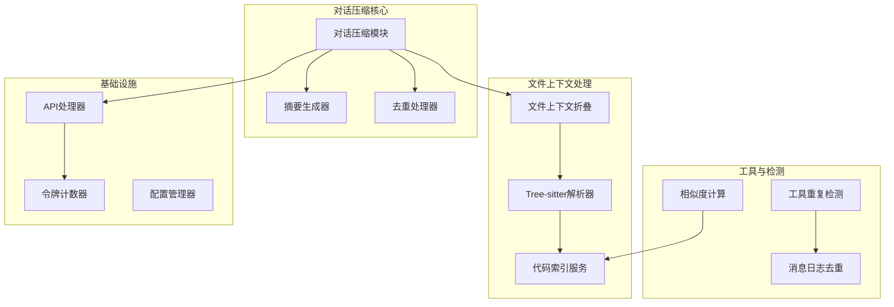
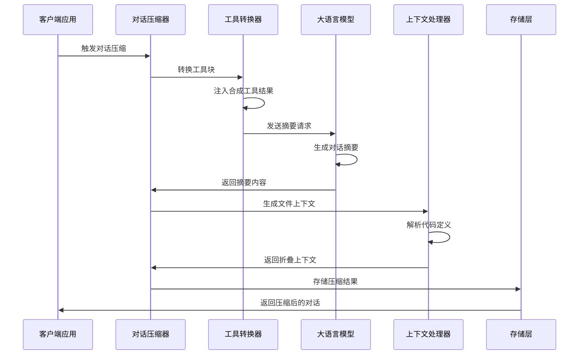
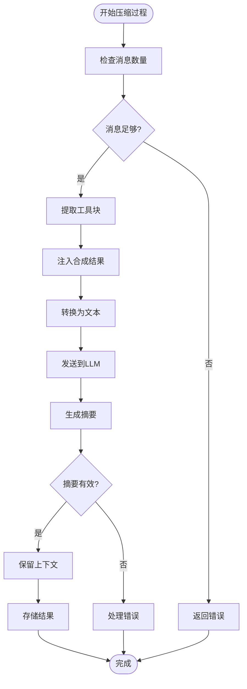
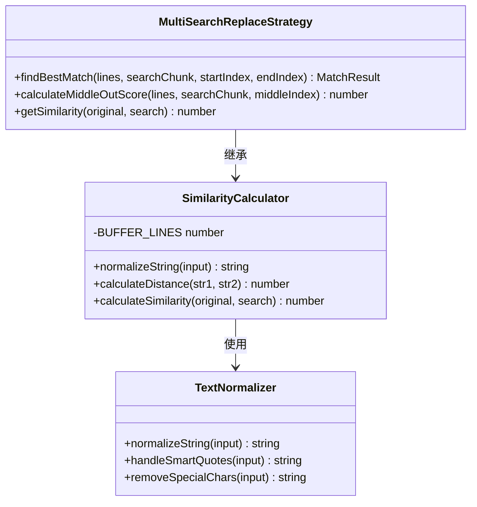
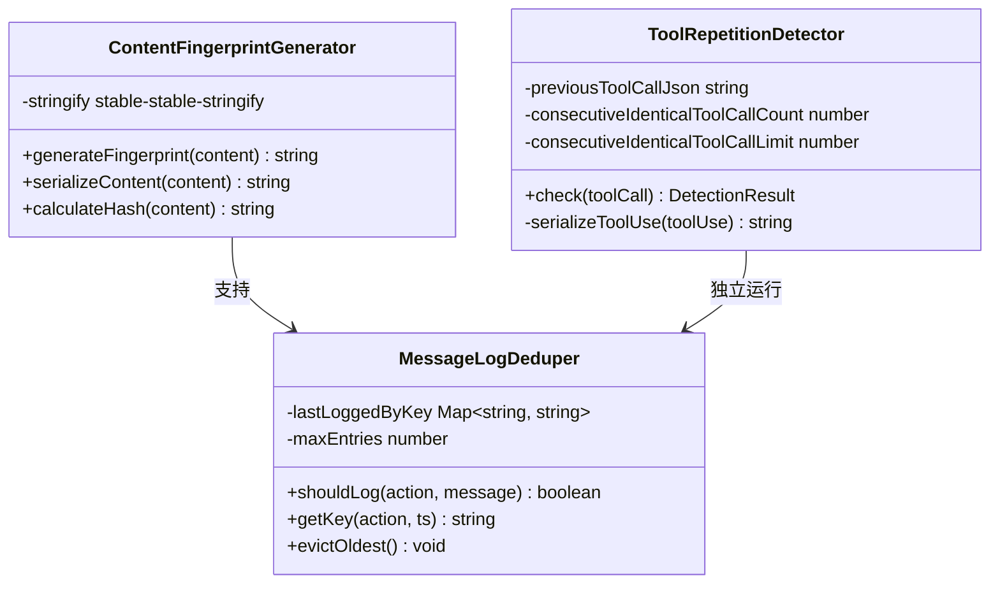
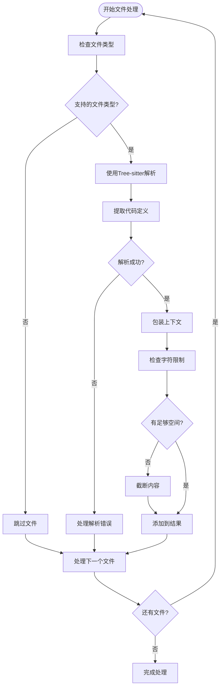
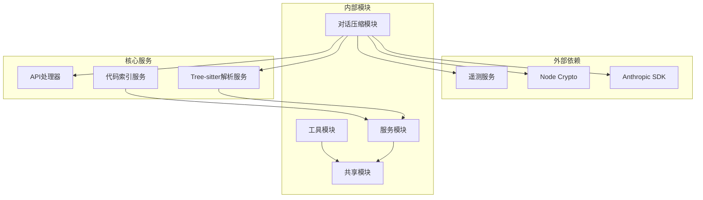

# 对话压缩与摘要

<cite>
**本文档引用的文件**
- [src/core/condense/index.ts](file://src/core/condense/index.ts)
- [src/core/condense/foldedFileContext.ts](file://src/core/condense/foldedFileContext.ts)
- [src/core/tools/ToolRepetitionDetector.ts](file://src/core/tools/ToolRepetitionDetector.ts)
- [packages/evals/src/cli/messageLogDeduper.ts](file://packages/evals/src/cli/messageLogDeduper.ts)
- [src/shared/array.ts](file://src/shared/array.ts)
- [src/services/cangjie-corpus/CangjieCorpusSemanticIndex.ts](file://src/services/cangjie-corpus/CangjieCorpusSemanticIndex.ts)
- [src/diff/strategies/multi-search-replace.ts](file://src/diff/strategies/multi-search-replace.ts)
</cite>

## 目录
1. [简介](#简介)
2. [项目结构](#项目结构)
3. [核心组件](#核心组件)
4. [架构概览](#架构概览)
5. [详细组件分析](#详细组件分析)
6. [依赖关系分析](#依赖关系分析)
7. [性能考虑](#性能考虑)
8. [故障排除指南](#故障排除指南)
9. [结论](#结论)

## 简介

对话压缩与摘要系统是一个智能的对话历史管理解决方案，旨在优化大语言模型对话中的上下文窗口使用效率。该系统通过多种先进技术实现对话压缩、智能摘要生成、去重处理和文件上下文折叠，从而在保持对话连贯性的同时最大化节省token消耗。

系统的核心特性包括：
- **智能压缩算法**：基于语义相似度和重复内容检测的高级压缩技术
- **去重处理机制**：内容指纹生成、哈希比较和冲突解决算法
- **文件上下文折叠**：智能代码定义提取和结构化表示
- **质量保证体系**：多层验证和错误处理机制
- **性能优化策略**：缓存、批处理和资源管理

## 项目结构

系统采用模块化的架构设计，主要分为以下几个核心模块：

**图表来源**
- [src/core/condense/index.ts:1-702](file://src/core/condense/index.ts#L1-L702)
- [src/core/condense/foldedFileContext.ts:1-169](file://src/core/condense/foldedFileContext.ts#L1-L169)

**章节来源**
- [src/core/condense/index.ts:1-702](file://src/core/condense/index.ts#L1-L702)
- [src/core/condense/foldedFileContext.ts:1-169](file://src/core/condense/foldedFileContext.ts#L1-L169)

## 核心组件

### 对话压缩引擎

对话压缩引擎是系统的核心组件，负责将长对话历史转换为紧凑的摘要形式。其主要功能包括：

- **消息转换**：将工具调用块转换为文本表示
- **摘要生成**：使用LLM生成高质量的对话摘要
- **上下文保留**：确保关键工作流和文件上下文在压缩过程中得到保留
- **成本控制**：精确计算和优化API调用成本

### 文件上下文折叠器

文件上下文折叠器利用Tree-sitter解析器提取代码文件的关键结构信息，实现智能的文件上下文压缩：

- **语法树解析**：支持多种编程语言的语法树构建
- **结构化提取**：提取函数签名、类声明、变量定义等关键结构
- **上下文包装**：将提取的结构包装在系统提醒块中
- **字符限制**：动态调整内容长度以适应上下文窗口限制

### 去重处理器

系统实现了多层次的去重机制，包括消息日志去重和工具调用去重：

- **消息日志去重**：基于时间戳和动作类型的智能去重
- **工具调用去重**：防止连续重复执行相同工具调用
- **内容指纹生成**：为重复内容生成唯一标识符

**章节来源**
- [src/core/condense/index.ts:256-510](file://src/core/condense/index.ts#L256-L510)
- [src/core/condense/foldedFileContext.ts:76-168](file://src/core/condense/foldedFileContext.ts#L76-L168)
- [src/core/tools/ToolRepetitionDetector.ts:1-90](file://src/core/tools/ToolRepetitionDetector.ts#L1-L90)

## 架构概览

系统采用分层架构设计，确保各组件之间的松耦合和高内聚：

**图表来源**
- [src/core/condense/index.ts:256-510](file://src/core/condense/index.ts#L256-L510)
- [src/core/condense/foldedFileContext.ts:76-168](file://src/core/condense/foldedFileContext.ts#L76-L168)

## 详细组件分析

### 智能压缩算法实现

#### 重复内容检测机制

系统实现了多层重复检测机制来识别和处理重复内容：

**图表来源**
- [src/core/condense/index.ts:134-178](file://src/core/condense/index.ts#L134-L178)
- [src/core/condense/index.ts:306-316](file://src/core/condense/index.ts#L306-L316)

#### 语义相似度计算

系统使用Levenshtein距离算法计算文本相似度：

**图表来源**
- [src/diff/strategies/multi-search-replace.ts:1-36](file://src/diff/strategies/multi-search-replace.ts#L1-L36)

**章节来源**
- [src/diff/strategies/multi-search-replace.ts:11-31](file://src/diff/strategies/multi-search-replace.ts#L11-L31)

#### 压缩比优化策略

系统实现了动态压缩比控制机制：

- **阈值管理**：最小5%，最大100%的压缩触发阈值
- **成本感知**：根据API成本动态调整压缩策略
- **质量保证**：确保压缩后的内容仍然具有足够的上下文信息

### 去重处理机制详解

#### 内容指纹生成

系统使用安全稳定的JSON序列化生成内容指纹：

**图表来源**
- [packages/evals/src/cli/messageLogDeduper.ts:1-50](file://packages/evals/src/cli/messageLogDeduper.ts#L1-L50)
- [src/core/tools/ToolRepetitionDetector.ts:76-88](file://src/core/tools/ToolRepetitionDetector.ts#L76-L88)

#### 哈希比较算法

系统实现了高效的哈希比较机制：

- **时间戳键**：`${action}:${timestamp}`组合键
- **序列化缓存**：避免重复序列化开销
- **容量管理**：自动清理最旧条目，保持内存使用稳定

**章节来源**
- [packages/evals/src/cli/messageLogDeduper.ts:11-49](file://packages/evals/src/cli/messageLogDeduper.ts#L11-L49)
- [src/core/tools/ToolRepetitionDetector.ts:29-68](file://src/core/tools/ToolRepetitionDetector.ts#L29-L68)

### 折叠文件上下文处理

#### 文件范围识别

系统能够智能识别和处理不同类型的文件范围：

**图表来源**
- [src/core/condense/foldedFileContext.ts:76-168](file://src/core/condense/foldedFileContext.ts#L76-L168)

#### 上下文关联机制

系统实现了智能的上下文关联和状态保持：

- **文件路径解析**：支持绝对和相对路径的统一处理
- **错误处理**：对无法解析的文件进行优雅降级
- **字符限制**：动态调整内容长度以适应上下文窗口

**章节来源**
- [src/core/condense/foldedFileContext.ts:76-168](file://src/core/condense/foldedFileContext.ts#L76-L168)

## 依赖关系分析

系统采用了清晰的依赖层次结构：

**图表来源**
- [src/core/condense/index.ts:1-12](file://src/core/condense/index.ts#L1-L12)
- [src/core/condense/foldedFileContext.ts:1-3](file://src/core/condense/foldedFileContext.ts#L1-L3)

**章节来源**
- [src/core/condense/index.ts:1-12](file://src/core/condense/index.ts#L1-L12)
- [src/core/condense/foldedFileContext.ts:1-3](file://src/core/condense/foldedFileContext.ts#L1-L3)

## 性能考虑

### 缓存策略

系统实现了多层次的缓存机制：

- **Tree-sitter缓存**：解析结果缓存，避免重复解析
- **API响应缓存**：LLM响应缓存，减少重复调用
- **配置缓存**：用户配置和环境详情缓存

### 内存管理

- **消息队列管理**：有限大小的消息队列，自动清理最旧消息
- **去重缓存限制**：控制去重缓存的大小，防止内存泄漏
- **字符限制控制**：动态调整内容长度，避免内存溢出

### 并发处理

- **异步处理**：所有I/O操作都是异步的
- **流式处理**：支持流式API响应处理
- **批量操作**：文件上下文处理支持批量操作

## 故障排除指南

### 常见问题诊断

#### API调用失败

当API调用失败时，系统会提供详细的错误信息：

- **错误码追踪**：捕获HTTP状态码和API错误码
- **响应体分析**：序列化API响应体用于调试
- **重试机制**：自动重试机制和错误恢复

#### 文件解析错误

对于无法解析的文件，系统会：

- **优雅降级**：跳过无法解析的文件而不是中断整个过程
- **批量日志**：将多个失败文件的日志聚合显示
- **错误分类**：区分权限错误、格式错误和解析错误

#### 内存使用过高

系统提供了内存使用监控和自动清理机制：

- **缓存清理**：定期清理过期的缓存数据
- **队列限制**：限制消息队列的最大长度
- **字符限制**：动态调整内容长度以适应可用内存

**章节来源**
- [src/core/condense/index.ts:346-386](file://src/core/condense/index.ts#L346-L386)
- [src/core/condense/foldedFileContext.ts:147-159](file://src/core/condense/foldedFileContext.ts#L147-L159)

## 结论

对话压缩与摘要系统通过集成多种先进的技术和算法，为大语言模型对话提供了高效、智能的上下文管理解决方案。系统的主要优势包括：

1. **智能压缩**：通过语义理解和重复检测实现高质量的对话压缩
2. **上下文保持**：确保关键的工作流和文件上下文在压缩过程中得到保留
3. **性能优化**：多层缓存和优化策略确保系统在高负载下的稳定性
4. **错误处理**：完善的错误处理和恢复机制保证系统的可靠性
5. **可扩展性**：模块化设计支持新功能的快速集成和现有功能的改进

该系统为开发者提供了完整的对话压缩和摘要生成解决方案，能够在保持对话连贯性和功能完整性的同时，显著提高系统的性能和效率。通过持续的优化和改进，该系统将继续为大语言模型的应用场景提供强有力的支持。