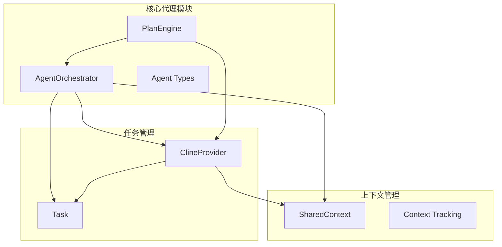
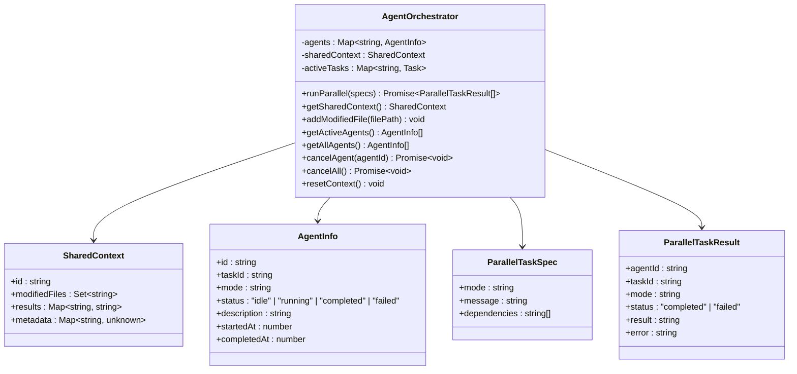
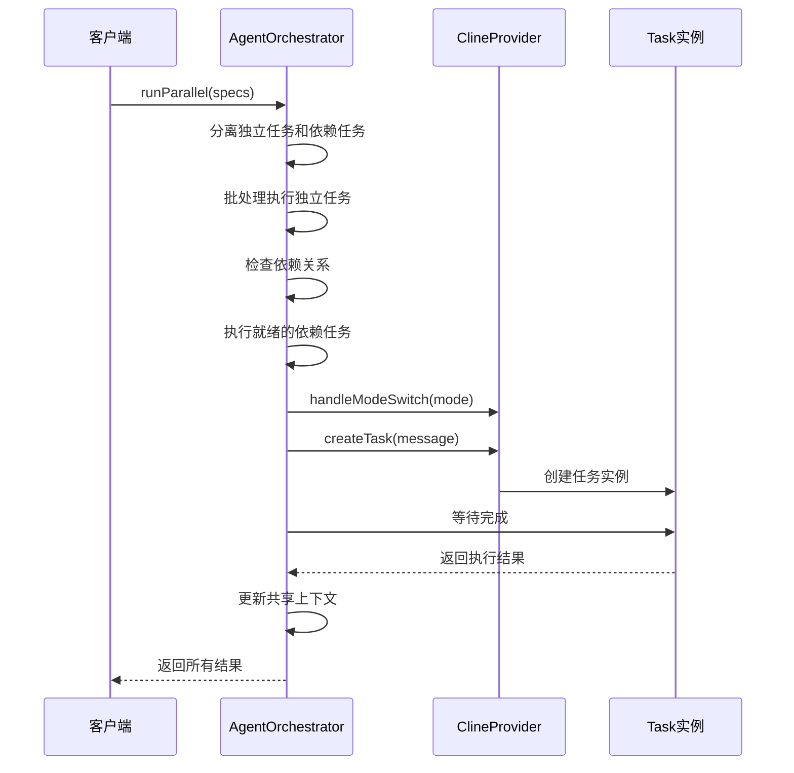
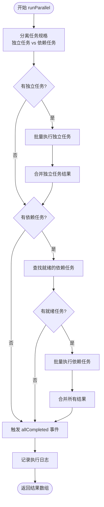
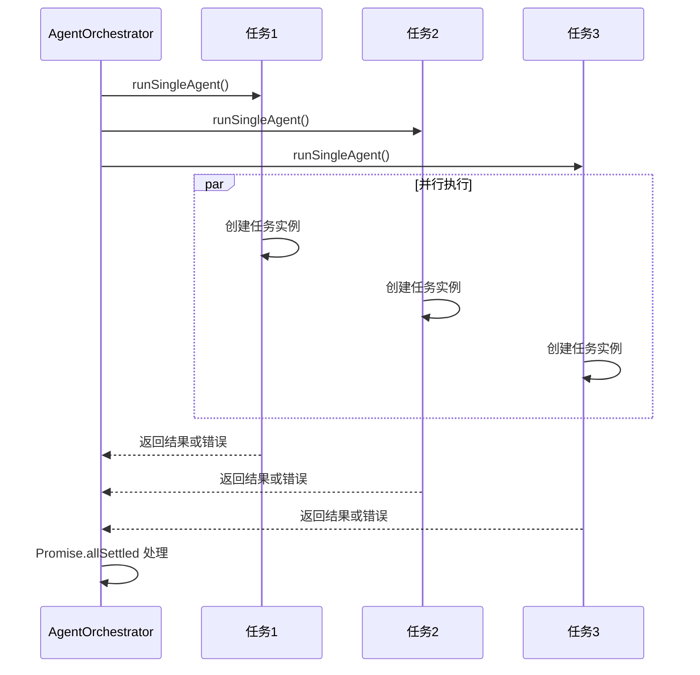
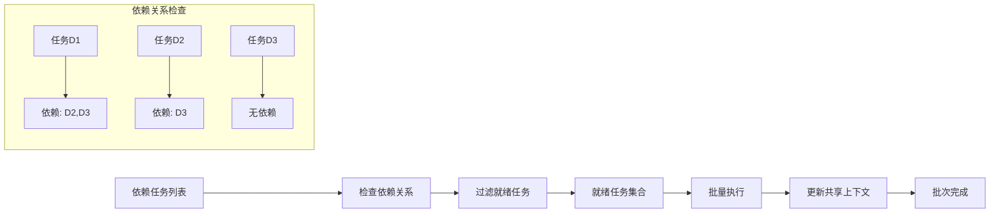
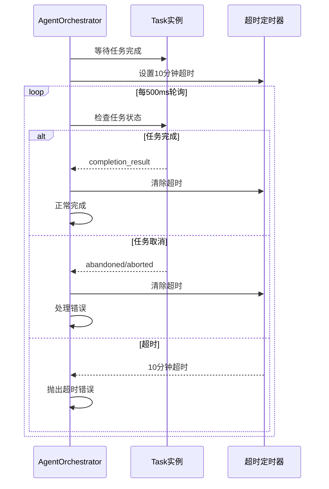
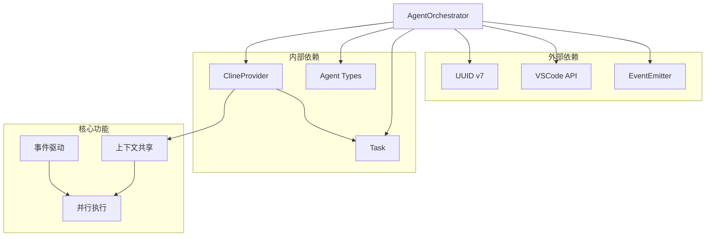

# AgentOrchestrator 核心实现

<cite>
**本文档引用的文件**
- [AgentOrchestrator.ts](file://src/core/agent/AgentOrchestrator.ts)
- [types.ts](file://src/core/agent/types.ts)
- [ClineProvider.ts](file://src/core/webview/ClineProvider.ts)
- [Task.ts](file://src/core/task/Task.ts)
- [PlanEngine.ts](file://src/core/agent/PlanEngine.ts)
</cite>

## 目录
1. [简介](#简介)
2. [项目结构](#项目结构)
3. [核心组件](#核心组件)
4. [架构概览](#架构概览)
5. [详细组件分析](#详细组件分析)
6. [依赖关系分析](#依赖关系分析)
7. [性能考虑](#性能考虑)
8. [故障排除指南](#故障排除指南)
9. [结论](#结论)

## 简介

AgentOrchestrator 是一个专门设计用于管理并行任务执行的核心组件，它扩展了现有的单任务 ClineProvider 模型，允许在后台维护一组独立的任务池，这些任务不会干扰主要的任务栈。该组件实现了事件驱动的架构，支持任务规格定义、代理生命周期管理、共享上下文构建和超时控制等关键功能。

## 项目结构

AgentOrchestrator 位于核心代理模块中，与任务管理和上下文管理紧密集成：



**图表来源**
- [AgentOrchestrator.ts:1-288](file://src/core/agent/AgentOrchestrator.ts#L1-L288)
- [ClineProvider.ts:218-225](file://src/core/webview/ClineProvider.ts#L218-L225)

**章节来源**
- [AgentOrchestrator.ts:1-50](file://src/core/agent/AgentOrchestrator.ts#L1-L50)
- [ClineProvider.ts:218-225](file://src/core/webview/ClineProvider.ts#L218-L225)

## 核心组件

### AgentOrchestrator 主要特性

AgentOrchestrator 实现了以下核心功能：

1. **并行任务执行**：支持多个 Agent 实例同时运行
2. **任务规格管理**：定义任务模式和消息规范
3. **依赖关系处理**：支持任务间的依赖关系管理
4. **共享上下文**：维护跨任务的共享状态
5. **事件驱动架构**：提供完整的生命周期事件

### 数据结构设计



**图表来源**
- [AgentOrchestrator.ts:39-288](file://src/core/agent/AgentOrchestrator.ts#L39-L288)
- [types.ts:52-68](file://src/core/agent/types.ts#L52-L68)

**章节来源**
- [AgentOrchestrator.ts:39-288](file://src/core/agent/AgentOrchestrator.ts#L39-L288)
- [types.ts:52-68](file://src/core/agent/types.ts#L52-L68)

## 架构概览

AgentOrchestrator 采用事件驱动的架构设计，通过继承 EventEmitter 来实现松耦合的组件通信：



**图表来源**
- [AgentOrchestrator.ts:61-96](file://src/core/agent/AgentOrchestrator.ts#L61-L96)
- [ClineProvider.ts:1286-1372](file://src/core/webview/ClineProvider.ts#L1286-L1372)
- [ClineProvider.ts:2619-2711](file://src/core/webview/ClineProvider.ts#L2619-L2711)

## 详细组件分析

### runParallel 方法执行流程

runParallel 方法是 AgentOrchestrator 的核心入口，实现了复杂的并行任务调度逻辑：



**图表来源**
- [AgentOrchestrator.ts:61-96](file://src/core/agent/AgentOrchestrator.ts#L61-L96)

#### 独立任务处理策略

独立任务的处理采用 Promise.allSettled 模式，确保即使部分任务失败也不会影响其他任务的执行：



**图表来源**
- [AgentOrchestrator.ts:98-114](file://src/core/agent/AgentOrchestrator.ts#L98-L114)

#### 依赖任务处理机制

依赖任务的执行基于任务 ID 的依赖关系检查，确保只有当所有依赖任务完成后才会执行：



**图表来源**
- [AgentOrchestrator.ts:78-86](file://src/core/agent/AgentOrchestrator.ts#L78-L86)

### 共享上下文构建算法

共享上下文是 AgentOrchestrator 的核心创新，实现了跨任务的状态共享：

```mermaid
classDiagram
class SharedContext {
+id : string
+modifiedFiles : Set~string~
+results : Map~string, string~
+metadata : Map~string, unknown~
+buildPrompt() string
}
class ContextBuilder {
+addModifiedFile(file : string) void
+addResult(agentId : string, result : string) void
+addMetadata(key : string, value : unknown) void
+buildPrompt() : string
}
SharedContext --> ContextBuilder
ContextBuilder --> ModifiedFiles[修改文件列表]
ContextBuilder --> Results[任务结果集]
ContextBuilder --> Metadata[元数据存储]
```

**图表来源**
- [AgentOrchestrator.ts:217-238](file://src/core/agent/AgentOrchestrator.ts#L217-L238)
- [types.ts:52-57](file://src/core/agent/types.ts#L52-L57)

#### 上下文提示构建流程

共享上下文的提示构建遵循特定的格式化规则：

1. **修改文件信息**：列出所有被其他代理修改的文件
2. **任务结果**：包含已完成任务的关键结果摘要
3. **格式化输出**：使用标准标记包围上下文信息

### 超时控制机制

AgentOrchestrator 实现了严格的超时控制，防止任务无限期挂起：



**图表来源**
- [AgentOrchestrator.ts:178-215](file://src/core/agent/AgentOrchestrator.ts#L178-L215)

### 错误处理策略

AgentOrchestrator 采用了多层次的错误处理机制：

1. **任务级错误捕获**：每个独立任务都有自己的错误处理
2. **批量错误处理**：使用 Promise.allSettled 确保部分失败不影响整体
3. **超时错误处理**：统一的超时异常处理
4. **状态恢复机制**：自动清理失败的任务状态

**章节来源**
- [AgentOrchestrator.ts:160-176](file://src/core/agent/AgentOrchestrator.ts#L160-L176)
- [AgentOrchestrator.ts:106-113](file://src/core/agent/AgentOrchestrator.ts#L106-L113)

## 依赖关系分析

AgentOrchestrator 与系统其他组件的依赖关系：



**图表来源**
- [AgentOrchestrator.ts:1-7](file://src/core/agent/AgentOrchestrator.ts#L1-L7)
- [ClineProvider.ts:96-96](file://src/core/webview/ClineProvider.ts#L96-L96)

**章节来源**
- [AgentOrchestrator.ts:1-7](file://src/core/agent/AgentOrchestrator.ts#L1-L7)
- [ClineProvider.ts:96-96](file://src/core/webview/ClineProvider.ts#L96-L96)

## 性能考虑

### 内存管理优化

AgentOrchestrator 在内存管理方面采用了多项优化策略：

1. **任务状态清理**：完成或失败的任务会从活动映射中删除
2. **上下文重置**：支持完全重置共享上下文以释放内存
3. **事件监听器管理**：动态添加和移除事件监听器

### 并发控制

系统通过以下机制控制并发度：

1. **独立任务优先**：优先执行无依赖的独立任务
2. **批量执行限制**：每个批次的任务数量可根据需要调整
3. **超时保护**：防止长时间运行的任务占用资源

## 故障排除指南

### 常见问题诊断

1. **任务超时**：检查网络连接和模型响应时间
2. **依赖循环**：验证任务依赖关系的正确性
3. **内存泄漏**：确认任务完成后的状态清理
4. **事件丢失**：检查事件监听器的注册和移除

### 调试技巧

- 使用输出通道记录详细的执行日志
- 监控活动任务的数量和状态
- 检查共享上下文的内容和大小
- 验证任务取消和重置功能

**章节来源**
- [AgentOrchestrator.ts:62-93](file://src/core/agent/AgentOrchestrator.ts#L62-L93)
- [AgentOrchestrator.ts:278-286](file://src/core/agent/AgentOrchestrator.ts#L278-L286)

## 结论

AgentOrchestrator 代表了现代 AI 代理系统架构的重要进步，它成功地解决了多任务并行执行的核心挑战。通过精心设计的事件驱动架构、智能的依赖关系管理和高效的共享上下文机制，该组件为复杂的 AI 工作流提供了强大的基础。

其关键优势包括：

1. **可扩展性**：支持任意数量的并行任务执行
2. **可靠性**：完善的错误处理和超时控制机制
3. **效率**：智能的任务调度和资源管理
4. **可维护性**：清晰的架构设计和模块化组织

该实现为未来的 AI 代理系统发展奠定了坚实的基础，特别是在处理复杂、多步骤的 AI 工作流方面展现了巨大的潜力。