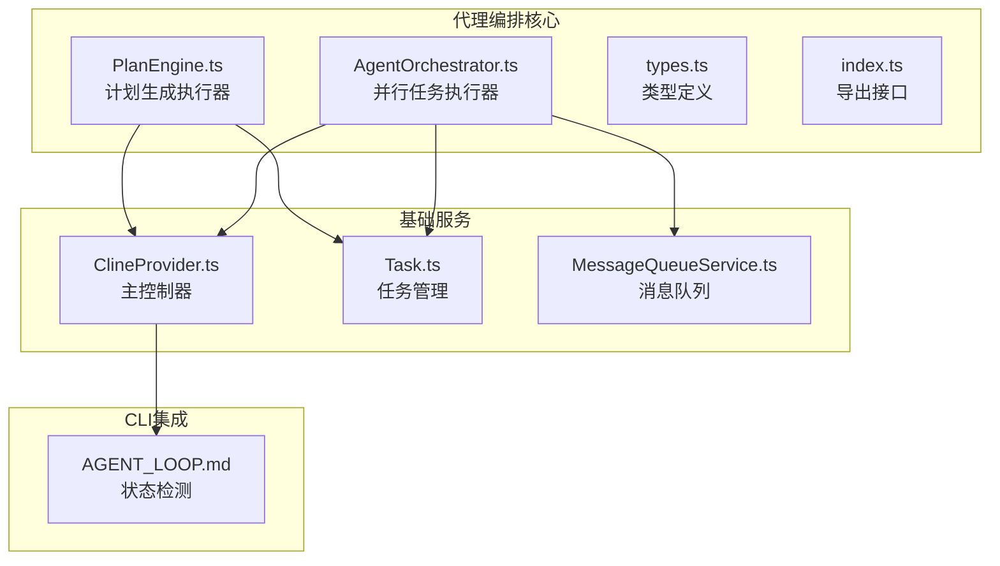
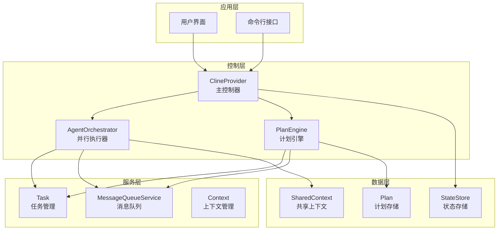
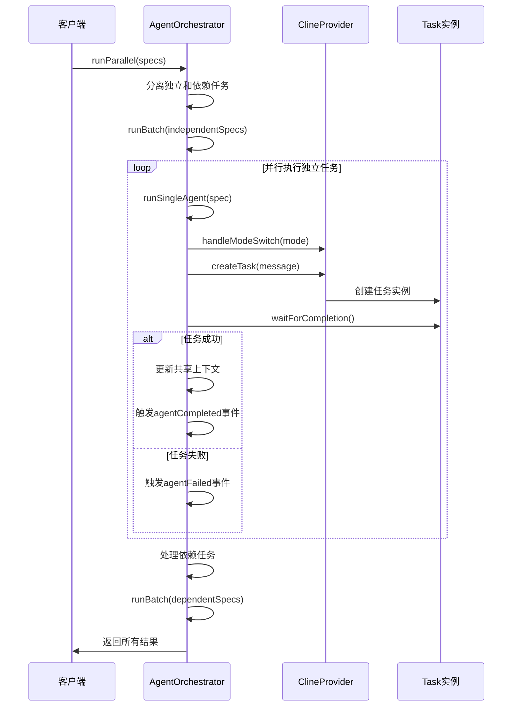
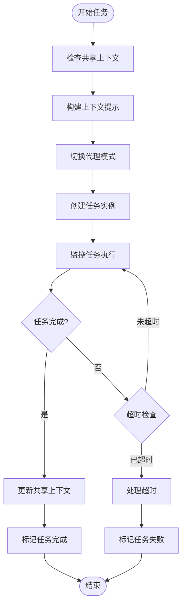
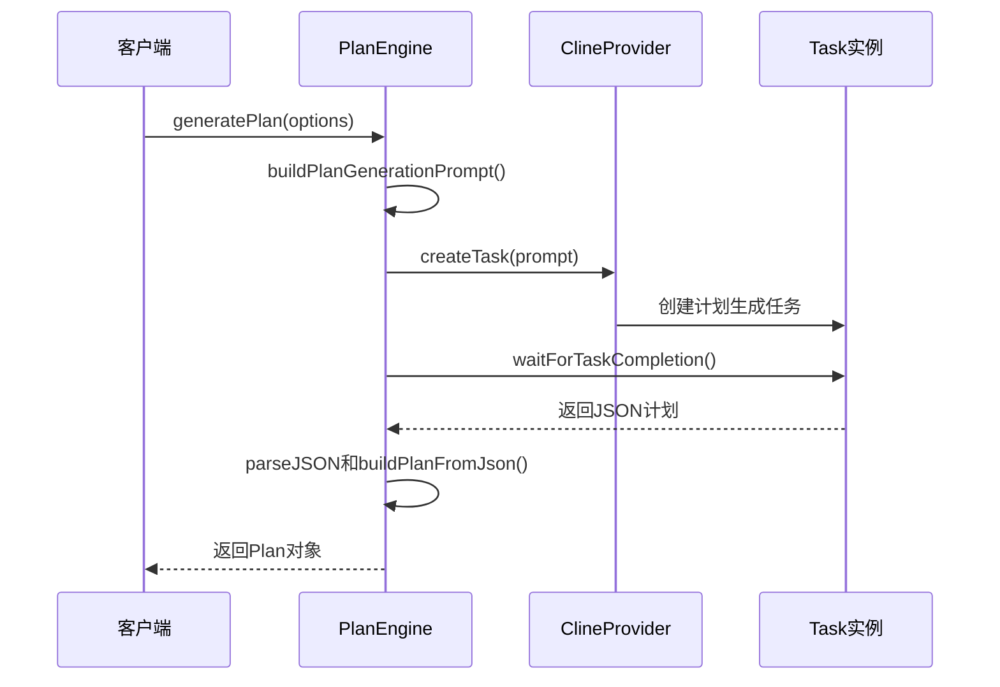
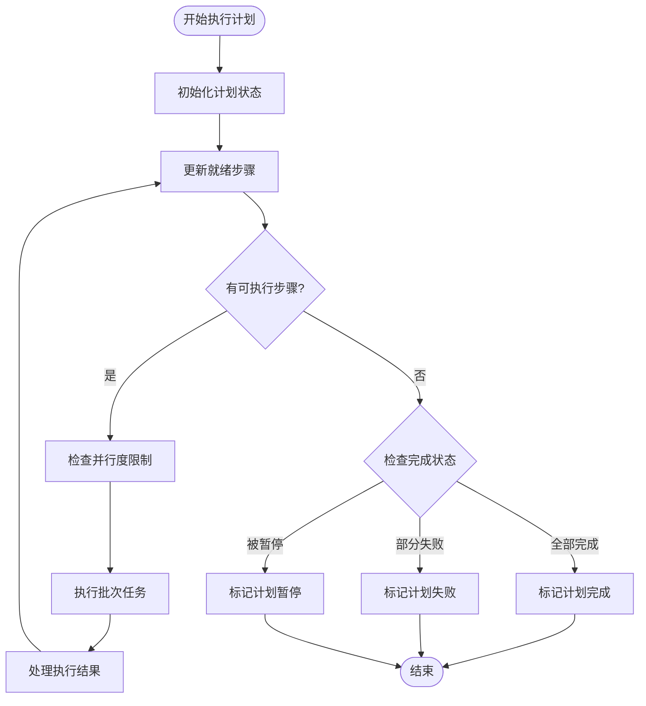
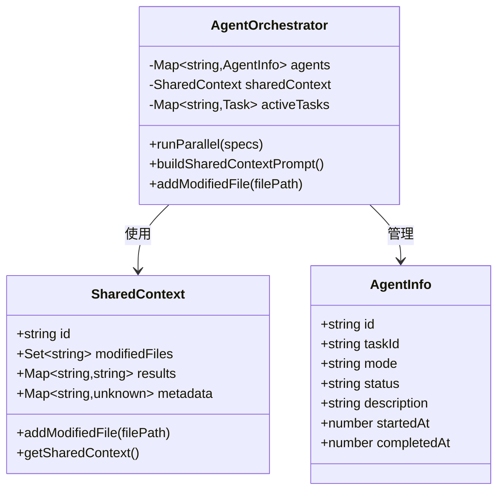
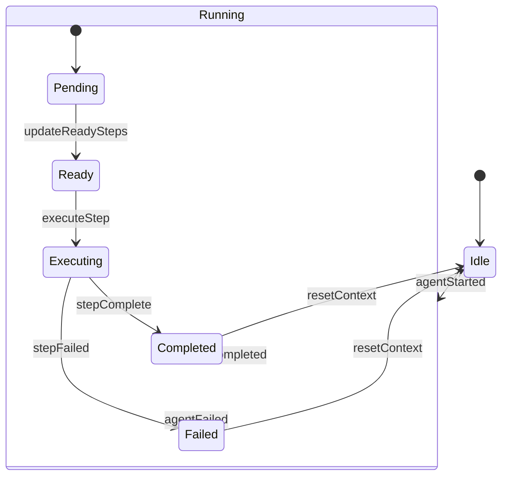
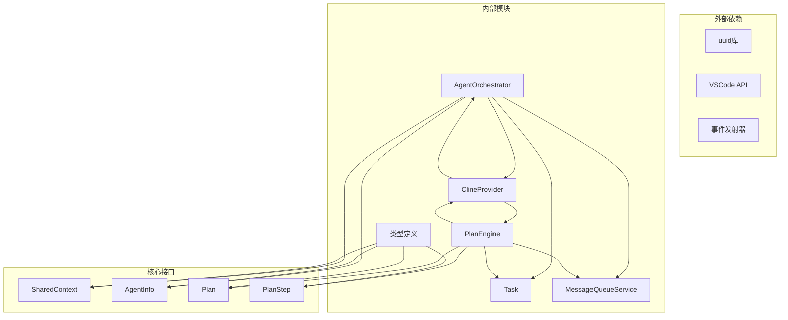

# 代理编排系统

<cite>
**本文档引用的文件**
- [AgentOrchestrator.ts](file://src/core/agent/AgentOrchestrator.ts)
- [PlanEngine.ts](file://src/core/agent/PlanEngine.ts)
- [types.ts](file://src/core/agent/types.ts)
- [index.ts](file://src/core/agent/index.ts)
- [ClineProvider.ts](file://src/core/webview/ClineProvider.ts)
- [Task.ts](file://src/core/task/Task.ts)
- [MessageQueueService.ts](file://src/core/message-queue/MessageQueueService.ts)
- [AGENT_LOOP.md](file://apps/cli/docs/AGENT_LOOP.md)
</cite>

## 目录
1. [简介](#简介)
2. [项目结构](#项目结构)
3. [核心组件](#核心组件)
4. [架构概览](#架构概览)
5. [详细组件分析](#详细组件分析)
6. [依赖关系分析](#依赖关系分析)
7. [性能考虑](#性能考虑)
8. [故障排除指南](#故障排除指南)
9. [结论](#结论)

## 简介

代理编排系统是NJU-SCAI项目中的一个关键组件，负责协调多个AI代理的并发执行。该系统通过两个核心引擎实现了智能的任务规划和执行：AgentOrchestrator用于并行任务执行，PlanEngine用于计划生成和执行。系统支持代理间的通信机制、上下文共享策略和状态同步方案，为复杂的AI代理协作提供了完整的基础设施。

## 项目结构

代理编排系统主要位于`src/core/agent`目录下，包含以下关键文件：

**图表来源**
- [AgentOrchestrator.ts:1-288](file://src/core/agent/AgentOrchestrator.ts#L1-L288)
- [PlanEngine.ts:1-429](file://src/core/agent/PlanEngine.ts#L1-L429)
- [ClineProvider.ts:126-200](file://src/core/webview/ClineProvider.ts#L126-L200)

**章节来源**
- [AgentOrchestrator.ts:1-55](file://src/core/agent/AgentOrchestrator.ts#L1-L55)
- [PlanEngine.ts:1-52](file://src/core/agent/PlanEngine.ts#L1-L52)
- [types.ts:1-68](file://src/core/agent/types.ts#L1-L68)

## 核心组件

### AgentOrchestrator 并行执行器

AgentOrchestrator是代理编排系统的核心，负责管理多个代理实例的并发执行。它扩展了现有的单任务ClineProvider模型，维护一个独立的后台任务池，不会干扰主任务栈。

**主要特性：**
- **并发任务管理**：支持多个代理实例同时运行
- **依赖解析**：自动处理任务间的依赖关系
- **上下文共享**：在代理间共享修改的文件和结果
- **事件驱动**：提供丰富的事件回调机制

### PlanEngine 计划引擎

PlanEngine实现了Plan-and-Execute架构，使用LLM生成结构化的执行计划，然后逐步执行这些步骤。

**核心功能：**
- **计划生成**：基于用户任务描述生成JSON格式的执行计划
- **依赖分析**：自动识别和处理步骤间的依赖关系
- **并行执行**：支持多步骤并行执行
- **动态调整**：支持计划暂停、恢复和重新排序

**章节来源**
- [AgentOrchestrator.ts:31-38](file://src/core/agent/AgentOrchestrator.ts#L31-L38)
- [PlanEngine.ts:39-43](file://src/core/agent/PlanEngine.ts#L39-L43)

## 架构概览

代理编排系统采用分层架构设计，确保了模块间的松耦合和高内聚：

**图表来源**
- [ClineProvider.ts:169-170](file://src/core/webview/ClineProvider.ts#L169-L170)
- [AgentOrchestrator.ts:40-42](file://src/core/agent/AgentOrchestrator.ts#L40-L42)
- [PlanEngine.ts:44-47](file://src/core/agent/PlanEngine.ts#L44-L47)

## 详细组件分析

### AgentOrchestrator 并行任务执行架构

AgentOrchestrator实现了复杂的并行任务执行机制，包括代理调度算法、任务分配策略和资源竞争处理：

#### 代理调度算法

**图表来源**
- [AgentOrchestrator.ts:61-96](file://src/core/agent/AgentOrchestrator.ts#L61-L96)
- [AgentOrchestrator.ts:98-114](file://src/core/agent/AgentOrchestrator.ts#L98-L114)

#### 任务分配策略

AgentOrchestrator采用了智能的任务分配策略：

1. **依赖分离**：首先执行没有依赖关系的任务
2. **并行执行**：独立任务使用Promise.allSettled并行执行
3. **依赖等待**：依赖任务在前置任务完成后执行
4. **资源管理**：通过activeTasks映射管理活跃任务

#### 资源竞争处理机制

系统通过多种机制处理资源竞争：

**图表来源**
- [AgentOrchestrator.ts:178-215](file://src/core/agent/AgentOrchestrator.ts#L178-L215)

**章节来源**
- [AgentOrchestrator.ts:61-96](file://src/core/agent/AgentOrchestrator.ts#L61-L96)
- [AgentOrchestrator.ts:178-215](file://src/core/agent/AgentOrchestrator.ts#L178-L215)

### PlanEngine 计划生成和执行引擎

PlanEngine实现了完整的计划生成和执行生命周期：

#### 计划生成流程

**图表来源**
- [PlanEngine.ts:54-67](file://src/core/agent/PlanEngine.ts#L54-L67)
- [PlanEngine.ts:250-263](file://src/core/agent/PlanEngine.ts#L250-L263)

#### 计划执行引擎

PlanEngine的执行引擎支持复杂的依赖管理和并行执行：

**图表来源**
- [PlanEngine.ts:69-111](file://src/core/agent/PlanEngine.ts#L69-L111)
- [PlanEngine.ts:113-148](file://src/core/agent/PlanEngine.ts#L113-L148)

**章节来源**
- [PlanEngine.ts:54-67](file://src/core/agent/PlanEngine.ts#L54-L67)
- [PlanEngine.ts:113-148](file://src/core/agent/PlanEngine.ts#L113-L148)

### 代理间通信机制

代理编排系统实现了多层次的通信机制：

#### 上下文共享策略

AgentOrchestrator通过SharedContext实现代理间的上下文共享：

**图表来源**
- [types.ts:52-57](file://src/core/agent/types.ts#L52-L57)
- [types.ts:59-67](file://src/core/agent/types.ts#L59-L67)
- [AgentOrchestrator.ts:40-42](file://src/core/agent/AgentOrchestrator.ts#L40-L42)

#### 状态同步方案

系统通过事件驱动的方式实现状态同步：

**图表来源**
- [AgentOrchestrator.ts:24-29](file://src/core/agent/AgentOrchestrator.ts#L24-L29)
- [PlanEngine.ts:13-14](file://src/core/agent/PlanEngine.ts#L13-L14)

**章节来源**
- [AgentOrchestrator.ts:217-238](file://src/core/agent/AgentOrchestrator.ts#L217-L238)
- [types.ts:52-57](file://src/core/agent/types.ts#L52-L57)

## 依赖关系分析

代理编排系统的依赖关系体现了清晰的分层架构：

**图表来源**
- [AgentOrchestrator.ts:1-7](file://src/core/agent/AgentOrchestrator.ts#L1-L7)
- [PlanEngine.ts:1-12](file://src/core/agent/PlanEngine.ts#L1-L12)
- [ClineProvider.ts:95-96](file://src/core/webview/ClineProvider.ts#L95-L96)

**章节来源**
- [index.ts:1-14](file://src/core/agent/index.ts#L1-L14)

## 性能考虑

代理编排系统在设计时充分考虑了性能优化：

### 并发执行优化

- **Promise.allSettled**：使用非阻塞的并行执行，即使部分任务失败也不会影响其他任务
- **批量处理**：支持最大并行度配置，避免资源过载
- **超时控制**：每个任务都有10分钟的超时保护

### 内存管理

- **任务清理**：任务完成后及时从activeTasks映射中删除
- **上下文重置**：支持重置共享上下文，释放内存
- **事件监听器清理**：提供dispose方法清理事件监听器

### 资源竞争处理

- **AbortController**：支持计划执行的中断和恢复
- **状态机管理**：清晰的状态转换避免竞态条件
- **原子操作**：关键操作使用原子性更新

## 故障排除指南

### 常见问题及解决方案

#### 任务超时问题

**症状**：任务执行超过10分钟后被标记为失败

**解决方案**：
1. 检查网络连接和API响应时间
2. 调整任务复杂度或拆分为更小的任务
3. 检查代理模式配置是否正确

#### 依赖任务失败

**症状**：依赖任务失败导致整个计划执行中断

**解决方案**：
1. 检查前置任务的输出和错误信息
2. 验证依赖关系定义的正确性
3. 考虑添加错误处理和重试机制

#### 内存泄漏问题

**症状**：长时间运行后内存使用持续增长

**解决方案**：
1. 确保任务完成后正确清理activeTasks映射
2. 检查事件监听器是否正确移除
3. 定期调用resetContext重置共享上下文

**章节来源**
- [AgentOrchestrator.ts:178-215](file://src/core/agent/AgentOrchestrator.ts#L178-L215)
- [PlanEngine.ts:201-238](file://src/core/agent/PlanEngine.ts#L201-L238)

## 结论

代理编排系统通过AgentOrchestrator和PlanEngine的协同工作，为AI代理的智能协作提供了完整的基础设施。系统的设计充分考虑了并发执行、依赖管理、资源竞争处理和状态同步等关键需求。

### 主要优势

1. **模块化设计**：清晰的职责分离和接口定义
2. **事件驱动架构**：灵活的状态管理和异步处理
3. **可扩展性**：支持新的代理模式和任务类型
4. **可靠性**：完善的错误处理和超时控制机制

### 技术特色

- **智能依赖解析**：自动识别和处理任务间的依赖关系
- **上下文共享**：在代理间高效共享执行结果和修改的文件
- **并行执行优化**：支持多任务并行执行和资源管理
- **动态调整能力**：支持计划的暂停、恢复和重新排序

该系统为复杂的AI代理协作场景提供了坚实的基础，能够支持从简单到复杂的各种应用场景。