# API 消息存储

<cite>
**本文档引用的文件**
- [apiMessages.ts](file://src/core/task-persistence/apiMessages.ts)
- [taskMessages.ts](file://src/core/task-persistence/taskMessages.ts)
- [TaskHistoryStore.ts](file://src/core/task-persistence/TaskHistoryStore.ts)
- [index.ts](file://src/core/message-manager/index.ts)
- [aggregateTaskCosts.ts](file://src/core/webview/aggregateTaskCosts.ts)
- [taskMetadata.ts](file://src/core/task-persistence/taskMetadata.ts)
- [MessageQueueService.ts](file://src/core/message-queue/MessageQueueService.ts)
- [messageLogDeduper.ts](file://packages/evals/src/cli/messageLogDeduper.ts)
- [validation-helpers.ts](file://src/services/code-index/shared/validation-helpers.ts)
</cite>

## 目录
1. [简介](#简介)
2. [项目结构](#项目结构)
3. [核心组件](#核心组件)
4. [架构概览](#架构概览)
5. [详细组件分析](#详细组件分析)
6. [依赖关系分析](#依赖关系分析)
7. [性能考虑](#性能考虑)
8. [故障排除指南](#故障排除指南)
9. [结论](#结论)

## 简介

本文件为 API 消息存储系统的技术文档，深入解释 API 调用消息的存储机制，包括请求和响应数据的序列化、时间戳记录、成本统计、错误信息存储等核心功能。详细说明消息分类策略（原始消息、转换后消息、工具调用消息等）和数据结构设计。解释消息去重机制、批量存储优化、内存管理策略等关键技术。结合具体代码示例展示 API 消息的完整生命周期管理，包括消息创建、更新、查询、清理等操作的最佳实践。

## 项目结构

API 消息存储系统主要分布在以下模块中：

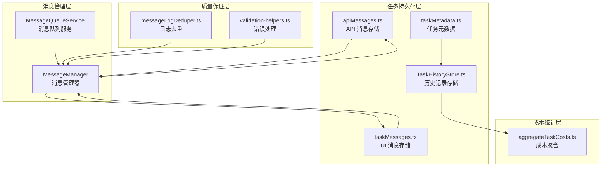

**图表来源**
- [apiMessages.ts:1-122](file://src/core/task-persistence/apiMessages.ts#L1-L122)
- [TaskHistoryStore.ts:1-573](file://src/core/task-persistence/TaskHistoryStore.ts#L1-L573)
- [MessageManager.ts:1-272](file://src/core/message-manager/index.ts#L1-L272)

**章节来源**
- [apiMessages.ts:1-122](file://src/core/task-persistence/apiMessages.ts#L1-L122)
- [taskMessages.ts:1-57](file://src/core/task-persistence/taskMessages.ts#L1-L57)
- [TaskHistoryStore.ts:1-573](file://src/core/task-persistence/TaskHistoryStore.ts#L1-L573)

## 核心组件

### API 消息数据模型

API 消息采用扩展的 Anthropic MessageParam 结构，支持多种消息类型和特殊标记：

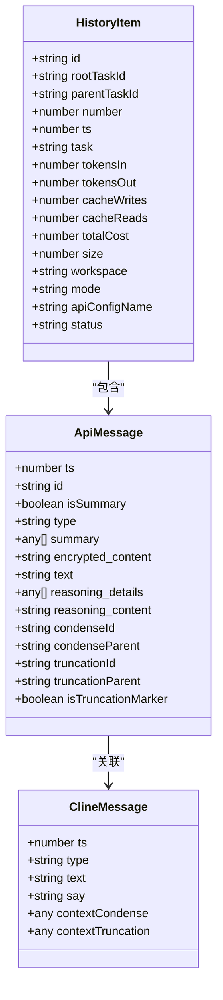

**图表来源**
- [apiMessages.ts:12-38](file://src/core/task-persistence/apiMessages.ts#L12-L38)
- [taskMetadata.ts:96-115](file://src/core/task-persistence/taskMetadata.ts#L96-L115)

### 存储架构设计

系统采用分层存储架构，确保数据一致性和性能优化：

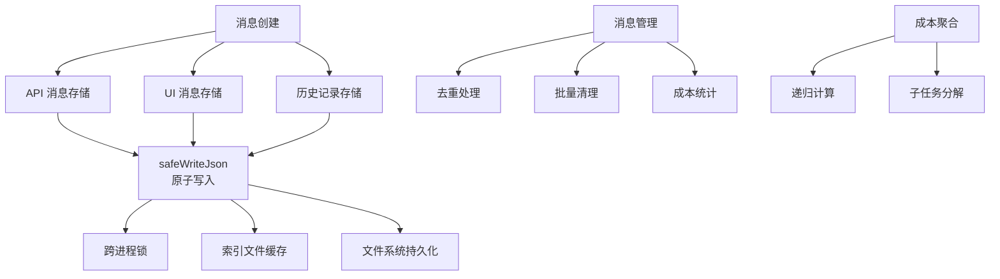

**图表来源**
- [TaskHistoryStore.ts:44-73](file://src/core/task-persistence/TaskHistoryStore.ts#L44-L73)
- [apiMessages.ts:109-121](file://src/core/task-persistence/apiMessages.ts#L109-L121)

**章节来源**
- [apiMessages.ts:12-38](file://src/core/task-persistence/apiMessages.ts#L12-L38)
- [taskMessages.ts:17-44](file://src/core/task-persistence/taskMessages.ts#L17-L44)
- [TaskHistoryStore.ts:44-73](file://src/core/task-persistence/TaskHistoryStore.ts#L44-L73)

## 架构概览

API 消息存储系统采用事件驱动的异步架构，确保高并发场景下的数据一致性：

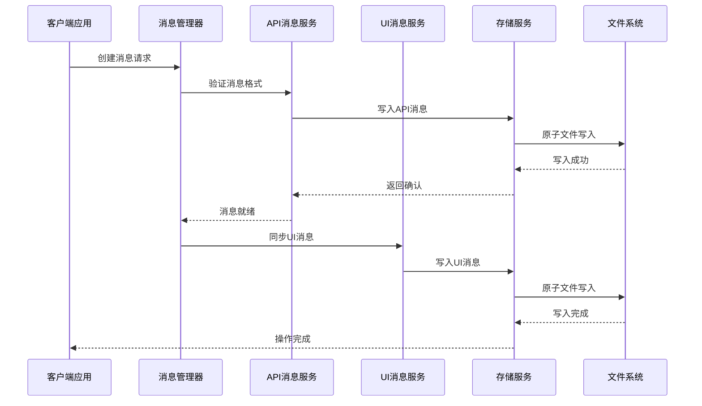

**图表来源**
- [MessageManager.ts:48-89](file://src/core/message-manager/index.ts#L48-L89)
- [apiMessages.ts:109-121](file://src/core/task-persistence/apiMessages.ts#L109-L121)

## 详细组件分析

### API 消息存储服务

API 消息存储服务提供完整的 CRUD 操作和数据验证：

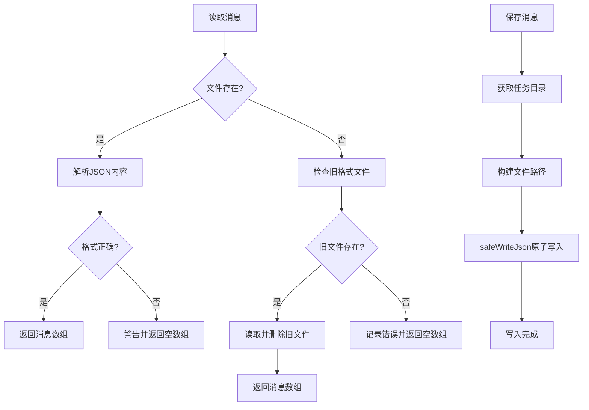

**图表来源**
- [apiMessages.ts:40-107](file://src/core/task-persistence/apiMessages.ts#L40-L107)
- [apiMessages.ts:109-121](file://src/core/task-persistence/apiMessages.ts#L109-L121)

#### 关键特性

1. **向后兼容性**: 自动检测和迁移旧格式文件
2. **错误处理**: 完善的异常捕获和降级策略
3. **原子操作**: 使用 `safeWriteJson` 确保数据一致性

**章节来源**
- [apiMessages.ts:40-121](file://src/core/task-persistence/apiMessages.ts#L40-L121)

### 消息管理器

消息管理器提供统一的消息生命周期管理：

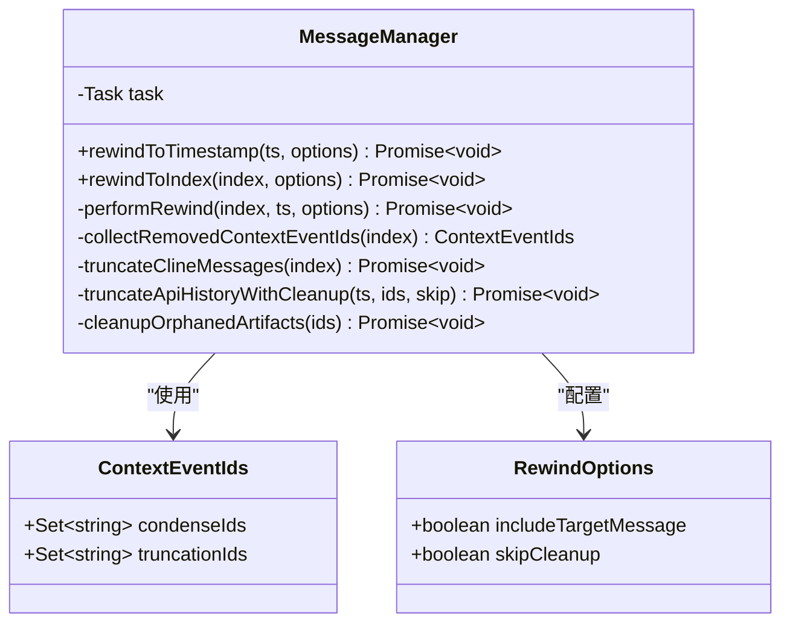

**图表来源**
- [MessageManager.ts:37-272](file://src/core/message-manager/index.ts#L37-L272)

#### 核心算法流程

消息回滚操作采用多步骤原子处理：

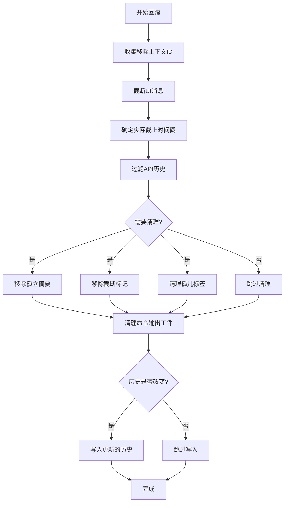

**图表来源**
- [MessageManager.ts:78-246](file://src/core/message-manager/index.ts#L78-L246)

**章节来源**
- [MessageManager.ts:48-272](file://src/core/message-manager/index.ts#L48-L272)

### 历史记录存储服务

历史记录存储服务提供高性能的索引和缓存机制：

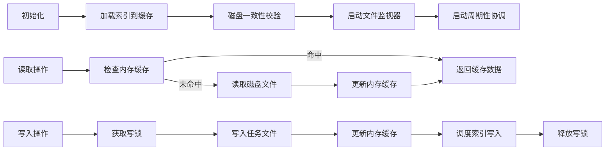

**图表来源**
- [TaskHistoryStore.ts:80-100](file://src/core/task-persistence/TaskHistoryStore.ts#L80-L100)
- [TaskHistoryStore.ts:160-185](file://src/core/task-persistence/TaskHistoryStore.ts#L160-L185)

#### 性能优化特性

1. **内存缓存**: 使用 Map 缓存最近访问的历史项
2. **延迟索引**: 使用防抖机制批量更新索引文件
3. **文件监视**: 实时监控其他实例的文件变化
4. **写锁保护**: 确保单进程内的串行化写入

**章节来源**
- [TaskHistoryStore.ts:44-573](file://src/core/task-persistence/TaskHistoryStore.ts#L44-L573)

### 成本统计系统

成本统计系统提供递归的成本聚合功能：

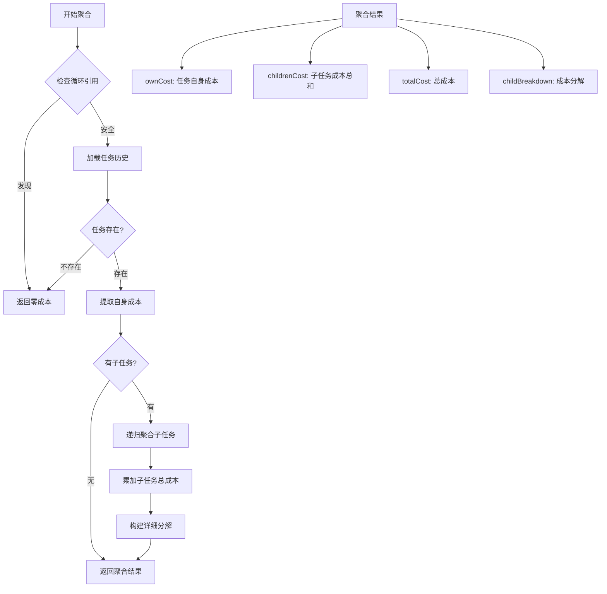

**图表来源**
- [aggregateTaskCosts.ts:21-65](file://src/core/webview/aggregateTaskCosts.ts#L21-L65)

**章节来源**
- [aggregateTaskCosts.ts:1-66](file://src/core/webview/aggregateTaskCosts.ts#L1-L66)

### 消息去重机制

消息去重系统防止重复的日志输出：

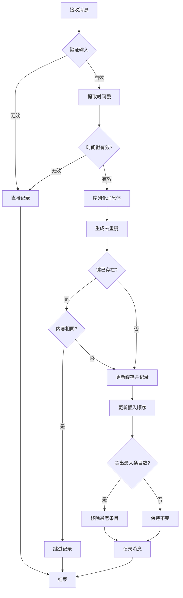

**图表来源**
- [messageLogDeduper.ts:11-49](file://packages/evals/src/cli/messageLogDeduper.ts#L11-L49)

**章节来源**
- [messageLogDeduper.ts:1-50](file://packages/evals/src/cli/messageLogDeduper.ts#L1-L50)

## 依赖关系分析

系统采用松耦合的设计模式，各组件间通过清晰的接口交互：

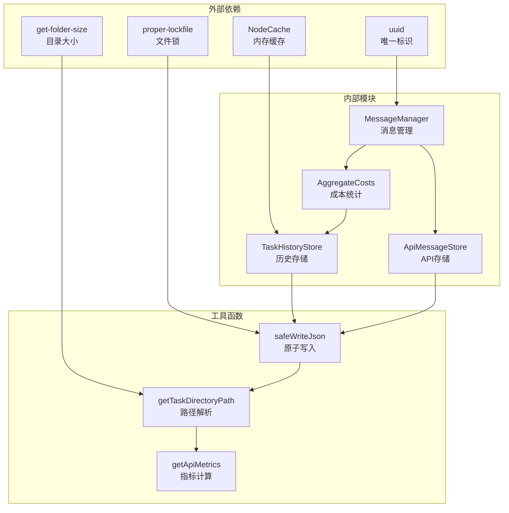

**图表来源**
- [TaskHistoryStore.ts:1-10](file://src/core/task-persistence/TaskHistoryStore.ts#L1-L10)
- [MessageManager.ts:1-8](file://src/core/message-manager/index.ts#L1-L8)

**章节来源**
- [TaskHistoryStore.ts:1-50](file://src/core/task-persistence/TaskHistoryStore.ts#L1-L50)
- [MessageManager.ts:1-37](file://src/core/message-manager/index.ts#L1-L37)

## 性能考虑

### 内存管理策略

系统采用多层缓存策略优化内存使用：

1. **任务目录大小缓存**: 使用 NodeCache 缓存目录大小，TTL 30 秒
2. **历史记录缓存**: 内存 Map 缓存最近访问的历史项
3. **去重缓存**: 限制最大条目数防止内存泄漏

### 批量操作优化

1. **索引写入防抖**: 2秒防抖窗口减少频繁写入
2. **批量删除**: 支持一次性删除多个任务的历史记录
3. **原子写入**: 使用 proper-lockfile 确保文件操作的原子性

### 并发控制

1. **写锁机制**: Promise 链确保写操作串行化
2. **文件监视**: 实时同步其他实例的变更
3. **交叉进程安全**: 基于文件锁的跨进程同步

## 故障排除指南

### 常见问题诊断

#### 文件读取失败

当遇到文件读取错误时，系统会：
1. 记录详细的错误信息到控制台
2. 返回空数组作为降级方案
3. 继续正常运行而不中断

#### 数据格式错误

对于损坏或格式不正确的文件：
1. 解析失败会被捕获并记录
2. 返回空数组避免影响其他操作
3. 建议检查文件完整性

#### 内存不足

当内存使用过高时：
1. 去重缓存会自动移除最老的条目
2. 目录大小缓存具有 TTL 自动清理
3. 建议定期清理历史记录

**章节来源**
- [apiMessages.ts:66-71](file://src/core/task-persistence/apiMessages.ts#L66-L71)
- [validation-helpers.ts:9-141](file://src/services/code-index/shared/validation-helpers.ts#L9-L141)

### 错误处理最佳实践

系统实现了多层次的错误处理机制：

1. **输入验证**: 在处理前验证所有输入参数
2. **异常捕获**: 包装所有异步操作的异常
3. **降级策略**: 当部分功能失败时不影响整体运行
4. **日志记录**: 详细的错误信息便于调试

**章节来源**
- [validation-helpers.ts:147-172](file://src/services/code-index/shared/validation-helpers.ts#L147-L172)

## 结论

API 消息存储系统通过精心设计的架构和实现，提供了可靠、高效的消息存储解决方案。系统的主要优势包括：

1. **高可靠性**: 原子文件写入和完善的错误处理
2. **高性能**: 多层缓存和批量操作优化
3. **可扩展性**: 分层架构支持功能扩展
4. **易维护性**: 清晰的代码结构和文档

该系统为 API 调用消息的完整生命周期管理提供了坚实的基础，支持复杂的消息分类、成本统计和去重机制，能够满足生产环境的各种需求。