# 任务管理系统

<cite>
**本文档引用的文件**
- [Task.ts](file://src/core/task/Task.ts)
- [CloudAgentOrchestrator.ts](file://src/core/task/CloudAgentOrchestrator.ts)
- [TaskExecutor.ts](file://src/core/task/TaskExecutor.ts)
- [TaskLifecycleHandler.ts](file://src/core/task/TaskLifecycleHandler.ts)
- [ToolExecutionOrchestrator.ts](file://src/core/task/ToolExecutionOrchestrator.ts)
- [ToolExecutionContext.ts](file://src/core/task/ToolExecutionContext.ts)
- [ServiceContainer.ts](file://src/core/di/ServiceContainer.ts)
- [interfaces.ts](file://src/core/di/interfaces.ts)
- [TaskEventBus.ts](file://src/core/events/TaskEventBus.ts)
- [AgentOrchestrator.ts](file://src/core/agent/AgentOrchestrator.ts)
- [TaskLifecycle.ts](file://src/core/task/TaskLifecycle.ts)
- [TaskHistoryStore.ts](file://src/core/task-persistence/TaskHistoryStore.ts)
- [MessageQueueService.ts](file://src/core/message-queue/MessageQueueService.ts)
- [index.ts](file://src/core/checkpoints/index.ts)
- [RepoPerTaskCheckpointService.ts](file://src/services/checkpoints/RepoPerTaskCheckpointService.ts)
- [checkpointRestoreHandler.ts](file://src/core/webview/checkpointRestoreHandler.ts)
- [AGENT_LOOP.md](file://apps/cli/docs/AGENT_LOOP.md)
- [agent-state.ts](file://apps/cli/src/agent/agent-state.ts)
</cite>

## 更新摘要
**所做更改**
- 更新了任务执行系统的架构重构部分，反映Task类已分解为多个专门组件
- 新增了依赖注入框架和服务容器模式的详细说明
- 增强了工具执行能力和事件驱动架构的描述
- 更新了组件间交互和职责分离的架构图
- 添加了新的工具执行调度器和并发控制机制

## 目录
1. [简介](#简介)
2. [项目结构](#项目结构)
3. [核心组件](#核心组件)
4. [架构概览](#架构概览)
5. [详细组件分析](#详细组件分析)
6. [依赖注入框架](#依赖注入框架)
7. [工具执行系统](#工具执行系统)
8. [事件驱动架构](#事件驱动架构)
9. [依赖关系分析](#依赖关系分析)
10. [性能考虑](#性能考虑)
11. [故障排除指南](#故障排除指南)
12. [结论](#结论)

## 简介

任务管理系统是一个基于 VS Code 扩展的智能任务执行平台，经过重大架构重构后，采用了模块化和组件化的设计理念。系统集成了 AI 模型对话、工具调用、并行任务执行和持久化存储等功能，支持多种任务模式，包括本地任务、云端代理任务和混合模式。

**更新** 系统现已分解为多个专门组件，引入了依赖注入框架和服务容器模式，增强了工具执行能力和事件驱动架构。

系统的核心特性包括：
- **模块化架构**：Task类已分解为多个专门组件（CloudAgentOrchestrator、TaskExecutor、TaskLifecycleHandler等）
- **依赖注入框架**：引入ServiceContainer提供服务注册和解析机制
- **工具执行调度**：全新的工具执行调度器和并发控制系统
- **事件驱动架构**：基于TaskEventBus的事件发布订阅机制
- **智能状态管理**：基于状态机的任务生命周期管理
- **并行任务执行**：AgentOrchestrator支持多Agent并行执行
- **持久化存储**：完整的任务历史和检查点管理
- **上下文共享**：跨任务的上下文信息共享机制

## 项目结构

项目采用高度模块化的架构设计，主要分为以下几个核心模块：

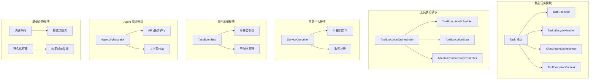

**图表来源**
- [Task.ts:511-547](file://src/core/task/Task.ts#L511-L547)
- [ServiceContainer.ts:10-46](file://src/core/di/ServiceContainer.ts#L10-L46)
- [ToolExecutionOrchestrator.ts:13-215](file://src/core/task/ToolExecutionOrchestrator.ts#L13-L215)
- [TaskEventBus.ts:31-87](file://src/core/events/TaskEventBus.ts#L31-L87)

**章节来源**
- [Task.ts:511-547](file://src/core/task/Task.ts#L511-L547)
- [ServiceContainer.ts:1-47](file://src/core/di/ServiceContainer.ts#L1-L47)

## 核心组件

### Task 类的模块化重构

Task 类经过重大重构，已从单一的庞大类分解为多个专门组件，每个组件负责特定的功能领域：

#### 分解后的组件架构

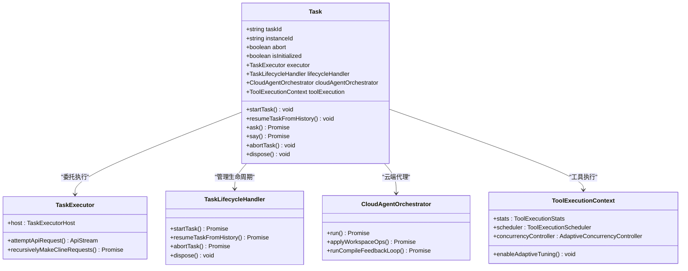

**图表来源**
- [Task.ts:511-547](file://src/core/task/Task.ts#L511-L547)
- [TaskExecutor.ts:190-191](file://src/core/task/TaskExecutor.ts#L190-L191)
- [TaskLifecycleHandler.ts:45-46](file://src/core/task/TaskLifecycleHandler.ts#L45-L46)
- [CloudAgentOrchestrator.ts:106-107](file://src/core/task/CloudAgentOrchestrator.ts#L106-L107)
- [ToolExecutionContext.ts:9-35](file://src/core/task/ToolExecutionContext.ts#L9-L35)

#### 关键接口设计

每个组件都通过接口与Task类进行交互，避免了循环依赖：

**章节来源**
- [Task.ts:517-547](file://src/core/task/Task.ts#L517-L547)
- [TaskExecutor.ts:77-186](file://src/core/task/TaskExecutor.ts#L77-L186)
- [TaskLifecycleHandler.ts:41](file://src/core/task/TaskLifecycleHandler.ts#L41)

### AgentOrchestrator 并行执行模式

AgentOrchestrator 保持原有的并行执行能力，但现在与新的模块化架构更好地集成：

#### 并行执行策略
- **独立任务执行**：每个 Agent 在独立的任务实例中运行
- **依赖管理**：支持任务间的依赖关系和执行顺序
- **资源隔离**：确保并行任务间的资源隔离和状态独立
- **结果聚合**：收集和整合各个 Agent 的执行结果

#### 上下文共享机制

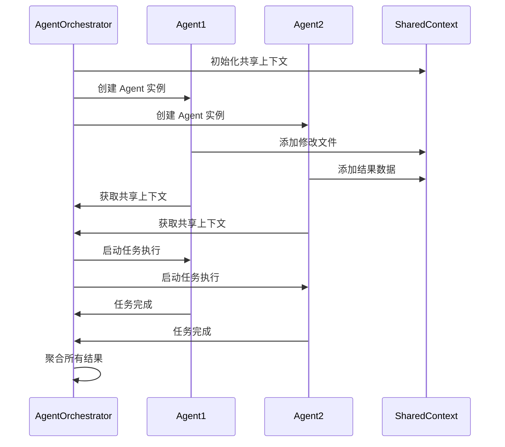

**图表来源**
- [AgentOrchestrator.ts:61-96](file://src/core/agent/AgentOrchestrator.ts#L61-L96)
- [AgentOrchestrator.ts:116-176](file://src/core/agent/AgentOrchestrator.ts#L116-L176)

**章节来源**
- [AgentOrchestrator.ts:39-287](file://src/core/agent/AgentOrchestrator.ts#L39-L287)
- [types.ts:52-68](file://src/core/agent/types.ts#L52-L68)

## 架构概览

系统采用分层架构设计，经过重构后各层职责更加清晰，耦合度降低：

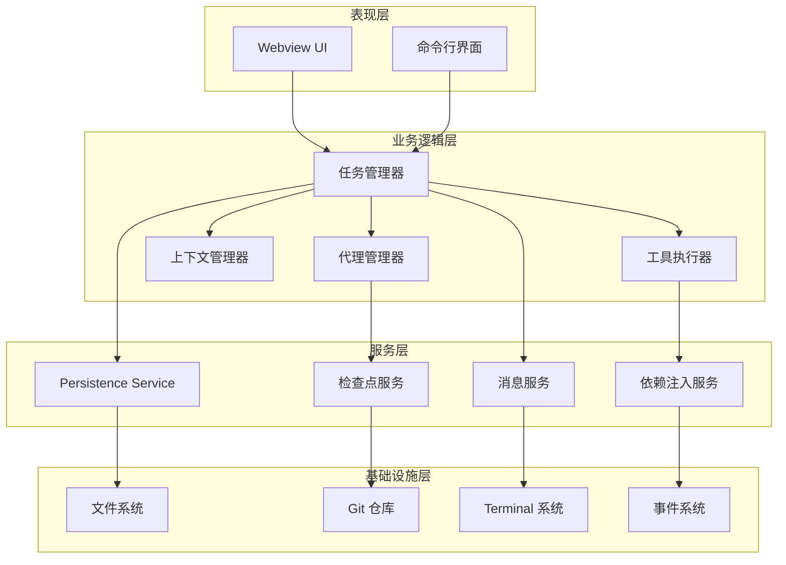

**图表来源**
- [Task.ts:511-547](file://src/core/task/Task.ts#L511-L547)
- [ServiceContainer.ts:10-46](file://src/core/di/ServiceContainer.ts#L10-L46)
- [TaskEventBus.ts:31-87](file://src/core/events/TaskEventBus.ts#L31-L87)

## 详细组件分析

### 任务生命周期管理

任务生命周期管理通过新的TaskLifecycleHandler组件实现，提供了更清晰的职责分离：

#### 生命周期状态转换

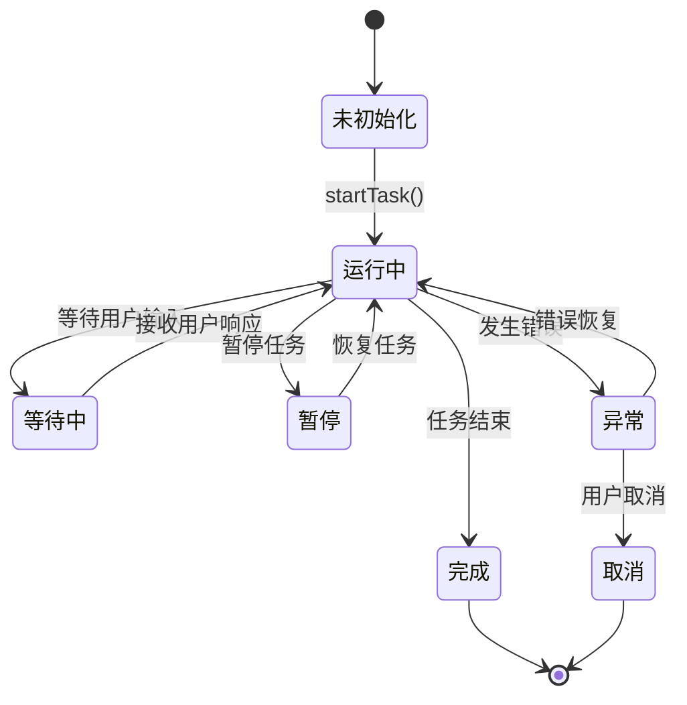

**图表来源**
- [AGENT_LOOP.md:116-142](file://apps/cli/docs/AGENT_LOOP.md#L116-L142)
- [agent-state.ts:48-46](file://apps/cli/src/agent/agent-state.ts#L48-L46)

#### 状态管理机制

新的TaskLifecycleHandler提供了完整的生命周期管理，包括启动、恢复、中止和销毁：

**章节来源**
- [TaskLifecycleHandler.ts:50-109](file://src/core/task/TaskLifecycleHandler.ts#L50-L109)
- [TaskLifecycleHandler.ts:113-313](file://src/core/task/TaskLifecycleHandler.ts#L113-L313)

### 消息处理机制

系统实现了高效的消息处理机制，支持实时通信和异步处理：

#### 消息队列设计

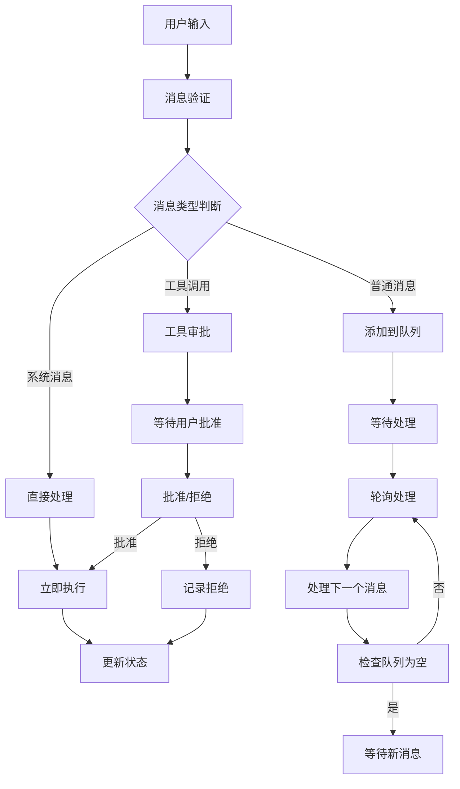

**图表来源**
- [MessageQueueService.ts:36-84](file://src/core/message-queue/MessageQueueService.ts#L36-L84)

#### 流式消息处理

系统支持流式消息处理，能够实时显示 AI 的响应过程：

**章节来源**
- [MessageQueueService.ts:1-99](file://src/core/message-queue/MessageQueueService.ts#L1-L99)

### 检查点持久化系统

检查点系统提供了强大的任务恢复能力，确保任务执行的可靠性和连续性：

#### 检查点存储架构

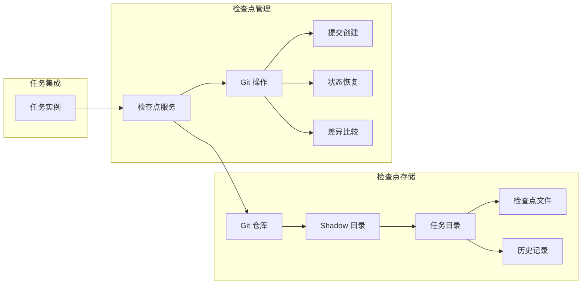

**图表来源**
- [RepoPerTaskCheckpointService.ts:6-15](file://src/services/checkpoints/RepoPerTaskCheckpointService.ts#L6-L15)
- [index.ts:28-130](file://src/core/checkpoints/index.ts#L28-L130)

#### 恢复流程设计

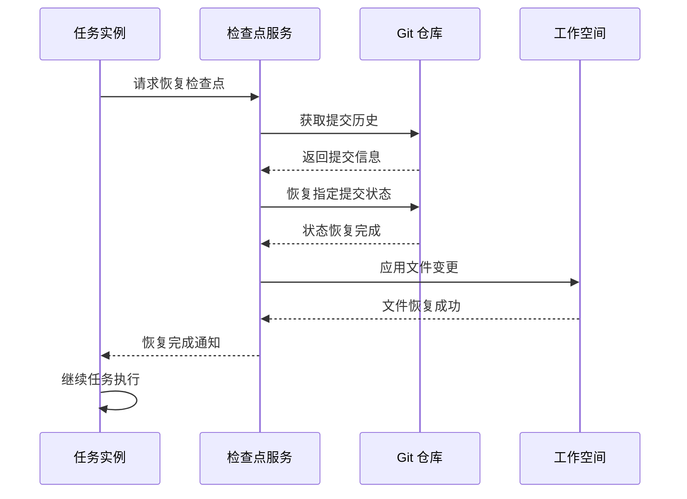

**图表来源**
- [index.ts:237-302](file://src/core/checkpoints/index.ts#L237-L302)

**章节来源**
- [index.ts:1-393](file://src/core/checkpoints/index.ts#L1-L393)
- [checkpointRestoreHandler.ts:35-75](file://src/core/webview/checkpointRestoreHandler.ts#L35-L75)

### 历史记录管理系统

历史记录系统提供了完整的任务历史追踪和管理功能：

#### 数据存储结构

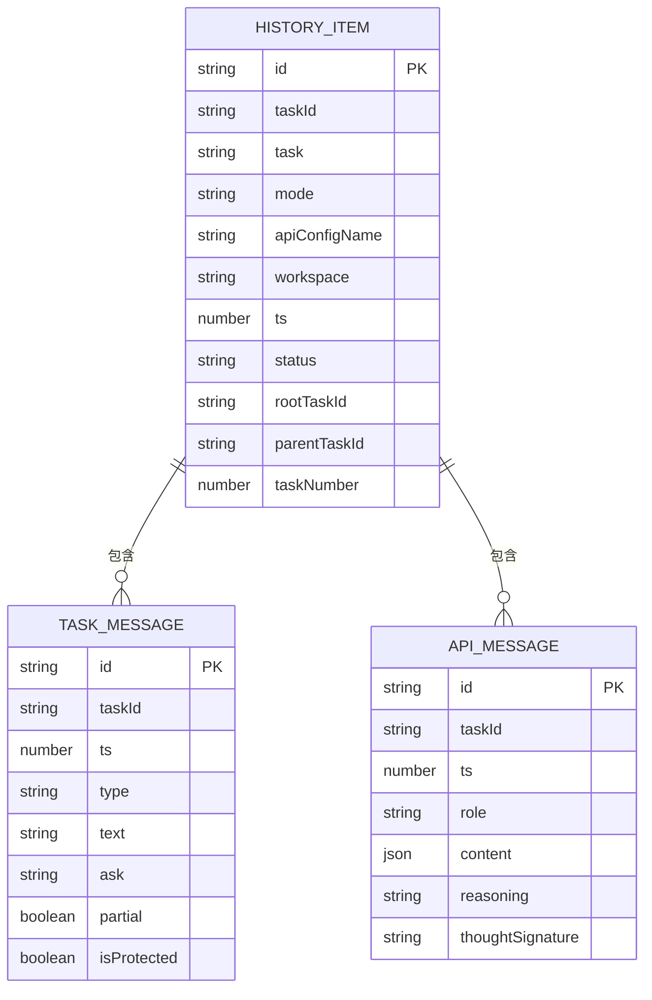

**图表来源**
- [TaskHistoryStore.ts:14-18](file://src/core/task-persistence/TaskHistoryStore.ts#L14-L18)
- [index.ts:1-5](file://src/core/task-persistence/index.ts#L1-L5)

**章节来源**
- [TaskHistoryStore.ts:44-573](file://src/core/task-persistence/TaskHistoryStore.ts#L44-L573)
- [index.ts:1-5](file://src/core/task-persistence/index.ts#L1-L5)

## 依赖注入框架

系统引入了轻量级的依赖注入框架，提供服务注册和解析机制：

### ServiceContainer 设计

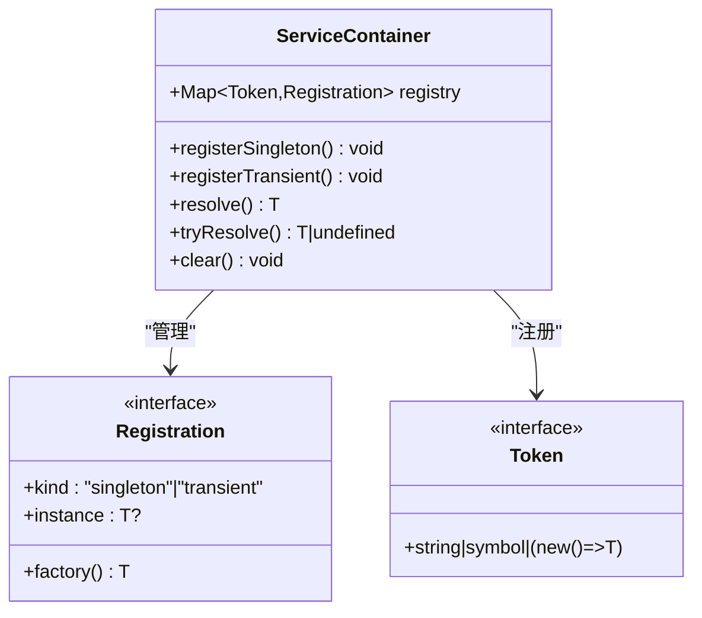

**图表来源**
- [ServiceContainer.ts:10-46](file://src/core/di/ServiceContainer.ts#L10-L46)

### 服务接口定义

系统定义了核心服务接口，用于抽象不同的服务类型：

**章节来源**
- [ServiceContainer.ts:1-47](file://src/core/di/ServiceContainer.ts#L1-L47)
- [interfaces.ts:1-29](file://src/core/di/interfaces.ts#L1-L29)

## 工具执行系统

新的工具执行系统提供了强大的并发控制和调度能力：

### 工具执行调度器

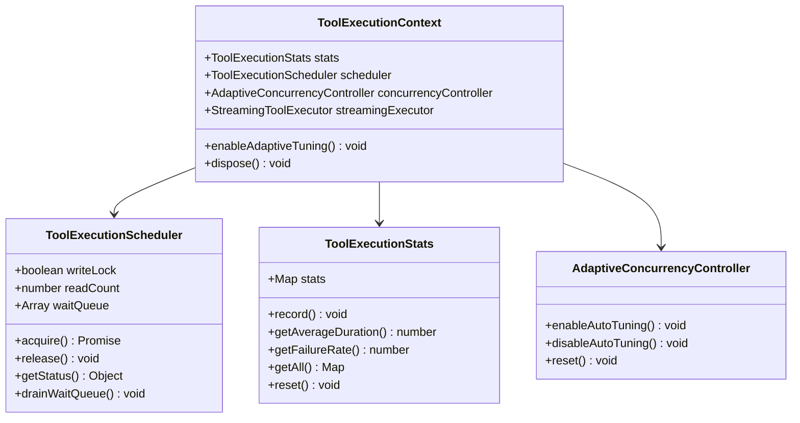

**图表来源**
- [ToolExecutionOrchestrator.ts:65-126](file://src/core/task/ToolExecutionOrchestrator.ts#L65-L126)
- [ToolExecutionOrchestrator.ts:171-215](file://src/core/task/ToolExecutionOrchestrator.ts#L171-L215)
- [ToolExecutionContext.ts:9-35](file://src/core/task/ToolExecutionContext.ts#L9-L35)

### 工具分类和优先级

系统实现了智能的工具分类和优先级调度：

**章节来源**
- [ToolExecutionOrchestrator.ts:24-49](file://src/core/task/ToolExecutionOrchestrator.ts#L24-L49)
- [ToolExecutionOrchestrator.ts:144-164](file://src/core/task/ToolExecutionOrchestrator.ts#L144-L164)

## 事件驱动架构

系统采用了事件驱动架构，通过TaskEventBus实现松耦合的组件通信：

### 事件总线设计

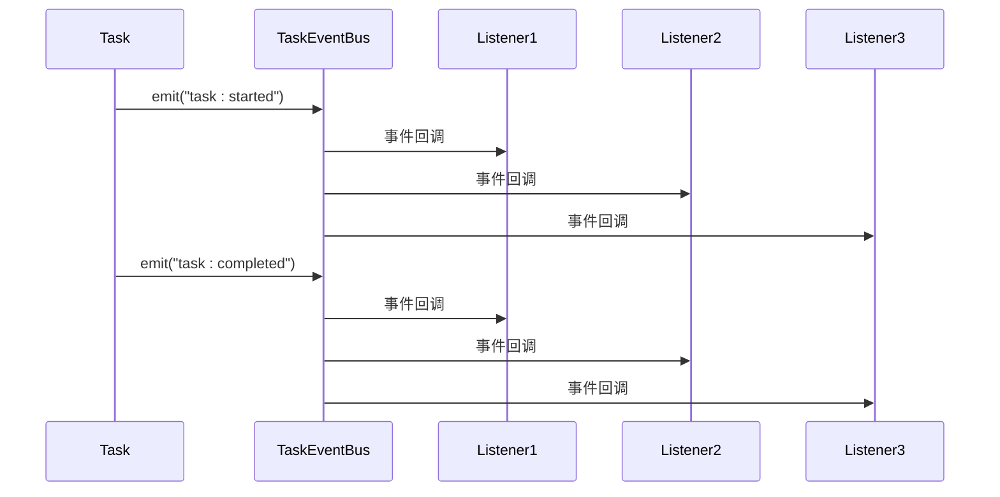

**图表来源**
- [TaskEventBus.ts:31-87](file://src/core/events/TaskEventBus.ts#L31-L87)

### 事件类型定义

系统定义了丰富的任务事件类型，支持完整的生命周期跟踪：

**章节来源**
- [TaskEventBus.ts:4-18](file://src/core/events/TaskEventBus.ts#L4-L18)
- [TaskEventBus.ts:35-87](file://src/core/events/TaskEventBus.ts#L35-L87)

## 依赖关系分析

系统采用模块化设计，各组件之间的依赖关系通过依赖注入框架管理：

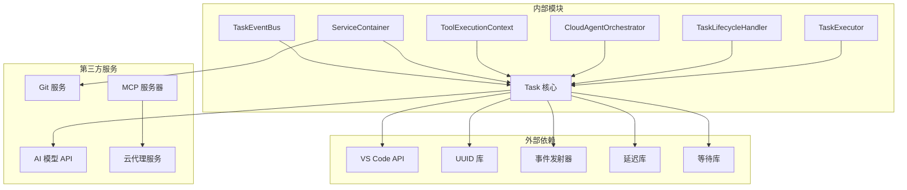

**图表来源**
- [Task.ts:1-100](file://src/core/task/Task.ts#L1-L100)
- [ServiceContainer.ts:1-47](file://src/core/di/ServiceContainer.ts#L1-L47)

**章节来源**
- [Task.ts:1-100](file://src/core/task/Task.ts#L1-L100)
- [ServiceContainer.ts:1-47](file://src/core/di/ServiceContainer.ts#L1-L47)

## 性能考虑

系统在设计时充分考虑了性能优化，采用了多种技术手段提升执行效率：

### 内存管理优化
- **对象池模式**：复用任务实例和消息对象
- **懒加载机制**：按需加载大型数据结构
- **垃圾回收优化**：及时释放不再使用的资源
- **模块化加载**：通过依赖注入按需加载组件

### 并发处理优化
- **异步操作**：所有 I/O 操作都采用异步方式
- **背压控制**：防止消息队列过载
- **资源限制**：控制同时运行的任务数量
- **工具并发控制**：通过调度器避免竞态条件

### 存储优化
- **增量保存**：只保存变化的数据
- **批量操作**：减少磁盘 I/O 次数
- **缓存策略**：合理使用内存缓存
- **检查点优化**：智能检查点间隔

## 故障排除指南

### 常见问题及解决方案

#### 任务无法启动
**症状**：任务创建后无法开始执行
**可能原因**：
- AI 模型配置错误
- 网络连接问题
- 权限不足
- 依赖注入服务未正确注册

**解决步骤**：
1. 检查 AI 模型配置是否正确
2. 验证网络连接状态
3. 确认用户权限设置
4. 检查ServiceContainer中的服务注册

#### 消息处理异常
**症状**：消息发送后无响应或响应错误
**可能原因**：
- 消息队列阻塞
- 工具调用失败
- 状态同步问题
- 事件总线监听器异常

**解决步骤**：
1. 检查消息队列状态
2. 查看工具调用日志
3. 验证任务状态同步
4. 检查事件总线监听器

#### 检查点恢复失败
**症状**：任务恢复时出现文件不一致
**可能原因**：
- Git 仓库损坏
- 文件权限问题
- 恢复目标版本冲突
- 工具执行状态不一致

**解决步骤**：
1. 检查 Git 仓库状态
2. 验证文件权限设置
3. 尝试手动恢复文件
4. 检查工具执行统计信息

**章节来源**
- [Task.ts:2248-2280](file://src/core/task/Task.ts#L2248-L2280)
- [index.ts:121-130](file://src/core/checkpoints/index.ts#L121-L130)

## 结论

经过重大架构重构的任务管理系统通过精心设计的模块化架构和完善的组件实现，为用户提供了一个强大而灵活的任务执行平台。系统的主要优势包括：

1. **模块化设计**：Task类已分解为多个专门组件，职责清晰，易于维护和扩展
2. **依赖注入框架**：引入ServiceContainer提供灵活的服务管理和依赖解析
3. **强大的工具执行系统**：全新的工具执行调度器和并发控制系统
4. **事件驱动架构**：基于TaskEventBus的松耦合组件通信机制
5. **完整的生命周期管理**：从创建到完成的全周期支持
6. **强大的并行处理能力**：支持多 Agent 协同工作
7. **可靠的持久化机制**：确保任务执行的连续性和可靠性
8. **优秀的性能表现**：优化的内存和并发处理机制

系统的模块化设计使得扩展和维护变得简单，为未来的功能增强奠定了良好的基础。通过持续的优化和改进，该系统能够满足各种复杂任务管理需求，为用户提供卓越的使用体验。

**更新** 新的架构不仅提升了系统的可维护性和可扩展性，还为未来的功能增强提供了更好的基础，特别是在工具执行能力和事件驱动架构方面有了显著的改进。