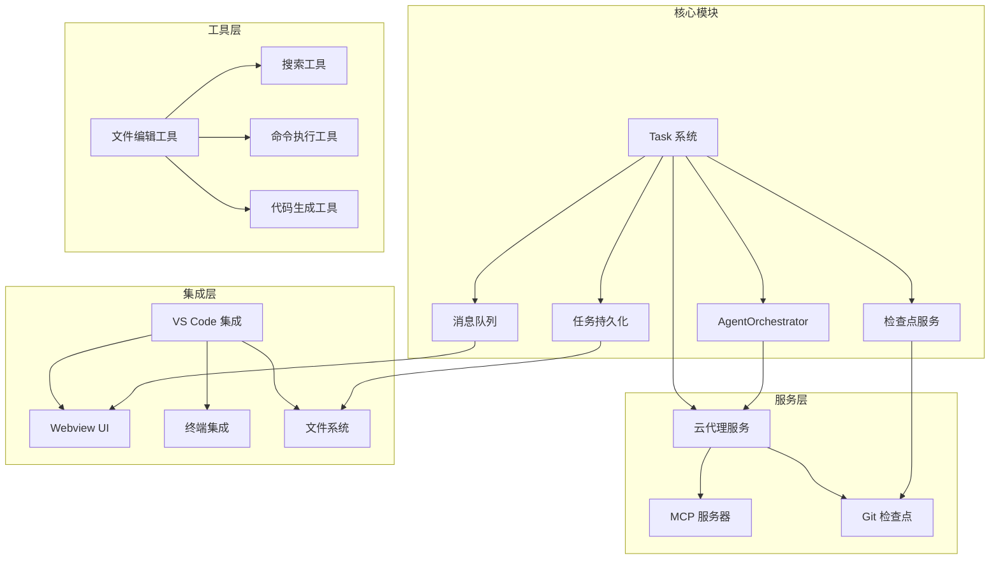
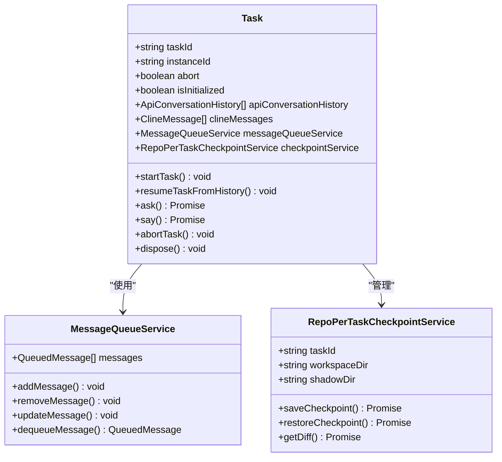
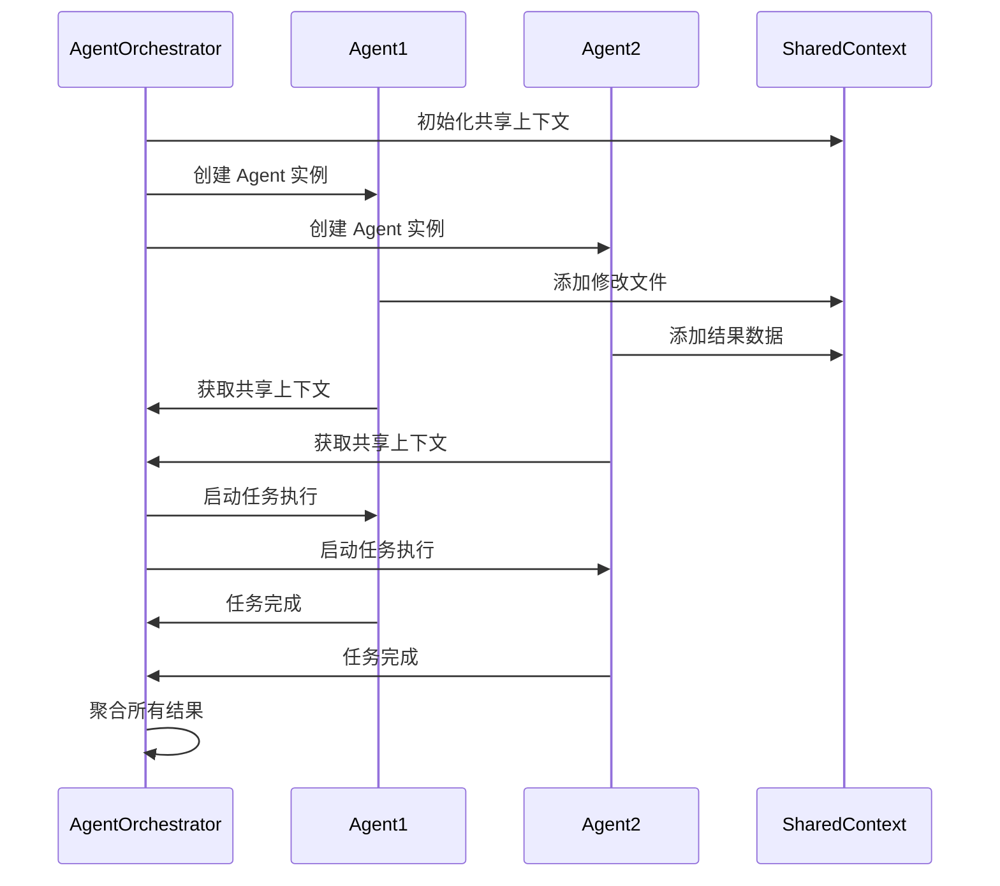
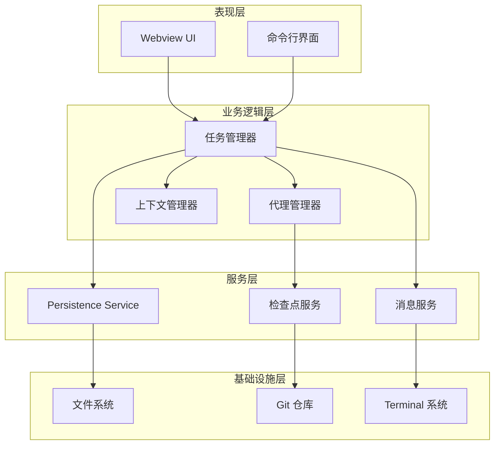
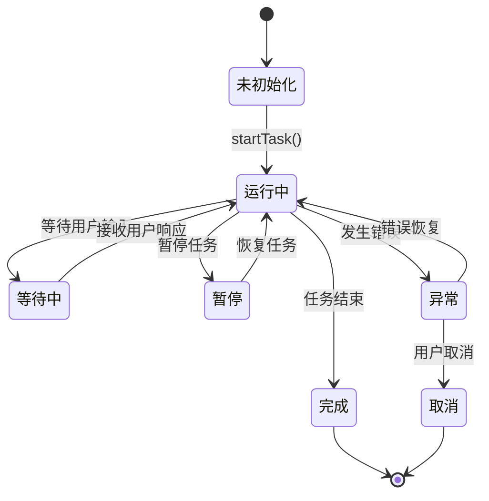
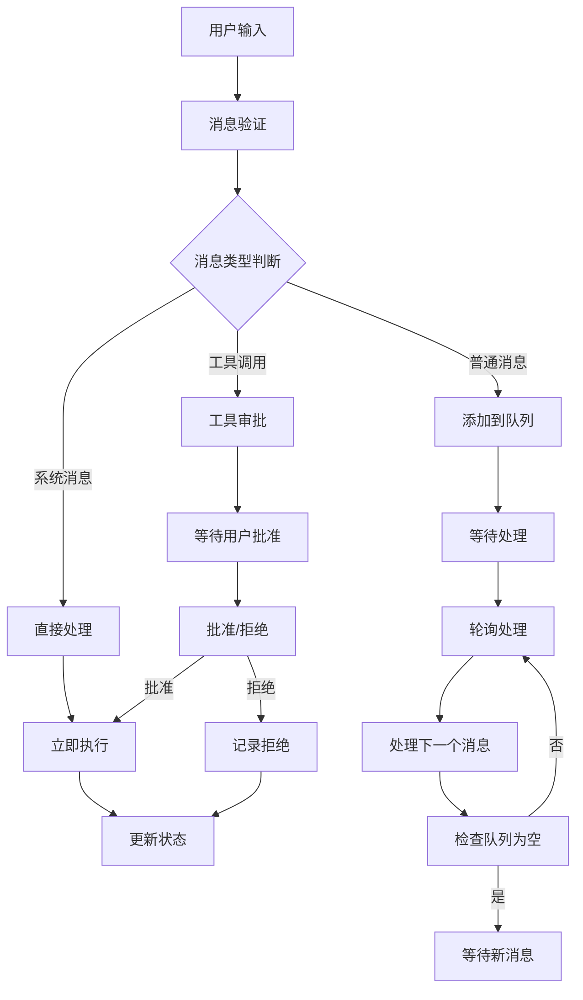
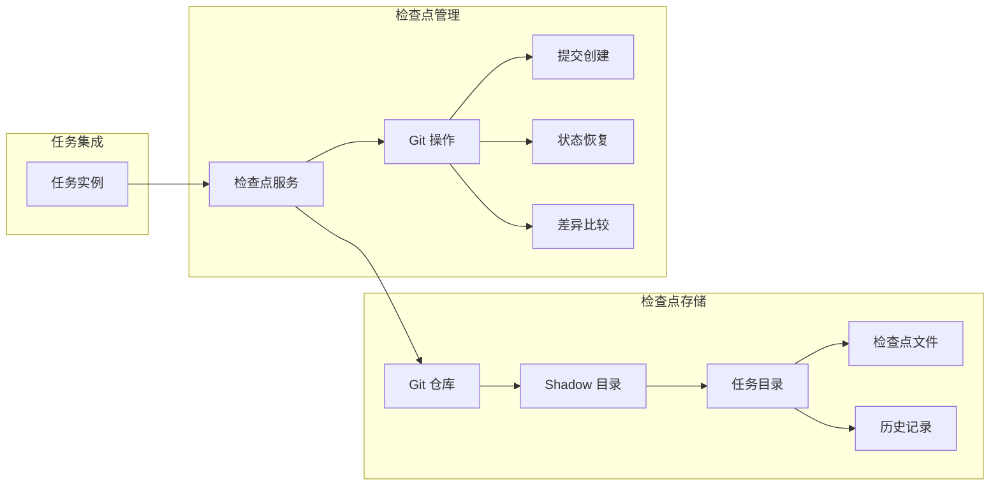
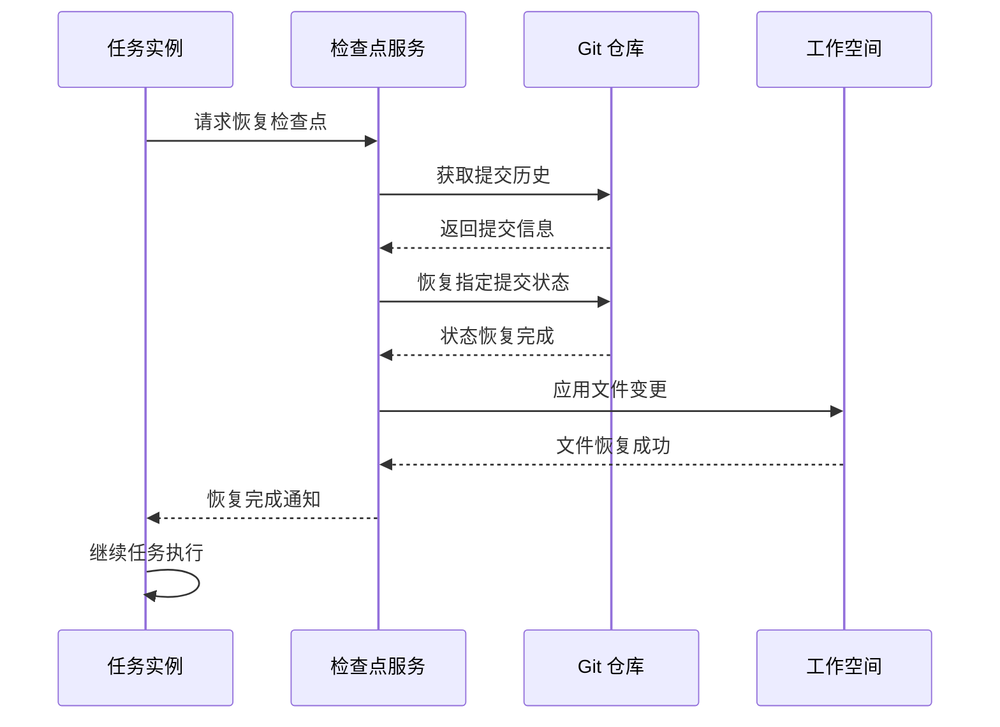
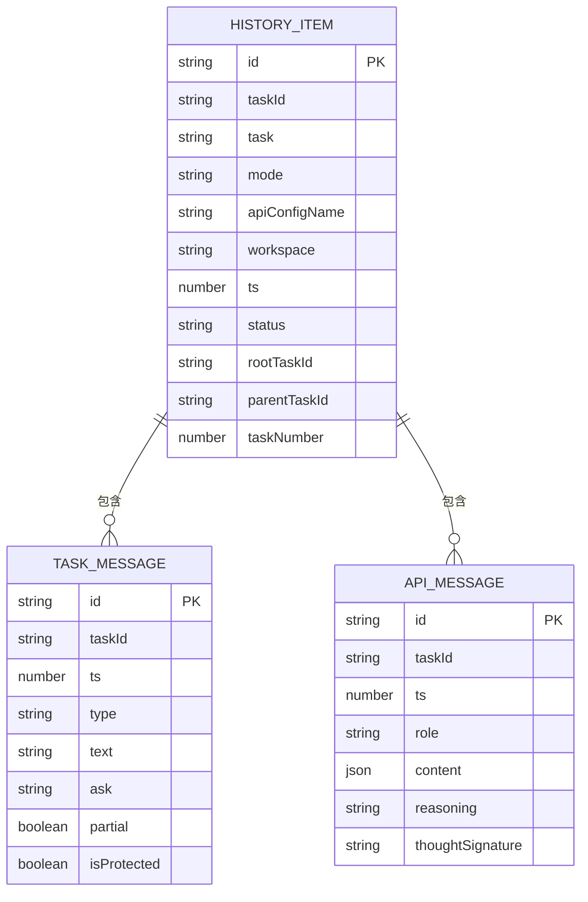
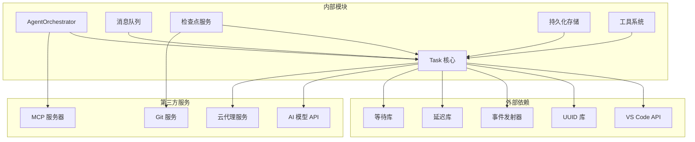

# 任务管理系统

<cite>
**本文档引用的文件**
- [Task.ts](file://src/core/task/Task.ts)
- [AgentOrchestrator.ts](file://src/core/agent/AgentOrchestrator.ts)
- [types.ts](file://src/core/agent/types.ts)
- [TaskHistoryStore.ts](file://src/core/task-persistence/TaskHistoryStore.ts)
- [index.ts](file://src/core/task-persistence/index.ts)
- [MessageQueueService.ts](file://src/core/message-queue/MessageQueueService.ts)
- [index.ts](file://src/core/checkpoints/index.ts)
- [RepoPerTaskCheckpointService.ts](file://src/services/checkpoints/RepoPerTaskCheckpointService.ts)
- [checkpointRestoreHandler.ts](file://src/core/webview/checkpointRestoreHandler.ts)
- [AGENT_LOOP.md](file://apps/cli/docs/AGENT_LOOP.md)
- [agent-state.ts](file://apps/cli/src/agent/agent-state.ts)
</cite>

## 目录
1. [简介](#简介)
2. [项目结构](#项目结构)
3. [核心组件](#核心组件)
4. [架构概览](#架构概览)
5. [详细组件分析](#详细组件分析)
6. [依赖关系分析](#依赖关系分析)
7. [性能考虑](#性能考虑)
8. [故障排除指南](#故障排除指南)
9. [结论](#结论)

## 简介

任务管理系统是一个基于 VS Code 扩展的智能任务执行平台，集成了 AI 模型对话、工具调用、并行任务执行和持久化存储等功能。该系统支持多种任务模式，包括本地任务、云端代理任务和混合模式，提供完整的任务生命周期管理。

系统的核心特性包括：
- **任务生命周期管理**：从创建、执行到完成的完整生命周期
- **并行任务执行**：AgentOrchestrator 支持多 Agent 并行执行
- **智能状态转换**：基于状态机的任务状态管理
- **持久化存储**：完整的任务历史和检查点管理
- **消息处理机制**：高效的队列消息处理和流式传输
- **上下文共享**：跨任务的上下文信息共享机制

## 项目结构

项目采用模块化的架构设计，主要分为以下几个核心模块：

**图表来源**
- [Task.ts:176-587](file://src/core/task/Task.ts#L176-L587)
- [AgentOrchestrator.ts:39-287](file://src/core/agent/AgentOrchestrator.ts#L39-L287)

**章节来源**
- [Task.ts:1-100](file://src/core/task/Task.ts#L1-L100)
- [AgentOrchestrator.ts:1-50](file://src/core/agent/AgentOrchestrator.ts#L1-L50)

## 核心组件

### Task 类设计架构

Task 类是整个任务管理系统的核心，实现了完整的任务生命周期管理。其设计特点包括：

#### 主要职责
- **任务状态管理**：维护任务的完整生命周期状态
- **消息处理**：处理用户输入和 AI 输出的消息流
- **工具调用**：协调各种工具的执行和结果处理
- **上下文管理**：管理任务的上下文信息和环境变量
- **持久化支持**：提供任务数据的持久化和恢复能力

#### 关键接口设计

**图表来源**
- [Task.ts:176-587](file://src/core/task/Task.ts#L176-L587)
- [MessageQueueService.ts:17-99](file://src/core/message-queue/MessageQueueService.ts#L17-L99)
- [RepoPerTaskCheckpointService.ts:6-15](file://src/services/checkpoints/RepoPerTaskCheckpointService.ts#L6-L15)

**章节来源**
- [Task.ts:176-587](file://src/core/task/Task.ts#L176-L587)
- [MessageQueueService.ts:1-99](file://src/core/message-queue/MessageQueueService.ts#L1-L99)

### AgentOrchestrator 并行执行模式

AgentOrchestrator 是系统的核心调度器，负责管理多个 Agent 的并行执行：

#### 并行执行策略
- **独立任务执行**：每个 Agent 在独立的任务实例中运行
- **依赖管理**：支持任务间的依赖关系和执行顺序
- **资源隔离**：确保并行任务间的资源隔离和状态独立
- **结果聚合**：收集和整合各个 Agent 的执行结果

#### 上下文共享机制

**图表来源**
- [AgentOrchestrator.ts:61-96](file://src/core/agent/AgentOrchestrator.ts#L61-L96)
- [AgentOrchestrator.ts:116-176](file://src/core/agent/AgentOrchestrator.ts#L116-L176)

**章节来源**
- [AgentOrchestrator.ts:39-287](file://src/core/agent/AgentOrchestrator.ts#L39-L287)
- [types.ts:52-68](file://src/core/agent/types.ts#L52-L68)

## 架构概览

系统采用分层架构设计，各层之间职责清晰，耦合度低：

**图表来源**
- [Task.ts:1-100](file://src/core/task/Task.ts#L1-L100)
- [AgentOrchestrator.ts:1-50](file://src/core/agent/AgentOrchestrator.ts#L1-L50)

## 详细组件分析

### 任务生命周期管理

任务生命周期是系统的核心概念，涵盖了从任务创建到完成的完整过程：

#### 生命周期状态转换

**图表来源**
- [AGENT_LOOP.md:116-142](file://apps/cli/docs/AGENT_LOOP.md#L116-L142)
- [agent-state.ts:48-46](file://apps/cli/src/agent/agent-state.ts#L48-L46)

#### 状态管理机制

任务状态管理通过事件驱动的方式实现，确保状态转换的原子性和一致性：

**章节来源**
- [Task.ts:1917-1990](file://src/core/task/Task.ts#L1917-L1990)
- [Task.ts:2000-2223](file://src/core/task/Task.ts#L2000-L2223)

### 消息处理机制

系统实现了高效的消息处理机制，支持实时通信和异步处理：

#### 消息队列设计

**图表来源**
- [MessageQueueService.ts:36-84](file://src/core/message-queue/MessageQueueService.ts#L36-L84)

#### 流式消息处理

系统支持流式消息处理，能够实时显示 AI 的响应过程：

**章节来源**
- [MessageQueueService.ts:1-99](file://src/core/message-queue/MessageQueueService.ts#L1-L99)

### 检查点持久化系统

检查点系统提供了强大的任务恢复能力，确保任务执行的可靠性和连续性：

#### 检查点存储架构

**图表来源**
- [RepoPerTaskCheckpointService.ts:6-15](file://src/services/checkpoints/RepoPerTaskCheckpointService.ts#L6-L15)
- [index.ts:28-130](file://src/core/checkpoints/index.ts#L28-L130)

#### 恢复流程设计

**图表来源**
- [index.ts:237-302](file://src/core/checkpoints/index.ts#L237-L302)

**章节来源**
- [index.ts:1-393](file://src/core/checkpoints/index.ts#L1-L393)
- [checkpointRestoreHandler.ts:35-75](file://src/core/webview/checkpointRestoreHandler.ts#L35-L75)

### 历史记录管理系统

历史记录系统提供了完整的任务历史追踪和管理功能：

#### 数据存储结构

**图表来源**
- [TaskHistoryStore.ts:14-18](file://src/core/task-persistence/TaskHistoryStore.ts#L14-L18)
- [index.ts:1-5](file://src/core/task-persistence/index.ts#L1-L5)

**章节来源**
- [TaskHistoryStore.ts:44-573](file://src/core/task-persistence/TaskHistoryStore.ts#L44-L573)
- [index.ts:1-5](file://src/core/task-persistence/index.ts#L1-L5)

## 依赖关系分析

系统采用模块化设计，各组件之间的依赖关系清晰明确：

**图表来源**
- [Task.ts:1-100](file://src/core/task/Task.ts#L1-L100)
- [AgentOrchestrator.ts:1-50](file://src/core/agent/AgentOrchestrator.ts#L1-L50)

**章节来源**
- [Task.ts:1-100](file://src/core/task/Task.ts#L1-L100)
- [AgentOrchestrator.ts:1-50](file://src/core/agent/AgentOrchestrator.ts#L1-L50)

## 性能考虑

系统在设计时充分考虑了性能优化，采用了多种技术手段提升执行效率：

### 内存管理优化
- **对象池模式**：复用任务实例和消息对象
- **懒加载机制**：按需加载大型数据结构
- **垃圾回收优化**：及时释放不再使用的资源

### 并发处理优化
- **异步操作**：所有 I/O 操作都采用异步方式
- **背压控制**：防止消息队列过载
- **资源限制**：控制同时运行的任务数量

### 存储优化
- **增量保存**：只保存变化的数据
- **批量操作**：减少磁盘 I/O 次数
- **缓存策略**：合理使用内存缓存

## 故障排除指南

### 常见问题及解决方案

#### 任务无法启动
**症状**：任务创建后无法开始执行
**可能原因**：
- AI 模型配置错误
- 网络连接问题
- 权限不足

**解决步骤**：
1. 检查 AI 模型配置是否正确
2. 验证网络连接状态
3. 确认用户权限设置

#### 消息处理异常
**症状**：消息发送后无响应或响应错误
**可能原因**：
- 消息队列阻塞
- 工具调用失败
- 状态同步问题

**解决步骤**：
1. 检查消息队列状态
2. 查看工具调用日志
3. 验证任务状态同步

#### 检查点恢复失败
**症状**：任务恢复时出现文件不一致
**可能原因**：
- Git 仓库损坏
- 文件权限问题
- 恢复目标版本冲突

**解决步骤**：
1. 检查 Git 仓库状态
2. 验证文件权限设置
3. 尝试手动恢复文件

**章节来源**
- [Task.ts:2248-2280](file://src/core/task/Task.ts#L2248-L2280)
- [index.ts:121-130](file://src/core/checkpoints/index.ts#L121-L130)

## 结论

任务管理系统通过精心设计的架构和完善的组件实现，为用户提供了一个强大而灵活的任务执行平台。系统的主要优势包括：

1. **完整的生命周期管理**：从创建到完成的全周期支持
2. **强大的并行处理能力**：支持多 Agent 协同工作
3. **可靠的持久化机制**：确保任务执行的连续性和可靠性
4. **灵活的状态管理**：适应各种复杂的任务场景
5. **优秀的性能表现**：优化的内存和并发处理机制

系统的模块化设计使得扩展和维护变得简单，为未来的功能增强奠定了良好的基础。通过持续的优化和改进，该系统能够满足各种复杂任务管理需求，为用户提供卓越的使用体验。