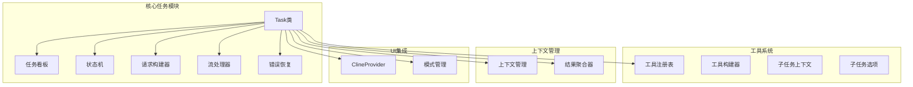
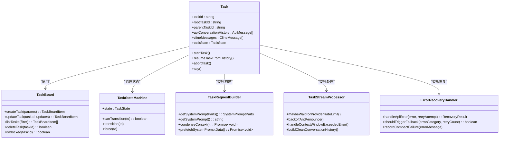
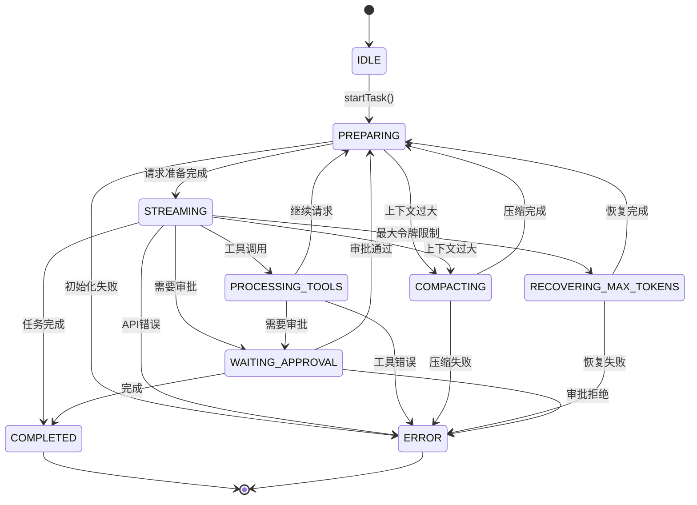
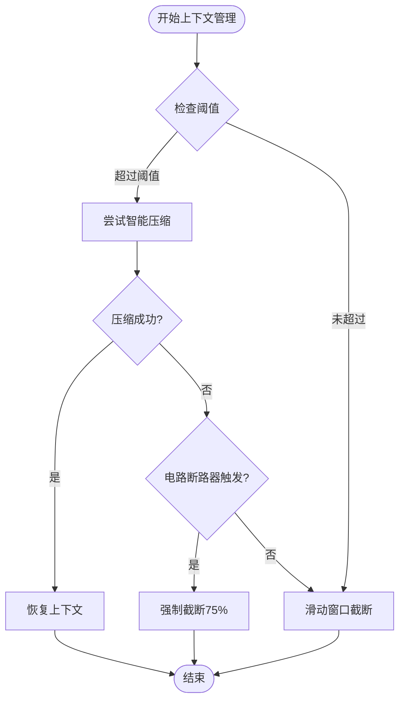
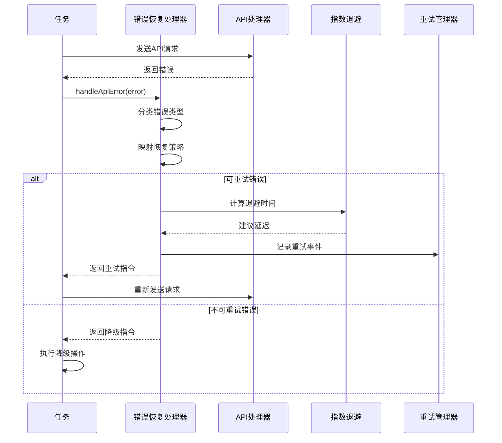
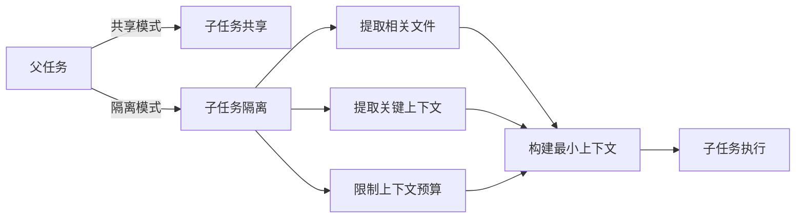
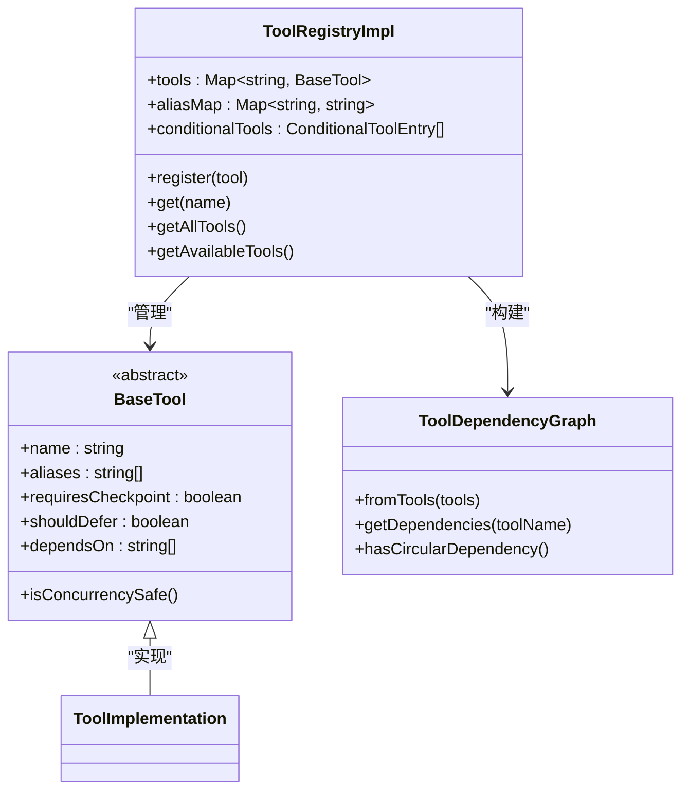
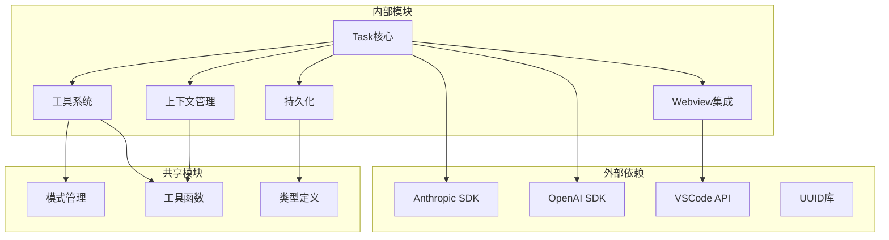

# 增强任务管理系统

<cite>
**本文档引用的文件**
- [Task.ts](file://src/core/task/Task.ts)
- [TaskBoard.ts](file://src/core/task/TaskBoard.ts)
- [TaskStateMachine.ts](file://src/core/task/TaskStateMachine.ts)
- [TaskRequestBuilder.ts](file://src/core/task/TaskRequestBuilder.ts)
- [TaskStreamProcessor.ts](file://src/core/task/TaskStreamProcessor.ts)
- [ErrorRecoveryHandler.ts](file://src/core/task/ErrorRecoveryHandler.ts)
- [SubTaskContextBuilder.ts](file://src/core/task/SubTaskContextBuilder.ts)
- [SubTaskOptions.ts](file://src/core/task/SubTaskOptions.ts)
- [build-tools.ts](file://src/core/task/build-tools.ts)
- [TaskResultAggregator.ts](file://src/core/task/TaskResultAggregator.ts)
- [context-management/index.ts](file://src/core/context-management/index.ts)
- [ClineProvider.ts](file://src/core/webview/ClineProvider.ts)
- [ToolRegistry.ts](file://src/core/tools/ToolRegistry.ts)
- [modes.ts](file://src/shared/modes.ts)
</cite>

## 目录
1. [项目概述](#项目概述)
2. [项目结构](#项目结构)
3. [核心组件](#核心组件)
4. [架构概览](#架构概览)
5. [详细组件分析](#详细组件分析)
6. [依赖关系分析](#依赖关系分析)
7. [性能考虑](#性能考虑)
8. [故障排除指南](#故障排除指南)
9. [结论](#结论)

## 项目概述

增强任务管理系统是一个基于VSCode扩展的智能任务管理平台，集成了AI代理、工具调用、上下文管理和错误恢复等高级功能。该系统通过模块化设计实现了高度可扩展的任务处理能力，支持多层子任务管理、智能上下文压缩、并发工具执行和持久化状态管理。

系统的核心特性包括：
- **多层任务架构**：支持主任务和子任务的嵌套管理
- **智能上下文管理**：自动压缩和恢复对话历史
- **并发工具执行**：支持多个工具的并行调用
- **错误恢复机制**：完善的异常处理和重试策略
- **持久化存储**：任务历史和状态的可靠保存

## 项目结构

**图表来源**
- [Task.ts:198-665](file://src/core/task/Task.ts#L198-665)
- [TaskBoard.ts:44-245](file://src/core/task/TaskBoard.ts#L44-245)
- [ClineProvider.ts:128-314](file://src/core/webview/ClineProvider.ts#L128-314)

**章节来源**
- [Task.ts:1-800](file://src/core/task/Task.ts#L1-800)
- [TaskBoard.ts:1-246](file://src/core/task/TaskBoard.ts#L1-246)

## 核心组件

### 任务管理系统核心架构

系统采用委托模式和模块化设计，将复杂的功能分解为独立的组件：

1. **Task类** - 主要任务控制器，管理整个任务生命周期
2. **TaskBoard类** - 轻量级任务看板，提供JSON文件持久化
3. **TaskStateMachine类** - 状态机管理任务状态转换
4. **TaskRequestBuilder类** - 系统提示词构建和缓存管理
5. **TaskStreamProcessor类** - 流式处理和错误恢复逻辑
6. **ErrorRecoveryHandler类** - 结构化的错误分类和恢复策略

**章节来源**
- [Task.ts:198-665](file://src/core/task/Task.ts#L198-665)
- [TaskStateMachine.ts:1-58](file://src/core/task/TaskStateMachine.ts#L1-58)
- [TaskRequestBuilder.ts:35-378](file://src/core/task/TaskRequestBuilder.ts#L35-378)
- [TaskStreamProcessor.ts:36-557](file://src/core/task/TaskStreamProcessor.ts#L36-557)
- [ErrorRecoveryHandler.ts:25-331](file://src/core/task/ErrorRecoveryHandler.ts#L25-331)

## 架构概览

**图表来源**
- [Task.ts:198-665](file://src/core/task/Task.ts#L198-665)
- [TaskBoard.ts:44-245](file://src/core/task/TaskBoard.ts#L44-245)
- [TaskStateMachine.ts:36-57](file://src/core/task/TaskStateMachine.ts#L36-57)
- [TaskRequestBuilder.ts:35-378](file://src/core/task/TaskRequestBuilder.ts#L35-378)
- [TaskStreamProcessor.ts:36-557](file://src/core/task/TaskStreamProcessor.ts#L36-557)
- [ErrorRecoveryHandler.ts:25-331](file://src/core/task/ErrorRecoveryHandler.ts#L25-331)

## 详细组件分析

### 任务状态管理

系统实现了完整的任务状态机，确保任务在不同状态间的正确转换：

**图表来源**
- [TaskStateMachine.ts:1-58](file://src/core/task/TaskStateMachine.ts#L1-58)

**章节来源**
- [TaskStateMachine.ts:1-58](file://src/core/task/TaskStateMachine.ts#L1-58)

### 上下文管理机制

系统实现了智能的上下文压缩和恢复机制：

**图表来源**
- [context-management/index.ts:456-643](file://src/core/context-management/index.ts#L456-643)

**章节来源**
- [context-management/index.ts:1-644](file://src/core/context-management/index.ts#L1-644)

### 错误恢复策略

系统提供了多层次的错误恢复机制：

**图表来源**
- [ErrorRecoveryHandler.ts:36-208](file://src/core/task/ErrorRecoveryHandler.ts#L36-208)
- [TaskStreamProcessor.ts:121-222](file://src/core/task/TaskStreamProcessor.ts#L121-222)

**章节来源**
- [ErrorRecoveryHandler.ts:1-331](file://src/core/task/ErrorRecoveryHandler.ts#L1-331)
- [TaskStreamProcessor.ts:1-557](file://src/core/task/TaskStreamProcessor.ts#L1-557)

### 子任务隔离机制

系统支持子任务的上下文隔离，防止父任务上下文污染：

**图表来源**
- [SubTaskContextBuilder.ts:86-97](file://src/core/task/SubTaskContextBuilder.ts#L86-97)
- [SubTaskOptions.ts:14-54](file://src/core/task/SubTaskOptions.ts#L14-54)

**章节来源**
- [SubTaskContextBuilder.ts:1-291](file://src/core/task/SubTaskContextBuilder.ts#L1-291)
- [SubTaskOptions.ts:1-85](file://src/core/task/SubTaskOptions.ts#L1-85)

### 工具系统架构

**图表来源**
- [ToolRegistry.ts:27-220](file://src/core/tools/ToolRegistry.ts#L27-220)

**章节来源**
- [ToolRegistry.ts:1-220](file://src/core/tools/ToolRegistry.ts#L1-220)
- [build-tools.ts:85-231](file://src/core/task/build-tools.ts#L85-231)

## 依赖关系分析

**图表来源**
- [Task.ts:12-18](file://src/core/task/Task.ts#L12-18)
- [ClineProvider.ts:128-131](file://src/core/webview/ClineProvider.ts#L128-131)

**章节来源**
- [Task.ts:1-800](file://src/core/task/Task.ts#L1-800)
- [ClineProvider.ts:1-800](file://src/core/webview/ClineProvider.ts#L1-800)

## 性能考虑

系统在多个层面实现了性能优化：

### 缓存策略
- **系统提示词缓存**：30秒有效期的系统提示词部分缓存
- **工具定义缓存**：全局工具模式缓存，避免重复构建
- **令牌使用快照**：去抖动的令牌使用更新机制

### 并发控制
- **工具并发执行**：默认最大10个并发工具调用
- **写入锁**：进程内写入锁防止文件竞争
- **指数退避**：API请求的指数退避机制

### 内存管理
- **智能上下文压缩**：动态阈值调整避免内存溢出
- **任务历史清理**：定期清理过期任务文件
- **资源释放**：完整的资源清理和销毁机制

## 故障排除指南

### 常见问题诊断

1. **任务状态异常**
   - 检查状态机转换日志
   - 验证任务初始化参数
   - 查看事件监听器注册情况

2. **API调用失败**
   - 分析错误分类结果
   - 检查重试计数和退避时间
   - 验证令牌使用限制

3. **上下文管理问题**
   - 检查智能压缩是否被电路断路器阻止
   - 验证滑动窗口截断逻辑
   - 查看缓存命中率

**章节来源**
- [ErrorRecoveryHandler.ts:232-252](file://src/core/task/ErrorRecoveryHandler.ts#L232-252)
- [TaskStreamProcessor.ts:284-408](file://src/core/task/TaskStreamProcessor.ts#L284-408)

### 调试技巧

- 使用`console.log`输出关键状态变化
- 利用`debounce`函数进行性能监控
- 检查`globalCacheMetrics`和`globalQueryProfiler`
- 监控`persistentRetryManager`的状态

## 结论

增强任务管理系统通过模块化设计和委托模式实现了高度可扩展的任务处理能力。系统的关键优势包括：

1. **完整的生命周期管理**：从创建到完成的全生命周期跟踪
2. **智能上下文管理**：自动压缩和恢复对话历史
3. **强大的错误恢复**：多层次的异常处理和重试策略
4. **灵活的工具系统**：支持并发执行和依赖管理
5. **可靠的持久化**：任务历史和状态的持久化存储

该系统为复杂的AI代理应用提供了坚实的基础架构，支持从简单任务到复杂多步骤工作流的各种应用场景。通过持续的模块化改进和性能优化，系统能够适应不断增长的功能需求和技术挑战。